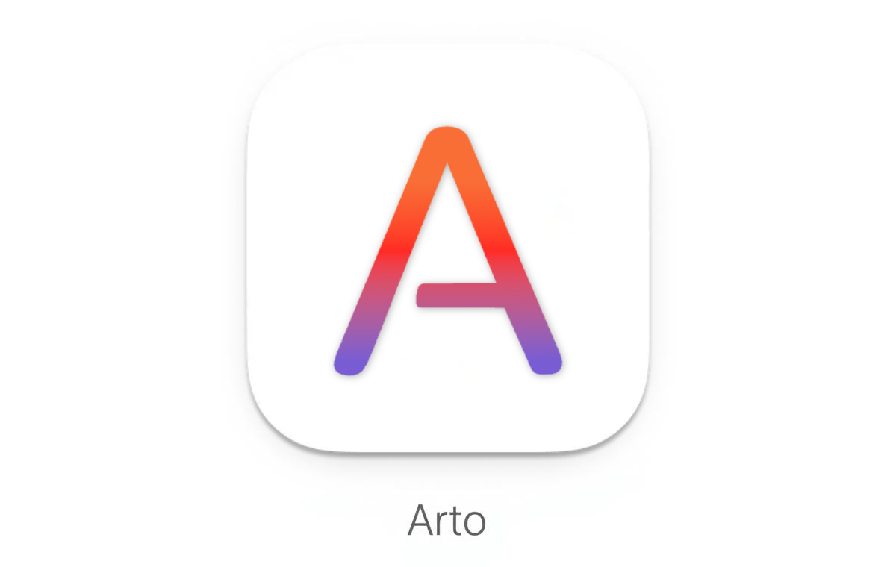

<p align="center">
  
</p>

**Arto — the Art of Reading Markdown.**

A local app that faithfully recreates GitHub-style Markdown rendering for a beautiful reading experience.

## Philosophy

Markdown has become more than a lightweight markup language — it's the medium for documentation, communication, and thinking in the developer's world. While most tools focus on _writing_ Markdown, **Arto is designed for _reading_ it beautifully**.

The name "Arto" comes from "Art of Reading" — reflecting the philosophy that reading Markdown is not just a utility task, but a quiet, deliberate act of understanding and appreciation.

Arto faithfully reproduces GitHub's Markdown rendering in a local, offline environment, offering a calm and precise reading experience with thoughtful typography and balanced whitespace.

> [!WARNING]
> **Beta Software Notice**
>
> - This application is still in **beta** and may contain bugs or unstable behavior. Features may change without regard to backward compatibility.
> - **macOS Only**: This application is currently designed exclusively for macOS and does not support other platforms. However, cross-platform support is a long-term goal, and **PRs are welcome**.

## Features

### Core Reading Experience

- **GitHub-Style Rendering** — Accurate reproduction of GitHub's Markdown styling with full support for extended syntax
- **Native Performance** — Built with Rust for fast, responsive rendering
- **Auto-Reload** — Automatically updates when the file changes on disk
- **Offline First** — No internet connection required — read your docs anytime, anywhere

### Navigation & Organization

- **File Explorer** — Built-in sidebar with file tree navigation for browsing local directories
- **Quick Access** — Bookmark frequently used files and directories for instant access
- **Directory History** — Back/forward navigation within the sidebar file explorer
- **Table of Contents** — Automatic TOC panel for easy document navigation
- **Live Navigation** — Navigate between linked markdown documents with history support (back/forward)

### Search & Discovery

- **Find in Page** — Search within documents with `Cmd+F`
- **Pinned Search** — Pin search queries with persistent multi-color highlighting across sessions

### Window & Tab Management

- **Tab Support** — Open and manage multiple documents in tabs within a single window
- **Multi-Window** — Create multiple windows and open child windows for diagrams
- **Cross-Window Tabs** — Drag and drop tabs between windows
- **Drag & Drop** — Simply drag markdown files onto the window to open them

### Advanced Rendering

- **Mermaid Diagrams** — Interactive diagram viewer with zoom, pan, and copy-as-image
- **Math Expressions** — Beautiful KaTeX rendering for mathematical notation
- **Code Highlighting** — Syntax highlighting with copy button for code blocks
- **Frontmatter** — Renders YAML frontmatter as a styled, collapsible table
- **GitHub Alerts** — Full support for NOTE, TIP, IMPORTANT, WARNING, and CAUTION alerts

### Customization

- **Dark Mode** — Manual and automatic theme switching based on system preferences
- **Zoom Controls** — Keyboard shortcuts and trackpad gestures for zoom
- **Preferences** — Configurable settings for sidebar, TOC, and more
- **Context Menus** — Right-click menus for quick actions on files and content

### Keyboard Shortcuts

Shortcuts are stored in `mappings.json` (next to `config.json` in the app config
directory) and come in two kinds:

- **Menu shortcuts** (`menuShortcuts`) — native OS menu accelerators. Single
  chord only (e.g. `Cmd+o`), shown in the menu bar, dispatched by the system, so
  they work even when no window has keyboard focus (e.g. `Cmd+n` with all windows
  closed). Keyed by a menu action such as `file.open`.
- **Keybindings** (`global` and the per-context sections) — handled by the
  in-window engine. Support chord sequences (e.g. vim `g g`) and per-context
  behavior, but only fire while a document window has focus.

The same action may appear in both — for example `file.open` can be a native
`Cmd+o` menu shortcut and additionally have an in-window keybinding.

**Migrating an older `mappings.json`:** files written before `menuShortcuts`
existed still load unchanged. Menu-backed shortcuts you had under `global`
(e.g. `Cmd+o`, `Cmd+n`) keep working via the engine, but to get native menu
accelerators move those entries into a `menuShortcuts` section, or re-apply a
preset (Default / Vim / Emacs) from Preferences.

### macOS Integration

- **Quick Look** — Press Space on any Markdown file in Finder to get a rendered preview
- **Finder Preview Pane** — Markdown files display rendered HTML in the Finder sidebar preview pane

## Installation

### macOS

Use [Homebrew] tap to install. Since the application is not signed or notarized with an Apple Developer ID, you'll need to remove the quarantine attribute after installation.
See [homebrew-tap] for more information.

```
brew install --cask arto-app/tap/arto
xattr -dr com.apple.quarantine /Applications/Arto.app
```

> [!TIP]
> **Quick Look preview not showing?** macOS normally registers the Quick Look
> extension the first time you launch Arto. If pressing Space on a Markdown file
> still shows no preview — or a stale one right after an upgrade — register the
> extension manually and refresh the cache:
>
> ```sh
> pluginkit -a /Applications/Arto.app/Contents/PlugIns/ArtoQuickLook.appex
> qlmanage -r && qlmanage -r cache
> ```

### Linux

On Debian and Ubuntu, download the `.deb` matching your architecture from the
[releases] page and install it with `apt`, which pulls in the GTK/WebKit
libraries it declares:

```
sudo apt install ./arto_<version>_amd64.deb
```

On every other distribution — Fedora, openSUSE, Arch — download the
`.AppImage` instead, make it executable and run it:

```
chmod +x arto_<version>_x86_64.AppImage
./arto_<version>_x86_64.AppImage
```

The AppImage needs WebKitGTK 4.1 present on the system; on Fedora that is
`sudo dnf install webkit2gtk4.1`.

Both artifacts are built on Ubuntu 24.04, so they require glibc 2.39 or newer
(Ubuntu 24.04+, Debian 13+, Fedora 40+). On older distributions, build from
source or use the Nix package below.

### Nix

[Nix] is supported on both macOS and Linux.
To try it without a permanent installation:

```
nix run github:arto-app/Arto
```

For a permanent installation, use [nix-darwin] or [home-manager].
Add the following to your flake inputs:

```nix
arto.url = "github:arto-app/Arto";
```

Then add it to `environment.systemPackages` (nix-darwin) or `home.packages` (home-manager):

```nix
environment.systemPackages = [ inputs.arto.packages.${system}.default ];
```

Launch the application to see the welcome screen with keyboard shortcuts and usage instructions.

## Usage

After installation, the `arto` command becomes available in your terminal:

```
arto                     # Launch Arto (shows welcome screen)
arto README.md           # Open a specific file
arto --open=screen README.md
arto --open=new README.md
arto --directory=. README.md
arto docs/               # Open a directory in the file explorer
arto file1.md file2.md   # Open multiple files in tabs
```

Arto runs as a **single instance** — if Arto is already running, the command sends requests to the existing process instead of launching a new one.

- `arto FILE` uses `last_focused` behavior by default (reuse last focused visible window).
- `--open=screen` opens on/reuses a visible window on the cursor's current screen.
- `--open=new` always opens in a new window.
- `--directory=DIR` sets the FileExplorer root directory for that invocation.
- Positional directory arguments (e.g. `arto docs/`) also set the root directory.
- Running `arto` without arguments shows/focuses an existing window if hidden, or opens one if none exists.

### Rendering to a standalone HTML page

`arto page` renders a Markdown file into a single HTML file that carries Arto's stylesheet and rendering code inline, so it opens in any browser without the app (Mermaid diagrams and math included):

```
arto page README.md > README.html
arto page --output out.html docs/guide.md
arto page --theme dark notes.md
```

The page follows your `config.json` (rendering options and default theme), so it looks the way the app shows the file; `--theme`, `--no-auto-link-urls` and friends override individual settings, `--config FILE` reads another file, and `--no-config` starts from the built-in defaults. The Quick Look preview on macOS reads the same configuration when its sandbox allows.

The page ships with a Content-Security-Policy that blocks any script embedded in the Markdown; pass `--no-csp` only for input you trust. The same command is available as the standalone `arto-page` binary (the `arto-page` crate) for machines without the app.

[Homebrew]: https://brew.sh/
[homebrew-tap]: https://github.com/arto-app/homebrew-tap
[releases]: https://github.com/arto-app/Arto/releases
[Nix]: https://nixos.org/
[nix-darwin]: https://github.com/nix-darwin/nix-darwin
[home-manager]: https://github.com/nix-community/home-manager

## Official Website

Visit [arto-app.github.io](https://arto-app.github.io) for screenshots, feature highlights, and more.

## Contributing

See [CONTRIBUTING.md](CONTRIBUTING.md) for development setup and guidelines.

## License

See [LICENSE](LICENSE) file for details.
