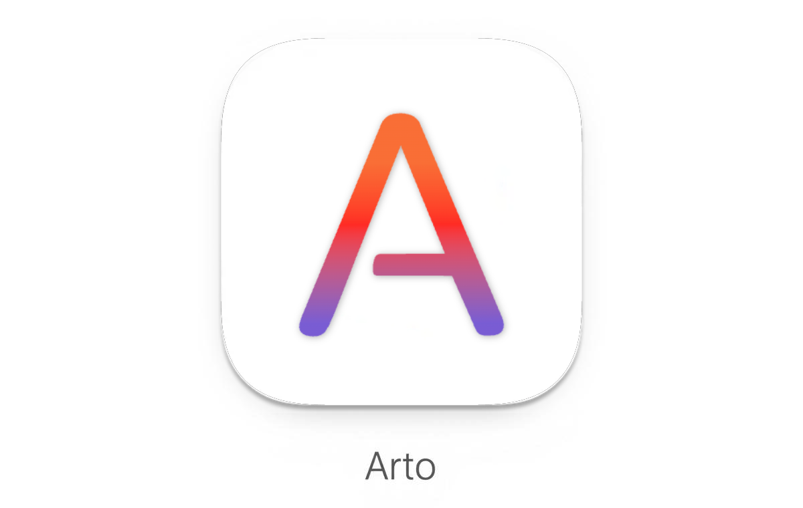
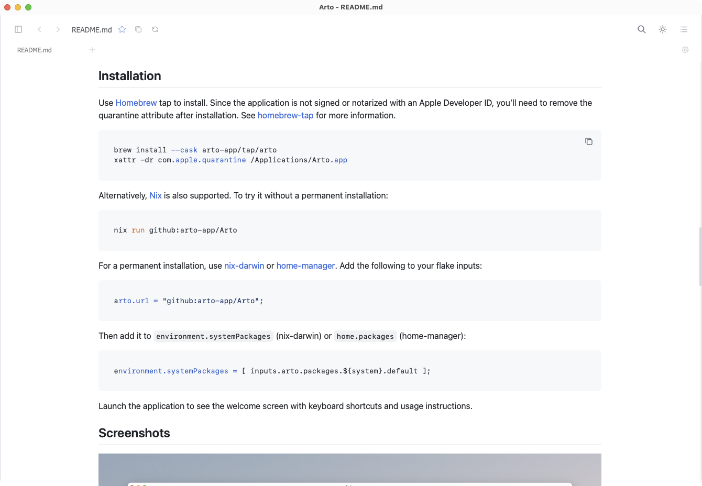
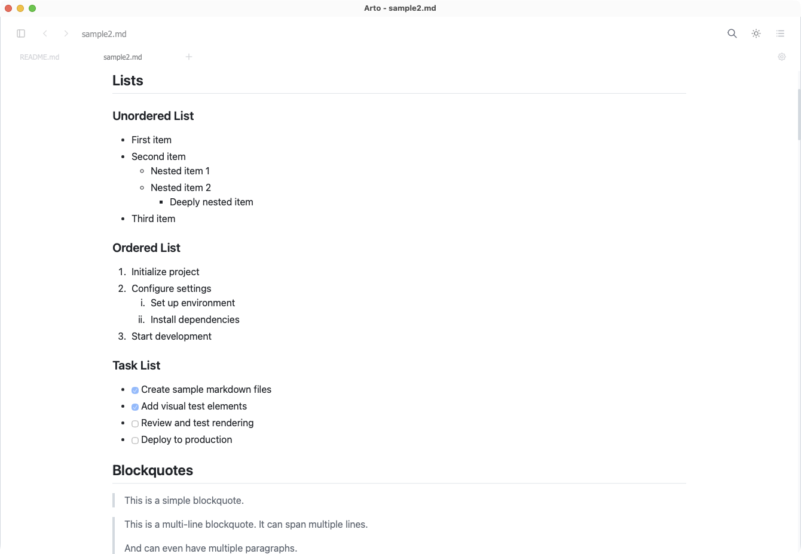
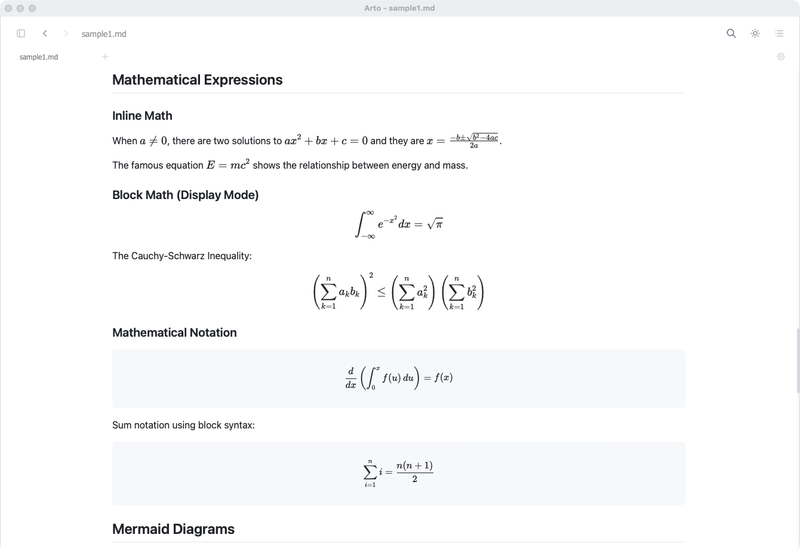
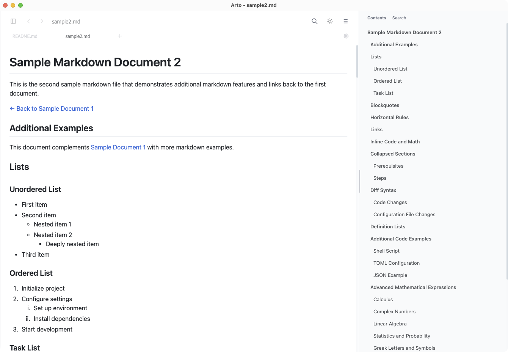
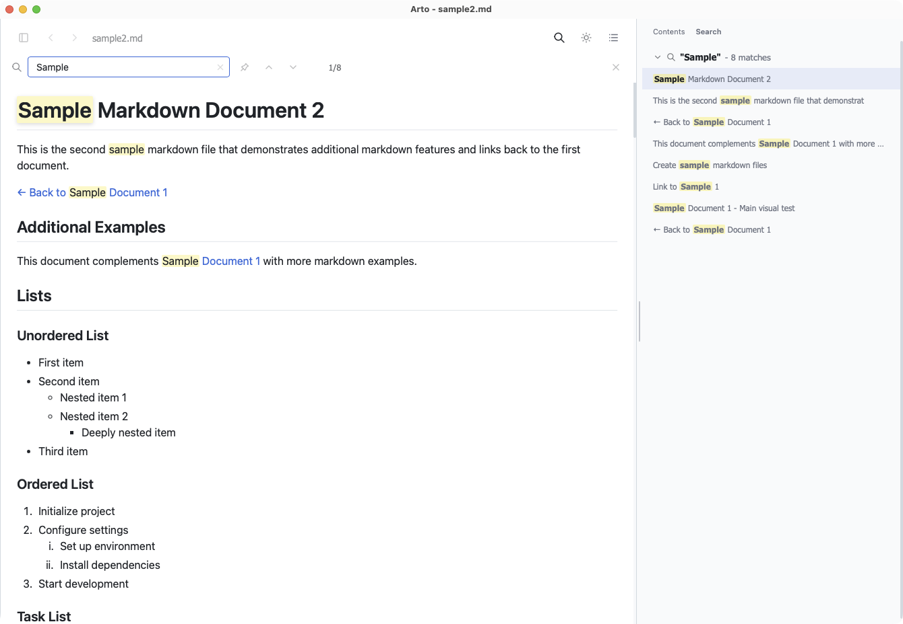

<p align="center">
  <picture>
    <source media="(prefers-color-scheme: dark)" srcset="docs/images/arto-header-readme-dark.png">
    
  </picture>
</p>

<p align="center">
  <strong>Arto — the Art of Reading Markdown.</strong><br>
  A desktop app that renders Markdown the way GitHub does, locally and offline.
</p>

<p align="center">
  <a href="https://arto-app.github.io"><strong>Website</strong></a> ·
  <a href="./docs/installation.md">Install</a> ·
  <a href="./docs/cli.md">CLI</a> ·
  <a href="./docs/keybindings.md">Keybindings</a> ·
  <a href="./CONTRIBUTING.md">Contributing</a>
</p>

<p align="center">
  
</p>

> [!WARNING]
> Arto is **beta**. Features may change without regard to backward compatibility. macOS is the platform it is developed and tested on; Linux and Windows builds exist but are **experimental** — see [Platform support](./docs/installation.md#platform-support).

## Why

Most Markdown tools are built for *writing*. Arto is built for **reading**: the name is short for "Art of Reading".

Markdown is where documentation, communication and thinking now live, and reading it deserves more than a preview pane. Arto reproduces GitHub's rendering locally and offline, with typography and whitespace chosen for long reading rather than for editing.

## Features

**Reading** — GitHub-accurate rendering with the extended syntax, auto-reload when the file changes on disk, and no network required.

**Getting around** — a file explorer over several folders at once, a reading history reachable four ways, bookmarks for the folders you keep returning to, a contents gutter beside the page, and back/forward across linked documents.

**Finding** — find in page, plus pinned searches that keep multi-colour highlights across sessions.

**Windows** — one document to a window, as many windows as you like, child windows for diagrams, and drag-and-drop to open.

**Rich content** — Mermaid diagrams in an interactive viewer with zoom, pan and copy-as-image; KaTeX math; syntax-highlighted code with a copy button; YAML frontmatter as a collapsible table; and GitHub alerts (`NOTE`, `TIP`, `IMPORTANT`, `WARNING`, `CAUTION`).

**Fitting in** — GitHub's own themes, including dimmed, high contrast and the colour-vision ones, with a separate choice for light and dark mode and the system deciding which applies; zoom by keyboard or trackpad, configurable preferences, context menus, and — on macOS — Quick Look and the Finder preview pane.

<p align="center">
  
  
  <br>
  
  
</p>

<p align="center"><em>Diagrams, the sidebar and multi-window in motion: <a href="https://arto-app.github.io">arto-app.github.io</a></em></p>

## Install

```sh
brew install --cask arto-app/tap/arto
xattr -dr com.apple.quarantine /Applications/Arto.app
```

Linux packages, a single binary for Linux and Windows, Nix, and why that second line is needed: [Installation](./docs/installation.md).

## From the terminal

Arto is a GUI application. The `arto` command hands files to it:

```sh
arto README.md
```

It also renders a Markdown file to a self-contained HTML page that opens in any browser without the app:

```sh
arto page README.md > README.html
```

Full flags and behaviour: [CLI usage](./docs/cli.md).

## Built with

- **[Dioxus]** — the Rust UI framework the whole application is written in. Native windows, menus and state, no Electron.
- **[ox-content]** — the Markdown engine. It renders GitHub's dialect, including autolinks, alerts, heading slugs and the tag filter, so Arto does not carry its own version of any of them.
- **[KaTeX]** and **[Mermaid]** for math and diagrams, drawn in the page as you reach them.

## Contributing

See [CONTRIBUTING.md](./CONTRIBUTING.md) for development setup and guidelines.

## License

See [LICENSE](./LICENSE).

[Dioxus]: https://dioxuslabs.com/
[ox-content]: https://github.com/ubugeeei-prod/ox-content
[KaTeX]: https://katex.org/
[Mermaid]: https://mermaid.js.org/
