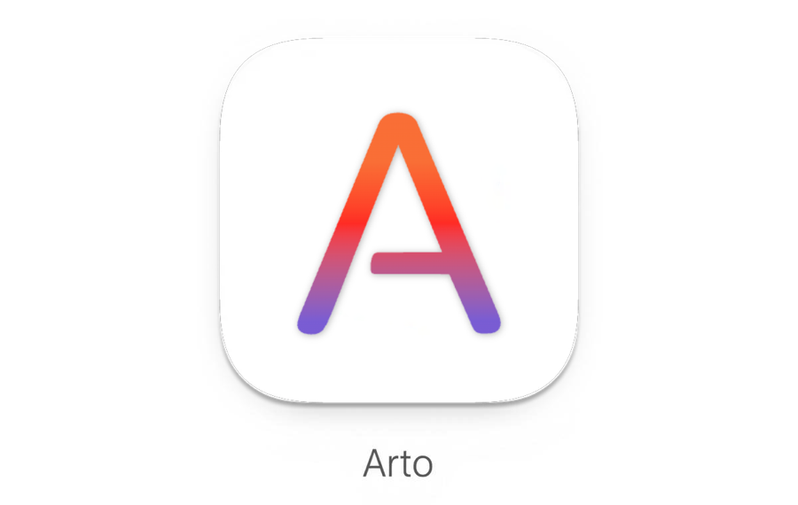

  <picture>
    <source media="(prefers-color-scheme: dark)" srcset="../assets/arto-header-welcome-dark.png">
    
  </picture>

  <strong>Arto — the Art of Reading Markdown.</strong> 
  A desktop app that renders Markdown the way GitHub does, locally and offline.

---

## Open a document

Drop a file or a folder onto this window, or run `arto <file>` or `arto <directory>` from the terminal.

  <table>
    <tr><td><code>{{file.open}}</code></td><td>Open a file</td></tr>
    <tr><td><code>{{file.open_directory}}</code></td><td>Open a directory, with the file explorer</td></tr>
    <tr><td><code>{{tab.new}}</code></td><td>Open a new tab</td></tr>
    <tr><td><code>{{window.toggle_sidebar}}</code></td><td>Toggle the file explorer</td></tr>
  </table>

## Keyboard shortcuts

These are the shortcuts as currently bound. Change them in Preferences → Keybindings; `{{help.show_keyboard_shortcuts}}` lists every one of them.

  

    <table>
      <tr><td><code>{{search.open}}</code></td><td>Find in page</td></tr>
      <tr><td><code>{{zoom.reset}}</code></td><td>Actual size</td></tr>
      <tr><td><code>{{zoom.in}}</code></td><td>Zoom in</td></tr>
      <tr><td><code>{{zoom.out}}</code></td><td>Zoom out</td></tr>
    </table>
    
Reading

  

  

    <table>
      <tr><td><code>{{history.back}}</code></td><td>Back</td></tr>
      <tr><td><code>{{history.forward}}</code></td><td>Forward</td></tr>
      <tr><td><code>{{file.reveal_in_finder}}</code></td><td>Reveal in Finder</td></tr>
      <tr><td><code>{{file.preferences}}</code></td><td>Preferences</td></tr>
    </table>
    
Navigation

  

  

    <table>
      <tr><td><code>{{window.new}}</code></td><td>New window</td></tr>
      <tr><td><code>{{tab.new}}</code></td><td>New tab</td></tr>
      <tr><td><code>{{tab.close}}</code></td><td>Close tab</td></tr>
      <tr><td><code>{{window.close}}</code></td><td>Close window</td></tr>
    </table>
    
Windows and tabs

  

## Features

**Reading** — GitHub-accurate rendering with the extended syntax, auto-reload when the file changes on disk, and no network required.

**Getting around** — file explorer sidebar with history, bookmarks for the files you keep returning to, an automatic table of contents, and back/forward navigation across linked documents.

**Finding** — find in page, plus pinned searches that keep multi-colour highlights across sessions.

**Windows and tabs** — tabs, multiple windows, tabs dragged between windows, child windows for diagrams, and drag-and-drop to open.

**Rich content** — Mermaid diagrams in an interactive viewer with zoom, pan and copy-as-image; KaTeX math; syntax-highlighted code with a copy button; YAML frontmatter as a collapsible table; and GitHub alerts (`NOTE`, `TIP`, `IMPORTANT`, `WARNING`, `CAUTION`).

**Fitting in** — GitHub's own themes, including dimmed, high contrast and the colour-vision ones, with a separate choice for light and dark mode and the system deciding which applies; zoom by keyboard or trackpad, configurable preferences, context menus, and — on macOS — Quick Look and the Finder preview pane.

## Why

Most Markdown tools are built for _writing_. Arto is built for **reading**: the name is short for "Art of Reading".

Markdown is where documentation, communication and thinking now live, and reading it deserves more than a preview pane. Arto reproduces GitHub's rendering locally and offline, with typography and whitespace chosen for long reading rather than for editing.

---

  <em>Arto is open source — <a href="https://github.com/arto-app/Arto">github.com/arto-app/Arto</a></em>

