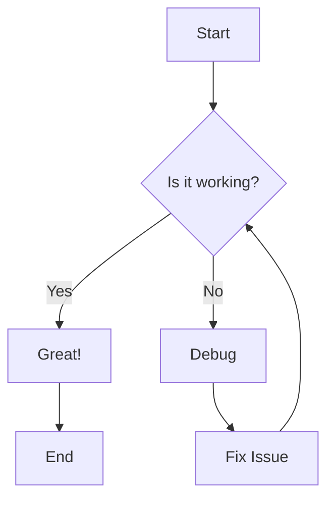
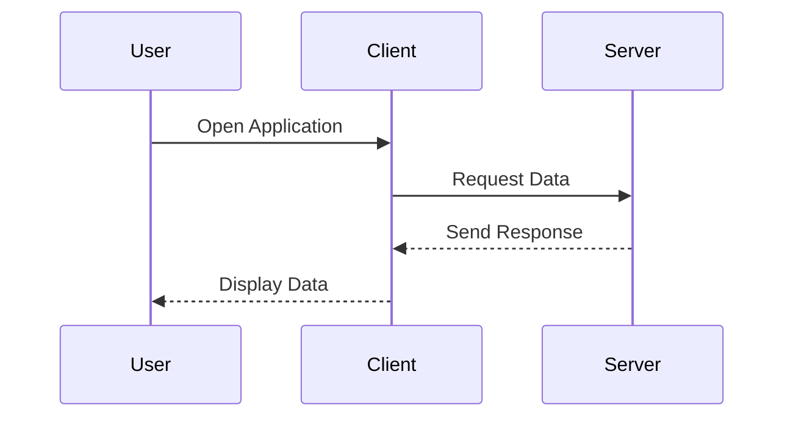
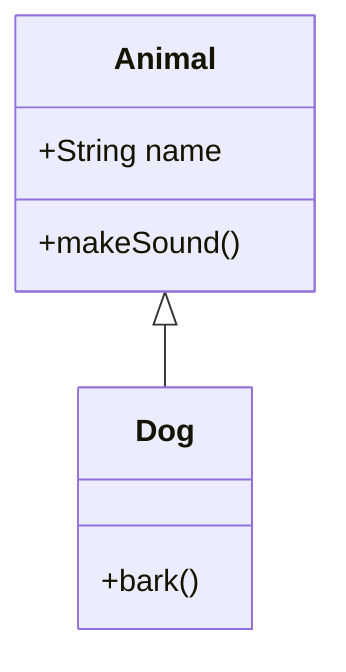
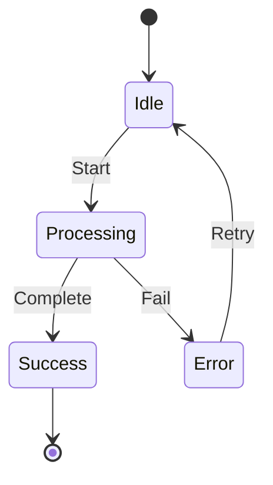
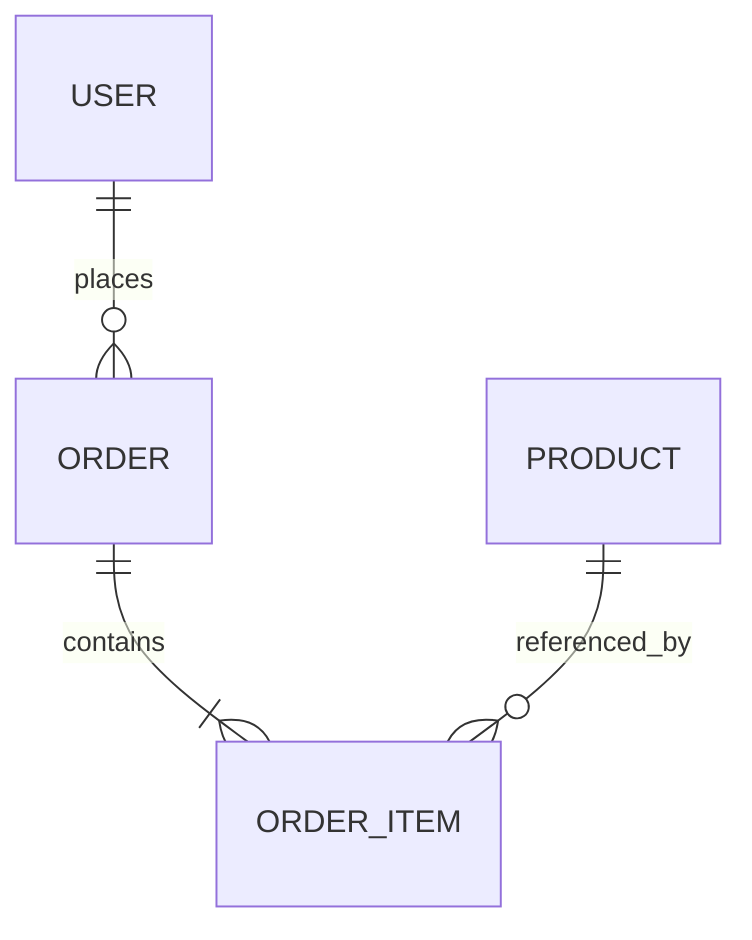
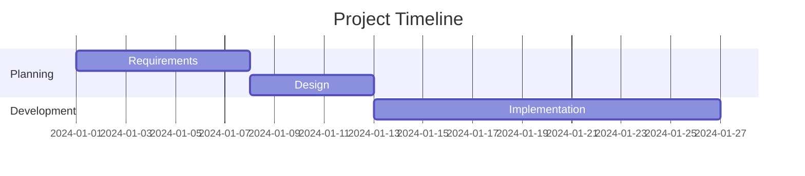
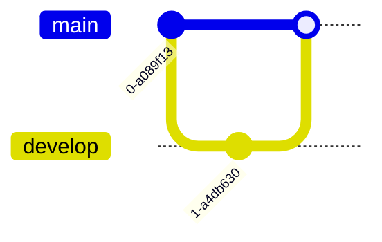
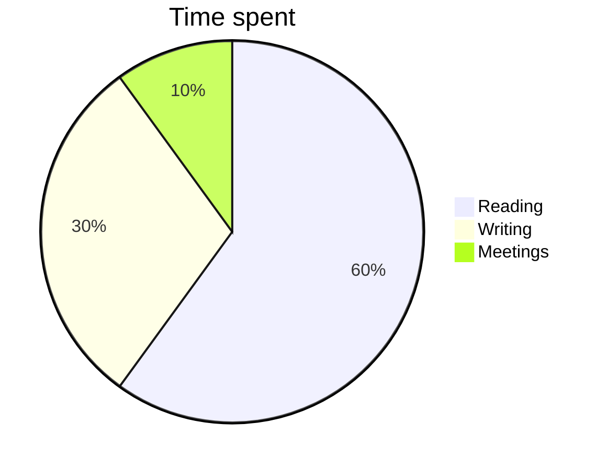
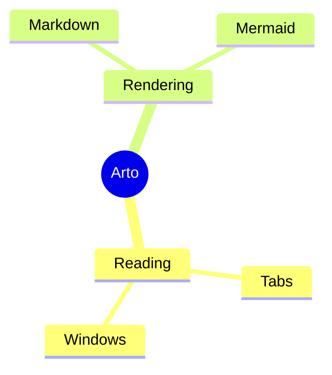
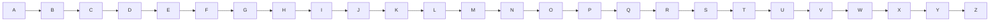

# Math and Diagrams

KaTeX and Mermaid, rendered on the client from the source Arto keeps in the
page. Previous: [Block syntax](./02-blocks.md).

## Inline math

When $a \ne 0$, the equation $ax^2 + bx + c = 0$ has the solutions
$x = \frac{-b \pm \sqrt{b^2 - 4ac}}{2a}$. Euler: $e^{i\pi} + 1 = 0$.

**Expected:** four typeset formulas flowing with the text.

### Math that contains Markdown punctuation

Asterisks: $2*3*4 = 24$. Underscores: $a_1 + b_2 = c_3$. Tildes:
$x \sim \mathcal{N}(0, 1)$. Brackets: $[a, b] \times (c, d)$. Backslashes:
$\{x \mid x > 0\}$.

**Expected:** five typeset formulas; no italics, no strikethrough, and no
links appear because of the punctuation inside the dollars.

### Math inside other inline syntax

Emphasized: *the identity $E = mc^2$ holds*. In a link: [see $\pi$](./README.md).
Bold: **$\alpha + \beta$**.

**Expected:** the formulas typeset inside the italic, link, and bold runs.

### Not math

Prices: costs $5 and $6, or $5.00 and $6.50. Escaped: \$100 and \$200. Code:
`$HOME` and `$PATH`. A lone dollar sign $ in a sentence.

**Expected:** every dollar sign stays visible as text; nothing is typeset.

### Math in table cells

| Formula      | Meaning              |
| ------------ | -------------------- |
| $E = mc^2$   | mass-energy          |
| $\sum_{i=1}^{n} i$ | a sum          |

**Expected:** depends on the engine. See the Math in table cells section of
[Beyond GFM](./05-beyond-gfm.md).

## Display math

Double dollars on their own lines:

$$
\int_{-\infty}^{\infty} e^{-x^2}\,dx = \sqrt{\pi}
$$

A `math` fence:

```math
\frac{d}{dx}\left( \int_{0}^{x} f(u)\,du\right) = f(x)
```

Multi-line environments:

$$
\begin{aligned}
\nabla \cdot \mathbf{E} &= \frac{\rho}{\varepsilon_0} \\
\nabla \cdot \mathbf{B} &= 0 \\
\nabla \times \mathbf{E} &= -\frac{\partial \mathbf{B}}{\partial t} \\
\nabla \times \mathbf{B} &= \mu_0 \mathbf{J} + \mu_0 \varepsilon_0 \frac{\partial \mathbf{E}}{\partial t}
\end{aligned}
$$

```math
I_n = \begin{bmatrix}
1 & 0 & \cdots & 0 \\
0 & 1 & \cdots & 0 \\
\vdots & \vdots & \ddots & \vdots \\
0 & 0 & \cdots & 1
\end{bmatrix}
```

**Expected:** four centered blocks; the aligned environment lines up its equals
signs; the matrix has square brackets.

### Display math edge cases

Inline double dollars: before $$x^2$$ after.

**Expected:** typeset (as display or inline depending on the engine) without
breaking the paragraph.

A formula KaTeX cannot parse:

$$
\frac{a}{
$$

**Expected:** an error shown in place of the formula, and the rest of the
document still renders.

Right-click a display formula: the context menu offers to open it in its own
window and to copy the block.

## Mermaid

### Flowchart



### Sequence



### Class



### State



### Entity relationship



### Gantt



### Git graph



### Pie and mindmap





**Expected:** nine diagrams drawn in the current theme (dark diagrams on the
dark theme). Right-clicking a diagram offers to open it in its own window with
zoom and pan, and to copy it as an image.

### Wide diagram



**Expected:** the diagram scales or scrolls inside its box; the page does not
scroll sideways.

### Invalid diagram

```mermaid
flowchart TD
    A --> B
    this line is not valid mermaid ==> [
```

**Expected:** an error message in place of the diagram; the diagrams above and
the text below still render.

Text after the invalid diagram still shows.

---

Previous: [Block syntax](./02-blocks.md) · Next: [Frontmatter](./04-frontmatter.md)
