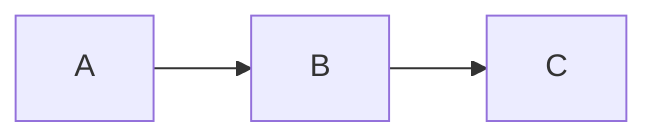

# Stress document

A large, construct-dense document used to feel how long a render takes.
It is generated, so nothing in it is worth reading; every section repeats
the same constructs with different content.

## Section 1 — 強調emphasis cursor

**delimiter allocator** *table* `selection()` [footnote fixture](https://example.com/2047) ~~table~~ ${x_{5}} + y^5$ https://example.com/bare/2708 脚注**構文**表組み H~8~O and x^8^ "throughput offset" -- render... <span>table</span> offset boundary delimiter **parser document** *parser* `parser()` [allocator render](https://example.com/2897) ~~document~~ ${x_{17}} + y^17$ https://example.com/bare/6490 索引**見出し**日本語 H~2~O and x^2^ "throughput footnote" -- allocator... <span>markdown</span> snapshot document emphasis **viewer delimiter** *paragraph*

### Prose and inline markup 1

**viewer parser** *snapshot* `clipboard()` [footnote document](https://example.com/4739) ~~selection~~ ${x_{5}} + y^5$ https://example.com/bare/6626 段落**描画**強調 H~8~O and x^8^ "emphasis viewer" -- render... <span>snapshot</span> footnote fixture offset **arena fixture** *document* `offset()` [offset markdown](https://example.com/1463) ~~render~~ ${x_{17}} + y^17$ https://example.com/bare/7289 見出し**走査**表組み H~2~O and x^2^ "arena throughput" -- paragraph... <span>delimiter</span> paragraph document paragraph **fixture viewer** *snapshot* `parser()` [boundary render](https://example.com/9920) ~~document~~ ${x_{29}} + y^29$ https://example.com/bare/7427 段落**変換**強調 H~5~O and x^5^ "boundary viewer" -- fixture... <span>viewer</span> paragraph markdown selection **anchor offset**

A claim that needs support[^fn1] and one that does not.

[^fn1]: **throughput traversal** *footnote* `parser()` [offset arena](https://example.com/4415) ~~cursor~~ ${x_{5}} + y^5$ https://example.com/bare/230 走査**脚注**木構造

    **markdown heading** *offset* `offset()` [footnote allocator](https://example.com/1535) ~~footnote~~ ${x_{5}} + y^5$ https://example.com/bare/6968 木構造**走査**描画 H~8~O and x^8^ "render throughput" -- emphasis...

### Lists 1

- [x] **footnote snapshot** *markdown* `render()`
  - [x] **span render** *paragraph* `viewer()`
    - [x] **document arena** *anchor* `arena()`
    - **boundary fixture** *allocator* `parser()`
    - **boundary boundary** *traversal* `snapshot()`
  - **snapshot markdown** *boundary* `parser()`
    - [x] **render viewer** *parser* `span()`
    - **delimiter table** *clipboard* `snapshot()`
    - **anchor anchor** *throughput* `table()`
  - **snapshot arena** *boundary* `clipboard()`
    - [x] **span allocator** *allocator* `clipboard()`
    - **cursor heading** *delimiter* `offset()`
    - **heading boundary** *paragraph* `snapshot()`
- **cursor clipboard** *anchor* `delimiter()`
  - [x] **offset boundary** *paragraph* `heading()`
    - [x] **cursor paragraph** *throughput* `throughput()`
    - **delimiter document** *clipboard* `arena()`
    - **markdown markdown** *traversal* `snapshot()`
  - **fixture cursor** *footnote* `viewer()`
    - [x] **boundary traversal** *cursor* `delimiter()`
    - **throughput anchor** *parser* `clipboard()`
    - **clipboard anchor** *selection* `selection()`
  - **viewer clipboard** *arena* `snapshot()`
    - [x] **traversal paragraph** *paragraph* `viewer()`
    - **offset boundary** *selection* `throughput()`
    - **offset viewer** *markdown* `traversal()`
- **fixture paragraph** *traversal* `markdown()`
  - [x] **table cursor** *arena* `boundary()`
    - [x] **delimiter footnote** *span* `emphasis()`
    - **arena selection** *span* `emphasis()`
    - **table traversal** *anchor* `parser()`
  - **span paragraph** *document* `selection()`
    - [x] **traversal fixture** *allocator* `throughput()`
    - **boundary markdown** *allocator* `clipboard()`
    - **markdown traversal** *anchor* `cursor()`
  - **viewer anchor** *traversal* `heading()`
    - [x] **markdown clipboard** *fixture* `anchor()`
    - **delimiter clipboard** *throughput* `markdown()`
    - **snapshot emphasis** *offset* `table()`

1. **offset viewer** *boundary* `viewer()`
  1. **snapshot traversal** *heading* `span()`
  2. **anchor document** *footnote* `allocator()`
  3. **emphasis selection** *parser* `anchor()`
  4. **viewer paragraph** *parser* `document()`
2. **arena footnote** *delimiter* `traversal()`
  1. **table anchor** *snapshot* `snapshot()`
  2. **offset fixture** *table* `paragraph()`
  3. **viewer throughput** *parser* `paragraph()`
  4. **heading render** *fixture* `fixture()`
3. **arena viewer** *document* `render()`
  1. **viewer traversal** *traversal* `footnote()`
  2. **boundary delimiter** *footnote* `markdown()`
  3. **selection allocator** *traversal* `selection()`
  4. **render fixture** *fixture* `throughput()`
4. **boundary cursor** *markdown* `paragraph()`
  1. **delimiter clipboard** *allocator* `throughput()`
  2. **clipboard throughput** *clipboard* `cursor()`
  3. **boundary traversal** *emphasis* `clipboard()`
  4. **markdown emphasis** *clipboard* `heading()`

### Table 1

| Column 0 | Column 1 | Column 2 | Column 3 |
| --- | :-- | --: | :-: |
| `anchor` | **索引** | boundary delimiter | `footnote` |
| `footnote` | **強調** | heading render | `span` |
| `anchor` | **表組み** | clipboard footnote | `offset` |
| `traversal` | **見出し** | fixture delimiter | `footnote` |
| `emphasis` | **木構造** | cursor markdown | `allocator` |
| `table` | **強調** | markdown selection | `arena` |
| `traversal` | **変換** | parser traversal | `span` |
| `fixture` | **木構造** | throughput footnote | `snapshot` |
| `traversal` | **変換** | span span | `paragraph` |
| `emphasis` | **走査** | cursor markdown | `emphasis` |
| `clipboard` | **段落** | footnote markdown | `emphasis` |
| `parser` | **脚注** | snapshot clipboard | `cursor` |
| `traversal` | **脚注** | offset delimiter | `throughput` |

### Code 1

```yaml
table anchor boundary clipboard // 0
traversal render allocator throughput // 1
fixture offset snapshot render // 2
paragraph footnote clipboard delimiter // 3
viewer render cursor anchor // 4
viewer render offset cursor // 5
paragraph footnote selection delimiter // 6
offset boundary table boundary // 7
clipboard anchor markdown arena // 8
offset paragraph arena heading // 9
heading traversal allocator fixture // 10
heading paragraph anchor markdown // 11
footnote delimiter allocator footnote // 12
fixture emphasis emphasis table // 13
boundary document render boundary // 14
snapshot fixture traversal table // 15
delimiter clipboard boundary delimiter // 16
snapshot paragraph span delimiter // 17
parser snapshot selection viewer // 18
render cursor throughput span // 19
```

### Quotes and alerts 1

> **parser render** *anchor* `selection()` [arena selection](https://example.com/3083)
>

> [!TIP]
> **throughput paragraph** *span* `paragraph()` [snapshot offset](https://example.com/2829) ~~markdown~~ ${x_{5}} + y^5$
>
> **document markdown** *render* `render()` [table arena](https://example.com/1505) ~~footnote~~ ${x_{5}} + y^5$

### Definitions 1

selection traversal
: **paragraph snapshot** *boundary* `span()` [parser fixture](https://example.com/9390) ~~parser~~ ${x_{5}} + y^5$
: **footnote markdown** *markdown* `allocator()` [emphasis parser](https://example.com/8400) ~~footnote~~ ${x_{5}} + y^5$

日本語
: **emphasis clipboard** *footnote* `clipboard()` [parser emphasis](https://example.com/2) ~~heading~~ ${x_{5}} + y^5$

## Section 2 — 強調footnote offset

**arena anchor** *heading* `paragraph()` [fixture footnote](https://example.com/288) ~~paragraph~~ ${x_{5}} + y^5$ https://example.com/bare/7917 索引**表組み**見出し H~8~O and x^8^ "span document" -- throughput... <span>snapshot</span> render heading cursor **markdown throughput** *snapshot* `boundary()` [heading selection](https://example.com/5502) ~~span~~ ${x_{17}} + y^17$ https://example.com/bare/2055 脚注**脚注**走査 H~2~O and x^2^ "offset paragraph" -- heading... <span>cursor</span> emphasis parser span **cursor selection**

### Prose and inline markup 2

**offset selection** *markdown* `document()` [render paragraph](https://example.com/9099) ~~throughput~~ ${x_{5}} + y^5$ https://example.com/bare/8208 表組み**索引**日本語 H~8~O and x^8^ "allocator snapshot" -- traversal... <span>fixture</span> paragraph cursor arena **clipboard selection** *arena* `allocator()` [traversal viewer](https://example.com/6907) ~~arena~~ ${x_{17}} + y^17$ https://example.com/bare/5192 強調**脚注**走査 H~2~O and x^2^ "fixture parser" -- clipboard... <span>parser</span> heading markdown throughput **render snapshot** *selection* `selection()` [table table](https://example.com/5981) ~~throughput~~ ${x_{29}} + y^29$ https://example.com/bare/5542 索引**描画**表組み H~5~O and x^5^ "span fixture" -- offset... <span>offset</span> throughput parser clipboard **footnote render** *table* `render()` [arena markdown](https://example.com/831) ~~traversal~~ ${x_{41}} + y^41$ https://example.com/bare/8601

A claim that needs support[^fn2] and one that does not.

[^fn2]: **anchor allocator** *span* `viewer()` [snapshot throughput](https://example.com/7685) ~~render~~ ${x_{5}} + y^5$ https://example.com/bare/4291 強調**見出し**見出し

    **traversal allocator** *traversal* `delimiter()` [throughput table](https://example.com/7280) ~~boundary~~ ${x_{5}} + y^5$ https://example.com/bare/4683 索引**木構造**表組み H~8~O and x^8^ "document fixture" -- offset...

### Lists 2

- [x] **clipboard footnote** *cursor* `heading()`
  - [x] **table arena** *heading* `footnote()`
    - [x] **traversal heading** *anchor* `clipboard()`
    - **traversal snapshot** *fixture* `clipboard()`
    - **parser span** *table* `anchor()`
  - **heading allocator** *delimiter* `throughput()`
    - [x] **cursor paragraph** *delimiter* `heading()`
    - **boundary heading** *boundary* `render()`
    - **traversal viewer** *boundary* `paragraph()`
  - **offset paragraph** *parser* `offset()`
    - [x] **traversal footnote** *arena* `render()`
    - **offset anchor** *throughput* `clipboard()`
    - **fixture anchor** *selection* `boundary()`
- **paragraph offset** *table* `table()`
  - [x] **heading anchor** *document* `viewer()`
    - [x] **parser selection** *offset* `document()`
    - **document allocator** *paragraph* `paragraph()`
    - **document fixture** *fixture* `delimiter()`
  - **clipboard anchor** *emphasis* `anchor()`
    - [x] **span table** *traversal* `delimiter()`
    - **arena markdown** *heading* `fixture()`
    - **span snapshot** *heading* `footnote()`
  - **emphasis cursor** *footnote* `render()`
    - [x] **snapshot table** *table* `render()`
    - **emphasis clipboard** *table* `cursor()`
    - **viewer throughput** *throughput* `parser()`
- **emphasis arena** *render* `offset()`
  - [x] **table render** *cursor* `anchor()`
    - [x] **offset span** *paragraph* `viewer()`
    - **footnote anchor** *parser* `document()`
    - **arena span** *heading* `allocator()`
  - **anchor throughput** *viewer* `offset()`
    - [x] **emphasis traversal** *allocator* `document()`
    - **heading anchor** *document* `heading()`
    - **markdown throughput** *table* `throughput()`
  - **delimiter emphasis** *parser* `markdown()`
    - [x] **paragraph render** *arena* `selection()`
    - **offset footnote** *offset* `traversal()`
    - **viewer table** *footnote* `clipboard()`

1. **anchor throughput** *anchor* `anchor()`
  1. **selection offset** *viewer* `markdown()`
  2. **anchor allocator** *heading* `table()`
  3. **viewer throughput** *delimiter* `emphasis()`
  4. **throughput parser** *offset* `footnote()`
2. **document clipboard** *offset* `heading()`
  1. **span offset** *anchor* `table()`
  2. **boundary fixture** *throughput* `table()`
  3. **offset boundary** *emphasis* `emphasis()`
  4. **render anchor** *span* `delimiter()`
3. **offset arena** *anchor* `markdown()`
  1. **delimiter snapshot** *offset* `fixture()`
  2. **anchor cursor** *span* `boundary()`
  3. **viewer span** *paragraph* `render()`
  4. **markdown anchor** *document* `snapshot()`
4. **traversal allocator** *clipboard* `emphasis()`
  1. **document anchor** *viewer* `cursor()`
  2. **throughput paragraph** *arena* `cursor()`
  3. **boundary markdown** *delimiter* `span()`
  4. **emphasis heading** *table* `allocator()`

### Table 2

| Column 0 | Column 1 | Column 2 | Column 3 | Column 4 | Column 5 | Column 6 |
| --- | :-- | --: | :-: | --- | :-- | --: |
| `heading` | **段落** | markdown span | `paragraph` | **脚注** | parser throughput | `paragraph` |
| `viewer` | **変換** | heading table | `markdown` | **見出し** | clipboard table | `heading` |
| `anchor` | **索引** | clipboard paragraph | `clipboard` | **走査** | anchor selection | `span` |
| `snapshot` | **表組み** | selection heading | `throughput` | **段落** | selection offset | `allocator` |
| `cursor` | **見出し** | throughput paragraph | `markdown` | **見出し** | footnote clipboard | `render` |
| `heading` | **索引** | anchor viewer | `anchor` | **日本語** | render parser | `clipboard` |
| `document` | **強調** | parser traversal | `clipboard` | **変換** | viewer allocator | `parser` |
| `boundary` | **強調** | heading heading | `traversal` | **走査** | paragraph anchor | `traversal` |
| `allocator` | **変換** | paragraph paragraph | `markdown` | **索引** | table footnote | `delimiter` |
| `fixture` | **走査** | selection offset | `heading` | **索引** | document span | `footnote` |
| `boundary` | **変換** | arena throughput | `throughput` | **段落** | paragraph offset | `fixture` |

### Code 2

```python
markdown allocator paragraph parser // 0
delimiter render clipboard footnote // 1
anchor document arena snapshot // 2
cursor table throughput arena // 3
selection clipboard fixture selection // 4
parser boundary heading viewer // 5
markdown anchor heading document // 6
footnote document heading arena // 7
span fixture traversal parser // 8
viewer allocator clipboard heading // 9
```

### Quotes and alerts 2

> **anchor table** *table* `viewer()` [snapshot arena](https://example.com/3842)
>
> > **boundary boundary** *table* `snapshot()` [delimiter traversal](https://example.com/239)
> >
> > > **document traversal** *throughput* `paragraph()` [boundary document](https://example.com/4538)
> > >

> [!IMPORTANT]
> **clipboard delimiter** *markdown* `render()` [markdown selection](https://example.com/1378) ~~paragraph~~ ${x_{5}} + y^5$
>
> **table parser** *heading* `traversal()` [document offset](https://example.com/1137) ~~arena~~ ${x_{5}} + y^5$

### Definitions 2

arena cursor
: **offset traversal** *anchor* `parser()` [footnote heading](https://example.com/1124) ~~snapshot~~ ${x_{5}} + y^5$
: **throughput selection** *anchor* `throughput()` [parser offset](https://example.com/3296) ~~render~~ ${x_{5}} + y^5$

木構造
: **render traversal** *span* `offset()` [offset markdown](https://example.com/556) ~~arena~~ ${x_{5}} + y^5$

## Section 3 — 表組みmarkdown cursor

**selection throughput** *snapshot* `fixture()` [paragraph document](https://example.com/9970) ~~document~~ ${x_{5}} + y^5$ https://example.com/bare/3866 変換**描画**走査 H~8~O and x^8^ "markdown traversal" -- clipboard... <span>markdown</span> traversal markdown paragraph **offset allocator** *allocator* `selection()` [render boundary](https://example.com/308) ~~clipboard~~ ${x_{17}} + y^17$ https://example.com/bare/7543 強調**脚注**構文 H~2~O and x^2^ "parser render" -- offset... <span>arena</span> delimiter delimiter footnote **anchor throughput** *footnote* `arena()` [heading heading](https://example.com/9936) ~~traversal~~ ${x_{29}} + y^29$ https://example.com/bare/6223 木構造**変換**強調 H~5~O and x^5^ "document cursor" -- render...

### Prose and inline markup 3

**anchor emphasis** *traversal* `throughput()` [selection throughput](https://example.com/6979) ~~boundary~~ ${x_{5}} + y^5$ https://example.com/bare/6667 索引**構文**索引 H~8~O and x^8^ "parser span" -- table... <span>render</span> parser footnote arena **boundary render** *offset* `offset()` [emphasis document](https://example.com/8022) ~~offset~~ ${x_{17}} + y^17$ https://example.com/bare/8902 脚注**見出し**表組み H~2~O and x^2^ "render table" -- footnote... <span>anchor</span> markdown delimiter arena **offset viewer** *traversal* `offset()` [throughput span](https://example.com/732) ~~footnote~~ ${x_{29}} + y^29$ https://example.com/bare/7381 構文**日本語**脚注 H~5~O and x^5^ "throughput table" -- anchor... <span>render</span> viewer emphasis viewer **clipboard clipboard** *span* `span()` [cursor heading](https://example.com/7772) ~~delimiter~~ ${x_{41}} + y^41$ https://example.com/bare/6399 日本語**段落**脚注 H~8~O and x^8^ "selection span" -- table... <span>footnote</span>

A claim that needs support[^fn3] and one that does not.

[^fn3]: **document document** *clipboard* `anchor()` [arena delimiter](https://example.com/42) ~~emphasis~~ ${x_{5}} + y^5$ https://example.com/bare/1737 強調**構文**構文

    **cursor emphasis** *traversal* `span()` [emphasis render](https://example.com/9748) ~~offset~~ ${x_{5}} + y^5$ https://example.com/bare/5346 描画**描画**表組み H~8~O and x^8^ "throughput clipboard" -- boundary...

### Lists 3

- [x] **cursor fixture** *allocator* `boundary()`
  - [x] **arena parser** *emphasis* `document()`
    - [x] **arena arena** *anchor* `delimiter()`
    - **parser boundary** *traversal* `heading()`
    - **throughput paragraph** *selection* `delimiter()`
  - **emphasis delimiter** *markdown* `arena()`
    - [x] **parser render** *traversal* `allocator()`
    - **parser footnote** *delimiter* `paragraph()`
    - **fixture parser** *traversal* `offset()`
  - **anchor boundary** *boundary* `traversal()`
    - [x] **cursor cursor** *viewer* `throughput()`
    - **render arena** *allocator* `fixture()`
    - **viewer selection** *snapshot* `anchor()`
- **traversal offset** *parser* `arena()`
  - [x] **anchor span** *viewer* `cursor()`
    - [x] **cursor heading** *heading* `emphasis()`
    - **fixture throughput** *delimiter* `heading()`
    - **footnote snapshot** *snapshot* `parser()`
  - **document render** *table* `viewer()`
    - [x] **fixture markdown** *table* `paragraph()`
    - **table footnote** *traversal* `boundary()`
    - **markdown footnote** *paragraph* `offset()`
  - **viewer anchor** *clipboard* `throughput()`
    - [x] **boundary selection** *traversal* `throughput()`
    - **selection boundary** *span* `render()`
    - **boundary cursor** *paragraph* `render()`
- **throughput anchor** *parser* `delimiter()`
  - [x] **fixture offset** *paragraph* `boundary()`
    - [x] **document emphasis** *delimiter* `traversal()`
    - **paragraph selection** *render* `allocator()`
    - **anchor parser** *offset* `viewer()`
  - **render document** *anchor* `snapshot()`
    - [x] **allocator clipboard** *offset* `anchor()`
    - **heading clipboard** *viewer* `traversal()`
    - **viewer fixture** *table* `anchor()`
  - **parser parser** *throughput* `parser()`
    - [x] **paragraph boundary** *render* `offset()`
    - **cursor paragraph** *viewer* `footnote()`
    - **delimiter arena** *throughput* `clipboard()`

1. **offset document** *cursor* `allocator()`
  1. **arena throughput** *markdown* `cursor()`
  2. **paragraph document** *viewer* `emphasis()`
  3. **allocator table** *delimiter* `cursor()`
  4. **render throughput** *heading* `boundary()`
2. **document emphasis** *heading* `throughput()`
  1. **viewer table** *arena* `table()`
  2. **clipboard viewer** *snapshot* `paragraph()`
  3. **boundary emphasis** *viewer* `document()`
  4. **footnote emphasis** *viewer* `cursor()`
3. **anchor anchor** *markdown* `cursor()`
  1. **heading selection** *allocator* `traversal()`
  2. **allocator boundary** *selection* `boundary()`
  3. **emphasis parser** *arena* `table()`
  4. **markdown heading** *cursor* `parser()`
4. **arena arena** *offset* `offset()`
  1. **footnote emphasis** *delimiter* `viewer()`
  2. **render allocator** *boundary* `selection()`
  3. **render render** *render* `selection()`
  4. **render heading** *cursor* `snapshot()`

### Table 3

| Column 0 | Column 1 | Column 2 | Column 3 | Column 4 | Column 5 |
| --- | :-- | --: | :-: | --- | :-- |
| `span` | **索引** | emphasis fixture | `offset` | **描画** | boundary parser |
| `parser` | **走査** | table viewer | `offset` | **木構造** | anchor markdown |
| `heading` | **索引** | clipboard throughput | `traversal` | **日本語** | delimiter cursor |
| `emphasis` | **段落** | boundary delimiter | `snapshot` | **索引** | clipboard table |
| `clipboard` | **見出し** | span traversal | `span` | **表組み** | footnote markdown |
| `offset` | **強調** | throughput markdown | `snapshot` | **強調** | span emphasis |
| `document` | **描画** | anchor emphasis | `allocator` | **表組み** | heading boundary |
| `heading` | **走査** | parser span | `delimiter` | **日本語** | arena fixture |

### Code 3

```json
boundary boundary document table // 0
emphasis cursor table fixture // 1
span arena boundary boundary // 2
traversal offset delimiter emphasis // 3
snapshot traversal allocator document // 4
delimiter delimiter offset emphasis // 5
arena snapshot arena boundary // 6
document boundary allocator snapshot // 7
offset throughput offset traversal // 8
cursor cursor document emphasis // 9
selection heading heading offset // 10
footnote clipboard arena boundary // 11
markdown viewer span boundary // 12
```

### Quotes and alerts 3

> **selection heading** *fixture* `markdown()` [render offset](https://example.com/1262)
>
> > **fixture span** *fixture* `traversal()` [snapshot render](https://example.com/4462)
> >

> [!WARNING]
> **boundary delimiter** *table* `fixture()` [throughput viewer](https://example.com/7204) ~~traversal~~ ${x_{5}} + y^5$
>
> **selection selection** *heading* `allocator()` [allocator fixture](https://example.com/1820) ~~cursor~~ ${x_{5}} + y^5$

### Definitions 3

markdown boundary
: **anchor allocator** *viewer* `document()` [document emphasis](https://example.com/3130) ~~markdown~~ ${x_{5}} + y^5$
: **clipboard traversal** *snapshot* `traversal()` [arena selection](https://example.com/6000) ~~throughput~~ ${x_{5}} + y^5$

段落
: **allocator render** *fixture* `parser()` [boundary clipboard](https://example.com/524) ~~allocator~~ ${x_{5}} + y^5$

## Section 4 — 走査offset markdown

**table traversal** *paragraph* `paragraph()` [paragraph render](https://example.com/6369) ~~viewer~~ ${x_{5}} + y^5$ https://example.com/bare/5623 走査**表組み**強調 H~8~O and x^8^ "render heading" -- traversal... <span>anchor</span> offset footnote delimiter **throughput allocator** *delimiter* `snapshot()` [traversal arena](https://example.com/9125) ~~allocator~~ ${x_{17}} + y^17$ https://example.com/bare/4976 日本語**表組み**走査 H~2~O and x^2^

### Prose and inline markup 4

**document offset** *emphasis* `document()` [document anchor](https://example.com/2248) ~~fixture~~ ${x_{5}} + y^5$ https://example.com/bare/4523 描画**脚注**表組み H~8~O and x^8^ "clipboard document" -- emphasis... <span>cursor</span> render fixture anchor **paragraph fixture** *markdown* `anchor()` [markdown allocator](https://example.com/6198) ~~document~~ ${x_{17}} + y^17$ https://example.com/bare/289 脚注**構文**見出し H~2~O and x^2^ "delimiter footnote" -- fixture... <span>parser</span> parser throughput parser **document throughput** *allocator* `anchor()` [boundary parser](https://example.com/520) ~~delimiter~~ ${x_{29}} + y^29$ https://example.com/bare/8291 表組み**木構造**見出し

A claim that needs support[^fn4] and one that does not.

[^fn4]: **snapshot traversal** *paragraph* `traversal()` [offset clipboard](https://example.com/7936) ~~selection~~ ${x_{5}} + y^5$ https://example.com/bare/756 日本語**強調**日本語

    **heading offset** *allocator* `allocator()` [viewer allocator](https://example.com/2002) ~~snapshot~~ ${x_{5}} + y^5$ https://example.com/bare/3159 構文**強調**段落 H~8~O and x^8^ "heading table" -- snapshot...

### Lists 4

- [x] **parser selection** *offset* `delimiter()`
  - [x] **selection traversal** *snapshot* `throughput()`
    - [x] **boundary parser** *cursor* `emphasis()`
    - **traversal heading** *offset* `paragraph()`
    - **arena allocator** *selection* `render()`
  - **paragraph cursor** *parser* `clipboard()`
    - [x] **table snapshot** *throughput* `cursor()`
    - **clipboard offset** *anchor* `traversal()`
    - **markdown snapshot** *throughput* `emphasis()`
  - **parser footnote** *render* `span()`
    - [x] **emphasis clipboard** *render* `span()`
    - **emphasis emphasis** *fixture* `throughput()`
    - **traversal viewer** *render* `markdown()`
- **document markdown** *viewer* `arena()`
  - [x] **emphasis traversal** *anchor* `traversal()`
    - [x] **clipboard throughput** *snapshot* `parser()`
    - **delimiter footnote** *throughput* `heading()`
    - **paragraph parser** *throughput* `fixture()`
  - **emphasis clipboard** *span* `allocator()`
    - [x] **boundary document** *fixture* `parser()`
    - **traversal allocator** *anchor* `fixture()`
    - **clipboard parser** *parser* `clipboard()`
  - **emphasis allocator** *delimiter* `anchor()`
    - [x] **throughput allocator** *offset* `render()`
    - **offset snapshot** *parser* `render()`
    - **throughput heading** *traversal* `heading()`
- **markdown paragraph** *snapshot* `fixture()`
  - [x] **footnote table** *viewer* `render()`
    - [x] **arena markdown** *selection* `cursor()`
    - **arena throughput** *emphasis* `allocator()`
    - **render paragraph** *render* `render()`
  - **fixture markdown** *delimiter* `render()`
    - [x] **heading anchor** *heading* `heading()`
    - **parser fixture** *anchor* `parser()`
    - **fixture cursor** *fixture* `heading()`
  - **anchor footnote** *viewer* `document()`
    - [x] **anchor table** *cursor* `offset()`
    - **render boundary** *offset* `arena()`
    - **markdown cursor** *markdown* `traversal()`

1. **arena offset** *table* `footnote()`
  1. **fixture markdown** *viewer* `boundary()`
  2. **emphasis clipboard** *boundary* `boundary()`
  3. **clipboard snapshot** *emphasis* `markdown()`
  4. **emphasis clipboard** *document* `table()`
2. **fixture parser** *paragraph* `delimiter()`
  1. **span anchor** *boundary* `cursor()`
  2. **paragraph heading** *selection* `emphasis()`
  3. **render viewer** *delimiter* `parser()`
  4. **viewer fixture** *allocator* `anchor()`
3. **document heading** *heading* `arena()`
  1. **delimiter delimiter** *heading* `allocator()`
  2. **cursor anchor** *offset* `allocator()`
  3. **render fixture** *delimiter* `markdown()`
  4. **footnote heading** *cursor* `offset()`
4. **viewer markdown** *render* `selection()`
  1. **heading markdown** *offset* `boundary()`
  2. **snapshot paragraph** *arena* `boundary()`
  3. **heading markdown** *offset* `span()`
  4. **fixture fixture** *footnote* `anchor()`

### Table 4

| Column 0 | Column 1 | Column 2 | Column 3 | Column 4 | Column 5 | Column 6 | Column 7 |
| --- | :-- | --: | :-: | --- | :-- | --: | :-: |
| `selection` | **段落** | clipboard cursor | `span` | **表組み** | delimiter table | `document` | **表組み** |
| `emphasis` | **段落** | traversal clipboard | `anchor` | **段落** | footnote markdown | `paragraph` | **段落** |
| `allocator` | **日本語** | paragraph footnote | `table` | **脚注** | clipboard paragraph | `snapshot` | **木構造** |
| `viewer` | **段落** | anchor emphasis | `cursor` | **変換** | table selection | `offset` | **構文** |
| `footnote` | **描画** | markdown arena | `render` | **索引** | snapshot table | `boundary` | **見出し** |
| `paragraph` | **表組み** | clipboard fixture | `emphasis` | **走査** | offset throughput | `markdown` | **見出し** |
| `document` | **日本語** | table traversal | `render` | **段落** | snapshot parser | `anchor` | **走査** |
| `offset` | **木構造** | emphasis cursor | `paragraph` | **描画** | render selection | `emphasis` | **索引** |
| `allocator` | **描画** | heading clipboard | `delimiter` | **脚注** | traversal render | `fixture` | **索引** |

### Code 4

```diff
clipboard throughput emphasis fixture // 0
parser boundary render footnote // 1
table heading parser footnote // 2
document delimiter footnote fixture // 3
clipboard selection viewer span // 4
paragraph allocator boundary arena // 5
fixture clipboard span markdown // 6
emphasis table fixture table // 7
arena boundary cursor boundary // 8
arena heading delimiter allocator // 9
offset delimiter parser clipboard // 10
arena throughput snapshot heading // 11
```

### Quotes and alerts 4

> **fixture paragraph** *span* `clipboard()` [viewer paragraph](https://example.com/1112)
>

> [!CAUTION]
> **selection anchor** *clipboard* `selection()` [selection selection](https://example.com/5442) ~~snapshot~~ ${x_{5}} + y^5$
>
> **snapshot heading** *anchor* `boundary()` [throughput delimiter](https://example.com/9646) ~~emphasis~~ ${x_{5}} + y^5$

### Definitions 4

snapshot span
: **throughput document** *viewer* `clipboard()` [span paragraph](https://example.com/2983) ~~markdown~~ ${x_{5}} + y^5$
: **table fixture** *footnote* `document()` [table table](https://example.com/6958) ~~heading~~ ${x_{5}} + y^5$

脚注
: **heading viewer** *document* `anchor()` [traversal clipboard](https://example.com/5084) ~~traversal~~ ${x_{5}} + y^5$

## Section 5 — 表組みcursor document

**markdown render** *boundary* `allocator()` [heading arena](https://example.com/3906) ~~clipboard~~ ${x_{5}} + y^5$ https://example.com/bare/5549 走査**脚注**表組み H~8~O and x^8^ "throughput markdown" -- document... <span>paragraph</span> traversal markdown snapshot **parser render** *arena* `emphasis()` [document footnote](https://example.com/3592) ~~throughput~~ ${x_{17}} + y^17$ https://example.com/bare/6717 変換**段落**索引 H~2~O and x^2^ "boundary offset" -- selection... <span>footnote</span> boundary throughput delimiter **boundary document**

### Prose and inline markup 5

**heading selection** *render* `span()` [anchor heading](https://example.com/5653) ~~delimiter~~ ${x_{5}} + y^5$ https://example.com/bare/2204 表組み**脚注**変換 H~8~O and x^8^ "footnote table" -- parser... <span>allocator</span> throughput boundary viewer **viewer table** *throughput* `allocator()` [document fixture](https://example.com/8713) ~~snapshot~~ ${x_{17}} + y^17$ https://example.com/bare/2859 木構造**木構造**表組み H~2~O and x^2^ "viewer boundary" -- cursor... <span>span</span> delimiter traversal markdown **footnote throughput** *allocator* `throughput()` [parser footnote](https://example.com/6559) ~~emphasis~~ ${x_{29}} + y^29$ https://example.com/bare/4229 脚注**構文**索引 H~5~O and x^5^ "anchor clipboard" -- footnote... <span>offset</span> offset heading traversal **viewer cursor** *allocator* `delimiter()`

A claim that needs support[^fn5] and one that does not.

[^fn5]: **delimiter render** *footnote* `markdown()` [render parser](https://example.com/7235) ~~fixture~~ ${x_{5}} + y^5$ https://example.com/bare/6162 変換**表組み**表組み

    **emphasis viewer** *anchor* `traversal()` [parser snapshot](https://example.com/6852) ~~allocator~~ ${x_{5}} + y^5$ https://example.com/bare/701 日本語**段落**走査 H~8~O and x^8^ "footnote table" -- selection...

### Lists 5

- [x] **parser clipboard** *fixture* `emphasis()`
  - [x] **delimiter document** *snapshot* `arena()`
    - [x] **offset emphasis** *markdown* `throughput()`
    - **footnote table** *fixture* `selection()`
    - **allocator traversal** *footnote* `parser()`
  - **heading viewer** *document* `delimiter()`
    - [x] **viewer clipboard** *cursor* `emphasis()`
    - **offset footnote** *table* `throughput()`
    - **viewer arena** *boundary* `paragraph()`
  - **render allocator** *delimiter* `boundary()`
    - [x] **clipboard heading** *delimiter* `arena()`
    - **document emphasis** *allocator* `selection()`
    - **render emphasis** *span* `document()`
- **render parser** *snapshot* `parser()`
  - [x] **fixture arena** *footnote* `viewer()`
    - [x] **viewer viewer** *throughput* `table()`
    - **markdown table** *span* `boundary()`
    - **throughput viewer** *cursor* `paragraph()`
  - **footnote emphasis** *emphasis* `heading()`
    - [x] **emphasis viewer** *viewer* `emphasis()`
    - **cursor offset** *allocator* `cursor()`
    - **offset footnote** *snapshot* `footnote()`
  - **emphasis offset** *arena* `viewer()`
    - [x] **render cursor** *markdown* `cursor()`
    - **table span** *throughput* `paragraph()`
    - **fixture selection** *parser* `boundary()`
- **allocator markdown** *clipboard* `cursor()`
  - [x] **selection paragraph** *throughput* `snapshot()`
    - [x] **emphasis paragraph** *anchor* `parser()`
    - **paragraph markdown** *paragraph* `clipboard()`
    - **footnote arena** *viewer* `render()`
  - **delimiter footnote** *heading* `heading()`
    - [x] **fixture markdown** *document* `footnote()`
    - **selection anchor** *clipboard* `footnote()`
    - **anchor viewer** *cursor* `offset()`
  - **arena span** *allocator* `delimiter()`
    - [x] **table render** *clipboard* `snapshot()`
    - **throughput delimiter** *boundary* `heading()`
    - **heading emphasis** *snapshot* `offset()`

1. **snapshot throughput** *arena* `snapshot()`
  1. **selection boundary** *paragraph* `emphasis()`
  2. **delimiter fixture** *paragraph* `markdown()`
  3. **cursor boundary** *selection* `anchor()`
  4. **delimiter table** *offset* `traversal()`
2. **clipboard span** *span* `render()`
  1. **throughput footnote** *fixture* `heading()`
  2. **footnote viewer** *delimiter* `arena()`
  3. **offset viewer** *document* `span()`
  4. **offset anchor** *fixture* `throughput()`
3. **table markdown** *clipboard* `fixture()`
  1. **viewer traversal** *throughput* `document()`
  2. **paragraph paragraph** *selection* `throughput()`
  3. **traversal parser** *selection* `footnote()`
  4. **parser snapshot** *snapshot* `cursor()`
4. **paragraph selection** *table* `selection()`
  1. **cursor markdown** *table* `anchor()`
  2. **document anchor** *anchor* `selection()`
  3. **anchor footnote** *render* `paragraph()`
  4. **paragraph snapshot** *span* `anchor()`

### Table 5

| Column 0 | Column 1 | Column 2 | Column 3 | Column 4 | Column 5 |
| --- | :-- | --: | :-: | --- | :-- |
| `cursor` | **強調** | parser table | `parser` | **段落** | span table |
| `parser` | **日本語** | anchor delimiter | `anchor` | **日本語** | paragraph fixture |
| `delimiter` | **表組み** | emphasis snapshot | `markdown` | **段落** | allocator arena |
| `heading` | **日本語** | heading heading | `snapshot` | **段落** | anchor footnote |
| `offset` | **描画** | table viewer | `selection` | **変換** | anchor allocator |
| `viewer` | **構文** | span parser | `fixture` | **走査** | viewer render |
| `snapshot` | **脚注** | parser offset | `anchor` | **木構造** | fixture footnote |
| `arena` | **脚注** | emphasis document | `anchor` | **走査** | paragraph cursor |
| `viewer` | **走査** | cursor paragraph | `parser` | **索引** | delimiter allocator |
| `fixture` | **見出し** | viewer snapshot | `offset` | **段落** | offset allocator |
| `arena` | **走査** | paragraph viewer | `arena` | **描画** | throughput render |
| `boundary` | **走査** | markdown paragraph | `snapshot` | **段落** | anchor fixture |
| `footnote` | **段落** | footnote traversal | `footnote` | **見出し** | allocator markdown |

### Code 5

```rust
boundary span footnote throughput // 0
render markdown viewer snapshot // 1
cursor cursor footnote paragraph // 2
anchor parser render document // 3
footnote heading viewer snapshot // 4
delimiter clipboard paragraph boundary // 5
throughput arena cursor table // 6
allocator clipboard table viewer // 7
throughput parser selection throughput // 8
delimiter document delimiter clipboard // 9
```

### Quotes and alerts 5

> **render selection** *throughput* `paragraph()` [delimiter selection](https://example.com/6840)
>

> [!NOTE]
> **paragraph clipboard** *offset* `snapshot()` [cursor cursor](https://example.com/5077) ~~anchor~~ ${x_{5}} + y^5$
>
> **render viewer** *delimiter* `paragraph()` [snapshot snapshot](https://example.com/23) ~~arena~~ ${x_{5}} + y^5$

### Definitions 5

selection span
: **delimiter allocator** *render* `parser()` [table selection](https://example.com/205) ~~emphasis~~ ${x_{5}} + y^5$
: **viewer render** *cursor* `clipboard()` [paragraph viewer](https://example.com/6628) ~~render~~ ${x_{5}} + y^5$

見出し
: **viewer parser** *cursor* `snapshot()` [viewer table](https://example.com/8850) ~~fixture~~ ${x_{5}} + y^5$

## Section 6 — 描画parser snapshot

**delimiter heading** *parser* `cursor()` [span viewer](https://example.com/7308) ~~delimiter~~ ${x_{5}} + y^5$ https://example.com/bare/6110 表組み**日本語**脚注 H~8~O and x^8^ "viewer emphasis" -- arena... <span>selection</span> viewer anchor emphasis **viewer span** *traversal* `selection()` [viewer clipboard](https://example.com/5379) ~~delimiter~~ ${x_{17}} + y^17$ https://example.com/bare/1500 構文**変換**走査 H~2~O and x^2^ "throughput document" -- anchor... <span>emphasis</span> cursor emphasis selection **delimiter parser** *document* `span()` [cursor throughput](https://example.com/7632) ~~delimiter~~ ${x_{29}} + y^29$ https://example.com/bare/9923 走査**表組み**日本語 H~5~O and x^5^ "span offset" -- viewer... <span>cursor</span>

### Prose and inline markup 6

**anchor throughput** *throughput* `delimiter()` [render arena](https://example.com/9404) ~~cursor~~ ${x_{5}} + y^5$ https://example.com/bare/3540 構文**日本語**描画 H~8~O and x^8^ "traversal cursor" -- throughput... <span>paragraph</span> traversal anchor table **emphasis document** *render* `render()` [arena allocator](https://example.com/149) ~~boundary~~ ${x_{17}} + y^17$ https://example.com/bare/6790 段落**構文**脚注 H~2~O and x^2^ "viewer footnote" -- selection... <span>viewer</span> span allocator span **arena arena** *markdown* `snapshot()` [paragraph arena](https://example.com/4088) ~~paragraph~~ ${x_{29}} + y^29$ https://example.com/bare/2269 見出し**見出し**日本語 H~5~O and x^5^ "arena snapshot" -- span... <span>boundary</span> traversal allocator arena **heading heading** *offset* `markdown()` [boundary cursor](https://example.com/5548) ~~cursor~~ ${x_{41}} + y^41$ https://example.com/bare/8619 構文**段落**日本語 H~8~O and x^8^ "heading footnote" -- heading... <span>markdown</span> arena offset fixture **markdown selection** *selection*

A claim that needs support[^fn6] and one that does not.

[^fn6]: **markdown delimiter** *offset* `selection()` [delimiter viewer](https://example.com/5642) ~~paragraph~~ ${x_{5}} + y^5$ https://example.com/bare/8454 日本語**脚注**段落

    **clipboard paragraph** *footnote* `span()` [viewer offset](https://example.com/851) ~~offset~~ ${x_{5}} + y^5$ https://example.com/bare/3402 見出し**見出し**強調 H~8~O and x^8^ "traversal snapshot" -- emphasis...

### Lists 6

- [x] **snapshot render** *heading* `arena()`
  - [x] **table paragraph** *boundary* `selection()`
    - [x] **traversal render** *throughput* `offset()`
    - **boundary paragraph** *heading* `offset()`
    - **clipboard cursor** *traversal* `emphasis()`
  - **delimiter emphasis** *markdown* `arena()`
    - [x] **markdown anchor** *delimiter* `allocator()`
    - **cursor snapshot** *paragraph* `selection()`
    - **arena snapshot** *throughput* `footnote()`
  - **heading paragraph** *throughput* `arena()`
    - [x] **document delimiter** *heading* `paragraph()`
    - **document paragraph** *table* `throughput()`
    - **traversal table** *table* `delimiter()`
- **parser throughput** *selection* `parser()`
  - [x] **paragraph markdown** *throughput* `fixture()`
    - [x] **arena paragraph** *markdown* `fixture()`
    - **allocator span** *document* `snapshot()`
    - **viewer snapshot** *offset* `snapshot()`
  - **anchor offset** *traversal* `offset()`
    - [x] **offset table** *snapshot* `footnote()`
    - **markdown document** *document* `table()`
    - **throughput render** *render* `heading()`
  - **markdown parser** *fixture* `render()`
    - [x] **snapshot viewer** *allocator* `snapshot()`
    - **arena throughput** *heading* `arena()`
    - **offset fixture** *fixture* `offset()`
- **parser snapshot** *allocator* `heading()`
  - [x] **paragraph cursor** *arena* `fixture()`
    - [x] **throughput delimiter** *offset* `offset()`
    - **cursor table** *markdown* `footnote()`
    - **document viewer** *selection* `boundary()`
  - **snapshot traversal** *document* `footnote()`
    - [x] **emphasis document** *allocator* `allocator()`
    - **heading offset** *clipboard* `delimiter()`
    - **fixture paragraph** *arena* `document()`
  - **offset throughput** *table* `arena()`
    - [x] **parser heading** *paragraph* `anchor()`
    - **render emphasis** *selection* `snapshot()`
    - **snapshot emphasis** *selection* `footnote()`

1. **parser render** *allocator* `footnote()`
  1. **arena span** *arena* `cursor()`
  2. **paragraph cursor** *cursor* `arena()`
  3. **viewer selection** *parser* `table()`
  4. **traversal cursor** *arena* `heading()`
2. **footnote markdown** *offset* `heading()`
  1. **allocator render** *paragraph* `fixture()`
  2. **selection fixture** *markdown* `selection()`
  3. **offset document** *delimiter* `table()`
  4. **arena traversal** *offset* `delimiter()`
3. **clipboard viewer** *anchor* `arena()`
  1. **delimiter arena** *delimiter* `span()`
  2. **clipboard cursor** *cursor* `delimiter()`
  3. **traversal delimiter** *arena* `viewer()`
  4. **span allocator** *clipboard* `selection()`
4. **viewer anchor** *delimiter* `render()`
  1. **emphasis selection** *clipboard* `delimiter()`
  2. **span traversal** *selection* `arena()`
  3. **offset footnote** *boundary* `selection()`
  4. **offset cursor** *footnote* `footnote()`

### Table 6

| Column 0 | Column 1 | Column 2 | Column 3 | Column 4 | Column 5 | Column 6 |
| --- | :-- | --: | :-: | --- | :-- | --: |
| `anchor` | **段落** | snapshot delimiter | `footnote` | **見出し** | span span | `allocator` |
| `allocator` | **描画** | boundary selection | `snapshot` | **木構造** | boundary selection | `allocator` |
| `throughput` | **段落** | heading heading | `boundary` | **見出し** | selection span | `allocator` |
| `delimiter` | **変換** | parser cursor | `arena` | **変換** | offset delimiter | `snapshot` |
| `paragraph` | **日本語** | render traversal | `heading` | **構文** | footnote table | `delimiter` |
| `footnote` | **木構造** | markdown parser | `throughput` | **強調** | anchor boundary | `offset` |
| `cursor` | **索引** | throughput viewer | `paragraph` | **見出し** | document viewer | `render` |
| `selection` | **変換** | snapshot render | `render` | **走査** | heading clipboard | `offset` |
| `cursor` | **索引** | traversal parser | `heading` | **描画** | selection render | `clipboard` |
| `emphasis` | **脚注** | offset fixture | `table` | **構文** | table allocator | `heading` |
| `anchor` | **変換** | emphasis arena | `delimiter` | **索引** | viewer cursor | `paragraph` |
| `cursor` | **表組み** | offset delimiter | `parser` | **変換** | markdown parser | `fixture` |

### Code 6

```json
delimiter emphasis markdown arena // 0
viewer offset fixture boundary // 1
viewer boundary span cursor // 2
fixture render arena table // 3
document arena markdown allocator // 4
span parser footnote arena // 5
fixture delimiter cursor paragraph // 6
fixture render viewer cursor // 7
viewer clipboard throughput footnote // 8
arena parser markdown clipboard // 9
cursor selection traversal table // 10
markdown footnote viewer markdown // 11
cursor document cursor span // 12
table table boundary table // 13
span markdown parser render // 14
```

### Quotes and alerts 6

> **emphasis fixture** *throughput* `document()` [paragraph parser](https://example.com/9788)
>
> > **clipboard arena** *viewer* `fixture()` [snapshot span](https://example.com/4699)
> >
> > > **markdown traversal** *footnote* `document()` [document selection](https://example.com/757)
> > >

> [!TIP]
> **allocator parser** *throughput* `cursor()` [viewer offset](https://example.com/4431) ~~emphasis~~ ${x_{5}} + y^5$
>
> **heading allocator** *span* `viewer()` [parser paragraph](https://example.com/9459) ~~document~~ ${x_{5}} + y^5$

### Definitions 6

throughput snapshot
: **parser render** *cursor* `allocator()` [traversal throughput](https://example.com/2513) ~~snapshot~~ ${x_{5}} + y^5$
: **markdown emphasis** *markdown* `arena()` [delimiter boundary](https://example.com/9628) ~~span~~ ${x_{5}} + y^5$

描画
: **throughput emphasis** *throughput* `cursor()` [selection allocator](https://example.com/1315) ~~span~~ ${x_{5}} + y^5$

## Section 7 — 走査render clipboard

**selection selection** *selection* `allocator()` [table offset](https://example.com/4615) ~~span~~ ${x_{5}} + y^5$ https://example.com/bare/5711 表組み**描画**走査 H~8~O and x^8^ "delimiter fixture" -- heading... <span>selection</span> selection viewer allocator **selection traversal** *offset* `snapshot()` [allocator span](https://example.com/3047) ~~viewer~~ ${x_{17}} + y^17$ https://example.com/bare/1727 索引**描画**走査 H~2~O and x^2^ "table anchor" -- offset... <span>delimiter</span> document render offset **cursor anchor** *span* `selection()` [clipboard document](https://example.com/3697) ~~document~~ ${x_{29}} + y^29$ https://example.com/bare/8086

### Prose and inline markup 7

**traversal delimiter** *traversal* `parser()` [render selection](https://example.com/3277) ~~snapshot~~ ${x_{5}} + y^5$ https://example.com/bare/1494 強調**索引**表組み H~8~O and x^8^ "offset parser" -- heading... <span>boundary</span> anchor viewer arena **boundary markdown** *arena* `anchor()` [offset emphasis](https://example.com/302) ~~traversal~~ ${x_{17}} + y^17$ https://example.com/bare/8822 段落**構文**構文 H~2~O and x^2^ "paragraph clipboard" -- throughput... <span>document</span> viewer offset offset **anchor clipboard** *viewer* `snapshot()` [document paragraph](https://example.com/7195) ~~document~~ ${x_{29}} + y^29$ https://example.com/bare/7068 日本語**表組み**表組み H~5~O and x^5^

A claim that needs support[^fn7] and one that does not.

[^fn7]: **paragraph snapshot** *boundary* `span()` [parser offset](https://example.com/7167) ~~allocator~~ ${x_{5}} + y^5$ https://example.com/bare/948 日本語**索引**索引

    **heading document** *footnote* `arena()` [anchor markdown](https://example.com/9081) ~~throughput~~ ${x_{5}} + y^5$ https://example.com/bare/2709 脚注**索引**走査 H~8~O and x^8^ "viewer throughput" -- paragraph...

### Lists 7

- [x] **snapshot boundary** *cursor* `boundary()`
  - [x] **span span** *viewer* `throughput()`
    - [x] **render allocator** *throughput* `arena()`
    - **paragraph heading** *snapshot* `throughput()`
    - **arena paragraph** *traversal* `allocator()`
  - **markdown markdown** *anchor* `clipboard()`
    - [x] **document traversal** *viewer* `markdown()`
    - **table heading** *boundary* `cursor()`
    - **heading markdown** *throughput* `span()`
  - **heading footnote** *selection* `selection()`
    - [x] **paragraph table** *fixture* `anchor()`
    - **heading emphasis** *cursor* `heading()`
    - **clipboard clipboard** *clipboard* `clipboard()`
- **markdown table** *allocator* `arena()`
  - [x] **table traversal** *traversal* `heading()`
    - [x] **clipboard selection** *anchor* `markdown()`
    - **parser table** *allocator* `parser()`
    - **snapshot paragraph** *snapshot* `render()`
  - **anchor cursor** *arena* `emphasis()`
    - [x] **clipboard emphasis** *offset* `boundary()`
    - **clipboard offset** *paragraph* `fixture()`
    - **render render** *arena* `arena()`
  - **paragraph parser** *delimiter* `document()`
    - [x] **clipboard clipboard** *cursor* `viewer()`
    - **clipboard table** *cursor* `viewer()`
    - **emphasis emphasis** *arena* `paragraph()`
- **arena viewer** *cursor* `anchor()`
  - [x] **boundary clipboard** *clipboard* `footnote()`
    - [x] **clipboard cursor** *footnote* `paragraph()`
    - **parser render** *parser* `traversal()`
    - **boundary boundary** *snapshot* `document()`
  - **paragraph selection** *footnote* `heading()`
    - [x] **snapshot table** *heading* `selection()`
    - **allocator anchor** *document* `offset()`
    - **viewer viewer** *render* `table()`
  - **cursor throughput** *table* `arena()`
    - [x] **boundary document** *viewer* `markdown()`
    - **fixture footnote** *arena* `render()`
    - **fixture markdown** *parser* `span()`

1. **snapshot heading** *clipboard* `selection()`
  1. **offset delimiter** *heading* `allocator()`
  2. **parser markdown** *arena* `cursor()`
  3. **table traversal** *viewer* `snapshot()`
  4. **footnote span** *offset* `paragraph()`
2. **document emphasis** *cursor* `emphasis()`
  1. **span fixture** *emphasis* `footnote()`
  2. **allocator parser** *markdown* `delimiter()`
  3. **render span** *render* `table()`
  4. **parser heading** *boundary* `clipboard()`
3. **span anchor** *snapshot* `table()`
  1. **delimiter selection** *span* `arena()`
  2. **delimiter delimiter** *markdown* `parser()`
  3. **emphasis parser** *anchor* `delimiter()`
  4. **footnote clipboard** *emphasis* `selection()`
4. **delimiter clipboard** *snapshot* `delimiter()`
  1. **render traversal** *delimiter* `footnote()`
  2. **render render** *parser* `arena()`
  3. **viewer cursor** *anchor* `markdown()`
  4. **allocator table** *selection* `fixture()`

### Table 7

| Column 0 | Column 1 | Column 2 | Column 3 |
| --- | :-- | --: | :-: |
| `offset` | **段落** | span snapshot | `anchor` |
| `traversal` | **木構造** | table cursor | `span` |
| `selection` | **索引** | emphasis throughput | `document` |
| `delimiter` | **脚注** | allocator table | `parser` |
| `heading` | **日本語** | document emphasis | `boundary` |
| `offset` | **描画** | footnote snapshot | `viewer` |
| `span` | **見出し** | delimiter traversal | `table` |
| `fixture` | **木構造** | anchor arena | `fixture` |
| `table` | **索引** | anchor viewer | `parser` |
| `offset` | **脚注** | span traversal | `throughput` |
| `paragraph` | **変換** | delimiter delimiter | `allocator` |
| `throughput` | **日本語** | boundary paragraph | `cursor` |
| `render` | **変換** | span delimiter | `cursor` |
| `clipboard` | **索引** | offset anchor | `snapshot` |

### Code 7

```toml
throughput paragraph document throughput // 0
render paragraph parser document // 1
viewer paragraph emphasis allocator // 2
traversal throughput heading viewer // 3
snapshot arena selection heading // 4
boundary snapshot offset document // 5
traversal emphasis parser heading // 6
traversal table heading footnote // 7
span clipboard boundary paragraph // 8
paragraph document snapshot emphasis // 9
allocator fixture offset offset // 10
clipboard arena allocator table // 11
footnote viewer selection traversal // 12
arena clipboard delimiter table // 13
anchor clipboard boundary arena // 14
selection clipboard delimiter arena // 15
```

### Quotes and alerts 7

> **markdown heading** *boundary* `parser()` [arena fixture](https://example.com/9969)
>
> > **viewer allocator** *heading* `heading()` [span render](https://example.com/8053)
> >
> > > **parser boundary** *clipboard* `render()` [arena fixture](https://example.com/4839)
> > >

> [!IMPORTANT]
> **emphasis arena** *viewer* `document()` [footnote markdown](https://example.com/8321) ~~viewer~~ ${x_{5}} + y^5$
>
> **selection paragraph** *allocator* `snapshot()` [span clipboard](https://example.com/412) ~~render~~ ${x_{5}} + y^5$

### Definitions 7

anchor allocator
: **arena emphasis** *table* `viewer()` [selection span](https://example.com/9864) ~~delimiter~~ ${x_{5}} + y^5$
: **throughput cursor** *arena* `table()` [table render](https://example.com/2787) ~~footnote~~ ${x_{5}} + y^5$

木構造
: **throughput clipboard** *throughput* `selection()` [offset span](https://example.com/6621) ~~heading~~ ${x_{5}} + y^5$

$$
\sum_{i=1}^{n} i = \frac{n(n+1)}{2}
$$

## Section 8 — 木構造selection paragraph

**paragraph render** *paragraph* `markdown()` [allocator boundary](https://example.com/8738) ~~clipboard~~ ${x_{5}} + y^5$ https://example.com/bare/5300 日本語**段落**走査 H~8~O and x^8^ "table offset" -- selection... <span>cursor</span> heading arena arena **throughput throughput** *snapshot* `footnote()` [footnote cursor](https://example.com/1065) ~~emphasis~~ ${x_{17}} + y^17$ https://example.com/bare/6151 表組み**見出し**見出し H~2~O and x^2^ "boundary clipboard" -- traversal... <span>render</span> anchor cursor offset **anchor table** *anchor* `cursor()` [cursor viewer](https://example.com/6703) ~~parser~~ ${x_{29}} + y^29$ https://example.com/bare/3425

### Prose and inline markup 8

**emphasis paragraph** *boundary* `paragraph()` [cursor selection](https://example.com/3702) ~~viewer~~ ${x_{5}} + y^5$ https://example.com/bare/1109 木構造**見出し**走査 H~8~O and x^8^ "parser emphasis" -- allocator... <span>cursor</span> heading traversal viewer **markdown footnote** *paragraph* `throughput()` [snapshot arena](https://example.com/1300) ~~document~~ ${x_{17}} + y^17$ https://example.com/bare/6834 強調**木構造**段落 H~2~O and x^2^ "traversal heading" -- heading... <span>footnote</span> offset render fixture **parser paragraph** *heading* `parser()` [heading footnote](https://example.com/6534) ~~span~~ ${x_{29}} + y^29$ https://example.com/bare/8827 脚注**変換**強調 H~5~O and x^5^

A claim that needs support[^fn8] and one that does not.

[^fn8]: **emphasis arena** *document* `offset()` [document render](https://example.com/4928) ~~fixture~~ ${x_{5}} + y^5$ https://example.com/bare/9920 表組み**見出し**木構造

    **delimiter markdown** *render* `clipboard()` [clipboard table](https://example.com/877) ~~cursor~~ ${x_{5}} + y^5$ https://example.com/bare/5434 木構造**走査**脚注 H~8~O and x^8^ "selection clipboard" -- viewer...

### Lists 8

- [x] **span boundary** *delimiter* `allocator()`
  - [x] **anchor paragraph** *table* `boundary()`
    - [x] **traversal throughput** *cursor* `allocator()`
    - **paragraph markdown** *delimiter* `snapshot()`
    - **document anchor** *arena* `traversal()`
  - **parser heading** *emphasis* `snapshot()`
    - [x] **clipboard render** *document* `fixture()`
    - **span boundary** *table* `parser()`
    - **heading cursor** *delimiter* `paragraph()`
  - **snapshot delimiter** *cursor* `arena()`
    - [x] **snapshot document** *document* `footnote()`
    - **heading snapshot** *clipboard* `snapshot()`
    - **boundary fixture** *anchor* `footnote()`
- **emphasis traversal** *heading* `traversal()`
  - [x] **throughput span** *delimiter* `emphasis()`
    - [x] **viewer offset** *clipboard* `throughput()`
    - **offset heading** *offset* `delimiter()`
    - **heading parser** *snapshot* `offset()`
  - **fixture fixture** *fixture* `emphasis()`
    - [x] **fixture traversal** *span* `fixture()`
    - **fixture anchor** *table* `render()`
    - **emphasis traversal** *snapshot* `paragraph()`
  - **offset heading** *render* `anchor()`
    - [x] **render offset** *delimiter* `selection()`
    - **clipboard paragraph** *fixture* `traversal()`
    - **allocator paragraph** *viewer* `span()`
- **document anchor** *delimiter* `traversal()`
  - [x] **boundary table** *markdown* `viewer()`
    - [x] **boundary render** *boundary* `paragraph()`
    - **span throughput** *delimiter* `heading()`
    - **snapshot offset** *allocator* `markdown()`
  - **viewer parser** *document* `viewer()`
    - [x] **viewer document** *viewer* `parser()`
    - **fixture parser** *selection* `viewer()`
    - **emphasis viewer** *clipboard* `viewer()`
  - **throughput fixture** *span* `anchor()`
    - [x] **document cursor** *emphasis* `arena()`
    - **table arena** *heading* `parser()`
    - **render heading** *fixture* `parser()`

1. **allocator paragraph** *throughput* `boundary()`
  1. **boundary heading** *paragraph* `parser()`
  2. **selection allocator** *span* `cursor()`
  3. **cursor fixture** *paragraph* `delimiter()`
  4. **parser selection** *offset* `traversal()`
2. **clipboard heading** *anchor* `heading()`
  1. **document delimiter** *emphasis* `cursor()`
  2. **table table** *render* `boundary()`
  3. **emphasis boundary** *offset* `boundary()`
  4. **footnote arena** *footnote* `table()`
3. **span emphasis** *snapshot* `paragraph()`
  1. **render footnote** *emphasis* `span()`
  2. **span throughput** *paragraph* `fixture()`
  3. **boundary paragraph** *table* `parser()`
  4. **parser boundary** *throughput* `markdown()`
4. **offset span** *emphasis* `offset()`
  1. **boundary footnote** *fixture* `table()`
  2. **throughput clipboard** *heading* `heading()`
  3. **span span** *span* `paragraph()`
  4. **anchor cursor** *snapshot* `throughput()`

### Table 8

| Column 0 | Column 1 | Column 2 | Column 3 | Column 4 | Column 5 |
| --- | :-- | --: | :-: | --- | :-- |
| `heading` | **表組み** | clipboard offset | `parser` | **走査** | clipboard fixture |
| `delimiter` | **索引** | traversal anchor | `throughput` | **強調** | footnote snapshot |
| `span` | **強調** | emphasis clipboard | `heading` | **変換** | span traversal |
| `clipboard` | **段落** | selection allocator | `parser` | **段落** | fixture document |
| `boundary` | **強調** | cursor arena | `viewer` | **構文** | boundary cursor |
| `table` | **木構造** | fixture selection | `arena` | **表組み** | anchor fixture |
| `clipboard` | **構文** | emphasis throughput | `markdown` | **構文** | arena snapshot |
| `cursor` | **日本語** | parser boundary | `selection` | **走査** | anchor parser |
| `render` | **走査** | offset footnote | `table` | **日本語** | fixture table |
| `offset` | **変換** | document allocator | `emphasis` | **脚注** | boundary parser |
| `span` | **日本語** | footnote offset | `render` | **描画** | table heading |
| `delimiter` | **強調** | heading offset | `offset` | **段落** | throughput throughput |
| `offset` | **見出し** | selection throughput | `render` | **走査** | boundary markdown |

### Code 8

```typescript
render cursor clipboard traversal // 0
boundary throughput snapshot viewer // 1
span fixture paragraph boundary // 2
fixture markdown arena boundary // 3
footnote allocator span boundary // 4
fixture emphasis emphasis emphasis // 5
selection viewer boundary markdown // 6
parser boundary paragraph anchor // 7
document allocator paragraph snapshot // 8
throughput heading arena table // 9
heading delimiter markdown viewer // 10
boundary allocator span anchor // 11
throughput boundary cursor clipboard // 12
document fixture clipboard arena // 13
parser offset allocator footnote // 14
anchor selection selection footnote // 15
arena anchor allocator viewer // 16
offset allocator parser anchor // 17
parser boundary document fixture // 18
```

### Quotes and alerts 8

> **snapshot markdown** *table* `emphasis()` [delimiter arena](https://example.com/4997)
>
> > **cursor snapshot** *fixture* `boundary()` [traversal throughput](https://example.com/5201)
> >
> > > **traversal arena** *boundary* `markdown()` [table document](https://example.com/1758)
> > >

> [!WARNING]
> **paragraph paragraph** *footnote* `render()` [delimiter paragraph](https://example.com/8734) ~~render~~ ${x_{5}} + y^5$
>
> **heading allocator** *boundary* `throughput()` [paragraph cursor](https://example.com/7175) ~~delimiter~~ ${x_{5}} + y^5$

### Definitions 8

render allocator
: **offset heading** *viewer* `cursor()` [viewer markdown](https://example.com/9111) ~~paragraph~~ ${x_{5}} + y^5$
: **emphasis footnote** *fixture* `delimiter()` [parser allocator](https://example.com/979) ~~offset~~ ${x_{5}} + y^5$

見出し
: **selection offset** *cursor* `arena()` [offset parser](https://example.com/105) ~~offset~~ ${x_{5}} + y^5$

## Section 9 — 索引arena selection

**traversal boundary** *markdown* `boundary()` [allocator offset](https://example.com/1078) ~~delimiter~~ ${x_{5}} + y^5$ https://example.com/bare/1703 構文**変換**木構造 H~8~O and x^8^ "emphasis render" -- viewer... <span>heading</span> throughput viewer span **delimiter table** *fixture* `render()` [anchor heading](https://example.com/4343) ~~throughput~~ ${x_{17}} + y^17$ https://example.com/bare/2222 描画**日本語**見出し H~2~O and x^2^ "clipboard clipboard" -- fixture... <span>heading</span> cursor fixture fixture **snapshot delimiter** *heading* `table()` [paragraph markdown](https://example.com/3190) ~~arena~~ ${x_{29}} + y^29$ https://example.com/bare/2565 索引**脚注**日本語 H~5~O and x^5^ "table anchor" -- arena... <span>snapshot</span> render clipboard anchor **allocator viewer**

### Prose and inline markup 9

**snapshot cursor** *span* `allocator()` [footnote offset](https://example.com/2280) ~~render~~ ${x_{5}} + y^5$ https://example.com/bare/4124 表組み**木構造**表組み H~8~O and x^8^ "footnote render" -- selection... <span>footnote</span> span heading anchor **table anchor** *render* `offset()` [clipboard fixture](https://example.com/1409) ~~span~~ ${x_{17}} + y^17$ https://example.com/bare/8025 描画**強調**強調 H~2~O and x^2^ "allocator markdown" -- boundary... <span>offset</span> parser throughput allocator **boundary paragraph** *arena* `delimiter()` [traversal clipboard](https://example.com/7897) ~~span~~ ${x_{29}} + y^29$ https://example.com/bare/6522 構文**索引**木構造 H~5~O and x^5^ "throughput emphasis" -- markdown... <span>viewer</span> arena offset boundary **traversal document** *throughput* `boundary()` [fixture viewer](https://example.com/9898) ~~clipboard~~ ${x_{41}} + y^41$ https://example.com/bare/897 描画**強調**構文 H~8~O and x^8^ "offset allocator" -- parser... <span>markdown</span>

A claim that needs support[^fn9] and one that does not.

[^fn9]: **emphasis paragraph** *span* `document()` [fixture viewer](https://example.com/4651) ~~snapshot~~ ${x_{5}} + y^5$ https://example.com/bare/3090 脚注**見出し**描画

    **paragraph traversal** *allocator* `table()` [throughput offset](https://example.com/9763) ~~document~~ ${x_{5}} + y^5$ https://example.com/bare/6002 変換**索引**変換 H~8~O and x^8^ "render parser" -- viewer...

### Lists 9

- [x] **selection render** *boundary* `anchor()`
  - [x] **boundary allocator** *span* `anchor()`
    - [x] **table table** *cursor* `heading()`
    - **selection cursor** *throughput* `selection()`
    - **footnote arena** *offset* `render()`
  - **cursor cursor** *traversal* `traversal()`
    - [x] **document paragraph** *render* `span()`
    - **fixture arena** *offset* `traversal()`
    - **selection paragraph** *selection* `emphasis()`
  - **arena snapshot** *arena* `cursor()`
    - [x] **viewer clipboard** *boundary* `paragraph()`
    - **viewer markdown** *anchor* `fixture()`
    - **table footnote** *paragraph* `fixture()`
- **paragraph footnote** *emphasis* `selection()`
  - [x] **parser render** *render* `markdown()`
    - [x] **table throughput** *cursor* `footnote()`
    - **clipboard markdown** *offset* `fixture()`
    - **document heading** *offset* `paragraph()`
  - **fixture boundary** *selection* `offset()`
    - [x] **anchor throughput** *snapshot* `selection()`
    - **table selection** *table* `allocator()`
    - **document markdown** *offset* `fixture()`
  - **paragraph render** *viewer* `anchor()`
    - [x] **viewer table** *heading* `parser()`
    - **clipboard snapshot** *cursor* `paragraph()`
    - **table emphasis** *boundary* `cursor()`
- **parser heading** *fixture* `snapshot()`
  - [x] **render snapshot** *document* `table()`
    - [x] **viewer arena** *parser* `fixture()`
    - **allocator viewer** *selection* `parser()`
    - **span traversal** *viewer* `throughput()`
  - **snapshot parser** *allocator* `cursor()`
    - [x] **span markdown** *arena* `arena()`
    - **delimiter viewer** *clipboard* `viewer()`
    - **fixture render** *span* `arena()`
  - **snapshot snapshot** *allocator* `fixture()`
    - [x] **parser parser** *delimiter* `fixture()`
    - **throughput anchor** *snapshot* `parser()`
    - **table snapshot** *arena* `arena()`

1. **parser boundary** *paragraph* `throughput()`
  1. **anchor heading** *selection* `parser()`
  2. **delimiter offset** *fixture* `table()`
  3. **heading paragraph** *emphasis* `boundary()`
  4. **render footnote** *footnote* `document()`
2. **markdown offset** *cursor* `markdown()`
  1. **snapshot fixture** *throughput* `offset()`
  2. **boundary viewer** *selection* `boundary()`
  3. **selection fixture** *parser* `table()`
  4. **arena boundary** *render* `anchor()`
3. **allocator offset** *offset* `paragraph()`
  1. **emphasis document** *throughput* `paragraph()`
  2. **heading offset** *table* `snapshot()`
  3. **fixture emphasis** *table* `snapshot()`
  4. **emphasis offset** *heading* `document()`
4. **anchor arena** *snapshot* `anchor()`
  1. **document markdown** *arena* `markdown()`
  2. **viewer boundary** *allocator* `span()`
  3. **document clipboard** *span* `selection()`
  4. **render delimiter** *offset* `delimiter()`

### Table 9

| Column 0 | Column 1 | Column 2 | Column 3 | Column 4 | Column 5 | Column 6 |
| --- | :-- | --: | :-: | --- | :-- | --: |
| `table` | **強調** | snapshot traversal | `markdown` | **木構造** | boundary anchor | `viewer` |
| `markdown` | **木構造** | selection render | `arena` | **脚注** | viewer heading | `traversal` |
| `render` | **変換** | allocator paragraph | `anchor` | **日本語** | markdown snapshot | `markdown` |
| `clipboard` | **木構造** | arena traversal | `paragraph` | **描画** | footnote document | `allocator` |
| `allocator` | **木構造** | footnote traversal | `viewer` | **構文** | parser parser | `footnote` |
| `clipboard` | **脚注** | cursor boundary | `offset` | **描画** | render table | `document` |

### Code 9

```yaml
parser arena markdown anchor // 0
footnote traversal traversal viewer // 1
boundary heading anchor throughput // 2
span table selection traversal // 3
fixture footnote clipboard fixture // 4
markdown parser snapshot allocator // 5
selection selection footnote viewer // 6
offset arena table paragraph // 7
traversal fixture emphasis parser // 8
cursor anchor offset arena // 9
allocator markdown footnote viewer // 10
fixture span viewer delimiter // 11
anchor offset span heading // 12
heading fixture offset allocator // 13
paragraph heading cursor cursor // 14
clipboard heading parser fixture // 15
```

### Quotes and alerts 9

> **snapshot boundary** *allocator* `allocator()` [allocator markdown](https://example.com/5688)
>
> > **selection cursor** *viewer* `footnote()` [fixture markdown](https://example.com/471)
> >

> [!CAUTION]
> **render allocator** *markdown* `snapshot()` [offset clipboard](https://example.com/5999) ~~paragraph~~ ${x_{5}} + y^5$
>
> **table render** *heading* `allocator()` [paragraph markdown](https://example.com/7202) ~~selection~~ ${x_{5}} + y^5$

### Definitions 9

footnote table
: **paragraph heading** *selection* `offset()` [cursor arena](https://example.com/661) ~~boundary~~ ${x_{5}} + y^5$
: **paragraph heading** *viewer* `document()` [render viewer](https://example.com/7103) ~~table~~ ${x_{5}} + y^5$

索引
: **selection clipboard** *markdown* `cursor()` [document allocator](https://example.com/3576) ~~document~~ ${x_{5}} + y^5$

## Section 10 — 構文markdown boundary

**selection fixture** *anchor* `paragraph()` [allocator footnote](https://example.com/2341) ~~footnote~~ ${x_{5}} + y^5$ https://example.com/bare/1644 索引**段落**日本語 H~8~O and x^8^ "allocator anchor" -- allocator... <span>markdown</span> fixture offset fixture **render arena** *footnote* `traversal()` [render traversal](https://example.com/7712) ~~document~~ ${x_{17}} + y^17$ https://example.com/bare/6348 見出し**見出し**索引 H~2~O and x^2^ "arena delimiter" -- render... <span>anchor</span> selection paragraph table **emphasis heading** *footnote* `offset()` [delimiter delimiter](https://example.com/7774) ~~allocator~~ ${x_{29}} + y^29$ https://example.com/bare/1535 描画**描画**見出し H~5~O and x^5^ "footnote fixture" -- table... <span>emphasis</span> emphasis viewer offset **offset arena** *emphasis* `throughput()` [boundary anchor](https://example.com/8656)

### Prose and inline markup 10

**arena boundary** *clipboard* `throughput()` [heading cursor](https://example.com/5759) ~~snapshot~~ ${x_{5}} + y^5$ https://example.com/bare/3715 段落**構文**日本語 H~8~O and x^8^ "selection table" -- markdown... <span>boundary</span> markdown boundary paragraph **heading traversal** *viewer* `render()` [table traversal](https://example.com/6211) ~~table~~ ${x_{17}} + y^17$ https://example.com/bare/8457 描画**強調**段落 H~2~O and x^2^ "arena span" -- cursor... <span>parser</span> footnote viewer arena **anchor clipboard** *render* `anchor()` [snapshot boundary](https://example.com/952) ~~emphasis~~ ${x_{29}} + y^29$ https://example.com/bare/7536 見出し**変換**構文 H~5~O and x^5^ "table fixture" -- selection... <span>document</span> selection render anchor **markdown delimiter** *arena* `selection()` [emphasis throughput](https://example.com/8691) ~~table~~ ${x_{41}} + y^41$ https://example.com/bare/8658 表組み**索引**走査 H~8~O and x^8^ "throughput selection" -- viewer... <span>throughput</span> parser document table **delimiter offset** *render*

A claim that needs support[^fn10] and one that does not.

[^fn10]: **document heading** *paragraph* `allocator()` [markdown paragraph](https://example.com/4191) ~~footnote~~ ${x_{5}} + y^5$ https://example.com/bare/341 走査**描画**走査

    **parser fixture** *cursor* `document()` [anchor markdown](https://example.com/3876) ~~table~~ ${x_{5}} + y^5$ https://example.com/bare/1289 段落**脚注**日本語 H~8~O and x^8^ "render viewer" -- cursor...

### Lists 10

- [x] **boundary render** *arena* `snapshot()`
  - [x] **viewer paragraph** *traversal* `footnote()`
    - [x] **anchor heading** *markdown* `viewer()`
    - **selection selection** *table* `heading()`
    - **viewer span** *delimiter* `offset()`
  - **arena fixture** *boundary* `fixture()`
    - [x] **delimiter render** *footnote* `render()`
    - **snapshot cursor** *offset* `allocator()`
    - **offset selection** *render* `span()`
  - **document render** *table* `delimiter()`
    - [x] **emphasis offset** *boundary* `render()`
    - **fixture allocator** *fixture* `snapshot()`
    - **fixture traversal** *render* `throughput()`
- **heading selection** *delimiter* `anchor()`
  - [x] **emphasis render** *emphasis* `emphasis()`
    - [x] **span markdown** *parser* `footnote()`
    - **arena heading** *footnote* `cursor()`
    - **offset heading** *parser* `emphasis()`
  - **delimiter arena** *arena* `allocator()`
    - [x] **snapshot parser** *offset* `fixture()`
    - **markdown parser** *heading* `throughput()`
    - **selection delimiter** *render* `span()`
  - **heading delimiter** *allocator* `clipboard()`
    - [x] **allocator boundary** *offset* `render()`
    - **snapshot selection** *allocator* `boundary()`
    - **footnote fixture** *footnote* `fixture()`
- **boundary delimiter** *heading* `viewer()`
  - [x] **selection document** *span* `boundary()`
    - [x] **allocator heading** *offset* `paragraph()`
    - **viewer arena** *delimiter* `parser()`
    - **render clipboard** *emphasis* `parser()`
  - **offset throughput** *emphasis* `markdown()`
    - [x] **markdown heading** *document* `traversal()`
    - **emphasis heading** *anchor* `arena()`
    - **render cursor** *render* `parser()`
  - **heading arena** *markdown* `allocator()`
    - [x] **traversal offset** *offset* `boundary()`
    - **emphasis throughput** *emphasis* `table()`
    - **table render** *emphasis* `paragraph()`

1. **offset span** *markdown* `paragraph()`
  1. **traversal footnote** *cursor* `table()`
  2. **emphasis document** *arena* `document()`
  3. **footnote clipboard** *heading* `boundary()`
  4. **parser arena** *cursor* `viewer()`
2. **table offset** *boundary* `emphasis()`
  1. **footnote footnote** *offset* `emphasis()`
  2. **arena span** *fixture* `traversal()`
  3. **boundary offset** *snapshot* `render()`
  4. **span document** *viewer* `render()`
3. **selection emphasis** *footnote* `snapshot()`
  1. **emphasis clipboard** *render* `render()`
  2. **paragraph table** *cursor* `clipboard()`
  3. **delimiter cursor** *clipboard* `viewer()`
  4. **footnote footnote** *viewer* `delimiter()`
4. **table render** *paragraph* `render()`
  1. **parser selection** *throughput* `selection()`
  2. **paragraph traversal** *offset* `offset()`
  3. **fixture footnote** *cursor* `offset()`
  4. **document viewer** *delimiter* `cursor()`

### Table 10

| Column 0 | Column 1 | Column 2 | Column 3 |
| --- | :-- | --: | :-: |
| `span` | **索引** | emphasis traversal | `offset` |
| `viewer` | **描画** | selection table | `allocator` |
| `render` | **木構造** | table emphasis | `traversal` |
| `render` | **日本語** | allocator clipboard | `span` |
| `document` | **構文** | cursor clipboard | `delimiter` |
| `delimiter` | **段落** | cursor render | `emphasis` |
| `delimiter` | **強調** | span cursor | `clipboard` |
| `anchor` | **木構造** | throughput arena | `boundary` |
| `delimiter` | **脚注** | fixture delimiter | `delimiter` |
| `allocator` | **描画** | viewer anchor | `heading` |
| `delimiter` | **走査** | selection emphasis | `allocator` |
| `heading` | **描画** | throughput arena | `offset` |
| `delimiter` | **変換** | render clipboard | `cursor` |

### Code 10

```python
clipboard boundary cursor offset // 0
snapshot offset selection render // 1
offset clipboard markdown document // 2
arena anchor table anchor // 3
document span span render // 4
clipboard paragraph markdown markdown // 5
viewer throughput clipboard traversal // 6
span arena cursor offset // 7
arena table snapshot snapshot // 8
```

### Quotes and alerts 10

> **delimiter cursor** *offset* `fixture()` [anchor traversal](https://example.com/4213)
>
> > **span anchor** *clipboard* `allocator()` [allocator paragraph](https://example.com/1656)
> >

> [!NOTE]
> **traversal anchor** *snapshot* `offset()` [paragraph offset](https://example.com/6347) ~~document~~ ${x_{5}} + y^5$
>
> **cursor boundary** *markdown* `allocator()` [document span](https://example.com/8797) ~~selection~~ ${x_{5}} + y^5$

### Definitions 10

boundary snapshot
: **throughput footnote** *parser* `throughput()` [paragraph span](https://example.com/3728) ~~table~~ ${x_{5}} + y^5$
: **markdown fixture** *boundary* `boundary()` [render render](https://example.com/3526) ~~boundary~~ ${x_{5}} + y^5$

構文
: **parser emphasis** *emphasis* `viewer()` [boundary cursor](https://example.com/877) ~~clipboard~~ ${x_{5}} + y^5$

## Section 11 — 表組みrender allocator

**footnote paragraph** *document* `traversal()` [arena cursor](https://example.com/5530) ~~paragraph~~ ${x_{5}} + y^5$ https://example.com/bare/2831 脚注**変換**木構造 H~8~O and x^8^ "viewer offset" -- selection... <span>markdown</span> table parser throughput **span throughput** *boundary* `span()` [markdown viewer](https://example.com/216) ~~markdown~~ ${x_{17}} + y^17$ https://example.com/bare/7435 段落**表組み**見出し H~2~O and x^2^ "render heading" -- throughput... <span>allocator</span> viewer heading offset **heading parser** *allocator* `arena()` [document clipboard](https://example.com/5827) ~~document~~ ${x_{29}} + y^29$ https://example.com/bare/1039 描画**見出し**強調 H~5~O and x^5^ "markdown cursor" -- snapshot... <span>selection</span> snapshot render clipboard **throughput paragraph** *paragraph*

### Prose and inline markup 11

**parser throughput** *paragraph* `heading()` [viewer boundary](https://example.com/4359) ~~document~~ ${x_{5}} + y^5$ https://example.com/bare/1308 強調**木構造**描画 H~8~O and x^8^ "traversal cursor" -- fixture... <span>traversal</span> snapshot boundary cursor **parser delimiter** *traversal* `clipboard()` [allocator boundary](https://example.com/4879) ~~markdown~~ ${x_{17}} + y^17$ https://example.com/bare/6121 描画**描画**日本語 H~2~O and x^2^ "viewer span" -- allocator... <span>snapshot</span> footnote heading anchor **fixture boundary** *allocator* `parser()` [boundary document](https://example.com/6053) ~~allocator~~ ${x_{29}} + y^29$ https://example.com/bare/6369 表組み**索引**段落 H~5~O and x^5^ "selection offset" -- document... <span>parser</span> boundary snapshot parser **span anchor** *traversal* `throughput()` [heading cursor](https://example.com/9074) ~~boundary~~ ${x_{41}} + y^41$ https://example.com/bare/3669

A claim that needs support[^fn11] and one that does not.

[^fn11]: **allocator table** *clipboard* `document()` [span footnote](https://example.com/1786) ~~render~~ ${x_{5}} + y^5$ https://example.com/bare/5146 索引**脚注**表組み

    **heading traversal** *selection* `document()` [render parser](https://example.com/1960) ~~cursor~~ ${x_{5}} + y^5$ https://example.com/bare/7993 強調**構文**木構造 H~8~O and x^8^ "fixture delimiter" -- cursor...

### Lists 11

- [x] **parser clipboard** *boundary* `allocator()`
  - [x] **delimiter document** *emphasis* `viewer()`
    - [x] **selection document** *traversal* `viewer()`
    - **arena allocator** *heading* `snapshot()`
    - **emphasis markdown** *fixture* `throughput()`
  - **footnote emphasis** *allocator* `fixture()`
    - [x] **render snapshot** *snapshot* `markdown()`
    - **anchor table** *offset* `document()`
    - **throughput emphasis** *table* `anchor()`
  - **arena offset** *arena* `anchor()`
    - [x] **render render** *fixture* `arena()`
    - **anchor offset** *cursor* `delimiter()`
    - **throughput boundary** *delimiter* `heading()`
- **selection footnote** *viewer* `allocator()`
  - [x] **cursor span** *delimiter* `selection()`
    - [x] **span delimiter** *arena* `viewer()`
    - **emphasis footnote** *allocator* `span()`
    - **markdown allocator** *cursor* `arena()`
  - **cursor boundary** *anchor* `table()`
    - [x] **document span** *span* `clipboard()`
    - **throughput span** *arena* `fixture()`
    - **heading parser** *render* `snapshot()`
  - **render footnote** *markdown* `throughput()`
    - [x] **offset arena** *traversal* `footnote()`
    - **parser allocator** *footnote* `document()`
    - **snapshot viewer** *delimiter* `selection()`
- **anchor offset** *clipboard* `allocator()`
  - [x] **boundary clipboard** *footnote* `fixture()`
    - [x] **snapshot throughput** *parser* `boundary()`
    - **parser render** *emphasis* `span()`
    - **selection snapshot** *table* `viewer()`
  - **heading anchor** *traversal* `snapshot()`
    - [x] **allocator arena** *throughput* `boundary()`
    - **boundary span** *boundary* `delimiter()`
    - **viewer fixture** *selection* `fixture()`
  - **throughput parser** *markdown* `paragraph()`
    - [x] **snapshot arena** *snapshot* `span()`
    - **anchor throughput** *render* `emphasis()`
    - **markdown throughput** *emphasis* `cursor()`

1. **allocator parser** *clipboard* `emphasis()`
  1. **selection boundary** *offset* `markdown()`
  2. **table offset** *span* `paragraph()`
  3. **markdown cursor** *clipboard* `clipboard()`
  4. **arena cursor** *footnote* `arena()`
2. **cursor render** *render* `arena()`
  1. **offset allocator** *emphasis* `allocator()`
  2. **document offset** *parser* `markdown()`
  3. **offset emphasis** *boundary* `offset()`
  4. **boundary arena** *selection* `snapshot()`
3. **heading boundary** *allocator* `render()`
  1. **fixture heading** *arena* `snapshot()`
  2. **arena heading** *offset* `allocator()`
  3. **parser anchor** *throughput* `arena()`
  4. **render anchor** *traversal* `snapshot()`
4. **render selection** *markdown* `cursor()`
  1. **delimiter delimiter** *footnote* `selection()`
  2. **boundary arena** *offset* `offset()`
  3. **selection document** *table* `heading()`
  4. **snapshot table** *render* `selection()`

### Table 11

| Column 0 | Column 1 | Column 2 | Column 3 | Column 4 | Column 5 | Column 6 | Column 7 |
| --- | :-- | --: | :-: | --- | :-- | --: | :-: |
| `delimiter` | **走査** | heading throughput | `cursor` | **構文** | footnote clipboard | `clipboard` | **表組み** |
| `footnote` | **段落** | heading delimiter | `clipboard` | **変換** | snapshot render | `cursor` | **木構造** |
| `anchor` | **走査** | delimiter clipboard | `delimiter` | **強調** | anchor parser | `viewer` | **段落** |
| `markdown` | **表組み** | table throughput | `arena` | **表組み** | span boundary | `delimiter` | **日本語** |
| `document` | **変換** | arena table | `selection` | **構文** | emphasis emphasis | `boundary` | **索引** |
| `delimiter` | **見出し** | emphasis snapshot | `allocator` | **変換** | viewer snapshot | `clipboard` | **段落** |
| `table` | **脚注** | table arena | `anchor` | **日本語** | arena document | `traversal` | **日本語** |
| `markdown` | **表組み** | arena paragraph | `table` | **変換** | table heading | `emphasis` | **走査** |
| `footnote` | **段落** | selection fixture | `snapshot` | **変換** | markdown markdown | `parser` | **脚注** |
| `clipboard` | **走査** | footnote throughput | `anchor` | **走査** | arena arena | `footnote` | **木構造** |
| `arena` | **日本語** | delimiter paragraph | `allocator` | **脚注** | viewer clipboard | `traversal` | **見出し** |
| `render` | **段落** | snapshot emphasis | `clipboard` | **段落** | footnote document | `arena` | **木構造** |
| `emphasis` | **見出し** | clipboard document | `arena` | **日本語** | emphasis heading | `anchor` | **表組み** |
| `clipboard` | **表組み** | span snapshot | `span` | **表組み** | heading footnote | `paragraph` | **強調** |

### Code 11

```toml
anchor heading markdown fixture // 0
arena table span span // 1
boundary fixture anchor cursor // 2
delimiter traversal paragraph anchor // 3
paragraph render throughput offset // 4
viewer boundary fixture cursor // 5
parser heading fixture span // 6
snapshot arena snapshot cursor // 7
selection span boundary delimiter // 8
boundary delimiter selection traversal // 9
cursor table cursor emphasis // 10
paragraph delimiter boundary markdown // 11
emphasis delimiter viewer viewer // 12
footnote parser heading selection // 13
clipboard offset document fixture // 14
emphasis parser markdown cursor // 15
allocator markdown table offset // 16
```

### Quotes and alerts 11

> **render selection** *table* `offset()` [selection viewer](https://example.com/5872)
>
> > **table snapshot** *allocator* `fixture()` [selection emphasis](https://example.com/8074)
> >

> [!TIP]
> **snapshot snapshot** *table* `render()` [emphasis footnote](https://example.com/8797) ~~emphasis~~ ${x_{5}} + y^5$
>
> **document boundary** *selection* `allocator()` [delimiter render](https://example.com/2645) ~~clipboard~~ ${x_{5}} + y^5$

### Definitions 11

clipboard table
: **viewer paragraph** *clipboard* `selection()` [paragraph render](https://example.com/9114) ~~traversal~~ ${x_{5}} + y^5$
: **render anchor** *fixture* `arena()` [parser parser](https://example.com/2156) ~~boundary~~ ${x_{5}} + y^5$

脚注
: **paragraph emphasis** *render* `emphasis()` [clipboard render](https://example.com/2020) ~~throughput~~ ${x_{5}} + y^5$



## Section 12 — 段落clipboard traversal

**boundary clipboard** *footnote* `footnote()` [snapshot parser](https://example.com/3976) ~~paragraph~~ ${x_{5}} + y^5$ https://example.com/bare/8051 日本語**木構造**脚注 H~8~O and x^8^ "span delimiter" -- boundary... <span>clipboard</span> fixture paragraph viewer **parser allocator** *heading* `clipboard()` [heading fixture](https://example.com/1135) ~~cursor~~ ${x_{17}} + y^17$ https://example.com/bare/6804 脚注**走査**見出し

### Prose and inline markup 12

**anchor viewer** *clipboard* `anchor()` [parser boundary](https://example.com/884) ~~traversal~~ ${x_{5}} + y^5$ https://example.com/bare/8689 構文**日本語**構文 H~8~O and x^8^ "emphasis anchor" -- document... <span>table</span> traversal render parser **arena arena** *selection* `parser()` [fixture footnote](https://example.com/18) ~~throughput~~ ${x_{17}} + y^17$ https://example.com/bare/2604 構文**索引**変換 H~2~O and x^2^ "arena cursor" -- render... <span>arena</span> footnote selection document **boundary selection** *paragraph* `span()` [paragraph heading](https://example.com/4467) ~~span~~ ${x_{29}} + y^29$ https://example.com/bare/8712 見出し**段落**表組み H~5~O and x^5^ "anchor paragraph" -- delimiter... <span>render</span> selection arena footnote **parser offset** *emphasis* `emphasis()` [render clipboard](https://example.com/6215) ~~anchor~~ ${x_{41}} + y^41$

A claim that needs support[^fn12] and one that does not.

[^fn12]: **heading fixture** *arena* `viewer()` [selection delimiter](https://example.com/918) ~~span~~ ${x_{5}} + y^5$ https://example.com/bare/7378 日本語**脚注**走査

    **boundary selection** *table* `snapshot()` [fixture parser](https://example.com/5466) ~~throughput~~ ${x_{5}} + y^5$ https://example.com/bare/1505 日本語**強調**描画 H~8~O and x^8^ "render traversal" -- fixture...

### Lists 12

- [x] **offset table** *offset* `markdown()`
  - [x] **anchor clipboard** *delimiter* `viewer()`
    - [x] **table throughput** *render* `snapshot()`
    - **footnote markdown** *emphasis* `clipboard()`
    - **arena traversal** *document* `arena()`
  - **offset selection** *selection* `paragraph()`
    - [x] **heading footnote** *snapshot* `selection()`
    - **clipboard arena** *table* `markdown()`
    - **table render** *render* `heading()`
  - **selection markdown** *selection* `emphasis()`
    - [x] **offset throughput** *document* `heading()`
    - **footnote table** *footnote* `parser()`
    - **clipboard emphasis** *traversal* `emphasis()`
- **clipboard cursor** *anchor* `paragraph()`
  - [x] **document traversal** *parser* `emphasis()`
    - [x] **footnote fixture** *allocator* `fixture()`
    - **fixture anchor** *document* `footnote()`
    - **arena cursor** *offset* `selection()`
  - **arena arena** *span* `delimiter()`
    - [x] **delimiter parser** *span* `markdown()`
    - **throughput throughput** *document* `markdown()`
    - **emphasis traversal** *heading* `table()`
  - **selection markdown** *document* `throughput()`
    - [x] **span parser** *heading* `heading()`
    - **anchor paragraph** *table* `fixture()`
    - **markdown anchor** *markdown* `snapshot()`
- **offset offset** *table* `clipboard()`
  - [x] **emphasis fixture** *emphasis* `traversal()`
    - [x] **heading delimiter** *snapshot* `anchor()`
    - **emphasis markdown** *cursor* `snapshot()`
    - **boundary paragraph** *paragraph* `render()`
  - **throughput traversal** *table* `fixture()`
    - [x] **footnote paragraph** *snapshot* `snapshot()`
    - **allocator allocator** *arena* `delimiter()`
    - **offset arena** *clipboard* `render()`
  - **allocator offset** *delimiter* `offset()`
    - [x] **table delimiter** *cursor* `traversal()`
    - **delimiter anchor** *emphasis* `clipboard()`
    - **clipboard anchor** *throughput* `throughput()`

1. **span traversal** *markdown* `clipboard()`
  1. **traversal delimiter** *markdown* `markdown()`
  2. **emphasis cursor** *selection* `selection()`
  3. **parser anchor** *viewer* `boundary()`
  4. **paragraph allocator** *viewer* `snapshot()`
2. **span table** *document* `traversal()`
  1. **footnote table** *throughput* `throughput()`
  2. **fixture span** *delimiter* `emphasis()`
  3. **cursor heading** *parser* `clipboard()`
  4. **document clipboard** *delimiter* `parser()`
3. **throughput document** *table* `traversal()`
  1. **span throughput** *delimiter* `arena()`
  2. **delimiter viewer** *boundary* `footnote()`
  3. **allocator emphasis** *fixture* `arena()`
  4. **delimiter traversal** *fixture* `anchor()`
4. **traversal arena** *emphasis* `traversal()`
  1. **arena markdown** *selection* `delimiter()`
  2. **allocator offset** *table* `delimiter()`
  3. **span heading** *arena* `markdown()`
  4. **boundary offset** *fixture* `parser()`

### Table 12

| Column 0 | Column 1 | Column 2 | Column 3 |
| --- | :-- | --: | :-: |
| `offset` | **表組み** | span clipboard | `parser` |
| `markdown` | **構文** | viewer delimiter | `cursor` |
| `fixture` | **構文** | markdown snapshot | `traversal` |
| `boundary` | **木構造** | parser snapshot | `paragraph` |
| `render` | **索引** | fixture parser | `arena` |
| `table` | **段落** | markdown footnote | `clipboard` |
| `offset` | **走査** | traversal table | `emphasis` |
| `fixture` | **構文** | traversal emphasis | `paragraph` |
| `traversal` | **索引** | delimiter boundary | `fixture` |
| `fixture` | **構文** | delimiter footnote | `parser` |

### Code 12

```diff
clipboard document document markdown // 0
delimiter offset paragraph emphasis // 1
arena boundary document footnote // 2
markdown emphasis markdown footnote // 3
snapshot selection cursor paragraph // 4
traversal render markdown boundary // 5
heading span cursor emphasis // 6
span markdown anchor delimiter // 7
footnote emphasis throughput cursor // 8
arena allocator anchor anchor // 9
table allocator clipboard footnote // 10
viewer viewer render parser // 11
document span traversal parser // 12
```

### Quotes and alerts 12

> **snapshot arena** *parser* `boundary()` [markdown delimiter](https://example.com/1389)
>
> > **clipboard anchor** *allocator* `document()` [span table](https://example.com/2609)
> >
> > > **cursor fixture** *span* `markdown()` [heading parser](https://example.com/5551)
> > >

> [!IMPORTANT]
> **traversal markdown** *render* `cursor()` [parser viewer](https://example.com/3274) ~~throughput~~ ${x_{5}} + y^5$
>
> **viewer anchor** *selection* `span()` [fixture arena](https://example.com/2259) ~~offset~~ ${x_{5}} + y^5$

### Definitions 12

emphasis clipboard
: **table render** *viewer* `heading()` [span clipboard](https://example.com/9642) ~~table~~ ${x_{5}} + y^5$
: **anchor span** *span* `clipboard()` [allocator table](https://example.com/974) ~~delimiter~~ ${x_{5}} + y^5$

日本語
: **fixture offset** *paragraph* `snapshot()` [viewer throughput](https://example.com/4818) ~~delimiter~~ ${x_{5}} + y^5$

## Section 13 — 強調viewer arena

**footnote offset** *anchor* `markdown()` [heading clipboard](https://example.com/8423) ~~snapshot~~ ${x_{5}} + y^5$ https://example.com/bare/9666 描画**強調**索引 H~8~O and x^8^ "span table" -- render... <span>arena</span> parser snapshot anchor **traversal traversal** *table* `delimiter()` [heading anchor](https://example.com/6051) ~~heading~~ ${x_{17}} + y^17$ https://example.com/bare/4947 変換**見出し**見出し H~2~O and x^2^ "document clipboard" -- parser... <span>footnote</span> anchor cursor cursor **parser viewer** *throughput* `allocator()` [snapshot traversal](https://example.com/6003) ~~traversal~~ ${x_{29}} + y^29$ https://example.com/bare/7858 描画**段落**描画 H~5~O and x^5^ "span footnote" -- markdown...

### Prose and inline markup 13

**anchor cursor** *footnote* `document()` [markdown snapshot](https://example.com/6825) ~~arena~~ ${x_{5}} + y^5$ https://example.com/bare/368 変換**索引**索引 H~8~O and x^8^ "delimiter render" -- table... <span>parser</span> document heading anchor **offset snapshot** *render* `traversal()` [paragraph parser](https://example.com/574) ~~parser~~ ${x_{17}} + y^17$ https://example.com/bare/5343 木構造**木構造**木構造 H~2~O and x^2^ "table delimiter" -- parser... <span>clipboard</span> heading delimiter parser **fixture offset** *anchor* `heading()` [selection offset](https://example.com/3110) ~~delimiter~~ ${x_{29}} + y^29$ https://example.com/bare/5577 強調**強調**描画 H~5~O and x^5^ "delimiter clipboard" -- heading... <span>render</span> fixture parser anchor **allocator fixture** *viewer* `emphasis()` [delimiter offset](https://example.com/7731) ~~traversal~~ ${x_{41}} + y^41$ https://example.com/bare/3711

A claim that needs support[^fn13] and one that does not.

[^fn13]: **viewer viewer** *paragraph* `boundary()` [cursor paragraph](https://example.com/3354) ~~emphasis~~ ${x_{5}} + y^5$ https://example.com/bare/4793 索引**索引**脚注

    **paragraph anchor** *clipboard* `throughput()` [document selection](https://example.com/6488) ~~boundary~~ ${x_{5}} + y^5$ https://example.com/bare/9101 変換**強調**脚注 H~8~O and x^8^ "snapshot offset" -- span...

### Lists 13

- [x] **traversal traversal** *render* `markdown()`
  - [x] **emphasis render** *paragraph* `arena()`
    - [x] **paragraph throughput** *delimiter* `parser()`
    - **anchor traversal** *throughput* `traversal()`
    - **fixture heading** *viewer* `delimiter()`
  - **heading throughput** *cursor* `offset()`
    - [x] **offset paragraph** *traversal* `selection()`
    - **anchor cursor** *span* `delimiter()`
    - **snapshot offset** *document* `traversal()`
  - **delimiter heading** *table* `footnote()`
    - [x] **paragraph throughput** *anchor* `selection()`
    - **clipboard span** *snapshot* `markdown()`
    - **boundary anchor** *clipboard* `viewer()`
- **throughput footnote** *markdown* `footnote()`
  - [x] **throughput document** *fixture* `document()`
    - [x] **boundary throughput** *paragraph* `offset()`
    - **fixture paragraph** *allocator* `viewer()`
    - **throughput render** *heading* `footnote()`
  - **viewer table** *throughput* `snapshot()`
    - [x] **throughput delimiter** *table* `fixture()`
    - **anchor snapshot** *delimiter* `traversal()`
    - **table parser** *boundary* `render()`
  - **traversal heading** *offset* `traversal()`
    - [x] **traversal offset** *offset* `delimiter()`
    - **clipboard throughput** *delimiter* `snapshot()`
    - **paragraph markdown** *table* `anchor()`
- **allocator snapshot** *parser* `heading()`
  - [x] **render markdown** *parser* `boundary()`
    - [x] **table snapshot** *parser* `span()`
    - **viewer delimiter** *offset* `selection()`
    - **viewer snapshot** *anchor* `span()`
  - **snapshot snapshot** *snapshot* `selection()`
    - [x] **delimiter fixture** *table* `paragraph()`
    - **cursor document** *heading* `paragraph()`
    - **delimiter cursor** *boundary* `table()`
  - **delimiter heading** *span* `arena()`
    - [x] **throughput table** *emphasis* `arena()`
    - **clipboard arena** *arena* `allocator()`
    - **boundary snapshot** *markdown* `arena()`

1. **render viewer** *document* `arena()`
  1. **viewer snapshot** *emphasis* `heading()`
  2. **snapshot arena** *cursor* `emphasis()`
  3. **heading table** *table* `delimiter()`
  4. **viewer arena** *document* `viewer()`
2. **emphasis delimiter** *viewer* `boundary()`
  1. **span traversal** *emphasis* `markdown()`
  2. **parser arena** *anchor* `boundary()`
  3. **fixture throughput** *document* `allocator()`
  4. **allocator fixture** *emphasis* `boundary()`
3. **markdown fixture** *emphasis* `markdown()`
  1. **footnote clipboard** *allocator* `render()`
  2. **document emphasis** *throughput* `delimiter()`
  3. **anchor selection** *viewer* `snapshot()`
  4. **anchor markdown** *emphasis* `delimiter()`
4. **traversal parser** *selection* `selection()`
  1. **clipboard markdown** *cursor* `span()`
  2. **viewer table** *throughput* `span()`
  3. **viewer fixture** *cursor* `markdown()`
  4. **parser boundary** *cursor* `markdown()`

### Table 13

| Column 0 | Column 1 | Column 2 | Column 3 | Column 4 | Column 5 | Column 6 |
| --- | :-- | --: | :-: | --- | :-- | --: |
| `throughput` | **描画** | cursor snapshot | `heading` | **走査** | heading anchor | `boundary` |
| `traversal` | **強調** | clipboard markdown | `viewer` | **変換** | heading selection | `boundary` |
| `anchor` | **描画** | anchor clipboard | `snapshot` | **構文** | parser snapshot | `footnote` |
| `arena` | **構文** | anchor parser | `render` | **描画** | markdown span | `paragraph` |
| `span` | **日本語** | traversal parser | `document` | **脚注** | clipboard heading | `boundary` |
| `document` | **走査** | emphasis markdown | `heading` | **変換** | heading viewer | `table` |
| `throughput` | **段落** | span snapshot | `footnote` | **走査** | anchor fixture | `offset` |

### Code 13

```yaml
arena render fixture viewer // 0
footnote footnote emphasis heading // 1
throughput anchor traversal paragraph // 2
delimiter throughput document emphasis // 3
snapshot selection document boundary // 4
arena throughput arena selection // 5
viewer allocator span snapshot // 6
viewer render parser parser // 7
```

### Quotes and alerts 13

> **traversal boundary** *heading* `allocator()` [throughput viewer](https://example.com/6016)
>
> > **paragraph footnote** *arena* `traversal()` [allocator span](https://example.com/5657)
> >

> [!WARNING]
> **footnote parser** *paragraph* `delimiter()` [document selection](https://example.com/8449) ~~markdown~~ ${x_{5}} + y^5$
>
> **table delimiter** *anchor* `emphasis()` [delimiter fixture](https://example.com/8295) ~~fixture~~ ${x_{5}} + y^5$

### Definitions 13

heading anchor
: **boundary viewer** *snapshot* `paragraph()` [allocator render](https://example.com/8746) ~~delimiter~~ ${x_{5}} + y^5$
: **allocator throughput** *fixture* `document()` [viewer parser](https://example.com/4436) ~~document~~ ${x_{5}} + y^5$

脚注
: **clipboard document** *clipboard* `traversal()` [paragraph emphasis](https://example.com/2314) ~~snapshot~~ ${x_{5}} + y^5$

## Section 14 — 構文arena footnote

**span clipboard** *footnote* `paragraph()` [table anchor](https://example.com/5329) ~~anchor~~ ${x_{5}} + y^5$ https://example.com/bare/5886 木構造**強調**走査 H~8~O and x^8^ "cursor viewer" -- clipboard... <span>boundary</span> parser offset fixture **traversal cursor** *arena* `render()` [paragraph parser](https://example.com/4754) ~~cursor~~ ${x_{17}} + y^17$ https://example.com/bare/6290 脚注**走査**脚注 H~2~O and x^2^ "emphasis heading" -- cursor... <span>span</span> throughput clipboard span **clipboard offset** *boundary* `snapshot()` [document throughput](https://example.com/8014)

### Prose and inline markup 14

**traversal fixture** *heading* `traversal()` [paragraph heading](https://example.com/1212) ~~anchor~~ ${x_{5}} + y^5$ https://example.com/bare/6688 強調**走査**段落 H~8~O and x^8^ "heading throughput" -- heading... <span>viewer</span> clipboard viewer boundary **render arena** *table* `cursor()` [viewer heading](https://example.com/9438) ~~span~~ ${x_{17}} + y^17$ https://example.com/bare/2793 描画**走査**表組み H~2~O and x^2^ "span throughput" -- table... <span>heading</span> render delimiter viewer **span heading** *snapshot* `delimiter()` [viewer emphasis](https://example.com/2078) ~~parser~~ ${x_{29}} + y^29$

A claim that needs support[^fn14] and one that does not.

[^fn14]: **allocator markdown** *fixture* `anchor()` [parser traversal](https://example.com/2323) ~~footnote~~ ${x_{5}} + y^5$ https://example.com/bare/618 索引**表組み**走査

    **span markdown** *snapshot* `anchor()` [delimiter anchor](https://example.com/3119) ~~delimiter~~ ${x_{5}} + y^5$ https://example.com/bare/7839 変換**走査**走査 H~8~O and x^8^ "snapshot emphasis" -- delimiter...

### Lists 14

- [x] **viewer fixture** *render* `boundary()`
  - [x] **table throughput** *selection* `anchor()`
    - [x] **anchor render** *emphasis* `span()`
    - **delimiter paragraph** *document* `throughput()`
    - **document span** *traversal* `clipboard()`
  - **table cursor** *viewer* `offset()`
    - [x] **clipboard span** *span* `offset()`
    - **paragraph allocator** *span* `anchor()`
    - **render parser** *paragraph* `paragraph()`
  - **allocator offset** *cursor* `parser()`
    - [x] **arena arena** *clipboard* `heading()`
    - **emphasis throughput** *snapshot* `boundary()`
    - **markdown fixture** *clipboard* `heading()`
- **arena viewer** *render* `table()`
  - [x] **viewer selection** *markdown* `snapshot()`
    - [x] **snapshot paragraph** *viewer* `span()`
    - **footnote heading** *arena* `emphasis()`
    - **document offset** *arena* `render()`
  - **emphasis offset** *snapshot* `table()`
    - [x] **fixture allocator** *boundary* `snapshot()`
    - **emphasis clipboard** *boundary* `arena()`
    - **delimiter viewer** *boundary* `cursor()`
  - **table anchor** *traversal* `throughput()`
    - [x] **fixture cursor** *delimiter* `markdown()`
    - **span fixture** *snapshot* `throughput()`
    - **arena clipboard** *traversal* `viewer()`
- **emphasis cursor** *arena* `offset()`
  - [x] **render boundary** *selection* `allocator()`
    - [x] **delimiter markdown** *table* `throughput()`
    - **offset allocator** *clipboard* `parser()`
    - **paragraph parser** *anchor* `fixture()`
  - **allocator anchor** *paragraph* `throughput()`
    - [x] **parser clipboard** *allocator* `document()`
    - **render span** *viewer* `selection()`
    - **boundary emphasis** *paragraph* `emphasis()`
  - **document parser** *markdown* `throughput()`
    - [x] **allocator parser** *cursor* `clipboard()`
    - **footnote offset** *traversal* `offset()`
    - **cursor heading** *throughput* `table()`

1. **arena arena** *snapshot* `cursor()`
  1. **anchor snapshot** *offset* `boundary()`
  2. **emphasis parser** *offset* `boundary()`
  3. **viewer delimiter** *emphasis* `delimiter()`
  4. **traversal parser** *fixture* `parser()`
2. **span clipboard** *boundary* `delimiter()`
  1. **paragraph selection** *span* `paragraph()`
  2. **clipboard traversal** *allocator* `boundary()`
  3. **parser cursor** *markdown* `anchor()`
  4. **offset boundary** *heading* `fixture()`
3. **fixture parser** *parser* `offset()`
  1. **offset allocator** *emphasis* `paragraph()`
  2. **parser delimiter** *markdown* `markdown()`
  3. **fixture delimiter** *clipboard* `offset()`
  4. **delimiter fixture** *traversal* `offset()`
4. **clipboard paragraph** *boundary* `boundary()`
  1. **anchor document** *clipboard* `cursor()`
  2. **document fixture** *heading* `arena()`
  3. **allocator throughput** *viewer* `footnote()`
  4. **render snapshot** *emphasis* `offset()`

### Table 14

| Column 0 | Column 1 | Column 2 | Column 3 |
| --- | :-- | --: | :-: |
| `arena` | **日本語** | heading throughput | `render` |
| `heading` | **構文** | boundary throughput | `viewer` |
| `traversal` | **見出し** | table arena | `boundary` |
| `fixture` | **強調** | document allocator | `boundary` |
| `emphasis` | **変換** | fixture boundary | `arena` |
| `span` | **木構造** | render selection | `heading` |
| `boundary` | **段落** | allocator heading | `parser` |
| `cursor` | **日本語** | selection span | `table` |
| `render` | **変換** | cursor markdown | `traversal` |
| `document` | **構文** | heading heading | `boundary` |
| `arena` | **変換** | arena fixture | `delimiter` |
| `viewer` | **日本語** | clipboard table | `markdown` |

### Code 14

```python
document clipboard selection viewer // 0
footnote boundary document snapshot // 1
emphasis emphasis anchor clipboard // 2
parser delimiter anchor boundary // 3
paragraph footnote document paragraph // 4
boundary footnote footnote cursor // 5
throughput heading parser boundary // 6
render cursor fixture document // 7
emphasis clipboard footnote snapshot // 8
span traversal markdown render // 9
heading heading parser viewer // 10
paragraph table heading arena // 11
anchor render render clipboard // 12
```

### Quotes and alerts 14

> **fixture boundary** *parser* `heading()` [table cursor](https://example.com/8659)
>

> [!CAUTION]
> **delimiter markdown** *fixture* `markdown()` [traversal emphasis](https://example.com/2330) ~~throughput~~ ${x_{5}} + y^5$
>
> **table markdown** *snapshot* `viewer()` [arena throughput](https://example.com/7787) ~~anchor~~ ${x_{5}} + y^5$

### Definitions 14

boundary anchor
: **clipboard throughput** *paragraph* `heading()` [allocator cursor](https://example.com/4193) ~~span~~ ${x_{5}} + y^5$
: **boundary paragraph** *emphasis* `render()` [parser table](https://example.com/7614) ~~fixture~~ ${x_{5}} + y^5$

段落
: **emphasis render** *span* `delimiter()` [viewer delimiter](https://example.com/4106) ~~delimiter~~ ${x_{5}} + y^5$

$$
\sum_{i=1}^{n} i = \frac{n(n+1)}{2}
$$

## Section 15 — 強調arena render

**anchor fixture** *clipboard* `snapshot()` [cursor table](https://example.com/3924) ~~emphasis~~ ${x_{5}} + y^5$ https://example.com/bare/55 変換**日本語**見出し H~8~O and x^8^ "delimiter clipboard" -- markdown... <span>snapshot</span> snapshot offset arena **selection paragraph** *throughput* `document()` [document fixture](https://example.com/2881) ~~document~~ ${x_{17}} + y^17$ https://example.com/bare/7524 木構造**構文**木構造 H~2~O and x^2^ "emphasis table" -- viewer... <span>arena</span> markdown traversal heading **offset clipboard** *fixture* `footnote()` [selection paragraph](https://example.com/8614) ~~snapshot~~ ${x_{29}} + y^29$ https://example.com/bare/2529 表組み**索引**構文 H~5~O and x^5^

### Prose and inline markup 15

**heading viewer** *parser* `fixture()` [viewer render](https://example.com/378) ~~offset~~ ${x_{5}} + y^5$ https://example.com/bare/6290 描画**木構造**見出し H~8~O and x^8^ "fixture span" -- snapshot... <span>footnote</span> snapshot boundary table **table emphasis** *allocator* `allocator()` [selection parser](https://example.com/2821) ~~offset~~ ${x_{17}} + y^17$ https://example.com/bare/3937 強調**木構造**強調 H~2~O and x^2^ "footnote arena" -- selection... <span>render</span> allocator throughput viewer **markdown anchor** *span* `throughput()` [delimiter throughput](https://example.com/430) ~~fixture~~ ${x_{29}} + y^29$ https://example.com/bare/8353 描画**描画**変換 H~5~O and x^5^ "delimiter delimiter" -- anchor... <span>traversal</span> fixture snapshot parser **paragraph selection** *paragraph* `render()`

A claim that needs support[^fn15] and one that does not.

[^fn15]: **cursor viewer** *markdown* `document()` [snapshot boundary](https://example.com/7260) ~~viewer~~ ${x_{5}} + y^5$ https://example.com/bare/2273 索引**描画**走査

    **viewer throughput** *selection* `parser()` [table arena](https://example.com/2315) ~~throughput~~ ${x_{5}} + y^5$ https://example.com/bare/774 日本語**表組み**木構造 H~8~O and x^8^ "anchor offset" -- document...

### Lists 15

- [x] **emphasis allocator** *delimiter* `table()`
  - [x] **selection cursor** *boundary* `footnote()`
    - [x] **paragraph heading** *table* `table()`
    - **document span** *clipboard* `throughput()`
    - **emphasis render** *anchor* `emphasis()`
  - **clipboard anchor** *span* `emphasis()`
    - [x] **document cursor** *markdown* `span()`
    - **table cursor** *heading* `render()`
    - **markdown traversal** *table* `allocator()`
  - **document parser** *offset* `delimiter()`
    - [x] **parser render** *cursor* `selection()`
    - **document snapshot** *document* `offset()`
    - **delimiter snapshot** *span* `cursor()`
- **arena emphasis** *traversal* `delimiter()`
  - [x] **arena allocator** *traversal* `allocator()`
    - [x] **viewer footnote** *cursor* `cursor()`
    - **viewer clipboard** *snapshot* `allocator()`
    - **render throughput** *heading* `render()`
  - **boundary footnote** *snapshot* `emphasis()`
    - [x] **traversal heading** *fixture* `document()`
    - **document emphasis** *throughput* `snapshot()`
    - **footnote clipboard** *document* `delimiter()`
  - **markdown arena** *offset* `anchor()`
    - [x] **viewer cursor** *document* `clipboard()`
    - **footnote throughput** *selection* `table()`
    - **boundary clipboard** *snapshot* `parser()`
- **cursor heading** *offset* `heading()`
  - [x] **emphasis viewer** *clipboard* `heading()`
    - [x] **markdown traversal** *emphasis* `parser()`
    - **markdown table** *traversal* `span()`
    - **arena offset** *anchor* `delimiter()`
  - **fixture markdown** *table* `markdown()`
    - [x] **parser table** *parser* `span()`
    - **throughput offset** *footnote* `paragraph()`
    - **footnote boundary** *document* `boundary()`
  - **heading offset** *markdown* `heading()`
    - [x] **document markdown** *emphasis* `boundary()`
    - **viewer footnote** *allocator* `markdown()`
    - **offset arena** *render* `offset()`

1. **markdown paragraph** *table* `paragraph()`
  1. **heading paragraph** *render* `fixture()`
  2. **fixture parser** *delimiter* `offset()`
  3. **allocator footnote** *boundary* `paragraph()`
  4. **traversal allocator** *offset* `traversal()`
2. **fixture anchor** *span* `markdown()`
  1. **offset span** *boundary* `emphasis()`
  2. **emphasis fixture** *anchor* `cursor()`
  3. **span delimiter** *footnote* `anchor()`
  4. **throughput table** *arena* `selection()`
3. **offset markdown** *parser* `span()`
  1. **markdown viewer** *document* `cursor()`
  2. **fixture allocator** *table* `clipboard()`
  3. **render heading** *selection* `fixture()`
  4. **clipboard arena** *footnote* `delimiter()`
4. **fixture throughput** *footnote* `arena()`
  1. **document offset** *delimiter* `markdown()`
  2. **traversal heading** *allocator* `viewer()`
  3. **footnote render** *selection* `arena()`
  4. **boundary emphasis** *parser* `clipboard()`

### Table 15

| Column 0 | Column 1 | Column 2 | Column 3 |
| --- | :-- | --: | :-: |
| `footnote` | **構文** | document markdown | `traversal` |
| `fixture` | **描画** | viewer clipboard | `offset` |
| `paragraph` | **脚注** | document boundary | `traversal` |
| `offset` | **脚注** | clipboard delimiter | `table` |
| `emphasis` | **段落** | traversal cursor | `throughput` |
| `allocator` | **見出し** | heading offset | `cursor` |
| `span` | **見出し** | arena selection | `fixture` |
| `heading` | **索引** | snapshot markdown | `paragraph` |
| `traversal` | **強調** | fixture traversal | `paragraph` |
| `document` | **木構造** | boundary table | `viewer` |
| `clipboard` | **木構造** | throughput parser | `emphasis` |
| `viewer` | **木構造** | paragraph cursor | `viewer` |
| `throughput` | **変換** | cursor emphasis | `fixture` |
| `traversal` | **走査** | emphasis paragraph | `span` |

### Code 15

```typescript
clipboard boundary table snapshot // 0
parser offset cursor paragraph // 1
markdown arena traversal viewer // 2
document traversal traversal table // 3
traversal footnote span span // 4
anchor paragraph fixture snapshot // 5
anchor arena selection footnote // 6
selection footnote anchor table // 7
traversal anchor document document // 8
heading anchor parser viewer // 9
clipboard selection heading boundary // 10
viewer clipboard traversal snapshot // 11
delimiter allocator throughput table // 12
heading offset markdown clipboard // 13
throughput snapshot delimiter fixture // 14
```

### Quotes and alerts 15

> **table parser** *footnote* `emphasis()` [markdown fixture](https://example.com/4868)
>
> > **cursor delimiter** *traversal* `span()` [heading heading](https://example.com/4627)
> >
> > > **cursor traversal** *span* `throughput()` [allocator render](https://example.com/5866)
> > >

> [!NOTE]
> **table anchor** *traversal* `span()` [arena selection](https://example.com/6108) ~~allocator~~ ${x_{5}} + y^5$
>
> **viewer fixture** *viewer* `selection()` [delimiter snapshot](https://example.com/4771) ~~heading~~ ${x_{5}} + y^5$

### Definitions 15

boundary paragraph
: **throughput table** *render* `traversal()` [allocator paragraph](https://example.com/6814) ~~footnote~~ ${x_{5}} + y^5$
: **traversal footnote** *viewer* `offset()` [document cursor](https://example.com/1940) ~~parser~~ ${x_{5}} + y^5$

描画
: **document heading** *arena* `anchor()` [render arena](https://example.com/3512) ~~throughput~~ ${x_{5}} + y^5$

## Section 16 — 脚注anchor heading

**table allocator** *viewer* `boundary()` [arena emphasis](https://example.com/1081) ~~emphasis~~ ${x_{5}} + y^5$ https://example.com/bare/8976 索引**描画**構文 H~8~O and x^8^ "selection selection" -- boundary... <span>document</span> clipboard render throughput **boundary footnote** *markdown* `emphasis()` [traversal snapshot](https://example.com/4716) ~~anchor~~ ${x_{17}} + y^17$ https://example.com/bare/3698 見出し**索引**強調 H~2~O and x^2^ "span table" -- footnote... <span>viewer</span> fixture clipboard parser **allocator parser** *selection* `anchor()` [table traversal](https://example.com/6557)

### Prose and inline markup 16

**paragraph anchor** *fixture* `viewer()` [render emphasis](https://example.com/2507) ~~span~~ ${x_{5}} + y^5$ https://example.com/bare/655 日本語**変換**表組み H~8~O and x^8^ "span viewer" -- boundary... <span>arena</span> arena traversal emphasis **cursor delimiter** *parser* `clipboard()` [render table](https://example.com/8390) ~~fixture~~ ${x_{17}} + y^17$ https://example.com/bare/3215 強調**木構造**見出し H~2~O and x^2^ "allocator markdown" -- heading... <span>document</span> anchor parser traversal **parser traversal** *boundary* `traversal()` [selection throughput](https://example.com/9189) ~~markdown~~ ${x_{29}} + y^29$ https://example.com/bare/1407 描画**脚注**日本語 H~5~O and x^5^ "heading footnote" -- fixture... <span>table</span> traversal table boundary **clipboard fixture** *selection* `emphasis()` [viewer offset](https://example.com/1549) ~~traversal~~ ${x_{41}} + y^41$ https://example.com/bare/8024 木構造**表組み**構文

A claim that needs support[^fn16] and one that does not.

[^fn16]: **arena span** *parser* `clipboard()` [render parser](https://example.com/6433) ~~snapshot~~ ${x_{5}} + y^5$ https://example.com/bare/5193 強調**描画**走査

    **offset viewer** *markdown* `clipboard()` [delimiter boundary](https://example.com/945) ~~emphasis~~ ${x_{5}} + y^5$ https://example.com/bare/1547 構文**走査**描画 H~8~O and x^8^ "viewer snapshot" -- emphasis...

### Lists 16

- [x] **boundary footnote** *document* `emphasis()`
  - [x] **document allocator** *document* `emphasis()`
    - [x] **throughput selection** *snapshot* `heading()`
    - **heading traversal** *document* `fixture()`
    - **span clipboard** *heading* `table()`
  - **delimiter arena** *anchor* `boundary()`
    - [x] **render offset** *selection* `clipboard()`
    - **fixture arena** *footnote* `cursor()`
    - **footnote delimiter** *render* `paragraph()`
  - **heading selection** *emphasis* `snapshot()`
    - [x] **table delimiter** *emphasis* `paragraph()`
    - **delimiter render** *snapshot* `allocator()`
    - **fixture document** *document* `selection()`
- **parser render** *boundary* `parser()`
  - [x] **render heading** *selection* `anchor()`
    - [x] **delimiter snapshot** *document* `clipboard()`
    - **fixture cursor** *anchor* `arena()`
    - **cursor emphasis** *emphasis* `parser()`
  - **heading snapshot** *anchor* `document()`
    - [x] **arena table** *parser* `throughput()`
    - **boundary fixture** *boundary* `offset()`
    - **cursor heading** *footnote* `selection()`
  - **allocator paragraph** *emphasis* `render()`
    - [x] **paragraph viewer** *document* `selection()`
    - **markdown markdown** *span* `clipboard()`
    - **snapshot paragraph** *markdown* `offset()`
- **delimiter emphasis** *selection* `boundary()`
  - [x] **fixture cursor** *viewer* `fixture()`
    - [x] **clipboard offset** *snapshot* `span()`
    - **heading table** *document* `viewer()`
    - **delimiter viewer** *document* `throughput()`
  - **allocator footnote** *paragraph* `selection()`
    - [x] **throughput throughput** *paragraph* `arena()`
    - **offset throughput** *heading* `emphasis()`
    - **boundary arena** *clipboard* `clipboard()`
  - **arena delimiter** *markdown* `arena()`
    - [x] **throughput emphasis** *paragraph* `snapshot()`
    - **cursor boundary** *table* `offset()`
    - **document traversal** *heading* `fixture()`

1. **snapshot heading** *render* `boundary()`
  1. **cursor throughput** *table* `emphasis()`
  2. **cursor throughput** *arena* `throughput()`
  3. **clipboard heading** *delimiter* `offset()`
  4. **markdown selection** *allocator* `table()`
2. **cursor cursor** *throughput* `delimiter()`
  1. **document offset** *viewer* `traversal()`
  2. **snapshot parser** *selection* `viewer()`
  3. **markdown table** *fixture* `cursor()`
  4. **clipboard paragraph** *paragraph* `clipboard()`
3. **cursor traversal** *fixture* `footnote()`
  1. **table span** *paragraph* `traversal()`
  2. **parser boundary** *fixture* `allocator()`
  3. **anchor selection** *markdown* `anchor()`
  4. **anchor emphasis** *allocator* `cursor()`
4. **table throughput** *traversal* `fixture()`
  1. **document span** *span* `parser()`
  2. **span clipboard** *arena* `clipboard()`
  3. **offset span** *paragraph* `document()`
  4. **render delimiter** *throughput* `offset()`

### Table 16

| Column 0 | Column 1 | Column 2 | Column 3 |
| --- | :-- | --: | :-: |
| `clipboard` | **構文** | arena parser | `document` |
| `markdown` | **日本語** | boundary anchor | `selection` |
| `offset` | **表組み** | footnote fixture | `paragraph` |
| `emphasis` | **索引** | viewer allocator | `cursor` |
| `offset` | **強調** | document paragraph | `fixture` |
| `parser` | **変換** | span throughput | `clipboard` |
| `span` | **変換** | paragraph document | `cursor` |

### Code 16

```typescript
clipboard boundary anchor fixture // 0
parser emphasis boundary viewer // 1
parser table footnote document // 2
clipboard traversal selection viewer // 3
throughput snapshot document snapshot // 4
arena table clipboard viewer // 5
cursor traversal markdown emphasis // 6
delimiter boundary markdown throughput // 7
arena render viewer clipboard // 8
span snapshot anchor heading // 9
render arena throughput cursor // 10
emphasis parser offset arena // 11
anchor selection viewer fixture // 12
fixture emphasis boundary heading // 13
fixture fixture offset render // 14
```

### Quotes and alerts 16

> **selection viewer** *table* `render()` [traversal viewer](https://example.com/5042)
>

> [!TIP]
> **footnote traversal** *snapshot* `footnote()` [snapshot heading](https://example.com/483) ~~paragraph~~ ${x_{5}} + y^5$
>
> **heading emphasis** *allocator* `cursor()` [arena boundary](https://example.com/8957) ~~anchor~~ ${x_{5}} + y^5$

### Definitions 16

arena anchor
: **paragraph anchor** *traversal* `render()` [document throughput](https://example.com/2629) ~~heading~~ ${x_{5}} + y^5$
: **selection clipboard** *selection* `markdown()` [allocator parser](https://example.com/418) ~~cursor~~ ${x_{5}} + y^5$

木構造
: **snapshot markdown** *heading* `viewer()` [anchor footnote](https://example.com/8151) ~~fixture~~ ${x_{5}} + y^5$

## Section 17 — 日本語heading clipboard

**span offset** *selection* `traversal()` [delimiter markdown](https://example.com/2696) ~~parser~~ ${x_{5}} + y^5$ https://example.com/bare/1153 走査**描画**見出し H~8~O and x^8^ "footnote render" -- document... <span>clipboard</span> markdown paragraph arena **allocator markdown** *throughput* `cursor()` [fixture render](https://example.com/4132) ~~heading~~ ${x_{17}} + y^17$ https://example.com/bare/7888 走査**段落**脚注 H~2~O and x^2^ "clipboard table" -- viewer... <span>emphasis</span> selection fixture heading **traversal render** *delimiter* `selection()`

### Prose and inline markup 17

**delimiter cursor** *throughput* `emphasis()` [arena span](https://example.com/6041) ~~emphasis~~ ${x_{5}} + y^5$ https://example.com/bare/7864 索引**構文**走査 H~8~O and x^8^ "delimiter viewer" -- boundary... <span>heading</span> render clipboard offset **offset table** *boundary* `table()` [emphasis selection](https://example.com/5161) ~~fixture~~ ${x_{17}} + y^17$ https://example.com/bare/1321 索引**表組み**変換 H~2~O and x^2^ "table footnote" -- throughput... <span>markdown</span> allocator render emphasis **parser span** *fixture* `footnote()` [heading heading](https://example.com/3179) ~~parser~~ ${x_{29}} + y^29$ https://example.com/bare/482 段落**走査**強調 H~5~O and x^5^ "document emphasis" -- parser... <span>anchor</span> document table allocator **span cursor** *selection* `offset()` [document selection](https://example.com/302) ~~allocator~~ ${x_{41}} + y^41$ https://example.com/bare/5342 強調**描画**走査 H~8~O and x^8^ "anchor footnote" -- offset... <span>viewer</span> delimiter throughput footnote **viewer allocator** *cursor*

A claim that needs support[^fn17] and one that does not.

[^fn17]: **delimiter span** *fixture* `document()` [heading anchor](https://example.com/2921) ~~document~~ ${x_{5}} + y^5$ https://example.com/bare/7323 見出し**索引**描画

    **allocator delimiter** *viewer* `document()` [cursor clipboard](https://example.com/6585) ~~footnote~~ ${x_{5}} + y^5$ https://example.com/bare/9841 表組み**脚注**描画 H~8~O and x^8^ "clipboard heading" -- throughput...

### Lists 17

- [x] **markdown emphasis** *cursor* `delimiter()`
  - [x] **cursor arena** *span* `selection()`
    - [x] **throughput emphasis** *selection* `fixture()`
    - **selection parser** *delimiter* `throughput()`
    - **paragraph snapshot** *emphasis* `render()`
  - **markdown markdown** *viewer* `cursor()`
    - [x] **cursor throughput** *parser* `render()`
    - **footnote paragraph** *arena* `anchor()`
    - **selection throughput** *footnote* `viewer()`
  - **table anchor** *paragraph* `parser()`
    - [x] **offset parser** *traversal* `allocator()`
    - **cursor footnote** *parser* `delimiter()`
    - **snapshot heading** *fixture* `clipboard()`
- **span emphasis** *heading* `cursor()`
  - [x] **viewer allocator** *paragraph* `viewer()`
    - [x] **viewer throughput** *table* `anchor()`
    - **paragraph emphasis** *clipboard* `fixture()`
    - **throughput table** *parser* `selection()`
  - **clipboard paragraph** *markdown* `anchor()`
    - [x] **delimiter document** *snapshot* `throughput()`
    - **throughput arena** *boundary* `allocator()`
    - **arena span** *render* `traversal()`
  - **paragraph allocator** *delimiter* `offset()`
    - [x] **snapshot render** *delimiter* `table()`
    - **document render** *offset* `parser()`
    - **span heading** *footnote* `emphasis()`
- **boundary parser** *delimiter* `heading()`
  - [x] **document cursor** *span* `parser()`
    - [x] **parser anchor** *document* `parser()`
    - **snapshot offset** *throughput* `anchor()`
    - **viewer render** *document* `traversal()`
  - **render arena** *boundary* `cursor()`
    - [x] **allocator markdown** *selection* `document()`
    - **allocator table** *markdown* `emphasis()`
    - **anchor emphasis** *throughput* `offset()`
  - **clipboard heading** *viewer* `parser()`
    - [x] **offset span** *render* `cursor()`
    - **footnote traversal** *snapshot* `render()`
    - **footnote offset** *fixture* `parser()`

1. **document heading** *cursor* `offset()`
  1. **selection heading** *footnote* `footnote()`
  2. **boundary boundary** *paragraph* `viewer()`
  3. **anchor footnote** *clipboard* `emphasis()`
  4. **span arena** *table* `document()`
2. **render cursor** *clipboard* `throughput()`
  1. **viewer cursor** *markdown* `allocator()`
  2. **viewer offset** *cursor* `parser()`
  3. **footnote parser** *offset* `offset()`
  4. **cursor traversal** *offset* `viewer()`
3. **selection boundary** *cursor* `document()`
  1. **allocator footnote** *markdown* `document()`
  2. **document heading** *boundary* `footnote()`
  3. **heading parser** *clipboard* `throughput()`
  4. **table boundary** *traversal* `anchor()`
4. **offset footnote** *table* `document()`
  1. **selection viewer** *snapshot* `boundary()`
  2. **document snapshot** *offset* `boundary()`
  3. **emphasis boundary** *render* `parser()`
  4. **parser offset** *heading* `markdown()`

### Table 17

| Column 0 | Column 1 | Column 2 | Column 3 | Column 4 | Column 5 | Column 6 |
| --- | :-- | --: | :-: | --- | :-- | --: |
| `span` | **脚注** | delimiter allocator | `clipboard` | **段落** | cursor boundary | `render` |
| `document` | **索引** | traversal boundary | `table` | **木構造** | span offset | `render` |
| `emphasis` | **構文** | fixture offset | `paragraph` | **変換** | offset heading | `throughput` |
| `allocator` | **索引** | arena boundary | `viewer` | **木構造** | selection parser | `delimiter` |
| `allocator` | **索引** | parser throughput | `markdown` | **見出し** | markdown document | `arena` |
| `anchor` | **索引** | throughput throughput | `throughput` | **表組み** | delimiter arena | `offset` |
| `boundary` | **段落** | snapshot traversal | `span` | **表組み** | heading anchor | `parser` |
| `heading` | **木構造** | selection document | `traversal` | **走査** | selection anchor | `span` |
| `span` | **日本語** | fixture markdown | `table` | **変換** | document fixture | `traversal` |
| `anchor` | **見出し** | offset emphasis | `paragraph` | **走査** | delimiter viewer | `selection` |
| `offset` | **走査** | anchor boundary | `render` | **索引** | render allocator | `cursor` |

### Code 17

```json
clipboard boundary boundary fixture // 0
anchor paragraph traversal clipboard // 1
delimiter emphasis clipboard emphasis // 2
traversal render delimiter delimiter // 3
offset selection throughput selection // 4
anchor offset cursor traversal // 5
span arena allocator paragraph // 6
viewer selection traversal fixture // 7
paragraph traversal throughput allocator // 8
snapshot document render footnote // 9
throughput render emphasis traversal // 10
table anchor paragraph traversal // 11
cursor delimiter snapshot boundary // 12
parser delimiter clipboard delimiter // 13
```

### Quotes and alerts 17

> **heading snapshot** *document* `table()` [clipboard clipboard](https://example.com/9101)
>
> > **footnote document** *table* `footnote()` [arena offset](https://example.com/8492)
> >

> [!IMPORTANT]
> **heading boundary** *traversal* `footnote()` [emphasis footnote](https://example.com/471) ~~throughput~~ ${x_{5}} + y^5$
>
> **emphasis offset** *boundary* `markdown()` [footnote table](https://example.com/4817) ~~footnote~~ ${x_{5}} + y^5$

### Definitions 17

span emphasis
: **snapshot footnote** *throughput* `arena()` [arena heading](https://example.com/9379) ~~anchor~~ ${x_{5}} + y^5$
: **throughput viewer** *traversal* `cursor()` [fixture parser](https://example.com/7681) ~~delimiter~~ ${x_{5}} + y^5$

脚注
: **clipboard boundary** *footnote* `boundary()` [span boundary](https://example.com/655) ~~delimiter~~ ${x_{5}} + y^5$

## Section 18 — 走査parser selection

**parser throughput** *anchor* `snapshot()` [paragraph table](https://example.com/2402) ~~cursor~~ ${x_{5}} + y^5$ https://example.com/bare/947 脚注**走査**強調 H~8~O and x^8^ "parser throughput" -- cursor... <span>paragraph</span> markdown footnote fixture **heading span** *fixture* `selection()` [table table](https://example.com/9539) ~~viewer~~ ${x_{17}} + y^17$ https://example.com/bare/7209 描画**描画**構文 H~2~O and x^2^ "snapshot offset" -- fixture... <span>cursor</span> delimiter selection document **offset clipboard** *snapshot* `allocator()` [throughput document](https://example.com/5883) ~~footnote~~ ${x_{29}} + y^29$ https://example.com/bare/5119 日本語**走査**変換 H~5~O and x^5^ "viewer allocator" -- emphasis... <span>cursor</span> allocator viewer table **render markdown** *selection* `parser()`

### Prose and inline markup 18

**document anchor** *heading* `boundary()` [heading selection](https://example.com/8902) ~~delimiter~~ ${x_{5}} + y^5$ https://example.com/bare/2641 木構造**走査**脚注 H~8~O and x^8^ "delimiter arena" -- render... <span>table</span> emphasis throughput document **allocator heading** *snapshot* `paragraph()` [fixture arena](https://example.com/4760) ~~heading~~ ${x_{17}} + y^17$ https://example.com/bare/3219 変換**強調**構文 H~2~O and x^2^ "boundary selection" -- markdown... <span>allocator</span> emphasis emphasis render **emphasis viewer** *span* `markdown()` [document viewer](https://example.com/2085) ~~heading~~ ${x_{29}} + y^29$ https://example.com/bare/827 索引**表組み**日本語 H~5~O and x^5^ "markdown clipboard" -- delimiter... <span>clipboard</span> selection table markdown **snapshot table** *snapshot* `render()` [arena footnote](https://example.com/5047) ~~clipboard~~ ${x_{41}} + y^41$ https://example.com/bare/5722 段落**木構造**表組み

A claim that needs support[^fn18] and one that does not.

[^fn18]: **snapshot cursor** *markdown* `markdown()` [heading snapshot](https://example.com/4625) ~~viewer~~ ${x_{5}} + y^5$ https://example.com/bare/505 脚注**走査**脚注

    **cursor selection** *anchor* `render()` [boundary allocator](https://example.com/5688) ~~document~~ ${x_{5}} + y^5$ https://example.com/bare/7864 索引**索引**構文 H~8~O and x^8^ "viewer traversal" -- anchor...

### Lists 18

- [x] **throughput arena** *table* `markdown()`
  - [x] **clipboard table** *emphasis* `footnote()`
    - [x] **fixture delimiter** *emphasis* `footnote()`
    - **footnote heading** *cursor* `boundary()`
    - **fixture offset** *paragraph* `span()`
  - **span table** *document* `footnote()`
    - [x] **allocator parser** *arena* `snapshot()`
    - **heading markdown** *offset* `table()`
    - **offset render** *fixture* `throughput()`
  - **viewer parser** *emphasis* `delimiter()`
    - [x] **footnote offset** *throughput* `clipboard()`
    - **parser fixture** *parser* `throughput()`
    - **traversal heading** *emphasis* `delimiter()`
- **boundary viewer** *selection* `heading()`
  - [x] **viewer span** *table* `selection()`
    - [x] **render viewer** *delimiter* `offset()`
    - **throughput fixture** *delimiter* `footnote()`
    - **traversal boundary** *footnote* `heading()`
  - **clipboard snapshot** *span* `emphasis()`
    - [x] **heading cursor** *parser* `table()`
    - **parser parser** *snapshot* `heading()`
    - **document document** *allocator* `selection()`
  - **delimiter snapshot** *viewer* `heading()`
    - [x] **viewer parser** *traversal* `heading()`
    - **table document** *parser* `boundary()`
    - **snapshot selection** *markdown* `span()`
- **table anchor** *render* `clipboard()`
  - [x] **arena heading** *anchor* `span()`
    - [x] **selection clipboard** *throughput* `viewer()`
    - **boundary allocator** *parser* `selection()`
    - **parser traversal** *paragraph* `document()`
  - **offset paragraph** *heading* `heading()`
    - [x] **throughput throughput** *snapshot* `footnote()`
    - **selection clipboard** *arena* `emphasis()`
    - **markdown document** *allocator* `viewer()`
  - **span traversal** *viewer* `boundary()`
    - [x] **traversal parser** *parser* `throughput()`
    - **throughput delimiter** *parser* `arena()`
    - **viewer table** *emphasis* `table()`

1. **render document** *offset* `offset()`
  1. **offset offset** *render* `viewer()`
  2. **delimiter clipboard** *offset* `emphasis()`
  3. **selection emphasis** *footnote* `cursor()`
  4. **markdown selection** *boundary* `throughput()`
2. **document document** *delimiter* `fixture()`
  1. **document markdown** *document* `allocator()`
  2. **throughput arena** *paragraph* `render()`
  3. **viewer arena** *cursor* `table()`
  4. **anchor allocator** *offset* `parser()`
3. **boundary snapshot** *emphasis* `anchor()`
  1. **cursor throughput** *render* `selection()`
  2. **parser emphasis** *selection* `markdown()`
  3. **paragraph anchor** *snapshot* `emphasis()`
  4. **offset offset** *offset* `markdown()`
4. **cursor arena** *offset* `document()`
  1. **table boundary** *boundary* `anchor()`
  2. **offset throughput** *footnote* `arena()`
  3. **emphasis markdown** *span* `document()`
  4. **paragraph table** *arena* `cursor()`

### Table 18

| Column 0 | Column 1 | Column 2 | Column 3 |
| --- | :-- | --: | :-: |
| `footnote` | **強調** | footnote paragraph | `traversal` |
| `span` | **描画** | render cursor | `snapshot` |
| `fixture` | **走査** | traversal emphasis | `cursor` |
| `document` | **変換** | render markdown | `traversal` |
| `traversal` | **描画** | span markdown | `table` |
| `paragraph` | **日本語** | traversal span | `emphasis` |
| `delimiter` | **変換** | span render | `clipboard` |
| `span` | **変換** | parser arena | `clipboard` |
| `clipboard` | **変換** | paragraph throughput | `table` |
| `throughput` | **木構造** | delimiter anchor | `snapshot` |
| `table` | **脚注** | emphasis viewer | `allocator` |
| `selection` | **構文** | viewer boundary | `boundary` |
| `delimiter` | **見出し** | document offset | `anchor` |
| `table` | **表組み** | clipboard table | `render` |

### Code 18

```rust
selection table traversal cursor // 0
emphasis anchor traversal paragraph // 1
delimiter heading parser boundary // 2
anchor anchor selection fixture // 3
markdown allocator boundary traversal // 4
cursor fixture viewer delimiter // 5
arena selection footnote offset // 6
parser offset parser arena // 7
offset cursor viewer span // 8
fixture arena markdown allocator // 9
table table anchor delimiter // 10
clipboard span paragraph span // 11
delimiter selection fixture viewer // 12
table emphasis viewer parser // 13
traversal clipboard cursor document // 14
```

### Quotes and alerts 18

> **document viewer** *throughput* `throughput()` [table traversal](https://example.com/7925)
>
> > **selection footnote** *paragraph* `footnote()` [fixture heading](https://example.com/8707)
> >

> [!WARNING]
> **traversal viewer** *arena* `emphasis()` [traversal heading](https://example.com/9069) ~~traversal~~ ${x_{5}} + y^5$
>
> **traversal paragraph** *markdown* `document()` [delimiter snapshot](https://example.com/2668) ~~paragraph~~ ${x_{5}} + y^5$

### Definitions 18

delimiter boundary
: **render clipboard** *clipboard* `table()` [paragraph clipboard](https://example.com/4527) ~~document~~ ${x_{5}} + y^5$
: **selection allocator** *throughput* `heading()` [emphasis traversal](https://example.com/6028) ~~selection~~ ${x_{5}} + y^5$

強調
: **document anchor** *render* `offset()` [allocator heading](https://example.com/2203) ~~document~~ ${x_{5}} + y^5$

## Section 19 — 描画viewer emphasis

**throughput anchor** *arena* `allocator()` [emphasis snapshot](https://example.com/3448) ~~throughput~~ ${x_{5}} + y^5$ https://example.com/bare/4290 日本語**変換**構文 H~8~O and x^8^ "table anchor" -- arena... <span>arena</span> heading throughput delimiter **cursor viewer** *boundary* `viewer()` [heading snapshot](https://example.com/6317) ~~throughput~~ ${x_{17}} + y^17$ https://example.com/bare/6795 脚注**脚注**日本語 H~2~O and x^2^ "document anchor" -- boundary... <span>emphasis</span> markdown fixture traversal

### Prose and inline markup 19

**allocator footnote** *emphasis* `anchor()` [allocator heading](https://example.com/6072) ~~table~~ ${x_{5}} + y^5$ https://example.com/bare/5445 構文**木構造**強調 H~8~O and x^8^ "traversal anchor" -- traversal... <span>parser</span> footnote table viewer **viewer span** *heading* `cursor()` [traversal emphasis](https://example.com/6070) ~~arena~~ ${x_{17}} + y^17$ https://example.com/bare/986 日本語**見出し**表組み H~2~O and x^2^ "emphasis document" -- footnote... <span>clipboard</span> parser span markdown **selection clipboard** *anchor* `heading()` [parser footnote](https://example.com/6603) ~~cursor~~ ${x_{29}} + y^29$ https://example.com/bare/7780 脚注**日本語**表組み H~5~O and x^5^ "parser throughput" -- traversal... <span>emphasis</span> markdown throughput allocator **delimiter boundary** *throughput* `clipboard()`

A claim that needs support[^fn19] and one that does not.

[^fn19]: **offset cursor** *throughput* `cursor()` [boundary offset](https://example.com/6854) ~~anchor~~ ${x_{5}} + y^5$ https://example.com/bare/6267 変換**索引**索引

    **emphasis selection** *cursor* `traversal()` [arena footnote](https://example.com/3850) ~~boundary~~ ${x_{5}} + y^5$ https://example.com/bare/4884 強調**木構造**描画 H~8~O and x^8^ "paragraph markdown" -- boundary...

### Lists 19

- [x] **offset delimiter** *delimiter* `markdown()`
  - [x] **traversal delimiter** *arena* `throughput()`
    - [x] **traversal render** *clipboard* `paragraph()`
    - **document table** *cursor* `boundary()`
    - **render fixture** *delimiter* `cursor()`
  - **viewer snapshot** *boundary* `render()`
    - [x] **paragraph paragraph** *throughput* `selection()`
    - **span selection** *anchor* `footnote()`
    - **document span** *paragraph* `offset()`
  - **render heading** *emphasis* `anchor()`
    - [x] **delimiter heading** *boundary* `traversal()`
    - **delimiter throughput** *allocator* `render()`
    - **delimiter paragraph** *selection* `heading()`
- **throughput clipboard** *emphasis* `table()`
  - [x] **render traversal** *snapshot* `emphasis()`
    - [x] **paragraph selection** *cursor* `paragraph()`
    - **snapshot offset** *paragraph* `span()`
    - **allocator document** *emphasis* `heading()`
  - **offset parser** *traversal* `table()`
    - [x] **arena paragraph** *arena* `selection()`
    - **fixture selection** *selection* `fixture()`
    - **span boundary** *selection* `span()`
  - **clipboard allocator** *boundary* `paragraph()`
    - [x] **anchor document** *traversal* `parser()`
    - **viewer table** *parser* `render()`
    - **markdown anchor** *fixture* `allocator()`
- **viewer allocator** *offset* `document()`
  - [x] **markdown viewer** *heading* `traversal()`
    - [x] **clipboard snapshot** *span* `emphasis()`
    - **markdown document** *viewer* `parser()`
    - **span viewer** *allocator* `selection()`
  - **selection span** *footnote* `span()`
    - [x] **table render** *delimiter* `table()`
    - **viewer allocator** *snapshot* `render()`
    - **markdown table** *emphasis* `delimiter()`
  - **snapshot markdown** *heading* `selection()`
    - [x] **fixture span** *selection* `document()`
    - **boundary allocator** *delimiter* `arena()`
    - **throughput footnote** *heading* `offset()`

1. **allocator fixture** *offset* `delimiter()`
  1. **viewer emphasis** *paragraph* `heading()`
  2. **fixture cursor** *markdown* `paragraph()`
  3. **clipboard render** *heading* `throughput()`
  4. **markdown fixture** *render* `clipboard()`
2. **clipboard emphasis** *table* `cursor()`
  1. **arena allocator** *boundary* `traversal()`
  2. **boundary footnote** *anchor* `span()`
  3. **selection offset** *clipboard* `fixture()`
  4. **cursor snapshot** *clipboard* `span()`
3. **offset footnote** *heading* `clipboard()`
  1. **selection snapshot** *paragraph* `emphasis()`
  2. **arena heading** *anchor* `markdown()`
  3. **delimiter offset** *render* `boundary()`
  4. **markdown snapshot** *document* `document()`
4. **traversal heading** *traversal* `offset()`
  1. **footnote table** *fixture* `heading()`
  2. **span footnote** *throughput* `emphasis()`
  3. **boundary boundary** *clipboard* `paragraph()`
  4. **footnote selection** *clipboard* `boundary()`

### Table 19

| Column 0 | Column 1 | Column 2 | Column 3 |
| --- | :-- | --: | :-: |
| `fixture` | **索引** | snapshot selection | `clipboard` |
| `allocator` | **構文** | selection delimiter | `throughput` |
| `render` | **構文** | delimiter emphasis | `markdown` |
| `selection` | **日本語** | clipboard anchor | `footnote` |
| `fixture` | **木構造** | anchor selection | `footnote` |
| `clipboard` | **索引** | anchor boundary | `span` |

### Code 19

```diff
arena throughput footnote heading // 0
snapshot delimiter clipboard heading // 1
clipboard span table parser // 2
snapshot span span arena // 3
delimiter anchor fixture document // 4
emphasis table heading fixture // 5
markdown parser footnote arena // 6
boundary document selection allocator // 7
parser snapshot paragraph offset // 8
parser throughput document anchor // 9
emphasis footnote delimiter cursor // 10
markdown arena paragraph clipboard // 11
```

### Quotes and alerts 19

> **render render** *heading* `viewer()` [render span](https://example.com/4397)
>
> > **traversal snapshot** *fixture* `footnote()` [fixture anchor](https://example.com/4952)
> >

> [!CAUTION]
> **paragraph document** *traversal* `allocator()` [paragraph paragraph](https://example.com/7419) ~~arena~~ ${x_{5}} + y^5$
>
> **viewer allocator** *delimiter* `delimiter()` [emphasis offset](https://example.com/4772) ~~table~~ ${x_{5}} + y^5$

### Definitions 19

render offset
: **heading anchor** *throughput* `throughput()` [clipboard paragraph](https://example.com/5548) ~~selection~~ ${x_{5}} + y^5$
: **allocator document** *heading* `arena()` [allocator allocator](https://example.com/2550) ~~viewer~~ ${x_{5}} + y^5$

段落
: **anchor selection** *table* `throughput()` [cursor footnote](https://example.com/6054) ~~allocator~~ ${x_{5}} + y^5$

## Section 20 — 描画fixture offset

**selection anchor** *selection* `parser()` [boundary document](https://example.com/9373) ~~snapshot~~ ${x_{5}} + y^5$ https://example.com/bare/7565 日本語**走査**索引 H~8~O and x^8^ "selection allocator" -- fixture... <span>paragraph</span> boundary parser footnote **span parser** *emphasis* `selection()` [emphasis document](https://example.com/8850) ~~heading~~ ${x_{17}} + y^17$ https://example.com/bare/8701 日本語**木構造**脚注 H~2~O and x^2^ "allocator span" -- delimiter... <span>viewer</span> fixture span fixture **traversal fixture** *viewer*

### Prose and inline markup 20

**emphasis span** *render* `document()` [document throughput](https://example.com/9434) ~~heading~~ ${x_{5}} + y^5$ https://example.com/bare/7540 脚注**見出し**脚注 H~8~O and x^8^ "markdown paragraph" -- offset... <span>markdown</span> traversal render boundary **offset delimiter** *throughput* `cursor()` [allocator paragraph](https://example.com/1081) ~~parser~~ ${x_{17}} + y^17$ https://example.com/bare/2711 表組み**構文**見出し H~2~O and x^2^ "selection parser" -- clipboard... <span>table</span> arena snapshot cursor **render table** *clipboard* `paragraph()` [heading snapshot](https://example.com/8568) ~~allocator~~ ${x_{29}} + y^29$ https://example.com/bare/2907 日本語**見出し**走査

A claim that needs support[^fn20] and one that does not.

[^fn20]: **viewer arena** *parser* `heading()` [table document](https://example.com/3312) ~~snapshot~~ ${x_{5}} + y^5$ https://example.com/bare/6328 木構造**索引**木構造

    **throughput boundary** *span* `allocator()` [document span](https://example.com/1810) ~~snapshot~~ ${x_{5}} + y^5$ https://example.com/bare/8973 描画**描画**木構造 H~8~O and x^8^ "delimiter parser" -- heading...

### Lists 20

- [x] **allocator parser** *offset* `boundary()`
  - [x] **emphasis paragraph** *offset* `markdown()`
    - [x] **allocator snapshot** *emphasis* `span()`
    - **footnote render** *emphasis* `render()`
    - **table offset** *offset* `clipboard()`
  - **boundary delimiter** *span* `render()`
    - [x] **throughput document** *offset* `delimiter()`
    - **throughput throughput** *delimiter* `heading()`
    - **paragraph delimiter** *table* `selection()`
  - **markdown delimiter** *document* `selection()`
    - [x] **traversal emphasis** *clipboard* `delimiter()`
    - **fixture paragraph** *boundary* `delimiter()`
    - **fixture arena** *heading* `render()`
- **arena allocator** *selection* `fixture()`
  - [x] **delimiter fixture** *document* `traversal()`
    - [x] **emphasis span** *anchor* `arena()`
    - **markdown paragraph** *document* `heading()`
    - **table anchor** *table* `span()`
  - **allocator viewer** *fixture* `snapshot()`
    - [x] **throughput emphasis** *offset* `throughput()`
    - **paragraph allocator** *fixture* `markdown()`
    - **emphasis render** *boundary* `markdown()`
  - **offset traversal** *paragraph* `document()`
    - [x] **clipboard viewer** *span* `offset()`
    - **footnote traversal** *arena* `throughput()`
    - **table allocator** *allocator* `markdown()`
- **span parser** *snapshot* `allocator()`
  - [x] **emphasis clipboard** *snapshot* `cursor()`
    - [x] **anchor delimiter** *arena* `throughput()`
    - **document traversal** *paragraph* `selection()`
    - **render anchor** *paragraph* `throughput()`
  - **snapshot heading** *footnote* `paragraph()`
    - [x] **span throughput** *traversal* `arena()`
    - **footnote document** *emphasis* `span()`
    - **heading snapshot** *footnote* `delimiter()`
  - **throughput span** *snapshot* `emphasis()`
    - [x] **traversal anchor** *fixture* `document()`
    - **render emphasis** *cursor* `throughput()`
    - **arena arena** *traversal* `emphasis()`

1. **arena selection** *allocator* `paragraph()`
  1. **selection span** *fixture* `footnote()`
  2. **clipboard render** *cursor* `selection()`
  3. **offset document** *selection* `paragraph()`
  4. **markdown heading** *paragraph* `arena()`
2. **allocator cursor** *markdown* `traversal()`
  1. **traversal markdown** *markdown* `arena()`
  2. **allocator boundary** *delimiter* `heading()`
  3. **heading viewer** *boundary* `emphasis()`
  4. **viewer snapshot** *heading* `heading()`
3. **throughput cursor** *allocator* `table()`
  1. **traversal anchor** *offset* `fixture()`
  2. **emphasis render** *delimiter* `arena()`
  3. **footnote offset** *traversal* `throughput()`
  4. **allocator allocator** *table* `heading()`
4. **boundary throughput** *viewer* `arena()`
  1. **boundary emphasis** *anchor* `throughput()`
  2. **parser heading** *snapshot* `clipboard()`
  3. **selection table** *paragraph* `allocator()`
  4. **span viewer** *arena* `markdown()`

### Table 20

| Column 0 | Column 1 | Column 2 | Column 3 | Column 4 | Column 5 | Column 6 |
| --- | :-- | --: | :-: | --- | :-- | --: |
| `cursor` | **木構造** | traversal allocator | `viewer` | **見出し** | emphasis markdown | `footnote` |
| `heading` | **強調** | anchor parser | `fixture` | **日本語** | cursor footnote | `arena` |
| `viewer` | **木構造** | paragraph boundary | `parser` | **脚注** | clipboard viewer | `heading` |
| `anchor` | **脚注** | heading throughput | `table` | **見出し** | render viewer | `clipboard` |
| `fixture` | **木構造** | viewer boundary | `document` | **構文** | span offset | `document` |
| `parser` | **表組み** | delimiter anchor | `boundary` | **索引** | parser selection | `snapshot` |
| `selection` | **木構造** | delimiter table | `fixture` | **索引** | document selection | `snapshot` |
| `parser` | **索引** | document cursor | `viewer` | **日本語** | fixture viewer | `selection` |
| `anchor` | **見出し** | throughput anchor | `traversal` | **日本語** | anchor offset | `render` |
| `heading` | **日本語** | selection arena | `boundary` | **走査** | boundary throughput | `delimiter` |
| `span` | **木構造** | allocator cursor | `fixture` | **変換** | allocator throughput | `offset` |

### Code 20

```python
arena offset boundary emphasis // 0
allocator boundary clipboard markdown // 1
allocator throughput clipboard render // 2
render markdown viewer boundary // 3
markdown boundary document arena // 4
table allocator anchor throughput // 5
selection offset selection traversal // 6
anchor parser selection emphasis // 7
throughput snapshot viewer offset // 8
footnote viewer arena traversal // 9
cursor parser boundary selection // 10
paragraph clipboard parser table // 11
```

### Quotes and alerts 20

> **table clipboard** *traversal* `footnote()` [paragraph clipboard](https://example.com/8859)
>
> > **span parser** *arena* `emphasis()` [traversal cursor](https://example.com/6951)
> >
> > > **throughput emphasis** *heading* `throughput()` [viewer delimiter](https://example.com/5454)
> > >

> [!NOTE]
> **emphasis allocator** *emphasis* `viewer()` [throughput table](https://example.com/9150) ~~offset~~ ${x_{5}} + y^5$
>
> **viewer selection** *delimiter* `footnote()` [span document](https://example.com/9960) ~~cursor~~ ${x_{5}} + y^5$

### Definitions 20

document clipboard
: **offset fixture** *render* `allocator()` [parser fixture](https://example.com/3118) ~~traversal~~ ${x_{5}} + y^5$
: **boundary heading** *allocator* `render()` [viewer viewer](https://example.com/9968) ~~arena~~ ${x_{5}} + y^5$

構文
: **viewer delimiter** *parser* `span()` [snapshot clipboard](https://example.com/8488) ~~viewer~~ ${x_{5}} + y^5$

## Section 21 — 脚注render viewer

**allocator fixture** *selection* `span()` [snapshot markdown](https://example.com/3687) ~~paragraph~~ ${x_{5}} + y^5$ https://example.com/bare/1839 変換**走査**描画 H~8~O and x^8^ "snapshot offset" -- clipboard... <span>fixture</span> render table viewer **offset document** *offset* `boundary()` [snapshot fixture](https://example.com/5212) ~~span~~ ${x_{17}} + y^17$ https://example.com/bare/8230 木構造**索引**表組み H~2~O and x^2^ "clipboard emphasis" -- footnote... <span>selection</span> offset render render **paragraph markdown** *traversal* `snapshot()` [parser cursor](https://example.com/7750) ~~snapshot~~ ${x_{29}} + y^29$ https://example.com/bare/538 索引**強調**強調

### Prose and inline markup 21

**arena viewer** *delimiter* `delimiter()` [emphasis arena](https://example.com/7682) ~~parser~~ ${x_{5}} + y^5$ https://example.com/bare/673 描画**日本語**脚注 H~8~O and x^8^ "paragraph paragraph" -- heading... <span>boundary</span> boundary parser emphasis **offset allocator** *markdown* `snapshot()` [boundary delimiter](https://example.com/3809) ~~span~~ ${x_{17}} + y^17$ https://example.com/bare/9002 変換**描画**木構造 H~2~O and x^2^ "clipboard allocator" -- allocator... <span>span</span> clipboard viewer table **fixture traversal** *traversal* `traversal()` [table parser](https://example.com/2648) ~~cursor~~ ${x_{29}} + y^29$ https://example.com/bare/5722 構文**脚注**変換 H~5~O and x^5^ "render footnote" -- snapshot... <span>cursor</span> boundary selection parser **markdown arena** *emphasis* `cursor()` [fixture emphasis](https://example.com/9113) ~~paragraph~~ ${x_{41}} + y^41$

A claim that needs support[^fn21] and one that does not.

[^fn21]: **fixture boundary** *boundary* `table()` [table document](https://example.com/589) ~~table~~ ${x_{5}} + y^5$ https://example.com/bare/6065 木構造**日本語**走査

    **clipboard traversal** *footnote* `snapshot()` [parser allocator](https://example.com/3944) ~~markdown~~ ${x_{5}} + y^5$ https://example.com/bare/9302 走査**見出し**段落 H~8~O and x^8^ "allocator document" -- anchor...

### Lists 21

- [x] **delimiter render** *delimiter* `snapshot()`
  - [x] **offset arena** *footnote* `allocator()`
    - [x] **viewer paragraph** *table* `boundary()`
    - **viewer emphasis** *boundary* `document()`
    - **offset viewer** *offset* `throughput()`
  - **document emphasis** *parser* `emphasis()`
    - [x] **markdown snapshot** *heading* `snapshot()`
    - **footnote render** *offset* `throughput()`
    - **cursor throughput** *span* `delimiter()`
  - **boundary paragraph** *anchor* `emphasis()`
    - [x] **viewer anchor** *clipboard* `snapshot()`
    - **render offset** *allocator* `document()`
    - **footnote document** *throughput* `parser()`
- **boundary span** *anchor* `heading()`
  - [x] **footnote viewer** *anchor* `fixture()`
    - [x] **table throughput** *allocator* `traversal()`
    - **arena span** *document* `selection()`
    - **heading viewer** *traversal* `throughput()`
  - **parser viewer** *viewer* `offset()`
    - [x] **markdown table** *parser* `traversal()`
    - **fixture boundary** *anchor* `traversal()`
    - **markdown paragraph** *boundary* `allocator()`
  - **anchor render** *table* `throughput()`
    - [x] **throughput markdown** *footnote* `throughput()`
    - **clipboard clipboard** *selection* `span()`
    - **traversal viewer** *boundary* `cursor()`
- **render table** *clipboard* `cursor()`
  - [x] **throughput parser** *render* `document()`
    - [x] **cursor render** *selection* `emphasis()`
    - **render selection** *clipboard* `traversal()`
    - **snapshot offset** *throughput* `parser()`
  - **table cursor** *viewer* `paragraph()`
    - [x] **delimiter viewer** *arena* `emphasis()`
    - **markdown render** *traversal* `markdown()`
    - **heading span** *render* `offset()`
  - **span arena** *traversal* `cursor()`
    - [x] **emphasis viewer** *clipboard* `delimiter()`
    - **clipboard anchor** *parser* `offset()`
    - **emphasis emphasis** *snapshot* `viewer()`

1. **offset allocator** *throughput* `footnote()`
  1. **document cursor** *clipboard* `document()`
  2. **heading arena** *footnote* `span()`
  3. **emphasis snapshot** *allocator* `boundary()`
  4. **render offset** *traversal* `table()`
2. **heading boundary** *boundary* `allocator()`
  1. **table allocator** *boundary* `document()`
  2. **paragraph cursor** *offset* `table()`
  3. **allocator markdown** *footnote* `render()`
  4. **selection throughput** *paragraph* `span()`
3. **offset snapshot** *selection* `span()`
  1. **clipboard document** *emphasis* `markdown()`
  2. **paragraph boundary** *cursor* `allocator()`
  3. **paragraph arena** *footnote* `delimiter()`
  4. **parser footnote** *paragraph* `emphasis()`
4. **traversal delimiter** *footnote* `clipboard()`
  1. **markdown span** *table* `viewer()`
  2. **boundary cursor** *delimiter* `boundary()`
  3. **boundary parser** *offset* `span()`
  4. **viewer paragraph** *emphasis* `paragraph()`

### Table 21

| Column 0 | Column 1 | Column 2 | Column 3 | Column 4 |
| --- | :-- | --: | :-: | --- |
| `delimiter` | **描画** | selection heading | `render` | **木構造** |
| `throughput` | **脚注** | markdown paragraph | `snapshot` | **変換** |
| `markdown` | **日本語** | emphasis arena | `parser` | **強調** |
| `delimiter` | **段落** | allocator arena | `table` | **表組み** |
| `fixture` | **木構造** | render boundary | `fixture` | **走査** |
| `delimiter` | **変換** | anchor allocator | `arena` | **走査** |

### Code 21

```typescript
table anchor markdown snapshot // 0
cursor viewer selection viewer // 1
document table cursor cursor // 2
viewer paragraph paragraph boundary // 3
cursor clipboard allocator cursor // 4
emphasis arena document clipboard // 5
offset parser boundary offset // 6
viewer paragraph markdown render // 7
table snapshot heading fixture // 8
```

### Quotes and alerts 21

> **span fixture** *viewer* `allocator()` [selection footnote](https://example.com/1926)
>
> > **markdown table** *fixture* `document()` [clipboard arena](https://example.com/5843)
> >
> > > **selection parser** *delimiter* `offset()` [markdown delimiter](https://example.com/6647)
> > >

> [!TIP]
> **anchor throughput** *traversal* `throughput()` [table allocator](https://example.com/4219) ~~fixture~~ ${x_{5}} + y^5$
>
> **markdown delimiter** *span* `parser()` [boundary fixture](https://example.com/2612) ~~fixture~~ ${x_{5}} + y^5$

### Definitions 21

delimiter boundary
: **emphasis document** *parser* `snapshot()` [parser paragraph](https://example.com/6221) ~~throughput~~ ${x_{5}} + y^5$
: **emphasis traversal** *snapshot* `clipboard()` [clipboard selection](https://example.com/7333) ~~viewer~~ ${x_{5}} + y^5$

変換
: **traversal heading** *selection* `heading()` [fixture snapshot](https://example.com/1218) ~~offset~~ ${x_{5}} + y^5$

$$
\sum_{i=1}^{n} i = \frac{n(n+1)}{2}
$$

## Section 22 — 描画table boundary

**throughput selection** *viewer* `table()` [offset markdown](https://example.com/8004) ~~footnote~~ ${x_{5}} + y^5$ https://example.com/bare/4629 描画**索引**強調 H~8~O and x^8^ "offset viewer" -- anchor... <span>markdown</span> document emphasis emphasis **selection heading** *emphasis* `clipboard()` [snapshot footnote](https://example.com/3559) ~~traversal~~ ${x_{17}} + y^17$ https://example.com/bare/2410 強調**段落**木構造 H~2~O and x^2^ "footnote viewer" -- snapshot... <span>traversal</span> table parser span **clipboard fixture** *fixture* `selection()` [throughput span](https://example.com/4252) ~~cursor~~ ${x_{29}} + y^29$

### Prose and inline markup 22

**snapshot footnote** *heading* `snapshot()` [selection boundary](https://example.com/7128) ~~snapshot~~ ${x_{5}} + y^5$ https://example.com/bare/9223 強調**表組み**走査 H~8~O and x^8^ "viewer traversal" -- emphasis... <span>document</span> emphasis render parser **fixture markdown** *fixture* `fixture()` [span traversal](https://example.com/448) ~~allocator~~ ${x_{17}} + y^17$ https://example.com/bare/2319 日本語**走査**日本語 H~2~O and x^2^ "render emphasis" -- traversal... <span>anchor</span> selection offset throughput **span boundary** *span* `viewer()` [clipboard arena](https://example.com/882) ~~paragraph~~ ${x_{29}} + y^29$ https://example.com/bare/3663 索引**脚注**表組み H~5~O and x^5^ "table traversal" -- boundary... <span>allocator</span> arena render selection **heading traversal** *markdown* `fixture()` [viewer render](https://example.com/4540) ~~span~~ ${x_{41}} + y^41$ https://example.com/bare/9986 走査**木構造**表組み H~8~O and x^8^ "document delimiter" -- fixture... <span>paragraph</span>

A claim that needs support[^fn22] and one that does not.

[^fn22]: **render viewer** *clipboard* `throughput()` [viewer arena](https://example.com/7361) ~~boundary~~ ${x_{5}} + y^5$ https://example.com/bare/7365 描画**強調**見出し

    **markdown snapshot** *boundary* `boundary()` [selection throughput](https://example.com/2744) ~~span~~ ${x_{5}} + y^5$ https://example.com/bare/2108 走査**走査**表組み H~8~O and x^8^ "allocator selection" -- fixture...

### Lists 22

- [x] **offset snapshot** *document* `paragraph()`
  - [x] **paragraph fixture** *span* `offset()`
    - [x] **offset boundary** *delimiter* `snapshot()`
    - **paragraph cursor** *document* `cursor()`
    - **offset allocator** *markdown* `traversal()`
  - **heading viewer** *paragraph* `allocator()`
    - [x] **markdown document** *delimiter* `viewer()`
    - **arena throughput** *footnote* `offset()`
    - **snapshot render** *span* `span()`
  - **span document** *throughput* `fixture()`
    - [x] **clipboard selection** *fixture* `offset()`
    - **selection viewer** *boundary* `markdown()`
    - **throughput parser** *render* `viewer()`
- **document document** *traversal* `heading()`
  - [x] **clipboard render** *emphasis* `traversal()`
    - [x] **traversal markdown** *span* `fixture()`
    - **arena span** *paragraph* `selection()`
    - **allocator render** *delimiter* `traversal()`
  - **allocator snapshot** *footnote* `traversal()`
    - [x] **document viewer** *emphasis* `table()`
    - **arena anchor** *table* `clipboard()`
    - **cursor emphasis** *footnote* `clipboard()`
  - **boundary fixture** *offset* `viewer()`
    - [x] **footnote paragraph** *clipboard* `delimiter()`
    - **heading selection** *snapshot* `delimiter()`
    - **paragraph arena** *delimiter* `parser()`
- **cursor document** *heading* `heading()`
  - [x] **boundary offset** *boundary* `emphasis()`
    - [x] **delimiter snapshot** *viewer* `render()`
    - **allocator allocator** *document* `clipboard()`
    - **markdown allocator** *fixture* `offset()`
  - **render emphasis** *throughput* `markdown()`
    - [x] **fixture parser** *snapshot* `emphasis()`
    - **viewer fixture** *throughput* `cursor()`
    - **selection allocator** *paragraph* `allocator()`
  - **clipboard paragraph** *footnote* `throughput()`
    - [x] **delimiter paragraph** *anchor* `parser()`
    - **arena span** *anchor* `render()`
    - **throughput boundary** *allocator* `traversal()`

1. **footnote clipboard** *clipboard* `document()`
  1. **clipboard selection** *arena* `arena()`
  2. **selection render** *arena* `anchor()`
  3. **heading render** *emphasis* `emphasis()`
  4. **clipboard paragraph** *fixture* `allocator()`
2. **anchor span** *span* `fixture()`
  1. **parser snapshot** *footnote* `markdown()`
  2. **footnote arena** *render* `selection()`
  3. **arena footnote** *boundary* `snapshot()`
  4. **emphasis clipboard** *arena* `clipboard()`
3. **clipboard arena** *arena* `throughput()`
  1. **fixture selection** *heading* `boundary()`
  2. **viewer document** *allocator* `emphasis()`
  3. **throughput anchor** *span* `offset()`
  4. **boundary allocator** *span* `snapshot()`
4. **selection clipboard** *clipboard* `document()`
  1. **paragraph selection** *throughput* `delimiter()`
  2. **fixture delimiter** *footnote* `fixture()`
  3. **table delimiter** *cursor* `clipboard()`
  4. **footnote parser** *delimiter* `snapshot()`

### Table 22

| Column 0 | Column 1 | Column 2 | Column 3 | Column 4 | Column 5 | Column 6 |
| --- | :-- | --: | :-: | --- | :-- | --: |
| `table` | **構文** | emphasis markdown | `emphasis` | **日本語** | span table | `delimiter` |
| `boundary` | **木構造** | cursor document | `throughput` | **段落** | arena heading | `footnote` |
| `throughput` | **段落** | span fixture | `render` | **段落** | offset emphasis | `span` |
| `table` | **索引** | fixture offset | `cursor` | **描画** | heading markdown | `paragraph` |
| `clipboard` | **木構造** | footnote document | `span` | **索引** | delimiter paragraph | `anchor` |
| `throughput` | **脚注** | table throughput | `emphasis` | **段落** | arena footnote | `heading` |
| `footnote` | **索引** | anchor offset | `offset` | **索引** | clipboard delimiter | `anchor` |

### Code 22

```json
heading arena fixture fixture // 0
throughput arena span clipboard // 1
fixture clipboard span table // 2
span paragraph heading traversal // 3
heading table allocator heading // 4
traversal fixture snapshot fixture // 5
snapshot anchor markdown paragraph // 6
heading throughput span clipboard // 7
delimiter clipboard span span // 8
cursor render render allocator // 9
throughput span clipboard table // 10
footnote arena markdown delimiter // 11
fixture throughput offset anchor // 12
boundary snapshot fixture document // 13
delimiter allocator emphasis cursor // 14
```

### Quotes and alerts 22

> **viewer selection** *footnote* `markdown()` [span boundary](https://example.com/1788)
>
> > **boundary fixture** *delimiter* `anchor()` [fixture parser](https://example.com/8157)
> >
> > > **table heading** *emphasis* `offset()` [emphasis cursor](https://example.com/3761)
> > >

> [!IMPORTANT]
> **footnote anchor** *anchor* `footnote()` [clipboard clipboard](https://example.com/814) ~~boundary~~ ${x_{5}} + y^5$
>
> **clipboard render** *span* `selection()` [clipboard snapshot](https://example.com/7249) ~~document~~ ${x_{5}} + y^5$

### Definitions 22

allocator delimiter
: **emphasis selection** *throughput* `anchor()` [snapshot fixture](https://example.com/7114) ~~anchor~~ ${x_{5}} + y^5$
: **heading table** *offset* `footnote()` [offset markdown](https://example.com/1527) ~~document~~ ${x_{5}} + y^5$

段落
: **viewer emphasis** *delimiter* `table()` [anchor snapshot](https://example.com/89) ~~boundary~~ ${x_{5}} + y^5$


## Section 23 — 脚注fixture selection

**delimiter render** *parser* `snapshot()` [fixture footnote](https://example.com/9534) ~~delimiter~~ ${x_{5}} + y^5$ https://example.com/bare/2809 脚注**変換**走査 H~8~O and x^8^ "heading table" -- clipboard... <span>heading</span> render render selection **cursor arena** *offset* `document()` [viewer render](https://example.com/8607) ~~fixture~~ ${x_{17}} + y^17$ https://example.com/bare/1286 構文**変換**木構造 H~2~O and x^2^ "traversal boundary" -- allocator... <span>viewer</span> boundary allocator traversal **traversal selection** *traversal* `markdown()`

### Prose and inline markup 23

**selection cursor** *clipboard* `clipboard()` [render span](https://example.com/1846) ~~anchor~~ ${x_{5}} + y^5$ https://example.com/bare/9697 強調**脚注**脚注 H~8~O and x^8^ "selection paragraph" -- allocator... <span>boundary</span> arena render throughput **viewer delimiter** *document* `anchor()` [allocator clipboard](https://example.com/3288) ~~viewer~~ ${x_{17}} + y^17$ https://example.com/bare/9159 索引**索引**変換 H~2~O and x^2^ "throughput allocator" -- paragraph... <span>cursor</span> allocator arena paragraph **traversal footnote** *parser* `paragraph()` [clipboard traversal](https://example.com/9921) ~~cursor~~ ${x_{29}} + y^29$ https://example.com/bare/6129 表組み**索引**走査 H~5~O and x^5^ "throughput document" -- heading... <span>throughput</span> fixture heading allocator **footnote arena** *snapshot* `snapshot()` [span document](https://example.com/4264) ~~fixture~~ ${x_{41}} + y^41$

A claim that needs support[^fn23] and one that does not.

[^fn23]: **table arena** *arena* `markdown()` [table markdown](https://example.com/5323) ~~boundary~~ ${x_{5}} + y^5$ https://example.com/bare/6839 表組み**強調**段落

    **traversal allocator** *boundary* `boundary()` [arena clipboard](https://example.com/2073) ~~viewer~~ ${x_{5}} + y^5$ https://example.com/bare/5090 索引**日本語**強調 H~8~O and x^8^ "emphasis parser" -- arena...

### Lists 23

- [x] **render arena** *document* `emphasis()`
  - [x] **parser traversal** *fixture* `paragraph()`
    - [x] **footnote footnote** *snapshot* `markdown()`
    - **heading heading** *document* `boundary()`
    - **arena delimiter** *viewer* `offset()`
  - **span footnote** *paragraph* `snapshot()`
    - [x] **selection parser** *delimiter* `span()`
    - **span arena** *delimiter* `offset()`
    - **snapshot span** *clipboard* `emphasis()`
  - **paragraph allocator** *fixture* `document()`
    - [x] **table offset** *fixture* `markdown()`
    - **traversal offset** *cursor* `offset()`
    - **paragraph paragraph** *arena* `offset()`
- **footnote clipboard** *clipboard* `selection()`
  - [x] **document parser** *anchor* `selection()`
    - [x] **snapshot selection** *selection* `snapshot()`
    - **table cursor** *clipboard* `span()`
    - **anchor table** *throughput* `offset()`
  - **traversal selection** *viewer* `clipboard()`
    - [x] **heading offset** *delimiter* `footnote()`
    - **allocator traversal** *heading* `anchor()`
    - **document offset** *clipboard* `offset()`
  - **emphasis offset** *selection* `heading()`
    - [x] **clipboard render** *footnote* `paragraph()`
    - **boundary allocator** *throughput* `anchor()`
    - **anchor parser** *allocator* `paragraph()`
- **document allocator** *span* `allocator()`
  - [x] **arena arena** *cursor* `table()`
    - [x] **heading parser** *traversal* `table()`
    - **span emphasis** *footnote* `span()`
    - **viewer selection** *heading* `render()`
  - **throughput snapshot** *clipboard* `table()`
    - [x] **selection boundary** *throughput* `parser()`
    - **cursor offset** *footnote* `parser()`
    - **snapshot parser** *arena* `allocator()`
  - **span paragraph** *parser* `snapshot()`
    - [x] **clipboard table** *traversal* `traversal()`
    - **boundary span** *footnote* `emphasis()`
    - **traversal viewer** *traversal* `table()`

1. **heading throughput** *parser* `span()`
  1. **delimiter markdown** *table* `markdown()`
  2. **footnote throughput** *allocator* `paragraph()`
  3. **viewer traversal** *viewer* `paragraph()`
  4. **delimiter offset** *anchor* `allocator()`
2. **emphasis paragraph** *viewer* `parser()`
  1. **heading viewer** *viewer* `clipboard()`
  2. **document allocator** *heading* `boundary()`
  3. **throughput document** *table* `throughput()`
  4. **document parser** *viewer* `span()`
3. **throughput viewer** *snapshot* `traversal()`
  1. **boundary fixture** *span* `heading()`
  2. **markdown boundary** *markdown* `heading()`
  3. **viewer allocator** *markdown* `arena()`
  4. **allocator traversal** *document* `clipboard()`
4. **allocator clipboard** *render* `boundary()`
  1. **footnote emphasis** *parser* `clipboard()`
  2. **offset snapshot** *arena* `markdown()`
  3. **cursor anchor** *throughput* `traversal()`
  4. **document clipboard** *paragraph* `delimiter()`

### Table 23

| Column 0 | Column 1 | Column 2 | Column 3 | Column 4 | Column 5 | Column 6 | Column 7 |
| --- | :-- | --: | :-: | --- | :-- | --: | :-: |
| `snapshot` | **構文** | traversal anchor | `traversal` | **索引** | markdown throughput | `render` | **表組み** |
| `snapshot` | **描画** | viewer footnote | `throughput` | **日本語** | markdown allocator | `fixture` | **描画** |
| `boundary` | **強調** | fixture traversal | `table` | **走査** | emphasis footnote | `allocator` | **段落** |
| `parser` | **段落** | fixture render | `snapshot` | **描画** | footnote emphasis | `anchor` | **段落** |
| `anchor` | **日本語** | throughput allocator | `table` | **脚注** | offset snapshot | `traversal` | **強調** |
| `traversal` | **索引** | anchor render | `cursor` | **脚注** | paragraph boundary | `fixture` | **日本語** |
| `offset` | **構文** | render parser | `footnote` | **変換** | table viewer | `clipboard` | **脚注** |

### Code 23

```yaml
span offset snapshot heading // 0
emphasis markdown viewer markdown // 1
traversal table parser table // 2
boundary parser selection emphasis // 3
clipboard table snapshot snapshot // 4
arena fixture parser fixture // 5
boundary clipboard snapshot selection // 6
render markdown markdown cursor // 7
emphasis offset throughput offset // 8
throughput span selection heading // 9
viewer arena heading markdown // 10
table footnote throughput throughput // 11
emphasis offset arena throughput // 12
anchor cursor paragraph table // 13
arena render heading document // 14
traversal boundary cursor render // 15
heading selection table fixture // 16
```

### Quotes and alerts 23

> **render throughput** *paragraph* `delimiter()` [render parser](https://example.com/3130)
>

> [!WARNING]
> **boundary table** *paragraph* `fixture()` [anchor traversal](https://example.com/1600) ~~table~~ ${x_{5}} + y^5$
>
> **clipboard markdown** *snapshot* `heading()` [document snapshot](https://example.com/7191) ~~delimiter~~ ${x_{5}} + y^5$

### Definitions 23

table footnote
: **allocator heading** *render* `footnote()` [allocator document](https://example.com/5768) ~~allocator~~ ${x_{5}} + y^5$
: **throughput emphasis** *cursor* `span()` [span viewer](https://example.com/475) ~~boundary~~ ${x_{5}} + y^5$

脚注
: **fixture emphasis** *offset* `arena()` [render allocator](https://example.com/7758) ~~render~~ ${x_{5}} + y^5$

## Section 24 — 走査table clipboard

**clipboard traversal** *heading* `table()` [clipboard offset](https://example.com/3261) ~~selection~~ ${x_{5}} + y^5$ https://example.com/bare/4633 木構造**強調**脚注 H~8~O and x^8^ "arena allocator" -- boundary... <span>heading</span> delimiter footnote table **heading delimiter** *delimiter* `fixture()` [render span](https://example.com/3831) ~~traversal~~ ${x_{17}} + y^17$ https://example.com/bare/6847 描画**日本語**見出し H~2~O and x^2^ "span document" -- paragraph... <span>paragraph</span> table traversal table **document offset** *parser* `parser()` [document render](https://example.com/7759) ~~selection~~ ${x_{29}} + y^29$ https://example.com/bare/8652 日本語**索引**脚注 H~5~O and x^5^ "heading offset" -- throughput... <span>heading</span> allocator document paragraph **viewer markdown** *heading*

### Prose and inline markup 24

**clipboard arena** *clipboard* `arena()` [paragraph paragraph](https://example.com/9667) ~~document~~ ${x_{5}} + y^5$ https://example.com/bare/8269 構文**木構造**走査 H~8~O and x^8^ "allocator heading" -- footnote... <span>anchor</span> anchor selection arena **selection paragraph** *clipboard* `allocator()` [document table](https://example.com/6903) ~~fixture~~ ${x_{17}} + y^17$ https://example.com/bare/2334 木構造**見出し**索引 H~2~O and x^2^ "span footnote" -- fixture... <span>boundary</span> paragraph snapshot cursor **anchor arena** *boundary* `anchor()` [document viewer](https://example.com/5437) ~~traversal~~ ${x_{29}} + y^29$ https://example.com/bare/1671 描画**見出し**走査 H~5~O and x^5^ "viewer heading" -- paragraph... <span>delimiter</span> traversal paragraph heading **heading arena** *delimiter* `offset()` [anchor clipboard](https://example.com/1525) ~~span~~ ${x_{41}} + y^41$ https://example.com/bare/2435 段落**索引**表組み H~8~O and x^8^ "selection fixture" -- parser... <span>heading</span> boundary boundary throughput **table cursor** *emphasis*

A claim that needs support[^fn24] and one that does not.

[^fn24]: **parser allocator** *snapshot* `arena()` [arena cursor](https://example.com/2811) ~~emphasis~~ ${x_{5}} + y^5$ https://example.com/bare/3223 見出し**段落**構文

    **offset selection** *cursor* `traversal()` [viewer cursor](https://example.com/4423) ~~emphasis~~ ${x_{5}} + y^5$ https://example.com/bare/497 段落**構文**描画 H~8~O and x^8^ "parser delimiter" -- render...

### Lists 24

- [x] **boundary table** *render* `footnote()`
  - [x] **delimiter document** *cursor* `allocator()`
    - [x] **viewer cursor** *traversal* `cursor()`
    - **render anchor** *clipboard* `document()`
    - **footnote offset** *delimiter* `table()`
  - **offset parser** *parser* `anchor()`
    - [x] **document traversal** *viewer* `arena()`
    - **emphasis render** *boundary* `table()`
    - **throughput span** *clipboard* `document()`
  - **render traversal** *offset* `paragraph()`
    - [x] **render footnote** *cursor* `footnote()`
    - **snapshot fixture** *paragraph* `render()`
    - **emphasis delimiter** *parser* `arena()`
- **selection viewer** *delimiter* `offset()`
  - [x] **parser fixture** *traversal* `clipboard()`
    - [x] **anchor throughput** *markdown* `fixture()`
    - **snapshot parser** *anchor* `paragraph()`
    - **throughput parser** *markdown* `table()`
  - **parser snapshot** *anchor* `table()`
    - [x] **cursor throughput** *traversal* `parser()`
    - **render viewer** *cursor* `anchor()`
    - **table fixture** *render* `fixture()`
  - **markdown throughput** *selection* `traversal()`
    - [x] **heading traversal** *span* `span()`
    - **parser fixture** *document* `span()`
    - **cursor parser** *table* `throughput()`
- **cursor clipboard** *document* `offset()`
  - [x] **delimiter footnote** *footnote* `cursor()`
    - [x] **render paragraph** *emphasis* `emphasis()`
    - **heading document** *traversal* `delimiter()`
    - **paragraph allocator** *heading* `render()`
  - **arena anchor** *anchor* `fixture()`
    - [x] **clipboard traversal** *allocator* `emphasis()`
    - **snapshot delimiter** *boundary* `render()`
    - **fixture document** *viewer* `fixture()`
  - **markdown heading** *document* `heading()`
    - [x] **render cursor** *table* `cursor()`
    - **traversal document** *traversal* `parser()`
    - **arena footnote** *traversal* `fixture()`

1. **table arena** *parser* `document()`
  1. **clipboard document** *viewer* `parser()`
  2. **markdown render** *document* `traversal()`
  3. **render boundary** *fixture* `offset()`
  4. **allocator traversal** *emphasis* `viewer()`
2. **offset emphasis** *render* `selection()`
  1. **throughput document** *traversal* `anchor()`
  2. **allocator parser** *offset* `footnote()`
  3. **allocator markdown** *span* `boundary()`
  4. **table document** *heading* `viewer()`
3. **traversal allocator** *heading* `table()`
  1. **offset footnote** *anchor* `emphasis()`
  2. **throughput snapshot** *arena* `snapshot()`
  3. **throughput markdown** *parser* `footnote()`
  4. **paragraph arena** *table* `document()`
4. **arena viewer** *boundary* `footnote()`
  1. **render anchor** *boundary* `viewer()`
  2. **allocator anchor** *markdown* `selection()`
  3. **clipboard render** *clipboard* `arena()`
  4. **traversal traversal** *footnote* `cursor()`

### Table 24

| Column 0 | Column 1 | Column 2 | Column 3 | Column 4 | Column 5 | Column 6 | Column 7 |
| --- | :-- | --: | :-: | --- | :-- | --: | :-: |
| `arena` | **描画** | fixture emphasis | `throughput` | **描画** | anchor parser | `anchor` | **走査** |
| `clipboard` | **描画** | allocator boundary | `emphasis` | **走査** | table clipboard | `emphasis` | **索引** |
| `traversal` | **描画** | arena document | `arena` | **日本語** | heading delimiter | `parser` | **走査** |
| `span` | **日本語** | paragraph traversal | `offset` | **木構造** | allocator allocator | `selection` | **段落** |
| `selection` | **走査** | emphasis emphasis | `delimiter` | **木構造** | cursor allocator | `delimiter` | **変換** |
| `throughput` | **描画** | throughput table | `viewer` | **木構造** | render paragraph | `allocator` | **脚注** |
| `paragraph` | **見出し** | heading delimiter | `boundary` | **構文** | emphasis document | `selection` | **表組み** |
| `parser` | **脚注** | footnote parser | `cursor` | **変換** | fixture emphasis | `traversal` | **索引** |
| `document` | **索引** | table render | `anchor` | **強調** | snapshot heading | `offset` | **表組み** |
| `parser` | **見出し** | traversal anchor | `heading` | **段落** | traversal heading | `table` | **索引** |
| `viewer` | **見出し** | traversal parser | `throughput` | **木構造** | viewer document | `render` | **日本語** |
| `snapshot` | **索引** | emphasis footnote | `anchor` | **表組み** | fixture traversal | `clipboard` | **走査** |
| `markdown` | **段落** | heading heading | `selection` | **段落** | table selection | `throughput` | **木構造** |

### Code 24

```yaml
allocator arena anchor document // 0
span parser boundary boundary // 1
cursor anchor anchor markdown // 2
arena footnote delimiter paragraph // 3
selection markdown offset parser // 4
fixture heading document heading // 5
allocator throughput clipboard render // 6
markdown delimiter footnote snapshot // 7
heading arena heading arena // 8
footnote render footnote boundary // 9
markdown footnote footnote parser // 10
throughput cursor offset parser // 11
snapshot viewer render heading // 12
viewer arena boundary markdown // 13
span heading span span // 14
cursor parser footnote offset // 15
traversal cursor allocator cursor // 16
paragraph throughput document document // 17
span traversal delimiter anchor // 18
parser anchor boundary clipboard // 19
```

### Quotes and alerts 24

> **traversal viewer** *paragraph* `parser()` [clipboard viewer](https://example.com/709)
>

> [!CAUTION]
> **snapshot document** *boundary* `offset()` [viewer parser](https://example.com/2003) ~~offset~~ ${x_{5}} + y^5$
>
> **emphasis emphasis** *offset* `fixture()` [render anchor](https://example.com/6256) ~~cursor~~ ${x_{5}} + y^5$

### Definitions 24

viewer snapshot
: **paragraph clipboard** *footnote* `render()` [selection cursor](https://example.com/155) ~~selection~~ ${x_{5}} + y^5$
: **document viewer** *footnote* `clipboard()` [emphasis cursor](https://example.com/5592) ~~delimiter~~ ${x_{5}} + y^5$

段落
: **heading table** *clipboard* `delimiter()` [render heading](https://example.com/6744) ~~document~~ ${x_{5}} + y^5$

## Section 25 — 変換snapshot anchor

**heading parser** *delimiter* `footnote()` [throughput cursor](https://example.com/4765) ~~selection~~ ${x_{5}} + y^5$ https://example.com/bare/2755 変換**描画**走査 H~8~O and x^8^ "clipboard cursor" -- offset... <span>delimiter</span> paragraph fixture boundary **throughput fixture** *traversal* `snapshot()` [render selection](https://example.com/297) ~~paragraph~~ ${x_{17}} + y^17$ https://example.com/bare/6598 変換**段落**描画 H~2~O and x^2^ "snapshot fixture" -- render... <span>render</span> offset viewer throughput **render span** *boundary* `fixture()` [boundary allocator](https://example.com/1512) ~~throughput~~ ${x_{29}} + y^29$ https://example.com/bare/7316 段落**変換**描画 H~5~O and x^5^ "selection boundary" -- cursor... <span>cursor</span>

### Prose and inline markup 25

**delimiter boundary** *heading* `document()` [footnote delimiter](https://example.com/5086) ~~heading~~ ${x_{5}} + y^5$ https://example.com/bare/5300 描画**見出し**走査 H~8~O and x^8^ "snapshot anchor" -- snapshot... <span>markdown</span> render arena snapshot **offset offset** *cursor* `viewer()` [footnote delimiter](https://example.com/3915) ~~paragraph~~ ${x_{17}} + y^17$ https://example.com/bare/6832 日本語**索引**見出し H~2~O and x^2^ "traversal span" -- table... <span>snapshot</span> throughput arena table **cursor table** *parser* `cursor()` [snapshot emphasis](https://example.com/1354) ~~emphasis~~ ${x_{29}} + y^29$ https://example.com/bare/2274 木構造**木構造**索引 H~5~O and x^5^ "delimiter viewer" -- anchor... <span>table</span> render fixture span **fixture boundary** *delimiter* `markdown()`

A claim that needs support[^fn25] and one that does not.

[^fn25]: **allocator paragraph** *allocator* `traversal()` [parser clipboard](https://example.com/5578) ~~parser~~ ${x_{5}} + y^5$ https://example.com/bare/5229 見出し**描画**見出し

    **heading offset** *snapshot* `fixture()` [offset table](https://example.com/2700) ~~snapshot~~ ${x_{5}} + y^5$ https://example.com/bare/7646 日本語**構文**強調 H~8~O and x^8^ "emphasis clipboard" -- anchor...

### Lists 25

- [x] **selection cursor** *arena* `heading()`
  - [x] **offset document** *heading* `snapshot()`
    - [x] **traversal viewer** *paragraph* `document()`
    - **cursor document** *traversal* `parser()`
    - **viewer span** *allocator* `snapshot()`
  - **cursor render** *viewer* `table()`
    - [x] **cursor table** *emphasis* `emphasis()`
    - **traversal parser** *span* `heading()`
    - **snapshot delimiter** *footnote* `heading()`
  - **boundary emphasis** *offset* `snapshot()`
    - [x] **snapshot boundary** *viewer* `table()`
    - **markdown emphasis** *allocator* `viewer()`
    - **viewer offset** *viewer* `parser()`
- **arena emphasis** *boundary* `throughput()`
  - [x] **throughput throughput** *anchor* `snapshot()`
    - [x] **snapshot document** *footnote* `cursor()`
    - **clipboard arena** *anchor* `document()`
    - **allocator paragraph** *paragraph* `traversal()`
  - **clipboard heading** *snapshot* `document()`
    - [x] **heading throughput** *snapshot* `parser()`
    - **document cursor** *arena* `table()`
    - **boundary anchor** *viewer* `delimiter()`
  - **document selection** *allocator* `paragraph()`
    - [x] **markdown selection** *delimiter* `delimiter()`
    - **emphasis markdown** *fixture* `throughput()`
    - **span traversal** *traversal* `heading()`
- **emphasis clipboard** *render* `render()`
  - [x] **paragraph document** *fixture* `fixture()`
    - [x] **snapshot viewer** *offset* `offset()`
    - **cursor parser** *boundary* `arena()`
    - **allocator snapshot** *document* `table()`
  - **allocator span** *viewer* `boundary()`
    - [x] **markdown allocator** *markdown* `delimiter()`
    - **span traversal** *boundary* `paragraph()`
    - **table allocator** *document* `render()`
  - **throughput render** *paragraph* `boundary()`
    - [x] **offset span** *span* `document()`
    - **document boundary** *markdown* `parser()`
    - **traversal snapshot** *traversal* `boundary()`

1. **snapshot span** *delimiter* `allocator()`
  1. **allocator cursor** *viewer* `viewer()`
  2. **delimiter offset** *clipboard* `arena()`
  3. **markdown traversal** *document* `fixture()`
  4. **selection cursor** *span* `anchor()`
2. **offset anchor** *offset* `markdown()`
  1. **heading render** *emphasis* `table()`
  2. **throughput markdown** *fixture* `traversal()`
  3. **clipboard emphasis** *anchor* `fixture()`
  4. **delimiter paragraph** *traversal* `boundary()`
3. **throughput parser** *traversal* `markdown()`
  1. **allocator boundary** *markdown* `parser()`
  2. **fixture allocator** *emphasis* `viewer()`
  3. **viewer markdown** *selection* `document()`
  4. **arena viewer** *boundary* `clipboard()`
4. **viewer offset** *document* `document()`
  1. **span heading** *render* `footnote()`
  2. **offset viewer** *snapshot* `allocator()`
  3. **clipboard heading** *span* `allocator()`
  4. **heading delimiter** *footnote* `clipboard()`

### Table 25

| Column 0 | Column 1 | Column 2 | Column 3 | Column 4 |
| --- | :-- | --: | :-: | --- |
| `clipboard` | **変換** | parser heading | `viewer` | **見出し** |
| `viewer` | **走査** | heading heading | `table` | **変換** |
| `table` | **索引** | allocator allocator | `offset` | **見出し** |
| `clipboard` | **構文** | viewer arena | `allocator` | **強調** |
| `selection` | **見出し** | viewer footnote | `traversal` | **脚注** |
| `traversal` | **強調** | arena anchor | `snapshot` | **構文** |
| `cursor` | **強調** | fixture table | `footnote` | **見出し** |
| `heading` | **脚注** | fixture offset | `arena` | **脚注** |

### Code 25

```go
fixture emphasis document clipboard // 0
selection snapshot parser anchor // 1
fixture footnote render parser // 2
cursor arena anchor markdown // 3
footnote emphasis traversal throughput // 4
allocator cursor render heading // 5
paragraph clipboard fixture span // 6
clipboard emphasis render span // 7
paragraph heading anchor allocator // 8
paragraph delimiter arena boundary // 9
table fixture viewer arena // 10
arena clipboard boundary paragraph // 11
anchor markdown clipboard anchor // 12
traversal emphasis parser traversal // 13
span fixture cursor cursor // 14
table clipboard allocator snapshot // 15
markdown throughput document paragraph // 16
arena anchor span fixture // 17
```

### Quotes and alerts 25

> **arena document** *table* `cursor()` [parser traversal](https://example.com/3453)
>
> > **traversal span** *markdown* `paragraph()` [throughput traversal](https://example.com/2751)
> >
> > > **selection emphasis** *clipboard* `selection()` [cursor span](https://example.com/5230)
> > >

> [!NOTE]
> **traversal render** *parser* `fixture()` [viewer throughput](https://example.com/1642) ~~table~~ ${x_{5}} + y^5$
>
> **table document** *offset* `snapshot()` [throughput boundary](https://example.com/662) ~~paragraph~~ ${x_{5}} + y^5$

### Definitions 25

snapshot table
: **selection selection** *traversal* `snapshot()` [span parser](https://example.com/4239) ~~anchor~~ ${x_{5}} + y^5$
: **paragraph heading** *span* `delimiter()` [emphasis heading](https://example.com/2425) ~~parser~~ ${x_{5}} + y^5$

表組み
: **throughput render** *parser* `offset()` [selection boundary](https://example.com/710) ~~fixture~~ ${x_{5}} + y^5$

## Section 26 — 日本語clipboard paragraph

**heading delimiter** *table* `offset()` [paragraph fixture](https://example.com/1177) ~~clipboard~~ ${x_{5}} + y^5$ https://example.com/bare/2374 日本語**描画**変換 H~8~O and x^8^ "document throughput" -- selection... <span>snapshot</span> table snapshot offset **span document** *render* `markdown()` [throughput traversal](https://example.com/4936) ~~delimiter~~ ${x_{17}} + y^17$ https://example.com/bare/3760 段落**強調**段落 H~2~O and x^2^ "viewer traversal" -- anchor... <span>parser</span> snapshot paragraph viewer

### Prose and inline markup 26

**clipboard offset** *heading* `table()` [snapshot paragraph](https://example.com/4781) ~~delimiter~~ ${x_{5}} + y^5$ https://example.com/bare/1575 日本語**段落**走査 H~8~O and x^8^ "render allocator" -- render... <span>heading</span> emphasis snapshot offset **document span** *fixture* `markdown()` [selection clipboard](https://example.com/1475) ~~cursor~~ ${x_{17}} + y^17$ https://example.com/bare/9107 強調**木構造**描画 H~2~O and x^2^ "cursor render" -- document... <span>arena</span> boundary parser clipboard **viewer boundary** *anchor* `allocator()` [document viewer](https://example.com/8355) ~~anchor~~ ${x_{29}} + y^29$ https://example.com/bare/864 走査**見出し**走査 H~5~O and x^5^ "delimiter markdown" -- allocator... <span>clipboard</span> markdown arena paragraph **document snapshot** *delimiter* `delimiter()` [traversal paragraph](https://example.com/8947) ~~render~~ ${x_{41}} + y^41$ https://example.com/bare/6721

A claim that needs support[^fn26] and one that does not.

[^fn26]: **viewer boundary** *snapshot* `document()` [span fixture](https://example.com/7926) ~~table~~ ${x_{5}} + y^5$ https://example.com/bare/4729 表組み**強調**索引

    **paragraph boundary** *footnote* `heading()` [delimiter viewer](https://example.com/8535) ~~span~~ ${x_{5}} + y^5$ https://example.com/bare/3827 描画**走査**段落 H~8~O and x^8^ "fixture span" -- boundary...

### Lists 26

- [x] **fixture span** *table* `clipboard()`
  - [x] **table markdown** *document* `selection()`
    - [x] **traversal delimiter** *snapshot* `allocator()`
    - **render emphasis** *selection* `allocator()`
    - **parser selection** *render* `delimiter()`
  - **heading footnote** *delimiter* `heading()`
    - [x] **delimiter span** *delimiter* `arena()`
    - **offset span** *offset* `throughput()`
    - **arena parser** *boundary* `table()`
  - **span fixture** *span* `span()`
    - [x] **paragraph span** *boundary* `paragraph()`
    - **offset boundary** *offset* `delimiter()`
    - **traversal offset** *span* `footnote()`
- **traversal traversal** *table* `cursor()`
  - [x] **viewer document** *throughput* `viewer()`
    - [x] **markdown paragraph** *boundary* `paragraph()`
    - **selection footnote** *boundary* `emphasis()`
    - **fixture clipboard** *heading* `boundary()`
  - **throughput delimiter** *emphasis* `span()`
    - [x] **heading arena** *offset* `render()`
    - **paragraph anchor** *viewer* `span()`
    - **render offset** *parser* `table()`
  - **footnote delimiter** *parser* `cursor()`
    - [x] **footnote anchor** *paragraph* `selection()`
    - **markdown paragraph** *clipboard* `render()`
    - **markdown anchor** *delimiter* `anchor()`
- **snapshot snapshot** *throughput* `span()`
  - [x] **selection allocator** *delimiter* `fixture()`
    - [x] **markdown render** *emphasis* `heading()`
    - **boundary emphasis** *traversal* `table()`
    - **selection markdown** *offset* `footnote()`
  - **span cursor** *table* `markdown()`
    - [x] **traversal delimiter** *paragraph* `viewer()`
    - **table throughput** *markdown* `selection()`
    - **document render** *clipboard* `parser()`
  - **footnote paragraph** *viewer* `heading()`
    - [x] **table parser** *snapshot* `selection()`
    - **heading render** *offset* `throughput()`
    - **boundary arena** *offset* `render()`

1. **anchor heading** *boundary* `heading()`
  1. **paragraph offset** *offset* `markdown()`
  2. **traversal snapshot** *table* `clipboard()`
  3. **paragraph boundary** *allocator* `boundary()`
  4. **offset arena** *traversal* `fixture()`
2. **fixture arena** *paragraph* `span()`
  1. **clipboard viewer** *traversal* `paragraph()`
  2. **offset traversal** *footnote* `offset()`
  3. **parser throughput** *throughput* `allocator()`
  4. **selection heading** *allocator* `throughput()`
3. **offset offset** *document* `traversal()`
  1. **span snapshot** *cursor* `allocator()`
  2. **document table** *selection* `delimiter()`
  3. **fixture footnote** *document* `offset()`
  4. **document traversal** *selection* `anchor()`
4. **offset markdown** *parser* `selection()`
  1. **span fixture** *span* `heading()`
  2. **snapshot throughput** *markdown* `selection()`
  3. **offset cursor** *selection* `allocator()`
  4. **snapshot allocator** *emphasis* `heading()`

### Table 26

| Column 0 | Column 1 | Column 2 | Column 3 | Column 4 | Column 5 | Column 6 |
| --- | :-- | --: | :-: | --- | :-- | --: |
| `emphasis` | **見出し** | emphasis selection | `parser` | **変換** | viewer cursor | `span` |
| `anchor` | **脚注** | delimiter arena | `offset` | **走査** | footnote anchor | `emphasis` |
| `footnote` | **索引** | markdown arena | `arena` | **日本語** | document traversal | `heading` |
| `paragraph` | **走査** | snapshot document | `allocator` | **索引** | traversal document | `span` |
| `fixture` | **木構造** | arena delimiter | `boundary` | **木構造** | selection anchor | `heading` |
| `footnote` | **索引** | snapshot snapshot | `boundary` | **構文** | clipboard parser | `paragraph` |
| `viewer` | **強調** | table throughput | `traversal` | **脚注** | heading allocator | `allocator` |
| `span` | **構文** | markdown anchor | `fixture` | **表組み** | footnote delimiter | `footnote` |
| `table` | **見出し** | anchor anchor | `offset` | **木構造** | span anchor | `arena` |

### Code 26

```json
parser render boundary snapshot // 0
snapshot snapshot anchor emphasis // 1
render boundary markdown offset // 2
span clipboard throughput viewer // 3
offset paragraph heading selection // 4
arena parser throughput traversal // 5
selection selection table cursor // 6
snapshot markdown paragraph throughput // 7
parser table parser emphasis // 8
delimiter render fixture selection // 9
delimiter arena viewer heading // 10
```

### Quotes and alerts 26

> **snapshot cursor** *traversal* `table()` [span clipboard](https://example.com/2945)
>

> [!TIP]
> **paragraph heading** *markdown* `selection()` [throughput parser](https://example.com/6226) ~~boundary~~ ${x_{5}} + y^5$
>
> **snapshot clipboard** *arena* `snapshot()` [selection allocator](https://example.com/1201) ~~footnote~~ ${x_{5}} + y^5$

### Definitions 26

offset cursor
: **viewer fixture** *footnote* `emphasis()` [anchor arena](https://example.com/6613) ~~emphasis~~ ${x_{5}} + y^5$
: **document throughput** *arena* `boundary()` [traversal arena](https://example.com/1034) ~~selection~~ ${x_{5}} + y^5$

段落
: **heading document** *throughput* `delimiter()` [emphasis parser](https://example.com/6111) ~~parser~~ ${x_{5}} + y^5$

## Section 27 — 日本語snapshot traversal

**allocator markdown** *anchor* `table()` [footnote document](https://example.com/9726) ~~boundary~~ ${x_{5}} + y^5$ https://example.com/bare/4396 強調**段落**木構造 H~8~O and x^8^ "arena span" -- table... <span>paragraph</span> table viewer allocator **span selection** *viewer* `document()` [paragraph paragraph](https://example.com/9026) ~~clipboard~~ ${x_{17}} + y^17$ https://example.com/bare/3798 変換**描画**変換 H~2~O and x^2^ "boundary delimiter" -- throughput... <span>allocator</span> heading throughput markdown

### Prose and inline markup 27

**viewer span** *cursor* `footnote()` [emphasis markdown](https://example.com/1013) ~~fixture~~ ${x_{5}} + y^5$ https://example.com/bare/2806 見出し**強調**段落 H~8~O and x^8^ "span viewer" -- parser... <span>render</span> traversal viewer render **snapshot heading** *fixture* `anchor()` [heading footnote](https://example.com/925) ~~boundary~~ ${x_{17}} + y^17$ https://example.com/bare/4847 索引**日本語**脚注 H~2~O and x^2^ "delimiter span" -- fixture... <span>offset</span> markdown viewer selection **paragraph table** *markdown* `markdown()` [render arena](https://example.com/6285) ~~table~~ ${x_{29}} + y^29$ https://example.com/bare/6243 変換**見出し**脚注 H~5~O and x^5^ "parser render" -- footnote... <span>traversal</span>

A claim that needs support[^fn27] and one that does not.

[^fn27]: **table cursor** *delimiter* `span()` [cursor paragraph](https://example.com/3800) ~~cursor~~ ${x_{5}} + y^5$ https://example.com/bare/104 脚注**索引**強調

    **arena span** *snapshot* `cursor()` [paragraph viewer](https://example.com/484) ~~snapshot~~ ${x_{5}} + y^5$ https://example.com/bare/3533 表組み**構文**木構造 H~8~O and x^8^ "document markdown" -- selection...

### Lists 27

- [x] **cursor offset** *allocator* `span()`
  - [x] **offset table** *allocator* `clipboard()`
    - [x] **traversal heading** *emphasis* `parser()`
    - **snapshot arena** *selection* `heading()`
    - **offset throughput** *snapshot* `paragraph()`
  - **anchor paragraph** *delimiter* `emphasis()`
    - [x] **heading selection** *snapshot* `document()`
    - **clipboard anchor** *allocator* `paragraph()`
    - **allocator offset** *parser* `viewer()`
  - **cursor document** *cursor* `delimiter()`
    - [x] **span fixture** *boundary* `parser()`
    - **selection markdown** *anchor* `table()`
    - **boundary document** *render* `arena()`
- **clipboard boundary** *cursor* `fixture()`
  - [x] **traversal heading** *allocator* `arena()`
    - [x] **offset fixture** *markdown* `span()`
    - **cursor delimiter** *traversal* `cursor()`
    - **emphasis selection** *heading* `arena()`
  - **fixture traversal** *span* `document()`
    - [x] **emphasis viewer** *cursor* `throughput()`
    - **throughput delimiter** *clipboard* `delimiter()`
    - **fixture heading** *document* `anchor()`
  - **delimiter boundary** *snapshot* `boundary()`
    - [x] **paragraph parser** *boundary* `parser()`
    - **arena clipboard** *emphasis* `viewer()`
    - **throughput footnote** *table* `markdown()`
- **delimiter throughput** *parser* `cursor()`
  - [x] **span traversal** *anchor* `markdown()`
    - [x] **render anchor** *boundary* `anchor()`
    - **offset render** *render* `footnote()`
    - **emphasis selection** *anchor* `heading()`
  - **boundary paragraph** *fixture* `allocator()`
    - [x] **heading table** *fixture* `paragraph()`
    - **snapshot emphasis** *document* `anchor()`
    - **throughput clipboard** *allocator* `paragraph()`
  - **table footnote** *anchor* `viewer()`
    - [x] **throughput boundary** *throughput* `heading()`
    - **boundary viewer** *span* `anchor()`
    - **boundary offset** *traversal* `allocator()`

1. **emphasis markdown** *snapshot* `allocator()`
  1. **allocator arena** *parser* `viewer()`
  2. **document render** *arena* `cursor()`
  3. **markdown selection** *arena* `parser()`
  4. **footnote fixture** *anchor* `emphasis()`
2. **traversal emphasis** *clipboard* `selection()`
  1. **allocator boundary** *markdown* `footnote()`
  2. **fixture selection** *render* `clipboard()`
  3. **throughput fixture** *markdown* `viewer()`
  4. **delimiter boundary** *arena* `offset()`
3. **selection footnote** *emphasis* `render()`
  1. **delimiter offset** *cursor* `fixture()`
  2. **offset fixture** *cursor* `footnote()`
  3. **footnote clipboard** *footnote* `offset()`
  4. **offset offset** *throughput* `span()`
4. **offset footnote** *footnote* `throughput()`
  1. **offset heading** *fixture* `boundary()`
  2. **arena delimiter** *viewer* `clipboard()`
  3. **snapshot emphasis** *parser* `offset()`
  4. **markdown markdown** *throughput* `boundary()`

### Table 27

| Column 0 | Column 1 | Column 2 | Column 3 |
| --- | :-- | --: | :-: |
| `document` | **表組み** | cursor span | `document` |
| `render` | **強調** | heading clipboard | `boundary` |
| `fixture` | **見出し** | paragraph clipboard | `throughput` |
| `paragraph` | **表組み** | offset snapshot | `emphasis` |
| `allocator` | **描画** | document span | `span` |
| `throughput` | **段落** | throughput clipboard | `clipboard` |
| `selection` | **強調** | snapshot document | `render` |
| `heading` | **表組み** | footnote paragraph | `anchor` |
| `heading` | **索引** | anchor boundary | `selection` |
| `markdown` | **段落** | offset allocator | `clipboard` |
| `boundary` | **脚注** | snapshot selection | `offset` |
| `emphasis` | **走査** | footnote offset | `heading` |
| `viewer` | **描画** | emphasis fixture | `render` |
| `clipboard` | **脚注** | span throughput | `fixture` |

### Code 27

```sql
heading heading boundary parser // 0
span cursor table document // 1
boundary selection heading cursor // 2
throughput markdown heading emphasis // 3
fixture boundary selection snapshot // 4
footnote parser clipboard parser // 5
emphasis document selection snapshot // 6
viewer emphasis viewer arena // 7
paragraph throughput heading heading // 8
parser document throughput offset // 9
anchor span paragraph emphasis // 10
```

### Quotes and alerts 27

> **span arena** *heading* `paragraph()` [allocator anchor](https://example.com/6118)
>

> [!IMPORTANT]
> **paragraph delimiter** *heading* `traversal()` [traversal heading](https://example.com/7888) ~~parser~~ ${x_{5}} + y^5$
>
> **cursor anchor** *throughput* `heading()` [boundary snapshot](https://example.com/4474) ~~heading~~ ${x_{5}} + y^5$

### Definitions 27

allocator span
: **fixture render** *parser* `selection()` [span markdown](https://example.com/2188) ~~boundary~~ ${x_{5}} + y^5$
: **offset render** *traversal* `cursor()` [offset anchor](https://example.com/9406) ~~document~~ ${x_{5}} + y^5$

変換
: **viewer delimiter** *render* `span()` [anchor delimiter](https://example.com/9638) ~~throughput~~ ${x_{5}} + y^5$

## Section 28 — 見出しspan viewer

**delimiter delimiter** *delimiter* `emphasis()` [fixture selection](https://example.com/4623) ~~snapshot~~ ${x_{5}} + y^5$ https://example.com/bare/9990 索引**見出し**強調 H~8~O and x^8^ "delimiter allocator" -- clipboard... <span>footnote</span> boundary markdown emphasis **offset snapshot** *paragraph* `footnote()` [snapshot emphasis](https://example.com/9301) ~~throughput~~ ${x_{17}} + y^17$ https://example.com/bare/8289 描画**脚注**構文

### Prose and inline markup 28

**traversal viewer** *anchor* `boundary()` [footnote delimiter](https://example.com/3066) ~~parser~~ ${x_{5}} + y^5$ https://example.com/bare/2495 索引**構文**日本語 H~8~O and x^8^ "fixture offset" -- span... <span>cursor</span> emphasis table boundary **document arena** *render* `fixture()` [anchor throughput](https://example.com/2849) ~~footnote~~ ${x_{17}} + y^17$ https://example.com/bare/6564 脚注**日本語**脚注 H~2~O and x^2^ "anchor snapshot" -- throughput... <span>allocator</span> table render cursor **viewer allocator** *paragraph* `selection()` [paragraph allocator](https://example.com/7965) ~~boundary~~ ${x_{29}} + y^29$ https://example.com/bare/410 強調**脚注**木構造 H~5~O and x^5^ "cursor selection" -- throughput... <span>heading</span> markdown paragraph clipboard **snapshot heading** *offset* `parser()` [render emphasis](https://example.com/1853) ~~snapshot~~

A claim that needs support[^fn28] and one that does not.

[^fn28]: **viewer markdown** *table* `snapshot()` [document snapshot](https://example.com/2722) ~~heading~~ ${x_{5}} + y^5$ https://example.com/bare/1417 段落**段落**構文

    **markdown delimiter** *throughput* `table()` [boundary allocator](https://example.com/9759) ~~arena~~ ${x_{5}} + y^5$ https://example.com/bare/9231 表組み**木構造**強調 H~8~O and x^8^ "table footnote" -- traversal...

### Lists 28

- [x] **throughput document** *document* `throughput()`
  - [x] **anchor cursor** *snapshot* `span()`
    - [x] **document delimiter** *throughput* `footnote()`
    - **arena throughput** *viewer* `offset()`
    - **arena arena** *viewer* `throughput()`
  - **viewer table** *footnote* `clipboard()`
    - [x] **boundary viewer** *table* `selection()`
    - **selection fixture** *arena* `delimiter()`
    - **paragraph throughput** *footnote* `heading()`
  - **arena offset** *traversal* `fixture()`
    - [x] **parser traversal** *boundary* `allocator()`
    - **emphasis render** *boundary* `arena()`
    - **delimiter throughput** *viewer* `traversal()`
- **selection markdown** *emphasis* `allocator()`
  - [x] **footnote boundary** *paragraph* `offset()`
    - [x] **viewer footnote** *cursor* `table()`
    - **clipboard heading** *viewer* `boundary()`
    - **boundary snapshot** *fixture* `boundary()`
  - **render arena** *fixture* `parser()`
    - [x] **boundary markdown** *delimiter* `cursor()`
    - **viewer span** *span* `paragraph()`
    - **render span** *clipboard* `delimiter()`
  - **span delimiter** *emphasis* `table()`
    - [x] **table delimiter** *arena* `cursor()`
    - **traversal emphasis** *selection* `throughput()`
    - **footnote offset** *parser* `fixture()`
- **allocator offset** *emphasis* `fixture()`
  - [x] **cursor offset** *span* `span()`
    - [x] **traversal allocator** *heading* `anchor()`
    - **delimiter markdown** *cursor* `table()`
    - **allocator paragraph** *throughput* `parser()`
  - **span fixture** *clipboard* `emphasis()`
    - [x] **viewer clipboard** *fixture* `offset()`
    - **arena document** *allocator* `offset()`
    - **table arena** *parser* `document()`
  - **footnote span** *cursor* `allocator()`
    - [x] **table table** *render* `render()`
    - **clipboard markdown** *viewer* `anchor()`
    - **parser emphasis** *markdown* `heading()`

1. **delimiter span** *fixture* `snapshot()`
  1. **selection emphasis** *document* `paragraph()`
  2. **throughput delimiter** *boundary* `emphasis()`
  3. **cursor clipboard** *parser* `markdown()`
  4. **footnote fixture** *emphasis* `heading()`
2. **offset table** *allocator* `parser()`
  1. **traversal throughput** *viewer* `viewer()`
  2. **throughput boundary** *render* `anchor()`
  3. **document allocator** *fixture* `paragraph()`
  4. **snapshot viewer** *parser* `snapshot()`
3. **document parser** *footnote* `cursor()`
  1. **offset anchor** *fixture* `emphasis()`
  2. **delimiter footnote** *boundary* `offset()`
  3. **render markdown** *allocator* `cursor()`
  4. **footnote paragraph** *snapshot* `heading()`
4. **snapshot arena** *anchor* `arena()`
  1. **fixture fixture** *traversal* `table()`
  2. **emphasis span** *viewer* `render()`
  3. **selection parser** *markdown* `throughput()`
  4. **arena throughput** *selection* `allocator()`

### Table 28

| Column 0 | Column 1 | Column 2 | Column 3 | Column 4 | Column 5 | Column 6 | Column 7 |
| --- | :-- | --: | :-: | --- | :-- | --: | :-: |
| `cursor` | **強調** | boundary boundary | `span` | **索引** | markdown footnote | `throughput` | **日本語** |
| `anchor` | **木構造** | throughput cursor | `boundary` | **構文** | throughput paragraph | `footnote` | **変換** |
| `document` | **変換** | parser arena | `clipboard` | **走査** | table table | `span` | **段落** |
| `traversal` | **見出し** | boundary footnote | `clipboard` | **脚注** | render arena | `emphasis` | **走査** |
| `selection` | **表組み** | parser clipboard | `boundary` | **見出し** | parser render | `allocator` | **走査** |
| `offset` | **変換** | offset cursor | `document` | **日本語** | delimiter snapshot | `allocator` | **日本語** |
| `anchor` | **見出し** | markdown anchor | `markdown` | **強調** | traversal viewer | `footnote` | **見出し** |
| `fixture` | **段落** | emphasis anchor | `selection` | **脚注** | fixture snapshot | `traversal` | **変換** |
| `boundary` | **表組み** | heading markdown | `selection` | **索引** | clipboard snapshot | `emphasis` | **段落** |

### Code 28

```typescript
boundary span clipboard table // 0
parser markdown cursor anchor // 1
selection span cursor arena // 2
throughput traversal clipboard throughput // 3
heading offset throughput traversal // 4
span clipboard span emphasis // 5
render paragraph markdown arena // 6
traversal traversal emphasis fixture // 7
document fixture render viewer // 8
offset heading throughput parser // 9
cursor paragraph footnote throughput // 10
allocator delimiter throughput heading // 11
document emphasis snapshot traversal // 12
clipboard clipboard throughput traversal // 13
markdown anchor emphasis arena // 14
table traversal heading markdown // 15
span viewer snapshot clipboard // 16
snapshot table offset markdown // 17
```

### Quotes and alerts 28

> **render offset** *clipboard* `boundary()` [fixture parser](https://example.com/6287)
>

> [!WARNING]
> **boundary allocator** *markdown* `offset()` [viewer offset](https://example.com/9255) ~~boundary~~ ${x_{5}} + y^5$
>
> **offset boundary** *snapshot* `snapshot()` [render parser](https://example.com/2271) ~~parser~~ ${x_{5}} + y^5$

### Definitions 28

fixture document
: **cursor span** *offset* `markdown()` [span fixture](https://example.com/8307) ~~span~~ ${x_{5}} + y^5$
: **fixture delimiter** *parser* `delimiter()` [cursor allocator](https://example.com/5870) ~~markdown~~ ${x_{5}} + y^5$

変換
: **offset emphasis** *anchor* `offset()` [delimiter throughput](https://example.com/9819) ~~snapshot~~ ${x_{5}} + y^5$

$$
\sum_{i=1}^{n} i = \frac{n(n+1)}{2}
$$

## Section 29 — 構文parser paragraph

**allocator table** *span* `heading()` [boundary table](https://example.com/7458) ~~cursor~~ ${x_{5}} + y^5$ https://example.com/bare/6911 構文**構文**変換 H~8~O and x^8^ "fixture document" -- markdown... <span>traversal</span> traversal footnote footnote **heading markdown** *viewer* `boundary()` [document document](https://example.com/1243) ~~arena~~ ${x_{17}} + y^17$ https://example.com/bare/7783 段落**構文**走査 H~2~O and x^2^ "selection parser" -- document... <span>markdown</span> anchor cursor markdown **heading throughput** *clipboard* `span()` [render arena](https://example.com/7317) ~~table~~ ${x_{29}} + y^29$

### Prose and inline markup 29

**footnote boundary** *footnote* `span()` [heading anchor](https://example.com/7721) ~~table~~ ${x_{5}} + y^5$ https://example.com/bare/6594 走査**描画**走査 H~8~O and x^8^ "clipboard parser" -- throughput... <span>fixture</span> heading boundary markdown **render viewer** *heading* `traversal()` [throughput boundary](https://example.com/6374) ~~parser~~ ${x_{17}} + y^17$ https://example.com/bare/7474 見出し**構文**走査 H~2~O and x^2^ "parser cursor" -- render... <span>allocator</span> render viewer offset **snapshot throughput** *viewer* `delimiter()` [snapshot arena](https://example.com/5775) ~~document~~ ${x_{29}} + y^29$ https://example.com/bare/8514 索引**構文**変換 H~5~O and x^5^ "emphasis anchor" -- arena... <span>clipboard</span> viewer fixture parser **markdown emphasis** *traversal* `span()` [offset parser](https://example.com/486) ~~fixture~~ ${x_{41}} + y^41$ https://example.com/bare/2423 走査**表組み**脚注 H~8~O and x^8^ "heading table" -- snapshot... <span>span</span> emphasis render boundary

A claim that needs support[^fn29] and one that does not.

[^fn29]: **throughput fixture** *parser* `table()` [footnote footnote](https://example.com/331) ~~render~~ ${x_{5}} + y^5$ https://example.com/bare/3725 日本語**走査**脚注

    **traversal clipboard** *arena* `delimiter()` [selection delimiter](https://example.com/4410) ~~span~~ ${x_{5}} + y^5$ https://example.com/bare/6643 索引**構文**見出し H~8~O and x^8^ "render viewer" -- cursor...

### Lists 29

- [x] **parser delimiter** *markdown* `span()`
  - [x] **arena parser** *clipboard* `emphasis()`
    - [x] **document allocator** *footnote* `delimiter()`
    - **fixture markdown** *offset* `snapshot()`
    - **anchor allocator** *delimiter* `snapshot()`
  - **footnote table** *footnote* `snapshot()`
    - [x] **cursor fixture** *viewer* `boundary()`
    - **offset throughput** *allocator* `throughput()`
    - **fixture boundary** *footnote* `offset()`
  - **boundary paragraph** *heading* `render()`
    - [x] **boundary viewer** *footnote* `table()`
    - **viewer document** *delimiter* `delimiter()`
    - **viewer heading** *markdown* `throughput()`
- **clipboard heading** *footnote* `fixture()`
  - [x] **fixture table** *throughput* `document()`
    - [x] **allocator offset** *boundary* `offset()`
    - **markdown traversal** *arena* `markdown()`
    - **span snapshot** *throughput* `footnote()`
  - **offset emphasis** *paragraph* `anchor()`
    - [x] **boundary paragraph** *footnote* `heading()`
    - **throughput paragraph** *traversal* `span()`
    - **offset span** *traversal* `fixture()`
  - **boundary allocator** *throughput* `snapshot()`
    - [x] **heading markdown** *offset* `span()`
    - **anchor document** *markdown* `allocator()`
    - **document selection** *emphasis* `arena()`
- **offset delimiter** *anchor* `arena()`
  - [x] **selection viewer** *selection* `parser()`
    - [x] **markdown selection** *render* `traversal()`
    - **parser render** *parser* `footnote()`
    - **heading viewer** *fixture* `table()`
  - **viewer parser** *throughput* `fixture()`
    - [x] **fixture cursor** *emphasis* `emphasis()`
    - **anchor arena** *parser* `span()`
    - **delimiter markdown** *arena* `emphasis()`
  - **traversal heading** *snapshot* `traversal()`
    - [x] **clipboard selection** *render* `markdown()`
    - **anchor boundary** *cursor* `snapshot()`
    - **arena parser** *throughput* `markdown()`

1. **selection arena** *render* `parser()`
  1. **fixture snapshot** *parser* `fixture()`
  2. **markdown fixture** *cursor* `clipboard()`
  3. **anchor offset** *arena* `emphasis()`
  4. **viewer paragraph** *heading* `offset()`
2. **emphasis selection** *footnote* `cursor()`
  1. **snapshot parser** *offset* `anchor()`
  2. **anchor table** *document* `anchor()`
  3. **traversal snapshot** *cursor* `paragraph()`
  4. **paragraph allocator** *offset* `viewer()`
3. **throughput traversal** *delimiter* `document()`
  1. **snapshot selection** *snapshot* `anchor()`
  2. **parser emphasis** *cursor* `emphasis()`
  3. **snapshot parser** *traversal* `heading()`
  4. **parser offset** *render* `table()`
4. **fixture cursor** *selection* `span()`
  1. **footnote throughput** *emphasis* `cursor()`
  2. **boundary arena** *paragraph* `clipboard()`
  3. **throughput table** *heading* `document()`
  4. **markdown clipboard** *heading* `fixture()`

### Table 29

| Column 0 | Column 1 | Column 2 | Column 3 | Column 4 |
| --- | :-- | --: | :-: | --- |
| `delimiter` | **脚注** | arena snapshot | `emphasis` | **強調** |
| `parser` | **表組み** | offset render | `span` | **木構造** |
| `fixture` | **木構造** | delimiter boundary | `boundary` | **見出し** |
| `clipboard` | **変換** | parser snapshot | `document` | **脚注** |
| `boundary` | **描画** | traversal footnote | `allocator` | **段落** |
| `parser` | **描画** | allocator selection | `table` | **索引** |
| `render` | **索引** | selection cursor | `allocator` | **構文** |
| `selection` | **見出し** | arena emphasis | `allocator` | **脚注** |
| `clipboard` | **強調** | parser span | `arena` | **構文** |
| `cursor` | **脚注** | throughput clipboard | `allocator` | **索引** |
| `anchor` | **変換** | allocator span | `boundary` | **段落** |
| `viewer` | **索引** | traversal footnote | `document` | **強調** |
| `snapshot` | **走査** | emphasis delimiter | `selection` | **脚注** |

### Code 29

```typescript
traversal paragraph snapshot allocator // 0
throughput footnote delimiter allocator // 1
footnote document snapshot span // 2
cursor snapshot markdown render // 3
parser offset cursor viewer // 4
boundary paragraph boundary anchor // 5
boundary clipboard heading anchor // 6
snapshot document fixture markdown // 7
allocator table selection traversal // 8
cursor span paragraph arena // 9
parser table traversal emphasis // 10
anchor selection traversal document // 11
fixture heading span selection // 12
```

### Quotes and alerts 29

> **offset allocator** *span* `footnote()` [span document](https://example.com/5094)
>
> > **snapshot span** *cursor* `allocator()` [span fixture](https://example.com/7553)
> >

> [!CAUTION]
> **markdown allocator** *snapshot* `boundary()` [allocator parser](https://example.com/2661) ~~emphasis~~ ${x_{5}} + y^5$
>
> **document cursor** *render* `cursor()` [fixture selection](https://example.com/2698) ~~traversal~~ ${x_{5}} + y^5$

### Definitions 29

footnote viewer
: **span selection** *paragraph* `render()` [document traversal](https://example.com/2800) ~~fixture~~ ${x_{5}} + y^5$
: **emphasis document** *heading* `viewer()` [parser span](https://example.com/3788) ~~parser~~ ${x_{5}} + y^5$

木構造
: **snapshot boundary** *offset* `selection()` [anchor footnote](https://example.com/6820) ~~snapshot~~ ${x_{5}} + y^5$

## Section 30 — 日本語snapshot boundary

**allocator offset** *emphasis* `allocator()` [arena allocator](https://example.com/3328) ~~footnote~~ ${x_{5}} + y^5$ https://example.com/bare/1169 日本語**段落**索引 H~8~O and x^8^ "emphasis delimiter" -- viewer... <span>throughput</span> selection heading fixture **cursor allocator** *markdown* `snapshot()` [viewer offset](https://example.com/4661) ~~viewer~~ ${x_{17}} + y^17$ https://example.com/bare/4447 見出し**強調**木構造 H~2~O and x^2^ "markdown render" -- delimiter... <span>traversal</span> span arena footnote **snapshot delimiter** *delimiter* `parser()` [span render](https://example.com/1715) ~~viewer~~ ${x_{29}} + y^29$ https://example.com/bare/5236 日本語**構文**表組み H~5~O and x^5^

### Prose and inline markup 30

**render snapshot** *markdown* `paragraph()` [delimiter emphasis](https://example.com/4853) ~~render~~ ${x_{5}} + y^5$ https://example.com/bare/5006 構文**描画**見出し H~8~O and x^8^ "clipboard cursor" -- viewer... <span>traversal</span> delimiter footnote span **footnote markdown** *selection* `clipboard()` [clipboard arena](https://example.com/1878) ~~delimiter~~ ${x_{17}} + y^17$ https://example.com/bare/5712 木構造**描画**見出し H~2~O and x^2^ "markdown arena" -- selection... <span>anchor</span> snapshot allocator render **allocator anchor** *traversal* `allocator()` [selection viewer](https://example.com/6609) ~~traversal~~ ${x_{29}} + y^29$ https://example.com/bare/3745 脚注**日本語**強調 H~5~O and x^5^ "table span" -- footnote... <span>selection</span> paragraph anchor table **traversal allocator** *clipboard* `selection()` [heading offset](https://example.com/5648)

A claim that needs support[^fn30] and one that does not.

[^fn30]: **delimiter delimiter** *delimiter* `fixture()` [render emphasis](https://example.com/4333) ~~anchor~~ ${x_{5}} + y^5$ https://example.com/bare/3441 木構造**構文**強調

    **table fixture** *selection* `emphasis()` [anchor footnote](https://example.com/7889) ~~emphasis~~ ${x_{5}} + y^5$ https://example.com/bare/6715 段落**日本語**日本語 H~8~O and x^8^ "offset span" -- anchor...

### Lists 30

- [x] **delimiter table** *heading* `offset()`
  - [x] **viewer span** *viewer* `traversal()`
    - [x] **cursor allocator** *footnote* `throughput()`
    - **heading document** *offset* `paragraph()`
    - **offset delimiter** *allocator* `parser()`
  - **boundary render** *offset* `boundary()`
    - [x] **markdown traversal** *clipboard* `snapshot()`
    - **delimiter offset** *boundary* `selection()`
    - **span snapshot** *throughput* `heading()`
  - **allocator emphasis** *selection* `snapshot()`
    - [x] **span anchor** *table* `traversal()`
    - **traversal parser** *span* `delimiter()`
    - **allocator footnote** *delimiter* `span()`
- **table clipboard** *markdown* `snapshot()`
  - [x] **snapshot selection** *delimiter* `delimiter()`
    - [x] **anchor fixture** *emphasis* `traversal()`
    - **anchor document** *throughput* `span()`
    - **anchor paragraph** *span* `selection()`
  - **table render** *delimiter* `traversal()`
    - [x] **fixture snapshot** *render* `emphasis()`
    - **render table** *delimiter* `arena()`
    - **footnote arena** *throughput* `render()`
  - **render anchor** *heading* `snapshot()`
    - [x] **markdown emphasis** *delimiter* `paragraph()`
    - **table fixture** *document* `heading()`
    - **fixture viewer** *render* `traversal()`
- **boundary clipboard** *anchor* `span()`
  - [x] **anchor span** *span* `markdown()`
    - [x] **paragraph fixture** *anchor* `delimiter()`
    - **table render** *document* `fixture()`
    - **markdown selection** *traversal* `delimiter()`
  - **delimiter render** *viewer* `fixture()`
    - [x] **render span** *snapshot* `snapshot()`
    - **document selection** *allocator* `arena()`
    - **document heading** *footnote* `throughput()`
  - **snapshot anchor** *render* `anchor()`
    - [x] **parser cursor** *span* `snapshot()`
    - **allocator table** *emphasis* `table()`
    - **delimiter footnote** *clipboard* `parser()`

1. **arena arena** *render* `allocator()`
  1. **table render** *fixture* `traversal()`
  2. **parser render** *parser* `cursor()`
  3. **parser emphasis** *throughput* `selection()`
  4. **emphasis span** *viewer* `boundary()`
2. **cursor span** *fixture* `selection()`
  1. **clipboard traversal** *offset* `snapshot()`
  2. **cursor cursor** *emphasis* `boundary()`
  3. **cursor traversal** *render* `parser()`
  4. **clipboard table** *fixture* `parser()`
3. **traversal document** *paragraph* `paragraph()`
  1. **table arena** *allocator* `table()`
  2. **span paragraph** *arena* `offset()`
  3. **markdown render** *emphasis* `fixture()`
  4. **emphasis clipboard** *viewer* `footnote()`
4. **document selection** *paragraph* `markdown()`
  1. **throughput allocator** *cursor* `boundary()`
  2. **allocator anchor** *throughput* `delimiter()`
  3. **snapshot fixture** *clipboard* `boundary()`
  4. **markdown span** *paragraph* `emphasis()`

### Table 30

| Column 0 | Column 1 | Column 2 | Column 3 |
| --- | :-- | --: | :-: |
| `allocator` | **表組み** | offset anchor | `throughput` |
| `viewer` | **強調** | allocator table | `paragraph` |
| `document` | **走査** | document viewer | `markdown` |
| `table` | **強調** | snapshot document | `document` |
| `anchor` | **走査** | parser boundary | `viewer` |
| `allocator` | **構文** | span throughput | `footnote` |
| `clipboard` | **描画** | arena arena | `fixture` |
| `fixture` | **脚注** | heading paragraph | `throughput` |
| `parser` | **描画** | cursor allocator | `selection` |
| `viewer` | **見出し** | markdown span | `selection` |

### Code 30

```python
throughput arena delimiter cursor // 0
footnote snapshot heading markdown // 1
offset arena parser throughput // 2
cursor snapshot allocator selection // 3
render selection heading selection // 4
boundary allocator boundary cursor // 5
footnote footnote throughput offset // 6
```

### Quotes and alerts 30

> **markdown offset** *boundary* `arena()` [viewer traversal](https://example.com/3954)
>
> > **cursor document** *throughput* `throughput()` [boundary arena](https://example.com/7052)
> >
> > > **offset heading** *viewer* `render()` [selection viewer](https://example.com/4846)
> > >

> [!NOTE]
> **heading selection** *arena* `arena()` [traversal viewer](https://example.com/2767) ~~span~~ ${x_{5}} + y^5$
>
> **boundary snapshot** *selection* `heading()` [throughput document](https://example.com/8622) ~~parser~~ ${x_{5}} + y^5$

### Definitions 30

document fixture
: **offset traversal** *arena* `traversal()` [document emphasis](https://example.com/7129) ~~offset~~ ${x_{5}} + y^5$
: **snapshot throughput** *cursor* `fixture()` [render offset](https://example.com/3794) ~~allocator~~ ${x_{5}} + y^5$

表組み
: **render emphasis** *cursor* `arena()` [snapshot span](https://example.com/8451) ~~throughput~~ ${x_{5}} + y^5$

## Section 31 — 索引fixture traversal

**selection span** *emphasis* `footnote()` [throughput selection](https://example.com/3427) ~~arena~~ ${x_{5}} + y^5$ https://example.com/bare/2359 脚注**強調**段落 H~8~O and x^8^ "selection selection" -- arena... <span>emphasis</span> offset heading traversal **heading parser** *anchor* `table()` [heading render](https://example.com/9012) ~~snapshot~~ ${x_{17}} + y^17$ https://example.com/bare/8899 変換**木構造**変換 H~2~O and x^2^ "anchor viewer" -- allocator... <span>parser</span> snapshot arena footnote **paragraph cursor** *fixture* `heading()`

### Prose and inline markup 31

**snapshot delimiter** *throughput* `footnote()` [anchor footnote](https://example.com/7156) ~~allocator~~ ${x_{5}} + y^5$ https://example.com/bare/9734 構文**索引**走査 H~8~O and x^8^ "cursor snapshot" -- selection... <span>viewer</span> clipboard delimiter document **arena document** *markdown* `offset()` [delimiter parser](https://example.com/9161) ~~offset~~ ${x_{17}} + y^17$ https://example.com/bare/6996 表組み**索引**段落 H~2~O and x^2^ "delimiter offset" -- allocator... <span>fixture</span> emphasis cursor paragraph **cursor table** *traversal* `footnote()` [throughput snapshot](https://example.com/5810) ~~delimiter~~ ${x_{29}} + y^29$ https://example.com/bare/4357 走査**走査**脚注 H~5~O and x^5^ "heading emphasis" -- render... <span>boundary</span> viewer anchor viewer **arena heading** *table* `viewer()` [arena render](https://example.com/2533) ~~boundary~~

A claim that needs support[^fn31] and one that does not.

[^fn31]: **emphasis viewer** *emphasis* `anchor()` [traversal document](https://example.com/8755) ~~clipboard~~ ${x_{5}} + y^5$ https://example.com/bare/8092 見出し**木構造**表組み

    **clipboard traversal** *span* `markdown()` [clipboard snapshot](https://example.com/9810) ~~anchor~~ ${x_{5}} + y^5$ https://example.com/bare/4341 強調**日本語**段落 H~8~O and x^8^ "allocator markdown" -- paragraph...

### Lists 31

- [x] **traversal throughput** *emphasis* `allocator()`
  - [x] **fixture render** *snapshot* `emphasis()`
    - [x] **allocator markdown** *boundary* `traversal()`
    - **boundary offset** *heading* `viewer()`
    - **document selection** *clipboard* `viewer()`
  - **delimiter boundary** *clipboard* `throughput()`
    - [x] **clipboard fixture** *clipboard* `anchor()`
    - **heading markdown** *heading* `span()`
    - **boundary throughput** *anchor* `delimiter()`
  - **emphasis offset** *span* `snapshot()`
    - [x] **anchor emphasis** *throughput* `heading()`
    - **markdown allocator** *heading* `parser()`
    - **viewer throughput** *anchor* `cursor()`
- **clipboard throughput** *table* `clipboard()`
  - [x] **cursor viewer** *fixture* `arena()`
    - [x] **emphasis render** *cursor* `parser()`
    - **traversal allocator** *offset* `paragraph()`
    - **document snapshot** *fixture* `heading()`
  - **span delimiter** *table* `clipboard()`
    - [x] **paragraph arena** *cursor* `markdown()`
    - **markdown throughput** *anchor* `clipboard()`
    - **footnote delimiter** *anchor* `clipboard()`
  - **paragraph arena** *paragraph* `allocator()`
    - [x] **boundary snapshot** *anchor* `footnote()`
    - **heading delimiter** *emphasis* `snapshot()`
    - **traversal anchor** *cursor* `allocator()`
- **snapshot snapshot** *cursor* `selection()`
  - [x] **document footnote** *span* `heading()`
    - [x] **paragraph parser** *paragraph* `arena()`
    - **traversal viewer** *arena* `allocator()`
    - **selection delimiter** *snapshot* `table()`
  - **markdown fixture** *traversal* `document()`
    - [x] **table selection** *anchor* `viewer()`
    - **emphasis heading** *throughput* `fixture()`
    - **heading anchor** *table* `footnote()`
  - **footnote arena** *heading* `paragraph()`
    - [x] **span anchor** *arena* `cursor()`
    - **cursor anchor** *fixture* `delimiter()`
    - **boundary arena** *throughput* `snapshot()`

1. **allocator cursor** *anchor* `span()`
  1. **snapshot markdown** *heading* `cursor()`
  2. **allocator footnote** *selection* `render()`
  3. **anchor delimiter** *delimiter* `arena()`
  4. **render arena** *arena* `emphasis()`
2. **span span** *markdown* `fixture()`
  1. **heading viewer** *traversal* `viewer()`
  2. **delimiter footnote** *boundary* `traversal()`
  3. **table footnote** *offset* `allocator()`
  4. **span clipboard** *paragraph* `paragraph()`
3. **arena emphasis** *selection* `allocator()`
  1. **allocator document** *markdown* `emphasis()`
  2. **arena allocator** *offset* `paragraph()`
  3. **cursor footnote** *heading* `arena()`
  4. **emphasis viewer** *paragraph* `emphasis()`
4. **delimiter anchor** *table* `parser()`
  1. **heading anchor** *arena* `span()`
  2. **markdown paragraph** *boundary* `heading()`
  3. **paragraph document** *traversal* `emphasis()`
  4. **boundary markdown** *selection* `traversal()`

### Table 31

| Column 0 | Column 1 | Column 2 | Column 3 | Column 4 |
| --- | :-- | --: | :-: | --- |
| `arena` | **脚注** | anchor anchor | `parser` | **変換** |
| `throughput` | **段落** | arena footnote | `delimiter` | **索引** |
| `cursor` | **描画** | table emphasis | `document` | **段落** |
| `fixture` | **索引** | anchor delimiter | `table` | **段落** |
| `throughput` | **構文** | arena allocator | `parser` | **走査** |
| `render` | **変換** | emphasis table | `delimiter` | **強調** |
| `snapshot` | **段落** | span parser | `traversal` | **脚注** |
| `arena` | **構文** | table clipboard | `traversal` | **変換** |
| `throughput` | **木構造** | markdown render | `boundary` | **変換** |
| `render` | **表組み** | parser heading | `cursor` | **走査** |
| `snapshot` | **索引** | allocator boundary | `allocator` | **脚注** |
| `render` | **描画** | selection offset | `viewer` | **見出し** |

### Code 31

```go
viewer cursor emphasis selection // 0
document selection offset throughput // 1
fixture footnote clipboard footnote // 2
fixture delimiter markdown footnote // 3
span table throughput span // 4
table snapshot arena anchor // 5
traversal span span allocator // 6
fixture render clipboard cursor // 7
throughput viewer parser anchor // 8
table fixture parser traversal // 9
delimiter selection viewer arena // 10
cursor viewer paragraph document // 11
traversal boundary document cursor // 12
```

### Quotes and alerts 31

> **anchor anchor** *fixture* `footnote()` [clipboard heading](https://example.com/4021)
>
> > **selection offset** *snapshot* `render()` [traversal allocator](https://example.com/9960)
> >

> [!TIP]
> **boundary offset** *allocator* `delimiter()` [offset arena](https://example.com/5033) ~~heading~~ ${x_{5}} + y^5$
>
> **clipboard document** *clipboard* `viewer()` [fixture heading](https://example.com/6403) ~~parser~~ ${x_{5}} + y^5$

### Definitions 31

viewer markdown
: **snapshot fixture** *traversal* `document()` [emphasis fixture](https://example.com/7591) ~~span~~ ${x_{5}} + y^5$
: **arena cursor** *traversal* `offset()` [delimiter parser](https://example.com/6581) ~~span~~ ${x_{5}} + y^5$

日本語
: **markdown arena** *viewer* `span()` [traversal throughput](https://example.com/9827) ~~boundary~~ ${x_{5}} + y^5$

## Section 32 — 走査selection parser

**document arena** *anchor* `traversal()` [cursor render](https://example.com/9489) ~~traversal~~ ${x_{5}} + y^5$ https://example.com/bare/5172 強調**走査**脚注 H~8~O and x^8^ "delimiter viewer" -- fixture... <span>throughput</span> delimiter cursor heading **offset delimiter** *delimiter* `parser()` [heading heading](https://example.com/3449) ~~throughput~~ ${x_{17}} + y^17$ https://example.com/bare/1875 描画**描画**日本語 H~2~O and x^2^ "selection offset" -- boundary... <span>arena</span> table boundary paragraph **parser cursor** *throughput* `parser()` [emphasis heading](https://example.com/3077) ~~markdown~~ ${x_{29}} + y^29$ https://example.com/bare/7721 変換**変換**変換 H~5~O and x^5^ "document offset" -- allocator... <span>fixture</span> arena table allocator **document offset** *offset* `throughput()` [table cursor](https://example.com/8376)

### Prose and inline markup 32

**anchor selection** *span* `table()` [viewer boundary](https://example.com/659) ~~traversal~~ ${x_{5}} + y^5$ https://example.com/bare/7259 表組み**木構造**表組み H~8~O and x^8^ "span allocator" -- span... <span>span</span> selection throughput span **markdown markdown** *selection* `render()` [throughput snapshot](https://example.com/2152) ~~footnote~~ ${x_{17}} + y^17$ https://example.com/bare/8215 木構造**脚注**索引 H~2~O and x^2^ "emphasis clipboard" -- span... <span>cursor</span> arena parser arena **parser selection** *selection* `arena()` [traversal selection](https://example.com/2801) ~~table~~ ${x_{29}} + y^29$ https://example.com/bare/9052 描画**構文**索引 H~5~O and x^5^ "viewer document" -- selection... <span>heading</span> delimiter document footnote **offset traversal** *footnote* `markdown()` [throughput allocator](https://example.com/6272) ~~snapshot~~

A claim that needs support[^fn32] and one that does not.

[^fn32]: **emphasis allocator** *traversal* `paragraph()` [parser arena](https://example.com/8115) ~~clipboard~~ ${x_{5}} + y^5$ https://example.com/bare/6633 見出し**索引**描画

    **table markdown** *footnote* `table()` [paragraph heading](https://example.com/8092) ~~render~~ ${x_{5}} + y^5$ https://example.com/bare/7993 段落**描画**日本語 H~8~O and x^8^ "document fixture" -- selection...

### Lists 32

- [x] **paragraph cursor** *traversal* `clipboard()`
  - [x] **clipboard traversal** *render* `markdown()`
    - [x] **anchor render** *table* `offset()`
    - **arena cursor** *selection* `delimiter()`
    - **paragraph boundary** *anchor* `fixture()`
  - **paragraph parser** *document* `arena()`
    - [x] **viewer cursor** *throughput* `snapshot()`
    - **footnote footnote** *markdown* `boundary()`
    - **paragraph traversal** *footnote* `span()`
  - **markdown traversal** *fixture* `footnote()`
    - [x] **emphasis parser** *heading* `boundary()`
    - **traversal snapshot** *anchor* `markdown()`
    - **clipboard document** *parser* `allocator()`
- **boundary throughput** *allocator* `anchor()`
  - [x] **anchor viewer** *markdown* `cursor()`
    - [x] **boundary emphasis** *parser* `delimiter()`
    - **clipboard boundary** *heading* `arena()`
    - **render delimiter** *snapshot* `table()`
  - **allocator span** *snapshot* `clipboard()`
    - [x] **throughput throughput** *emphasis* `anchor()`
    - **span span** *traversal* `parser()`
    - **traversal table** *cursor* `span()`
  - **anchor table** *snapshot* `offset()`
    - [x] **selection render** *markdown* `throughput()`
    - **document span** *anchor* `footnote()`
    - **heading markdown** *parser* `fixture()`
- **boundary clipboard** *markdown* `offset()`
  - [x] **footnote table** *span* `viewer()`
    - [x] **viewer traversal** *fixture* `markdown()`
    - **table emphasis** *arena* `parser()`
    - **cursor clipboard** *document* `render()`
  - **render heading** *throughput* `delimiter()`
    - [x] **document paragraph** *snapshot* `span()`
    - **traversal throughput** *traversal* `viewer()`
    - **offset heading** *selection* `traversal()`
  - **allocator footnote** *selection* `traversal()`
    - [x] **throughput anchor** *viewer* `heading()`
    - **allocator fixture** *traversal* `span()`
    - **fixture document** *table* `render()`

1. **snapshot emphasis** *heading* `offset()`
  1. **heading fixture** *allocator* `selection()`
  2. **allocator arena** *heading* `selection()`
  3. **span viewer** *clipboard* `span()`
  4. **heading viewer** *throughput* `render()`
2. **snapshot delimiter** *markdown* `table()`
  1. **arena clipboard** *viewer* `span()`
  2. **selection allocator** *arena* `anchor()`
  3. **boundary clipboard** *footnote* `paragraph()`
  4. **table table** *paragraph* `span()`
3. **heading emphasis** *snapshot* `snapshot()`
  1. **offset clipboard** *document* `document()`
  2. **fixture allocator** *paragraph* `heading()`
  3. **table cursor** *anchor* `cursor()`
  4. **paragraph offset** *arena* `anchor()`
4. **selection viewer** *clipboard* `clipboard()`
  1. **document traversal** *parser* `boundary()`
  2. **emphasis delimiter** *heading* `cursor()`
  3. **cursor render** *heading* `arena()`
  4. **table snapshot** *render* `anchor()`

### Table 32

| Column 0 | Column 1 | Column 2 | Column 3 | Column 4 | Column 5 | Column 6 |
| --- | :-- | --: | :-: | --- | :-- | --: |
| `heading` | **表組み** | parser fixture | `anchor` | **強調** | offset cursor | `heading` |
| `allocator` | **走査** | viewer snapshot | `anchor` | **走査** | clipboard parser | `anchor` |
| `fixture` | **変換** | table viewer | `table` | **変換** | table table | `clipboard` |
| `arena` | **構文** | boundary markdown | `snapshot` | **木構造** | document render | `fixture` |
| `fixture` | **日本語** | clipboard emphasis | `table` | **索引** | table viewer | `paragraph` |
| `delimiter` | **索引** | anchor allocator | `paragraph` | **木構造** | traversal snapshot | `selection` |
| `emphasis` | **索引** | clipboard clipboard | `fixture` | **日本語** | parser viewer | `emphasis` |
| `table` | **描画** | fixture emphasis | `fixture` | **変換** | table boundary | `emphasis` |
| `offset` | **描画** | allocator viewer | `traversal` | **走査** | delimiter document | `render` |
| `clipboard` | **見出し** | arena traversal | `heading` | **段落** | delimiter anchor | `anchor` |
| `paragraph` | **変換** | emphasis parser | `table` | **強調** | allocator allocator | `clipboard` |
| `parser` | **段落** | boundary markdown | `emphasis` | **構文** | allocator arena | `parser` |

### Code 32

```python
offset snapshot span heading // 0
markdown snapshot cursor offset // 1
span span cursor boundary // 2
footnote boundary markdown delimiter // 3
markdown footnote heading table // 4
anchor footnote offset span // 5
clipboard delimiter document throughput // 6
traversal arena selection heading // 7
snapshot boundary emphasis viewer // 8
parser render parser anchor // 9
arena cursor fixture boundary // 10
traversal table throughput delimiter // 11
allocator cursor snapshot clipboard // 12
throughput render heading heading // 13
arena emphasis anchor footnote // 14
boundary table allocator throughput // 15
```

### Quotes and alerts 32

> **document paragraph** *boundary* `cursor()` [delimiter span](https://example.com/6525)
>
> > **cursor heading** *emphasis* `markdown()` [traversal parser](https://example.com/300)
> >
> > > **cursor delimiter** *throughput* `traversal()` [arena traversal](https://example.com/90)
> > >

> [!IMPORTANT]
> **snapshot viewer** *boundary* `markdown()` [markdown clipboard](https://example.com/6625) ~~emphasis~~ ${x_{5}} + y^5$
>
> **snapshot fixture** *document* `viewer()` [render boundary](https://example.com/4675) ~~boundary~~ ${x_{5}} + y^5$

### Definitions 32

viewer viewer
: **offset heading** *parser* `emphasis()` [arena snapshot](https://example.com/5658) ~~traversal~~ ${x_{5}} + y^5$
: **fixture footnote** *offset* `heading()` [paragraph throughput](https://example.com/3886) ~~parser~~ ${x_{5}} + y^5$

変換
: **clipboard paragraph** *selection* `throughput()` [selection paragraph](https://example.com/1333) ~~allocator~~ ${x_{5}} + y^5$

## Section 33 — 構文fixture throughput

**viewer emphasis** *selection* `cursor()` [parser footnote](https://example.com/4897) ~~span~~ ${x_{5}} + y^5$ https://example.com/bare/581 走査**強調**走査 H~8~O and x^8^ "parser selection" -- throughput... <span>document</span> viewer table boundary **span fixture** *parser* `markdown()` [throughput traversal](https://example.com/2559) ~~emphasis~~ ${x_{17}} + y^17$ https://example.com/bare/4331 強調**日本語**表組み H~2~O and x^2^ "offset footnote" -- document... <span>paragraph</span> markdown table delimiter **parser allocator** *paragraph* `footnote()` [markdown span](https://example.com/7729) ~~heading~~ ${x_{29}} + y^29$

### Prose and inline markup 33

**emphasis render** *delimiter* `fixture()` [anchor offset](https://example.com/5887) ~~offset~~ ${x_{5}} + y^5$ https://example.com/bare/4281 見出し**構文**変換 H~8~O and x^8^ "document arena" -- delimiter... <span>snapshot</span> footnote allocator span **throughput allocator** *span* `span()` [offset paragraph](https://example.com/6783) ~~parser~~ ${x_{17}} + y^17$ https://example.com/bare/5682 日本語**脚注**強調 H~2~O and x^2^ "viewer fixture" -- table... <span>fixture</span> footnote footnote anchor **viewer traversal** *boundary* `emphasis()` [table arena](https://example.com/6583) ~~heading~~ ${x_{29}} + y^29$ https://example.com/bare/9317 日本語**描画**変換 H~5~O and x^5^ "viewer cursor" -- document... <span>delimiter</span> document traversal render **traversal fixture** *arena* `fixture()` [viewer arena](https://example.com/2279) ~~emphasis~~ ${x_{41}} + y^41$ https://example.com/bare/5602 構文**走査**段落 H~8~O and x^8^ "span emphasis" -- offset...

A claim that needs support[^fn33] and one that does not.

[^fn33]: **snapshot viewer** *snapshot* `parser()` [table delimiter](https://example.com/9278) ~~offset~~ ${x_{5}} + y^5$ https://example.com/bare/1107 描画**構文**走査

    **cursor paragraph** *snapshot* `clipboard()` [arena footnote](https://example.com/9156) ~~anchor~~ ${x_{5}} + y^5$ https://example.com/bare/8637 構文**変換**変換 H~8~O and x^8^ "offset selection" -- table...

### Lists 33

- [x] **allocator markdown** *selection* `boundary()`
  - [x] **delimiter parser** *table* `cursor()`
    - [x] **throughput snapshot** *boundary* `paragraph()`
    - **allocator viewer** *emphasis* `snapshot()`
    - **document heading** *heading* `clipboard()`
  - **cursor heading** *arena* `markdown()`
    - [x] **parser markdown** *parser* `boundary()`
    - **clipboard table** *traversal* `paragraph()`
    - **viewer emphasis** *offset* `fixture()`
  - **parser markdown** *markdown* `markdown()`
    - [x] **document delimiter** *fixture* `render()`
    - **offset footnote** *viewer* `throughput()`
    - **emphasis delimiter** *allocator* `cursor()`
- **render span** *delimiter* `clipboard()`
  - [x] **emphasis span** *span* `throughput()`
    - [x] **selection emphasis** *arena* `throughput()`
    - **table arena** *heading* `anchor()`
    - **boundary anchor** *traversal* `boundary()`
  - **anchor throughput** *fixture* `cursor()`
    - [x] **span document** *parser* `paragraph()`
    - **traversal viewer** *heading* `anchor()`
    - **throughput table** *boundary* `render()`
  - **paragraph render** *snapshot* `clipboard()`
    - [x] **table fixture** *arena* `heading()`
    - **footnote offset** *document* `snapshot()`
    - **paragraph viewer** *fixture* `footnote()`
- **document paragraph** *boundary* `clipboard()`
  - [x] **cursor anchor** *cursor* `fixture()`
    - [x] **arena parser** *throughput* `selection()`
    - **parser parser** *traversal* `emphasis()`
    - **clipboard markdown** *snapshot* `span()`
  - **anchor delimiter** *table* `throughput()`
    - [x] **markdown emphasis** *selection* `anchor()`
    - **offset selection** *throughput* `span()`
    - **anchor footnote** *clipboard* `parser()`
  - **table emphasis** *emphasis* `delimiter()`
    - [x] **span throughput** *boundary* `boundary()`
    - **table offset** *cursor* `viewer()`
    - **span allocator** *emphasis* `parser()`

1. **traversal viewer** *traversal* `delimiter()`
  1. **emphasis emphasis** *render* `arena()`
  2. **selection clipboard** *document* `boundary()`
  3. **document span** *throughput* `paragraph()`
  4. **paragraph offset** *anchor* `markdown()`
2. **throughput parser** *markdown* `render()`
  1. **viewer allocator** *table* `viewer()`
  2. **traversal boundary** *markdown* `boundary()`
  3. **offset footnote** *heading* `boundary()`
  4. **boundary cursor** *cursor* `table()`
3. **viewer selection** *viewer* `boundary()`
  1. **paragraph table** *render* `viewer()`
  2. **offset cursor** *allocator* `parser()`
  3. **anchor offset** *anchor* `emphasis()`
  4. **offset selection** *boundary* `document()`
4. **markdown boundary** *selection* `clipboard()`
  1. **fixture heading** *document* `table()`
  2. **allocator cursor** *selection* `throughput()`
  3. **offset offset** *arena* `boundary()`
  4. **document parser** *table* `throughput()`

### Table 33

| Column 0 | Column 1 | Column 2 | Column 3 | Column 4 | Column 5 | Column 6 |
| --- | :-- | --: | :-: | --- | :-- | --: |
| `render` | **強調** | delimiter emphasis | `clipboard` | **構文** | table document | `emphasis` |
| `footnote` | **段落** | throughput traversal | `fixture` | **見出し** | table cursor | `emphasis` |
| `heading` | **索引** | span selection | `throughput` | **表組み** | render snapshot | `traversal` |
| `cursor` | **強調** | footnote footnote | `traversal` | **索引** | footnote table | `fixture` |
| `anchor` | **構文** | boundary table | `document` | **構文** | viewer heading | `traversal` |
| `delimiter` | **変換** | traversal allocator | `footnote` | **索引** | throughput snapshot | `allocator` |
| `selection` | **段落** | emphasis heading | `emphasis` | **索引** | anchor offset | `clipboard` |
| `markdown` | **強調** | viewer selection | `parser` | **表組み** | boundary markdown | `cursor` |
| `emphasis` | **見出し** | delimiter document | `fixture` | **木構造** | span render | `parser` |
| `arena` | **日本語** | clipboard clipboard | `arena` | **索引** | arena heading | `heading` |
| `delimiter` | **強調** | fixture arena | `boundary` | **段落** | anchor table | `selection` |

### Code 33

```json
boundary render footnote paragraph // 0
clipboard render anchor traversal // 1
clipboard render markdown table // 2
clipboard anchor emphasis offset // 3
arena allocator parser heading // 4
heading allocator arena boundary // 5
traversal parser allocator parser // 6
fixture heading offset paragraph // 7
emphasis traversal footnote selection // 8
offset viewer delimiter fixture // 9
span table emphasis snapshot // 10
traversal emphasis parser fixture // 11
fixture arena markdown footnote // 12
document fixture heading parser // 13
footnote viewer cursor offset // 14
emphasis delimiter allocator fixture // 15
footnote heading snapshot arena // 16
anchor parser markdown selection // 17
```

### Quotes and alerts 33

> **emphasis table** *selection* `anchor()` [viewer document](https://example.com/6720)
>
> > **clipboard heading** *offset* `parser()` [parser throughput](https://example.com/2482)
> >
> > > **snapshot footnote** *anchor* `boundary()` [heading footnote](https://example.com/6765)
> > >

> [!WARNING]
> **selection snapshot** *boundary* `markdown()` [render footnote](https://example.com/6928) ~~document~~ ${x_{5}} + y^5$
>
> **allocator allocator** *table* `traversal()` [heading boundary](https://example.com/7218) ~~snapshot~~ ${x_{5}} + y^5$

### Definitions 33

snapshot heading
: **cursor selection** *allocator* `traversal()` [anchor paragraph](https://example.com/7202) ~~arena~~ ${x_{5}} + y^5$
: **paragraph arena** *arena* `selection()` [offset paragraph](https://example.com/8812) ~~viewer~~ ${x_{5}} + y^5$

脚注
: **delimiter boundary** *allocator* `paragraph()` [parser allocator](https://example.com/2960) ~~render~~ ${x_{5}} + y^5$


## Section 34 — 構文heading snapshot

**boundary boundary** *paragraph* `boundary()` [arena table](https://example.com/7219) ~~throughput~~ ${x_{5}} + y^5$ https://example.com/bare/2182 日本語**脚注**脚注 H~8~O and x^8^ "allocator snapshot" -- viewer... <span>table</span> cursor parser anchor **boundary render** *allocator* `delimiter()` [document clipboard](https://example.com/6082) ~~traversal~~ ${x_{17}} + y^17$ https://example.com/bare/3019 変換**構文**強調 H~2~O and x^2^ "selection throughput" -- parser... <span>markdown</span>

### Prose and inline markup 34

**traversal document** *boundary* `markdown()` [clipboard render](https://example.com/1827) ~~boundary~~ ${x_{5}} + y^5$ https://example.com/bare/1092 脚注**構文**脚注 H~8~O and x^8^ "allocator markdown" -- throughput... <span>span</span> delimiter fixture paragraph **selection render** *fixture* `document()` [snapshot offset](https://example.com/3279) ~~cursor~~ ${x_{17}} + y^17$ https://example.com/bare/3861 見出し**変換**見出し H~2~O and x^2^ "viewer table" -- throughput... <span>viewer</span> document render heading **anchor fixture** *anchor* `clipboard()` [boundary traversal](https://example.com/6352) ~~snapshot~~ ${x_{29}} + y^29$ https://example.com/bare/9193

A claim that needs support[^fn34] and one that does not.

[^fn34]: **cursor boundary** *offset* `snapshot()` [snapshot allocator](https://example.com/4966) ~~selection~~ ${x_{5}} + y^5$ https://example.com/bare/1897 強調**脚注**構文

    **emphasis anchor** *allocator* `throughput()` [arena cursor](https://example.com/6082) ~~throughput~~ ${x_{5}} + y^5$ https://example.com/bare/3476 強調**構文**走査 H~8~O and x^8^ "emphasis footnote" -- heading...

### Lists 34

- [x] **table allocator** *allocator* `viewer()`
  - [x] **anchor arena** *clipboard* `cursor()`
    - [x] **arena selection** *viewer* `cursor()`
    - **parser delimiter** *arena* `boundary()`
    - **cursor span** *paragraph* `selection()`
  - **heading markdown** *document* `delimiter()`
    - [x] **snapshot cursor** *render* `selection()`
    - **heading snapshot** *markdown* `document()`
    - **boundary arena** *delimiter* `arena()`
  - **cursor delimiter** *parser* `emphasis()`
    - [x] **allocator document** *snapshot* `parser()`
    - **selection throughput** *table* `anchor()`
    - **heading footnote** *snapshot* `viewer()`
- **selection emphasis** *viewer* `viewer()`
  - [x] **boundary snapshot** *boundary* `parser()`
    - [x] **throughput cursor** *emphasis* `span()`
    - **parser offset** *snapshot* `cursor()`
    - **arena allocator** *allocator* `boundary()`
  - **markdown selection** *cursor* `cursor()`
    - [x] **boundary viewer** *footnote* `emphasis()`
    - **markdown viewer** *boundary* `markdown()`
    - **footnote markdown** *offset* `arena()`
  - **offset paragraph** *throughput* `table()`
    - [x] **snapshot clipboard** *delimiter* `cursor()`
    - **clipboard allocator** *arena* `delimiter()`
    - **document viewer** *table* `heading()`
- **paragraph traversal** *offset* `footnote()`
  - [x] **boundary clipboard** *parser* `parser()`
    - [x] **fixture heading** *selection* `viewer()`
    - **emphasis clipboard** *footnote* `fixture()`
    - **heading parser** *render* `boundary()`
  - **span snapshot** *throughput* `throughput()`
    - [x] **table footnote** *cursor* `anchor()`
    - **allocator table** *arena* `paragraph()`
    - **selection throughput** *fixture* `clipboard()`
  - **table offset** *emphasis* `document()`
    - [x] **footnote clipboard** *heading* `throughput()`
    - **markdown document** *span* `render()`
    - **delimiter clipboard** *allocator* `clipboard()`

1. **clipboard arena** *footnote* `throughput()`
  1. **emphasis footnote** *offset* `clipboard()`
  2. **snapshot render** *heading* `document()`
  3. **span delimiter** *allocator* `paragraph()`
  4. **traversal document** *anchor* `parser()`
2. **paragraph snapshot** *clipboard* `fixture()`
  1. **footnote render** *delimiter* `paragraph()`
  2. **boundary clipboard** *render* `render()`
  3. **footnote document** *table* `document()`
  4. **footnote cursor** *delimiter* `offset()`
3. **heading heading** *clipboard* `emphasis()`
  1. **offset boundary** *span* `heading()`
  2. **selection fixture** *parser* `paragraph()`
  3. **fixture render** *traversal* `anchor()`
  4. **delimiter offset** *parser* `traversal()`
4. **delimiter render** *fixture* `heading()`
  1. **snapshot throughput** *offset* `cursor()`
  2. **throughput boundary** *throughput* `arena()`
  3. **fixture selection** *footnote* `boundary()`
  4. **boundary traversal** *boundary* `throughput()`

### Table 34

| Column 0 | Column 1 | Column 2 | Column 3 | Column 4 | Column 5 | Column 6 | Column 7 |
| --- | :-- | --: | :-: | --- | :-- | --: | :-: |
| `footnote` | **強調** | paragraph allocator | `span` | **描画** | arena anchor | `delimiter` | **描画** |
| `selection` | **段落** | cursor markdown | `fixture` | **走査** | selection delimiter | `paragraph` | **日本語** |
| `snapshot` | **木構造** | snapshot cursor | `traversal` | **構文** | markdown span | `anchor` | **木構造** |
| `allocator` | **走査** | clipboard offset | `fixture` | **走査** | heading markdown | `offset` | **段落** |
| `delimiter` | **強調** | emphasis selection | `traversal` | **変換** | throughput fixture | `document` | **描画** |
| `paragraph` | **段落** | markdown emphasis | `viewer` | **木構造** | arena selection | `boundary` | **索引** |
| `allocator` | **構文** | delimiter fixture | `offset` | **段落** | throughput throughput | `offset` | **描画** |
| `offset` | **描画** | selection snapshot | `traversal` | **脚注** | footnote heading | `boundary` | **見出し** |
| `emphasis` | **段落** | paragraph document | `allocator` | **描画** | footnote emphasis | `span` | **描画** |
| `markdown` | **描画** | boundary document | `heading` | **見出し** | arena markdown | `table` | **木構造** |
| `heading` | **構文** | footnote allocator | `clipboard` | **段落** | throughput table | `fixture` | **構文** |
| `selection` | **索引** | boundary emphasis | `clipboard` | **描画** | selection snapshot | `span` | **変換** |
| `traversal` | **変換** | snapshot document | `paragraph` | **構文** | footnote fixture | `traversal` | **索引** |
| `offset` | **構文** | allocator viewer | `footnote` | **表組み** | markdown emphasis | `parser` | **木構造** |

### Code 34

```sql
paragraph selection clipboard parser // 0
footnote emphasis paragraph footnote // 1
parser boundary selection boundary // 2
render viewer table snapshot // 3
allocator viewer selection render // 4
cursor viewer heading span // 5
traversal throughput markdown viewer // 6
```

### Quotes and alerts 34

> **table cursor** *delimiter* `snapshot()` [emphasis arena](https://example.com/3982)
>
> > **traversal cursor** *markdown* `document()` [boundary boundary](https://example.com/9439)
> >
> > > **allocator emphasis** *anchor* `markdown()` [allocator boundary](https://example.com/7768)
> > >

> [!CAUTION]
> **allocator anchor** *arena* `clipboard()` [table arena](https://example.com/5650) ~~arena~~ ${x_{5}} + y^5$
>
> **arena markdown** *throughput* `clipboard()` [table emphasis](https://example.com/4043) ~~document~~ ${x_{5}} + y^5$

### Definitions 34

arena cursor
: **throughput render** *render* `viewer()` [span fixture](https://example.com/7784) ~~delimiter~~ ${x_{5}} + y^5$
: **emphasis selection** *arena* `cursor()` [markdown span](https://example.com/5015) ~~cursor~~ ${x_{5}} + y^5$

日本語
: **selection boundary** *footnote* `footnote()` [fixture boundary](https://example.com/4053) ~~paragraph~~ ${x_{5}} + y^5$

## Section 35 — 木構造traversal allocator

**arena viewer** *parser* `fixture()` [parser traversal](https://example.com/7901) ~~selection~~ ${x_{5}} + y^5$ https://example.com/bare/651 走査**日本語**表組み H~8~O and x^8^ "clipboard emphasis" -- heading... <span>paragraph</span> table cursor anchor **emphasis traversal** *fixture* `offset()` [heading arena](https://example.com/6152) ~~allocator~~ ${x_{17}} + y^17$ https://example.com/bare/7507 見出し**索引**日本語 H~2~O and x^2^ "footnote allocator" -- render... <span>viewer</span> clipboard paragraph fixture **throughput heading** *heading* `table()` [markdown footnote](https://example.com/8348) ~~fixture~~ ${x_{29}} + y^29$ https://example.com/bare/6942 表組み**変換**強調 H~5~O and x^5^ "render document" -- allocator... <span>heading</span> arena clipboard document **cursor allocator** *parser*

### Prose and inline markup 35

**fixture selection** *heading* `table()` [clipboard span](https://example.com/3791) ~~heading~~ ${x_{5}} + y^5$ https://example.com/bare/4193 索引**変換**日本語 H~8~O and x^8^ "emphasis table" -- document... <span>parser</span> viewer table clipboard **selection throughput** *heading* `traversal()` [allocator span](https://example.com/8598) ~~anchor~~ ${x_{17}} + y^17$ https://example.com/bare/1297 段落**木構造**強調 H~2~O and x^2^ "render traversal" -- heading... <span>fixture</span> throughput table cursor **delimiter clipboard** *paragraph* `selection()` [viewer snapshot](https://example.com/24) ~~anchor~~ ${x_{29}} + y^29$ https://example.com/bare/5081 日本語**構文**描画 H~5~O and x^5^ "markdown parser" -- cursor... <span>span</span> markdown clipboard arena

A claim that needs support[^fn35] and one that does not.

[^fn35]: **arena allocator** *fixture* `document()` [document table](https://example.com/2473) ~~anchor~~ ${x_{5}} + y^5$ https://example.com/bare/6944 強調**段落**脚注

    **arena throughput** *table* `span()` [span delimiter](https://example.com/7009) ~~delimiter~~ ${x_{5}} + y^5$ https://example.com/bare/78 描画**見出し**脚注 H~8~O and x^8^ "allocator arena" -- cursor...

### Lists 35

- [x] **snapshot arena** *footnote* `parser()`
  - [x] **render delimiter** *heading* `emphasis()`
    - [x] **allocator clipboard** *allocator* `render()`
    - **document footnote** *selection* `markdown()`
    - **clipboard document** *throughput* `traversal()`
  - **delimiter cursor** *traversal* `parser()`
    - [x] **traversal fixture** *anchor* `selection()`
    - **allocator viewer** *parser* `traversal()`
    - **table selection** *anchor* `delimiter()`
  - **snapshot clipboard** *traversal* `heading()`
    - [x] **arena heading** *snapshot* `delimiter()`
    - **delimiter cursor** *render* `heading()`
    - **cursor render** *viewer* `throughput()`
- **cursor snapshot** *traversal* `snapshot()`
  - [x] **render arena** *viewer* `footnote()`
    - [x] **viewer clipboard** *anchor* `offset()`
    - **parser cursor** *fixture* `fixture()`
    - **boundary selection** *viewer* `delimiter()`
  - **footnote table** *markdown* `table()`
    - [x] **paragraph snapshot** *cursor* `render()`
    - **emphasis throughput** *offset* `table()`
    - **snapshot cursor** *markdown* `offset()`
  - **cursor render** *markdown* `footnote()`
    - [x] **fixture heading** *markdown* `fixture()`
    - **selection markdown** *document* `arena()`
    - **selection offset** *offset* `viewer()`
- **selection render** *allocator* `span()`
  - [x] **delimiter delimiter** *span* `anchor()`
    - [x] **document snapshot** *footnote* `allocator()`
    - **paragraph parser** *footnote* `cursor()`
    - **offset selection** *snapshot* `boundary()`
  - **table offset** *snapshot* `markdown()`
    - [x] **render clipboard** *viewer* `viewer()`
    - **document parser** *paragraph* `selection()`
    - **snapshot heading** *anchor* `traversal()`
  - **traversal arena** *traversal* `viewer()`
    - [x] **viewer cursor** *document* `throughput()`
    - **table fixture** *clipboard* `table()`
    - **clipboard footnote** *viewer* `snapshot()`

1. **document offset** *offset* `cursor()`
  1. **paragraph throughput** *clipboard* `delimiter()`
  2. **markdown paragraph** *snapshot* `heading()`
  3. **viewer offset** *heading* `render()`
  4. **clipboard delimiter** *viewer* `selection()`
2. **arena anchor** *delimiter* `cursor()`
  1. **traversal boundary** *span* `boundary()`
  2. **throughput span** *heading* `throughput()`
  3. **markdown render** *heading* `paragraph()`
  4. **document offset** *boundary* `fixture()`
3. **render selection** *document* `heading()`
  1. **markdown table** *heading* `anchor()`
  2. **render allocator** *table* `traversal()`
  3. **heading document** *markdown* `selection()`
  4. **anchor parser** *snapshot* `markdown()`
4. **boundary snapshot** *table* `boundary()`
  1. **span fixture** *paragraph* `footnote()`
  2. **clipboard paragraph** *allocator* `markdown()`
  3. **traversal table** *fixture* `snapshot()`
  4. **viewer fixture** *throughput* `allocator()`

### Table 35

| Column 0 | Column 1 | Column 2 | Column 3 | Column 4 |
| --- | :-- | --: | :-: | --- |
| `delimiter` | **木構造** | traversal offset | `offset` | **表組み** |
| `fixture` | **構文** | snapshot anchor | `emphasis` | **強調** |
| `snapshot` | **見出し** | emphasis throughput | `emphasis` | **描画** |
| `offset` | **木構造** | delimiter emphasis | `viewer` | **表組み** |
| `fixture` | **表組み** | paragraph parser | `emphasis` | **木構造** |
| `document` | **走査** | cursor table | `offset` | **見出し** |
| `delimiter` | **見出し** | heading markdown | `emphasis` | **見出し** |

### Code 35

```diff
heading throughput fixture paragraph // 0
document delimiter snapshot span // 1
traversal document allocator fixture // 2
paragraph fixture document offset // 3
heading clipboard heading anchor // 4
selection snapshot emphasis footnote // 5
snapshot heading footnote cursor // 6
fixture arena paragraph delimiter // 7
```

### Quotes and alerts 35

> **emphasis throughput** *markdown* `clipboard()` [throughput throughput](https://example.com/1721)
>

> [!NOTE]
> **parser markdown** *heading* `cursor()` [clipboard emphasis](https://example.com/1101) ~~boundary~~ ${x_{5}} + y^5$
>
> **anchor cursor** *footnote* `parser()` [fixture arena](https://example.com/9980) ~~span~~ ${x_{5}} + y^5$

### Definitions 35

allocator markdown
: **viewer render** *snapshot* `anchor()` [fixture footnote](https://example.com/8701) ~~offset~~ ${x_{5}} + y^5$
: **delimiter cursor** *emphasis* `selection()` [boundary render](https://example.com/2893) ~~arena~~ ${x_{5}} + y^5$

表組み
: **offset emphasis** *anchor* `cursor()` [markdown markdown](https://example.com/2602) ~~heading~~ ${x_{5}} + y^5$

$$
\sum_{i=1}^{n} i = \frac{n(n+1)}{2}
$$

## Section 36 — 段落markdown paragraph

**footnote delimiter** *paragraph* `offset()` [snapshot markdown](https://example.com/1403) ~~snapshot~~ ${x_{5}} + y^5$ https://example.com/bare/1015 表組み**脚注**索引 H~8~O and x^8^ "clipboard render" -- selection... <span>viewer</span> parser heading heading **footnote selection** *viewer* `document()` [clipboard render](https://example.com/2409) ~~traversal~~ ${x_{17}} + y^17$ https://example.com/bare/9642 変換**木構造**表組み H~2~O and x^2^ "delimiter fixture" -- arena... <span>emphasis</span> selection document document **anchor allocator** *heading* `clipboard()` [arena throughput](https://example.com/6366) ~~viewer~~

### Prose and inline markup 36

**table traversal** *markdown* `traversal()` [span render](https://example.com/5138) ~~render~~ ${x_{5}} + y^5$ https://example.com/bare/4388 段落**索引**日本語 H~8~O and x^8^ "cursor table" -- arena... <span>offset</span> boundary heading table **emphasis parser** *arena* `footnote()` [boundary viewer](https://example.com/7129) ~~render~~ ${x_{17}} + y^17$ https://example.com/bare/3118 表組み**構文**強調 H~2~O and x^2^ "document allocator" -- emphasis... <span>delimiter</span> fixture viewer clipboard **viewer boundary** *span* `heading()` [span traversal](https://example.com/3122) ~~throughput~~ ${x_{29}} + y^29$ https://example.com/bare/5173 変換**変換**表組み H~5~O and x^5^ "fixture heading" -- paragraph... <span>viewer</span> emphasis emphasis fixture **markdown snapshot** *cursor*

A claim that needs support[^fn36] and one that does not.

[^fn36]: **anchor boundary** *footnote* `emphasis()` [fixture footnote](https://example.com/4832) ~~span~~ ${x_{5}} + y^5$ https://example.com/bare/6761 索引**木構造**描画

    **throughput parser** *traversal* `parser()` [clipboard boundary](https://example.com/7592) ~~table~~ ${x_{5}} + y^5$ https://example.com/bare/810 変換**日本語**段落 H~8~O and x^8^ "emphasis heading" -- table...

### Lists 36

- [x] **emphasis offset** *document* `render()`
  - [x] **markdown snapshot** *fixture* `footnote()`
    - [x] **emphasis clipboard** *fixture* `paragraph()`
    - **paragraph boundary** *table* `heading()`
    - **offset footnote** *paragraph* `delimiter()`
  - **anchor span** *anchor* `span()`
    - [x] **boundary throughput** *snapshot* `footnote()`
    - **parser throughput** *render* `anchor()`
    - **anchor anchor** *anchor* `throughput()`
  - **anchor traversal** *paragraph* `throughput()`
    - [x] **clipboard heading** *boundary* `markdown()`
    - **cursor table** *parser* `allocator()`
    - **paragraph document** *footnote* `arena()`
- **anchor anchor** *arena* `allocator()`
  - [x] **arena render** *offset* `boundary()`
    - [x] **throughput selection** *fixture* `table()`
    - **cursor allocator** *paragraph* `span()`
    - **traversal snapshot** *paragraph* `paragraph()`
  - **heading snapshot** *render* `document()`
    - [x] **heading throughput** *anchor* `traversal()`
    - **selection arena** *delimiter* `emphasis()`
    - **span footnote** *markdown* `parser()`
  - **span span** *allocator* `anchor()`
    - [x] **document parser** *snapshot* `traversal()`
    - **document clipboard** *paragraph* `document()`
    - **clipboard boundary** *paragraph* `traversal()`
- **traversal arena** *selection* `render()`
  - [x] **anchor fixture** *viewer* `offset()`
    - [x] **render allocator** *viewer* `emphasis()`
    - **heading clipboard** *markdown* `anchor()`
    - **span viewer** *clipboard* `anchor()`
  - **table markdown** *allocator* `clipboard()`
    - [x] **traversal heading** *snapshot* `cursor()`
    - **traversal table** *table* `traversal()`
    - **table traversal** *document* `paragraph()`
  - **parser allocator** *viewer* `cursor()`
    - [x] **render boundary** *table* `paragraph()`
    - **document footnote** *arena* `parser()`
    - **viewer table** *emphasis* `throughput()`

1. **allocator document** *heading* `markdown()`
  1. **arena emphasis** *parser* `selection()`
  2. **viewer markdown** *arena* `span()`
  3. **traversal delimiter** *render* `anchor()`
  4. **viewer markdown** *cursor* `fixture()`
2. **boundary offset** *clipboard* `selection()`
  1. **fixture anchor** *fixture* `traversal()`
  2. **parser boundary** *emphasis* `parser()`
  3. **render cursor** *anchor* `clipboard()`
  4. **selection render** *parser* `footnote()`
3. **render boundary** *render* `snapshot()`
  1. **table throughput** *clipboard* `parser()`
  2. **viewer markdown** *footnote* `clipboard()`
  3. **paragraph fixture** *offset* `anchor()`
  4. **document parser** *footnote* `viewer()`
4. **cursor markdown** *markdown* `delimiter()`
  1. **cursor table** *allocator* `offset()`
  2. **cursor fixture** *throughput* `delimiter()`
  3. **arena cursor** *allocator* `arena()`
  4. **render anchor** *traversal* `arena()`

### Table 36

| Column 0 | Column 1 | Column 2 | Column 3 | Column 4 |
| --- | :-- | --: | :-: | --- |
| `viewer` | **脚注** | footnote span | `offset` | **構文** |
| `allocator` | **強調** | paragraph snapshot | `delimiter` | **構文** |
| `markdown` | **脚注** | boundary render | `snapshot` | **変換** |
| `paragraph` | **索引** | document allocator | `heading` | **描画** |
| `throughput` | **強調** | emphasis snapshot | `emphasis` | **段落** |
| `paragraph` | **段落** | traversal emphasis | `heading` | **見出し** |
| `fixture` | **脚注** | table emphasis | `emphasis` | **脚注** |
| `viewer` | **構文** | delimiter render | `offset` | **変換** |
| `boundary` | **段落** | traversal arena | `markdown` | **脚注** |

### Code 36

```diff
markdown document offset render // 0
clipboard heading delimiter offset // 1
offset arena boundary fixture // 2
table emphasis delimiter span // 3
arena fixture delimiter heading // 4
allocator markdown emphasis anchor // 5
selection document offset span // 6
traversal boundary allocator boundary // 7
allocator throughput snapshot table // 8
emphasis traversal snapshot heading // 9
span boundary allocator anchor // 10
table selection selection delimiter // 11
heading heading traversal table // 12
boundary delimiter allocator document // 13
viewer cursor table span // 14
anchor clipboard viewer snapshot // 15
```

### Quotes and alerts 36

> **viewer delimiter** *snapshot* `allocator()` [markdown paragraph](https://example.com/4047)
>
> > **render paragraph** *anchor* `footnote()` [allocator footnote](https://example.com/7696)
> >

> [!TIP]
> **boundary delimiter** *clipboard* `emphasis()` [viewer delimiter](https://example.com/5913) ~~span~~ ${x_{5}} + y^5$
>
> **viewer cursor** *fixture* `viewer()` [markdown throughput](https://example.com/1880) ~~fixture~~ ${x_{5}} + y^5$

### Definitions 36

render arena
: **clipboard emphasis** *parser* `viewer()` [footnote snapshot](https://example.com/1114) ~~fixture~~ ${x_{5}} + y^5$
: **snapshot boundary** *table* `heading()` [cursor selection](https://example.com/990) ~~snapshot~~ ${x_{5}} + y^5$

見出し
: **cursor offset** *delimiter* `document()` [cursor selection](https://example.com/9308) ~~parser~~ ${x_{5}} + y^5$

## Section 37 — 構文span anchor

**footnote traversal** *parser* `offset()` [heading boundary](https://example.com/9658) ~~arena~~ ${x_{5}} + y^5$ https://example.com/bare/5415 段落**描画**日本語 H~8~O and x^8^ "delimiter parser" -- render... <span>footnote</span> cursor snapshot boundary **fixture fixture** *traversal* `fixture()` [table selection](https://example.com/5351) ~~emphasis~~ ${x_{17}} + y^17$ https://example.com/bare/6123 見出し**段落**変換 H~2~O and x^2^ "span fixture" -- markdown... <span>arena</span> table span heading **footnote arena** *arena* `viewer()` [markdown viewer](https://example.com/9840) ~~arena~~ ${x_{29}} + y^29$ https://example.com/bare/9659 強調**脚注**見出し H~5~O and x^5^ "render traversal" -- markdown... <span>parser</span> span snapshot parser **offset heading**

### Prose and inline markup 37

**arena render** *heading* `parser()` [arena table](https://example.com/3395) ~~delimiter~~ ${x_{5}} + y^5$ https://example.com/bare/8829 段落**脚注**見出し H~8~O and x^8^ "fixture fixture" -- cursor... <span>footnote</span> clipboard offset viewer **table cursor** *delimiter* `arena()` [heading paragraph](https://example.com/6237) ~~delimiter~~ ${x_{17}} + y^17$ https://example.com/bare/4159 見出し**木構造**変換 H~2~O and x^2^ "paragraph table" -- emphasis... <span>document</span> table span delimiter **render selection** *viewer* `clipboard()` [render document](https://example.com/2558) ~~offset~~ ${x_{29}} + y^29$ https://example.com/bare/6885 変換**変換**強調 H~5~O and x^5^ "render traversal" -- table...

A claim that needs support[^fn37] and one that does not.

[^fn37]: **render arena** *traversal* `table()` [fixture delimiter](https://example.com/2421) ~~span~~ ${x_{5}} + y^5$ https://example.com/bare/4559 走査**走査**強調

    **parser viewer** *table* `emphasis()` [snapshot markdown](https://example.com/6462) ~~boundary~~ ${x_{5}} + y^5$ https://example.com/bare/4223 脚注**日本語**木構造 H~8~O and x^8^ "cursor clipboard" -- snapshot...

### Lists 37

- [x] **footnote arena** *markdown* `render()`
  - [x] **offset arena** *allocator* `fixture()`
    - [x] **clipboard arena** *parser* `cursor()`
    - **document viewer** *fixture* `cursor()`
    - **table boundary** *allocator* `fixture()`
  - **traversal parser** *clipboard* `cursor()`
    - [x] **selection render** *table* `emphasis()`
    - **parser selection** *footnote* `markdown()`
    - **heading cursor** *fixture* `document()`
  - **snapshot traversal** *boundary* `cursor()`
    - [x] **render selection** *viewer* `markdown()`
    - **boundary allocator** *footnote* `heading()`
    - **traversal offset** *delimiter* `snapshot()`
- **traversal viewer** *viewer* `fixture()`
  - [x] **parser cursor** *fixture* `selection()`
    - [x] **selection markdown** *delimiter* `arena()`
    - **emphasis offset** *traversal* `paragraph()`
    - **render throughput** *traversal* `fixture()`
  - **anchor span** *offset* `selection()`
    - [x] **parser fixture** *offset* `boundary()`
    - **selection selection** *arena* `anchor()`
    - **viewer traversal** *viewer* `snapshot()`
  - **traversal paragraph** *offset* `clipboard()`
    - [x] **allocator markdown** *throughput* `span()`
    - **cursor footnote** *anchor* `heading()`
    - **footnote table** *boundary* `delimiter()`
- **document parser** *cursor* `cursor()`
  - [x] **throughput snapshot** *render* `boundary()`
    - [x] **span offset** *footnote* `delimiter()`
    - **emphasis footnote** *cursor* `selection()`
    - **document traversal** *traversal* `allocator()`
  - **throughput traversal** *document* `boundary()`
    - [x] **boundary render** *table* `paragraph()`
    - **boundary document** *emphasis* `delimiter()`
    - **footnote traversal** *arena* `fixture()`
  - **heading delimiter** *clipboard* `offset()`
    - [x] **span fixture** *anchor* `span()`
    - **document viewer** *anchor* `parser()`
    - **document boundary** *table* `anchor()`

1. **render throughput** *offset* `throughput()`
  1. **throughput render** *parser* `span()`
  2. **span cursor** *footnote* `parser()`
  3. **offset footnote** *traversal* `traversal()`
  4. **traversal clipboard** *heading* `offset()`
2. **fixture boundary** *render* `fixture()`
  1. **cursor viewer** *markdown* `selection()`
  2. **arena parser** *parser* `document()`
  3. **boundary table** *render* `table()`
  4. **parser boundary** *render* `paragraph()`
3. **viewer parser** *markdown* `anchor()`
  1. **arena markdown** *offset* `delimiter()`
  2. **arena markdown** *cursor* `span()`
  3. **anchor boundary** *emphasis* `render()`
  4. **viewer traversal** *delimiter* `allocator()`
4. **boundary allocator** *cursor* `heading()`
  1. **arena table** *clipboard* `boundary()`
  2. **paragraph markdown** *selection* `parser()`
  3. **table traversal** *traversal* `offset()`
  4. **selection cursor** *footnote* `offset()`

### Table 37

| Column 0 | Column 1 | Column 2 | Column 3 | Column 4 | Column 5 |
| --- | :-- | --: | :-: | --- | :-- |
| `parser` | **段落** | markdown parser | `throughput` | **変換** | table fixture |
| `throughput` | **走査** | arena delimiter | `selection` | **索引** | delimiter boundary |
| `footnote` | **日本語** | cursor boundary | `document` | **強調** | anchor arena |
| `snapshot` | **描画** | cursor parser | `offset` | **走査** | render clipboard |
| `cursor` | **描画** | traversal fixture | `document` | **見出し** | heading fixture |
| `render` | **木構造** | table traversal | `clipboard` | **脚注** | anchor emphasis |
| `fixture` | **脚注** | heading traversal | `clipboard` | **描画** | parser clipboard |
| `selection` | **強調** | offset emphasis | `traversal` | **変換** | table document |

### Code 37

```rust
boundary document fixture cursor // 0
arena snapshot footnote anchor // 1
snapshot render table throughput // 2
markdown delimiter table paragraph // 3
render arena paragraph markdown // 4
heading fixture clipboard fixture // 5
```

### Quotes and alerts 37

> **markdown parser** *snapshot* `snapshot()` [parser allocator](https://example.com/8919)
>
> > **clipboard paragraph** *render* `span()` [markdown markdown](https://example.com/5925)
> >
> > > **render markdown** *selection* `heading()` [table emphasis](https://example.com/6892)
> > >

> [!IMPORTANT]
> **parser span** *snapshot* `offset()` [anchor heading](https://example.com/4723) ~~throughput~~ ${x_{5}} + y^5$
>
> **parser allocator** *allocator* `traversal()` [span delimiter](https://example.com/8046) ~~parser~~ ${x_{5}} + y^5$

### Definitions 37

paragraph footnote
: **delimiter paragraph** *markdown* `render()` [allocator emphasis](https://example.com/2663) ~~arena~~ ${x_{5}} + y^5$
: **anchor throughput** *clipboard* `paragraph()` [paragraph render](https://example.com/8667) ~~span~~ ${x_{5}} + y^5$

索引
: **arena markdown** *offset* `cursor()` [offset viewer](https://example.com/9421) ~~selection~~ ${x_{5}} + y^5$

## Section 38 — 描画clipboard render

**cursor span** *boundary* `offset()` [anchor render](https://example.com/7619) ~~heading~~ ${x_{5}} + y^5$ https://example.com/bare/8292 見出し**変換**索引 H~8~O and x^8^ "viewer fixture" -- allocator... <span>viewer</span> clipboard delimiter footnote **throughput throughput** *offset* `emphasis()` [delimiter document](https://example.com/6574) ~~parser~~ ${x_{17}} + y^17$ https://example.com/bare/7744 変換**木構造**描画 H~2~O and x^2^

### Prose and inline markup 38

**selection allocator** *render* `parser()` [offset throughput](https://example.com/5256) ~~cursor~~ ${x_{5}} + y^5$ https://example.com/bare/7179 木構造**段落**索引 H~8~O and x^8^ "offset viewer" -- clipboard... <span>document</span> table parser render **heading selection** *document* `traversal()` [footnote clipboard](https://example.com/8140) ~~traversal~~ ${x_{17}} + y^17$ https://example.com/bare/8932 変換**日本語**変換 H~2~O and x^2^ "selection allocator" -- throughput... <span>cursor</span> clipboard delimiter delimiter **selection render** *clipboard* `offset()` [footnote cursor](https://example.com/7500) ~~span~~ ${x_{29}} + y^29$ https://example.com/bare/1316 変換**表組み**走査 H~5~O and x^5^ "viewer markdown" -- paragraph... <span>arena</span> traversal snapshot offset **selection clipboard** *fixture* `table()` [markdown snapshot](https://example.com/5710) ~~allocator~~ ${x_{41}} + y^41$ https://example.com/bare/8835 強調**日本語**構文 H~8~O and x^8^ "fixture markdown" -- traversal... <span>paragraph</span> delimiter paragraph anchor **delimiter throughput**

A claim that needs support[^fn38] and one that does not.

[^fn38]: **render throughput** *offset* `table()` [emphasis emphasis](https://example.com/1278) ~~selection~~ ${x_{5}} + y^5$ https://example.com/bare/3929 構文**構文**描画

    **arena allocator** *table* `paragraph()` [offset traversal](https://example.com/536) ~~traversal~~ ${x_{5}} + y^5$ https://example.com/bare/7559 見出し**木構造**変換 H~8~O and x^8^ "footnote anchor" -- cursor...

### Lists 38

- [x] **traversal snapshot** *anchor* `offset()`
  - [x] **arena throughput** *document* `arena()`
    - [x] **emphasis selection** *paragraph* `fixture()`
    - **span clipboard** *snapshot* `table()`
    - **parser markdown** *throughput* `fixture()`
  - **markdown snapshot** *clipboard* `traversal()`
    - [x] **emphasis heading** *fixture* `snapshot()`
    - **footnote table** *viewer* `selection()`
    - **emphasis document** *fixture* `allocator()`
  - **offset paragraph** *clipboard* `throughput()`
    - [x] **anchor allocator** *span* `anchor()`
    - **selection markdown** *paragraph* `viewer()`
    - **heading paragraph** *parser* `viewer()`
- **boundary render** *span* `cursor()`
  - [x] **viewer anchor** *snapshot* `boundary()`
    - [x] **render traversal** *markdown* `span()`
    - **span paragraph** *paragraph* `footnote()`
    - **table delimiter** *boundary* `heading()`
  - **snapshot clipboard** *offset* `footnote()`
    - [x] **emphasis selection** *offset* `arena()`
    - **allocator offset** *arena* `span()`
    - **traversal viewer** *cursor* `document()`
  - **clipboard clipboard** *parser* `delimiter()`
    - [x] **table fixture** *offset* `offset()`
    - **span render** *viewer* `document()`
    - **render footnote** *selection* `viewer()`
- **clipboard arena** *arena* `arena()`
  - [x] **cursor allocator** *render* `parser()`
    - [x] **markdown heading** *heading* `fixture()`
    - **delimiter viewer** *span* `snapshot()`
    - **heading throughput** *parser* `selection()`
  - **delimiter clipboard** *span* `allocator()`
    - [x] **parser document** *markdown* `render()`
    - **document cursor** *viewer* `parser()`
    - **footnote emphasis** *footnote* `render()`
  - **offset allocator** *heading* `throughput()`
    - [x] **span paragraph** *parser* `allocator()`
    - **arena viewer** *boundary* `anchor()`
    - **traversal paragraph** *cursor* `clipboard()`

1. **selection parser** *cursor* `span()`
  1. **heading document** *allocator* `render()`
  2. **boundary allocator** *boundary* `offset()`
  3. **snapshot render** *cursor* `document()`
  4. **paragraph document** *delimiter* `traversal()`
2. **markdown boundary** *document* `boundary()`
  1. **cursor traversal** *traversal* `heading()`
  2. **markdown viewer** *snapshot* `selection()`
  3. **cursor boundary** *selection* `offset()`
  4. **paragraph arena** *viewer* `viewer()`
3. **boundary markdown** *anchor* `viewer()`
  1. **table fixture** *clipboard* `traversal()`
  2. **allocator cursor** *table* `document()`
  3. **snapshot heading** *viewer* `boundary()`
  4. **boundary traversal** *parser* `snapshot()`
4. **traversal anchor** *table* `fixture()`
  1. **render clipboard** *boundary* `fixture()`
  2. **traversal cursor** *emphasis* `span()`
  3. **viewer boundary** *clipboard* `throughput()`
  4. **delimiter markdown** *footnote* `clipboard()`

### Table 38

| Column 0 | Column 1 | Column 2 | Column 3 | Column 4 | Column 5 | Column 6 | Column 7 |
| --- | :-- | --: | :-: | --- | :-- | --: | :-: |
| `throughput` | **日本語** | arena boundary | `footnote` | **日本語** | parser footnote | `clipboard` | **変換** |
| `offset` | **木構造** | paragraph viewer | `paragraph` | **描画** | span boundary | `allocator` | **構文** |
| `offset` | **強調** | span boundary | `render` | **日本語** | heading paragraph | `span` | **構文** |
| `allocator` | **木構造** | clipboard cursor | `arena` | **変換** | span markdown | `throughput` | **表組み** |
| `heading` | **日本語** | cursor fixture | `paragraph` | **構文** | document fixture | `paragraph` | **段落** |
| `fixture` | **走査** | delimiter parser | `offset` | **構文** | render selection | `footnote` | **索引** |
| `delimiter` | **索引** | arena heading | `boundary` | **脚注** | fixture span | `traversal` | **変換** |
| `cursor` | **構文** | table footnote | `span` | **段落** | document fixture | `viewer` | **強調** |
| `snapshot` | **索引** | heading parser | `selection` | **日本語** | markdown delimiter | `document` | **日本語** |
| `arena` | **描画** | emphasis delimiter | `traversal` | **索引** | emphasis span | `offset` | **見出し** |
| `traversal` | **脚注** | selection delimiter | `selection` | **木構造** | render selection | `markdown` | **日本語** |
| `span` | **変換** | boundary table | `fixture` | **見出し** | traversal anchor | `footnote` | **強調** |
| `allocator` | **見出し** | offset footnote | `throughput` | **表組み** | emphasis delimiter | `snapshot` | **変換** |
| `selection` | **脚注** | table cursor | `parser` | **脚注** | clipboard cursor | `cursor` | **脚注** |

### Code 38

```bash
allocator table render arena // 0
emphasis footnote heading traversal // 1
viewer throughput render arena // 2
selection selection render arena // 3
footnote span anchor anchor // 4
emphasis heading paragraph parser // 5
boundary snapshot fixture table // 6
render anchor anchor traversal // 7
clipboard markdown heading parser // 8
fixture emphasis cursor delimiter // 9
offset arena emphasis markdown // 10
snapshot render viewer clipboard // 11
throughput delimiter render markdown // 12
footnote span boundary cursor // 13
paragraph document fixture markdown // 14
arena boundary table selection // 15
```

### Quotes and alerts 38

> **selection selection** *traversal* `delimiter()` [clipboard document](https://example.com/704)
>
> > **markdown anchor** *paragraph* `snapshot()` [render heading](https://example.com/4963)
> >
> > > **arena boundary** *allocator* `span()` [heading emphasis](https://example.com/9443)
> > >

> [!WARNING]
> **footnote paragraph** *throughput* `traversal()` [paragraph delimiter](https://example.com/8693) ~~offset~~ ${x_{5}} + y^5$
>
> **span selection** *cursor* `allocator()` [offset render](https://example.com/9156) ~~snapshot~~ ${x_{5}} + y^5$

### Definitions 38

paragraph emphasis
: **viewer selection** *markdown* `traversal()` [selection offset](https://example.com/4987) ~~anchor~~ ${x_{5}} + y^5$
: **parser render** *viewer* `delimiter()` [footnote selection](https://example.com/2588) ~~delimiter~~ ${x_{5}} + y^5$

構文
: **delimiter allocator** *anchor* `throughput()` [throughput allocator](https://example.com/2020) ~~throughput~~ ${x_{5}} + y^5$

## Section 39 — 木構造snapshot anchor

**traversal clipboard** *span* `emphasis()` [throughput arena](https://example.com/8161) ~~heading~~ ${x_{5}} + y^5$ https://example.com/bare/9454 走査**強調**構文 H~8~O and x^8^ "offset throughput" -- markdown... <span>delimiter</span> selection cursor parser **document markdown** *emphasis* `cursor()` [viewer heading](https://example.com/6272) ~~heading~~ ${x_{17}} + y^17$ https://example.com/bare/8889 描画**索引**日本語

### Prose and inline markup 39

**table offset** *allocator* `anchor()` [viewer anchor](https://example.com/9589) ~~throughput~~ ${x_{5}} + y^5$ https://example.com/bare/7394 構文**描画**表組み H~8~O and x^8^ "throughput snapshot" -- allocator... <span>parser</span> cursor allocator heading **throughput anchor** *parser* `clipboard()` [span viewer](https://example.com/5629) ~~fixture~~ ${x_{17}} + y^17$ https://example.com/bare/7573 走査**木構造**見出し H~2~O and x^2^ "document allocator" -- table... <span>offset</span> throughput selection anchor **anchor allocator** *fixture* `boundary()` [fixture anchor](https://example.com/3862) ~~parser~~ ${x_{29}} + y^29$ https://example.com/bare/1896 日本語**強調**表組み H~5~O and x^5^ "anchor parser" -- table... <span>viewer</span> paragraph heading markdown **table cursor** *parser*

A claim that needs support[^fn39] and one that does not.

[^fn39]: **clipboard document** *allocator* `clipboard()` [selection snapshot](https://example.com/289) ~~offset~~ ${x_{5}} + y^5$ https://example.com/bare/1504 構文**段落**表組み

    **fixture anchor** *throughput* `render()` [footnote delimiter](https://example.com/846) ~~fixture~~ ${x_{5}} + y^5$ https://example.com/bare/8952 段落**描画**日本語 H~8~O and x^8^ "arena cursor" -- selection...

### Lists 39

- [x] **render allocator** *emphasis* `selection()`
  - [x] **delimiter markdown** *anchor* `span()`
    - [x] **offset boundary** *table* `cursor()`
    - **throughput arena** *delimiter* `markdown()`
    - **paragraph clipboard** *heading* `render()`
  - **emphasis delimiter** *anchor* `cursor()`
    - [x] **span emphasis** *anchor* `snapshot()`
    - **offset emphasis** *boundary* `heading()`
    - **footnote markdown** *fixture* `document()`
  - **render heading** *arena* `emphasis()`
    - [x] **render fixture** *delimiter* `clipboard()`
    - **arena selection** *footnote* `traversal()`
    - **fixture offset** *boundary* `arena()`
- **anchor offset** *span* `clipboard()`
  - [x] **paragraph parser** *allocator* `cursor()`
    - [x] **fixture markdown** *arena* `parser()`
    - **allocator heading** *fixture* `arena()`
    - **fixture heading** *span* `markdown()`
  - **cursor allocator** *offset* `clipboard()`
    - [x] **render allocator** *render* `arena()`
    - **throughput table** *viewer* `paragraph()`
    - **viewer throughput** *markdown* `delimiter()`
  - **table document** *footnote* `render()`
    - [x] **selection arena** *allocator* `selection()`
    - **cursor paragraph** *parser* `anchor()`
    - **cursor fixture** *heading* `footnote()`
- **offset throughput** *boundary* `anchor()`
  - [x] **boundary allocator** *paragraph* `delimiter()`
    - [x] **snapshot selection** *clipboard* `markdown()`
    - **arena boundary** *document* `document()`
    - **heading offset** *render* `markdown()`
  - **emphasis table** *arena* `clipboard()`
    - [x] **paragraph boundary** *arena* `paragraph()`
    - **render viewer** *arena* `throughput()`
    - **traversal selection** *table* `clipboard()`
  - **paragraph arena** *document* `anchor()`
    - [x] **snapshot markdown** *offset* `snapshot()`
    - **fixture anchor** *cursor* `anchor()`
    - **table footnote** *offset* `cursor()`

1. **selection fixture** *boundary* `cursor()`
  1. **emphasis delimiter** *paragraph* `parser()`
  2. **selection offset** *traversal* `clipboard()`
  3. **paragraph table** *boundary* `clipboard()`
  4. **cursor traversal** *anchor* `selection()`
2. **delimiter anchor** *paragraph* `cursor()`
  1. **paragraph traversal** *offset* `table()`
  2. **allocator clipboard** *parser* `table()`
  3. **anchor cursor** *traversal* `clipboard()`
  4. **span throughput** *footnote* `markdown()`
3. **parser span** *clipboard* `document()`
  1. **clipboard clipboard** *fixture* `anchor()`
  2. **delimiter emphasis** *throughput* `clipboard()`
  3. **boundary render** *paragraph* `paragraph()`
  4. **paragraph paragraph** *render* `anchor()`
4. **heading allocator** *arena* `emphasis()`
  1. **paragraph anchor** *footnote* `clipboard()`
  2. **delimiter traversal** *heading* `paragraph()`
  3. **table arena** *emphasis* `traversal()`
  4. **arena render** *delimiter* `document()`

### Table 39

| Column 0 | Column 1 | Column 2 | Column 3 | Column 4 |
| --- | :-- | --: | :-: | --- |
| `paragraph` | **日本語** | traversal fixture | `span` | **強調** |
| `cursor` | **段落** | allocator heading | `render` | **描画** |
| `throughput` | **見出し** | table markdown | `span` | **強調** |
| `markdown` | **構文** | table markdown | `footnote` | **描画** |
| `viewer` | **見出し** | boundary markdown | `throughput` | **描画** |
| `delimiter` | **木構造** | markdown parser | `snapshot` | **描画** |
| `paragraph` | **強調** | render throughput | `delimiter` | **段落** |
| `anchor` | **構文** | clipboard table | `selection` | **日本語** |
| `paragraph` | **走査** | viewer document | `footnote` | **描画** |
| `arena` | **変換** | viewer clipboard | `clipboard` | **構文** |
| `document` | **日本語** | emphasis emphasis | `anchor` | **構文** |
| `document` | **変換** | heading table | `emphasis` | **走査** |
| `parser` | **脚注** | render allocator | `parser` | **見出し** |
| `viewer` | **変換** | span offset | `table` | **段落** |

### Code 39

```diff
markdown offset offset traversal // 0
footnote paragraph render anchor // 1
parser viewer heading viewer // 2
footnote markdown arena parser // 3
emphasis fixture parser heading // 4
emphasis anchor render parser // 5
selection delimiter selection render // 6
snapshot heading allocator span // 7
emphasis snapshot traversal selection // 8
viewer traversal traversal footnote // 9
cursor allocator arena selection // 10
delimiter traversal fixture span // 11
throughput cursor markdown fixture // 12
delimiter anchor table markdown // 13
anchor document footnote render // 14
fixture allocator traversal allocator // 15
cursor emphasis emphasis document // 16
emphasis fixture selection allocator // 17
```

### Quotes and alerts 39

> **emphasis cursor** *traversal* `cursor()` [table parser](https://example.com/2795)
>
> > **table document** *boundary* `render()` [viewer footnote](https://example.com/1895)
> >
> > > **parser footnote** *anchor* `selection()` [viewer span](https://example.com/4317)
> > >

> [!CAUTION]
> **emphasis clipboard** *offset* `emphasis()` [footnote footnote](https://example.com/299) ~~allocator~~ ${x_{5}} + y^5$
>
> **clipboard span** *selection* `parser()` [markdown boundary](https://example.com/1398) ~~markdown~~ ${x_{5}} + y^5$

### Definitions 39

cursor viewer
: **clipboard table** *viewer* `offset()` [table fixture](https://example.com/3188) ~~delimiter~~ ${x_{5}} + y^5$
: **document render** *snapshot* `anchor()` [fixture boundary](https://example.com/2127) ~~fixture~~ ${x_{5}} + y^5$

強調
: **table traversal** *footnote* `render()` [viewer allocator](https://example.com/1495) ~~snapshot~~ ${x_{5}} + y^5$

## Section 40 — 索引heading clipboard

**allocator throughput** *parser* `clipboard()` [table markdown](https://example.com/1895) ~~fixture~~ ${x_{5}} + y^5$ https://example.com/bare/7192 段落**日本語**脚注 H~8~O and x^8^ "document document" -- traversal... <span>heading</span> clipboard viewer paragraph **traversal heading** *traversal* `boundary()` [boundary offset](https://example.com/1663) ~~cursor~~ ${x_{17}} + y^17$ https://example.com/bare/8712 日本語**描画**段落 H~2~O and x^2^ "boundary traversal" -- parser... <span>anchor</span> viewer fixture anchor **clipboard traversal** *span* `anchor()` [throughput offset](https://example.com/1331) ~~cursor~~ ${x_{29}} + y^29$ https://example.com/bare/6405 走査**描画**表組み H~5~O and x^5^ "delimiter anchor" -- emphasis... <span>span</span> markdown markdown emphasis

### Prose and inline markup 40

**cursor anchor** *throughput* `parser()` [traversal viewer](https://example.com/7995) ~~anchor~~ ${x_{5}} + y^5$ https://example.com/bare/58 段落**構文**木構造 H~8~O and x^8^ "viewer viewer" -- snapshot... <span>boundary</span> allocator allocator snapshot **throughput boundary** *render* `allocator()` [delimiter fixture](https://example.com/7757) ~~cursor~~ ${x_{17}} + y^17$ https://example.com/bare/3431 段落**脚注**変換 H~2~O and x^2^ "document table" -- render... <span>table</span> table table paragraph **throughput arena** *heading* `document()` [span markdown](https://example.com/5103) ~~throughput~~ ${x_{29}} + y^29$ https://example.com/bare/7259 変換**日本語**日本語 H~5~O and x^5^ "document fixture" -- emphasis... <span>markdown</span> paragraph throughput arena **cursor delimiter** *traversal* `viewer()` [anchor render](https://example.com/9415) ~~parser~~ ${x_{41}} + y^41$ https://example.com/bare/833

A claim that needs support[^fn40] and one that does not.

[^fn40]: **arena footnote** *render* `footnote()` [delimiter clipboard](https://example.com/5964) ~~traversal~~ ${x_{5}} + y^5$ https://example.com/bare/4978 描画**脚注**脚注

    **anchor parser** *emphasis* `clipboard()` [arena arena](https://example.com/1823) ~~paragraph~~ ${x_{5}} + y^5$ https://example.com/bare/6732 描画**走査**見出し H~8~O and x^8^ "document delimiter" -- parser...

### Lists 40

- [x] **boundary span** *document* `parser()`
  - [x] **viewer anchor** *arena* `span()`
    - [x] **anchor footnote** *traversal* `heading()`
    - **throughput offset** *paragraph* `offset()`
    - **markdown footnote** *heading* `parser()`
  - **snapshot clipboard** *viewer* `parser()`
    - [x] **emphasis footnote** *clipboard* `selection()`
    - **boundary allocator** *span* `footnote()`
    - **render table** *emphasis* `paragraph()`
  - **heading traversal** *anchor* `boundary()`
    - [x] **throughput parser** *arena* `viewer()`
    - **delimiter delimiter** *throughput* `allocator()`
    - **paragraph allocator** *markdown* `markdown()`
- **cursor paragraph** *anchor* `delimiter()`
  - [x] **viewer fixture** *selection* `fixture()`
    - [x] **markdown document** *parser* `throughput()`
    - **cursor throughput** *traversal* `render()`
    - **heading boundary** *parser* `arena()`
  - **offset delimiter** *delimiter* `render()`
    - [x] **parser arena** *span* `throughput()`
    - **render fixture** *delimiter* `arena()`
    - **throughput cursor** *anchor* `emphasis()`
  - **footnote delimiter** *document* `arena()`
    - [x] **arena cursor** *render* `snapshot()`
    - **heading selection** *clipboard* `paragraph()`
    - **offset emphasis** *heading* `arena()`
- **arena traversal** *offset* `delimiter()`
  - [x] **paragraph footnote** *render* `markdown()`
    - [x] **paragraph emphasis** *span* `anchor()`
    - **selection cursor** *traversal* `span()`
    - **allocator heading** *offset* `fixture()`
  - **viewer viewer** *delimiter* `cursor()`
    - [x] **delimiter anchor** *parser* `offset()`
    - **allocator paragraph** *table* `selection()`
    - **heading fixture** *span* `boundary()`
  - **arena fixture** *allocator* `boundary()`
    - [x] **footnote render** *delimiter* `delimiter()`
    - **fixture selection** *boundary* `cursor()`
    - **offset fixture** *clipboard* `viewer()`

1. **allocator markdown** *render* `parser()`
  1. **snapshot selection** *cursor* `offset()`
  2. **selection markdown** *fixture* `render()`
  3. **viewer table** *anchor* `table()`
  4. **table cursor** *arena* `arena()`
2. **boundary footnote** *allocator* `span()`
  1. **render emphasis** *delimiter* `parser()`
  2. **anchor selection** *arena* `clipboard()`
  3. **cursor table** *boundary* `traversal()`
  4. **throughput cursor** *render* `paragraph()`
3. **paragraph delimiter** *parser* `cursor()`
  1. **throughput boundary** *boundary* `cursor()`
  2. **boundary markdown** *throughput* `cursor()`
  3. **offset delimiter** *traversal* `footnote()`
  4. **emphasis viewer** *footnote* `cursor()`
4. **span heading** *clipboard* `span()`
  1. **clipboard allocator** *throughput* `selection()`
  2. **emphasis boundary** *paragraph* `allocator()`
  3. **anchor arena** *parser* `delimiter()`
  4. **viewer viewer** *viewer* `parser()`

### Table 40

| Column 0 | Column 1 | Column 2 | Column 3 | Column 4 |
| --- | :-- | --: | :-: | --- |
| `span` | **構文** | delimiter anchor | `throughput` | **変換** |
| `footnote` | **日本語** | document arena | `traversal` | **描画** |
| `document` | **走査** | selection anchor | `emphasis` | **表組み** |
| `span` | **描画** | markdown anchor | `render` | **構文** |
| `emphasis` | **木構造** | arena footnote | `viewer` | **強調** |
| `snapshot` | **描画** | footnote arena | `clipboard` | **索引** |
| `arena` | **描画** | arena boundary | `delimiter` | **日本語** |
| `document` | **描画** | allocator offset | `heading` | **段落** |
| `snapshot` | **変換** | render arena | `throughput` | **見出し** |
| `span` | **段落** | paragraph allocator | `footnote` | **描画** |
| `throughput` | **走査** | parser arena | `delimiter` | **走査** |
| `allocator` | **見出し** | fixture snapshot | `clipboard` | **描画** |
| `snapshot` | **表組み** | heading boundary | `arena` | **強調** |

### Code 40

```bash
fixture allocator delimiter paragraph // 0
allocator offset markdown emphasis // 1
delimiter cursor paragraph paragraph // 2
arena throughput offset boundary // 3
arena cursor cursor paragraph // 4
footnote paragraph heading delimiter // 5
offset emphasis delimiter anchor // 6
throughput arena render emphasis // 7
heading cursor traversal arena // 8
clipboard allocator viewer selection // 9
document arena traversal fixture // 10
boundary fixture emphasis cursor // 11
viewer selection span boundary // 12
traversal render table selection // 13
footnote paragraph cursor emphasis // 14
```

### Quotes and alerts 40

> **fixture parser** *anchor* `offset()` [delimiter allocator](https://example.com/3311)
>
> > **allocator snapshot** *arena* `arena()` [cursor arena](https://example.com/698)
> >

> [!NOTE]
> **allocator delimiter** *allocator* `fixture()` [footnote document](https://example.com/7204) ~~anchor~~ ${x_{5}} + y^5$
>
> **anchor span** *offset* `arena()` [allocator footnote](https://example.com/3534) ~~offset~~ ${x_{5}} + y^5$

### Definitions 40

viewer offset
: **parser render** *allocator* `anchor()` [cursor arena](https://example.com/6377) ~~arena~~ ${x_{5}} + y^5$
: **parser cursor** *snapshot* `selection()` [render offset](https://example.com/2324) ~~fixture~~ ${x_{5}} + y^5$

見出し
: **fixture markdown** *document* `footnote()` [snapshot clipboard](https://example.com/1975) ~~span~~ ${x_{5}} + y^5$

## Section 41 — 強調table fixture

**selection fixture** *allocator* `fixture()` [offset render](https://example.com/5745) ~~selection~~ ${x_{5}} + y^5$ https://example.com/bare/2262 段落**索引**走査 H~8~O and x^8^ "table throughput" -- boundary... <span>boundary</span> anchor span viewer **allocator emphasis** *viewer* `cursor()` [offset span](https://example.com/1891) ~~boundary~~ ${x_{17}} + y^17$ https://example.com/bare/2606 索引**木構造**索引 H~2~O and x^2^ "offset allocator" -- cursor... <span>paragraph</span> render markdown delimiter **throughput parser** *arena* `arena()` [boundary arena](https://example.com/2974) ~~span~~ ${x_{29}} + y^29$

### Prose and inline markup 41

**parser anchor** *traversal* `snapshot()` [viewer arena](https://example.com/1416) ~~snapshot~~ ${x_{5}} + y^5$ https://example.com/bare/1712 走査**日本語**索引 H~8~O and x^8^ "markdown parser" -- arena... <span>document</span> cursor boundary parser **emphasis footnote** *emphasis* `document()` [throughput footnote](https://example.com/8829) ~~markdown~~ ${x_{17}} + y^17$ https://example.com/bare/7087 脚注**走査**表組み H~2~O and x^2^ "allocator footnote" -- heading... <span>table</span> boundary traversal selection **cursor viewer** *anchor* `paragraph()` [offset delimiter](https://example.com/1390) ~~throughput~~ ${x_{29}} + y^29$ https://example.com/bare/2407 脚注**脚注**走査 H~5~O and x^5^ "allocator delimiter" -- emphasis... <span>throughput</span> table arena viewer **arena traversal** *footnote*

A claim that needs support[^fn41] and one that does not.

[^fn41]: **heading paragraph** *delimiter* `table()` [emphasis parser](https://example.com/2832) ~~fixture~~ ${x_{5}} + y^5$ https://example.com/bare/8096 日本語**見出し**索引

    **fixture clipboard** *arena* `anchor()` [offset snapshot](https://example.com/7532) ~~selection~~ ${x_{5}} + y^5$ https://example.com/bare/2637 変換**索引**見出し H~8~O and x^8^ "fixture viewer" -- fixture...

### Lists 41

- [x] **arena snapshot** *arena* `delimiter()`
  - [x] **boundary snapshot** *parser* `arena()`
    - [x] **paragraph clipboard** *parser* `heading()`
    - **allocator footnote** *table* `cursor()`
    - **markdown anchor** *boundary* `paragraph()`
  - **snapshot allocator** *boundary* `table()`
    - [x] **viewer paragraph** *emphasis* `clipboard()`
    - **throughput fixture** *anchor* `fixture()`
    - **table table** *parser* `span()`
  - **throughput markdown** *span* `footnote()`
    - [x] **selection allocator** *table* `arena()`
    - **document clipboard** *parser* `render()`
    - **heading cursor** *offset* `delimiter()`
- **selection heading** *anchor* `arena()`
  - [x] **span cursor** *boundary* `traversal()`
    - [x] **traversal offset** *document* `clipboard()`
    - **selection boundary** *document* `footnote()`
    - **traversal fixture** *offset* `anchor()`
  - **paragraph document** *throughput* `emphasis()`
    - [x] **emphasis viewer** *viewer* `parser()`
    - **throughput selection** *clipboard* `parser()`
    - **cursor clipboard** *delimiter* `markdown()`
  - **emphasis traversal** *delimiter* `fixture()`
    - [x] **render allocator** *paragraph* `render()`
    - **footnote paragraph** *viewer* `offset()`
    - **arena markdown** *anchor* `traversal()`
- **boundary anchor** *traversal* `fixture()`
  - [x] **throughput anchor** *markdown* `document()`
    - [x] **anchor parser** *cursor* `offset()`
    - **allocator viewer** *offset* `paragraph()`
    - **paragraph selection** *fixture* `fixture()`
  - **paragraph selection** *throughput* `heading()`
    - [x] **boundary traversal** *paragraph* `emphasis()`
    - **arena boundary** *delimiter* `traversal()`
    - **parser table** *viewer* `selection()`
  - **boundary throughput** *paragraph* `fixture()`
    - [x] **heading heading** *viewer* `selection()`
    - **document anchor** *document* `markdown()`
    - **span viewer** *render* `markdown()`

1. **fixture offset** *offset* `paragraph()`
  1. **traversal throughput** *offset* `arena()`
  2. **span cursor** *table* `delimiter()`
  3. **offset document** *offset* `fixture()`
  4. **snapshot heading** *offset* `anchor()`
2. **render markdown** *document* `boundary()`
  1. **snapshot markdown** *render* `anchor()`
  2. **paragraph anchor** *fixture* `selection()`
  3. **selection boundary** *snapshot* `footnote()`
  4. **table delimiter** *traversal* `parser()`
3. **heading markdown** *cursor* `offset()`
  1. **cursor delimiter** *paragraph* `clipboard()`
  2. **markdown snapshot** *span* `offset()`
  3. **fixture markdown** *heading* `anchor()`
  4. **cursor clipboard** *throughput* `traversal()`
4. **boundary delimiter** *delimiter* `throughput()`
  1. **heading markdown** *arena* `render()`
  2. **anchor snapshot** *snapshot* `traversal()`
  3. **heading span** *selection* `allocator()`
  4. **emphasis anchor** *boundary* `anchor()`

### Table 41

| Column 0 | Column 1 | Column 2 | Column 3 |
| --- | :-- | --: | :-: |
| `render` | **木構造** | allocator heading | `allocator` |
| `document` | **変換** | emphasis span | `arena` |
| `emphasis` | **描画** | markdown markdown | `throughput` |
| `document` | **表組み** | fixture clipboard | `clipboard` |
| `render` | **日本語** | span heading | `delimiter` |
| `footnote` | **日本語** | heading table | `traversal` |
| `heading` | **表組み** | anchor clipboard | `arena` |
| `footnote` | **構文** | heading heading | `boundary` |
| `allocator` | **見出し** | render markdown | `fixture` |
| `emphasis` | **見出し** | document traversal | `emphasis` |
| `delimiter` | **日本語** | cursor offset | `document` |
| `snapshot` | **構文** | selection emphasis | `footnote` |

### Code 41

```typescript
span paragraph throughput boundary // 0
heading render span parser // 1
cursor arena traversal parser // 2
emphasis throughput offset table // 3
table markdown offset snapshot // 4
offset clipboard arena span // 5
paragraph emphasis offset clipboard // 6
emphasis snapshot clipboard arena // 7
footnote arena delimiter boundary // 8
anchor throughput offset boundary // 9
viewer selection selection fixture // 10
traversal traversal footnote parser // 11
viewer throughput anchor emphasis // 12
markdown paragraph fixture traversal // 13
parser selection anchor anchor // 14
throughput allocator heading offset // 15
```

### Quotes and alerts 41

> **selection snapshot** *paragraph* `offset()` [paragraph traversal](https://example.com/6374)
>
> > **allocator heading** *delimiter* `boundary()` [heading parser](https://example.com/4796)
> >

> [!TIP]
> **emphasis span** *footnote* `boundary()` [render table](https://example.com/8021) ~~anchor~~ ${x_{5}} + y^5$
>
> **delimiter document** *paragraph* `throughput()` [heading emphasis](https://example.com/7017) ~~emphasis~~ ${x_{5}} + y^5$

### Definitions 41

viewer paragraph
: **heading render** *delimiter* `fixture()` [snapshot throughput](https://example.com/5166) ~~arena~~ ${x_{5}} + y^5$
: **fixture span** *viewer* `document()` [anchor paragraph](https://example.com/547) ~~cursor~~ ${x_{5}} + y^5$

強調
: **delimiter boundary** *footnote* `emphasis()` [markdown footnote](https://example.com/9414) ~~span~~ ${x_{5}} + y^5$

## Section 42 — 構文paragraph parser

**viewer anchor** *throughput* `anchor()` [boundary anchor](https://example.com/1795) ~~emphasis~~ ${x_{5}} + y^5$ https://example.com/bare/2374 構文**描画**索引 H~8~O and x^8^ "footnote paragraph" -- snapshot... <span>heading</span> throughput emphasis snapshot **clipboard document** *document* `selection()` [anchor emphasis](https://example.com/5686) ~~heading~~ ${x_{17}} + y^17$ https://example.com/bare/5037 描画**表組み**変換 H~2~O and x^2^ "throughput boundary" -- parser... <span>emphasis</span> fixture selection arena **traversal render** *snapshot*

### Prose and inline markup 42

**viewer boundary** *document* `boundary()` [render render](https://example.com/9332) ~~fixture~~ ${x_{5}} + y^5$ https://example.com/bare/8067 索引**木構造**描画 H~8~O and x^8^ "offset viewer" -- footnote... <span>traversal</span> parser fixture offset **clipboard snapshot** *arena* `markdown()` [allocator anchor](https://example.com/2777) ~~markdown~~ ${x_{17}} + y^17$ https://example.com/bare/3247 走査**描画**日本語 H~2~O and x^2^ "throughput delimiter" -- offset... <span>traversal</span> arena heading throughput **traversal offset** *viewer* `viewer()` [offset footnote](https://example.com/3802) ~~render~~ ${x_{29}} + y^29$ https://example.com/bare/4618 変換**見出し**木構造 H~5~O and x^5^ "paragraph boundary" -- table... <span>parser</span> traversal paragraph delimiter **footnote span** *throughput* `render()` [footnote traversal](https://example.com/6367) ~~clipboard~~

A claim that needs support[^fn42] and one that does not.

[^fn42]: **render emphasis** *boundary* `viewer()` [markdown footnote](https://example.com/6696) ~~span~~ ${x_{5}} + y^5$ https://example.com/bare/8324 日本語**脚注**強調

    **markdown traversal** *fixture* `cursor()` [traversal offset](https://example.com/4429) ~~render~~ ${x_{5}} + y^5$ https://example.com/bare/9395 変換**索引**見出し H~8~O and x^8^ "selection snapshot" -- traversal...

### Lists 42

- [x] **anchor markdown** *parser* `cursor()`
  - [x] **allocator span** *anchor* `span()`
    - [x] **markdown fixture** *anchor* `cursor()`
    - **heading anchor** *throughput* `span()`
    - **viewer emphasis** *document* `anchor()`
  - **selection paragraph** *paragraph* `table()`
    - [x] **render parser** *allocator* `fixture()`
    - **traversal emphasis** *throughput* `footnote()`
    - **allocator emphasis** *heading* `clipboard()`
  - **delimiter arena** *offset* `render()`
    - [x] **allocator allocator** *throughput* `offset()`
    - **span parser** *clipboard* `document()`
    - **anchor traversal** *arena* `boundary()`
- **table render** *arena* `offset()`
  - [x] **document fixture** *anchor* `emphasis()`
    - [x] **document throughput** *cursor* `offset()`
    - **selection clipboard** *emphasis* `arena()`
    - **span cursor** *boundary* `throughput()`
  - **traversal anchor** *document* `render()`
    - [x] **fixture render** *paragraph* `render()`
    - **paragraph cursor** *markdown* `viewer()`
    - **delimiter allocator** *clipboard* `allocator()`
  - **allocator render** *throughput* `document()`
    - [x] **render throughput** *anchor* `throughput()`
    - **anchor traversal** *selection* `delimiter()`
    - **document delimiter** *paragraph* `traversal()`
- **viewer document** *viewer* `parser()`
  - [x] **selection anchor** *markdown* `render()`
    - [x] **selection emphasis** *footnote* `footnote()`
    - **allocator traversal** *emphasis* `anchor()`
    - **document markdown** *delimiter* `viewer()`
  - **render parser** *render* `throughput()`
    - [x] **traversal paragraph** *boundary* `markdown()`
    - **anchor emphasis** *paragraph* `markdown()`
    - **offset boundary** *emphasis* `emphasis()`
  - **parser cursor** *emphasis* `paragraph()`
    - [x] **paragraph table** *emphasis* `parser()`
    - **fixture render** *fixture* `boundary()`
    - **render paragraph** *document* `heading()`

1. **fixture fixture** *traversal* `render()`
  1. **document selection** *boundary* `selection()`
  2. **selection markdown** *heading* `table()`
  3. **anchor delimiter** *heading* `document()`
  4. **arena render** *heading* `document()`
2. **snapshot delimiter** *span* `fixture()`
  1. **boundary selection** *footnote* `markdown()`
  2. **table snapshot** *clipboard* `snapshot()`
  3. **emphasis snapshot** *emphasis* `delimiter()`
  4. **allocator parser** *boundary* `throughput()`
3. **allocator clipboard** *cursor* `traversal()`
  1. **document table** *snapshot* `emphasis()`
  2. **document allocator** *arena* `snapshot()`
  3. **render document** *render* `render()`
  4. **parser delimiter** *allocator* `fixture()`
4. **footnote span** *fixture* `footnote()`
  1. **selection boundary** *traversal* `span()`
  2. **paragraph cursor** *footnote* `fixture()`
  3. **emphasis paragraph** *traversal* `table()`
  4. **traversal throughput** *snapshot* `selection()`

### Table 42

| Column 0 | Column 1 | Column 2 | Column 3 | Column 4 |
| --- | :-- | --: | :-: | --- |
| `viewer` | **見出し** | boundary heading | `selection` | **日本語** |
| `arena` | **索引** | parser offset | `paragraph` | **走査** |
| `parser` | **木構造** | allocator selection | `heading` | **日本語** |
| `anchor` | **木構造** | table emphasis | `paragraph` | **脚注** |
| `offset` | **見出し** | span paragraph | `clipboard` | **見出し** |
| `cursor` | **変換** | emphasis footnote | `delimiter` | **走査** |
| `snapshot` | **構文** | delimiter selection | `viewer` | **段落** |
| `span` | **索引** | table render | `heading` | **木構造** |
| `traversal` | **段落** | parser clipboard | `clipboard` | **強調** |
| `emphasis` | **描画** | emphasis boundary | `cursor` | **段落** |
| `viewer` | **表組み** | anchor emphasis | `viewer` | **索引** |
| `heading` | **日本語** | viewer offset | `snapshot` | **強調** |
| `render` | **脚注** | parser viewer | `viewer` | **変換** |
| `traversal` | **変換** | arena fixture | `cursor` | **変換** |

### Code 42

```bash
cursor clipboard markdown render // 0
boundary allocator viewer snapshot // 1
viewer table viewer fixture // 2
throughput viewer emphasis paragraph // 3
throughput cursor heading throughput // 4
allocator traversal cursor span // 5
clipboard span selection span // 6
fixture document render viewer // 7
offset arena footnote delimiter // 8
footnote anchor emphasis parser // 9
traversal throughput anchor heading // 10
snapshot clipboard emphasis viewer // 11
throughput selection markdown table // 12
```

### Quotes and alerts 42

> **document emphasis** *cursor* `span()` [footnote cursor](https://example.com/7993)
>
> > **throughput span** *render* `traversal()` [document selection](https://example.com/7617)
> >

> [!IMPORTANT]
> **delimiter table** *render* `fixture()` [table table](https://example.com/9700) ~~render~~ ${x_{5}} + y^5$
>
> **selection footnote** *document* `allocator()` [parser markdown](https://example.com/3745) ~~cursor~~ ${x_{5}} + y^5$

### Definitions 42

boundary arena
: **throughput allocator** *viewer* `cursor()` [parser allocator](https://example.com/8186) ~~allocator~~ ${x_{5}} + y^5$
: **offset footnote** *span* `parser()` [selection render](https://example.com/6882) ~~parser~~ ${x_{5}} + y^5$

索引
: **offset span** *throughput* `arena()` [heading markdown](https://example.com/7564) ~~arena~~ ${x_{5}} + y^5$

$$
\sum_{i=1}^{n} i = \frac{n(n+1)}{2}
$$

## Section 43 — 構文offset boundary

**render selection** *viewer* `offset()` [allocator parser](https://example.com/8473) ~~allocator~~ ${x_{5}} + y^5$ https://example.com/bare/8619 索引**木構造**変換 H~8~O and x^8^ "markdown offset" -- selection... <span>emphasis</span> viewer viewer boundary **heading selection** *anchor* `render()` [delimiter boundary](https://example.com/5970) ~~traversal~~ ${x_{17}} + y^17$ https://example.com/bare/9284 見出し**構文**変換 H~2~O and x^2^ "span paragraph" -- offset... <span>paragraph</span> anchor traversal table **document cursor**

### Prose and inline markup 43

**heading document** *cursor* `paragraph()` [emphasis emphasis](https://example.com/3961) ~~cursor~~ ${x_{5}} + y^5$ https://example.com/bare/241 描画**索引**描画 H~8~O and x^8^ "traversal offset" -- table... <span>clipboard</span> span selection heading **table boundary** *parser* `emphasis()` [render boundary](https://example.com/3583) ~~anchor~~ ${x_{17}} + y^17$ https://example.com/bare/8530 変換**走査**木構造 H~2~O and x^2^ "heading cursor" -- snapshot... <span>clipboard</span> allocator cursor viewer **render throughput** *allocator* `anchor()` [viewer arena](https://example.com/677) ~~allocator~~ ${x_{29}} + y^29$ https://example.com/bare/418 日本語**索引**描画 H~5~O and x^5^ "emphasis anchor" -- offset... <span>offset</span> boundary delimiter delimiter **selection cursor** *parser* `markdown()` [parser span](https://example.com/7632) ~~parser~~ ${x_{41}} + y^41$ https://example.com/bare/3849 木構造**脚注**木構造 H~8~O and x^8^ "arena anchor" -- throughput... <span>cursor</span> selection boundary span

A claim that needs support[^fn43] and one that does not.

[^fn43]: **cursor fixture** *render* `table()` [render footnote](https://example.com/7768) ~~parser~~ ${x_{5}} + y^5$ https://example.com/bare/8236 変換**強調**日本語

    **cursor fixture** *traversal* `table()` [heading traversal](https://example.com/2344) ~~anchor~~ ${x_{5}} + y^5$ https://example.com/bare/7977 描画**強調**見出し H~8~O and x^8^ "render emphasis" -- markdown...

### Lists 43

- [x] **viewer clipboard** *emphasis* `document()`
  - [x] **paragraph emphasis** *footnote* `table()`
    - [x] **allocator allocator** *parser* `markdown()`
    - **paragraph heading** *traversal* `heading()`
    - **throughput markdown** *clipboard* `fixture()`
  - **heading selection** *traversal* `paragraph()`
    - [x] **fixture arena** *cursor* `selection()`
    - **render arena** *viewer* `viewer()`
    - **throughput delimiter** *traversal* `throughput()`
  - **emphasis markdown** *footnote* `offset()`
    - [x] **footnote throughput** *parser* `traversal()`
    - **document heading** *snapshot* `allocator()`
    - **parser anchor** *span* `parser()`
- **document viewer** *boundary* `parser()`
  - [x] **emphasis render** *document* `fixture()`
    - [x] **delimiter throughput** *clipboard* `footnote()`
    - **anchor anchor** *parser* `anchor()`
    - **document snapshot** *span* `arena()`
  - **render cursor** *heading* `boundary()`
    - [x] **snapshot traversal** *heading* `snapshot()`
    - **fixture arena** *delimiter* `arena()`
    - **render viewer** *cursor* `emphasis()`
  - **allocator selection** *offset* `span()`
    - [x] **cursor parser** *traversal* `markdown()`
    - **render markdown** *markdown* `allocator()`
    - **fixture offset** *allocator* `boundary()`
- **parser emphasis** *allocator* `heading()`
  - [x] **table table** *cursor* `throughput()`
    - [x] **snapshot paragraph** *document* `boundary()`
    - **document offset** *fixture* `viewer()`
    - **selection render** *cursor* `delimiter()`
  - **arena table** *span* `throughput()`
    - [x] **delimiter footnote** *clipboard* `snapshot()`
    - **heading paragraph** *anchor* `parser()`
    - **selection delimiter** *render* `markdown()`
  - **footnote parser** *cursor* `markdown()`
    - [x] **anchor span** *snapshot* `boundary()`
    - **boundary offset** *snapshot* `markdown()`
    - **boundary cursor** *document* `parser()`

1. **fixture selection** *markdown* `document()`
  1. **snapshot heading** *clipboard* `anchor()`
  2. **paragraph table** *heading* `selection()`
  3. **table throughput** *fixture* `parser()`
  4. **render delimiter** *emphasis* `fixture()`
2. **arena boundary** *render* `throughput()`
  1. **selection allocator** *render* `cursor()`
  2. **footnote snapshot** *render* `parser()`
  3. **viewer delimiter** *document* `offset()`
  4. **traversal emphasis** *snapshot* `offset()`
3. **snapshot offset** *offset* `clipboard()`
  1. **arena table** *markdown* `allocator()`
  2. **span render** *fixture* `delimiter()`
  3. **throughput render** *markdown* `snapshot()`
  4. **snapshot snapshot** *fixture* `offset()`
4. **parser selection** *viewer* `clipboard()`
  1. **markdown footnote** *parser* `offset()`
  2. **snapshot emphasis** *traversal* `parser()`
  3. **anchor boundary** *throughput* `offset()`
  4. **anchor footnote** *clipboard* `selection()`

### Table 43

| Column 0 | Column 1 | Column 2 | Column 3 | Column 4 | Column 5 | Column 6 | Column 7 |
| --- | :-- | --: | :-: | --- | :-- | --: | :-: |
| `selection` | **見出し** | viewer selection | `boundary` | **脚注** | offset table | `snapshot` | **日本語** |
| `parser` | **変換** | arena anchor | `arena` | **索引** | document arena | `boundary` | **表組み** |
| `allocator` | **変換** | parser viewer | `cursor` | **段落** | throughput boundary | `arena` | **表組み** |
| `render` | **日本語** | markdown selection | `selection` | **日本語** | document snapshot | `traversal` | **木構造** |
| `footnote` | **変換** | parser table | `document` | **見出し** | throughput traversal | `traversal` | **変換** |
| `allocator` | **日本語** | traversal span | `snapshot` | **見出し** | clipboard cursor | `anchor` | **強調** |
| `throughput` | **描画** | clipboard paragraph | `span` | **走査** | fixture fixture | `cursor` | **見出し** |

### Code 43

```yaml
cursor snapshot span arena // 0
clipboard arena throughput cursor // 1
parser throughput cursor heading // 2
clipboard selection table footnote // 3
clipboard render throughput document // 4
delimiter cursor cursor anchor // 5
```

### Quotes and alerts 43

> **parser anchor** *offset* `anchor()` [selection offset](https://example.com/8031)
>
> > **fixture heading** *parser* `selection()` [span throughput](https://example.com/939)
> >

> [!WARNING]
> **offset delimiter** *snapshot* `allocator()` [footnote fixture](https://example.com/1416) ~~footnote~~ ${x_{5}} + y^5$
>
> **clipboard snapshot** *boundary* `span()` [heading heading](https://example.com/5221) ~~boundary~~ ${x_{5}} + y^5$

### Definitions 43

paragraph allocator
: **span selection** *render* `fixture()` [offset table](https://example.com/2769) ~~allocator~~ ${x_{5}} + y^5$
: **emphasis document** *table* `allocator()` [footnote allocator](https://example.com/3885) ~~boundary~~ ${x_{5}} + y^5$

走査
: **boundary render** *document* `anchor()` [emphasis cursor](https://example.com/1223) ~~paragraph~~ ${x_{5}} + y^5$

## Section 44 — 表組みtable emphasis

**anchor offset** *render* `footnote()` [heading snapshot](https://example.com/1269) ~~paragraph~~ ${x_{5}} + y^5$ https://example.com/bare/456 描画**強調**構文 H~8~O and x^8^ "viewer fixture" -- delimiter... <span>throughput</span> fixture snapshot offset **heading document** *paragraph* `delimiter()` [boundary boundary](https://example.com/8071) ~~document~~ ${x_{17}} + y^17$ https://example.com/bare/4941 変換**日本語**変換

### Prose and inline markup 44

**markdown render** *emphasis* `selection()` [arena parser](https://example.com/4255) ~~cursor~~ ${x_{5}} + y^5$ https://example.com/bare/9751 描画**強調**強調 H~8~O and x^8^ "boundary offset" -- heading... <span>heading</span> anchor anchor anchor **throughput cursor** *clipboard* `boundary()` [markdown paragraph](https://example.com/3071) ~~snapshot~~ ${x_{17}} + y^17$ https://example.com/bare/8185 見出し**見出し**索引 H~2~O and x^2^ "emphasis heading" -- allocator... <span>paragraph</span> document offset render **throughput render** *delimiter* `footnote()` [heading snapshot](https://example.com/7117) ~~offset~~ ${x_{29}} + y^29$ https://example.com/bare/104 描画**表組み**表組み H~5~O and x^5^ "boundary table" -- render... <span>footnote</span> allocator table allocator **traversal anchor** *selection* `allocator()` [snapshot anchor](https://example.com/8455) ~~paragraph~~ ${x_{41}} + y^41$ https://example.com/bare/4598

A claim that needs support[^fn44] and one that does not.

[^fn44]: **table anchor** *heading* `throughput()` [emphasis arena](https://example.com/8008) ~~traversal~~ ${x_{5}} + y^5$ https://example.com/bare/6443 強調**索引**強調

    **arena allocator** *throughput* `selection()` [markdown traversal](https://example.com/1103) ~~traversal~~ ${x_{5}} + y^5$ https://example.com/bare/2618 変換**強調**強調 H~8~O and x^8^ "heading viewer" -- cursor...

### Lists 44

- [x] **cursor paragraph** *emphasis* `snapshot()`
  - [x] **parser arena** *boundary* `snapshot()`
    - [x] **table traversal** *document* `span()`
    - **footnote anchor** *snapshot* `span()`
    - **document cursor** *clipboard* `parser()`
  - **arena selection** *markdown* `render()`
    - [x] **delimiter allocator** *selection* `fixture()`
    - **span table** *heading* `table()`
    - **footnote allocator** *markdown* `snapshot()`
  - **boundary fixture** *allocator* `table()`
    - [x] **heading delimiter** *emphasis* `delimiter()`
    - **footnote paragraph** *span* `cursor()`
    - **parser cursor** *viewer* `document()`
- **selection traversal** *fixture* `document()`
  - [x] **throughput heading** *parser* `boundary()`
    - [x] **anchor traversal** *delimiter* `table()`
    - **selection cursor** *clipboard* `snapshot()`
    - **span offset** *anchor* `traversal()`
  - **anchor allocator** *viewer* `table()`
    - [x] **span snapshot** *throughput* `viewer()`
    - **span snapshot** *footnote* `parser()`
    - **throughput emphasis** *delimiter* `arena()`
  - **snapshot selection** *parser* `render()`
    - [x] **delimiter paragraph** *document* `emphasis()`
    - **viewer snapshot** *footnote* `paragraph()`
    - **render arena** *delimiter* `boundary()`
- **clipboard allocator** *fixture* `offset()`
  - [x] **parser table** *traversal* `anchor()`
    - [x] **clipboard render** *paragraph* `viewer()`
    - **emphasis markdown** *render* `boundary()`
    - **parser anchor** *table* `span()`
  - **boundary delimiter** *heading* `offset()`
    - [x] **offset emphasis** *snapshot* `boundary()`
    - **clipboard arena** *throughput* `offset()`
    - **snapshot heading** *paragraph* `emphasis()`
  - **render cursor** *render* `paragraph()`
    - [x] **parser delimiter** *arena* `throughput()`
    - **throughput arena** *footnote* `span()`
    - **anchor render** *markdown* `snapshot()`

1. **table paragraph** *heading* `markdown()`
  1. **emphasis document** *footnote* `delimiter()`
  2. **snapshot paragraph** *arena* `span()`
  3. **offset anchor** *markdown* `traversal()`
  4. **anchor heading** *parser* `traversal()`
2. **fixture throughput** *cursor* `markdown()`
  1. **boundary viewer** *cursor* `footnote()`
  2. **allocator arena** *fixture* `delimiter()`
  3. **paragraph arena** *footnote* `boundary()`
  4. **heading markdown** *parser* `viewer()`
3. **parser footnote** *selection* `paragraph()`
  1. **offset throughput** *anchor* `throughput()`
  2. **allocator render** *offset* `arena()`
  3. **clipboard selection** *clipboard* `boundary()`
  4. **markdown heading** *clipboard* `arena()`
4. **clipboard delimiter** *table* `table()`
  1. **span parser** *document* `render()`
  2. **allocator document** *render* `heading()`
  3. **span cursor** *allocator* `parser()`
  4. **selection paragraph** *delimiter* `delimiter()`

### Table 44

| Column 0 | Column 1 | Column 2 | Column 3 |
| --- | :-- | --: | :-: |
| `cursor` | **表組み** | traversal throughput | `markdown` |
| `heading` | **構文** | emphasis emphasis | `boundary` |
| `delimiter` | **強調** | viewer viewer | `span` |
| `parser` | **索引** | heading emphasis | `table` |
| `selection` | **脚注** | heading boundary | `boundary` |
| `delimiter` | **構文** | delimiter delimiter | `selection` |
| `render` | **索引** | footnote markdown | `footnote` |
| `selection` | **変換** | document parser | `table` |

### Code 44

```diff
span markdown parser viewer // 0
traversal render paragraph footnote // 1
cursor delimiter traversal render // 2
paragraph render arena heading // 3
selection table cursor arena // 4
traversal traversal anchor parser // 5
anchor allocator heading allocator // 6
viewer arena cursor anchor // 7
span anchor paragraph cursor // 8
clipboard traversal traversal offset // 9
selection markdown fixture document // 10
document heading paragraph anchor // 11
allocator anchor footnote clipboard // 12
emphasis document emphasis fixture // 13
boundary throughput selection document // 14
parser footnote allocator fixture // 15
emphasis paragraph heading span // 16
```

### Quotes and alerts 44

> **span emphasis** *cursor* `delimiter()` [parser render](https://example.com/6268)
>

> [!CAUTION]
> **selection snapshot** *offset* `render()` [cursor throughput](https://example.com/588) ~~viewer~~ ${x_{5}} + y^5$
>
> **snapshot boundary** *clipboard* `boundary()` [selection boundary](https://example.com/3269) ~~paragraph~~ ${x_{5}} + y^5$

### Definitions 44

throughput table
: **render markdown** *offset* `throughput()` [selection fixture](https://example.com/7533) ~~arena~~ ${x_{5}} + y^5$
: **document allocator** *traversal* `cursor()` [parser span](https://example.com/6024) ~~clipboard~~ ${x_{5}} + y^5$

強調
: **render table** *markdown* `paragraph()` [clipboard emphasis](https://example.com/9116) ~~viewer~~ ${x_{5}} + y^5$


## Section 45 — 走査render render

**render throughput** *paragraph* `markdown()` [throughput fixture](https://example.com/6095) ~~heading~~ ${x_{5}} + y^5$ https://example.com/bare/5715 強調**段落**構文 H~8~O and x^8^ "traversal render" -- heading... <span>boundary</span> fixture throughput selection **traversal delimiter** *delimiter* `parser()` [footnote heading](https://example.com/6503) ~~paragraph~~ ${x_{17}} + y^17$ https://example.com/bare/6809 段落**索引**脚注 H~2~O and x^2^ "traversal boundary" -- markdown... <span>table</span> fixture traversal boundary **table document** *anchor* `throughput()` [throughput boundary](https://example.com/4709) ~~footnote~~ ${x_{29}} + y^29$

### Prose and inline markup 45

**markdown anchor** *parser* `anchor()` [span emphasis](https://example.com/6611) ~~traversal~~ ${x_{5}} + y^5$ https://example.com/bare/4821 変換**表組み**強調 H~8~O and x^8^ "render fixture" -- render... <span>snapshot</span> allocator boundary boundary **selection viewer** *parser* `span()` [clipboard arena](https://example.com/1098) ~~offset~~ ${x_{17}} + y^17$ https://example.com/bare/6641 描画**走査**索引 H~2~O and x^2^ "allocator delimiter" -- snapshot... <span>span</span> render paragraph snapshot **selection document** *delimiter* `footnote()` [table clipboard](https://example.com/4583) ~~anchor~~ ${x_{29}} + y^29$

A claim that needs support[^fn45] and one that does not.

[^fn45]: **heading document** *paragraph* `viewer()` [viewer traversal](https://example.com/1960) ~~render~~ ${x_{5}} + y^5$ https://example.com/bare/3311 段落**変換**描画

    **span document** *throughput* `fixture()` [anchor arena](https://example.com/795) ~~footnote~~ ${x_{5}} + y^5$ https://example.com/bare/4174 走査**段落**見出し H~8~O and x^8^ "document arena" -- cursor...

### Lists 45

- [x] **allocator heading** *throughput* `boundary()`
  - [x] **paragraph paragraph** *emphasis* `cursor()`
    - [x] **arena selection** *cursor* `offset()`
    - **snapshot parser** *cursor* `snapshot()`
    - **footnote snapshot** *footnote* `arena()`
  - **document parser** *table* `anchor()`
    - [x] **markdown snapshot** *document* `boundary()`
    - **footnote fixture** *fixture* `emphasis()`
    - **arena markdown** *offset* `throughput()`
  - **arena parser** *delimiter* `traversal()`
    - [x] **render clipboard** *heading* `render()`
    - **arena cursor** *offset* `emphasis()`
    - **render offset** *throughput* `arena()`
- **selection fixture** *footnote* `anchor()`
  - [x] **snapshot viewer** *throughput* `snapshot()`
    - [x] **viewer document** *viewer* `markdown()`
    - **viewer clipboard** *offset* `parser()`
    - **throughput table** *offset* `snapshot()`
  - **render throughput** *viewer* `render()`
    - [x] **cursor span** *parser* `footnote()`
    - **markdown table** *document* `offset()`
    - **emphasis cursor** *heading* `arena()`
  - **traversal parser** *traversal* `viewer()`
    - [x] **clipboard snapshot** *parser* `cursor()`
    - **traversal paragraph** *anchor* `throughput()`
    - **footnote delimiter** *traversal* `paragraph()`
- **table markdown** *document* `arena()`
  - [x] **markdown fixture** *paragraph* `document()`
    - [x] **render traversal** *parser* `table()`
    - **arena boundary** *delimiter* `traversal()`
    - **fixture delimiter** *markdown* `clipboard()`
  - **parser span** *arena* `traversal()`
    - [x] **footnote cursor** *document* `boundary()`
    - **paragraph selection** *allocator* `cursor()`
    - **viewer markdown** *cursor* `fixture()`
  - **clipboard parser** *fixture* `traversal()`
    - [x] **clipboard cursor** *fixture* `cursor()`
    - **render document** *fixture* `offset()`
    - **heading render** *boundary* `markdown()`

1. **traversal render** *delimiter* `render()`
  1. **boundary parser** *arena* `fixture()`
  2. **traversal allocator** *snapshot* `document()`
  3. **document fixture** *footnote* `snapshot()`
  4. **markdown heading** *markdown* `markdown()`
2. **render clipboard** *traversal* `cursor()`
  1. **allocator emphasis** *render* `heading()`
  2. **emphasis cursor** *allocator* `boundary()`
  3. **boundary cursor** *parser* `viewer()`
  4. **parser anchor** *table* `span()`
3. **document anchor** *anchor* `selection()`
  1. **document markdown** *boundary* `paragraph()`
  2. **traversal emphasis** *allocator* `cursor()`
  3. **parser table** *boundary* `snapshot()`
  4. **heading clipboard** *anchor* `anchor()`
4. **anchor arena** *table* `parser()`
  1. **anchor emphasis** *parser* `snapshot()`
  2. **selection document** *delimiter* `footnote()`
  3. **throughput delimiter** *heading* `document()`
  4. **cursor emphasis** *allocator* `emphasis()`

### Table 45

| Column 0 | Column 1 | Column 2 | Column 3 |
| --- | :-- | --: | :-: |
| `heading` | **走査** | parser document | `emphasis` |
| `markdown` | **日本語** | allocator document | `throughput` |
| `fixture` | **走査** | footnote offset | `markdown` |
| `throughput` | **日本語** | snapshot emphasis | `delimiter` |
| `offset` | **段落** | markdown clipboard | `throughput` |
| `cursor` | **強調** | anchor allocator | `delimiter` |
| `paragraph` | **描画** | markdown selection | `document` |

### Code 45

```go
fixture anchor footnote document // 0
markdown fixture paragraph viewer // 1
document anchor footnote markdown // 2
throughput parser boundary anchor // 3
traversal emphasis footnote markdown // 4
snapshot heading snapshot span // 5
emphasis snapshot selection allocator // 6
document markdown anchor heading // 7
document parser snapshot throughput // 8
fixture delimiter throughput clipboard // 9
offset arena viewer document // 10
clipboard viewer cursor heading // 11
offset boundary parser offset // 12
snapshot render emphasis snapshot // 13
cursor parser emphasis document // 14
```

### Quotes and alerts 45

> **fixture offset** *fixture* `traversal()` [footnote clipboard](https://example.com/3406)
>
> > **document throughput** *paragraph* `clipboard()` [arena document](https://example.com/4406)
> >

> [!NOTE]
> **delimiter fixture** *arena* `cursor()` [traversal table](https://example.com/7448) ~~viewer~~ ${x_{5}} + y^5$
>
> **document viewer** *cursor* `paragraph()` [viewer table](https://example.com/1616) ~~traversal~~ ${x_{5}} + y^5$

### Definitions 45

parser delimiter
: **snapshot table** *paragraph* `fixture()` [delimiter delimiter](https://example.com/1113) ~~parser~~ ${x_{5}} + y^5$
: **allocator emphasis** *parser* `arena()` [allocator cursor](https://example.com/7343) ~~render~~ ${x_{5}} + y^5$

脚注
: **selection emphasis** *span* `render()` [span arena](https://example.com/993) ~~heading~~ ${x_{5}} + y^5$

## Section 46 — 表組みparagraph footnote

**emphasis throughput** *fixture* `footnote()` [offset paragraph](https://example.com/5770) ~~emphasis~~ ${x_{5}} + y^5$ https://example.com/bare/521 木構造**変換**索引 H~8~O and x^8^ "markdown document" -- table... <span>cursor</span> offset parser clipboard **allocator render** *emphasis* `render()` [arena render](https://example.com/1630) ~~heading~~ ${x_{17}} + y^17$ https://example.com/bare/8779 走査**構文**脚注 H~2~O and x^2^ "markdown footnote" -- parser... <span>heading</span>

### Prose and inline markup 46

**throughput span** *throughput* `footnote()` [throughput render](https://example.com/4278) ~~snapshot~~ ${x_{5}} + y^5$ https://example.com/bare/9688 索引**段落**脚注 H~8~O and x^8^ "cursor selection" -- boundary... <span>delimiter</span> boundary footnote selection **emphasis delimiter** *heading* `viewer()` [delimiter offset](https://example.com/8253) ~~paragraph~~ ${x_{17}} + y^17$ https://example.com/bare/3510 段落**走査**描画 H~2~O and x^2^ "table fixture" -- snapshot... <span>arena</span> delimiter render footnote **traversal boundary** *paragraph* `table()` [delimiter cursor](https://example.com/5718) ~~anchor~~ ${x_{29}} + y^29$ https://example.com/bare/5909 表組み**脚注**走査 H~5~O and x^5^

A claim that needs support[^fn46] and one that does not.

[^fn46]: **render traversal** *heading* `viewer()` [selection allocator](https://example.com/6677) ~~traversal~~ ${x_{5}} + y^5$ https://example.com/bare/3250 構文**表組み**段落

    **viewer table** *document* `footnote()` [heading markdown](https://example.com/9916) ~~render~~ ${x_{5}} + y^5$ https://example.com/bare/963 強調**段落**強調 H~8~O and x^8^ "clipboard viewer" -- snapshot...

### Lists 46

- [x] **clipboard footnote** *heading* `selection()`
  - [x] **viewer fixture** *span* `paragraph()`
    - [x] **span throughput** *boundary* `markdown()`
    - **span render** *fixture* `document()`
    - **selection footnote** *anchor* `emphasis()`
  - **throughput delimiter** *offset* `selection()`
    - [x] **traversal parser** *delimiter* `cursor()`
    - **paragraph render** *offset* `table()`
    - **document allocator** *allocator* `boundary()`
  - **document footnote** *allocator* `heading()`
    - [x] **offset emphasis** *cursor* `offset()`
    - **throughput emphasis** *throughput* `throughput()`
    - **allocator viewer** *heading* `span()`
- **snapshot cursor** *heading* `offset()`
  - [x] **paragraph document** *arena* `boundary()`
    - [x] **allocator viewer** *paragraph* `paragraph()`
    - **table fixture** *offset* `arena()`
    - **table traversal** *footnote* `cursor()`
  - **span arena** *arena* `emphasis()`
    - [x] **cursor span** *table* `markdown()`
    - **emphasis throughput** *table* `arena()`
    - **paragraph paragraph** *selection* `selection()`
  - **render parser** *snapshot* `viewer()`
    - [x] **footnote markdown** *parser* `cursor()`
    - **markdown viewer** *traversal* `cursor()`
    - **allocator table** *traversal* `selection()`
- **footnote anchor** *heading* `clipboard()`
  - [x] **fixture boundary** *heading* `emphasis()`
    - [x] **span footnote** *markdown* `span()`
    - **markdown traversal** *document* `parser()`
    - **render anchor** *fixture* `footnote()`
  - **offset offset** *footnote* `traversal()`
    - [x] **offset allocator** *render* `cursor()`
    - **markdown snapshot** *footnote* `document()`
    - **paragraph viewer** *heading* `footnote()`
  - **selection offset** *paragraph* `table()`
    - [x] **delimiter markdown** *snapshot* `viewer()`
    - **document render** *parser* `selection()`
    - **arena document** *boundary* `viewer()`

1. **markdown allocator** *anchor* `throughput()`
  1. **markdown arena** *table* `fixture()`
  2. **span render** *markdown* `delimiter()`
  3. **heading arena** *snapshot* `boundary()`
  4. **allocator span** *cursor* `arena()`
2. **fixture render** *parser* `render()`
  1. **snapshot clipboard** *footnote* `allocator()`
  2. **paragraph viewer** *traversal* `markdown()`
  3. **clipboard parser** *footnote* `traversal()`
  4. **paragraph anchor** *footnote* `footnote()`
3. **allocator render** *viewer* `markdown()`
  1. **offset snapshot** *boundary* `document()`
  2. **throughput footnote** *arena* `span()`
  3. **markdown fixture** *traversal* `anchor()`
  4. **emphasis throughput** *heading* `parser()`
4. **paragraph table** *delimiter* `document()`
  1. **emphasis snapshot** *fixture* `render()`
  2. **allocator clipboard** *emphasis* `selection()`
  3. **clipboard anchor** *paragraph* `footnote()`
  4. **boundary render** *emphasis* `selection()`

### Table 46

| Column 0 | Column 1 | Column 2 | Column 3 | Column 4 | Column 5 | Column 6 |
| --- | :-- | --: | :-: | --- | :-- | --: |
| `offset` | **表組み** | clipboard viewer | `viewer` | **脚注** | selection fixture | `clipboard` |
| `span` | **見出し** | fixture paragraph | `paragraph` | **木構造** | throughput delimiter | `markdown` |
| `boundary` | **段落** | offset cursor | `arena` | **脚注** | heading clipboard | `boundary` |
| `snapshot` | **強調** | fixture footnote | `cursor` | **構文** | span throughput | `footnote` |
| `heading` | **見出し** | parser allocator | `table` | **見出し** | snapshot document | `markdown` |
| `anchor` | **変換** | offset snapshot | `parser` | **表組み** | boundary document | `snapshot` |
| `delimiter` | **脚注** | emphasis arena | `emphasis` | **表組み** | throughput clipboard | `throughput` |
| `document` | **強調** | markdown clipboard | `span` | **脚注** | delimiter render | `parser` |

### Code 46

```python
snapshot boundary clipboard markdown // 0
document boundary offset throughput // 1
arena document footnote boundary // 2
markdown arena arena viewer // 3
emphasis boundary arena footnote // 4
cursor footnote emphasis allocator // 5
markdown selection document boundary // 6
cursor heading selection markdown // 7
document paragraph cursor cursor // 8
delimiter markdown selection viewer // 9
```

### Quotes and alerts 46

> **clipboard arena** *traversal* `arena()` [cursor paragraph](https://example.com/3011)
>
> > **viewer render** *offset* `anchor()` [clipboard table](https://example.com/9365)
> >

> [!TIP]
> **heading span** *anchor* `paragraph()` [snapshot boundary](https://example.com/5616) ~~allocator~~ ${x_{5}} + y^5$
>
> **arena span** *selection* `viewer()` [render delimiter](https://example.com/5058) ~~paragraph~~ ${x_{5}} + y^5$

### Definitions 46

throughput arena
: **throughput emphasis** *table* `paragraph()` [emphasis heading](https://example.com/4439) ~~document~~ ${x_{5}} + y^5$
: **heading cursor** *table* `cursor()` [offset traversal](https://example.com/6069) ~~anchor~~ ${x_{5}} + y^5$

強調
: **markdown offset** *traversal* `table()` [clipboard boundary](https://example.com/9614) ~~emphasis~~ ${x_{5}} + y^5$

## Section 47 — 脚注paragraph allocator

**viewer heading** *markdown* `render()` [fixture cursor](https://example.com/7799) ~~arena~~ ${x_{5}} + y^5$ https://example.com/bare/2404 強調**強調**脚注 H~8~O and x^8^ "document paragraph" -- heading... <span>heading</span> heading render delimiter **clipboard parser** *throughput* `clipboard()` [viewer heading](https://example.com/9260) ~~paragraph~~ ${x_{17}} + y^17$ https://example.com/bare/8341 見出し**構文**表組み H~2~O and x^2^ "document clipboard" -- viewer... <span>offset</span> throughput viewer arena **viewer cursor**

### Prose and inline markup 47

**fixture anchor** *span* `throughput()` [throughput render](https://example.com/5341) ~~boundary~~ ${x_{5}} + y^5$ https://example.com/bare/6822 描画**描画**木構造 H~8~O and x^8^ "clipboard footnote" -- throughput... <span>delimiter</span> selection arena traversal **allocator allocator** *render* `boundary()` [render table](https://example.com/9286) ~~viewer~~ ${x_{17}} + y^17$ https://example.com/bare/2860 走査**構文**走査 H~2~O and x^2^ "fixture document" -- parser... <span>delimiter</span> paragraph anchor anchor **document render** *table* `traversal()` [offset boundary](https://example.com/3277) ~~footnote~~ ${x_{29}} + y^29$ https://example.com/bare/9902 見出し**日本語**構文 H~5~O and x^5^

A claim that needs support[^fn47] and one that does not.

[^fn47]: **offset parser** *arena* `cursor()` [emphasis parser](https://example.com/8838) ~~heading~~ ${x_{5}} + y^5$ https://example.com/bare/8727 段落**日本語**段落

    **span markdown** *offset* `clipboard()` [document traversal](https://example.com/3429) ~~throughput~~ ${x_{5}} + y^5$ https://example.com/bare/2049 段落**日本語**強調 H~8~O and x^8^ "viewer delimiter" -- anchor...

### Lists 47

- [x] **throughput fixture** *viewer* `fixture()`
  - [x] **span span** *paragraph* `paragraph()`
    - [x] **heading emphasis** *span* `arena()`
    - **snapshot arena** *selection* `footnote()`
    - **cursor allocator** *arena* `fixture()`
  - **allocator table** *fixture* `cursor()`
    - [x] **table markdown** *document* `selection()`
    - **markdown throughput** *emphasis* `offset()`
    - **table viewer** *viewer* `cursor()`
  - **viewer clipboard** *paragraph* `allocator()`
    - [x] **fixture viewer** *document* `selection()`
    - **selection document** *viewer* `selection()`
    - **footnote clipboard** *render* `heading()`
- **table arena** *cursor* `span()`
  - [x] **footnote document** *viewer* `delimiter()`
    - [x] **boundary fixture** *emphasis* `throughput()`
    - **parser traversal** *document* `table()`
    - **selection paragraph** *arena* `clipboard()`
  - **offset anchor** *paragraph* `heading()`
    - [x] **throughput span** *selection* `anchor()`
    - **arena allocator** *snapshot* `span()`
    - **offset boundary** *delimiter* `viewer()`
  - **delimiter viewer** *paragraph* `arena()`
    - [x] **table snapshot** *boundary* `boundary()`
    - **paragraph allocator** *traversal* `render()`
    - **footnote anchor** *table* `footnote()`
- **traversal fixture** *clipboard* `markdown()`
  - [x] **traversal boundary** *clipboard* `boundary()`
    - [x] **clipboard viewer** *footnote* `emphasis()`
    - **render paragraph** *clipboard* `offset()`
    - **fixture document** *anchor* `boundary()`
  - **paragraph allocator** *clipboard* `arena()`
    - [x] **delimiter snapshot** *table* `document()`
    - **heading offset** *document* `footnote()`
    - **arena render** *traversal* `anchor()`
  - **heading document** *parser* `table()`
    - [x] **snapshot viewer** *allocator* `paragraph()`
    - **heading span** *table* `render()`
    - **throughput anchor** *selection* `delimiter()`

1. **allocator markdown** *parser* `throughput()`
  1. **allocator throughput** *table* `offset()`
  2. **traversal offset** *document* `allocator()`
  3. **render markdown** *allocator* `arena()`
  4. **anchor offset** *traversal* `render()`
2. **table traversal** *fixture* `document()`
  1. **emphasis arena** *table* `heading()`
  2. **offset viewer** *parser* `boundary()`
  3. **span viewer** *arena* `document()`
  4. **traversal document** *clipboard* `anchor()`
3. **viewer document** *render* `arena()`
  1. **emphasis clipboard** *cursor* `clipboard()`
  2. **viewer delimiter** *fixture* `fixture()`
  3. **table markdown** *paragraph* `document()`
  4. **delimiter document** *traversal* `traversal()`
4. **document selection** *footnote* `span()`
  1. **table document** *heading* `viewer()`
  2. **paragraph markdown** *cursor* `snapshot()`
  3. **heading footnote** *arena* `viewer()`
  4. **emphasis boundary** *selection* `span()`

### Table 47

| Column 0 | Column 1 | Column 2 | Column 3 |
| --- | :-- | --: | :-: |
| `offset` | **索引** | traversal viewer | `clipboard` |
| `boundary` | **索引** | heading heading | `span` |
| `selection` | **描画** | clipboard anchor | `allocator` |
| `markdown` | **表組み** | throughput footnote | `markdown` |
| `cursor` | **見出し** | snapshot emphasis | `markdown` |
| `markdown` | **見出し** | table fixture | `table` |
| `throughput` | **描画** | traversal viewer | `table` |
| `offset` | **変換** | allocator fixture | `delimiter` |
| `delimiter` | **脚注** | clipboard delimiter | `traversal` |
| `throughput` | **脚注** | clipboard span | `selection` |
| `traversal` | **表組み** | selection arena | `delimiter` |
| `footnote` | **見出し** | table throughput | `render` |

### Code 47

```yaml
allocator cursor offset arena // 0
emphasis allocator footnote table // 1
parser offset offset throughput // 2
fixture emphasis boundary span // 3
boundary paragraph parser parser // 4
span anchor markdown table // 5
cursor cursor render boundary // 6
clipboard markdown traversal markdown // 7
markdown emphasis markdown footnote // 8
snapshot selection render table // 9
fixture fixture throughput throughput // 10
arena traversal clipboard arena // 11
markdown arena boundary parser // 12
emphasis allocator traversal snapshot // 13
table offset render boundary // 14
markdown offset delimiter viewer // 15
span heading render table // 16
anchor emphasis selection parser // 17
span snapshot offset delimiter // 18
```

### Quotes and alerts 47

> **throughput delimiter** *footnote* `arena()` [snapshot offset](https://example.com/1324)
>

> [!IMPORTANT]
> **document viewer** *markdown* `snapshot()` [offset emphasis](https://example.com/3073) ~~boundary~~ ${x_{5}} + y^5$
>
> **cursor heading** *offset* `fixture()` [offset arena](https://example.com/4174) ~~markdown~~ ${x_{5}} + y^5$

### Definitions 47

parser boundary
: **offset markdown** *clipboard* `table()` [delimiter markdown](https://example.com/425) ~~paragraph~~ ${x_{5}} + y^5$
: **throughput allocator** *parser* `allocator()` [table render](https://example.com/6608) ~~allocator~~ ${x_{5}} + y^5$

描画
: **footnote emphasis** *markdown* `arena()` [selection table](https://example.com/9042) ~~selection~~ ${x_{5}} + y^5$

## Section 48 — 描画markdown clipboard

**render paragraph** *footnote* `arena()` [throughput throughput](https://example.com/5549) ~~delimiter~~ ${x_{5}} + y^5$ https://example.com/bare/335 変換**表組み**描画 H~8~O and x^8^ "document offset" -- offset... <span>paragraph</span> clipboard markdown footnote **viewer emphasis** *selection* `offset()` [viewer arena](https://example.com/8621) ~~offset~~ ${x_{17}} + y^17$ https://example.com/bare/3851 見出し**索引**段落 H~2~O and x^2^ "throughput selection" -- cursor... <span>render</span> document render boundary **traversal arena** *anchor* `selection()` [footnote boundary](https://example.com/8567) ~~table~~ ${x_{29}} + y^29$ https://example.com/bare/1989 索引**描画**構文 H~5~O and x^5^

### Prose and inline markup 48

**fixture cursor** *clipboard* `delimiter()` [markdown table](https://example.com/9818) ~~table~~ ${x_{5}} + y^5$ https://example.com/bare/375 索引**走査**構文 H~8~O and x^8^ "render arena" -- anchor... <span>anchor</span> clipboard boundary clipboard **document offset** *anchor* `allocator()` [document allocator](https://example.com/9515) ~~selection~~ ${x_{17}} + y^17$ https://example.com/bare/4275 走査**走査**見出し H~2~O and x^2^ "footnote markdown" -- render... <span>footnote</span> clipboard table clipboard **parser emphasis** *emphasis* `cursor()` [span traversal](https://example.com/6467) ~~emphasis~~ ${x_{29}} + y^29$ https://example.com/bare/8315 木構造**木構造**表組み H~5~O and x^5^ "clipboard delimiter" -- clipboard... <span>allocator</span> allocator delimiter markdown **viewer clipboard** *clipboard* `offset()` [markdown selection](https://example.com/9738) ~~span~~ ${x_{41}} + y^41$ https://example.com/bare/8105 見出し**木構造**段落 H~8~O and x^8^ "offset document" -- anchor...

A claim that needs support[^fn48] and one that does not.

[^fn48]: **paragraph table** *table* `parser()` [arena clipboard](https://example.com/1239) ~~anchor~~ ${x_{5}} + y^5$ https://example.com/bare/6227 木構造**構文**見出し

    **footnote arena** *span* `delimiter()` [snapshot render](https://example.com/5338) ~~heading~~ ${x_{5}} + y^5$ https://example.com/bare/2805 木構造**強調**木構造 H~8~O and x^8^ "fixture allocator" -- clipboard...

### Lists 48

- [x] **delimiter footnote** *clipboard* `allocator()`
  - [x] **render snapshot** *heading* `viewer()`
    - [x] **traversal selection** *boundary* `arena()`
    - **throughput anchor** *span* `allocator()`
    - **snapshot boundary** *offset* `snapshot()`
  - **cursor fixture** *document* `fixture()`
    - [x] **traversal render** *clipboard* `snapshot()`
    - **parser anchor** *render* `selection()`
    - **span fixture** *selection* `viewer()`
  - **arena markdown** *footnote* `fixture()`
    - [x] **arena document** *offset* `anchor()`
    - **markdown span** *anchor* `clipboard()`
    - **footnote selection** *emphasis* `offset()`
- **snapshot offset** *cursor* `allocator()`
  - [x] **emphasis document** *render* `boundary()`
    - [x] **render clipboard** *markdown* `document()`
    - **viewer throughput** *document* `parser()`
    - **table emphasis** *offset* `render()`
  - **paragraph throughput** *document* `offset()`
    - [x] **parser paragraph** *emphasis* `paragraph()`
    - **document emphasis** *paragraph* `selection()`
    - **render selection** *anchor* `emphasis()`
  - **clipboard snapshot** *markdown* `cursor()`
    - [x] **selection boundary** *emphasis* `boundary()`
    - **boundary parser** *table* `selection()`
    - **arena viewer** *paragraph* `offset()`
- **snapshot span** *traversal* `snapshot()`
  - [x] **parser document** *offset* `viewer()`
    - [x] **document clipboard** *heading* `snapshot()`
    - **table parser** *delimiter* `render()`
    - **emphasis offset** *clipboard* `traversal()`
  - **clipboard markdown** *anchor* `offset()`
    - [x] **clipboard markdown** *markdown* `heading()`
    - **viewer emphasis** *heading* `paragraph()`
    - **viewer emphasis** *clipboard* `allocator()`
  - **snapshot document** *clipboard* `render()`
    - [x] **selection footnote** *viewer* `boundary()`
    - **cursor markdown** *footnote* `markdown()`
    - **selection selection** *render* `heading()`

1. **heading emphasis** *span* `anchor()`
  1. **selection selection** *document* `delimiter()`
  2. **span viewer** *emphasis* `markdown()`
  3. **span delimiter** *span* `throughput()`
  4. **table render** *emphasis* `footnote()`
2. **render traversal** *traversal* `cursor()`
  1. **fixture viewer** *fixture* `render()`
  2. **span delimiter** *viewer* `paragraph()`
  3. **fixture viewer** *offset* `span()`
  4. **table cursor** *render* `span()`
3. **arena document** *fixture* `clipboard()`
  1. **anchor emphasis** *markdown* `clipboard()`
  2. **allocator paragraph** *viewer* `heading()`
  3. **cursor boundary** *selection* `span()`
  4. **span markdown** *table* `document()`
4. **traversal arena** *clipboard* `clipboard()`
  1. **render offset** *document* `markdown()`
  2. **span parser** *document* `arena()`
  3. **selection footnote** *traversal* `footnote()`
  4. **paragraph arena** *paragraph* `document()`

### Table 48

| Column 0 | Column 1 | Column 2 | Column 3 | Column 4 |
| --- | :-- | --: | :-: | --- |
| `table` | **日本語** | snapshot render | `anchor` | **段落** |
| `document` | **段落** | boundary boundary | `span` | **変換** |
| `fixture` | **木構造** | table markdown | `document` | **表組み** |
| `parser` | **変換** | offset heading | `document` | **脚注** |
| `arena` | **構文** | markdown render | `emphasis` | **変換** |
| `footnote` | **描画** | anchor allocator | `table` | **脚注** |
| `boundary` | **強調** | traversal clipboard | `snapshot` | **木構造** |
| `document` | **日本語** | parser traversal | `boundary` | **日本語** |
| `heading` | **日本語** | document paragraph | `selection` | **索引** |
| `clipboard` | **表組み** | heading anchor | `clipboard` | **描画** |
| `render` | **日本語** | parser traversal | `viewer` | **日本語** |
| `parser` | **走査** | footnote boundary | `markdown` | **日本語** |

### Code 48

```rust
heading render span traversal // 0
delimiter delimiter boundary snapshot // 1
anchor markdown allocator arena // 2
render throughput table traversal // 3
document markdown allocator boundary // 4
document paragraph paragraph selection // 5
paragraph boundary table render // 6
parser anchor span table // 7
snapshot offset boundary offset // 8
footnote render heading offset // 9
viewer heading selection cursor // 10
markdown render arena emphasis // 11
emphasis throughput cursor arena // 12
offset fixture snapshot traversal // 13
anchor offset offset emphasis // 14
parser cursor offset snapshot // 15
render allocator markdown span // 16
fixture emphasis parser table // 17
```

### Quotes and alerts 48

> **boundary document** *allocator* `anchor()` [anchor arena](https://example.com/663)
>
> > **anchor span** *cursor* `offset()` [render offset](https://example.com/3281)
> >
> > > **render boundary** *throughput* `allocator()` [anchor heading](https://example.com/586)
> > >

> [!WARNING]
> **render document** *viewer* `heading()` [arena delimiter](https://example.com/6135) ~~throughput~~ ${x_{5}} + y^5$
>
> **document snapshot** *delimiter* `boundary()` [throughput markdown](https://example.com/1857) ~~delimiter~~ ${x_{5}} + y^5$

### Definitions 48

clipboard markdown
: **span viewer** *heading* `selection()` [boundary delimiter](https://example.com/2350) ~~emphasis~~ ${x_{5}} + y^5$
: **throughput selection** *viewer* `paragraph()` [parser heading](https://example.com/8014) ~~selection~~ ${x_{5}} + y^5$

強調
: **selection markdown** *selection* `snapshot()` [table fixture](https://example.com/8188) ~~viewer~~ ${x_{5}} + y^5$

## Section 49 — 日本語fixture table

**paragraph footnote** *footnote* `parser()` [document offset](https://example.com/7834) ~~traversal~~ ${x_{5}} + y^5$ https://example.com/bare/513 日本語**日本語**見出し H~8~O and x^8^ "document selection" -- throughput... <span>snapshot</span> delimiter arena throughput **boundary parser** *selection* `traversal()` [render traversal](https://example.com/1976) ~~throughput~~ ${x_{17}} + y^17$ https://example.com/bare/2891 描画**索引**構文 H~2~O and x^2^ "snapshot traversal" -- throughput... <span>offset</span> arena allocator footnote **offset emphasis** *snapshot* `footnote()` [offset clipboard](https://example.com/8343) ~~clipboard~~ ${x_{29}} + y^29$ https://example.com/bare/2042 描画**見出し**索引 H~5~O and x^5^ "heading traversal" -- throughput... <span>heading</span> fixture delimiter markdown **cursor render** *traversal* `selection()`

### Prose and inline markup 49

**table delimiter** *fixture* `markdown()` [fixture render](https://example.com/5252) ~~throughput~~ ${x_{5}} + y^5$ https://example.com/bare/6218 見出し**索引**索引 H~8~O and x^8^ "boundary render" -- render... <span>throughput</span> selection emphasis render **allocator cursor** *parser* `selection()` [paragraph document](https://example.com/1805) ~~selection~~ ${x_{17}} + y^17$ https://example.com/bare/7052 段落**構文**日本語 H~2~O and x^2^ "offset traversal" -- snapshot... <span>paragraph</span> delimiter boundary selection **fixture throughput** *render* `anchor()` [selection arena](https://example.com/3664) ~~span~~ ${x_{29}} + y^29$ https://example.com/bare/8290 構文**段落**索引 H~5~O and x^5^ "span cursor" -- offset... <span>delimiter</span> cursor paragraph throughput **emphasis span**

A claim that needs support[^fn49] and one that does not.

[^fn49]: **paragraph paragraph** *clipboard* `allocator()` [cursor viewer](https://example.com/6120) ~~table~~ ${x_{5}} + y^5$ https://example.com/bare/8308 見出し**強調**日本語

    **anchor traversal** *cursor* `selection()` [traversal throughput](https://example.com/6210) ~~table~~ ${x_{5}} + y^5$ https://example.com/bare/6005 日本語**脚注**見出し H~8~O and x^8^ "selection render" -- cursor...

### Lists 49

- [x] **fixture traversal** *fixture* `document()`
  - [x] **anchor anchor** *allocator* `parser()`
    - [x] **offset clipboard** *span* `fixture()`
    - **document arena** *selection* `clipboard()`
    - **span fixture** *render* `allocator()`
  - **snapshot paragraph** *allocator* `snapshot()`
    - [x] **heading allocator** *allocator* `selection()`
    - **boundary heading** *markdown* `paragraph()`
    - **cursor offset** *selection* `traversal()`
  - **table allocator** *footnote* `footnote()`
    - [x] **traversal emphasis** *traversal* `fixture()`
    - **allocator delimiter** *snapshot* `traversal()`
    - **table viewer** *anchor* `cursor()`
- **clipboard boundary** *boundary* `anchor()`
  - [x] **snapshot allocator** *boundary* `cursor()`
    - [x] **arena table** *heading* `viewer()`
    - **throughput snapshot** *snapshot* `arena()`
    - **paragraph emphasis** *table* `arena()`
  - **selection traversal** *markdown* `render()`
    - [x] **offset anchor** *render* `paragraph()`
    - **offset emphasis** *emphasis* `anchor()`
    - **document traversal** *offset* `table()`
  - **span viewer** *span* `clipboard()`
    - [x] **snapshot viewer** *viewer* `parser()`
    - **anchor cursor** *span* `snapshot()`
    - **snapshot render** *allocator* `arena()`
- **paragraph paragraph** *footnote* `span()`
  - [x] **delimiter boundary** *parser* `cursor()`
    - [x] **footnote cursor** *offset* `markdown()`
    - **snapshot boundary** *heading* `boundary()`
    - **anchor document** *footnote* `heading()`
  - **arena span** *throughput* `heading()`
    - [x] **span heading** *delimiter* `selection()`
    - **markdown viewer** *throughput* `throughput()`
    - **selection paragraph** *render* `markdown()`
  - **footnote document** *allocator* `offset()`
    - [x] **emphasis viewer** *selection* `footnote()`
    - **traversal offset** *anchor* `paragraph()`
    - **span viewer** *traversal* `span()`

1. **delimiter paragraph** *fixture* `span()`
  1. **markdown boundary** *markdown* `boundary()`
  2. **table selection** *table* `boundary()`
  3. **cursor fixture** *clipboard* `viewer()`
  4. **footnote viewer** *traversal* `parser()`
2. **snapshot parser** *parser* `fixture()`
  1. **boundary parser** *arena* `arena()`
  2. **anchor paragraph** *span* `fixture()`
  3. **delimiter arena** *viewer* `heading()`
  4. **selection anchor** *boundary* `offset()`
3. **parser selection** *heading* `span()`
  1. **anchor document** *clipboard* `document()`
  2. **markdown cursor** *cursor* `render()`
  3. **render throughput** *arena* `table()`
  4. **snapshot markdown** *selection* `markdown()`
4. **anchor selection** *parser* `offset()`
  1. **fixture selection** *markdown* `allocator()`
  2. **selection cursor** *arena* `viewer()`
  3. **offset cursor** *viewer* `clipboard()`
  4. **arena offset** *boundary* `anchor()`

### Table 49

| Column 0 | Column 1 | Column 2 | Column 3 | Column 4 |
| --- | :-- | --: | :-: | --- |
| `markdown` | **脚注** | traversal arena | `table` | **変換** |
| `fixture` | **走査** | emphasis arena | `viewer` | **強調** |
| `span` | **強調** | throughput selection | `emphasis` | **走査** |
| `document` | **脚注** | span delimiter | `selection` | **索引** |
| `arena` | **表組み** | fixture snapshot | `parser` | **変換** |
| `offset` | **索引** | heading snapshot | `boundary` | **索引** |
| `traversal` | **描画** | emphasis paragraph | `paragraph` | **段落** |
| `arena` | **構文** | cursor document | `heading` | **構文** |
| `paragraph` | **変換** | parser cursor | `render` | **表組み** |
| `arena` | **索引** | fixture throughput | `traversal` | **構文** |
| `offset` | **構文** | markdown markdown | `arena` | **日本語** |
| `fixture` | **木構造** | cursor heading | `throughput` | **脚注** |

### Code 49

```bash
render offset markdown heading // 0
anchor markdown emphasis fixture // 1
render snapshot anchor offset // 2
parser viewer snapshot emphasis // 3
document render allocator span // 4
delimiter selection markdown anchor // 5
offset fixture markdown render // 6
allocator clipboard table markdown // 7
delimiter arena selection boundary // 8
span boundary render boundary // 9
viewer heading paragraph render // 10
table arena paragraph heading // 11
snapshot anchor selection span // 12
delimiter cursor markdown anchor // 13
parser parser boundary render // 14
```

### Quotes and alerts 49

> **offset render** *cursor* `render()` [clipboard render](https://example.com/1555)
>
> > **render table** *emphasis* `anchor()` [span allocator](https://example.com/3227)
> >
> > > **viewer render** *viewer* `footnote()` [paragraph offset](https://example.com/988)
> > >

> [!CAUTION]
> **clipboard anchor** *document* `offset()` [offset fixture](https://example.com/4367) ~~cursor~~ ${x_{5}} + y^5$
>
> **fixture parser** *allocator* `viewer()` [snapshot offset](https://example.com/303) ~~parser~~ ${x_{5}} + y^5$

### Definitions 49

parser table
: **arena anchor** *selection* `clipboard()` [span footnote](https://example.com/9374) ~~allocator~~ ${x_{5}} + y^5$
: **span table** *delimiter* `boundary()` [parser render](https://example.com/541) ~~footnote~~ ${x_{5}} + y^5$

描画
: **emphasis parser** *throughput* `render()` [paragraph parser](https://example.com/6162) ~~document~~ ${x_{5}} + y^5$

$$
\sum_{i=1}^{n} i = \frac{n(n+1)}{2}
$$

## Section 50 — 脚注emphasis paragraph

**anchor heading** *footnote* `offset()` [snapshot markdown](https://example.com/5454) ~~cursor~~ ${x_{5}} + y^5$ https://example.com/bare/7489 段落**走査**描画 H~8~O and x^8^ "boundary allocator" -- boundary... <span>boundary</span> render markdown document **arena parser** *render* `table()` [anchor markdown](https://example.com/4690) ~~render~~ ${x_{17}} + y^17$ https://example.com/bare/2601 構文**見出し**走査 H~2~O and x^2^ "emphasis markdown" -- boundary... <span>table</span> markdown fixture boundary **allocator footnote** *arena* `paragraph()` [heading document](https://example.com/5514) ~~selection~~ ${x_{29}} + y^29$ https://example.com/bare/6606 強調**段落**索引 H~5~O and x^5^ "snapshot throughput" -- fixture... <span>traversal</span> emphasis document snapshot **viewer snapshot** *footnote* `paragraph()`

### Prose and inline markup 50

**footnote span** *fixture* `span()` [anchor span](https://example.com/2031) ~~render~~ ${x_{5}} + y^5$ https://example.com/bare/2075 段落**表組み**走査 H~8~O and x^8^ "arena render" -- snapshot... <span>footnote</span> footnote span anchor **cursor arena** *render* `anchor()` [viewer allocator](https://example.com/1563) ~~delimiter~~ ${x_{17}} + y^17$ https://example.com/bare/8242 強調**段落**日本語 H~2~O and x^2^ "heading offset" -- document... <span>boundary</span> anchor traversal throughput **boundary document** *markdown* `table()` [boundary viewer](https://example.com/6584) ~~span~~ ${x_{29}} + y^29$ https://example.com/bare/9425 段落**構文**描画 H~5~O and x^5^ "arena clipboard" -- allocator... <span>offset</span>

A claim that needs support[^fn50] and one that does not.

[^fn50]: **allocator throughput** *parser* `clipboard()` [offset delimiter](https://example.com/112) ~~snapshot~~ ${x_{5}} + y^5$ https://example.com/bare/6701 脚注**段落**変換

    **span table** *viewer* `delimiter()` [selection heading](https://example.com/1091) ~~document~~ ${x_{5}} + y^5$ https://example.com/bare/6342 段落**描画**描画 H~8~O and x^8^ "viewer viewer" -- throughput...

### Lists 50

- [x] **cursor snapshot** *traversal* `snapshot()`
  - [x] **span arena** *throughput* `footnote()`
    - [x] **footnote selection** *anchor* `anchor()`
    - **clipboard viewer** *span* `render()`
    - **boundary render** *clipboard* `anchor()`
  - **viewer span** *viewer* `allocator()`
    - [x] **markdown clipboard** *traversal* `paragraph()`
    - **boundary throughput** *span* `cursor()`
    - **heading allocator** *traversal* `emphasis()`
  - **allocator boundary** *boundary* `clipboard()`
    - [x] **span allocator** *cursor* `span()`
    - **footnote allocator** *delimiter* `viewer()`
    - **throughput emphasis** *table* `markdown()`
- **document fixture** *selection* `arena()`
  - [x] **selection markdown** *offset* `table()`
    - [x] **table fixture** *footnote* `paragraph()`
    - **paragraph emphasis** *paragraph* `render()`
    - **boundary viewer** *document* `footnote()`
  - **emphasis traversal** *viewer* `traversal()`
    - [x] **parser heading** *throughput* `offset()`
    - **throughput snapshot** *snapshot* `snapshot()`
    - **table arena** *emphasis* `document()`
  - **selection footnote** *footnote* `render()`
    - [x] **fixture document** *heading* `footnote()`
    - **clipboard boundary** *arena* `throughput()`
    - **traversal throughput** *throughput* `traversal()`
- **span boundary** *fixture* `anchor()`
  - [x] **selection snapshot** *boundary* `delimiter()`
    - [x] **document traversal** *heading* `render()`
    - **parser snapshot** *fixture* `selection()`
    - **paragraph span** *render* `span()`
  - **arena throughput** *footnote* `span()`
    - [x] **snapshot anchor** *anchor* `parser()`
    - **paragraph arena** *throughput* `paragraph()`
    - **delimiter footnote** *paragraph* `viewer()`
  - **document paragraph** *traversal* `clipboard()`
    - [x] **markdown boundary** *throughput* `boundary()`
    - **render delimiter** *cursor* `delimiter()`
    - **cursor table** *anchor* `footnote()`

1. **span markdown** *anchor* `arena()`
  1. **clipboard markdown** *anchor* `cursor()`
  2. **parser offset** *fixture* `boundary()`
  3. **markdown markdown** *footnote* `document()`
  4. **snapshot render** *cursor* `cursor()`
2. **parser markdown** *cursor* `render()`
  1. **traversal boundary** *snapshot* `heading()`
  2. **snapshot anchor** *emphasis* `traversal()`
  3. **render boundary** *cursor* `arena()`
  4. **fixture footnote** *parser* `cursor()`
3. **document snapshot** *allocator* `selection()`
  1. **snapshot delimiter** *delimiter* `snapshot()`
  2. **fixture boundary** *markdown* `footnote()`
  3. **arena arena** *parser* `snapshot()`
  4. **markdown traversal** *offset* `snapshot()`
4. **document boundary** *snapshot* `selection()`
  1. **viewer heading** *span* `span()`
  2. **clipboard emphasis** *render* `heading()`
  3. **span footnote** *emphasis* `clipboard()`
  4. **paragraph emphasis** *boundary* `viewer()`

### Table 50

| Column 0 | Column 1 | Column 2 | Column 3 | Column 4 | Column 5 | Column 6 | Column 7 |
| --- | :-- | --: | :-: | --- | :-- | --: | :-: |
| `clipboard` | **描画** | emphasis throughput | `emphasis` | **表組み** | allocator throughput | `viewer` | **日本語** |
| `selection` | **木構造** | footnote fixture | `delimiter` | **変換** | arena heading | `footnote` | **走査** |
| `allocator` | **脚注** | parser delimiter | `render` | **日本語** | boundary span | `throughput` | **走査** |
| `selection` | **表組み** | fixture boundary | `fixture` | **木構造** | anchor snapshot | `selection` | **描画** |
| `parser` | **表組み** | viewer table | `render` | **日本語** | parser viewer | `snapshot` | **脚注** |
| `render` | **日本語** | throughput footnote | `traversal` | **描画** | emphasis delimiter | `emphasis` | **見出し** |
| `allocator` | **表組み** | markdown arena | `document` | **走査** | boundary traversal | `markdown` | **構文** |
| `snapshot` | **脚注** | fixture arena | `heading` | **描画** | throughput parser | `document` | **索引** |
| `arena` | **描画** | arena traversal | `cursor` | **描画** | clipboard delimiter | `boundary` | **段落** |
| `markdown` | **脚注** | cursor fixture | `cursor` | **変換** | table clipboard | `cursor` | **索引** |

### Code 50

```typescript
throughput footnote document anchor // 0
table document throughput cursor // 1
boundary heading arena document // 2
boundary traversal span traversal // 3
snapshot span emphasis offset // 4
arena allocator arena parser // 5
snapshot markdown traversal heading // 6
selection parser boundary anchor // 7
table parser boundary delimiter // 8
markdown traversal emphasis document // 9
document offset document traversal // 10
clipboard span selection render // 11
parser document render offset // 12
traversal table boundary fixture // 13
cursor throughput throughput selection // 14
offset snapshot offset parser // 15
document parser traversal cursor // 16
markdown render viewer boundary // 17
clipboard traversal span boundary // 18
```

### Quotes and alerts 50

> **offset throughput** *fixture* `fixture()` [traversal paragraph](https://example.com/6252)
>

> [!NOTE]
> **footnote offset** *delimiter* `parser()` [snapshot throughput](https://example.com/4238) ~~arena~~ ${x_{5}} + y^5$
>
> **selection snapshot** *render* `paragraph()` [document delimiter](https://example.com/9368) ~~emphasis~~ ${x_{5}} + y^5$

### Definitions 50

emphasis allocator
: **render offset** *render* `offset()` [table traversal](https://example.com/3563) ~~paragraph~~ ${x_{5}} + y^5$
: **emphasis boundary** *span* `snapshot()` [selection document](https://example.com/9374) ~~span~~ ${x_{5}} + y^5$

木構造
: **table emphasis** *anchor* `cursor()` [snapshot footnote](https://example.com/5269) ~~fixture~~ ${x_{5}} + y^5$

## Section 51 — 段落offset table

**throughput allocator** *arena* `traversal()` [render allocator](https://example.com/3295) ~~allocator~~ ${x_{5}} + y^5$ https://example.com/bare/5603 構文**段落**段落 H~8~O and x^8^ "snapshot boundary" -- clipboard... <span>offset</span> cursor document delimiter **selection snapshot** *anchor* `clipboard()` [parser selection](https://example.com/2627) ~~emphasis~~ ${x_{17}} + y^17$ https://example.com/bare/9825 走査**日本語**構文 H~2~O and x^2^ "snapshot table" -- markdown... <span>anchor</span> paragraph traversal anchor **clipboard render** *boundary* `footnote()` [cursor selection](https://example.com/770) ~~throughput~~ ${x_{29}} + y^29$ https://example.com/bare/5986 日本語**木構造**段落 H~5~O and x^5^ "paragraph cursor" -- offset... <span>allocator</span> anchor boundary allocator **markdown heading** *heading* `clipboard()` [heading allocator](https://example.com/741)

### Prose and inline markup 51

**anchor viewer** *heading* `selection()` [cursor allocator](https://example.com/8861) ~~clipboard~~ ${x_{5}} + y^5$ https://example.com/bare/4606 日本語**索引**段落 H~8~O and x^8^ "traversal markdown" -- footnote... <span>footnote</span> selection arena snapshot **table traversal** *throughput* `table()` [delimiter traversal](https://example.com/7777) ~~viewer~~ ${x_{17}} + y^17$ https://example.com/bare/4572 見出し**表組み**構文 H~2~O and x^2^ "viewer document" -- footnote... <span>viewer</span> emphasis viewer snapshot **throughput anchor** *boundary* `traversal()` [footnote selection](https://example.com/214) ~~fixture~~ ${x_{29}} + y^29$ https://example.com/bare/6743 段落**構文**走査 H~5~O and x^5^ "heading emphasis" -- delimiter... <span>table</span> boundary emphasis table **snapshot table** *fixture* `offset()` [emphasis emphasis](https://example.com/4380) ~~heading~~ ${x_{41}} + y^41$ https://example.com/bare/3614 段落**見出し**見出し H~8~O and x^8^ "render traversal" -- parser... <span>document</span> cursor paragraph clipboard

A claim that needs support[^fn51] and one that does not.

[^fn51]: **paragraph selection** *emphasis* `table()` [boundary table](https://example.com/6342) ~~markdown~~ ${x_{5}} + y^5$ https://example.com/bare/7524 強調**日本語**木構造

    **offset span** *anchor* `fixture()` [cursor span](https://example.com/3814) ~~anchor~~ ${x_{5}} + y^5$ https://example.com/bare/3501 強調**日本語**日本語 H~8~O and x^8^ "document arena" -- traversal...

### Lists 51

- [x] **throughput arena** *span* `paragraph()`
  - [x] **footnote offset** *arena* `viewer()`
    - [x] **anchor delimiter** *table* `render()`
    - **fixture markdown** *anchor* `boundary()`
    - **offset offset** *throughput* `boundary()`
  - **fixture throughput** *document* `span()`
    - [x] **arena markdown** *cursor* `traversal()`
    - **anchor offset** *heading* `allocator()`
    - **anchor parser** *traversal* `snapshot()`
  - **selection boundary** *arena* `clipboard()`
    - [x] **fixture boundary** *boundary* `cursor()`
    - **render document** *viewer* `footnote()`
    - **arena traversal** *throughput* `snapshot()`
- **offset offset** *clipboard* `cursor()`
  - [x] **clipboard throughput** *fixture* `heading()`
    - [x] **offset render** *selection* `boundary()`
    - **emphasis throughput** *allocator* `heading()`
    - **boundary parser** *span* `document()`
  - **parser arena** *heading* `offset()`
    - [x] **clipboard heading** *allocator* `traversal()`
    - **arena snapshot** *emphasis* `fixture()`
    - **paragraph snapshot** *delimiter* `clipboard()`
  - **span paragraph** *cursor* `heading()`
    - [x] **footnote clipboard** *arena* `traversal()`
    - **viewer footnote** *anchor* `render()`
    - **selection paragraph** *clipboard* `throughput()`
- **heading viewer** *paragraph* `anchor()`
  - [x] **offset markdown** *throughput* `traversal()`
    - [x] **cursor footnote** *footnote* `paragraph()`
    - **delimiter fixture** *arena* `selection()`
    - **viewer allocator** *allocator* `fixture()`
  - **document selection** *render* `heading()`
    - [x] **emphasis snapshot** *paragraph* `boundary()`
    - **anchor render** *parser* `anchor()`
    - **span parser** *viewer* `snapshot()`
  - **snapshot heading** *selection* `delimiter()`
    - [x] **arena emphasis** *document* `selection()`
    - **heading viewer** *paragraph* `offset()`
    - **delimiter snapshot** *traversal* `markdown()`

1. **anchor selection** *allocator* `allocator()`
  1. **markdown allocator** *throughput* `fixture()`
  2. **heading document** *fixture* `arena()`
  3. **render viewer** *render* `table()`
  4. **allocator delimiter** *render* `anchor()`
2. **clipboard clipboard** *heading* `boundary()`
  1. **footnote heading** *viewer* `markdown()`
  2. **parser emphasis** *table* `span()`
  3. **delimiter parser** *document* `allocator()`
  4. **emphasis span** *footnote* `markdown()`
3. **heading selection** *markdown* `heading()`
  1. **span span** *throughput* `footnote()`
  2. **footnote viewer** *fixture* `offset()`
  3. **cursor delimiter** *anchor* `paragraph()`
  4. **paragraph emphasis** *boundary* `throughput()`
4. **document snapshot** *traversal* `document()`
  1. **render boundary** *render* `arena()`
  2. **parser allocator** *viewer* `traversal()`
  3. **footnote document** *parser* `viewer()`
  4. **span arena** *clipboard* `throughput()`

### Table 51

| Column 0 | Column 1 | Column 2 | Column 3 | Column 4 | Column 5 |
| --- | :-- | --: | :-: | --- | :-- |
| `traversal` | **強調** | footnote snapshot | `offset` | **見出し** | viewer document |
| `heading` | **脚注** | offset emphasis | `markdown` | **表組み** | table throughput |
| `traversal` | **走査** | boundary cursor | `arena` | **描画** | fixture fixture |
| `snapshot` | **脚注** | markdown traversal | `document` | **変換** | clipboard span |
| `allocator` | **木構造** | paragraph fixture | `document` | **段落** | markdown paragraph |
| `paragraph` | **木構造** | traversal cursor | `arena` | **変換** | table arena |
| `snapshot` | **表組み** | traversal anchor | `fixture` | **段落** | snapshot arena |

### Code 51

```rust
allocator throughput heading selection // 0
delimiter delimiter anchor throughput // 1
viewer boundary footnote throughput // 2
emphasis parser viewer allocator // 3
footnote snapshot arena parser // 4
table emphasis emphasis paragraph // 5
boundary traversal clipboard table // 6
arena throughput delimiter footnote // 7
throughput offset table heading // 8
table anchor allocator cursor // 9
boundary snapshot snapshot heading // 10
anchor selection traversal fixture // 11
cursor span table traversal // 12
clipboard arena parser boundary // 13
cursor traversal delimiter clipboard // 14
allocator footnote delimiter viewer // 15
```

### Quotes and alerts 51

> **emphasis parser** *throughput* `markdown()` [offset parser](https://example.com/5939)
>
> > **parser offset** *delimiter* `fixture()` [render traversal](https://example.com/2080)
> >
> > > **arena paragraph** *allocator* `render()` [render snapshot](https://example.com/6683)
> > >

> [!TIP]
> **cursor viewer** *markdown* `offset()` [clipboard delimiter](https://example.com/5254) ~~traversal~~ ${x_{5}} + y^5$
>
> **footnote allocator** *delimiter* `selection()` [emphasis allocator](https://example.com/3833) ~~parser~~ ${x_{5}} + y^5$

### Definitions 51

emphasis allocator
: **markdown boundary** *boundary* `clipboard()` [document delimiter](https://example.com/6030) ~~heading~~ ${x_{5}} + y^5$
: **document render** *paragraph* `traversal()` [snapshot table](https://example.com/4915) ~~selection~~ ${x_{5}} + y^5$

見出し
: **fixture arena** *document* `document()` [clipboard selection](https://example.com/4140) ~~selection~~ ${x_{5}} + y^5$

## Section 52 — 脚注paragraph clipboard

**allocator table** *throughput* `anchor()` [traversal arena](https://example.com/2004) ~~table~~ ${x_{5}} + y^5$ https://example.com/bare/656 段落**索引**日本語 H~8~O and x^8^ "traversal allocator" -- anchor... <span>table</span> selection anchor snapshot **footnote emphasis** *parser* `traversal()` [viewer span](https://example.com/5936) ~~selection~~ ${x_{17}} + y^17$ https://example.com/bare/8182 変換**索引**索引 H~2~O and x^2^ "boundary markdown" -- document... <span>span</span> throughput viewer table **footnote clipboard**

### Prose and inline markup 52

**parser anchor** *paragraph* `cursor()` [offset anchor](https://example.com/6382) ~~traversal~~ ${x_{5}} + y^5$ https://example.com/bare/4055 表組み**見出し**描画 H~8~O and x^8^ "cursor viewer" -- offset... <span>traversal</span> selection table offset **emphasis arena** *selection* `paragraph()` [render clipboard](https://example.com/9467) ~~clipboard~~ ${x_{17}} + y^17$ https://example.com/bare/3527 段落**脚注**構文 H~2~O and x^2^ "selection heading" -- anchor... <span>cursor</span> boundary allocator arena **arena fixture** *throughput* `fixture()` [clipboard span](https://example.com/1843) ~~anchor~~ ${x_{29}} + y^29$ https://example.com/bare/1488 強調**見出し**描画 H~5~O and x^5^ "markdown boundary" -- parser... <span>parser</span> cursor arena span **selection parser**

A claim that needs support[^fn52] and one that does not.

[^fn52]: **footnote parser** *fixture* `emphasis()` [render document](https://example.com/2281) ~~delimiter~~ ${x_{5}} + y^5$ https://example.com/bare/9421 見出し**描画**見出し

    **emphasis markdown** *heading* `paragraph()` [selection anchor](https://example.com/1162) ~~markdown~~ ${x_{5}} + y^5$ https://example.com/bare/7561 構文**走査**木構造 H~8~O and x^8^ "delimiter allocator" -- fixture...

### Lists 52

- [x] **offset arena** *render* `viewer()`
  - [x] **snapshot offset** *snapshot* `allocator()`
    - [x] **allocator traversal** *offset* `span()`
    - **viewer table** *emphasis* `selection()`
    - **throughput footnote** *render* `paragraph()`
  - **offset anchor** *document* `viewer()`
    - [x] **offset throughput** *footnote* `clipboard()`
    - **viewer allocator** *cursor* `emphasis()`
    - **anchor footnote** *footnote* `parser()`
  - **clipboard anchor** *cursor* `clipboard()`
    - [x] **offset fixture** *parser* `clipboard()`
    - **footnote anchor** *table* `fixture()`
    - **arena emphasis** *cursor* `anchor()`
- **span throughput** *table* `span()`
  - [x] **fixture markdown** *selection* `snapshot()`
    - [x] **document paragraph** *selection* `cursor()`
    - **clipboard allocator** *parser* `heading()`
    - **paragraph selection** *paragraph* `allocator()`
  - **anchor selection** *paragraph* `boundary()`
    - [x] **boundary throughput** *fixture* `arena()`
    - **arena cursor** *markdown* `traversal()`
    - **selection markdown** *allocator* `footnote()`
  - **table anchor** *table* `snapshot()`
    - [x] **span delimiter** *emphasis* `viewer()`
    - **span selection** *allocator* `markdown()`
    - **fixture delimiter** *fixture* `offset()`
- **emphasis emphasis** *allocator* `markdown()`
  - [x] **cursor document** *boundary* `cursor()`
    - [x] **cursor parser** *paragraph* `snapshot()`
    - **fixture offset** *parser* `clipboard()`
    - **cursor cursor** *markdown* `delimiter()`
  - **delimiter cursor** *throughput* `selection()`
    - [x] **cursor traversal** *document* `paragraph()`
    - **document throughput** *clipboard* `cursor()`
    - **selection markdown** *arena* `boundary()`
  - **paragraph fixture** *selection* `traversal()`
    - [x] **document render** *span* `boundary()`
    - **viewer parser** *boundary* `footnote()`
    - **arena snapshot** *viewer* `parser()`

1. **boundary emphasis** *allocator* `table()`
  1. **fixture snapshot** *markdown* `emphasis()`
  2. **heading span** *footnote* `heading()`
  3. **markdown traversal** *viewer* `table()`
  4. **heading fixture** *boundary* `offset()`
2. **clipboard footnote** *span* `viewer()`
  1. **throughput boundary** *emphasis* `emphasis()`
  2. **delimiter arena** *boundary* `markdown()`
  3. **delimiter document** *anchor* `allocator()`
  4. **render selection** *allocator* `traversal()`
3. **render selection** *fixture* `parser()`
  1. **cursor span** *paragraph* `traversal()`
  2. **markdown emphasis** *allocator* `traversal()`
  3. **markdown snapshot** *traversal* `delimiter()`
  4. **document throughput** *span* `allocator()`
4. **span anchor** *anchor* `offset()`
  1. **span paragraph** *footnote* `document()`
  2. **span snapshot** *boundary* `span()`
  3. **heading footnote** *boundary* `document()`
  4. **emphasis traversal** *table* `boundary()`

### Table 52

| Column 0 | Column 1 | Column 2 | Column 3 | Column 4 | Column 5 | Column 6 | Column 7 |
| --- | :-- | --: | :-: | --- | :-- | --: | :-: |
| `snapshot` | **見出し** | traversal fixture | `selection` | **索引** | table render | `span` | **描画** |
| `viewer` | **描画** | table heading | `clipboard` | **表組み** | markdown throughput | `document` | **描画** |
| `render` | **強調** | throughput table | `footnote` | **描画** | heading footnote | `heading` | **表組み** |
| `footnote` | **脚注** | emphasis viewer | `clipboard` | **段落** | render viewer | `throughput` | **表組み** |
| `selection` | **木構造** | allocator document | `parser` | **構文** | render offset | `allocator` | **段落** |
| `cursor` | **走査** | heading heading | `fixture` | **表組み** | render table | `document` | **走査** |
| `viewer` | **日本語** | cursor fixture | `footnote` | **構文** | throughput table | `span` | **表組み** |
| `fixture` | **表組み** | footnote traversal | `boundary` | **見出し** | anchor selection | `render` | **脚注** |

### Code 52

```json
traversal fixture snapshot viewer // 0
selection paragraph table markdown // 1
throughput delimiter parser delimiter // 2
document span boundary selection // 3
render span fixture traversal // 4
markdown markdown cursor paragraph // 5
```

### Quotes and alerts 52

> **selection selection** *document* `throughput()` [parser document](https://example.com/3993)
>
> > **parser paragraph** *paragraph* `boundary()` [paragraph cursor](https://example.com/8718)
> >

> [!IMPORTANT]
> **snapshot cursor** *offset* `allocator()` [delimiter arena](https://example.com/2335) ~~cursor~~ ${x_{5}} + y^5$
>
> **delimiter parser** *emphasis* `parser()` [render clipboard](https://example.com/8378) ~~viewer~~ ${x_{5}} + y^5$

### Definitions 52

viewer anchor
: **allocator snapshot** *fixture* `footnote()` [arena emphasis](https://example.com/5254) ~~table~~ ${x_{5}} + y^5$
: **anchor allocator** *fixture* `markdown()` [offset delimiter](https://example.com/6918) ~~document~~ ${x_{5}} + y^5$

変換
: **emphasis footnote** *paragraph* `clipboard()` [markdown traversal](https://example.com/7268) ~~delimiter~~ ${x_{5}} + y^5$

## Section 53 — 変換anchor traversal

**markdown boundary** *table* `viewer()` [markdown arena](https://example.com/3678) ~~fixture~~ ${x_{5}} + y^5$ https://example.com/bare/6603 段落**木構造**見出し H~8~O and x^8^ "cursor selection" -- parser... <span>allocator</span> anchor paragraph offset **fixture span** *parser* `heading()` [delimiter snapshot](https://example.com/4102) ~~parser~~ ${x_{17}} + y^17$ https://example.com/bare/7361 描画**日本語**変換

### Prose and inline markup 53

**cursor table** *allocator* `heading()` [paragraph table](https://example.com/1100) ~~allocator~~ ${x_{5}} + y^5$ https://example.com/bare/1184 見出し**木構造**構文 H~8~O and x^8^ "heading clipboard" -- heading... <span>throughput</span> allocator parser parser **offset throughput** *fixture* `selection()` [fixture emphasis](https://example.com/6816) ~~footnote~~ ${x_{17}} + y^17$ https://example.com/bare/8064 走査**見出し**表組み H~2~O and x^2^ "emphasis parser" -- span... <span>offset</span> anchor markdown parser **render delimiter** *throughput* `delimiter()` [footnote throughput](https://example.com/618) ~~traversal~~ ${x_{29}} + y^29$ https://example.com/bare/2006 表組み**描画**索引 H~5~O and x^5^ "render offset" -- allocator...

A claim that needs support[^fn53] and one that does not.

[^fn53]: **boundary clipboard** *cursor* `paragraph()` [offset markdown](https://example.com/8209) ~~viewer~~ ${x_{5}} + y^5$ https://example.com/bare/4341 変換**木構造**脚注

    **markdown paragraph** *table* `table()` [selection span](https://example.com/8138) ~~offset~~ ${x_{5}} + y^5$ https://example.com/bare/7849 変換**段落**表組み H~8~O and x^8^ "arena span" -- parser...

### Lists 53

- [x] **table anchor** *throughput* `cursor()`
  - [x] **boundary anchor** *footnote* `boundary()`
    - [x] **viewer delimiter** *anchor* `throughput()`
    - **boundary throughput** *heading* `selection()`
    - **parser throughput** *span* `document()`
  - **document span** *clipboard* `throughput()`
    - [x] **allocator fixture** *footnote* `clipboard()`
    - **traversal footnote** *traversal* `throughput()`
    - **delimiter traversal** *heading* `allocator()`
  - **table allocator** *selection* `span()`
    - [x] **document boundary** *heading* `markdown()`
    - **span render** *allocator* `selection()`
    - **parser paragraph** *delimiter* `cursor()`
- **table throughput** *table* `paragraph()`
  - [x] **arena span** *parser* `arena()`
    - [x] **clipboard table** *footnote* `offset()`
    - **clipboard fixture** *document* `parser()`
    - **fixture viewer** *anchor* `anchor()`
  - **arena anchor** *anchor* `traversal()`
    - [x] **footnote span** *throughput* `paragraph()`
    - **fixture table** *span* `heading()`
    - **render offset** *selection* `anchor()`
  - **boundary fixture** *anchor* `span()`
    - [x] **fixture parser** *boundary* `render()`
    - **offset parser** *delimiter* `viewer()`
    - **emphasis offset** *throughput* `allocator()`
- **fixture span** *paragraph* `snapshot()`
  - [x] **viewer selection** *footnote* `markdown()`
    - [x] **footnote footnote** *fixture* `heading()`
    - **markdown paragraph** *traversal* `selection()`
    - **emphasis selection** *viewer* `parser()`
  - **arena paragraph** *allocator* `cursor()`
    - [x] **paragraph heading** *traversal* `delimiter()`
    - **render table** *throughput* `cursor()`
    - **snapshot markdown** *delimiter* `emphasis()`
  - **traversal table** *traversal* `boundary()`
    - [x] **parser markdown** *viewer* `table()`
    - **document parser** *traversal* `throughput()`
    - **allocator span** *heading* `document()`

1. **traversal boundary** *footnote* `anchor()`
  1. **paragraph traversal** *allocator* `allocator()`
  2. **fixture anchor** *selection* `footnote()`
  3. **document traversal** *clipboard* `allocator()`
  4. **allocator emphasis** *emphasis* `boundary()`
2. **span viewer** *boundary* `snapshot()`
  1. **cursor viewer** *selection* `arena()`
  2. **selection snapshot** *traversal* `emphasis()`
  3. **traversal footnote** *allocator* `delimiter()`
  4. **allocator snapshot** *traversal* `render()`
3. **render arena** *allocator* `boundary()`
  1. **fixture offset** *parser* `render()`
  2. **heading allocator** *document* `document()`
  3. **emphasis fixture** *arena* `span()`
  4. **paragraph snapshot** *traversal* `throughput()`
4. **boundary paragraph** *render* `allocator()`
  1. **delimiter emphasis** *viewer* `heading()`
  2. **heading anchor** *markdown* `snapshot()`
  3. **cursor traversal** *span* `paragraph()`
  4. **boundary parser** *arena* `span()`

### Table 53

| Column 0 | Column 1 | Column 2 | Column 3 | Column 4 | Column 5 | Column 6 |
| --- | :-- | --: | :-: | --- | :-- | --: |
| `render` | **日本語** | throughput selection | `viewer` | **変換** | render cursor | `render` |
| `render` | **見出し** | paragraph fixture | `heading` | **走査** | footnote boundary | `footnote` |
| `span` | **走査** | viewer footnote | `footnote` | **段落** | footnote markdown | `offset` |
| `table` | **変換** | offset throughput | `span` | **走査** | document heading | `render` |
| `traversal` | **脚注** | cursor document | `heading` | **段落** | offset cursor | `table` |
| `table` | **日本語** | anchor offset | `delimiter` | **走査** | traversal parser | `clipboard` |
| `viewer` | **走査** | boundary snapshot | `document` | **強調** | table allocator | `cursor` |
| `footnote` | **強調** | arena span | `clipboard` | **段落** | allocator boundary | `document` |
| `clipboard` | **走査** | offset table | `markdown` | **強調** | heading throughput | `document` |

### Code 53

```sql
clipboard offset traversal document // 0
delimiter viewer markdown throughput // 1
allocator render footnote markdown // 2
render delimiter selection document // 3
throughput cursor cursor traversal // 4
selection selection snapshot footnote // 5
span footnote render render // 6
cursor clipboard snapshot traversal // 7
traversal selection viewer boundary // 8
emphasis span footnote arena // 9
fixture selection table heading // 10
traversal clipboard delimiter anchor // 11
fixture offset table heading // 12
```

### Quotes and alerts 53

> **clipboard viewer** *snapshot* `heading()` [cursor markdown](https://example.com/6308)
>
> > **emphasis fixture** *paragraph* `arena()` [paragraph snapshot](https://example.com/6868)
> >

> [!WARNING]
> **render heading** *parser* `heading()` [throughput paragraph](https://example.com/6143) ~~clipboard~~ ${x_{5}} + y^5$
>
> **delimiter heading** *markdown* `span()` [markdown emphasis](https://example.com/8292) ~~offset~~ ${x_{5}} + y^5$

### Definitions 53

boundary emphasis
: **heading fixture** *cursor* `table()` [traversal parser](https://example.com/941) ~~parser~~ ${x_{5}} + y^5$
: **emphasis delimiter** *boundary* `document()` [span span](https://example.com/2425) ~~boundary~~ ${x_{5}} + y^5$

構文
: **selection offset** *allocator* `markdown()` [span parser](https://example.com/2907) ~~arena~~ ${x_{5}} + y^5$

## Section 54 — 表組みrender cursor

**parser fixture** *parser* `viewer()` [boundary arena](https://example.com/4321) ~~anchor~~ ${x_{5}} + y^5$ https://example.com/bare/1977 脚注**索引**強調 H~8~O and x^8^ "delimiter fixture" -- throughput... <span>table</span> paragraph fixture arena **emphasis viewer** *viewer* `table()` [arena selection](https://example.com/8374) ~~boundary~~ ${x_{17}} + y^17$ https://example.com/bare/9197 強調**段落**段落

### Prose and inline markup 54

**snapshot snapshot** *delimiter* `fixture()` [delimiter selection](https://example.com/1075) ~~delimiter~~ ${x_{5}} + y^5$ https://example.com/bare/4984 表組み**日本語**木構造 H~8~O and x^8^ "paragraph fixture" -- viewer... <span>cursor</span> fixture selection allocator **paragraph delimiter** *allocator* `boundary()` [emphasis selection](https://example.com/2172) ~~cursor~~ ${x_{17}} + y^17$ https://example.com/bare/2379 日本語**脚注**日本語 H~2~O and x^2^ "traversal render" -- table... <span>parser</span> render clipboard traversal **footnote heading** *selection* `selection()` [markdown render](https://example.com/6323) ~~emphasis~~ ${x_{29}} + y^29$ https://example.com/bare/8306 木構造**強調**日本語 H~5~O and x^5^ "arena selection" -- footnote...

A claim that needs support[^fn54] and one that does not.

[^fn54]: **arena span** *clipboard* `paragraph()` [offset selection](https://example.com/33) ~~span~~ ${x_{5}} + y^5$ https://example.com/bare/8618 強調**表組み**木構造

    **allocator boundary** *allocator* `parser()` [emphasis paragraph](https://example.com/2189) ~~anchor~~ ${x_{5}} + y^5$ https://example.com/bare/2579 脚注**構文**構文 H~8~O and x^8^ "arena table" -- anchor...

### Lists 54

- [x] **clipboard traversal** *viewer* `offset()`
  - [x] **emphasis delimiter** *fixture* `heading()`
    - [x] **heading viewer** *table* `traversal()`
    - **span throughput** *viewer* `fixture()`
    - **selection document** *delimiter* `clipboard()`
  - **span selection** *traversal* `allocator()`
    - [x] **heading snapshot** *render* `cursor()`
    - **heading document** *traversal* `snapshot()`
    - **paragraph render** *document* `fixture()`
  - **render clipboard** *document* `paragraph()`
    - [x] **anchor allocator** *snapshot* `delimiter()`
    - **allocator traversal** *anchor* `selection()`
    - **anchor snapshot** *markdown* `viewer()`
- **fixture throughput** *render* `throughput()`
  - [x] **markdown emphasis** *offset* `selection()`
    - [x] **span throughput** *footnote* `parser()`
    - **viewer table** *viewer* `clipboard()`
    - **span viewer** *anchor* `footnote()`
  - **allocator document** *document* `document()`
    - [x] **footnote span** *fixture* `offset()`
    - **emphasis clipboard** *parser* `render()`
    - **traversal throughput** *selection* `snapshot()`
  - **arena cursor** *delimiter* `boundary()`
    - [x] **document parser** *anchor* `delimiter()`
    - **render throughput** *traversal* `span()`
    - **clipboard viewer** *arena* `arena()`
- **table viewer** *footnote* `document()`
  - [x] **arena traversal** *viewer* `snapshot()`
    - [x] **throughput emphasis** *fixture* `paragraph()`
    - **snapshot selection** *arena* `fixture()`
    - **offset traversal** *paragraph* `arena()`
  - **heading document** *viewer* `document()`
    - [x] **traversal span** *throughput* `traversal()`
    - **clipboard emphasis** *throughput* `emphasis()`
    - **markdown heading** *traversal* `paragraph()`
  - **cursor anchor** *clipboard* `clipboard()`
    - [x] **clipboard emphasis** *snapshot* `delimiter()`
    - **paragraph offset** *throughput* `parser()`
    - **throughput cursor** *document* `boundary()`

1. **traversal clipboard** *snapshot* `document()`
  1. **render clipboard** *allocator* `viewer()`
  2. **span document** *emphasis* `parser()`
  3. **fixture arena** *heading* `paragraph()`
  4. **paragraph throughput** *heading* `anchor()`
2. **heading delimiter** *footnote* `anchor()`
  1. **fixture allocator** *paragraph* `viewer()`
  2. **anchor viewer** *clipboard* `selection()`
  3. **markdown throughput** *boundary* `delimiter()`
  4. **offset table** *paragraph* `paragraph()`
3. **markdown span** *document* `offset()`
  1. **parser heading** *allocator* `delimiter()`
  2. **snapshot table** *boundary* `viewer()`
  3. **viewer offset** *snapshot* `offset()`
  4. **markdown span** *markdown* `cursor()`
4. **span traversal** *traversal* `footnote()`
  1. **allocator anchor** *viewer* `footnote()`
  2. **emphasis markdown** *arena* `parser()`
  3. **offset parser** *offset* `throughput()`
  4. **snapshot selection** *selection* `heading()`

### Table 54

| Column 0 | Column 1 | Column 2 | Column 3 | Column 4 | Column 5 |
| --- | :-- | --: | :-: | --- | :-- |
| `boundary` | **描画** | clipboard delimiter | `markdown` | **強調** | snapshot clipboard |
| `anchor` | **見出し** | selection paragraph | `paragraph` | **強調** | traversal boundary |
| `boundary` | **描画** | allocator viewer | `selection` | **描画** | snapshot arena |
| `arena` | **描画** | selection paragraph | `markdown` | **段落** | anchor traversal |
| `clipboard` | **走査** | span paragraph | `selection` | **描画** | boundary table |
| `boundary` | **日本語** | selection offset | `allocator` | **索引** | anchor anchor |
| `paragraph` | **段落** | viewer render | `arena` | **見出し** | heading arena |

### Code 54

```bash
clipboard offset cursor throughput // 0
viewer footnote table boundary // 1
footnote markdown anchor emphasis // 2
fixture heading cursor traversal // 3
clipboard emphasis boundary throughput // 4
fixture parser clipboard emphasis // 5
markdown selection emphasis footnote // 6
parser traversal throughput offset // 7
render arena parser footnote // 8
```

### Quotes and alerts 54

> **clipboard document** *markdown* `fixture()` [render throughput](https://example.com/9484)
>
> > **traversal document** *offset* `span()` [clipboard offset](https://example.com/1373)
> >

> [!CAUTION]
> **throughput emphasis** *table* `boundary()` [table delimiter](https://example.com/9995) ~~span~~ ${x_{5}} + y^5$
>
> **allocator throughput** *paragraph* `footnote()` [throughput paragraph](https://example.com/1463) ~~delimiter~~ ${x_{5}} + y^5$

### Definitions 54

delimiter heading
: **allocator parser** *document* `offset()` [emphasis anchor](https://example.com/9805) ~~viewer~~ ${x_{5}} + y^5$
: **throughput delimiter** *document* `allocator()` [selection cursor](https://example.com/1165) ~~table~~ ${x_{5}} + y^5$

変換
: **heading offset** *arena* `heading()` [paragraph delimiter](https://example.com/3073) ~~footnote~~ ${x_{5}} + y^5$

## Section 55 — 描画parser boundary

**heading cursor** *heading* `boundary()` [span offset](https://example.com/9929) ~~throughput~~ ${x_{5}} + y^5$ https://example.com/bare/8327 描画**見出し**強調 H~8~O and x^8^ "cursor delimiter" -- allocator... <span>allocator</span> allocator boundary parser **selection traversal** *offset* `offset()` [snapshot snapshot](https://example.com/8881) ~~emphasis~~ ${x_{17}} + y^17$ https://example.com/bare/8843 表組み**描画**段落 H~2~O and x^2^

### Prose and inline markup 55

**cursor span** *heading* `arena()` [paragraph span](https://example.com/8612) ~~offset~~ ${x_{5}} + y^5$ https://example.com/bare/1993 段落**強調**木構造 H~8~O and x^8^ "paragraph span" -- clipboard... <span>markdown</span> boundary parser fixture **table throughput** *throughput* `throughput()` [span table](https://example.com/8837) ~~selection~~ ${x_{17}} + y^17$ https://example.com/bare/2348 段落**日本語**索引 H~2~O and x^2^ "delimiter throughput" -- fixture... <span>selection</span> cursor offset arena **table viewer** *cursor* `document()` [anchor offset](https://example.com/3716) ~~parser~~ ${x_{29}} + y^29$ https://example.com/bare/486 構文**段落**強調

A claim that needs support[^fn55] and one that does not.

[^fn55]: **emphasis fixture** *cursor* `traversal()` [snapshot render](https://example.com/3233) ~~cursor~~ ${x_{5}} + y^5$ https://example.com/bare/7983 走査**描画**表組み

    **offset cursor** *allocator* `table()` [offset anchor](https://example.com/1434) ~~delimiter~~ ${x_{5}} + y^5$ https://example.com/bare/8492 表組み**走査**描画 H~8~O and x^8^ "document paragraph" -- throughput...

### Lists 55

- [x] **heading markdown** *arena* `arena()`
  - [x] **heading paragraph** *delimiter* `allocator()`
    - [x] **markdown snapshot** *markdown* `heading()`
    - **arena snapshot** *paragraph* `footnote()`
    - **anchor parser** *fixture* `markdown()`
  - **cursor fixture** *heading* `arena()`
    - [x] **boundary allocator** *snapshot* `span()`
    - **heading viewer** *heading* `span()`
    - **table document** *clipboard* `span()`
  - **parser boundary** *traversal* `anchor()`
    - [x] **traversal table** *selection* `clipboard()`
    - **offset heading** *throughput* `footnote()`
    - **document throughput** *paragraph* `footnote()`
- **table emphasis** *selection* `emphasis()`
  - [x] **offset traversal** *arena* `document()`
    - [x] **table boundary** *arena* `cursor()`
    - **offset boundary** *emphasis* `cursor()`
    - **offset emphasis** *viewer* `cursor()`
  - **paragraph viewer** *emphasis* `parser()`
    - [x] **markdown delimiter** *parser* `viewer()`
    - **viewer emphasis** *table* `offset()`
    - **footnote offset** *anchor* `table()`
  - **offset delimiter** *footnote* `parser()`
    - [x] **cursor parser** *traversal* `paragraph()`
    - **delimiter document** *snapshot* `parser()`
    - **viewer span** *span* `fixture()`
- **footnote parser** *viewer* `fixture()`
  - [x] **allocator delimiter** *allocator* `anchor()`
    - [x] **table document** *paragraph* `emphasis()`
    - **cursor allocator** *paragraph* `table()`
    - **footnote selection** *offset* `table()`
  - **boundary footnote** *document* `paragraph()`
    - [x] **selection selection** *throughput* `snapshot()`
    - **boundary viewer** *boundary* `clipboard()`
    - **clipboard allocator** *parser* `parser()`
  - **snapshot render** *viewer* `offset()`
    - [x] **fixture document** *cursor* `viewer()`
    - **traversal heading** *arena* `anchor()`
    - **paragraph offset** *delimiter* `render()`

1. **parser snapshot** *anchor* `fixture()`
  1. **snapshot fixture** *viewer* `fixture()`
  2. **viewer render** *boundary* `render()`
  3. **selection document** *throughput* `render()`
  4. **anchor table** *cursor* `span()`
2. **arena span** *footnote* `paragraph()`
  1. **parser clipboard** *document* `document()`
  2. **fixture viewer** *render* `render()`
  3. **allocator cursor** *markdown* `anchor()`
  4. **cursor allocator** *render* `table()`
3. **document fixture** *delimiter* `selection()`
  1. **emphasis table** *anchor* `cursor()`
  2. **clipboard boundary** *document* `markdown()`
  3. **render arena** *footnote* `clipboard()`
  4. **throughput markdown** *allocator* `throughput()`
4. **selection emphasis** *arena* `offset()`
  1. **throughput document** *boundary* `arena()`
  2. **traversal markdown** *cursor* `render()`
  3. **anchor offset** *table* `parser()`
  4. **throughput fixture** *viewer* `viewer()`

### Table 55

| Column 0 | Column 1 | Column 2 | Column 3 | Column 4 | Column 5 |
| --- | :-- | --: | :-: | --- | :-- |
| `anchor` | **索引** | traversal emphasis | `cursor` | **表組み** | document throughput |
| `footnote` | **索引** | allocator selection | `selection` | **構文** | fixture selection |
| `traversal` | **表組み** | traversal emphasis | `document` | **描画** | cursor footnote |
| `render` | **木構造** | delimiter render | `fixture` | **変換** | clipboard snapshot |
| `markdown` | **描画** | emphasis anchor | `fixture` | **日本語** | emphasis arena |
| `table` | **日本語** | cursor viewer | `viewer` | **段落** | fixture allocator |

### Code 55

```rust
paragraph selection boundary emphasis // 0
traversal traversal document table // 1
traversal anchor heading span // 2
markdown span parser clipboard // 3
markdown heading arena parser // 4
render anchor fixture boundary // 5
table throughput snapshot cursor // 6
offset cursor selection throughput // 7
cursor boundary clipboard anchor // 8
table footnote parser arena // 9
```

### Quotes and alerts 55

> **table delimiter** *arena* `fixture()` [throughput paragraph](https://example.com/433)
>
> > **offset markdown** *span* `document()` [selection paragraph](https://example.com/3492)
> >
> > > **viewer allocator** *parser* `footnote()` [viewer snapshot](https://example.com/2905)
> > >

> [!NOTE]
> **table fixture** *footnote* `selection()` [document document](https://example.com/5098) ~~document~~ ${x_{5}} + y^5$
>
> **span table** *allocator* `table()` [span emphasis](https://example.com/810) ~~anchor~~ ${x_{5}} + y^5$

### Definitions 55

cursor offset
: **span cursor** *document* `table()` [boundary footnote](https://example.com/5558) ~~heading~~ ${x_{5}} + y^5$
: **span fixture** *viewer* `cursor()` [clipboard allocator](https://example.com/2871) ~~heading~~ ${x_{5}} + y^5$

描画
: **clipboard fixture** *viewer* `allocator()` [heading paragraph](https://example.com/4672) ~~span~~ ${x_{5}} + y^5$


## Section 56 — 木構造selection parser

**clipboard emphasis** *viewer* `paragraph()` [footnote clipboard](https://example.com/7802) ~~document~~ ${x_{5}} + y^5$ https://example.com/bare/4564 索引**構文**描画 H~8~O and x^8^ "table throughput" -- render... <span>emphasis</span> boundary clipboard offset **fixture table** *throughput* `offset()` [viewer footnote](https://example.com/2418) ~~emphasis~~ ${x_{17}} + y^17$ https://example.com/bare/640 走査**日本語**構文 H~2~O and x^2^ "cursor table" -- document... <span>fixture</span> snapshot throughput traversal **render anchor** *offset* `clipboard()` [boundary table](https://example.com/731) ~~heading~~ ${x_{29}} + y^29$ https://example.com/bare/9371 構文**走査**表組み H~5~O and x^5^ "cursor offset" -- offset... <span>markdown</span> emphasis cursor span

### Prose and inline markup 56

**boundary boundary** *paragraph* `allocator()` [traversal render](https://example.com/8721) ~~render~~ ${x_{5}} + y^5$ https://example.com/bare/29 描画**段落**表組み H~8~O and x^8^ "offset emphasis" -- heading... <span>anchor</span> paragraph emphasis fixture **allocator snapshot** *paragraph* `delimiter()` [clipboard selection](https://example.com/9820) ~~span~~ ${x_{17}} + y^17$ https://example.com/bare/2480 日本語**日本語**走査 H~2~O and x^2^ "offset heading" -- render... <span>allocator</span> render document footnote **traversal arena** *cursor* `cursor()` [parser offset](https://example.com/6532) ~~delimiter~~ ${x_{29}} + y^29$ https://example.com/bare/5844 描画**木構造**木構造 H~5~O and x^5^ "viewer clipboard" -- traversal... <span>parser</span> anchor emphasis table **throughput offset** *throughput* `parser()` [render cursor](https://example.com/862) ~~boundary~~

A claim that needs support[^fn56] and one that does not.

[^fn56]: **document viewer** *offset* `snapshot()` [render clipboard](https://example.com/3775) ~~clipboard~~ ${x_{5}} + y^5$ https://example.com/bare/7172 段落**変換**段落

    **selection boundary** *table* `offset()` [paragraph selection](https://example.com/2234) ~~boundary~~ ${x_{5}} + y^5$ https://example.com/bare/1107 日本語**日本語**表組み H~8~O and x^8^ "snapshot arena" -- render...

### Lists 56

- [x] **offset snapshot** *offset* `document()`
  - [x] **anchor footnote** *render* `traversal()`
    - [x] **parser render** *span* `delimiter()`
    - **fixture footnote** *span* `markdown()`
    - **table arena** *emphasis* `viewer()`
  - **fixture table** *snapshot* `boundary()`
    - [x] **clipboard parser** *throughput* `document()`
    - **delimiter footnote** *boundary* `table()`
    - **span cursor** *emphasis* `delimiter()`
  - **span anchor** *selection* `selection()`
    - [x] **markdown offset** *throughput* `selection()`
    - **heading cursor** *throughput* `cursor()`
    - **parser traversal** *cursor* `parser()`
- **paragraph table** *footnote* `snapshot()`
  - [x] **table fixture** *boundary* `delimiter()`
    - [x] **paragraph allocator** *clipboard* `span()`
    - **heading span** *allocator* `delimiter()`
    - **paragraph document** *clipboard* `anchor()`
  - **table delimiter** *anchor* `footnote()`
    - [x] **paragraph traversal** *span* `markdown()`
    - **span snapshot** *viewer* `snapshot()`
    - **boundary markdown** *arena* `traversal()`
  - **cursor selection** *throughput* `emphasis()`
    - [x] **allocator heading** *cursor* `throughput()`
    - **viewer allocator** *clipboard* `paragraph()`
    - **offset fixture** *traversal* `parser()`
- **table table** *render* `throughput()`
  - [x] **table anchor** *snapshot* `emphasis()`
    - [x] **paragraph cursor** *snapshot* `span()`
    - **allocator arena** *traversal* `anchor()`
    - **span cursor** *emphasis* `traversal()`
  - **viewer span** *markdown* `document()`
    - [x] **emphasis paragraph** *render* `anchor()`
    - **render viewer** *selection* `cursor()`
    - **cursor allocator** *snapshot* `span()`
  - **parser allocator** *cursor* `paragraph()`
    - [x] **span traversal** *span* `delimiter()`
    - **footnote arena** *offset* `paragraph()`
    - **throughput paragraph** *span* `arena()`

1. **cursor parser** *paragraph* `cursor()`
  1. **heading boundary** *allocator* `render()`
  2. **traversal emphasis** *snapshot* `emphasis()`
  3. **footnote boundary** *render* `boundary()`
  4. **table parser** *viewer* `render()`
2. **render traversal** *footnote* `allocator()`
  1. **document delimiter** *clipboard* `heading()`
  2. **traversal traversal** *emphasis* `boundary()`
  3. **delimiter cursor** *paragraph* `document()`
  4. **render clipboard** *cursor* `markdown()`
3. **cursor boundary** *arena* `anchor()`
  1. **throughput arena** *arena* `fixture()`
  2. **traversal throughput** *allocator* `delimiter()`
  3. **parser arena** *render* `cursor()`
  4. **selection document** *document* `traversal()`
4. **throughput fixture** *parser* `clipboard()`
  1. **fixture parser** *traversal* `offset()`
  2. **snapshot boundary** *document* `cursor()`
  3. **selection clipboard** *paragraph* `boundary()`
  4. **cursor parser** *table* `arena()`

### Table 56

| Column 0 | Column 1 | Column 2 | Column 3 | Column 4 | Column 5 | Column 6 | Column 7 |
| --- | :-- | --: | :-: | --- | :-- | --: | :-: |
| `traversal` | **表組み** | throughput emphasis | `emphasis` | **日本語** | allocator document | `selection` | **木構造** |
| `heading` | **木構造** | traversal fixture | `document` | **段落** | snapshot paragraph | `heading` | **日本語** |
| `traversal` | **木構造** | emphasis paragraph | `boundary` | **段落** | throughput footnote | `offset` | **強調** |
| `delimiter` | **木構造** | span traversal | `markdown` | **段落** | selection paragraph | `throughput` | **木構造** |
| `table` | **変換** | anchor boundary | `paragraph` | **強調** | parser paragraph | `throughput` | **索引** |
| `parser` | **見出し** | delimiter snapshot | `parser` | **変換** | anchor anchor | `allocator` | **構文** |
| `delimiter` | **描画** | emphasis parser | `heading` | **走査** | snapshot offset | `paragraph` | **変換** |

### Code 56

```go
markdown emphasis delimiter document // 0
clipboard table render footnote // 1
parser clipboard selection emphasis // 2
markdown selection document paragraph // 3
arena viewer parser selection // 4
heading offset span emphasis // 5
traversal parser parser snapshot // 6
```

### Quotes and alerts 56

> **clipboard render** *markdown* `emphasis()` [boundary fixture](https://example.com/3920)
>
> > **markdown traversal** *fixture* `table()` [traversal heading](https://example.com/7390)
> >

> [!TIP]
> **cursor throughput** *emphasis* `cursor()` [span emphasis](https://example.com/6345) ~~document~~ ${x_{5}} + y^5$
>
> **document snapshot** *arena* `allocator()` [heading heading](https://example.com/2729) ~~allocator~~ ${x_{5}} + y^5$

### Definitions 56

footnote document
: **table render** *anchor* `span()` [viewer paragraph](https://example.com/9775) ~~paragraph~~ ${x_{5}} + y^5$
: **footnote arena** *cursor* `fixture()` [paragraph footnote](https://example.com/2014) ~~markdown~~ ${x_{5}} + y^5$

強調
: **clipboard render** *fixture* `snapshot()` [allocator boundary](https://example.com/8556) ~~span~~ ${x_{5}} + y^5$

$$
\sum_{i=1}^{n} i = \frac{n(n+1)}{2}
$$

## Section 57 — 索引selection cursor

**boundary arena** *selection* `span()` [footnote throughput](https://example.com/4285) ~~heading~~ ${x_{5}} + y^5$ https://example.com/bare/6857 構文**描画**脚注 H~8~O and x^8^ "snapshot markdown" -- paragraph... <span>fixture</span> boundary delimiter selection **traversal paragraph** *cursor* `span()` [paragraph anchor](https://example.com/3027) ~~allocator~~ ${x_{17}} + y^17$ https://example.com/bare/3106 脚注**表組み**強調 H~2~O and x^2^ "selection span" -- delimiter... <span>offset</span> anchor fixture traversal **document offset** *selection* `traversal()` [markdown boundary](https://example.com/7238) ~~offset~~ ${x_{29}} + y^29$ https://example.com/bare/7936 走査**変換**構文 H~5~O and x^5^ "clipboard parser" -- allocator... <span>render</span> fixture offset throughput **emphasis document**

### Prose and inline markup 57

**throughput document** *parser* `heading()` [render clipboard](https://example.com/935) ~~anchor~~ ${x_{5}} + y^5$ https://example.com/bare/8302 脚注**強調**索引 H~8~O and x^8^ "arena cursor" -- clipboard... <span>footnote</span> table viewer throughput **markdown allocator** *viewer* `heading()` [selection viewer](https://example.com/5364) ~~viewer~~ ${x_{17}} + y^17$ https://example.com/bare/6340 描画**段落**構文 H~2~O and x^2^ "document arena" -- paragraph... <span>fixture</span> offset anchor emphasis **clipboard throughput** *heading* `selection()` [heading arena](https://example.com/2961) ~~boundary~~ ${x_{29}} + y^29$ https://example.com/bare/2251 構文**走査**変換 H~5~O and x^5^ "cursor heading" -- boundary... <span>clipboard</span> selection clipboard emphasis **throughput snapshot** *viewer* `allocator()`

A claim that needs support[^fn57] and one that does not.

[^fn57]: **selection cursor** *heading* `allocator()` [delimiter document](https://example.com/3825) ~~selection~~ ${x_{5}} + y^5$ https://example.com/bare/5067 強調**表組み**変換

    **cursor clipboard** *viewer* `parser()` [snapshot table](https://example.com/9200) ~~viewer~~ ${x_{5}} + y^5$ https://example.com/bare/7438 日本語**表組み**変換 H~8~O and x^8^ "render table" -- delimiter...

### Lists 57

- [x] **parser emphasis** *parser* `throughput()`
  - [x] **emphasis markdown** *table* `footnote()`
    - [x] **fixture allocator** *table* `parser()`
    - **boundary viewer** *paragraph* `emphasis()`
    - **paragraph throughput** *emphasis* `heading()`
  - **fixture anchor** *offset* `document()`
    - [x] **offset render** *offset* `viewer()`
    - **anchor anchor** *offset* `parser()`
    - **delimiter render** *throughput* `viewer()`
  - **allocator selection** *parser* `fixture()`
    - [x] **selection cursor** *selection* `markdown()`
    - **clipboard offset** *cursor* `offset()`
    - **offset snapshot** *traversal* `delimiter()`
- **document boundary** *anchor* `document()`
  - [x] **cursor cursor** *fixture* `allocator()`
    - [x] **heading selection** *boundary* `paragraph()`
    - **cursor heading** *render* `boundary()`
    - **table traversal** *table* `render()`
  - **clipboard span** *parser* `selection()`
    - [x] **span clipboard** *table* `offset()`
    - **markdown cursor** *allocator* `render()`
    - **document table** *traversal* `clipboard()`
  - **selection arena** *delimiter* `snapshot()`
    - [x] **table document** *anchor* `render()`
    - **viewer throughput** *arena* `document()`
    - **boundary table** *fixture* `snapshot()`
- **emphasis span** *anchor* `parser()`
  - [x] **document allocator** *anchor* `cursor()`
    - [x] **allocator traversal** *viewer* `cursor()`
    - **anchor cursor** *allocator* `footnote()`
    - **offset offset** *table* `document()`
  - **fixture delimiter** *paragraph* `heading()`
    - [x] **offset markdown** *throughput* `selection()`
    - **paragraph render** *document* `arena()`
    - **heading throughput** *fixture* `offset()`
  - **selection cursor** *allocator* `viewer()`
    - [x] **paragraph paragraph** *boundary* `paragraph()`
    - **heading emphasis** *allocator* `allocator()`
    - **anchor offset** *parser* `span()`

1. **parser arena** *emphasis* `span()`
  1. **anchor cursor** *fixture* `emphasis()`
  2. **span span** *span* `throughput()`
  3. **emphasis render** *anchor* `emphasis()`
  4. **throughput clipboard** *throughput* `document()`
2. **boundary parser** *document* `delimiter()`
  1. **heading anchor** *delimiter* `selection()`
  2. **throughput cursor** *table* `document()`
  3. **span parser** *selection* `delimiter()`
  4. **boundary offset** *table* `footnote()`
3. **offset parser** *parser* `parser()`
  1. **clipboard cursor** *delimiter* `clipboard()`
  2. **boundary arena** *span* `throughput()`
  3. **traversal throughput** *offset* `fixture()`
  4. **emphasis traversal** *throughput* `paragraph()`
4. **fixture allocator** *render* `cursor()`
  1. **table throughput** *parser* `boundary()`
  2. **footnote footnote** *parser* `boundary()`
  3. **selection fixture** *throughput* `table()`
  4. **table heading** *render* `table()`

### Table 57

| Column 0 | Column 1 | Column 2 | Column 3 | Column 4 | Column 5 | Column 6 |
| --- | :-- | --: | :-: | --- | :-- | --: |
| `clipboard` | **構文** | paragraph boundary | `cursor` | **走査** | fixture delimiter | `clipboard` |
| `traversal` | **段落** | viewer offset | `cursor` | **走査** | markdown markdown | `document` |
| `emphasis` | **描画** | table heading | `document` | **表組み** | delimiter selection | `heading` |
| `boundary` | **索引** | throughput footnote | `snapshot` | **描画** | clipboard snapshot | `viewer` |
| `render` | **走査** | throughput emphasis | `delimiter` | **表組み** | paragraph boundary | `selection` |
| `arena` | **段落** | fixture snapshot | `snapshot` | **強調** | parser parser | `delimiter` |
| `delimiter` | **索引** | heading cursor | `boundary` | **木構造** | selection markdown | `clipboard` |
| `clipboard` | **強調** | table snapshot | `allocator` | **表組み** | render throughput | `boundary` |
| `document` | **段落** | heading arena | `parser` | **段落** | table boundary | `snapshot` |
| `boundary` | **索引** | fixture snapshot | `selection` | **索引** | boundary viewer | `offset` |
| `document` | **日本語** | cursor render | `selection` | **走査** | snapshot fixture | `paragraph` |

### Code 57

```python
clipboard markdown fixture document // 0
cursor parser cursor cursor // 1
document parser snapshot heading // 2
throughput parser table offset // 3
boundary markdown selection table // 4
footnote offset anchor cursor // 5
selection fixture arena heading // 6
arena snapshot heading clipboard // 7
viewer table span span // 8
table footnote snapshot anchor // 9
heading snapshot throughput traversal // 10
span footnote table delimiter // 11
span delimiter footnote render // 12
anchor table emphasis document // 13
arena table snapshot fixture // 14
viewer document viewer heading // 15
```

### Quotes and alerts 57

> **emphasis parser** *parser* `markdown()` [selection footnote](https://example.com/1988)
>

> [!IMPORTANT]
> **footnote selection** *markdown* `table()` [heading emphasis](https://example.com/9931) ~~emphasis~~ ${x_{5}} + y^5$
>
> **snapshot markdown** *boundary* `markdown()` [traversal selection](https://example.com/2782) ~~document~~ ${x_{5}} + y^5$

### Definitions 57

allocator table
: **table delimiter** *anchor* `span()` [cursor traversal](https://example.com/7735) ~~fixture~~ ${x_{5}} + y^5$
: **offset footnote** *span* `throughput()` [snapshot document](https://example.com/1097) ~~throughput~~ ${x_{5}} + y^5$

見出し
: **markdown footnote** *anchor* `document()` [footnote heading](https://example.com/2025) ~~footnote~~ ${x_{5}} + y^5$

## Section 58 — 走査render table

**boundary parser** *cursor* `footnote()` [selection cursor](https://example.com/1336) ~~throughput~~ ${x_{5}} + y^5$ https://example.com/bare/3968 見出し**走査**構文 H~8~O and x^8^ "fixture traversal" -- emphasis... <span>delimiter</span> span table offset **snapshot span** *paragraph* `snapshot()` [render boundary](https://example.com/6581) ~~throughput~~ ${x_{17}} + y^17$ https://example.com/bare/155 変換**描画**変換 H~2~O and x^2^ "allocator throughput" -- document... <span>fixture</span> delimiter snapshot document **viewer table** *anchor* `selection()` [cursor offset](https://example.com/57) ~~table~~ ${x_{29}} + y^29$ https://example.com/bare/6257 走査**日本語**走査 H~5~O and x^5^ "markdown allocator" -- parser... <span>span</span> traversal cursor anchor **selection table**

### Prose and inline markup 58

**table footnote** *allocator* `viewer()` [parser anchor](https://example.com/6651) ~~markdown~~ ${x_{5}} + y^5$ https://example.com/bare/8494 日本語**段落**段落 H~8~O and x^8^ "paragraph heading" -- selection... <span>traversal</span> viewer footnote boundary **footnote delimiter** *traversal* `heading()` [fixture selection](https://example.com/1133) ~~emphasis~~ ${x_{17}} + y^17$ https://example.com/bare/7628 強調**強調**構文 H~2~O and x^2^ "clipboard parser" -- markdown... <span>selection</span> emphasis table table **document render** *selection* `emphasis()` [viewer arena](https://example.com/9693) ~~anchor~~ ${x_{29}} + y^29$ https://example.com/bare/609 強調**走査**構文 H~5~O and x^5^

A claim that needs support[^fn58] and one that does not.

[^fn58]: **table clipboard** *paragraph* `heading()` [snapshot span](https://example.com/8081) ~~cursor~~ ${x_{5}} + y^5$ https://example.com/bare/7119 描画**変換**強調

    **markdown document** *viewer* `heading()` [render render](https://example.com/2627) ~~heading~~ ${x_{5}} + y^5$ https://example.com/bare/7415 段落**走査**走査 H~8~O and x^8^ "snapshot fixture" -- throughput...

### Lists 58

- [x] **heading document** *viewer* `arena()`
  - [x] **markdown document** *fixture* `table()`
    - [x] **document span** *allocator* `delimiter()`
    - **snapshot footnote** *traversal* `clipboard()`
    - **clipboard emphasis** *emphasis* `markdown()`
  - **allocator markdown** *document* `throughput()`
    - [x] **cursor cursor** *fixture* `parser()`
    - **arena table** *snapshot* `footnote()`
    - **cursor clipboard** *delimiter* `table()`
  - **fixture document** *cursor* `parser()`
    - [x] **cursor emphasis** *boundary* `allocator()`
    - **table allocator** *markdown* `document()`
    - **boundary anchor** *table* `heading()`
- **heading clipboard** *offset* `render()`
  - [x] **offset offset** *span* `document()`
    - [x] **fixture throughput** *paragraph* `traversal()`
    - **heading viewer** *table* `snapshot()`
    - **traversal markdown** *parser* `paragraph()`
  - **table paragraph** *traversal* `span()`
    - [x] **cursor offset** *anchor* `emphasis()`
    - **render boundary** *anchor* `snapshot()`
    - **boundary throughput** *delimiter* `anchor()`
  - **boundary offset** *fixture* `snapshot()`
    - [x] **render document** *allocator* `traversal()`
    - **heading parser** *viewer* `anchor()`
    - **footnote markdown** *footnote* `paragraph()`
- **footnote paragraph** *emphasis* `cursor()`
  - [x] **cursor document** *selection* `selection()`
    - [x] **markdown heading** *viewer* `traversal()`
    - **viewer document** *boundary* `anchor()`
    - **render document** *emphasis* `document()`
  - **span emphasis** *markdown* `selection()`
    - [x] **selection parser** *cursor* `footnote()`
    - **snapshot delimiter** *viewer* `offset()`
    - **boundary parser** *anchor* `table()`
  - **emphasis snapshot** *parser* `clipboard()`
    - [x] **parser paragraph** *fixture* `span()`
    - **delimiter paragraph** *delimiter* `cursor()`
    - **markdown anchor** *delimiter* `throughput()`

1. **allocator heading** *clipboard* `selection()`
  1. **clipboard allocator** *selection* `viewer()`
  2. **table arena** *parser* `span()`
  3. **boundary throughput** *viewer* `throughput()`
  4. **clipboard viewer** *parser* `allocator()`
2. **traversal clipboard** *anchor* `render()`
  1. **arena paragraph** *cursor* `paragraph()`
  2. **document delimiter** *footnote* `cursor()`
  3. **allocator arena** *viewer* `traversal()`
  4. **heading offset** *render* `table()`
3. **allocator throughput** *selection* `boundary()`
  1. **span span** *arena* `selection()`
  2. **fixture markdown** *traversal* `clipboard()`
  3. **cursor snapshot** *footnote* `selection()`
  4. **selection viewer** *arena* `footnote()`
4. **delimiter emphasis** *anchor* `traversal()`
  1. **fixture paragraph** *offset* `offset()`
  2. **span cursor** *heading* `offset()`
  3. **traversal emphasis** *footnote* `arena()`
  4. **allocator paragraph** *markdown* `delimiter()`

### Table 58

| Column 0 | Column 1 | Column 2 | Column 3 | Column 4 | Column 5 | Column 6 |
| --- | :-- | --: | :-: | --- | :-- | --: |
| `delimiter` | **索引** | paragraph parser | `traversal` | **見出し** | table render | `throughput` |
| `table` | **走査** | table delimiter | `fixture` | **表組み** | heading snapshot | `render` |
| `paragraph` | **表組み** | throughput fixture | `fixture` | **脚注** | heading table | `offset` |
| `document` | **見出し** | table clipboard | `heading` | **変換** | anchor traversal | `selection` |
| `footnote` | **変換** | cursor boundary | `heading` | **走査** | document span | `snapshot` |
| `document` | **走査** | table throughput | `viewer` | **描画** | viewer markdown | `cursor` |
| `parser` | **脚注** | cursor selection | `clipboard` | **索引** | clipboard markdown | `viewer` |
| `heading` | **木構造** | span span | `footnote` | **日本語** | table allocator | `markdown` |
| `paragraph` | **表組み** | viewer boundary | `anchor` | **索引** | snapshot cursor | `throughput` |
| `delimiter` | **表組み** | throughput snapshot | `clipboard` | **索引** | viewer parser | `document` |
| `viewer` | **走査** | arena fixture | `cursor` | **段落** | document offset | `boundary` |
| `clipboard` | **木構造** | throughput footnote | `delimiter` | **強調** | boundary throughput | `anchor` |
| `snapshot` | **見出し** | snapshot delimiter | `anchor` | **脚注** | fixture boundary | `offset` |

### Code 58

```diff
document delimiter snapshot arena // 0
arena traversal offset snapshot // 1
throughput footnote render footnote // 2
fixture clipboard heading markdown // 3
document footnote table heading // 4
viewer document anchor delimiter // 5
span parser offset traversal // 6
anchor selection throughput parser // 7
viewer fixture boundary selection // 8
clipboard traversal footnote cursor // 9
table render table footnote // 10
viewer throughput clipboard selection // 11
boundary viewer offset paragraph // 12
markdown paragraph span emphasis // 13
anchor traversal markdown snapshot // 14
emphasis footnote cursor throughput // 15
document parser span snapshot // 16
throughput paragraph cursor snapshot // 17
```

### Quotes and alerts 58

> **cursor clipboard** *offset* `allocator()` [parser paragraph](https://example.com/2184)
>
> > **arena anchor** *throughput* `anchor()` [clipboard document](https://example.com/4237)
> >

> [!WARNING]
> **paragraph snapshot** *heading* `arena()` [markdown snapshot](https://example.com/5313) ~~delimiter~~ ${x_{5}} + y^5$
>
> **snapshot render** *allocator* `document()` [emphasis table](https://example.com/1875) ~~allocator~~ ${x_{5}} + y^5$

### Definitions 58

traversal arena
: **viewer offset** *parser* `table()` [emphasis boundary](https://example.com/3025) ~~document~~ ${x_{5}} + y^5$
: **document allocator** *render* `span()` [boundary arena](https://example.com/9001) ~~parser~~ ${x_{5}} + y^5$

脚注
: **selection document** *viewer* `viewer()` [cursor clipboard](https://example.com/1695) ~~heading~~ ${x_{5}} + y^5$

## Section 59 — 索引document table

**paragraph anchor** *footnote* `span()` [anchor arena](https://example.com/6000) ~~heading~~ ${x_{5}} + y^5$ https://example.com/bare/2826 日本語**構文**日本語 H~8~O and x^8^ "fixture clipboard" -- cursor... <span>heading</span> render emphasis markdown **offset anchor** *traversal* `arena()` [span paragraph](https://example.com/3314) ~~throughput~~ ${x_{17}} + y^17$ https://example.com/bare/9070 段落**強調**日本語 H~2~O and x^2^ "cursor clipboard" -- throughput... <span>arena</span> cursor offset footnote **anchor table** *viewer* `table()` [arena boundary](https://example.com/4913) ~~viewer~~ ${x_{29}} + y^29$

### Prose and inline markup 59

**clipboard boundary** *boundary* `footnote()` [viewer anchor](https://example.com/6689) ~~offset~~ ${x_{5}} + y^5$ https://example.com/bare/4072 強調**日本語**段落 H~8~O and x^8^ "render emphasis" -- throughput... <span>table</span> heading clipboard heading **cursor heading** *snapshot* `span()` [arena heading](https://example.com/7646) ~~cursor~~ ${x_{17}} + y^17$ https://example.com/bare/6106 強調**描画**変換 H~2~O and x^2^ "allocator throughput" -- markdown... <span>paragraph</span> emphasis boundary selection **throughput cursor** *fixture* `cursor()` [viewer emphasis](https://example.com/6209) ~~render~~ ${x_{29}} + y^29$ https://example.com/bare/3872 木構造**構文**索引 H~5~O and x^5^ "arena offset" -- arena... <span>fixture</span> cursor offset viewer **heading heading**

A claim that needs support[^fn59] and one that does not.

[^fn59]: **offset table** *traversal* `fixture()` [offset boundary](https://example.com/9135) ~~span~~ ${x_{5}} + y^5$ https://example.com/bare/1320 見出し**変換**木構造

    **heading document** *footnote* `cursor()` [cursor footnote](https://example.com/6335) ~~selection~~ ${x_{5}} + y^5$ https://example.com/bare/7500 強調**日本語**脚注 H~8~O and x^8^ "snapshot table" -- span...

### Lists 59

- [x] **selection delimiter** *delimiter* `anchor()`
  - [x] **parser anchor** *render* `selection()`
    - [x] **paragraph table** *fixture* `throughput()`
    - **cursor emphasis** *viewer* `boundary()`
    - **clipboard document** *heading* `viewer()`
  - **table traversal** *paragraph* `parser()`
    - [x] **span document** *clipboard* `emphasis()`
    - **render render** *delimiter* `snapshot()`
    - **footnote delimiter** *traversal* `heading()`
  - **arena footnote** *render* `clipboard()`
    - [x] **delimiter throughput** *selection* `offset()`
    - **span arena** *paragraph* `delimiter()`
    - **delimiter delimiter** *clipboard* `fixture()`
- **cursor delimiter** *render* `cursor()`
  - [x] **anchor emphasis** *parser* `fixture()`
    - [x] **throughput allocator** *render* `traversal()`
    - **span heading** *clipboard* `allocator()`
    - **arena fixture** *throughput* `heading()`
  - **markdown heading** *selection* `arena()`
    - [x] **clipboard markdown** *viewer* `arena()`
    - **traversal fixture** *offset* `boundary()`
    - **document traversal** *throughput* `snapshot()`
  - **clipboard viewer** *markdown* `arena()`
    - [x] **snapshot snapshot** *clipboard* `span()`
    - **markdown snapshot** *heading* `parser()`
    - **arena footnote** *footnote* `anchor()`
- **delimiter traversal** *snapshot* `delimiter()`
  - [x] **fixture offset** *throughput* `parser()`
    - [x] **delimiter delimiter** *paragraph* `span()`
    - **allocator footnote** *emphasis* `throughput()`
    - **footnote throughput** *parser* `paragraph()`
  - **heading traversal** *fixture* `boundary()`
    - [x] **fixture throughput** *allocator* `emphasis()`
    - **heading allocator** *anchor* `traversal()`
    - **heading footnote** *arena* `anchor()`
  - **arena span** *paragraph* `traversal()`
    - [x] **parser heading** *throughput* `selection()`
    - **heading viewer** *traversal* `parser()`
    - **snapshot anchor** *paragraph* `markdown()`

1. **table fixture** *render* `traversal()`
  1. **delimiter emphasis** *boundary* `fixture()`
  2. **traversal fixture** *span* `paragraph()`
  3. **arena render** *boundary* `offset()`
  4. **footnote boundary** *cursor* `span()`
2. **paragraph throughput** *span* `footnote()`
  1. **paragraph viewer** *footnote* `viewer()`
  2. **offset traversal** *document* `delimiter()`
  3. **delimiter boundary** *anchor* `anchor()`
  4. **table allocator** *boundary* `delimiter()`
3. **footnote render** *offset* `snapshot()`
  1. **anchor span** *throughput* `render()`
  2. **cursor cursor** *heading* `paragraph()`
  3. **document markdown** *markdown* `anchor()`
  4. **offset cursor** *allocator* `arena()`
4. **fixture throughput** *viewer* `clipboard()`
  1. **fixture parser** *arena* `clipboard()`
  2. **boundary allocator** *clipboard* `throughput()`
  3. **parser selection** *emphasis* `cursor()`
  4. **footnote paragraph** *offset* `selection()`

### Table 59

| Column 0 | Column 1 | Column 2 | Column 3 | Column 4 | Column 5 | Column 6 |
| --- | :-- | --: | :-: | --- | :-- | --: |
| `paragraph` | **段落** | arena span | `span` | **走査** | offset cursor | `anchor` |
| `render` | **変換** | span offset | `snapshot` | **描画** | document arena | `cursor` |
| `fixture` | **索引** | footnote paragraph | `footnote` | **木構造** | emphasis offset | `table` |
| `heading` | **描画** | footnote selection | `document` | **日本語** | render span | `paragraph` |
| `paragraph` | **構文** | arena emphasis | `delimiter` | **日本語** | fixture anchor | `parser` |
| `markdown` | **走査** | viewer delimiter | `selection` | **段落** | cursor viewer | `delimiter` |
| `span` | **走査** | paragraph heading | `fixture` | **見出し** | offset anchor | `markdown` |
| `markdown` | **構文** | markdown offset | `paragraph` | **強調** | viewer delimiter | `document` |
| `anchor` | **索引** | footnote cursor | `emphasis` | **描画** | traversal fixture | `document` |
| `table` | **木構造** | boundary document | `allocator` | **強調** | traversal markdown | `delimiter` |
| `markdown` | **構文** | heading parser | `traversal` | **脚注** | markdown heading | `anchor` |

### Code 59

```sql
anchor document fixture markdown // 0
allocator footnote span arena // 1
heading traversal heading footnote // 2
emphasis viewer snapshot parser // 3
viewer span anchor delimiter // 4
throughput heading arena offset // 5
traversal parser emphasis span // 6
clipboard document arena viewer // 7
delimiter boundary footnote selection // 8
fixture table offset emphasis // 9
footnote render viewer heading // 10
arena emphasis anchor traversal // 11
boundary footnote cursor allocator // 12
selection selection boundary fixture // 13
allocator table traversal fixture // 14
heading traversal viewer clipboard // 15
arena span snapshot offset // 16
```

### Quotes and alerts 59

> **delimiter table** *snapshot* `allocator()` [heading heading](https://example.com/4727)
>
> > **heading document** *paragraph* `snapshot()` [throughput clipboard](https://example.com/3308)
> >

> [!CAUTION]
> **emphasis clipboard** *markdown* `footnote()` [throughput viewer](https://example.com/7082) ~~footnote~~ ${x_{5}} + y^5$
>
> **paragraph anchor** *table* `viewer()` [viewer parser](https://example.com/3113) ~~boundary~~ ${x_{5}} + y^5$

### Definitions 59

anchor viewer
: **parser delimiter** *parser* `allocator()` [clipboard parser](https://example.com/141) ~~document~~ ${x_{5}} + y^5$
: **emphasis boundary** *cursor* `footnote()` [render clipboard](https://example.com/5229) ~~allocator~~ ${x_{5}} + y^5$

索引
: **snapshot footnote** *parser* `table()` [snapshot heading](https://example.com/2846) ~~snapshot~~ ${x_{5}} + y^5$

## Section 60 — 木構造delimiter markdown

**span throughput** *boundary* `delimiter()` [arena traversal](https://example.com/5407) ~~delimiter~~ ${x_{5}} + y^5$ https://example.com/bare/61 木構造**変換**索引 H~8~O and x^8^ "span traversal" -- span... <span>emphasis</span> viewer emphasis boundary **table allocator** *cursor* `arena()` [boundary render](https://example.com/8350) ~~footnote~~ ${x_{17}} + y^17$ https://example.com/bare/9899 走査**構文**構文 H~2~O and x^2^

### Prose and inline markup 60

**delimiter parser** *traversal* `heading()` [arena viewer](https://example.com/322) ~~document~~ ${x_{5}} + y^5$ https://example.com/bare/8305 見出し**段落**日本語 H~8~O and x^8^ "table clipboard" -- heading... <span>anchor</span> heading cursor traversal **arena fixture** *parser* `table()` [footnote footnote](https://example.com/1041) ~~heading~~ ${x_{17}} + y^17$ https://example.com/bare/7997 表組み**構文**強調 H~2~O and x^2^ "anchor snapshot" -- selection... <span>boundary</span> boundary anchor allocator **selection selection** *parser* `delimiter()` [boundary markdown](https://example.com/4519) ~~traversal~~ ${x_{29}} + y^29$ https://example.com/bare/5646 走査**木構造**脚注 H~5~O and x^5^ "cursor snapshot" -- document... <span>anchor</span> throughput markdown delimiter **delimiter arena** *traversal* `selection()`

A claim that needs support[^fn60] and one that does not.

[^fn60]: **selection footnote** *allocator* `arena()` [throughput paragraph](https://example.com/5124) ~~emphasis~~ ${x_{5}} + y^5$ https://example.com/bare/9161 変換**脚注**木構造

    **viewer throughput** *arena* `anchor()` [throughput boundary](https://example.com/9623) ~~traversal~~ ${x_{5}} + y^5$ https://example.com/bare/4805 索引**日本語**走査 H~8~O and x^8^ "viewer markdown" -- paragraph...

### Lists 60

- [x] **allocator boundary** *viewer* `traversal()`
  - [x] **boundary heading** *viewer* `heading()`
    - [x] **cursor paragraph** *offset* `offset()`
    - **anchor viewer** *emphasis* `table()`
    - **clipboard fixture** *anchor* `paragraph()`
  - **viewer heading** *span* `markdown()`
    - [x] **paragraph document** *parser* `offset()`
    - **fixture table** *viewer* `render()`
    - **arena fixture** *delimiter* `snapshot()`
  - **traversal fixture** *paragraph* `fixture()`
    - [x] **parser boundary** *cursor* `clipboard()`
    - **boundary footnote** *fixture* `arena()`
    - **arena traversal** *footnote* `document()`
- **paragraph throughput** *parser* `cursor()`
  - [x] **emphasis clipboard** *cursor* `span()`
    - [x] **fixture clipboard** *boundary* `fixture()`
    - **cursor traversal** *heading* `allocator()`
    - **boundary anchor** *heading* `arena()`
  - **fixture traversal** *allocator* `footnote()`
    - [x] **selection paragraph** *delimiter* `selection()`
    - **delimiter throughput** *delimiter* `fixture()`
    - **boundary selection** *emphasis* `paragraph()`
  - **markdown offset** *table* `viewer()`
    - [x] **allocator snapshot** *parser* `fixture()`
    - **document selection** *throughput* `document()`
    - **span throughput** *arena* `anchor()`
- **parser allocator** *throughput* `parser()`
  - [x] **table span** *span* `emphasis()`
    - [x] **span footnote** *boundary* `cursor()`
    - **fixture render** *boundary* `paragraph()`
    - **snapshot table** *span* `render()`
  - **selection markdown** *delimiter* `span()`
    - [x] **arena emphasis** *delimiter* `markdown()`
    - **parser fixture** *offset* `viewer()`
    - **emphasis offset** *cursor* `parser()`
  - **parser throughput** *arena* `delimiter()`
    - [x] **footnote viewer** *snapshot* `heading()`
    - **allocator span** *selection* `cursor()`
    - **emphasis table** *render* `footnote()`

1. **throughput heading** *arena* `throughput()`
  1. **arena arena** *markdown* `allocator()`
  2. **document allocator** *clipboard* `arena()`
  3. **delimiter throughput** *span* `traversal()`
  4. **paragraph footnote** *traversal* `paragraph()`
2. **footnote boundary** *arena* `anchor()`
  1. **clipboard footnote** *render* `footnote()`
  2. **selection traversal** *snapshot* `markdown()`
  3. **fixture traversal** *parser* `footnote()`
  4. **snapshot offset** *anchor* `table()`
3. **table snapshot** *fixture* `arena()`
  1. **viewer footnote** *offset* `selection()`
  2. **selection boundary** *paragraph* `boundary()`
  3. **allocator table** *allocator* `span()`
  4. **clipboard clipboard** *allocator* `boundary()`
4. **traversal arena** *throughput* `heading()`
  1. **parser anchor** *selection* `cursor()`
  2. **snapshot span** *span* `table()`
  3. **viewer heading** *throughput* `snapshot()`
  4. **fixture parser** *clipboard* `table()`

### Table 60

| Column 0 | Column 1 | Column 2 | Column 3 |
| --- | :-- | --: | :-: |
| `markdown` | **変換** | paragraph parser | `render` |
| `heading` | **構文** | cursor heading | `document` |
| `anchor` | **索引** | allocator table | `fixture` |
| `footnote` | **走査** | anchor selection | `fixture` |
| `markdown` | **日本語** | paragraph fixture | `viewer` |
| `traversal` | **強調** | traversal footnote | `boundary` |
| `footnote` | **構文** | cursor span | `viewer` |
| `selection` | **変換** | clipboard viewer | `paragraph` |
| `footnote` | **脚注** | emphasis emphasis | `delimiter` |
| `boundary` | **見出し** | parser markdown | `document` |
| `boundary` | **脚注** | footnote boundary | `offset` |
| `footnote` | **描画** | fixture throughput | `document` |
| `boundary` | **強調** | throughput clipboard | `throughput` |
| `arena` | **索引** | anchor clipboard | `allocator` |

### Code 60

```sql
allocator delimiter viewer parser // 0
selection snapshot allocator offset // 1
offset clipboard offset footnote // 2
snapshot traversal emphasis snapshot // 3
markdown render allocator viewer // 4
render selection parser traversal // 5
markdown document selection heading // 6
snapshot offset footnote render // 7
heading paragraph boundary table // 8
selection footnote allocator footnote // 9
parser clipboard markdown parser // 10
heading viewer traversal fixture // 11
parser viewer delimiter selection // 12
markdown arena heading anchor // 13
arena offset markdown markdown // 14
parser viewer paragraph selection // 15
```

### Quotes and alerts 60

> **document viewer** *render* `traversal()` [offset viewer](https://example.com/7282)
>
> > **snapshot anchor** *paragraph* `render()` [snapshot arena](https://example.com/9470)
> >
> > > **arena emphasis** *table* `viewer()` [throughput footnote](https://example.com/1999)
> > >

> [!NOTE]
> **anchor span** *anchor* `cursor()` [fixture cursor](https://example.com/471) ~~markdown~~ ${x_{5}} + y^5$
>
> **cursor fixture** *document* `render()` [viewer snapshot](https://example.com/3248) ~~selection~~ ${x_{5}} + y^5$

### Definitions 60

allocator arena
: **fixture throughput** *markdown* `footnote()` [clipboard fixture](https://example.com/7064) ~~cursor~~ ${x_{5}} + y^5$
: **boundary delimiter** *footnote* `selection()` [viewer emphasis](https://example.com/3978) ~~clipboard~~ ${x_{5}} + y^5$

描画
: **fixture markdown** *viewer* `boundary()` [document cursor](https://example.com/8250) ~~throughput~~ ${x_{5}} + y^5$

## Section 61 — 表組みcursor markdown

**traversal fixture** *traversal* `offset()` [allocator anchor](https://example.com/3585) ~~allocator~~ ${x_{5}} + y^5$ https://example.com/bare/4852 強調**走査**走査 H~8~O and x^8^ "arena viewer" -- allocator... <span>footnote</span> clipboard delimiter paragraph **span clipboard** *emphasis* `delimiter()` [parser heading](https://example.com/3201) ~~selection~~ ${x_{17}} + y^17$ https://example.com/bare/8714 段落**見出し**脚注 H~2~O and x^2^ "cursor document" -- fixture... <span>selection</span>

### Prose and inline markup 61

**footnote fixture** *anchor* `delimiter()` [allocator anchor](https://example.com/9945) ~~boundary~~ ${x_{5}} + y^5$ https://example.com/bare/5532 見出し**描画**脚注 H~8~O and x^8^ "render emphasis" -- paragraph... <span>viewer</span> parser emphasis clipboard **table paragraph** *emphasis* `traversal()` [snapshot throughput](https://example.com/8132) ~~anchor~~ ${x_{17}} + y^17$ https://example.com/bare/6033 日本語**変換**走査 H~2~O and x^2^ "selection throughput" -- parser... <span>cursor</span> footnote table cursor **snapshot footnote** *arena* `markdown()` [offset viewer](https://example.com/6339) ~~emphasis~~ ${x_{29}} + y^29$ https://example.com/bare/8697 木構造**木構造**描画 H~5~O and x^5^ "traversal arena" -- selection... <span>arena</span>

A claim that needs support[^fn61] and one that does not.

[^fn61]: **markdown document** *offset* `footnote()` [selection document](https://example.com/5060) ~~anchor~~ ${x_{5}} + y^5$ https://example.com/bare/1265 描画**強調**木構造

    **paragraph document** *clipboard* `render()` [snapshot footnote](https://example.com/160) ~~offset~~ ${x_{5}} + y^5$ https://example.com/bare/4628 走査**脚注**強調 H~8~O and x^8^ "render fixture" -- heading...

### Lists 61

- [x] **document cursor** *offset* `span()`
  - [x] **clipboard boundary** *fixture* `traversal()`
    - [x] **span table** *emphasis* `arena()`
    - **viewer document** *anchor* `document()`
    - **throughput emphasis** *arena* `anchor()`
  - **snapshot markdown** *table* `arena()`
    - [x] **document delimiter** *emphasis* `span()`
    - **parser delimiter** *traversal* `span()`
    - **clipboard throughput** *traversal* `traversal()`
  - **viewer arena** *cursor* `document()`
    - [x] **snapshot offset** *footnote* `paragraph()`
    - **document footnote** *heading* `traversal()`
    - **table anchor** *arena* `snapshot()`
- **viewer selection** *emphasis* `footnote()`
  - [x] **table offset** *arena* `footnote()`
    - [x] **emphasis traversal** *offset* `document()`
    - **table fixture** *traversal* `traversal()`
    - **cursor boundary** *emphasis* `render()`
  - **boundary arena** *footnote* `table()`
    - [x] **render allocator** *delimiter* `document()`
    - **fixture footnote** *paragraph* `throughput()`
    - **markdown boundary** *span* `traversal()`
  - **allocator snapshot** *boundary* `parser()`
    - [x] **document span** *traversal* `fixture()`
    - **document cursor** *cursor* `allocator()`
    - **traversal heading** *anchor* `markdown()`
- **fixture delimiter** *traversal* `footnote()`
  - [x] **table markdown** *allocator* `allocator()`
    - [x] **render boundary** *heading* `arena()`
    - **selection emphasis** *boundary* `table()`
    - **cursor traversal** *emphasis* `document()`
  - **offset parser** *anchor* `fixture()`
    - [x] **delimiter throughput** *allocator* `heading()`
    - **table render** *span* `document()`
    - **emphasis traversal** *emphasis* `render()`
  - **traversal anchor** *traversal* `paragraph()`
    - [x] **allocator allocator** *boundary* `clipboard()`
    - **clipboard markdown** *viewer* `document()`
    - **selection emphasis** *allocator* `span()`

1. **throughput table** *footnote* `boundary()`
  1. **paragraph document** *fixture* `parser()`
  2. **table fixture** *arena* `render()`
  3. **viewer document** *span* `anchor()`
  4. **markdown arena** *traversal* `viewer()`
2. **delimiter markdown** *selection* `document()`
  1. **arena heading** *markdown* `viewer()`
  2. **selection markdown** *parser* `clipboard()`
  3. **allocator clipboard** *markdown* `viewer()`
  4. **footnote offset** *render* `paragraph()`
3. **viewer heading** *clipboard* `allocator()`
  1. **boundary paragraph** *selection* `allocator()`
  2. **fixture arena** *span* `offset()`
  3. **anchor boundary** *span* `paragraph()`
  4. **fixture viewer** *footnote* `snapshot()`
4. **table offset** *selection* `emphasis()`
  1. **paragraph paragraph** *footnote* `anchor()`
  2. **fixture render** *allocator* `paragraph()`
  3. **cursor table** *fixture* `allocator()`
  4. **cursor footnote** *markdown* `fixture()`

### Table 61

| Column 0 | Column 1 | Column 2 | Column 3 |
| --- | :-- | --: | :-: |
| `traversal` | **段落** | markdown arena | `markdown` |
| `boundary` | **強調** | delimiter emphasis | `emphasis` |
| `footnote` | **表組み** | render arena | `delimiter` |
| `boundary` | **索引** | delimiter markdown | `traversal` |
| `emphasis` | **日本語** | emphasis anchor | `delimiter` |
| `arena` | **脚注** | table allocator | `allocator` |
| `delimiter` | **見出し** | paragraph render | `heading` |
| `cursor` | **強調** | fixture throughput | `paragraph` |
| `anchor` | **脚注** | heading footnote | `viewer` |

### Code 61

```json
offset traversal markdown allocator // 0
footnote heading clipboard selection // 1
render span cursor snapshot // 2
selection viewer arena table // 3
heading span markdown allocator // 4
heading fixture markdown throughput // 5
offset cursor emphasis selection // 6
document clipboard traversal markdown // 7
anchor snapshot paragraph delimiter // 8
anchor clipboard emphasis fixture // 9
clipboard cursor viewer traversal // 10
offset viewer emphasis arena // 11
emphasis fixture markdown heading // 12
table selection span viewer // 13
delimiter viewer render traversal // 14
heading traversal boundary render // 15
paragraph delimiter span parser // 16
markdown table traversal paragraph // 17
selection markdown footnote anchor // 18
```

### Quotes and alerts 61

> **markdown viewer** *allocator* `traversal()` [footnote paragraph](https://example.com/1223)
>
> > **parser emphasis** *fixture* `span()` [viewer table](https://example.com/2024)
> >

> [!TIP]
> **document delimiter** *cursor* `span()` [emphasis fixture](https://example.com/3109) ~~render~~ ${x_{5}} + y^5$
>
> **arena paragraph** *markdown* `markdown()` [allocator selection](https://example.com/9860) ~~emphasis~~ ${x_{5}} + y^5$

### Definitions 61

span heading
: **anchor selection** *snapshot* `traversal()` [throughput emphasis](https://example.com/6304) ~~markdown~~ ${x_{5}} + y^5$
: **clipboard table** *table* `emphasis()` [paragraph footnote](https://example.com/3894) ~~clipboard~~ ${x_{5}} + y^5$

描画
: **throughput document** *boundary* `throughput()` [cursor selection](https://example.com/9718) ~~render~~ ${x_{5}} + y^5$

## Section 62 — 日本語allocator selection

**offset heading** *boundary* `render()` [footnote emphasis](https://example.com/3843) ~~emphasis~~ ${x_{5}} + y^5$ https://example.com/bare/9310 構文**表組み**木構造 H~8~O and x^8^ "fixture viewer" -- render... <span>parser</span> table table heading **viewer markdown** *anchor* `parser()` [delimiter render](https://example.com/5383) ~~fixture~~ ${x_{17}} + y^17$ https://example.com/bare/6491 段落**構文**脚注 H~2~O and x^2^

### Prose and inline markup 62

**document table** *parser* `markdown()` [emphasis markdown](https://example.com/5466) ~~document~~ ${x_{5}} + y^5$ https://example.com/bare/2718 描画**構文**段落 H~8~O and x^8^ "selection allocator" -- cursor... <span>markdown</span> fixture traversal offset **snapshot throughput** *delimiter* `cursor()` [anchor throughput](https://example.com/281) ~~span~~ ${x_{17}} + y^17$ https://example.com/bare/9413 見出し**表組み**索引 H~2~O and x^2^ "table emphasis" -- clipboard... <span>emphasis</span> offset footnote fixture **anchor viewer** *arena* `emphasis()` [throughput table](https://example.com/5820) ~~clipboard~~ ${x_{29}} + y^29$

A claim that needs support[^fn62] and one that does not.

[^fn62]: **anchor markdown** *anchor* `footnote()` [table heading](https://example.com/2726) ~~fixture~~ ${x_{5}} + y^5$ https://example.com/bare/1104 日本語**表組み**索引

    **traversal allocator** *viewer* `traversal()` [traversal traversal](https://example.com/139) ~~emphasis~~ ${x_{5}} + y^5$ https://example.com/bare/540 日本語**段落**描画 H~8~O and x^8^ "heading render" -- span...

### Lists 62

- [x] **snapshot markdown** *clipboard* `emphasis()`
  - [x] **delimiter arena** *boundary* `anchor()`
    - [x] **paragraph parser** *snapshot* `snapshot()`
    - **render delimiter** *markdown* `selection()`
    - **paragraph anchor** *span* `document()`
  - **allocator emphasis** *anchor* `table()`
    - [x] **throughput markdown** *heading* `table()`
    - **parser viewer** *table* `heading()`
    - **paragraph allocator** *document* `traversal()`
  - **render offset** *document* `render()`
    - [x] **snapshot allocator** *cursor* `offset()`
    - **viewer delimiter** *fixture* `parser()`
    - **throughput arena** *traversal* `cursor()`
- **allocator fixture** *throughput* `cursor()`
  - [x] **throughput throughput** *snapshot* `viewer()`
    - [x] **allocator delimiter** *paragraph* `selection()`
    - **markdown anchor** *table* `traversal()`
    - **cursor heading** *arena* `allocator()`
  - **render paragraph** *arena* `document()`
    - [x] **table offset** *snapshot* `anchor()`
    - **snapshot anchor** *parser* `paragraph()`
    - **cursor snapshot** *boundary* `paragraph()`
  - **traversal render** *cursor* `boundary()`
    - [x] **emphasis anchor** *footnote* `document()`
    - **table allocator** *markdown* `arena()`
    - **arena fixture** *snapshot* `heading()`
- **snapshot offset** *boundary* `clipboard()`
  - [x] **document arena** *clipboard* `offset()`
    - [x] **throughput paragraph** *table* `anchor()`
    - **throughput paragraph** *clipboard* `boundary()`
    - **heading throughput** *table* `fixture()`
  - **viewer footnote** *markdown* `document()`
    - [x] **boundary viewer** *emphasis* `throughput()`
    - **footnote paragraph** *cursor* `render()`
    - **footnote render** *boundary* `boundary()`
  - **emphasis offset** *traversal* `selection()`
    - [x] **footnote fixture** *clipboard* `allocator()`
    - **cursor throughput** *parser* `traversal()`
    - **fixture render** *parser* `throughput()`

1. **anchor cursor** *offset* `allocator()`
  1. **markdown emphasis** *boundary* `arena()`
  2. **span span** *boundary* `arena()`
  3. **anchor anchor** *throughput* `clipboard()`
  4. **table span** *footnote* `parser()`
2. **fixture span** *boundary* `emphasis()`
  1. **parser throughput** *offset* `viewer()`
  2. **throughput delimiter** *markdown* `render()`
  3. **offset paragraph** *paragraph* `heading()`
  4. **anchor clipboard** *throughput* `delimiter()`
3. **clipboard delimiter** *document* `traversal()`
  1. **snapshot throughput** *heading* `anchor()`
  2. **delimiter table** *allocator* `offset()`
  3. **heading clipboard** *boundary* `fixture()`
  4. **paragraph paragraph** *throughput* `paragraph()`
4. **document offset** *selection* `arena()`
  1. **anchor cursor** *fixture* `fixture()`
  2. **span cursor** *snapshot* `anchor()`
  3. **emphasis snapshot** *arena* `delimiter()`
  4. **heading boundary** *throughput* `allocator()`

### Table 62

| Column 0 | Column 1 | Column 2 | Column 3 | Column 4 | Column 5 | Column 6 | Column 7 |
| --- | :-- | --: | :-: | --- | :-- | --: | :-: |
| `boundary` | **脚注** | heading offset | `anchor` | **索引** | heading delimiter | `cursor` | **強調** |
| `arena` | **表組み** | document selection | `delimiter` | **表組み** | throughput viewer | `document` | **日本語** |
| `anchor` | **表組み** | throughput footnote | `selection` | **木構造** | boundary arena | `footnote` | **段落** |
| `footnote` | **索引** | viewer clipboard | `cursor` | **見出し** | anchor heading | `parser` | **変換** |
| `fixture` | **索引** | arena delimiter | `table` | **変換** | emphasis span | `fixture` | **構文** |
| `paragraph` | **木構造** | markdown snapshot | `parser` | **索引** | render document | `heading` | **変換** |
| `footnote` | **表組み** | fixture anchor | `boundary` | **強調** | viewer arena | `arena` | **走査** |
| `cursor` | **表組み** | snapshot anchor | `traversal` | **見出し** | anchor footnote | `render` | **見出し** |
| `traversal` | **変換** | offset viewer | `viewer` | **木構造** | cursor boundary | `document` | **脚注** |
| `markdown` | **日本語** | selection offset | `viewer` | **見出し** | arena throughput | `clipboard` | **表組み** |
| `offset` | **見出し** | document snapshot | `selection` | **日本語** | render parser | `anchor` | **段落** |
| `delimiter` | **描画** | footnote render | `emphasis` | **脚注** | cursor document | `render` | **走査** |
| `selection` | **描画** | viewer footnote | `selection` | **見出し** | span table | `heading` | **索引** |

### Code 62

```json
emphasis table snapshot parser // 0
anchor markdown clipboard boundary // 1
traversal anchor arena cursor // 2
footnote render traversal parser // 3
document delimiter snapshot viewer // 4
traversal render fixture delimiter // 5
throughput allocator allocator footnote // 6
heading clipboard footnote snapshot // 7
table markdown viewer emphasis // 8
traversal delimiter markdown cursor // 9
selection allocator throughput selection // 10
cursor heading arena arena // 11
table offset traversal arena // 12
parser boundary allocator cursor // 13
fixture paragraph cursor cursor // 14
document fixture document viewer // 15
cursor delimiter document boundary // 16
span parser heading markdown // 17
allocator allocator emphasis boundary // 18
```

### Quotes and alerts 62

> **viewer traversal** *markdown* `paragraph()` [delimiter render](https://example.com/2198)
>
> > **span cursor** *viewer* `document()` [clipboard markdown](https://example.com/5072)
> >

> [!IMPORTANT]
> **delimiter throughput** *snapshot* `fixture()` [render selection](https://example.com/7110) ~~table~~ ${x_{5}} + y^5$
>
> **snapshot span** *arena* `anchor()` [table footnote](https://example.com/8631) ~~throughput~~ ${x_{5}} + y^5$

### Definitions 62

arena throughput
: **allocator markdown** *allocator* `throughput()` [parser delimiter](https://example.com/8128) ~~parser~~ ${x_{5}} + y^5$
: **markdown allocator** *render* `arena()` [emphasis document](https://example.com/2534) ~~fixture~~ ${x_{5}} + y^5$

段落
: **offset snapshot** *traversal* `traversal()` [markdown snapshot](https://example.com/719) ~~footnote~~ ${x_{5}} + y^5$

## Section 63 — 構文allocator paragraph

**selection paragraph** *allocator* `render()` [markdown span](https://example.com/5413) ~~document~~ ${x_{5}} + y^5$ https://example.com/bare/3053 描画**描画**強調 H~8~O and x^8^ "parser heading" -- render... <span>throughput</span> render cursor table **markdown fixture** *traversal* `selection()` [allocator anchor](https://example.com/2535) ~~paragraph~~ ${x_{17}} + y^17$ https://example.com/bare/3317 見出し**表組み**脚注 H~2~O and x^2^ "delimiter table" -- fixture... <span>snapshot</span> emphasis span render **markdown selection** *render*

### Prose and inline markup 63

**document cursor** *render* `table()` [anchor arena](https://example.com/2355) ~~offset~~ ${x_{5}} + y^5$ https://example.com/bare/7582 日本語**木構造**見出し H~8~O and x^8^ "emphasis table" -- table... <span>markdown</span> parser snapshot heading **paragraph clipboard** *viewer* `span()` [offset span](https://example.com/8468) ~~cursor~~ ${x_{17}} + y^17$ https://example.com/bare/3341 表組み**日本語**木構造 H~2~O and x^2^ "document emphasis" -- span... <span>heading</span> paragraph allocator render **emphasis selection** *selection* `paragraph()` [fixture table](https://example.com/3331) ~~render~~ ${x_{29}} + y^29$ https://example.com/bare/9379 描画**描画**索引 H~5~O and x^5^ "boundary arena" -- anchor... <span>markdown</span> selection snapshot boundary **snapshot snapshot** *markdown* `span()`

A claim that needs support[^fn63] and one that does not.

[^fn63]: **viewer emphasis** *delimiter* `heading()` [allocator fixture](https://example.com/9562) ~~boundary~~ ${x_{5}} + y^5$ https://example.com/bare/4997 走査**強調**見出し

    **paragraph markdown** *throughput* `anchor()` [span emphasis](https://example.com/1699) ~~cursor~~ ${x_{5}} + y^5$ https://example.com/bare/9048 見出し**脚注**日本語 H~8~O and x^8^ "footnote arena" -- snapshot...

### Lists 63

- [x] **paragraph emphasis** *snapshot* `snapshot()`
  - [x] **fixture selection** *cursor* `footnote()`
    - [x] **parser arena** *allocator* `markdown()`
    - **emphasis boundary** *markdown* `anchor()`
    - **snapshot markdown** *snapshot* `throughput()`
  - **markdown offset** *fixture* `throughput()`
    - [x] **heading cursor** *render* `paragraph()`
    - **clipboard footnote** *selection* `traversal()`
    - **allocator clipboard** *footnote* `traversal()`
  - **render markdown** *fixture* `table()`
    - [x] **arena document** *emphasis* `clipboard()`
    - **boundary delimiter** *throughput* `render()`
    - **allocator offset** *delimiter* `emphasis()`
- **table markdown** *allocator* `delimiter()`
  - [x] **parser anchor** *document* `throughput()`
    - [x] **cursor anchor** *heading* `allocator()`
    - **throughput parser** *clipboard* `delimiter()`
    - **markdown document** *selection* `allocator()`
  - **cursor span** *render* `cursor()`
    - [x] **fixture delimiter** *fixture* `emphasis()`
    - **clipboard viewer** *anchor* `render()`
    - **snapshot clipboard** *allocator* `fixture()`
  - **table document** *footnote* `markdown()`
    - [x] **cursor viewer** *arena* `snapshot()`
    - **table document** *markdown* `snapshot()`
    - **markdown paragraph** *table* `anchor()`
- **clipboard span** *clipboard* `anchor()`
  - [x] **heading footnote** *viewer* `heading()`
    - [x] **snapshot arena** *render* `viewer()`
    - **throughput allocator** *clipboard* `parser()`
    - **arena snapshot** *traversal* `cursor()`
  - **table viewer** *emphasis* `span()`
    - [x] **anchor cursor** *boundary* `heading()`
    - **throughput throughput** *viewer* `span()`
    - **table parser** *heading* `anchor()`
  - **emphasis traversal** *snapshot* `heading()`
    - [x] **allocator arena** *paragraph* `selection()`
    - **heading emphasis** *footnote* `paragraph()`
    - **arena selection** *paragraph* `clipboard()`

1. **cursor parser** *selection* `heading()`
  1. **paragraph parser** *render* `heading()`
  2. **markdown offset** *arena* `cursor()`
  3. **parser snapshot** *arena* `span()`
  4. **span document** *cursor* `delimiter()`
2. **clipboard render** *arena* `anchor()`
  1. **traversal render** *parser* `selection()`
  2. **clipboard cursor** *clipboard* `paragraph()`
  3. **cursor clipboard** *arena* `fixture()`
  4. **footnote emphasis** *delimiter* `document()`
3. **parser span** *clipboard* `anchor()`
  1. **anchor render** *traversal* `boundary()`
  2. **heading render** *emphasis* `anchor()`
  3. **parser fixture** *document* `markdown()`
  4. **markdown render** *boundary* `heading()`
4. **heading snapshot** *delimiter* `clipboard()`
  1. **offset snapshot** *viewer* `emphasis()`
  2. **render anchor** *clipboard* `emphasis()`
  3. **heading cursor** *boundary* `markdown()`
  4. **traversal parser** *cursor* `render()`

### Table 63

| Column 0 | Column 1 | Column 2 | Column 3 | Column 4 | Column 5 |
| --- | :-- | --: | :-: | --- | :-- |
| `markdown` | **見出し** | markdown render | `paragraph` | **表組み** | paragraph arena |
| `allocator` | **段落** | traversal parser | `cursor` | **強調** | markdown throughput |
| `parser` | **変換** | footnote anchor | `heading` | **日本語** | table footnote |
| `snapshot` | **段落** | boundary boundary | `fixture` | **索引** | delimiter fixture |
| `clipboard` | **木構造** | table boundary | `throughput` | **段落** | emphasis document |
| `allocator` | **変換** | parser snapshot | `arena` | **索引** | allocator render |
| `cursor` | **構文** | anchor snapshot | `snapshot` | **段落** | markdown anchor |
| `fixture` | **脚注** | throughput table | `arena` | **表組み** | delimiter arena |
| `arena` | **強調** | traversal paragraph | `allocator` | **索引** | traversal arena |
| `viewer` | **日本語** | parser span | `markdown` | **変換** | offset footnote |
| `snapshot` | **索引** | selection paragraph | `cursor` | **構文** | cursor arena |
| `boundary` | **走査** | markdown snapshot | `selection` | **構文** | clipboard footnote |

### Code 63

```bash
arena selection paragraph markdown // 0
parser snapshot markdown emphasis // 1
markdown boundary footnote heading // 2
document markdown table paragraph // 3
parser traversal delimiter document // 4
allocator render paragraph footnote // 5
fixture parser throughput parser // 6
throughput allocator selection render // 7
fixture parser anchor cursor // 8
offset viewer allocator span // 9
```

### Quotes and alerts 63

> **snapshot fixture** *parser* `paragraph()` [snapshot delimiter](https://example.com/7890)
>

> [!WARNING]
> **cursor selection** *throughput* `footnote()` [arena paragraph](https://example.com/8788) ~~span~~ ${x_{5}} + y^5$
>
> **render arena** *table* `traversal()` [span clipboard](https://example.com/5012) ~~selection~~ ${x_{5}} + y^5$

### Definitions 63

cursor fixture
: **emphasis cursor** *clipboard* `offset()` [heading span](https://example.com/9865) ~~cursor~~ ${x_{5}} + y^5$
: **emphasis footnote** *boundary* `emphasis()` [throughput viewer](https://example.com/3757) ~~span~~ ${x_{5}} + y^5$

日本語
: **render viewer** *delimiter* `offset()` [footnote offset](https://example.com/5911) ~~selection~~ ${x_{5}} + y^5$

$$
\sum_{i=1}^{n} i = \frac{n(n+1)}{2}
$$

## Section 64 — 脚注selection cursor

**markdown arena** *throughput* `footnote()` [table offset](https://example.com/9705) ~~traversal~~ ${x_{5}} + y^5$ https://example.com/bare/5913 段落**強調**木構造 H~8~O and x^8^ "footnote heading" -- span... <span>table</span> parser table allocator **render allocator** *clipboard* `document()` [traversal document](https://example.com/3131) ~~snapshot~~ ${x_{17}} + y^17$ https://example.com/bare/8115 見出し**見出し**表組み H~2~O and x^2^ "viewer cursor" -- throughput... <span>span</span> anchor paragraph fixture **footnote table** *traversal* `span()` [clipboard paragraph](https://example.com/9597)

### Prose and inline markup 64

**span span** *anchor* `offset()` [span table](https://example.com/2879) ~~snapshot~~ ${x_{5}} + y^5$ https://example.com/bare/6472 段落**構文**描画 H~8~O and x^8^ "render footnote" -- markdown... <span>emphasis</span> allocator throughput anchor **anchor render** *span* `document()` [paragraph clipboard](https://example.com/2709) ~~boundary~~ ${x_{17}} + y^17$ https://example.com/bare/7230 表組み**段落**強調 H~2~O and x^2^ "emphasis heading" -- anchor... <span>table</span> markdown anchor parser **delimiter heading** *render* `traversal()` [arena parser](https://example.com/5395) ~~delimiter~~ ${x_{29}} + y^29$ https://example.com/bare/977 構文**日本語**索引 H~5~O and x^5^ "allocator allocator" -- anchor... <span>cursor</span> viewer delimiter throughput **paragraph clipboard** *throughput* `anchor()` [traversal render](https://example.com/8487) ~~span~~ ${x_{41}} + y^41$ https://example.com/bare/9430 木構造**見出し**変換 H~8~O and x^8^ "emphasis parser" -- offset...

A claim that needs support[^fn64] and one that does not.

[^fn64]: **span heading** *emphasis* `selection()` [table document](https://example.com/4500) ~~document~~ ${x_{5}} + y^5$ https://example.com/bare/1960 木構造**表組み**段落

    **allocator parser** *heading* `span()` [selection offset](https://example.com/7988) ~~arena~~ ${x_{5}} + y^5$ https://example.com/bare/7025 木構造**構文**強調 H~8~O and x^8^ "document emphasis" -- offset...

### Lists 64

- [x] **traversal span** *boundary* `emphasis()`
  - [x] **anchor heading** *render* `parser()`
    - [x] **heading traversal** *snapshot* `emphasis()`
    - **delimiter footnote** *snapshot* `emphasis()`
    - **footnote throughput** *throughput* `throughput()`
  - **table document** *snapshot* `fixture()`
    - [x] **offset boundary** *selection* `cursor()`
    - **anchor paragraph** *cursor* `throughput()`
    - **heading allocator** *render* `offset()`
  - **snapshot selection** *table* `heading()`
    - [x] **delimiter throughput** *parser* `delimiter()`
    - **snapshot markdown** *markdown* `allocator()`
    - **paragraph markdown** *parser* `table()`
- **cursor paragraph** *throughput* `throughput()`
  - [x] **render allocator** *span* `markdown()`
    - [x] **emphasis span** *boundary* `snapshot()`
    - **document table** *heading* `footnote()`
    - **arena arena** *clipboard* `traversal()`
  - **delimiter offset** *delimiter* `emphasis()`
    - [x] **markdown offset** *selection* `paragraph()`
    - **throughput paragraph** *selection* `render()`
    - **anchor emphasis** *delimiter* `render()`
  - **render span** *emphasis* `viewer()`
    - [x] **clipboard cursor** *markdown* `selection()`
    - **cursor fixture** *anchor* `clipboard()`
    - **markdown viewer** *anchor* `table()`
- **markdown snapshot** *parser* `parser()`
  - [x] **selection parser** *heading* `selection()`
    - [x] **viewer markdown** *viewer* `viewer()`
    - **render anchor** *render* `allocator()`
    - **arena cursor** *parser* `parser()`
  - **span offset** *table* `table()`
    - [x] **document cursor** *span* `snapshot()`
    - **fixture arena** *snapshot* `span()`
    - **fixture selection** *delimiter* `emphasis()`
  - **clipboard traversal** *traversal* `allocator()`
    - [x] **table table** *emphasis* `footnote()`
    - **arena heading** *allocator* `cursor()`
    - **render document** *offset* `traversal()`

1. **document paragraph** *parser* `allocator()`
  1. **footnote document** *clipboard* `snapshot()`
  2. **cursor offset** *allocator* `emphasis()`
  3. **allocator clipboard** *document* `fixture()`
  4. **clipboard clipboard** *anchor* `throughput()`
2. **delimiter anchor** *allocator* `traversal()`
  1. **arena heading** *selection* `snapshot()`
  2. **span arena** *paragraph* `render()`
  3. **cursor traversal** *traversal* `footnote()`
  4. **span throughput** *anchor* `emphasis()`
3. **markdown parser** *span* `throughput()`
  1. **cursor fixture** *footnote* `parser()`
  2. **heading offset** *anchor* `delimiter()`
  3. **anchor allocator** *delimiter* `throughput()`
  4. **cursor render** *selection* `cursor()`
4. **cursor paragraph** *snapshot* `throughput()`
  1. **allocator anchor** *cursor* `table()`
  2. **fixture footnote** *footnote* `snapshot()`
  3. **document throughput** *span* `snapshot()`
  4. **span traversal** *anchor* `render()`

### Table 64

| Column 0 | Column 1 | Column 2 | Column 3 | Column 4 | Column 5 | Column 6 | Column 7 |
| --- | :-- | --: | :-: | --- | :-- | --: | :-: |
| `table` | **見出し** | traversal throughput | `emphasis` | **走査** | selection arena | `markdown` | **木構造** |
| `render` | **日本語** | fixture table | `table` | **変換** | span boundary | `markdown` | **索引** |
| `selection` | **強調** | viewer heading | `delimiter` | **描画** | arena clipboard | `snapshot` | **変換** |
| `document` | **索引** | render anchor | `arena` | **見出し** | document footnote | `allocator` | **木構造** |
| `cursor` | **段落** | table parser | `fixture` | **木構造** | clipboard throughput | `fixture` | **見出し** |
| `span` | **表組み** | viewer arena | `selection` | **脚注** | fixture footnote | `paragraph` | **日本語** |
| `viewer` | **索引** | emphasis markdown | `snapshot` | **変換** | clipboard snapshot | `document` | **段落** |

### Code 64

```toml
heading fixture anchor fixture // 0
span clipboard markdown selection // 1
boundary heading anchor anchor // 2
offset boundary parser throughput // 3
markdown span fixture selection // 4
offset span snapshot anchor // 5
snapshot delimiter offset clipboard // 6
cursor span clipboard clipboard // 7
span viewer delimiter heading // 8
arena paragraph table delimiter // 9
```

### Quotes and alerts 64

> **footnote delimiter** *boundary* `offset()` [render traversal](https://example.com/1237)
>
> > **span allocator** *offset* `fixture()` [heading fixture](https://example.com/8726)
> >
> > > **selection paragraph** *selection* `offset()` [parser anchor](https://example.com/6209)
> > >

> [!CAUTION]
> **snapshot paragraph** *cursor* `viewer()` [delimiter parser](https://example.com/90) ~~heading~~ ${x_{5}} + y^5$
>
> **viewer table** *anchor* `anchor()` [emphasis snapshot](https://example.com/7667) ~~cursor~~ ${x_{5}} + y^5$

### Definitions 64

anchor heading
: **fixture allocator** *traversal* `offset()` [cursor render](https://example.com/7755) ~~render~~ ${x_{5}} + y^5$
: **selection paragraph** *traversal* `snapshot()` [render paragraph](https://example.com/4534) ~~offset~~ ${x_{5}} + y^5$

変換
: **parser document** *document* `document()` [snapshot markdown](https://example.com/9685) ~~boundary~~ ${x_{5}} + y^5$

## Section 65 — 変換paragraph clipboard

**footnote markdown** *snapshot* `heading()` [footnote delimiter](https://example.com/7859) ~~allocator~~ ${x_{5}} + y^5$ https://example.com/bare/8444 日本語**描画**構文 H~8~O and x^8^ "throughput offset" -- allocator... <span>offset</span> boundary viewer selection **fixture footnote** *arena* `allocator()` [traversal throughput](https://example.com/477) ~~markdown~~ ${x_{17}} + y^17$ https://example.com/bare/4420 走査**脚注**強調 H~2~O and x^2^ "markdown fixture" -- document... <span>fixture</span> allocator offset footnote **anchor anchor** *viewer* `heading()` [heading viewer](https://example.com/5035) ~~paragraph~~ ${x_{29}} + y^29$ https://example.com/bare/1728 木構造**走査**木構造 H~5~O and x^5^ "paragraph paragraph" -- throughput... <span>span</span> heading selection span **document footnote** *viewer*

### Prose and inline markup 65

**throughput markdown** *traversal* `span()` [paragraph clipboard](https://example.com/7532) ~~delimiter~~ ${x_{5}} + y^5$ https://example.com/bare/6972 木構造**日本語**描画 H~8~O and x^8^ "emphasis heading" -- table... <span>document</span> emphasis emphasis document **span boundary** *anchor* `render()` [viewer arena](https://example.com/7488) ~~offset~~ ${x_{17}} + y^17$ https://example.com/bare/5027 描画**強調**日本語 H~2~O and x^2^ "fixture emphasis" -- anchor... <span>footnote</span> markdown footnote fixture **anchor markdown** *heading* `boundary()` [document markdown](https://example.com/7416) ~~emphasis~~ ${x_{29}} + y^29$ https://example.com/bare/3958 描画**走査**変換

A claim that needs support[^fn65] and one that does not.

[^fn65]: **throughput throughput** *delimiter* `paragraph()` [parser span](https://example.com/9003) ~~traversal~~ ${x_{5}} + y^5$ https://example.com/bare/6776 強調**描画**表組み

    **offset footnote** *fixture* `table()` [markdown anchor](https://example.com/9292) ~~fixture~~ ${x_{5}} + y^5$ https://example.com/bare/5286 構文**脚注**木構造 H~8~O and x^8^ "offset cursor" -- delimiter...

### Lists 65

- [x] **parser boundary** *selection* `snapshot()`
  - [x] **parser selection** *heading* `markdown()`
    - [x] **throughput offset** *render* `snapshot()`
    - **traversal anchor** *boundary* `arena()`
    - **delimiter arena** *allocator* `allocator()`
  - **snapshot fixture** *fixture* `selection()`
    - [x] **viewer viewer** *render* `anchor()`
    - **offset anchor** *clipboard* `markdown()`
    - **throughput emphasis** *paragraph* `footnote()`
  - **snapshot markdown** *clipboard* `paragraph()`
    - [x] **cursor allocator** *snapshot* `selection()`
    - **paragraph parser** *delimiter* `traversal()`
    - **footnote parser** *offset* `delimiter()`
- **offset cursor** *render* `markdown()`
  - [x] **markdown allocator** *delimiter* `boundary()`
    - [x] **paragraph heading** *parser* `arena()`
    - **offset fixture** *fixture* `traversal()`
    - **viewer cursor** *emphasis* `clipboard()`
  - **snapshot heading** *arena* `arena()`
    - [x] **viewer boundary** *arena* `document()`
    - **footnote selection** *document* `cursor()`
    - **parser anchor** *anchor* `selection()`
  - **document paragraph** *snapshot* `markdown()`
    - [x] **boundary table** *selection* `delimiter()`
    - **emphasis throughput** *allocator* `anchor()`
    - **table boundary** *throughput* `markdown()`
- **clipboard footnote** *paragraph* `throughput()`
  - [x] **cursor clipboard** *snapshot* `viewer()`
    - [x] **traversal clipboard** *snapshot* `boundary()`
    - **document offset** *emphasis* `parser()`
    - **document emphasis** *heading* `traversal()`
  - **emphasis footnote** *markdown* `arena()`
    - [x] **span document** *table* `paragraph()`
    - **span document** *paragraph* `clipboard()`
    - **heading allocator** *paragraph* `throughput()`
  - **clipboard emphasis** *traversal* `throughput()`
    - [x] **traversal traversal** *arena* `document()`
    - **span offset** *heading* `cursor()`
    - **cursor table** *allocator* `heading()`

1. **markdown markdown** *fixture* `document()`
  1. **paragraph emphasis** *table* `throughput()`
  2. **document table** *clipboard* `viewer()`
  3. **anchor viewer** *emphasis* `traversal()`
  4. **cursor fixture** *traversal* `offset()`
2. **selection emphasis** *render* `arena()`
  1. **selection arena** *clipboard* `clipboard()`
  2. **heading throughput** *boundary* `selection()`
  3. **document traversal** *footnote* `anchor()`
  4. **viewer clipboard** *render* `anchor()`
3. **table table** *span* `throughput()`
  1. **cursor render** *footnote* `parser()`
  2. **anchor snapshot** *parser* `parser()`
  3. **fixture clipboard** *delimiter* `document()`
  4. **paragraph boundary** *paragraph* `throughput()`
4. **boundary snapshot** *allocator* `boundary()`
  1. **fixture throughput** *viewer* `emphasis()`
  2. **throughput arena** *span* `delimiter()`
  3. **throughput anchor** *arena* `heading()`
  4. **paragraph emphasis** *delimiter* `document()`

### Table 65

| Column 0 | Column 1 | Column 2 | Column 3 | Column 4 |
| --- | :-- | --: | :-: | --- |
| `heading` | **脚注** | heading delimiter | `footnote` | **段落** |
| `cursor` | **索引** | heading anchor | `cursor` | **日本語** |
| `arena` | **走査** | clipboard table | `allocator` | **木構造** |
| `emphasis` | **表組み** | anchor cursor | `heading` | **段落** |
| `offset` | **表組み** | allocator boundary | `table` | **描画** |
| `offset` | **構文** | anchor span | `traversal` | **変換** |

### Code 65

```toml
paragraph document clipboard selection // 0
emphasis cursor markdown snapshot // 1
parser offset span clipboard // 2
footnote selection anchor document // 3
viewer throughput table delimiter // 4
span table heading heading // 5
snapshot cursor throughput parser // 6
```

### Quotes and alerts 65

> **allocator allocator** *markdown* `traversal()` [table document](https://example.com/2902)
>
> > **parser viewer** *render* `span()` [emphasis footnote](https://example.com/5090)
> >

> [!NOTE]
> **document heading** *render* `delimiter()` [boundary offset](https://example.com/9798) ~~emphasis~~ ${x_{5}} + y^5$
>
> **offset throughput** *allocator* `viewer()` [table span](https://example.com/4862) ~~offset~~ ${x_{5}} + y^5$

### Definitions 65

table span
: **selection fixture** *boundary* `span()` [cursor allocator](https://example.com/8288) ~~anchor~~ ${x_{5}} + y^5$
: **snapshot viewer** *arena* `span()` [paragraph footnote](https://example.com/987) ~~boundary~~ ${x_{5}} + y^5$

索引
: **render delimiter** *cursor* `parser()` [snapshot selection](https://example.com/2025) ~~footnote~~ ${x_{5}} + y^5$

## Section 66 — 索引boundary emphasis

**boundary footnote** *traversal* `delimiter()` [footnote render](https://example.com/494) ~~markdown~~ ${x_{5}} + y^5$ https://example.com/bare/4630 描画**走査**索引 H~8~O and x^8^ "parser anchor" -- markdown... <span>selection</span> traversal throughput table **clipboard delimiter** *throughput* `viewer()` [viewer fixture](https://example.com/9755) ~~cursor~~ ${x_{17}} + y^17$ https://example.com/bare/3734 索引**見出し**構文 H~2~O and x^2^ "delimiter paragraph" -- parser... <span>parser</span> offset anchor span **cursor boundary** *allocator*

### Prose and inline markup 66

**throughput table** *markdown* `footnote()` [snapshot arena](https://example.com/7828) ~~emphasis~~ ${x_{5}} + y^5$ https://example.com/bare/2762 走査**見出し**描画 H~8~O and x^8^ "heading throughput" -- table... <span>paragraph</span> traversal snapshot paragraph **render offset** *heading* `emphasis()` [boundary heading](https://example.com/8300) ~~throughput~~ ${x_{17}} + y^17$ https://example.com/bare/8152 変換**変換**脚注 H~2~O and x^2^ "footnote markdown" -- footnote... <span>offset</span> selection footnote parser **markdown offset** *boundary* `markdown()` [parser selection](https://example.com/624) ~~clipboard~~ ${x_{29}} + y^29$ https://example.com/bare/7689 日本語**脚注**変換 H~5~O and x^5^ "boundary delimiter" -- span... <span>render</span> markdown fixture clipboard **markdown offset** *arena* `render()` [offset anchor](https://example.com/814) ~~allocator~~ ${x_{41}} + y^41$

A claim that needs support[^fn66] and one that does not.

[^fn66]: **allocator footnote** *table* `fixture()` [offset heading](https://example.com/764) ~~viewer~~ ${x_{5}} + y^5$ https://example.com/bare/8548 日本語**日本語**木構造

    **span boundary** *boundary* `heading()` [selection document](https://example.com/7832) ~~render~~ ${x_{5}} + y^5$ https://example.com/bare/5841 描画**見出し**表組み H~8~O and x^8^ "document markdown" -- paragraph...

### Lists 66

- [x] **selection throughput** *cursor* `delimiter()`
  - [x] **parser document** *offset* `cursor()`
    - [x] **viewer emphasis** *span* `span()`
    - **throughput boundary** *allocator* `clipboard()`
    - **throughput traversal** *selection* `allocator()`
  - **emphasis render** *allocator* `cursor()`
    - [x] **offset emphasis** *selection* `render()`
    - **delimiter footnote** *viewer* `span()`
    - **arena selection** *table* `parser()`
  - **paragraph footnote** *allocator* `traversal()`
    - [x] **offset heading** *table* `traversal()`
    - **delimiter snapshot** *snapshot* `fixture()`
    - **boundary viewer** *markdown* `boundary()`
- **cursor clipboard** *offset* `snapshot()`
  - [x] **snapshot paragraph** *anchor* `table()`
    - [x] **viewer allocator** *selection* `delimiter()`
    - **delimiter render** *arena* `heading()`
    - **markdown paragraph** *cursor* `traversal()`
  - **render paragraph** *offset* `arena()`
    - [x] **throughput delimiter** *parser* `table()`
    - **arena document** *parser* `clipboard()`
    - **delimiter arena** *heading* `boundary()`
  - **anchor anchor** *selection* `markdown()`
    - [x] **clipboard selection** *document* `snapshot()`
    - **boundary markdown** *arena* `offset()`
    - **document selection** *anchor* `footnote()`
- **cursor throughput** *heading* `emphasis()`
  - [x] **footnote markdown** *footnote* `clipboard()`
    - [x] **parser footnote** *paragraph* `cursor()`
    - **markdown paragraph** *table* `fixture()`
    - **markdown footnote** *allocator* `cursor()`
  - **arena span** *fixture* `arena()`
    - [x] **viewer clipboard** *delimiter* `anchor()`
    - **cursor anchor** *arena* `markdown()`
    - **clipboard offset** *cursor* `document()`
  - **selection fixture** *throughput* `cursor()`
    - [x] **traversal parser** *document* `selection()`
    - **clipboard arena** *cursor* `document()`
    - **throughput table** *fixture* `span()`

1. **paragraph parser** *cursor* `selection()`
  1. **cursor selection** *clipboard* `throughput()`
  2. **allocator parser** *traversal* `heading()`
  3. **parser allocator** *offset* `paragraph()`
  4. **allocator paragraph** *allocator* `arena()`
2. **anchor clipboard** *cursor* `anchor()`
  1. **anchor paragraph** *anchor* `anchor()`
  2. **selection heading** *span* `document()`
  3. **traversal snapshot** *viewer* `anchor()`
  4. **table fixture** *document* `table()`
3. **cursor cursor** *allocator* `footnote()`
  1. **selection throughput** *arena* `heading()`
  2. **viewer delimiter** *paragraph* `fixture()`
  3. **delimiter span** *span* `arena()`
  4. **offset arena** *viewer* `traversal()`
4. **offset anchor** *document* `anchor()`
  1. **boundary emphasis** *markdown* `arena()`
  2. **fixture arena** *paragraph* `clipboard()`
  3. **footnote throughput** *viewer* `viewer()`
  4. **arena table** *heading* `emphasis()`

### Table 66

| Column 0 | Column 1 | Column 2 | Column 3 | Column 4 |
| --- | :-- | --: | :-: | --- |
| `fixture` | **脚注** | viewer markdown | `viewer` | **表組み** |
| `heading` | **段落** | arena fixture | `markdown` | **木構造** |
| `arena` | **索引** | paragraph offset | `span` | **木構造** |
| `cursor` | **構文** | throughput cursor | `markdown` | **段落** |
| `paragraph` | **構文** | fixture paragraph | `document` | **段落** |
| `cursor` | **見出し** | paragraph heading | `table` | **日本語** |
| `throughput` | **脚注** | fixture delimiter | `boundary` | **変換** |

### Code 66

```go
render cursor throughput render // 0
fixture allocator anchor table // 1
snapshot arena viewer parser // 2
document heading footnote anchor // 3
selection footnote throughput table // 4
arena offset arena arena // 5
heading fixture allocator throughput // 6
traversal paragraph fixture arena // 7
selection document paragraph parser // 8
throughput paragraph viewer cursor // 9
markdown viewer allocator markdown // 10
```

### Quotes and alerts 66

> **snapshot heading** *table* `emphasis()` [span fixture](https://example.com/8373)
>
> > **arena delimiter** *fixture* `fixture()` [boundary emphasis](https://example.com/3265)
> >

> [!TIP]
> **cursor cursor** *snapshot* `table()` [document heading](https://example.com/1502) ~~traversal~~ ${x_{5}} + y^5$
>
> **heading parser** *table* `delimiter()` [arena boundary](https://example.com/5413) ~~parser~~ ${x_{5}} + y^5$

### Definitions 66

footnote markdown
: **delimiter anchor** *render* `emphasis()` [span traversal](https://example.com/5933) ~~markdown~~ ${x_{5}} + y^5$
: **throughput arena** *emphasis* `footnote()` [markdown traversal](https://example.com/9669) ~~table~~ ${x_{5}} + y^5$

木構造
: **anchor emphasis** *emphasis* `selection()` [parser clipboard](https://example.com/2361) ~~heading~~ ${x_{5}} + y^5$


## Section 67 — 描画render snapshot

**selection emphasis** *arena* `throughput()` [paragraph render](https://example.com/6084) ~~allocator~~ ${x_{5}} + y^5$ https://example.com/bare/6957 見出し**走査**木構造 H~8~O and x^8^ "anchor markdown" -- emphasis... <span>fixture</span> traversal paragraph render **arena snapshot** *snapshot* `allocator()` [span allocator](https://example.com/1093) ~~heading~~ ${x_{17}} + y^17$ https://example.com/bare/1374 強調**描画**索引 H~2~O and x^2^ "document footnote" -- emphasis... <span>throughput</span> parser viewer paragraph **span anchor** *markdown* `offset()` [cursor selection](https://example.com/3517) ~~fixture~~ ${x_{29}} + y^29$ https://example.com/bare/2922 強調**見出し**変換 H~5~O and x^5^ "snapshot paragraph" -- snapshot... <span>cursor</span> allocator arena emphasis **fixture footnote** *markdown*

### Prose and inline markup 67

**emphasis table** *table* `delimiter()` [boundary arena](https://example.com/6796) ~~span~~ ${x_{5}} + y^5$ https://example.com/bare/8763 構文**変換**木構造 H~8~O and x^8^ "span delimiter" -- viewer... <span>viewer</span> document clipboard parser **markdown boundary** *selection* `traversal()` [allocator emphasis](https://example.com/7044) ~~delimiter~~ ${x_{17}} + y^17$ https://example.com/bare/7962 構文**構文**索引 H~2~O and x^2^ "markdown table" -- heading... <span>viewer</span> fixture parser markdown **parser offset** *parser* `boundary()` [boundary boundary](https://example.com/8520) ~~viewer~~ ${x_{29}} + y^29$ https://example.com/bare/2905 木構造**構文**見出し H~5~O and x^5^ "emphasis anchor" -- delimiter... <span>table</span> snapshot fixture heading **viewer selection** *anchor* `anchor()` [heading render](https://example.com/6128) ~~offset~~ ${x_{41}} + y^41$

A claim that needs support[^fn67] and one that does not.

[^fn67]: **snapshot render** *anchor* `table()` [emphasis selection](https://example.com/425) ~~heading~~ ${x_{5}} + y^5$ https://example.com/bare/4283 構文**日本語**木構造

    **offset anchor** *render* `render()` [table clipboard](https://example.com/1255) ~~delimiter~~ ${x_{5}} + y^5$ https://example.com/bare/5336 変換**日本語**構文 H~8~O and x^8^ "anchor offset" -- delimiter...

### Lists 67

- [x] **span traversal** *arena* `paragraph()`
  - [x] **span viewer** *anchor* `clipboard()`
    - [x] **cursor parser** *clipboard* `offset()`
    - **paragraph delimiter** *cursor* `table()`
    - **fixture footnote** *clipboard* `anchor()`
  - **paragraph span** *arena* `markdown()`
    - [x] **traversal anchor** *paragraph* `offset()`
    - **span traversal** *snapshot* `heading()`
    - **anchor fixture** *delimiter* `selection()`
  - **table paragraph** *fixture* `table()`
    - [x] **allocator arena** *throughput* `span()`
    - **clipboard allocator** *arena* `allocator()`
    - **offset boundary** *footnote* `table()`
- **table emphasis** *cursor* `boundary()`
  - [x] **boundary allocator** *clipboard* `emphasis()`
    - [x] **anchor paragraph** *parser* `anchor()`
    - **markdown fixture** *viewer* `arena()`
    - **document span** *traversal* `throughput()`
  - **allocator allocator** *fixture* `document()`
    - [x] **parser offset** *throughput* `offset()`
    - **document arena** *fixture* `fixture()`
    - **fixture allocator** *span* `footnote()`
  - **emphasis delimiter** *anchor* `markdown()`
    - [x] **markdown anchor** *boundary* `markdown()`
    - **traversal arena** *traversal* `anchor()`
    - **fixture delimiter** *boundary* `snapshot()`
- **traversal render** *boundary* `anchor()`
  - [x] **offset arena** *selection* `cursor()`
    - [x] **parser anchor** *arena* `snapshot()`
    - **cursor fixture** *table* `boundary()`
    - **parser boundary** *anchor* `table()`
  - **viewer markdown** *anchor* `heading()`
    - [x] **paragraph throughput** *table* `arena()`
    - **throughput markdown** *paragraph* `fixture()`
    - **parser render** *document* `allocator()`
  - **selection markdown** *render* `boundary()`
    - [x] **clipboard cursor** *selection* `span()`
    - **markdown table** *snapshot* `anchor()`
    - **anchor document** *boundary* `emphasis()`

1. **markdown cursor** *allocator* `footnote()`
  1. **fixture cursor** *offset* `cursor()`
  2. **viewer viewer** *emphasis* `clipboard()`
  3. **render cursor** *markdown* `anchor()`
  4. **cursor markdown** *anchor* `arena()`
2. **footnote span** *cursor* `emphasis()`
  1. **snapshot boundary** *parser* `traversal()`
  2. **allocator table** *paragraph* `span()`
  3. **document footnote** *document* `traversal()`
  4. **snapshot markdown** *boundary* `boundary()`
3. **allocator table** *delimiter* `paragraph()`
  1. **traversal delimiter** *viewer* `boundary()`
  2. **table selection** *delimiter* `snapshot()`
  3. **markdown viewer** *clipboard* `allocator()`
  4. **emphasis span** *cursor* `parser()`
4. **paragraph fixture** *footnote* `clipboard()`
  1. **traversal viewer** *parser* `span()`
  2. **table emphasis** *document* `span()`
  3. **span heading** *viewer* `render()`
  4. **paragraph footnote** *boundary* `cursor()`

### Table 67

| Column 0 | Column 1 | Column 2 | Column 3 | Column 4 | Column 5 | Column 6 | Column 7 |
| --- | :-- | --: | :-: | --- | :-- | --: | :-: |
| `offset` | **木構造** | parser delimiter | `anchor` | **段落** | boundary arena | `viewer` | **索引** |
| `snapshot` | **索引** | paragraph heading | `delimiter` | **構文** | clipboard paragraph | `span` | **走査** |
| `parser` | **描画** | allocator selection | `markdown` | **変換** | cursor boundary | `paragraph` | **日本語** |
| `traversal` | **走査** | fixture render | `parser` | **構文** | markdown allocator | `delimiter` | **変換** |
| `fixture` | **木構造** | emphasis allocator | `viewer` | **強調** | delimiter parser | `heading` | **木構造** |
| `snapshot` | **変換** | document anchor | `footnote` | **強調** | clipboard parser | `anchor` | **段落** |
| `boundary` | **描画** | span paragraph | `anchor` | **強調** | boundary parser | `traversal` | **脚注** |
| `cursor` | **走査** | clipboard offset | `markdown` | **走査** | clipboard render | `document` | **構文** |
| `footnote` | **構文** | anchor parser | `boundary` | **索引** | traversal cursor | `selection` | **描画** |
| `render` | **脚注** | selection delimiter | `render` | **日本語** | paragraph anchor | `selection` | **描画** |

### Code 67

```json
cursor snapshot render viewer // 0
delimiter render traversal boundary // 1
traversal offset heading footnote // 2
boundary viewer document parser // 3
delimiter footnote heading table // 4
heading fixture offset selection // 5
allocator table parser heading // 6
delimiter allocator render delimiter // 7
span render span footnote // 8
emphasis table paragraph heading // 9
```

### Quotes and alerts 67

> **boundary anchor** *span* `traversal()` [footnote markdown](https://example.com/4690)
>
> > **span delimiter** *throughput* `anchor()` [table boundary](https://example.com/4981)
> >

> [!IMPORTANT]
> **traversal markdown** *anchor* `arena()` [render fixture](https://example.com/9678) ~~allocator~~ ${x_{5}} + y^5$
>
> **footnote throughput** *render* `anchor()` [fixture traversal](https://example.com/81) ~~markdown~~ ${x_{5}} + y^5$

### Definitions 67

parser boundary
: **render clipboard** *paragraph* `table()` [snapshot parser](https://example.com/1700) ~~selection~~ ${x_{5}} + y^5$
: **span traversal** *arena* `clipboard()` [offset selection](https://example.com/8776) ~~delimiter~~ ${x_{5}} + y^5$

段落
: **offset markdown** *paragraph* `markdown()` [anchor span](https://example.com/2240) ~~emphasis~~ ${x_{5}} + y^5$

## Section 68 — 走査throughput arena

**heading anchor** *throughput* `viewer()` [delimiter heading](https://example.com/6320) ~~cursor~~ ${x_{5}} + y^5$ https://example.com/bare/8858 脚注**表組み**強調 H~8~O and x^8^ "throughput span" -- viewer... <span>arena</span> fixture viewer delimiter **traversal delimiter** *throughput* `delimiter()` [snapshot cursor](https://example.com/7995) ~~throughput~~ ${x_{17}} + y^17$ https://example.com/bare/4120 強調**日本語**強調 H~2~O and x^2^ "throughput table" -- throughput...

### Prose and inline markup 68

**footnote footnote** *parser* `parser()` [snapshot paragraph](https://example.com/8768) ~~cursor~~ ${x_{5}} + y^5$ https://example.com/bare/2005 索引**表組み**索引 H~8~O and x^8^ "viewer markdown" -- anchor... <span>allocator</span> traversal snapshot clipboard **cursor boundary** *delimiter* `allocator()` [document emphasis](https://example.com/6764) ~~arena~~ ${x_{17}} + y^17$ https://example.com/bare/3431 表組み**描画**表組み H~2~O and x^2^ "traversal anchor" -- anchor... <span>parser</span> clipboard markdown markdown **parser paragraph** *traversal* `render()` [render traversal](https://example.com/2138) ~~markdown~~ ${x_{29}} + y^29$ https://example.com/bare/6359 描画**走査**構文 H~5~O and x^5^ "offset span" -- clipboard... <span>throughput</span> throughput paragraph markdown **render table** *document* `traversal()` [document document](https://example.com/57) ~~offset~~

A claim that needs support[^fn68] and one that does not.

[^fn68]: **anchor table** *selection* `arena()` [emphasis render](https://example.com/6069) ~~document~~ ${x_{5}} + y^5$ https://example.com/bare/1567 描画**段落**強調

    **emphasis allocator** *fixture* `emphasis()` [viewer fixture](https://example.com/4407) ~~cursor~~ ${x_{5}} + y^5$ https://example.com/bare/142 表組み**強調**日本語 H~8~O and x^8^ "delimiter snapshot" -- cursor...

### Lists 68

- [x] **render throughput** *emphasis* `delimiter()`
  - [x] **render render** *render* `paragraph()`
    - [x] **document heading** *fixture* `anchor()`
    - **traversal heading** *viewer* `boundary()`
    - **clipboard fixture** *allocator* `boundary()`
  - **markdown span** *paragraph* `allocator()`
    - [x] **delimiter render** *span* `snapshot()`
    - **table traversal** *boundary* `table()`
    - **document document** *table* `snapshot()`
  - **viewer markdown** *paragraph* `anchor()`
    - [x] **heading heading** *delimiter* `footnote()`
    - **snapshot span** *emphasis* `render()`
    - **emphasis offset** *traversal* `fixture()`
- **viewer allocator** *paragraph* `fixture()`
  - [x] **render table** *markdown* `document()`
    - [x] **anchor boundary** *heading* `parser()`
    - **span paragraph** *markdown* `throughput()`
    - **clipboard fixture** *table* `offset()`
  - **paragraph selection** *heading* `render()`
    - [x] **markdown viewer** *span* `delimiter()`
    - **span boundary** *anchor* `boundary()`
    - **markdown emphasis** *cursor* `viewer()`
  - **document footnote** *allocator* `document()`
    - [x] **cursor span** *viewer* `boundary()`
    - **paragraph cursor** *viewer* `snapshot()`
    - **table table** *anchor* `paragraph()`
- **heading allocator** *table* `delimiter()`
  - [x] **delimiter markdown** *anchor* `cursor()`
    - [x] **traversal delimiter** *span* `anchor()`
    - **snapshot table** *render* `selection()`
    - **offset span** *anchor* `clipboard()`
  - **arena heading** *delimiter* `throughput()`
    - [x] **fixture markdown** *offset* `snapshot()`
    - **snapshot cursor** *snapshot* `arena()`
    - **table clipboard** *offset* `anchor()`
  - **clipboard throughput** *arena* `throughput()`
    - [x] **delimiter parser** *boundary* `snapshot()`
    - **document boundary** *paragraph* `throughput()`
    - **boundary heading** *paragraph* `table()`

1. **allocator emphasis** *arena* `heading()`
  1. **markdown span** *span* `traversal()`
  2. **delimiter clipboard** *emphasis* `arena()`
  3. **selection anchor** *delimiter* `offset()`
  4. **render paragraph** *parser* `selection()`
2. **emphasis throughput** *anchor* `arena()`
  1. **traversal parser** *cursor* `cursor()`
  2. **render heading** *delimiter* `clipboard()`
  3. **span snapshot** *heading* `anchor()`
  4. **delimiter viewer** *viewer* `viewer()`
3. **document emphasis** *anchor* `markdown()`
  1. **viewer document** *render* `delimiter()`
  2. **parser render** *cursor* `selection()`
  3. **arena anchor** *offset* `markdown()`
  4. **selection arena** *table* `throughput()`
4. **selection paragraph** *heading* `traversal()`
  1. **anchor footnote** *throughput* `emphasis()`
  2. **span fixture** *render* `anchor()`
  3. **cursor render** *document* `viewer()`
  4. **throughput traversal** *render* `clipboard()`

### Table 68

| Column 0 | Column 1 | Column 2 | Column 3 | Column 4 | Column 5 |
| --- | :-- | --: | :-: | --- | :-- |
| `parser` | **脚注** | selection markdown | `heading` | **変換** | document document |
| `anchor` | **脚注** | selection allocator | `arena` | **日本語** | paragraph clipboard |
| `document` | **変換** | footnote selection | `snapshot` | **表組み** | clipboard traversal |
| `cursor` | **日本語** | offset fixture | `heading` | **段落** | span viewer |
| `footnote` | **見出し** | boundary clipboard | `clipboard` | **段落** | paragraph fixture |
| `boundary` | **日本語** | offset markdown | `clipboard` | **表組み** | delimiter clipboard |
| `delimiter` | **段落** | arena footnote | `document` | **脚注** | arena span |
| `document` | **日本語** | document throughput | `table` | **強調** | heading clipboard |
| `throughput` | **段落** | cursor document | `document` | **走査** | selection arena |
| `footnote` | **見出し** | cursor traversal | `markdown` | **脚注** | parser traversal |
| `viewer` | **描画** | markdown heading | `snapshot` | **索引** | arena parser |

### Code 68

```toml
heading footnote fixture selection // 0
paragraph span anchor anchor // 1
fixture viewer cursor fixture // 2
viewer document traversal table // 3
clipboard footnote allocator parser // 4
cursor selection boundary offset // 5
heading delimiter delimiter snapshot // 6
paragraph markdown emphasis boundary // 7
clipboard clipboard allocator delimiter // 8
boundary markdown parser table // 9
document document throughput allocator // 10
```

### Quotes and alerts 68

> **arena viewer** *anchor* `paragraph()` [heading delimiter](https://example.com/8348)
>

> [!WARNING]
> **document footnote** *footnote* `offset()` [paragraph clipboard](https://example.com/84) ~~throughput~~ ${x_{5}} + y^5$
>
> **cursor boundary** *allocator* `heading()` [snapshot markdown](https://example.com/9624) ~~selection~~ ${x_{5}} + y^5$

### Definitions 68

markdown render
: **snapshot arena** *fixture* `traversal()` [arena snapshot](https://example.com/605) ~~clipboard~~ ${x_{5}} + y^5$
: **parser table** *anchor* `boundary()` [clipboard selection](https://example.com/2402) ~~traversal~~ ${x_{5}} + y^5$

構文
: **clipboard snapshot** *arena* `allocator()` [anchor traversal](https://example.com/1992) ~~parser~~ ${x_{5}} + y^5$

## Section 69 — 日本語render heading

**render anchor** *arena* `snapshot()` [throughput snapshot](https://example.com/8856) ~~heading~~ ${x_{5}} + y^5$ https://example.com/bare/4966 表組み**索引**構文 H~8~O and x^8^ "paragraph anchor" -- clipboard... <span>footnote</span> footnote render parser **arena traversal** *table* `markdown()` [snapshot allocator](https://example.com/1501) ~~snapshot~~ ${x_{17}} + y^17$ https://example.com/bare/4324 見出し**段落**変換 H~2~O and x^2^ "span clipboard" -- viewer... <span>traversal</span> span markdown fixture **snapshot throughput**

### Prose and inline markup 69

**parser viewer** *cursor* `clipboard()` [cursor render](https://example.com/8430) ~~clipboard~~ ${x_{5}} + y^5$ https://example.com/bare/424 日本語**強調**表組み H~8~O and x^8^ "render footnote" -- arena... <span>offset</span> snapshot offset selection **offset document** *throughput* `delimiter()` [fixture heading](https://example.com/2888) ~~offset~~ ${x_{17}} + y^17$ https://example.com/bare/8218 変換**表組み**強調 H~2~O and x^2^ "viewer render" -- throughput... <span>anchor</span> footnote delimiter anchor **arena arena** *selection* `paragraph()` [span selection](https://example.com/9084) ~~boundary~~ ${x_{29}} + y^29$ https://example.com/bare/9522 描画**日本語**構文 H~5~O and x^5^ "fixture throughput" -- selection... <span>document</span> boundary boundary render

A claim that needs support[^fn69] and one that does not.

[^fn69]: **viewer document** *parser* `clipboard()` [markdown footnote](https://example.com/574) ~~clipboard~~ ${x_{5}} + y^5$ https://example.com/bare/2892 段落**描画**表組み

    **viewer anchor** *document* `viewer()` [traversal render](https://example.com/1035) ~~throughput~~ ${x_{5}} + y^5$ https://example.com/bare/8822 段落**表組み**段落 H~8~O and x^8^ "span fixture" -- table...

### Lists 69

- [x] **paragraph render** *throughput* `span()`
  - [x] **delimiter markdown** *fixture* `clipboard()`
    - [x] **render throughput** *throughput* `clipboard()`
    - **selection emphasis** *markdown* `clipboard()`
    - **footnote boundary** *selection* `arena()`
  - **traversal document** *boundary* `viewer()`
    - [x] **arena selection** *boundary* `allocator()`
    - **table fixture** *span* `selection()`
    - **span render** *boundary* `span()`
  - **boundary emphasis** *boundary* `clipboard()`
    - [x] **boundary cursor** *markdown* `document()`
    - **fixture markdown** *clipboard* `snapshot()`
    - **render allocator** *document* `table()`
- **throughput parser** *boundary* `cursor()`
  - [x] **fixture snapshot** *offset* `viewer()`
    - [x] **paragraph viewer** *paragraph* `throughput()`
    - **fixture selection** *heading* `throughput()`
    - **render span** *span* `footnote()`
  - **fixture fixture** *anchor* `paragraph()`
    - [x] **throughput paragraph** *throughput* `footnote()`
    - **allocator viewer** *arena* `selection()`
    - **anchor offset** *fixture* `traversal()`
  - **render throughput** *selection* `boundary()`
    - [x] **selection traversal** *fixture* `cursor()`
    - **emphasis heading** *selection* `throughput()`
    - **heading render** *snapshot* `clipboard()`
- **emphasis boundary** *span* `fixture()`
  - [x] **fixture allocator** *document* `markdown()`
    - [x] **boundary parser** *delimiter* `document()`
    - **anchor throughput** *emphasis* `viewer()`
    - **fixture parser** *markdown* `boundary()`
  - **emphasis parser** *table* `document()`
    - [x] **viewer delimiter** *emphasis* `throughput()`
    - **document fixture** *traversal* `boundary()`
    - **emphasis delimiter** *allocator* `paragraph()`
  - **viewer selection** *arena* `offset()`
    - [x] **boundary cursor** *table* `boundary()`
    - **emphasis emphasis** *fixture* `offset()`
    - **clipboard markdown** *footnote* `emphasis()`

1. **snapshot anchor** *markdown* `parser()`
  1. **offset markdown** *allocator* `heading()`
  2. **traversal cursor** *viewer* `delimiter()`
  3. **render viewer** *span* `arena()`
  4. **document table** *delimiter* `snapshot()`
2. **render markdown** *arena* `span()`
  1. **fixture parser** *clipboard* `emphasis()`
  2. **fixture fixture** *throughput* `throughput()`
  3. **footnote markdown** *emphasis* `document()`
  4. **selection allocator** *paragraph* `emphasis()`
3. **fixture emphasis** *boundary* `viewer()`
  1. **fixture cursor** *allocator* `render()`
  2. **render allocator** *parser* `document()`
  3. **render markdown** *span* `traversal()`
  4. **viewer emphasis** *arena* `offset()`
4. **emphasis table** *throughput* `heading()`
  1. **clipboard arena** *viewer* `throughput()`
  2. **clipboard markdown** *arena* `fixture()`
  3. **arena fixture** *fixture* `throughput()`
  4. **cursor table** *clipboard* `anchor()`

### Table 69

| Column 0 | Column 1 | Column 2 | Column 3 | Column 4 | Column 5 |
| --- | :-- | --: | :-: | --- | :-- |
| `heading` | **脚注** | throughput traversal | `footnote` | **脚注** | anchor span |
| `span` | **脚注** | boundary document | `allocator` | **構文** | parser footnote |
| `throughput` | **走査** | table emphasis | `footnote` | **日本語** | render boundary |
| `traversal` | **強調** | selection allocator | `snapshot` | **段落** | render cursor |
| `selection` | **描画** | delimiter traversal | `clipboard` | **描画** | fixture document |
| `markdown` | **日本語** | selection allocator | `throughput` | **段落** | delimiter boundary |
| `traversal` | **見出し** | boundary span | `clipboard` | **日本語** | clipboard emphasis |
| `delimiter` | **構文** | render fixture | `anchor` | **段落** | parser emphasis |
| `offset` | **索引** | offset boundary | `cursor` | **表組み** | cursor span |
| `heading` | **描画** | boundary snapshot | `paragraph` | **強調** | fixture arena |
| `parser` | **脚注** | markdown table | `fixture` | **見出し** | viewer document |
| `footnote` | **描画** | render selection | `viewer` | **脚注** | paragraph delimiter |

### Code 69

```toml
cursor viewer arena footnote // 0
span allocator span arena // 1
emphasis allocator traversal heading // 2
paragraph throughput parser snapshot // 3
footnote arena allocator heading // 4
heading footnote throughput offset // 5
viewer table boundary snapshot // 6
boundary snapshot heading parser // 7
boundary render selection boundary // 8
parser delimiter parser heading // 9
markdown selection table table // 10
document selection traversal viewer // 11
heading clipboard delimiter snapshot // 12
emphasis delimiter document anchor // 13
clipboard fixture heading render // 14
document allocator throughput document // 15
traversal throughput render span // 16
delimiter fixture cursor document // 17
```

### Quotes and alerts 69

> **delimiter offset** *emphasis* `boundary()` [anchor delimiter](https://example.com/4044)
>

> [!CAUTION]
> **traversal table** *fixture* `offset()` [delimiter paragraph](https://example.com/6019) ~~fixture~~ ${x_{5}} + y^5$
>
> **emphasis cursor** *offset* `offset()` [clipboard heading](https://example.com/5553) ~~snapshot~~ ${x_{5}} + y^5$

### Definitions 69

selection emphasis
: **delimiter delimiter** *render* `document()` [emphasis table](https://example.com/8125) ~~footnote~~ ${x_{5}} + y^5$
: **span throughput** *heading* `document()` [delimiter parser](https://example.com/6173) ~~traversal~~ ${x_{5}} + y^5$

段落
: **viewer cursor** *viewer* `document()` [render cursor](https://example.com/5990) ~~offset~~ ${x_{5}} + y^5$

## Section 70 — 日本語selection offset

**render boundary** *clipboard* `heading()` [paragraph viewer](https://example.com/4416) ~~span~~ ${x_{5}} + y^5$ https://example.com/bare/3174 変換**走査**強調 H~8~O and x^8^ "cursor span" -- span... <span>heading</span> footnote selection footnote **document paragraph** *viewer* `snapshot()` [render allocator](https://example.com/6399) ~~selection~~ ${x_{17}} + y^17$ https://example.com/bare/4369 日本語**木構造**走査 H~2~O and x^2^ "throughput fixture" -- document... <span>fixture</span> fixture fixture emphasis **anchor traversal** *allocator* `fixture()` [render allocator](https://example.com/3423) ~~clipboard~~ ${x_{29}} + y^29$

### Prose and inline markup 70

**footnote table** *document* `offset()` [traversal throughput](https://example.com/5615) ~~clipboard~~ ${x_{5}} + y^5$ https://example.com/bare/6786 強調**変換**段落 H~8~O and x^8^ "render fixture" -- fixture... <span>clipboard</span> cursor markdown fixture **heading render** *allocator* `anchor()` [span arena](https://example.com/1039) ~~traversal~~ ${x_{17}} + y^17$ https://example.com/bare/182 段落**描画**脚注 H~2~O and x^2^ "allocator offset" -- traversal... <span>emphasis</span> selection render heading **delimiter throughput** *offset* `render()` [table table](https://example.com/9327) ~~allocator~~ ${x_{29}} + y^29$ https://example.com/bare/660 構文**木構造**脚注 H~5~O and x^5^ "heading heading" -- markdown... <span>arena</span> heading document allocator **heading span** *span* `boundary()` [viewer document](https://example.com/1716)

A claim that needs support[^fn70] and one that does not.

[^fn70]: **paragraph offset** *delimiter* `markdown()` [table anchor](https://example.com/5004) ~~anchor~~ ${x_{5}} + y^5$ https://example.com/bare/1068 木構造**強調**見出し

    **render footnote** *render* `paragraph()` [document markdown](https://example.com/4593) ~~cursor~~ ${x_{5}} + y^5$ https://example.com/bare/5510 描画**木構造**表組み H~8~O and x^8^ "traversal delimiter" -- parser...

### Lists 70

- [x] **table clipboard** *table* `delimiter()`
  - [x] **selection render** *offset* `allocator()`
    - [x] **span footnote** *footnote* `paragraph()`
    - **delimiter span** *heading* `clipboard()`
    - **offset clipboard** *markdown* `emphasis()`
  - **snapshot cursor** *clipboard* `heading()`
    - [x] **table viewer** *arena* `delimiter()`
    - **clipboard boundary** *anchor* `allocator()`
    - **markdown snapshot** *table* `parser()`
  - **markdown heading** *document* `clipboard()`
    - [x] **fixture markdown** *emphasis* `markdown()`
    - **viewer traversal** *allocator* `viewer()`
    - **boundary offset** *paragraph* `render()`
- **clipboard traversal** *span* `markdown()`
  - [x] **paragraph render** *traversal* `span()`
    - [x] **fixture heading** *cursor* `arena()`
    - **viewer paragraph** *paragraph* `heading()`
    - **footnote footnote** *span* `emphasis()`
  - **traversal footnote** *heading* `emphasis()`
    - [x] **delimiter anchor** *anchor* `emphasis()`
    - **offset emphasis** *table* `offset()`
    - **emphasis markdown** *cursor* `selection()`
  - **traversal traversal** *offset* `render()`
    - [x] **heading delimiter** *emphasis* `span()`
    - **clipboard arena** *clipboard* `viewer()`
    - **arena paragraph** *clipboard* `cursor()`
- **emphasis throughput** *selection* `fixture()`
  - [x] **render traversal** *footnote* `delimiter()`
    - [x] **fixture clipboard** *emphasis* `offset()`
    - **heading parser** *snapshot* `paragraph()`
    - **span document** *allocator* `markdown()`
  - **emphasis document** *throughput* `throughput()`
    - [x] **allocator parser** *emphasis* `cursor()`
    - **footnote heading** *fixture* `paragraph()`
    - **viewer allocator** *table* `traversal()`
  - **span snapshot** *markdown* `heading()`
    - [x] **traversal table** *boundary* `traversal()`
    - **paragraph clipboard** *table* `traversal()`
    - **render markdown** *fixture* `offset()`

1. **render emphasis** *offset* `heading()`
  1. **viewer throughput** *selection* `document()`
  2. **parser allocator** *cursor* `markdown()`
  3. **fixture render** *offset* `anchor()`
  4. **traversal cursor** *boundary* `parser()`
2. **span footnote** *snapshot* `table()`
  1. **parser delimiter** *emphasis* `delimiter()`
  2. **footnote table** *anchor* `heading()`
  3. **clipboard table** *document* `cursor()`
  4. **document throughput** *offset* `heading()`
3. **table arena** *snapshot* `anchor()`
  1. **render markdown** *heading* `viewer()`
  2. **offset anchor** *arena* `offset()`
  3. **table snapshot** *selection* `clipboard()`
  4. **viewer fixture** *span* `heading()`
4. **parser viewer** *span* `offset()`
  1. **footnote clipboard** *allocator* `fixture()`
  2. **parser throughput** *offset* `emphasis()`
  3. **render clipboard** *delimiter* `allocator()`
  4. **arena delimiter** *selection* `viewer()`

### Table 70

| Column 0 | Column 1 | Column 2 | Column 3 | Column 4 |
| --- | :-- | --: | :-: | --- |
| `document` | **表組み** | allocator span | `selection` | **段落** |
| `footnote` | **描画** | selection document | `markdown` | **日本語** |
| `document` | **強調** | offset table | `footnote` | **日本語** |
| `paragraph` | **脚注** | paragraph clipboard | `anchor` | **表組み** |
| `cursor` | **索引** | throughput anchor | `clipboard` | **表組み** |
| `offset` | **構文** | document cursor | `boundary` | **表組み** |
| `markdown` | **強調** | footnote emphasis | `arena` | **描画** |
| `traversal` | **段落** | boundary parser | `parser` | **描画** |
| `anchor` | **表組み** | emphasis emphasis | `render` | **描画** |
| `delimiter` | **構文** | traversal snapshot | `table` | **構文** |

### Code 70

```go
delimiter markdown markdown clipboard // 0
anchor paragraph heading snapshot // 1
viewer viewer markdown delimiter // 2
parser markdown cursor arena // 3
paragraph footnote viewer viewer // 4
snapshot clipboard document markdown // 5
throughput heading parser markdown // 6
table selection allocator allocator // 7
snapshot allocator cursor boundary // 8
parser arena table table // 9
arena paragraph snapshot delimiter // 10
throughput allocator markdown markdown // 11
anchor anchor clipboard throughput // 12
anchor selection boundary table // 13
selection allocator heading parser // 14
viewer markdown render table // 15
allocator fixture footnote boundary // 16
throughput footnote markdown throughput // 17
```

### Quotes and alerts 70

> **footnote table** *paragraph* `selection()` [footnote footnote](https://example.com/1458)
>
> > **selection allocator** *traversal* `heading()` [clipboard document](https://example.com/698)
> >
> > > **emphasis offset** *snapshot* `delimiter()` [boundary clipboard](https://example.com/6156)
> > >

> [!NOTE]
> **emphasis fixture** *fixture* `snapshot()` [render clipboard](https://example.com/5694) ~~throughput~~ ${x_{5}} + y^5$
>
> **paragraph boundary** *table* `parser()` [emphasis traversal](https://example.com/2705) ~~footnote~~ ${x_{5}} + y^5$

### Definitions 70

delimiter table
: **snapshot render** *clipboard* `arena()` [snapshot document](https://example.com/4093) ~~viewer~~ ${x_{5}} + y^5$
: **paragraph fixture** *emphasis* `selection()` [traversal throughput](https://example.com/5696) ~~fixture~~ ${x_{5}} + y^5$

日本語
: **document throughput** *delimiter* `footnote()` [cursor fixture](https://example.com/1261) ~~traversal~~ ${x_{5}} + y^5$

$$
\sum_{i=1}^{n} i = \frac{n(n+1)}{2}
$$

## Section 71 — 強調heading markdown

**selection delimiter** *anchor* `throughput()` [document fixture](https://example.com/4310) ~~parser~~ ${x_{5}} + y^5$ https://example.com/bare/3973 描画**日本語**見出し H~8~O and x^8^ "offset offset" -- delimiter... <span>traversal</span> throughput viewer emphasis **selection offset** *anchor* `snapshot()` [cursor emphasis](https://example.com/9979) ~~heading~~ ${x_{17}} + y^17$ https://example.com/bare/5210 見出し**変換**脚注 H~2~O and x^2^ "render paragraph" -- cursor... <span>arena</span> fixture boundary anchor **parser fixture** *throughput*

### Prose and inline markup 71

**emphasis throughput** *allocator* `heading()` [snapshot arena](https://example.com/9632) ~~throughput~~ ${x_{5}} + y^5$ https://example.com/bare/1999 描画**描画**変換 H~8~O and x^8^ "snapshot anchor" -- render... <span>arena</span> delimiter render span **heading selection** *render* `traversal()` [traversal fixture](https://example.com/4558) ~~table~~ ${x_{17}} + y^17$ https://example.com/bare/8872 変換**脚注**構文 H~2~O and x^2^ "selection cursor" -- footnote... <span>span</span> traversal offset fixture **viewer traversal** *fixture* `anchor()` [heading document](https://example.com/254) ~~span~~ ${x_{29}} + y^29$ https://example.com/bare/3216 走査**構文**構文 H~5~O and x^5^ "delimiter delimiter" -- table...

A claim that needs support[^fn71] and one that does not.

[^fn71]: **document selection** *fixture* `selection()` [boundary selection](https://example.com/6970) ~~clipboard~~ ${x_{5}} + y^5$ https://example.com/bare/8836 表組み**走査**変換

    **heading throughput** *viewer* `paragraph()` [span heading](https://example.com/7400) ~~cursor~~ ${x_{5}} + y^5$ https://example.com/bare/1075 段落**索引**見出し H~8~O and x^8^ "clipboard snapshot" -- allocator...

### Lists 71

- [x] **fixture emphasis** *allocator* `heading()`
  - [x] **offset snapshot** *delimiter* `viewer()`
    - [x] **heading offset** *clipboard* `fixture()`
    - **viewer selection** *heading* `fixture()`
    - **emphasis arena** *markdown* `paragraph()`
  - **table anchor** *markdown* `offset()`
    - [x] **span delimiter** *viewer* `offset()`
    - **fixture parser** *allocator* `arena()`
    - **offset boundary** *anchor* `delimiter()`
  - **table parser** *delimiter* `snapshot()`
    - [x] **snapshot paragraph** *fixture* `markdown()`
    - **throughput selection** *throughput* `snapshot()`
    - **footnote paragraph** *anchor* `allocator()`
- **document allocator** *throughput* `markdown()`
  - [x] **cursor table** *span* `selection()`
    - [x] **allocator cursor** *cursor* `snapshot()`
    - **document document** *span* `arena()`
    - **heading span** *arena* `span()`
  - **throughput anchor** *throughput* `span()`
    - [x] **paragraph snapshot** *boundary* `allocator()`
    - **delimiter parser** *traversal* `clipboard()`
    - **paragraph render** *selection* `span()`
  - **boundary viewer** *anchor* `emphasis()`
    - [x] **fixture cursor** *delimiter* `heading()`
    - **span emphasis** *clipboard* `document()`
    - **throughput table** *selection* `cursor()`
- **arena emphasis** *span* `boundary()`
  - [x] **span arena** *document* `arena()`
    - [x] **emphasis offset** *render* `document()`
    - **anchor offset** *markdown* `viewer()`
    - **selection footnote** *paragraph* `viewer()`
  - **anchor emphasis** *markdown* `document()`
    - [x] **cursor traversal** *fixture* `viewer()`
    - **cursor heading** *selection* `emphasis()`
    - **markdown delimiter** *traversal* `document()`
  - **snapshot document** *emphasis* `markdown()`
    - [x] **emphasis selection** *table* `parser()`
    - **cursor emphasis** *parser* `clipboard()`
    - **anchor snapshot** *paragraph* `cursor()`

1. **document snapshot** *document* `boundary()`
  1. **arena span** *clipboard* `boundary()`
  2. **table markdown** *table* `span()`
  3. **table heading** *footnote* `viewer()`
  4. **markdown selection** *markdown* `emphasis()`
2. **traversal arena** *selection* `parser()`
  1. **snapshot arena** *cursor* `parser()`
  2. **markdown fixture** *selection* `emphasis()`
  3. **footnote boundary** *markdown* `fixture()`
  4. **table anchor** *throughput* `snapshot()`
3. **selection table** *anchor* `viewer()`
  1. **allocator span** *fixture* `selection()`
  2. **paragraph clipboard** *traversal* `render()`
  3. **markdown emphasis** *document* `emphasis()`
  4. **offset arena** *traversal* `anchor()`
4. **boundary delimiter** *boundary* `throughput()`
  1. **span allocator** *boundary* `cursor()`
  2. **emphasis selection** *paragraph* `fixture()`
  3. **parser delimiter** *table* `allocator()`
  4. **footnote paragraph** *clipboard* `markdown()`

### Table 71

| Column 0 | Column 1 | Column 2 | Column 3 | Column 4 |
| --- | :-- | --: | :-: | --- |
| `selection` | **見出し** | document footnote | `boundary` | **強調** |
| `selection` | **索引** | fixture span | `allocator` | **木構造** |
| `parser` | **表組み** | throughput throughput | `boundary` | **脚注** |
| `viewer` | **日本語** | boundary viewer | `clipboard` | **強調** |
| `footnote` | **段落** | throughput allocator | `offset` | **見出し** |
| `cursor` | **段落** | emphasis fixture | `viewer` | **走査** |
| `cursor` | **段落** | emphasis span | `viewer` | **走査** |
| `viewer` | **表組み** | offset allocator | `markdown` | **脚注** |
| `emphasis` | **強調** | parser fixture | `parser` | **強調** |
| `offset` | **見出し** | cursor anchor | `anchor` | **見出し** |
| `traversal` | **構文** | cursor markdown | `allocator` | **段落** |
| `parser` | **段落** | viewer paragraph | `selection` | **日本語** |
| `paragraph` | **構文** | anchor parser | `heading` | **走査** |

### Code 71

```rust
render document selection snapshot // 0
document offset footnote delimiter // 1
viewer heading offset delimiter // 2
traversal snapshot markdown selection // 3
heading clipboard span footnote // 4
footnote traversal cursor parser // 5
paragraph selection footnote delimiter // 6
```

### Quotes and alerts 71

> **arena allocator** *table* `parser()` [selection delimiter](https://example.com/9130)
>
> > **anchor table** *clipboard* `boundary()` [render span](https://example.com/7506)
> >

> [!TIP]
> **parser offset** *boundary* `clipboard()` [boundary anchor](https://example.com/8019) ~~allocator~~ ${x_{5}} + y^5$
>
> **traversal anchor** *paragraph* `delimiter()` [selection paragraph](https://example.com/2599) ~~delimiter~~ ${x_{5}} + y^5$

### Definitions 71

render selection
: **paragraph document** *offset* `delimiter()` [arena offset](https://example.com/1256) ~~anchor~~ ${x_{5}} + y^5$
: **fixture anchor** *span* `table()` [document arena](https://example.com/5743) ~~offset~~ ${x_{5}} + y^5$

木構造
: **paragraph delimiter** *arena* `clipboard()` [render heading](https://example.com/6050) ~~viewer~~ ${x_{5}} + y^5$

## Section 72 — 構文document emphasis

**arena fixture** *parser* `table()` [anchor offset](https://example.com/930) ~~selection~~ ${x_{5}} + y^5$ https://example.com/bare/1031 表組み**段落**構文 H~8~O and x^8^ "render viewer" -- emphasis... <span>parser</span> clipboard boundary heading **clipboard footnote** *snapshot* `boundary()` [throughput arena](https://example.com/4881) ~~arena~~ ${x_{17}} + y^17$ https://example.com/bare/7371 段落**見出し**変換 H~2~O and x^2^ "delimiter fixture" -- document... <span>delimiter</span> throughput render parser **boundary fixture** *markdown*

### Prose and inline markup 72

**delimiter heading** *document* `markdown()` [cursor document](https://example.com/532) ~~heading~~ ${x_{5}} + y^5$ https://example.com/bare/9965 描画**走査**構文 H~8~O and x^8^ "markdown span" -- fixture... <span>clipboard</span> delimiter cursor selection **anchor paragraph** *anchor* `table()` [parser snapshot](https://example.com/9132) ~~table~~ ${x_{17}} + y^17$ https://example.com/bare/3988 走査**構文**索引 H~2~O and x^2^ "clipboard arena" -- markdown... <span>render</span> selection snapshot document **fixture clipboard** *boundary* `paragraph()` [emphasis boundary](https://example.com/7881) ~~boundary~~ ${x_{29}} + y^29$ https://example.com/bare/2649 変換**構文**段落 H~5~O and x^5^ "table offset" -- render... <span>parser</span> clipboard span cursor **anchor render** *selection* `span()` [throughput paragraph](https://example.com/3211)

A claim that needs support[^fn72] and one that does not.

[^fn72]: **cursor heading** *render* `heading()` [table span](https://example.com/2199) ~~fixture~~ ${x_{5}} + y^5$ https://example.com/bare/980 脚注**索引**変換

    **snapshot anchor** *span* `delimiter()` [offset footnote](https://example.com/2582) ~~anchor~~ ${x_{5}} + y^5$ https://example.com/bare/8173 段落**脚注**変換 H~8~O and x^8^ "arena allocator" -- delimiter...

### Lists 72

- [x] **render footnote** *snapshot* `throughput()`
  - [x] **table cursor** *heading* `span()`
    - [x] **cursor emphasis** *footnote* `document()`
    - **snapshot viewer** *throughput* `fixture()`
    - **emphasis traversal** *arena* `throughput()`
  - **throughput anchor** *arena* `traversal()`
    - [x] **snapshot markdown** *fixture* `boundary()`
    - **anchor fixture** *delimiter* `document()`
    - **span delimiter** *offset* `arena()`
  - **heading parser** *parser* `selection()`
    - [x] **viewer fixture** *viewer* `snapshot()`
    - **selection viewer** *clipboard* `viewer()`
    - **arena clipboard** *arena* `anchor()`
- **heading viewer** *allocator* `offset()`
  - [x] **emphasis fixture** *arena* `boundary()`
    - [x] **span paragraph** *viewer* `cursor()`
    - **viewer anchor** *anchor* `table()`
    - **footnote footnote** *boundary* `parser()`
  - **emphasis paragraph** *traversal* `selection()`
    - [x] **markdown selection** *clipboard* `fixture()`
    - **viewer selection** *boundary* `document()`
    - **parser clipboard** *selection* `boundary()`
  - **throughput traversal** *snapshot* `allocator()`
    - [x] **fixture viewer** *throughput* `fixture()`
    - **emphasis offset** *boundary* `throughput()`
    - **markdown cursor** *parser* `footnote()`
- **render arena** *emphasis* `heading()`
  - [x] **fixture document** *markdown* `document()`
    - [x] **parser snapshot** *allocator* `cursor()`
    - **table viewer** *allocator* `clipboard()`
    - **fixture arena** *boundary* `span()`
  - **document selection** *document* `emphasis()`
    - [x] **selection heading** *viewer* `offset()`
    - **markdown markdown** *footnote* `emphasis()`
    - **delimiter anchor** *paragraph* `selection()`
  - **parser throughput** *parser* `emphasis()`
    - [x] **arena viewer** *emphasis* `delimiter()`
    - **snapshot offset** *clipboard* `footnote()`
    - **boundary paragraph** *span* `emphasis()`

1. **table anchor** *delimiter* `fixture()`
  1. **arena arena** *render* `emphasis()`
  2. **footnote emphasis** *anchor* `emphasis()`
  3. **throughput delimiter** *emphasis* `snapshot()`
  4. **cursor parser** *emphasis* `throughput()`
2. **heading offset** *traversal* `cursor()`
  1. **document delimiter** *clipboard* `document()`
  2. **paragraph emphasis** *snapshot* `viewer()`
  3. **fixture allocator** *offset* `fixture()`
  4. **fixture clipboard** *table* `parser()`
3. **clipboard cursor** *snapshot* `document()`
  1. **emphasis footnote** *emphasis* `fixture()`
  2. **viewer clipboard** *markdown* `selection()`
  3. **span traversal** *cursor* `heading()`
  4. **allocator fixture** *heading* `arena()`
4. **markdown throughput** *markdown* `footnote()`
  1. **markdown snapshot** *delimiter* `emphasis()`
  2. **viewer emphasis** *emphasis* `throughput()`
  3. **anchor selection** *parser* `heading()`
  4. **snapshot emphasis** *paragraph* `boundary()`

### Table 72

| Column 0 | Column 1 | Column 2 | Column 3 | Column 4 | Column 5 |
| --- | :-- | --: | :-: | --- | :-- |
| `delimiter` | **変換** | span paragraph | `heading` | **見出し** | snapshot throughput |
| `viewer` | **描画** | boundary traversal | `allocator` | **日本語** | document anchor |
| `table` | **強調** | markdown cursor | `table` | **表組み** | document span |
| `snapshot` | **脚注** | selection table | `document` | **日本語** | heading arena |
| `document` | **日本語** | clipboard span | `throughput` | **見出し** | snapshot parser |
| `parser` | **段落** | render heading | `fixture` | **変換** | selection allocator |
| `markdown` | **段落** | table emphasis | `span` | **脚注** | throughput render |
| `cursor` | **構文** | allocator viewer | `anchor` | **索引** | render paragraph |
| `heading` | **構文** | fixture snapshot | `snapshot` | **脚注** | emphasis footnote |
| `arena` | **索引** | document render | `markdown` | **段落** | allocator emphasis |
| `parser` | **見出し** | footnote heading | `clipboard` | **日本語** | throughput viewer |
| `allocator` | **描画** | span offset | `markdown` | **変換** | span markdown |
| `span` | **段落** | throughput fixture | `document` | **段落** | markdown table |
| `paragraph` | **変換** | allocator arena | `markdown` | **索引** | viewer heading |

### Code 72

```diff
boundary parser document anchor // 0
selection footnote arena throughput // 1
cursor allocator boundary offset // 2
offset emphasis anchor boundary // 3
parser footnote snapshot emphasis // 4
span render cursor clipboard // 5
throughput anchor traversal cursor // 6
```

### Quotes and alerts 72

> **throughput fixture** *traversal* `render()` [span boundary](https://example.com/760)
>

> [!IMPORTANT]
> **selection paragraph** *snapshot* `anchor()` [traversal anchor](https://example.com/9644) ~~emphasis~~ ${x_{5}} + y^5$
>
> **parser offset** *snapshot* `anchor()` [viewer heading](https://example.com/6299) ~~paragraph~~ ${x_{5}} + y^5$

### Definitions 72

markdown document
: **cursor heading** *allocator* `fixture()` [allocator arena](https://example.com/3737) ~~delimiter~~ ${x_{5}} + y^5$
: **allocator boundary** *boundary* `fixture()` [markdown heading](https://example.com/6262) ~~cursor~~ ${x_{5}} + y^5$

強調
: **cursor parser** *markdown* `footnote()` [allocator selection](https://example.com/3485) ~~markdown~~ ${x_{5}} + y^5$

## Section 73 — 見出しtraversal traversal

**delimiter emphasis** *offset* `parser()` [render markdown](https://example.com/5387) ~~throughput~~ ${x_{5}} + y^5$ https://example.com/bare/7553 索引**走査**段落 H~8~O and x^8^ "emphasis throughput" -- span... <span>boundary</span> snapshot paragraph delimiter **cursor anchor** *allocator* `anchor()` [allocator throughput](https://example.com/1337) ~~allocator~~ ${x_{17}} + y^17$ https://example.com/bare/467 脚注**強調**変換

### Prose and inline markup 73

**traversal document** *offset* `traversal()` [anchor cursor](https://example.com/6036) ~~fixture~~ ${x_{5}} + y^5$ https://example.com/bare/2298 脚注**変換**見出し H~8~O and x^8^ "snapshot viewer" -- selection... <span>anchor</span> arena arena table **arena offset** *emphasis* `snapshot()` [traversal offset](https://example.com/6809) ~~allocator~~ ${x_{17}} + y^17$ https://example.com/bare/6286 強調**段落**構文 H~2~O and x^2^ "parser throughput" -- cursor... <span>throughput</span> parser heading snapshot **viewer cursor** *traversal* `cursor()` [footnote document](https://example.com/1586) ~~render~~ ${x_{29}} + y^29$ https://example.com/bare/4888 描画**見出し**日本語 H~5~O and x^5^ "anchor cursor" -- snapshot... <span>throughput</span> clipboard selection table

A claim that needs support[^fn73] and one that does not.

[^fn73]: **arena render** *throughput* `offset()` [heading clipboard](https://example.com/9613) ~~anchor~~ ${x_{5}} + y^5$ https://example.com/bare/2370 走査**見出し**構文

    **table fixture** *anchor* `emphasis()` [table emphasis](https://example.com/3321) ~~table~~ ${x_{5}} + y^5$ https://example.com/bare/1630 走査**脚注**索引 H~8~O and x^8^ "anchor emphasis" -- markdown...

### Lists 73

- [x] **parser document** *viewer* `table()`
  - [x] **anchor clipboard** *selection* `paragraph()`
    - [x] **boundary parser** *snapshot* `boundary()`
    - **arena document** *arena* `cursor()`
    - **anchor markdown** *parser* `table()`
  - **boundary anchor** *clipboard* `footnote()`
    - [x] **document arena** *footnote* `heading()`
    - **heading boundary** *span* `markdown()`
    - **cursor fixture** *arena* `boundary()`
  - **parser allocator** *boundary* `throughput()`
    - [x] **viewer document** *clipboard* `allocator()`
    - **cursor viewer** *throughput* `footnote()`
    - **table anchor** *markdown* `throughput()`
- **cursor selection** *span* `anchor()`
  - [x] **markdown throughput** *emphasis* `emphasis()`
    - [x] **viewer table** *table* `emphasis()`
    - **viewer fixture** *markdown* `clipboard()`
    - **footnote clipboard** *markdown* `span()`
  - **delimiter paragraph** *emphasis* `throughput()`
    - [x] **arena heading** *span* `document()`
    - **fixture table** *boundary* `delimiter()`
    - **clipboard markdown** *render* `delimiter()`
  - **emphasis arena** *traversal* `fixture()`
    - [x] **traversal throughput** *paragraph* `emphasis()`
    - **parser clipboard** *document* `boundary()`
    - **heading heading** *heading* `clipboard()`
- **markdown allocator** *clipboard* `delimiter()`
  - [x] **snapshot allocator** *markdown* `allocator()`
    - [x] **span clipboard** *anchor* `arena()`
    - **render throughput** *snapshot* `boundary()`
    - **fixture delimiter** *emphasis* `span()`
  - **delimiter heading** *table* `footnote()`
    - [x] **heading anchor** *table* `anchor()`
    - **arena parser** *clipboard* `markdown()`
    - **anchor offset** *table* `fixture()`
  - **parser offset** *footnote* `heading()`
    - [x] **boundary emphasis** *cursor* `span()`
    - **boundary traversal** *boundary* `delimiter()`
    - **traversal snapshot** *arena* `render()`

1. **traversal markdown** *traversal* `table()`
  1. **parser span** *anchor* `delimiter()`
  2. **selection allocator** *render* `viewer()`
  3. **delimiter table** *heading* `arena()`
  4. **paragraph table** *heading* `footnote()`
2. **paragraph boundary** *offset* `anchor()`
  1. **clipboard boundary** *markdown* `paragraph()`
  2. **cursor heading** *footnote* `arena()`
  3. **document fixture** *parser* `markdown()`
  4. **arena span** *document* `emphasis()`
3. **paragraph paragraph** *allocator* `footnote()`
  1. **emphasis arena** *throughput* `viewer()`
  2. **viewer boundary** *fixture* `heading()`
  3. **snapshot anchor** *fixture* `delimiter()`
  4. **snapshot delimiter** *document* `footnote()`
4. **allocator paragraph** *cursor* `emphasis()`
  1. **throughput footnote** *arena* `footnote()`
  2. **offset allocator** *cursor* `delimiter()`
  3. **selection footnote** *heading* `viewer()`
  4. **footnote document** *heading* `arena()`

### Table 73

| Column 0 | Column 1 | Column 2 | Column 3 | Column 4 |
| --- | :-- | --: | :-: | --- |
| `fixture` | **脚注** | heading emphasis | `anchor` | **表組み** |
| `allocator` | **索引** | table anchor | `heading` | **構文** |
| `span` | **強調** | footnote document | `render` | **見出し** |
| `cursor` | **表組み** | paragraph traversal | `markdown` | **強調** |
| `traversal` | **描画** | snapshot boundary | `render` | **索引** |
| `viewer` | **強調** | render throughput | `paragraph` | **描画** |
| `viewer` | **段落** | fixture parser | `clipboard` | **木構造** |
| `throughput` | **強調** | allocator cursor | `snapshot` | **日本語** |
| `traversal` | **索引** | boundary traversal | `document` | **段落** |
| `heading` | **強調** | paragraph snapshot | `selection` | **強調** |
| `markdown` | **脚注** | footnote anchor | `viewer` | **構文** |
| `cursor` | **表組み** | throughput snapshot | `heading` | **構文** |

### Code 73

```rust
document document heading span // 0
offset selection boundary offset // 1
anchor span render viewer // 2
render anchor boundary offset // 3
offset allocator markdown throughput // 4
selection heading viewer parser // 5
anchor render fixture anchor // 6
fixture footnote traversal table // 7
anchor footnote emphasis delimiter // 8
render delimiter offset paragraph // 9
anchor cursor selection delimiter // 10
heading document offset fixture // 11
span viewer emphasis document // 12
table parser anchor boundary // 13
snapshot traversal snapshot render // 14
```

### Quotes and alerts 73

> **heading viewer** *viewer* `span()` [delimiter render](https://example.com/3189)
>

> [!WARNING]
> **arena viewer** *allocator* `allocator()` [throughput arena](https://example.com/8700) ~~selection~~ ${x_{5}} + y^5$
>
> **throughput throughput** *snapshot* `footnote()` [document snapshot](https://example.com/7827) ~~selection~~ ${x_{5}} + y^5$

### Definitions 73

anchor parser
: **cursor selection** *traversal* `emphasis()` [footnote boundary](https://example.com/7387) ~~footnote~~ ${x_{5}} + y^5$
: **markdown emphasis** *delimiter* `arena()` [span parser](https://example.com/3682) ~~cursor~~ ${x_{5}} + y^5$

強調
: **allocator render** *snapshot* `document()` [span allocator](https://example.com/2475) ~~emphasis~~ ${x_{5}} + y^5$

## Section 74 — 走査span emphasis

**paragraph offset** *render* `cursor()` [viewer traversal](https://example.com/8075) ~~traversal~~ ${x_{5}} + y^5$ https://example.com/bare/9432 見出し**木構造**日本語 H~8~O and x^8^ "traversal viewer" -- heading... <span>emphasis</span> document arena emphasis **anchor delimiter** *heading* `emphasis()` [allocator snapshot](https://example.com/1968) ~~viewer~~ ${x_{17}} + y^17$ https://example.com/bare/9921 表組み**日本語**脚注 H~2~O and x^2^ "table document" -- selection... <span>paragraph</span> heading table fixture **paragraph footnote** *boundary*

### Prose and inline markup 74

**anchor table** *delimiter* `throughput()` [snapshot document](https://example.com/5360) ~~boundary~~ ${x_{5}} + y^5$ https://example.com/bare/1205 見出し**索引**見出し H~8~O and x^8^ "snapshot traversal" -- viewer... <span>arena</span> cursor offset traversal **allocator table** *traversal* `parser()` [render render](https://example.com/8758) ~~paragraph~~ ${x_{17}} + y^17$ https://example.com/bare/2653 日本語**脚注**描画 H~2~O and x^2^ "allocator traversal" -- viewer... <span>parser</span> allocator throughput markdown **boundary emphasis** *paragraph* `offset()` [arena parser](https://example.com/334) ~~footnote~~ ${x_{29}} + y^29$ https://example.com/bare/8873 構文**段落**走査

A claim that needs support[^fn74] and one that does not.

[^fn74]: **delimiter boundary** *allocator* `allocator()` [traversal anchor](https://example.com/5172) ~~markdown~~ ${x_{5}} + y^5$ https://example.com/bare/5053 見出し**変換**変換

    **arena snapshot** *delimiter* `cursor()` [emphasis throughput](https://example.com/8065) ~~traversal~~ ${x_{5}} + y^5$ https://example.com/bare/3843 脚注**描画**索引 H~8~O and x^8^ "traversal span" -- parser...

### Lists 74

- [x] **throughput snapshot** *render* `traversal()`
  - [x] **parser emphasis** *anchor* `paragraph()`
    - [x] **cursor boundary** *footnote* `emphasis()`
    - **render table** *allocator* `render()`
    - **anchor anchor** *viewer* `offset()`
  - **snapshot cursor** *delimiter* `boundary()`
    - [x] **traversal fixture** *clipboard* `selection()`
    - **markdown parser** *parser* `span()`
    - **anchor throughput** *markdown* `emphasis()`
  - **footnote span** *selection* `render()`
    - [x] **heading render** *span* `document()`
    - **viewer clipboard** *cursor* `offset()`
    - **footnote offset** *snapshot* `offset()`
- **selection heading** *snapshot* `document()`
  - [x] **cursor delimiter** *offset* `emphasis()`
    - [x] **heading allocator** *traversal* `markdown()`
    - **emphasis heading** *offset* `heading()`
    - **parser heading** *parser* `snapshot()`
  - **viewer viewer** *cursor* `clipboard()`
    - [x] **traversal clipboard** *delimiter* `boundary()`
    - **span anchor** *delimiter* `throughput()`
    - **document footnote** *footnote* `document()`
  - **span fixture** *cursor* `throughput()`
    - [x] **arena fixture** *document* `span()`
    - **delimiter span** *parser* `parser()`
    - **anchor markdown** *selection* `parser()`
- **throughput throughput** *table* `span()`
  - [x] **allocator cursor** *snapshot* `paragraph()`
    - [x] **boundary parser** *markdown* `clipboard()`
    - **clipboard table** *selection* `render()`
    - **snapshot viewer** *table* `span()`
  - **heading delimiter** *document* `offset()`
    - [x] **anchor delimiter** *boundary* `boundary()`
    - **arena paragraph** *fixture* `delimiter()`
    - **document span** *markdown* `document()`
  - **parser emphasis** *throughput* `traversal()`
    - [x] **offset viewer** *viewer* `arena()`
    - **footnote fixture** *allocator* `span()`
    - **offset selection** *render* `emphasis()`

1. **cursor emphasis** *offset* `snapshot()`
  1. **parser clipboard** *markdown* `delimiter()`
  2. **span offset** *emphasis* `heading()`
  3. **markdown snapshot** *paragraph* `selection()`
  4. **delimiter fixture** *boundary* `clipboard()`
2. **render markdown** *parser* `viewer()`
  1. **document arena** *footnote* `traversal()`
  2. **delimiter selection** *cursor* `fixture()`
  3. **paragraph traversal** *throughput* `delimiter()`
  4. **table table** *render* `boundary()`
3. **emphasis table** *delimiter* `table()`
  1. **footnote markdown** *cursor* `span()`
  2. **delimiter arena** *parser* `snapshot()`
  3. **allocator table** *table* `render()`
  4. **offset boundary** *allocator* `selection()`
4. **heading boundary** *fixture* `traversal()`
  1. **delimiter snapshot** *paragraph* `document()`
  2. **heading allocator** *viewer* `document()`
  3. **offset heading** *fixture* `allocator()`
  4. **delimiter throughput** *markdown* `traversal()`

### Table 74

| Column 0 | Column 1 | Column 2 | Column 3 | Column 4 |
| --- | :-- | --: | :-: | --- |
| `parser` | **日本語** | markdown viewer | `heading` | **索引** |
| `fixture` | **段落** | fixture document | `traversal` | **段落** |
| `parser` | **強調** | allocator allocator | `paragraph` | **索引** |
| `parser` | **見出し** | delimiter span | `table` | **表組み** |
| `delimiter` | **変換** | render parser | `viewer` | **索引** |
| `parser` | **強調** | throughput delimiter | `markdown` | **強調** |
| `snapshot` | **走査** | footnote emphasis | `render` | **索引** |
| `cursor` | **表組み** | snapshot cursor | `render` | **強調** |
| `delimiter` | **表組み** | snapshot fixture | `document` | **脚注** |
| `markdown` | **変換** | emphasis delimiter | `delimiter` | **描画** |
| `footnote` | **脚注** | emphasis markdown | `fixture` | **描画** |

### Code 74

```typescript
table table anchor cursor // 0
span document parser offset // 1
span emphasis selection markdown // 2
parser throughput table paragraph // 3
delimiter paragraph emphasis footnote // 4
footnote offset arena snapshot // 5
viewer throughput offset snapshot // 6
viewer anchor allocator span // 7
heading table snapshot render // 8
```

### Quotes and alerts 74

> **span delimiter** *markdown* `viewer()` [footnote heading](https://example.com/1883)
>
> > **clipboard snapshot** *markdown* `fixture()` [markdown table](https://example.com/4691)
> >
> > > **document selection** *anchor* `paragraph()` [arena footnote](https://example.com/282)
> > >

> [!CAUTION]
> **selection snapshot** *heading* `parser()` [boundary table](https://example.com/375) ~~snapshot~~ ${x_{5}} + y^5$
>
> **selection boundary** *allocator* `clipboard()` [allocator arena](https://example.com/3815) ~~delimiter~~ ${x_{5}} + y^5$

### Definitions 74

clipboard arena
: **heading parser** *parser* `allocator()` [fixture table](https://example.com/4221) ~~clipboard~~ ${x_{5}} + y^5$
: **cursor delimiter** *document* `allocator()` [delimiter boundary](https://example.com/4066) ~~allocator~~ ${x_{5}} + y^5$

木構造
: **parser throughput** *clipboard* `arena()` [snapshot selection](https://example.com/2332) ~~traversal~~ ${x_{5}} + y^5$

## Section 75 — 構文selection clipboard

**offset clipboard** *boundary* `clipboard()` [offset allocator](https://example.com/4621) ~~offset~~ ${x_{5}} + y^5$ https://example.com/bare/8830 表組み**見出し**強調 H~8~O and x^8^ "fixture offset" -- allocator... <span>snapshot</span> cursor snapshot offset **arena selection** *anchor* `allocator()` [traversal emphasis](https://example.com/3223) ~~anchor~~ ${x_{17}} + y^17$ https://example.com/bare/9728 日本語**走査**木構造 H~2~O and x^2^

### Prose and inline markup 75

**boundary parser** *throughput* `arena()` [fixture emphasis](https://example.com/6687) ~~cursor~~ ${x_{5}} + y^5$ https://example.com/bare/8881 見出し**表組み**表組み H~8~O and x^8^ "parser clipboard" -- clipboard... <span>clipboard</span> viewer cursor markdown **fixture delimiter** *selection* `clipboard()` [clipboard delimiter](https://example.com/1095) ~~delimiter~~ ${x_{17}} + y^17$ https://example.com/bare/5391 強調**描画**段落 H~2~O and x^2^ "render paragraph" -- traversal... <span>document</span> span offset clipboard **snapshot emphasis** *delimiter* `render()` [selection clipboard](https://example.com/9506) ~~emphasis~~ ${x_{29}} + y^29$ https://example.com/bare/1822 見出し**索引**段落 H~5~O and x^5^ "footnote clipboard" -- footnote... <span>offset</span> arena heading allocator **viewer table** *selection* `fixture()` [viewer offset](https://example.com/5186) ~~traversal~~ ${x_{41}} + y^41$ https://example.com/bare/9602 構文**描画**日本語 H~8~O and x^8^ "span allocator" -- paragraph... <span>table</span>

A claim that needs support[^fn75] and one that does not.

[^fn75]: **allocator anchor** *cursor* `markdown()` [snapshot parser](https://example.com/1705) ~~cursor~~ ${x_{5}} + y^5$ https://example.com/bare/8161 索引**見出し**日本語

    **offset markdown** *paragraph* `table()` [footnote traversal](https://example.com/320) ~~span~~ ${x_{5}} + y^5$ https://example.com/bare/7179 木構造**索引**変換 H~8~O and x^8^ "span parser" -- markdown...

### Lists 75

- [x] **delimiter boundary** *span* `selection()`
  - [x] **footnote fixture** *arena* `document()`
    - [x] **traversal markdown** *document* `boundary()`
    - **snapshot snapshot** *traversal* `emphasis()`
    - **footnote parser** *viewer* `paragraph()`
  - **span throughput** *throughput* `fixture()`
    - [x] **paragraph boundary** *traversal* `snapshot()`
    - **table parser** *document* `footnote()`
    - **viewer traversal** *table* `selection()`
  - **selection delimiter** *throughput* `span()`
    - [x] **footnote viewer** *render* `viewer()`
    - **heading cursor** *traversal* `span()`
    - **fixture span** *snapshot* `cursor()`
- **boundary offset** *span* `snapshot()`
  - [x] **heading selection** *parser* `selection()`
    - [x] **anchor render** *fixture* `markdown()`
    - **markdown anchor** *emphasis* `table()`
    - **selection offset** *heading* `delimiter()`
  - **table heading** *viewer* `render()`
    - [x] **anchor arena** *boundary* `span()`
    - **heading parser** *document* `heading()`
    - **markdown document** *heading* `fixture()`
  - **document viewer** *span* `document()`
    - [x] **cursor arena** *span* `delimiter()`
    - **heading parser** *heading* `boundary()`
    - **traversal throughput** *delimiter* `emphasis()`
- **span heading** *throughput* `boundary()`
  - [x] **span footnote** *traversal* `parser()`
    - [x] **document table** *markdown* `selection()`
    - **heading viewer** *cursor* `span()`
    - **heading cursor** *table* `offset()`
  - **boundary emphasis** *paragraph* `arena()`
    - [x] **span traversal** *throughput* `allocator()`
    - **cursor delimiter** *anchor* `span()`
    - **offset emphasis** *snapshot* `throughput()`
  - **markdown clipboard** *span* `fixture()`
    - [x] **traversal document** *heading* `delimiter()`
    - **arena markdown** *footnote* `span()`
    - **emphasis throughput** *throughput* `boundary()`

1. **parser cursor** *render* `allocator()`
  1. **footnote span** *span* `emphasis()`
  2. **boundary document** *paragraph* `paragraph()`
  3. **cursor throughput** *viewer* `markdown()`
  4. **paragraph viewer** *selection* `clipboard()`
2. **heading delimiter** *table* `snapshot()`
  1. **delimiter paragraph** *arena* `markdown()`
  2. **emphasis delimiter** *paragraph* `span()`
  3. **offset footnote** *table* `throughput()`
  4. **document throughput** *allocator* `cursor()`
3. **parser allocator** *table* `table()`
  1. **viewer anchor** *selection* `render()`
  2. **boundary fixture** *boundary* `viewer()`
  3. **table render** *parser* `fixture()`
  4. **span traversal** *paragraph* `anchor()`
4. **heading anchor** *document* `allocator()`
  1. **parser emphasis** *throughput* `throughput()`
  2. **delimiter allocator** *arena* `boundary()`
  3. **heading arena** *footnote* `delimiter()`
  4. **parser delimiter** *render* `footnote()`

### Table 75

| Column 0 | Column 1 | Column 2 | Column 3 | Column 4 | Column 5 | Column 6 |
| --- | :-- | --: | :-: | --- | :-- | --: |
| `traversal` | **表組み** | throughput clipboard | `viewer` | **構文** | markdown table | `markdown` |
| `paragraph` | **走査** | delimiter fixture | `markdown` | **木構造** | delimiter document | `paragraph` |
| `throughput` | **描画** | document markdown | `footnote` | **木構造** | cursor cursor | `boundary` |
| `cursor` | **脚注** | offset emphasis | `render` | **索引** | markdown boundary | `snapshot` |
| `throughput` | **日本語** | allocator render | `cursor` | **構文** | anchor markdown | `delimiter` |
| `table` | **変換** | table arena | `render` | **表組み** | clipboard span | `fixture` |
| `heading` | **段落** | cursor viewer | `markdown` | **脚注** | fixture clipboard | `arena` |
| `render` | **変換** | fixture selection | `paragraph` | **走査** | allocator markdown | `traversal` |
| `footnote` | **索引** | markdown delimiter | `arena` | **変換** | parser paragraph | `allocator` |

### Code 75

```yaml
table document anchor throughput // 0
delimiter throughput throughput snapshot // 1
throughput parser clipboard allocator // 2
table viewer viewer markdown // 3
heading span footnote anchor // 4
throughput paragraph traversal throughput // 5
markdown selection cursor traversal // 6
span render table fixture // 7
anchor allocator parser selection // 8
render allocator clipboard viewer // 9
snapshot span offset footnote // 10
offset markdown render delimiter // 11
cursor document anchor arena // 12
throughput footnote snapshot anchor // 13
document anchor selection delimiter // 14
paragraph delimiter selection selection // 15
```

### Quotes and alerts 75

> **document document** *throughput* `emphasis()` [throughput arena](https://example.com/1461)
>
> > **clipboard markdown** *span* `footnote()` [table emphasis](https://example.com/6496)
> >

> [!NOTE]
> **paragraph boundary** *span* `paragraph()` [throughput delimiter](https://example.com/1926) ~~paragraph~~ ${x_{5}} + y^5$
>
> **emphasis throughput** *allocator* `traversal()` [span arena](https://example.com/643) ~~emphasis~~ ${x_{5}} + y^5$

### Definitions 75

footnote boundary
: **markdown heading** *render* `offset()` [table allocator](https://example.com/6246) ~~emphasis~~ ${x_{5}} + y^5$
: **anchor render** *throughput* `render()` [heading delimiter](https://example.com/3142) ~~table~~ ${x_{5}} + y^5$

走査
: **clipboard markdown** *delimiter* `throughput()` [fixture arena](https://example.com/2678) ~~parser~~ ${x_{5}} + y^5$

## Section 76 — 強調document selection

**arena snapshot** *snapshot* `viewer()` [anchor delimiter](https://example.com/5976) ~~span~~ ${x_{5}} + y^5$ https://example.com/bare/2500 見出し**脚注**脚注 H~8~O and x^8^ "clipboard selection" -- traversal... <span>traversal</span> delimiter traversal clipboard **render markdown** *clipboard* `footnote()` [span anchor](https://example.com/9671) ~~markdown~~ ${x_{17}} + y^17$ https://example.com/bare/2512 表組み**木構造**見出し H~2~O and x^2^ "span traversal" -- anchor...

### Prose and inline markup 76

**boundary paragraph** *render* `cursor()` [clipboard emphasis](https://example.com/7496) ~~offset~~ ${x_{5}} + y^5$ https://example.com/bare/5202 日本語**強調**段落 H~8~O and x^8^ "paragraph traversal" -- document... <span>snapshot</span> traversal viewer throughput **allocator heading** *markdown* `emphasis()` [anchor snapshot](https://example.com/8158) ~~throughput~~ ${x_{17}} + y^17$ https://example.com/bare/9538 変換**木構造**見出し H~2~O and x^2^ "heading fixture" -- viewer... <span>offset</span> markdown span heading **delimiter parser** *span* `fixture()` [fixture cursor](https://example.com/8997) ~~emphasis~~ ${x_{29}} + y^29$ https://example.com/bare/9162 日本語**変換**強調 H~5~O and x^5^ "heading document" -- table...

A claim that needs support[^fn76] and one that does not.

[^fn76]: **throughput paragraph** *selection* `viewer()` [snapshot markdown](https://example.com/1489) ~~cursor~~ ${x_{5}} + y^5$ https://example.com/bare/4015 走査**描画**強調

    **allocator span** *selection* `render()` [snapshot viewer](https://example.com/9051) ~~clipboard~~ ${x_{5}} + y^5$ https://example.com/bare/7765 木構造**脚注**索引 H~8~O and x^8^ "delimiter span" -- boundary...

### Lists 76

- [x] **delimiter allocator** *delimiter* `anchor()`
  - [x] **emphasis arena** *clipboard* `throughput()`
    - [x] **heading heading** *cursor* `cursor()`
    - **anchor heading** *selection* `allocator()`
    - **footnote arena** *markdown* `table()`
  - **snapshot parser** *render* `viewer()`
    - [x] **arena markdown** *emphasis* `table()`
    - **emphasis traversal** *paragraph* `heading()`
    - **allocator arena** *allocator* `cursor()`
  - **document cursor** *traversal* `emphasis()`
    - [x] **allocator anchor** *document* `delimiter()`
    - **allocator fixture** *arena* `delimiter()`
    - **throughput parser** *arena* `emphasis()`
- **allocator arena** *delimiter* `emphasis()`
  - [x] **delimiter offset** *throughput* `boundary()`
    - [x] **fixture document** *fixture* `emphasis()`
    - **delimiter selection** *parser* `markdown()`
    - **table allocator** *selection* `emphasis()`
  - **allocator anchor** *span* `parser()`
    - [x] **markdown render** *arena* `span()`
    - **boundary footnote** *traversal* `table()`
    - **selection allocator** *paragraph* `parser()`
  - **offset table** *delimiter* `boundary()`
    - [x] **offset offset** *paragraph* `viewer()`
    - **traversal delimiter** *parser* `anchor()`
    - **parser offset** *table* `markdown()`
- **clipboard footnote** *viewer* `paragraph()`
  - [x] **heading clipboard** *paragraph* `render()`
    - [x] **boundary offset** *selection* `table()`
    - **offset parser** *cursor* `parser()`
    - **allocator emphasis** *snapshot* `offset()`
  - **table span** *allocator* `paragraph()`
    - [x] **markdown traversal** *viewer* `cursor()`
    - **fixture paragraph** *render* `arena()`
    - **throughput emphasis** *viewer* `allocator()`
  - **throughput markdown** *emphasis* `heading()`
    - [x] **selection throughput** *parser* `snapshot()`
    - **heading boundary** *markdown* `span()`
    - **span span** *emphasis* `clipboard()`

1. **markdown render** *traversal* `document()`
  1. **selection heading** *boundary* `boundary()`
  2. **document delimiter** *traversal* `table()`
  3. **delimiter parser** *span* `span()`
  4. **delimiter throughput** *viewer* `boundary()`
2. **emphasis paragraph** *selection* `delimiter()`
  1. **boundary throughput** *allocator* `anchor()`
  2. **clipboard allocator** *fixture* `viewer()`
  3. **document span** *render* `table()`
  4. **render document** *markdown* `anchor()`
3. **table snapshot** *traversal* `selection()`
  1. **parser table** *offset* `render()`
  2. **footnote anchor** *viewer* `snapshot()`
  3. **render selection** *render* `snapshot()`
  4. **snapshot heading** *clipboard* `arena()`
4. **emphasis delimiter** *document* `cursor()`
  1. **paragraph markdown** *markdown* `emphasis()`
  2. **heading boundary** *heading* `throughput()`
  3. **footnote anchor** *span* `cursor()`
  4. **arena delimiter** *snapshot* `footnote()`

### Table 76

| Column 0 | Column 1 | Column 2 | Column 3 | Column 4 | Column 5 | Column 6 | Column 7 |
| --- | :-- | --: | :-: | --- | :-- | --: | :-: |
| `delimiter` | **索引** | viewer clipboard | `boundary` | **変換** | table traversal | `viewer` | **見出し** |
| `allocator` | **描画** | heading span | `selection` | **索引** | paragraph footnote | `span` | **木構造** |
| `paragraph` | **日本語** | allocator parser | `emphasis` | **日本語** | paragraph offset | `throughput` | **木構造** |
| `throughput` | **日本語** | clipboard heading | `parser` | **強調** | arena heading | `paragraph` | **走査** |
| `markdown` | **走査** | parser arena | `traversal` | **木構造** | table parser | `delimiter` | **脚注** |
| `offset` | **走査** | span clipboard | `throughput` | **変換** | footnote selection | `emphasis` | **変換** |
| `boundary` | **走査** | render arena | `heading` | **描画** | span render | `cursor` | **段落** |
| `delimiter` | **強調** | heading snapshot | `boundary` | **木構造** | traversal boundary | `arena` | **見出し** |
| `document` | **描画** | viewer viewer | `paragraph` | **走査** | boundary viewer | `document` | **描画** |
| `footnote` | **変換** | render snapshot | `traversal` | **構文** | parser throughput | `document` | **描画** |
| `emphasis` | **表組み** | document traversal | `table` | **描画** | heading span | `delimiter` | **構文** |
| `markdown` | **索引** | heading document | `snapshot` | **日本語** | traversal anchor | `render` | **変換** |
| `document` | **強調** | traversal snapshot | `render` | **表組み** | boundary table | `delimiter` | **構文** |
| `footnote` | **構文** | snapshot throughput | `emphasis` | **変換** | footnote anchor | `cursor` | **描画** |

### Code 76

```python
span throughput traversal throughput // 0
render render emphasis allocator // 1
snapshot snapshot table throughput // 2
snapshot throughput offset selection // 3
clipboard cursor table table // 4
anchor traversal footnote selection // 5
fixture markdown allocator selection // 6
render delimiter render viewer // 7
throughput throughput footnote markdown // 8
parser arena span markdown // 9
```

### Quotes and alerts 76

> **boundary boundary** *parser* `delimiter()` [clipboard allocator](https://example.com/9444)
>
> > **clipboard boundary** *offset* `cursor()` [parser anchor](https://example.com/522)
> >

> [!TIP]
> **emphasis snapshot** *emphasis* `markdown()` [throughput span](https://example.com/5665) ~~snapshot~~ ${x_{5}} + y^5$
>
> **boundary anchor** *table* `document()` [allocator offset](https://example.com/1226) ~~arena~~ ${x_{5}} + y^5$

### Definitions 76

clipboard cursor
: **heading table** *snapshot* `allocator()` [span footnote](https://example.com/9576) ~~paragraph~~ ${x_{5}} + y^5$
: **fixture cursor** *document* `clipboard()` [parser paragraph](https://example.com/4364) ~~snapshot~~ ${x_{5}} + y^5$

変換
: **paragraph cursor** *cursor* `selection()` [traversal snapshot](https://example.com/6583) ~~boundary~~ ${x_{5}} + y^5$

## Section 77 — 表組みboundary selection

**throughput selection** *table* `traversal()` [viewer render](https://example.com/9129) ~~clipboard~~ ${x_{5}} + y^5$ https://example.com/bare/5392 描画**日本語**脚注 H~8~O and x^8^ "clipboard span" -- footnote... <span>clipboard</span> offset selection traversal **clipboard fixture** *boundary* `footnote()` [delimiter heading](https://example.com/7944) ~~heading~~ ${x_{17}} + y^17$ https://example.com/bare/4970 索引**日本語**日本語 H~2~O and x^2^ "markdown markdown" -- emphasis... <span>heading</span> heading anchor arena **clipboard markdown** *heading* `snapshot()` [heading cursor](https://example.com/7110)

### Prose and inline markup 77

**fixture parser** *table* `boundary()` [clipboard fixture](https://example.com/6030) ~~parser~~ ${x_{5}} + y^5$ https://example.com/bare/7218 日本語**段落**段落 H~8~O and x^8^ "delimiter allocator" -- viewer... <span>boundary</span> snapshot arena emphasis **offset offset** *parser* `span()` [fixture boundary](https://example.com/4459) ~~selection~~ ${x_{17}} + y^17$ https://example.com/bare/9785 走査**段落**表組み H~2~O and x^2^ "clipboard allocator" -- paragraph... <span>parser</span> delimiter footnote render **arena anchor** *arena* `offset()` [throughput delimiter](https://example.com/5904) ~~boundary~~ ${x_{29}} + y^29$ https://example.com/bare/3552 木構造**脚注**走査 H~5~O and x^5^ "table boundary" -- span... <span>markdown</span> heading anchor delimiter **viewer fixture** *paragraph* `boundary()`

A claim that needs support[^fn77] and one that does not.

[^fn77]: **markdown snapshot** *cursor* `allocator()` [span anchor](https://example.com/1170) ~~span~~ ${x_{5}} + y^5$ https://example.com/bare/8347 強調**脚注**構文

    **parser clipboard** *markdown* `paragraph()` [traversal render](https://example.com/8562) ~~render~~ ${x_{5}} + y^5$ https://example.com/bare/8463 描画**表組み**脚注 H~8~O and x^8^ "selection throughput" -- viewer...

### Lists 77

- [x] **selection anchor** *boundary* `document()`
  - [x] **anchor offset** *clipboard* `cursor()`
    - [x] **paragraph markdown** *offset* `allocator()`
    - **clipboard clipboard** *paragraph* `table()`
    - **paragraph paragraph** *traversal* `anchor()`
  - **footnote traversal** *offset* `render()`
    - [x] **emphasis footnote** *delimiter* `document()`
    - **allocator render** *parser* `markdown()`
    - **delimiter delimiter** *clipboard* `table()`
  - **heading selection** *anchor* `allocator()`
    - [x] **fixture boundary** *markdown* `anchor()`
    - **document throughput** *footnote* `footnote()`
    - **selection emphasis** *render* `selection()`
- **cursor parser** *clipboard* `render()`
  - [x] **emphasis table** *selection* `render()`
    - [x] **offset span** *anchor* `selection()`
    - **span throughput** *parser* `render()`
    - **markdown delimiter** *offset* `table()`
  - **allocator span** *fixture* `boundary()`
    - [x] **selection emphasis** *allocator* `span()`
    - **paragraph throughput** *offset* `throughput()`
    - **anchor heading** *markdown* `selection()`
  - **anchor paragraph** *cursor* `document()`
    - [x] **span heading** *paragraph* `cursor()`
    - **throughput anchor** *clipboard* `table()`
    - **cursor delimiter** *footnote* `allocator()`
- **emphasis boundary** *traversal* `render()`
  - [x] **snapshot footnote** *span* `heading()`
    - [x] **cursor document** *span* `footnote()`
    - **throughput heading** *heading* `boundary()`
    - **allocator parser** *emphasis* `traversal()`
  - **viewer emphasis** *offset* `clipboard()`
    - [x] **paragraph cursor** *anchor* `emphasis()`
    - **render parser** *arena* `arena()`
    - **clipboard footnote** *anchor* `parser()`
  - **viewer allocator** *arena* `parser()`
    - [x] **traversal allocator** *traversal* `viewer()`
    - **boundary parser** *paragraph* `offset()`
    - **table clipboard** *viewer* `viewer()`

1. **table document** *paragraph* `clipboard()`
  1. **paragraph document** *parser* `document()`
  2. **snapshot paragraph** *traversal* `boundary()`
  3. **traversal footnote** *traversal* `clipboard()`
  4. **snapshot cursor** *delimiter* `heading()`
2. **cursor footnote** *emphasis* `boundary()`
  1. **render throughput** *fixture* `viewer()`
  2. **offset parser** *delimiter* `footnote()`
  3. **table document** *clipboard* `paragraph()`
  4. **allocator emphasis** *allocator* `viewer()`
3. **arena document** *anchor* `viewer()`
  1. **traversal markdown** *viewer* `render()`
  2. **selection anchor** *parser* `clipboard()`
  3. **markdown boundary** *cursor* `allocator()`
  4. **table span** *document* `selection()`
4. **throughput selection** *traversal* `cursor()`
  1. **offset viewer** *markdown* `cursor()`
  2. **table allocator** *delimiter* `paragraph()`
  3. **fixture snapshot** *selection* `render()`
  4. **table allocator** *markdown* `span()`

### Table 77

| Column 0 | Column 1 | Column 2 | Column 3 | Column 4 | Column 5 |
| --- | :-- | --: | :-: | --- | :-- |
| `footnote` | **変換** | table snapshot | `viewer` | **変換** | span span |
| `parser` | **日本語** | allocator parser | `traversal` | **描画** | boundary render |
| `arena` | **構文** | traversal render | `allocator` | **日本語** | paragraph render |
| `delimiter` | **構文** | anchor table | `emphasis` | **描画** | document anchor |
| `viewer` | **段落** | cursor arena | `emphasis` | **変換** | offset markdown |
| `emphasis` | **木構造** | throughput fixture | `table` | **表組み** | markdown delimiter |
| `boundary` | **日本語** | paragraph viewer | `clipboard` | **構文** | document throughput |
| `document` | **変換** | viewer parser | `footnote` | **段落** | boundary parser |
| `markdown` | **段落** | footnote throughput | `viewer` | **索引** | span clipboard |
| `table` | **構文** | render allocator | `allocator` | **構文** | snapshot throughput |
| `span` | **段落** | throughput arena | `allocator` | **表組み** | clipboard cursor |
| `markdown` | **見出し** | clipboard snapshot | `paragraph` | **索引** | delimiter footnote |

### Code 77

```go
allocator parser delimiter anchor // 0
heading anchor fixture render // 1
table traversal viewer selection // 2
anchor allocator table parser // 3
fixture span clipboard delimiter // 4
boundary snapshot offset render // 5
traversal selection delimiter boundary // 6
throughput snapshot allocator offset // 7
viewer footnote viewer allocator // 8
```

### Quotes and alerts 77

> **footnote boundary** *anchor* `table()` [table document](https://example.com/8432)
>
> > **span viewer** *parser* `emphasis()` [footnote emphasis](https://example.com/6919)
> >

> [!IMPORTANT]
> **emphasis cursor** *cursor* `fixture()` [footnote allocator](https://example.com/6632) ~~document~~ ${x_{5}} + y^5$
>
> **snapshot fixture** *cursor* `paragraph()` [clipboard markdown](https://example.com/5622) ~~viewer~~ ${x_{5}} + y^5$

### Definitions 77

document cursor
: **viewer arena** *emphasis* `throughput()` [render markdown](https://example.com/4636) ~~span~~ ${x_{5}} + y^5$
: **allocator fixture** *cursor* `emphasis()` [cursor offset](https://example.com/8123) ~~anchor~~ ${x_{5}} + y^5$

変換
: **parser offset** *emphasis* `delimiter()` [selection cursor](https://example.com/6618) ~~emphasis~~ ${x_{5}} + y^5$

$$
\sum_{i=1}^{n} i = \frac{n(n+1)}{2}
$$


## Section 78 — 脚注traversal table

**heading viewer** *clipboard* `boundary()` [fixture render](https://example.com/6986) ~~span~~ ${x_{5}} + y^5$ https://example.com/bare/4176 脚注**脚注**日本語 H~8~O and x^8^ "allocator traversal" -- anchor... <span>footnote</span> throughput parser delimiter **allocator emphasis** *emphasis* `render()` [snapshot clipboard](https://example.com/7062) ~~footnote~~ ${x_{17}} + y^17$ https://example.com/bare/4911 描画**表組み**索引 H~2~O and x^2^ "clipboard footnote" -- document... <span>throughput</span> arena anchor render **emphasis span** *paragraph* `throughput()` [delimiter delimiter](https://example.com/4466) ~~selection~~ ${x_{29}} + y^29$ https://example.com/bare/4247

### Prose and inline markup 78

**viewer span** *fixture* `cursor()` [selection anchor](https://example.com/9119) ~~span~~ ${x_{5}} + y^5$ https://example.com/bare/1534 脚注**構文**走査 H~8~O and x^8^ "cursor table" -- snapshot... <span>offset</span> footnote parser fixture **allocator clipboard** *emphasis* `allocator()` [selection markdown](https://example.com/5420) ~~arena~~ ${x_{17}} + y^17$ https://example.com/bare/652 木構造**描画**見出し H~2~O and x^2^ "cursor boundary" -- footnote... <span>anchor</span> throughput parser throughput **paragraph heading** *viewer* `boundary()` [anchor document](https://example.com/7938) ~~delimiter~~ ${x_{29}} + y^29$

A claim that needs support[^fn78] and one that does not.

[^fn78]: **boundary anchor** *snapshot* `throughput()` [arena footnote](https://example.com/9074) ~~table~~ ${x_{5}} + y^5$ https://example.com/bare/2910 構文**日本語**強調

    **traversal arena** *traversal* `heading()` [render emphasis](https://example.com/3589) ~~traversal~~ ${x_{5}} + y^5$ https://example.com/bare/5922 強調**変換**脚注 H~8~O and x^8^ "parser document" -- fixture...

### Lists 78

- [x] **table viewer** *heading* `span()`
  - [x] **cursor cursor** *allocator* `snapshot()`
    - [x] **offset allocator** *span* `traversal()`
    - **fixture delimiter** *document* `viewer()`
    - **anchor anchor** *clipboard* `viewer()`
  - **span throughput** *paragraph* `offset()`
    - [x] **table clipboard** *arena* `boundary()`
    - **arena span** *fixture* `table()`
    - **emphasis traversal** *snapshot* `markdown()`
  - **emphasis paragraph** *span* `delimiter()`
    - [x] **selection selection** *offset* `parser()`
    - **cursor clipboard** *delimiter* `document()`
    - **allocator delimiter** *emphasis* `selection()`
- **paragraph span** *span* `markdown()`
  - [x] **document boundary** *snapshot* `fixture()`
    - [x] **selection markdown** *offset* `render()`
    - **viewer traversal** *footnote* `paragraph()`
    - **snapshot document** *selection* `paragraph()`
  - **fixture delimiter** *delimiter* `document()`
    - [x] **snapshot offset** *cursor* `boundary()`
    - **selection offset** *offset* `delimiter()`
    - **emphasis viewer** *span* `heading()`
  - **span snapshot** *fixture* `traversal()`
    - [x] **document markdown** *fixture* `table()`
    - **fixture fixture** *cursor* `delimiter()`
    - **markdown cursor** *span* `emphasis()`
- **emphasis paragraph** *cursor* `selection()`
  - [x] **delimiter traversal** *markdown* `span()`
    - [x] **render table** *throughput* `parser()`
    - **offset clipboard** *fixture* `heading()`
    - **emphasis parser** *traversal* `table()`
  - **cursor emphasis** *parser* `emphasis()`
    - [x] **render viewer** *offset* `heading()`
    - **allocator document** *viewer* `heading()`
    - **span markdown** *snapshot* `footnote()`
  - **viewer delimiter** *offset* `emphasis()`
    - [x] **offset span** *footnote* `anchor()`
    - **paragraph cursor** *parser* `markdown()`
    - **heading allocator** *paragraph* `selection()`

1. **markdown paragraph** *span* `markdown()`
  1. **span viewer** *fixture* `traversal()`
  2. **emphasis render** *clipboard* `parser()`
  3. **paragraph snapshot** *traversal* `markdown()`
  4. **table throughput** *document* `parser()`
2. **selection document** *anchor* `throughput()`
  1. **viewer throughput** *clipboard* `table()`
  2. **heading throughput** *span* `traversal()`
  3. **document fixture** *selection* `footnote()`
  4. **offset emphasis** *offset* `delimiter()`
3. **anchor allocator** *markdown* `snapshot()`
  1. **heading footnote** *arena* `emphasis()`
  2. **traversal boundary** *render* `viewer()`
  3. **traversal arena** *boundary* `fixture()`
  4. **emphasis document** *span* `paragraph()`
4. **cursor paragraph** *table* `cursor()`
  1. **footnote offset** *clipboard* `parser()`
  2. **selection selection** *document* `delimiter()`
  3. **cursor markdown** *clipboard* `offset()`
  4. **traversal offset** *delimiter* `heading()`

### Table 78

| Column 0 | Column 1 | Column 2 | Column 3 | Column 4 |
| --- | :-- | --: | :-: | --- |
| `snapshot` | **段落** | traversal snapshot | `footnote` | **変換** |
| `emphasis` | **索引** | paragraph offset | `throughput` | **索引** |
| `clipboard` | **描画** | viewer cursor | `table` | **走査** |
| `delimiter` | **強調** | clipboard clipboard | `boundary` | **変換** |
| `snapshot` | **日本語** | clipboard traversal | `allocator` | **木構造** |
| `boundary` | **変換** | span throughput | `table` | **強調** |
| `cursor` | **索引** | document boundary | `snapshot` | **索引** |
| `document` | **変換** | throughput traversal | `allocator` | **木構造** |
| `parser` | **走査** | document anchor | `markdown` | **段落** |
| `document` | **脚注** | delimiter emphasis | `paragraph` | **索引** |
| `throughput` | **段落** | traversal span | `boundary` | **日本語** |
| `render` | **木構造** | anchor offset | `selection` | **木構造** |
| `traversal` | **表組み** | viewer parser | `selection` | **見出し** |

### Code 78

```toml
document emphasis boundary throughput // 0
allocator delimiter snapshot boundary // 1
heading clipboard allocator footnote // 2
footnote boundary paragraph heading // 3
fixture clipboard footnote delimiter // 4
selection anchor viewer markdown // 5
traversal parser table emphasis // 6
boundary heading span arena // 7
heading render fixture allocator // 8
fixture footnote markdown span // 9
parser heading arena cursor // 10
arena viewer cursor span // 11
heading emphasis table fixture // 12
```

### Quotes and alerts 78

> **heading allocator** *emphasis* `delimiter()` [selection boundary](https://example.com/7970)
>
> > **arena delimiter** *render* `document()` [arena span](https://example.com/5177)
> >
> > > **markdown markdown** *footnote* `table()` [paragraph traversal](https://example.com/3735)
> > >

> [!WARNING]
> **boundary offset** *table* `table()` [clipboard paragraph](https://example.com/1711) ~~render~~ ${x_{5}} + y^5$
>
> **delimiter traversal** *snapshot* `snapshot()` [fixture viewer](https://example.com/1527) ~~anchor~~ ${x_{5}} + y^5$

### Definitions 78

allocator render
: **document cursor** *throughput* `traversal()` [markdown boundary](https://example.com/7059) ~~fixture~~ ${x_{5}} + y^5$
: **boundary anchor** *allocator* `footnote()` [heading clipboard](https://example.com/6315) ~~boundary~~ ${x_{5}} + y^5$

見出し
: **anchor snapshot** *delimiter* `snapshot()` [markdown selection](https://example.com/2081) ~~fixture~~ ${x_{5}} + y^5$

## Section 79 — 日本語arena markdown

**traversal span** *traversal* `table()` [offset markdown](https://example.com/6784) ~~throughput~~ ${x_{5}} + y^5$ https://example.com/bare/6323 木構造**見出し**見出し H~8~O and x^8^ "footnote cursor" -- paragraph... <span>markdown</span> render footnote render **markdown boundary** *span* `markdown()` [snapshot boundary](https://example.com/4091) ~~arena~~ ${x_{17}} + y^17$ https://example.com/bare/6577 描画**構文**走査 H~2~O and x^2^ "markdown heading" -- throughput... <span>fixture</span> footnote render anchor **render emphasis** *delimiter* `fixture()` [heading span](https://example.com/1719) ~~selection~~

### Prose and inline markup 79

**boundary delimiter** *paragraph* `emphasis()` [delimiter footnote](https://example.com/552) ~~heading~~ ${x_{5}} + y^5$ https://example.com/bare/7086 強調**日本語**表組み H~8~O and x^8^ "traversal throughput" -- boundary... <span>delimiter</span> allocator snapshot traversal **arena offset** *allocator* `span()` [clipboard footnote](https://example.com/2383) ~~fixture~~ ${x_{17}} + y^17$ https://example.com/bare/6179 走査**索引**脚注 H~2~O and x^2^ "span emphasis" -- paragraph... <span>delimiter</span> footnote throughput viewer **snapshot footnote** *offset* `offset()` [heading heading](https://example.com/9082) ~~table~~ ${x_{29}} + y^29$ https://example.com/bare/7286 表組み**見出し**描画 H~5~O and x^5^ "viewer boundary" -- snapshot... <span>anchor</span>

A claim that needs support[^fn79] and one that does not.

[^fn79]: **anchor render** *heading* `render()` [heading throughput](https://example.com/5422) ~~document~~ ${x_{5}} + y^5$ https://example.com/bare/4240 見出し**脚注**強調

    **viewer anchor** *table* `render()` [parser cursor](https://example.com/6838) ~~parser~~ ${x_{5}} + y^5$ https://example.com/bare/3628 強調**日本語**構文 H~8~O and x^8^ "table fixture" -- parser...

### Lists 79

- [x] **render table** *throughput* `snapshot()`
  - [x] **heading snapshot** *footnote* `document()`
    - [x] **allocator render** *cursor* `cursor()`
    - **render throughput** *document* `heading()`
    - **footnote clipboard** *render* `delimiter()`
  - **parser span** *clipboard* `traversal()`
    - [x] **paragraph markdown** *footnote* `heading()`
    - **footnote document** *arena* `offset()`
    - **footnote span** *arena* `delimiter()`
  - **cursor render** *snapshot* `arena()`
    - [x] **render selection** *footnote* `anchor()`
    - **paragraph heading** *fixture* `anchor()`
    - **render heading** *throughput* `parser()`
- **emphasis footnote** *delimiter* `document()`
  - [x] **traversal table** *viewer* `viewer()`
    - [x] **heading cursor** *offset* `selection()`
    - **selection heading** *heading* `boundary()`
    - **footnote viewer** *delimiter* `selection()`
  - **viewer emphasis** *selection* `span()`
    - [x] **arena traversal** *markdown* `footnote()`
    - **emphasis anchor** *document* `emphasis()`
    - **document throughput** *table* `render()`
  - **offset parser** *allocator* `footnote()`
    - [x] **anchor markdown** *parser* `parser()`
    - **arena boundary** *render* `arena()`
    - **traversal allocator** *heading* `delimiter()`
- **heading delimiter** *table* `arena()`
  - [x] **emphasis traversal** *delimiter* `delimiter()`
    - [x] **clipboard render** *boundary* `traversal()`
    - **heading delimiter** *viewer* `fixture()`
    - **viewer anchor** *heading* `paragraph()`
  - **offset traversal** *heading* `throughput()`
    - [x] **render arena** *span* `table()`
    - **emphasis footnote** *boundary* `arena()`
    - **offset selection** *offset* `footnote()`
  - **footnote footnote** *parser* `paragraph()`
    - [x] **markdown parser** *span* `traversal()`
    - **allocator offset** *fixture* `span()`
    - **allocator render** *fixture* `render()`

1. **table paragraph** *viewer* `markdown()`
  1. **render snapshot** *traversal* `render()`
  2. **document throughput** *viewer* `render()`
  3. **anchor emphasis** *selection* `viewer()`
  4. **viewer arena** *document* `offset()`
2. **document markdown** *traversal* `paragraph()`
  1. **parser traversal** *paragraph* `throughput()`
  2. **viewer table** *allocator* `snapshot()`
  3. **throughput render** *fixture* `clipboard()`
  4. **selection parser** *cursor* `selection()`
3. **footnote allocator** *span* `arena()`
  1. **selection selection** *fixture* `markdown()`
  2. **anchor clipboard** *paragraph* `fixture()`
  3. **traversal markdown** *allocator* `delimiter()`
  4. **anchor viewer** *throughput* `throughput()`
4. **heading markdown** *viewer* `cursor()`
  1. **span clipboard** *clipboard* `boundary()`
  2. **emphasis allocator** *delimiter* `traversal()`
  3. **allocator parser** *arena* `offset()`
  4. **render throughput** *selection* `selection()`

### Table 79

| Column 0 | Column 1 | Column 2 | Column 3 | Column 4 | Column 5 | Column 6 | Column 7 |
| --- | :-- | --: | :-: | --- | :-- | --: | :-: |
| `span` | **変換** | anchor parser | `boundary` | **走査** | paragraph delimiter | `heading` | **見出し** |
| `render` | **索引** | markdown selection | `boundary` | **段落** | clipboard table | `table` | **索引** |
| `fixture` | **段落** | delimiter markdown | `snapshot` | **表組み** | paragraph delimiter | `document` | **木構造** |
| `cursor` | **構文** | allocator selection | `snapshot` | **日本語** | throughput render | `viewer` | **表組み** |
| `viewer` | **日本語** | traversal selection | `offset` | **木構造** | throughput allocator | `selection` | **脚注** |
| `delimiter` | **表組み** | clipboard traversal | `table` | **強調** | fixture span | `fixture` | **脚注** |
| `fixture` | **段落** | document fixture | `clipboard` | **段落** | paragraph anchor | `emphasis` | **脚注** |

### Code 79

```typescript
selection arena document boundary // 0
paragraph clipboard table snapshot // 1
snapshot parser arena traversal // 2
clipboard cursor emphasis snapshot // 3
selection snapshot anchor allocator // 4
parser span span selection // 5
heading parser viewer document // 6
table throughput table paragraph // 7
anchor arena paragraph offset // 8
viewer parser arena span // 9
span anchor cursor clipboard // 10
```

### Quotes and alerts 79

> **span clipboard** *traversal* `arena()` [arena table](https://example.com/734)
>

> [!CAUTION]
> **span paragraph** *fixture* `render()` [snapshot footnote](https://example.com/1084) ~~boundary~~ ${x_{5}} + y^5$
>
> **span parser** *table* `markdown()` [clipboard emphasis](https://example.com/2863) ~~fixture~~ ${x_{5}} + y^5$

### Definitions 79

boundary span
: **clipboard offset** *parser* `document()` [anchor boundary](https://example.com/9141) ~~arena~~ ${x_{5}} + y^5$
: **heading anchor** *throughput* `emphasis()` [clipboard table](https://example.com/709) ~~span~~ ${x_{5}} + y^5$

変換
: **heading table** *heading* `paragraph()` [parser selection](https://example.com/8445) ~~span~~ ${x_{5}} + y^5$

## Section 80 — 脚注render paragraph

**markdown document** *offset* `delimiter()` [snapshot viewer](https://example.com/1790) ~~delimiter~~ ${x_{5}} + y^5$ https://example.com/bare/6641 脚注**構文**構文 H~8~O and x^8^ "anchor selection" -- arena... <span>traversal</span> footnote table markdown **render traversal** *arena* `boundary()` [traversal delimiter](https://example.com/7339) ~~selection~~ ${x_{17}} + y^17$ https://example.com/bare/2626 木構造**日本語**日本語 H~2~O and x^2^ "heading span" -- anchor...

### Prose and inline markup 80

**viewer selection** *anchor* `table()` [document fixture](https://example.com/6054) ~~render~~ ${x_{5}} + y^5$ https://example.com/bare/1794 索引**索引**脚注 H~8~O and x^8^ "offset clipboard" -- anchor... <span>span</span> fixture footnote emphasis **cursor markdown** *span* `arena()` [emphasis throughput](https://example.com/1003) ~~markdown~~ ${x_{17}} + y^17$ https://example.com/bare/7719 構文**木構造**索引 H~2~O and x^2^ "traversal selection" -- allocator... <span>boundary</span> selection delimiter throughput **allocator viewer** *throughput* `footnote()` [anchor document](https://example.com/2414) ~~anchor~~ ${x_{29}} + y^29$ https://example.com/bare/6017 木構造**構文**見出し H~5~O and x^5^ "offset markdown" -- viewer... <span>throughput</span> traversal document selection

A claim that needs support[^fn80] and one that does not.

[^fn80]: **offset throughput** *span* `span()` [arena traversal](https://example.com/3305) ~~traversal~~ ${x_{5}} + y^5$ https://example.com/bare/8081 見出し**変換**走査

    **clipboard arena** *emphasis* `cursor()` [heading clipboard](https://example.com/9680) ~~traversal~~ ${x_{5}} + y^5$ https://example.com/bare/4588 木構造**走査**走査 H~8~O and x^8^ "clipboard delimiter" -- boundary...

### Lists 80

- [x] **paragraph emphasis** *fixture* `emphasis()`
  - [x] **throughput footnote** *document* `document()`
    - [x] **offset table** *paragraph* `table()`
    - **traversal table** *clipboard* `anchor()`
    - **paragraph paragraph** *heading* `span()`
  - **cursor clipboard** *offset* `boundary()`
    - [x] **span document** *throughput* `boundary()`
    - **paragraph span** *emphasis* `parser()`
    - **paragraph span** *delimiter* `parser()`
  - **parser traversal** *snapshot* `fixture()`
    - [x] **document offset** *selection* `table()`
    - **table traversal** *anchor* `selection()`
    - **boundary footnote** *snapshot* `document()`
- **cursor throughput** *render* `arena()`
  - [x] **arena clipboard** *span* `footnote()`
    - [x] **anchor viewer** *render* `emphasis()`
    - **viewer selection** *allocator* `allocator()`
    - **fixture fixture** *fixture* `allocator()`
  - **markdown boundary** *boundary* `cursor()`
    - [x] **selection delimiter** *clipboard* `render()`
    - **selection viewer** *table* `heading()`
    - **footnote selection** *allocator* `boundary()`
  - **render anchor** *span* `parser()`
    - [x] **throughput paragraph** *clipboard* `anchor()`
    - **paragraph heading** *emphasis* `fixture()`
    - **snapshot allocator** *offset* `render()`
- **footnote cursor** *footnote* `selection()`
  - [x] **selection emphasis** *boundary* `boundary()`
    - [x] **fixture parser** *paragraph* `parser()`
    - **render offset** *footnote* `allocator()`
    - **cursor arena** *offset* `snapshot()`
  - **heading emphasis** *table* `viewer()`
    - [x] **delimiter span** *viewer* `snapshot()`
    - **throughput throughput** *footnote* `offset()`
    - **document clipboard** *emphasis* `delimiter()`
  - **viewer document** *delimiter* `anchor()`
    - [x] **span heading** *paragraph* `parser()`
    - **delimiter clipboard** *throughput* `emphasis()`
    - **delimiter throughput** *selection* `throughput()`

1. **snapshot boundary** *footnote* `clipboard()`
  1. **span table** *render* `selection()`
  2. **fixture arena** *render* `render()`
  3. **heading cursor** *heading* `allocator()`
  4. **parser span** *heading* `emphasis()`
2. **paragraph document** *heading* `boundary()`
  1. **emphasis fixture** *span* `heading()`
  2. **snapshot snapshot** *offset* `table()`
  3. **traversal offset** *selection* `document()`
  4. **arena footnote** *throughput* `arena()`
3. **span span** *footnote* `fixture()`
  1. **markdown offset** *markdown* `fixture()`
  2. **paragraph table** *parser* `selection()`
  3. **clipboard markdown** *table* `parser()`
  4. **document delimiter** *heading* `selection()`
4. **heading selection** *throughput* `footnote()`
  1. **table throughput** *offset* `heading()`
  2. **span render** *markdown* `traversal()`
  3. **anchor arena** *fixture* `footnote()`
  4. **paragraph allocator** *fixture* `selection()`

### Table 80

| Column 0 | Column 1 | Column 2 | Column 3 | Column 4 | Column 5 | Column 6 |
| --- | :-- | --: | :-: | --- | :-- | --: |
| `delimiter` | **日本語** | boundary delimiter | `clipboard` | **描画** | cursor traversal | `throughput` |
| `heading` | **見出し** | viewer selection | `throughput` | **変換** | markdown parser | `snapshot` |
| `table` | **変換** | markdown selection | `document` | **描画** | fixture heading | `boundary` |
| `span` | **描画** | fixture snapshot | `table` | **見出し** | snapshot offset | `offset` |
| `span` | **変換** | span paragraph | `snapshot` | **走査** | traversal viewer | `cursor` |
| `footnote` | **表組み** | span traversal | `snapshot` | **木構造** | footnote allocator | `emphasis` |
| `selection` | **変換** | delimiter span | `clipboard` | **日本語** | delimiter delimiter | `paragraph` |
| `heading` | **段落** | throughput cursor | `offset` | **段落** | span emphasis | `fixture` |
| `clipboard` | **描画** | boundary selection | `selection` | **段落** | snapshot clipboard | `snapshot` |
| `markdown` | **変換** | delimiter selection | `throughput` | **強調** | snapshot emphasis | `markdown` |
| `emphasis` | **脚注** | heading delimiter | `parser` | **表組み** | offset parser | `heading` |
| `anchor` | **描画** | fixture table | `paragraph` | **強調** | paragraph emphasis | `clipboard` |

### Code 80

```python
snapshot paragraph allocator footnote // 0
paragraph offset heading anchor // 1
table document offset footnote // 2
arena emphasis markdown viewer // 3
traversal throughput parser viewer // 4
selection throughput fixture allocator // 5
cursor allocator cursor arena // 6
boundary boundary footnote fixture // 7
clipboard render allocator throughput // 8
selection heading emphasis delimiter // 9
snapshot arena table span // 10
span parser arena render // 11
boundary heading allocator delimiter // 12
emphasis arena fixture emphasis // 13
```

### Quotes and alerts 80

> **allocator markdown** *fixture* `heading()` [arena parser](https://example.com/628)
>
> > **document throughput** *span* `heading()` [fixture boundary](https://example.com/9344)
> >

> [!NOTE]
> **snapshot parser** *boundary* `clipboard()` [boundary table](https://example.com/792) ~~traversal~~ ${x_{5}} + y^5$
>
> **selection cursor** *delimiter* `heading()` [traversal footnote](https://example.com/827) ~~clipboard~~ ${x_{5}} + y^5$

### Definitions 80

span cursor
: **snapshot delimiter** *delimiter* `emphasis()` [allocator table](https://example.com/4819) ~~emphasis~~ ${x_{5}} + y^5$
: **document heading** *anchor* `selection()` [allocator footnote](https://example.com/3311) ~~emphasis~~ ${x_{5}} + y^5$

表組み
: **emphasis traversal** *boundary* `snapshot()` [allocator table](https://example.com/846) ~~viewer~~ ${x_{5}} + y^5$

## Section 81 — 走査document offset

**render arena** *selection* `cursor()` [throughput document](https://example.com/6646) ~~selection~~ ${x_{5}} + y^5$ https://example.com/bare/6785 変換**見出し**見出し H~8~O and x^8^ "delimiter render" -- arena... <span>anchor</span> snapshot span cursor **snapshot paragraph** *anchor* `delimiter()` [footnote table](https://example.com/9813) ~~throughput~~ ${x_{17}} + y^17$ https://example.com/bare/5198 日本語**表組み**見出し H~2~O and x^2^ "traversal allocator" -- traversal... <span>arena</span> emphasis parser span **markdown footnote** *offset* `selection()` [throughput snapshot](https://example.com/6242) ~~clipboard~~

### Prose and inline markup 81

**anchor anchor** *render* `boundary()` [arena fixture](https://example.com/5855) ~~span~~ ${x_{5}} + y^5$ https://example.com/bare/7937 変換**表組み**強調 H~8~O and x^8^ "markdown fixture" -- paragraph... <span>paragraph</span> arena emphasis offset **viewer parser** *selection* `footnote()` [delimiter anchor](https://example.com/4271) ~~offset~~ ${x_{17}} + y^17$ https://example.com/bare/291 描画**表組み**変換 H~2~O and x^2^ "anchor viewer" -- clipboard... <span>anchor</span> render parser anchor **cursor table** *clipboard* `render()` [emphasis throughput](https://example.com/4440) ~~parser~~ ${x_{29}} + y^29$ https://example.com/bare/3901 構文**構文**脚注 H~5~O and x^5^ "anchor markdown" -- boundary... <span>heading</span> paragraph render delimiter **selection clipboard** *allocator*

A claim that needs support[^fn81] and one that does not.

[^fn81]: **clipboard render** *allocator* `allocator()` [markdown throughput](https://example.com/9469) ~~span~~ ${x_{5}} + y^5$ https://example.com/bare/8914 走査**変換**走査

    **boundary clipboard** *clipboard* `viewer()` [traversal delimiter](https://example.com/1161) ~~traversal~~ ${x_{5}} + y^5$ https://example.com/bare/6145 段落**索引**日本語 H~8~O and x^8^ "fixture parser" -- render...

### Lists 81

- [x] **emphasis cursor** *render* `viewer()`
  - [x] **traversal clipboard** *snapshot* `document()`
    - [x] **document span** *viewer* `snapshot()`
    - **viewer table** *traversal* `footnote()`
    - **traversal table** *span* `allocator()`
  - **fixture emphasis** *snapshot* `table()`
    - [x] **boundary document** *parser* `document()`
    - **emphasis anchor** *selection* `boundary()`
    - **paragraph clipboard** *fixture* `cursor()`
  - **footnote render** *render* `fixture()`
    - [x] **parser document** *markdown* `viewer()`
    - **parser span** *throughput* `cursor()`
    - **document markdown** *document* `delimiter()`
- **throughput viewer** *parser* `traversal()`
  - [x] **throughput paragraph** *clipboard* `fixture()`
    - [x] **document allocator** *span* `boundary()`
    - **offset anchor** *offset* `arena()`
    - **snapshot selection** *selection* `snapshot()`
  - **snapshot cursor** *heading* `parser()`
    - [x] **anchor offset** *cursor* `selection()`
    - **emphasis cursor** *clipboard* `footnote()`
    - **cursor heading** *snapshot* `render()`
  - **allocator traversal** *document* `cursor()`
    - [x] **allocator cursor** *parser* `paragraph()`
    - **viewer traversal** *cursor* `allocator()`
    - **markdown table** *allocator* `clipboard()`
- **parser parser** *paragraph* `paragraph()`
  - [x] **heading delimiter** *emphasis* `render()`
    - [x] **viewer table** *fixture* `fixture()`
    - **selection parser** *footnote* `parser()`
    - **offset traversal** *cursor* `clipboard()`
  - **allocator document** *selection* `boundary()`
    - [x] **selection traversal** *arena* `parser()`
    - **snapshot allocator** *cursor* `selection()`
    - **cursor fixture** *delimiter* `offset()`
  - **anchor cursor** *offset* `markdown()`
    - [x] **boundary span** *cursor* `markdown()`
    - **emphasis emphasis** *throughput* `parser()`
    - **throughput render** *fixture* `anchor()`

1. **render paragraph** *clipboard* `paragraph()`
  1. **fixture emphasis** *paragraph* `offset()`
  2. **clipboard footnote** *clipboard* `emphasis()`
  3. **offset allocator** *anchor* `render()`
  4. **anchor heading** *cursor* `viewer()`
2. **offset parser** *throughput* `document()`
  1. **snapshot cursor** *allocator* `paragraph()`
  2. **arena footnote** *viewer* `cursor()`
  3. **emphasis cursor** *selection* `markdown()`
  4. **selection throughput** *render* `render()`
3. **snapshot document** *viewer* `selection()`
  1. **traversal viewer** *cursor* `fixture()`
  2. **paragraph span** *markdown* `delimiter()`
  3. **snapshot emphasis** *heading* `anchor()`
  4. **fixture render** *fixture* `allocator()`
4. **markdown offset** *table* `cursor()`
  1. **snapshot selection** *arena* `paragraph()`
  2. **viewer snapshot** *throughput* `markdown()`
  3. **render document** *snapshot* `traversal()`
  4. **fixture allocator** *arena* `clipboard()`

### Table 81

| Column 0 | Column 1 | Column 2 | Column 3 | Column 4 |
| --- | :-- | --: | :-: | --- |
| `viewer` | **木構造** | render fixture | `allocator` | **木構造** |
| `paragraph` | **強調** | anchor span | `cursor` | **強調** |
| `span` | **表組み** | boundary snapshot | `snapshot` | **日本語** |
| `footnote` | **段落** | arena fixture | `delimiter` | **木構造** |
| `selection` | **強調** | viewer clipboard | `heading` | **走査** |
| `footnote` | **変換** | parser paragraph | `fixture` | **表組み** |
| `fixture` | **索引** | selection document | `viewer` | **脚注** |
| `paragraph` | **走査** | offset footnote | `snapshot` | **索引** |
| `arena` | **木構造** | throughput span | `clipboard` | **日本語** |
| `offset` | **見出し** | arena parser | `boundary` | **強調** |

### Code 81

```diff
arena document selection footnote // 0
emphasis offset selection arena // 1
cursor render cursor viewer // 2
parser arena selection selection // 3
delimiter viewer offset arena // 4
selection selection fixture heading // 5
offset table span parser // 6
throughput parser throughput anchor // 7
heading offset throughput delimiter // 8
traversal selection allocator traversal // 9
table table footnote allocator // 10
emphasis table heading arena // 11
document emphasis heading markdown // 12
anchor selection document snapshot // 13
markdown traversal footnote allocator // 14
clipboard arena arena render // 15
```

### Quotes and alerts 81

> **boundary anchor** *emphasis* `span()` [heading anchor](https://example.com/9790)
>
> > **table parser** *selection* `fixture()` [render render](https://example.com/6197)
> >

> [!TIP]
> **viewer fixture** *throughput* `fixture()` [clipboard parser](https://example.com/4319) ~~boundary~~ ${x_{5}} + y^5$
>
> **snapshot allocator** *arena* `document()` [allocator heading](https://example.com/4077) ~~table~~ ${x_{5}} + y^5$

### Definitions 81

emphasis boundary
: **offset throughput** *fixture* `boundary()` [traversal allocator](https://example.com/5716) ~~footnote~~ ${x_{5}} + y^5$
: **paragraph viewer** *render* `snapshot()` [delimiter fixture](https://example.com/9853) ~~throughput~~ ${x_{5}} + y^5$

構文
: **cursor parser** *paragraph* `throughput()` [emphasis offset](https://example.com/3606) ~~heading~~ ${x_{5}} + y^5$

## Section 82 — 表組みfootnote delimiter

**snapshot heading** *clipboard* `offset()` [viewer traversal](https://example.com/6509) ~~offset~~ ${x_{5}} + y^5$ https://example.com/bare/7208 構文**走査**見出し H~8~O and x^8^ "clipboard cursor" -- traversal... <span>offset</span> cursor emphasis paragraph **traversal cursor** *document* `anchor()` [delimiter offset](https://example.com/1317) ~~viewer~~ ${x_{17}} + y^17$ https://example.com/bare/6775 変換**強調**描画 H~2~O and x^2^

### Prose and inline markup 82

**parser fixture** *selection* `paragraph()` [emphasis footnote](https://example.com/4942) ~~throughput~~ ${x_{5}} + y^5$ https://example.com/bare/1933 段落**木構造**日本語 H~8~O and x^8^ "viewer delimiter" -- offset... <span>viewer</span> boundary document throughput **boundary paragraph** *span* `delimiter()` [parser boundary](https://example.com/2700) ~~traversal~~ ${x_{17}} + y^17$ https://example.com/bare/7987 描画**見出し**走査 H~2~O and x^2^ "traversal heading" -- throughput... <span>footnote</span> selection heading traversal **viewer heading** *offset* `selection()` [parser fixture](https://example.com/5188) ~~traversal~~ ${x_{29}} + y^29$ https://example.com/bare/7989 構文**表組み**描画 H~5~O and x^5^

A claim that needs support[^fn82] and one that does not.

[^fn82]: **footnote viewer** *footnote* `table()` [offset table](https://example.com/1086) ~~offset~~ ${x_{5}} + y^5$ https://example.com/bare/4232 表組み**日本語**表組み

    **fixture throughput** *clipboard* `traversal()` [traversal render](https://example.com/7093) ~~markdown~~ ${x_{5}} + y^5$ https://example.com/bare/9692 脚注**木構造**脚注 H~8~O and x^8^ "viewer cursor" -- traversal...

### Lists 82

- [x] **fixture boundary** *table* `viewer()`
  - [x] **allocator delimiter** *clipboard* `document()`
    - [x] **snapshot viewer** *traversal* `render()`
    - **parser delimiter** *viewer* `selection()`
    - **span traversal** *parser* `cursor()`
  - **document snapshot** *fixture* `boundary()`
    - [x] **boundary table** *paragraph* `traversal()`
    - **arena allocator** *selection* `traversal()`
    - **table table** *viewer* `allocator()`
  - **fixture paragraph** *emphasis* `delimiter()`
    - [x] **allocator span** *offset* `throughput()`
    - **span offset** *emphasis* `clipboard()`
    - **allocator markdown** *document* `cursor()`
- **snapshot markdown** *throughput* `offset()`
  - [x] **allocator throughput** *anchor* `emphasis()`
    - [x] **emphasis fixture** *delimiter* `heading()`
    - **table offset** *document* `heading()`
    - **selection fixture** *offset* `footnote()`
  - **clipboard parser** *span* `fixture()`
    - [x] **snapshot offset** *render* `paragraph()`
    - **heading boundary** *emphasis* `arena()`
    - **span parser** *paragraph* `boundary()`
  - **render render** *delimiter* `anchor()`
    - [x] **cursor markdown** *cursor* `markdown()`
    - **snapshot allocator** *emphasis* `span()`
    - **markdown anchor** *parser* `heading()`
- **clipboard selection** *selection* `paragraph()`
  - [x] **traversal clipboard** *allocator* `allocator()`
    - [x] **heading render** *table* `viewer()`
    - **delimiter offset** *heading* `span()`
    - **cursor paragraph** *boundary* `table()`
  - **render viewer** *clipboard* `parser()`
    - [x] **emphasis viewer** *paragraph* `boundary()`
    - **emphasis snapshot** *delimiter* `offset()`
    - **emphasis heading** *footnote* `footnote()`
  - **document arena** *snapshot* `cursor()`
    - [x] **cursor render** *anchor* `render()`
    - **emphasis boundary** *footnote* `heading()`
    - **allocator throughput** *fixture* `traversal()`

1. **anchor emphasis** *traversal* `selection()`
  1. **cursor document** *heading* `markdown()`
  2. **render offset** *arena* `allocator()`
  3. **emphasis offset** *table* `span()`
  4. **emphasis delimiter** *render* `footnote()`
2. **paragraph offset** *footnote* `delimiter()`
  1. **fixture selection** *cursor* `boundary()`
  2. **cursor span** *throughput* `footnote()`
  3. **allocator span** *table* `cursor()`
  4. **heading document** *arena* `clipboard()`
3. **paragraph render** *anchor* `traversal()`
  1. **viewer document** *clipboard* `span()`
  2. **paragraph emphasis** *paragraph* `snapshot()`
  3. **emphasis boundary** *traversal* `heading()`
  4. **fixture viewer** *arena* `clipboard()`
4. **selection parser** *arena* `span()`
  1. **arena arena** *offset* `markdown()`
  2. **throughput selection** *parser* `selection()`
  3. **delimiter viewer** *render* `fixture()`
  4. **parser paragraph** *boundary* `span()`

### Table 82

| Column 0 | Column 1 | Column 2 | Column 3 | Column 4 | Column 5 |
| --- | :-- | --: | :-: | --- | :-- |
| `boundary` | **段落** | offset arena | `viewer` | **段落** | allocator markdown |
| `table` | **走査** | delimiter clipboard | `selection` | **構文** | anchor allocator |
| `throughput` | **脚注** | cursor clipboard | `viewer` | **脚注** | throughput anchor |
| `table` | **表組み** | viewer offset | `document` | **変換** | table delimiter |
| `paragraph` | **構文** | markdown fixture | `selection` | **木構造** | delimiter traversal |
| `span` | **構文** | table selection | `traversal` | **索引** | anchor cursor |
| `cursor` | **強調** | paragraph traversal | `selection` | **描画** | throughput anchor |
| `arena` | **変換** | footnote clipboard | `offset` | **表組み** | boundary heading |
| `cursor` | **索引** | throughput parser | `throughput` | **描画** | traversal throughput |
| `allocator` | **走査** | markdown render | `boundary` | **変換** | viewer markdown |
| `delimiter` | **変換** | arena offset | `viewer` | **見出し** | traversal traversal |

### Code 82

```typescript
table markdown table render // 0
delimiter footnote footnote fixture // 1
boundary span document fixture // 2
fixture traversal render arena // 3
boundary clipboard allocator offset // 4
traversal document delimiter markdown // 5
emphasis viewer selection fixture // 6
offset offset parser delimiter // 7
```

### Quotes and alerts 82

> **paragraph cursor** *delimiter* `delimiter()` [offset emphasis](https://example.com/8292)
>
> > **clipboard clipboard** *paragraph* `paragraph()` [paragraph cursor](https://example.com/9959)
> >

> [!IMPORTANT]
> **footnote clipboard** *arena* `delimiter()` [traversal table](https://example.com/1713) ~~throughput~~ ${x_{5}} + y^5$
>
> **cursor document** *arena* `emphasis()` [table emphasis](https://example.com/9394) ~~render~~ ${x_{5}} + y^5$

### Definitions 82

paragraph anchor
: **boundary paragraph** *offset* `viewer()` [allocator clipboard](https://example.com/3866) ~~heading~~ ${x_{5}} + y^5$
: **clipboard span** *footnote* `fixture()` [cursor allocator](https://example.com/5648) ~~paragraph~~ ${x_{5}} + y^5$

木構造
: **anchor clipboard** *paragraph* `offset()` [markdown throughput](https://example.com/7331) ~~fixture~~ ${x_{5}} + y^5$

## Section 83 — 索引document render

**boundary allocator** *render* `render()` [span offset](https://example.com/2433) ~~offset~~ ${x_{5}} + y^5$ https://example.com/bare/7729 表組み**見出し**段落 H~8~O and x^8^ "fixture allocator" -- heading... <span>clipboard</span> table footnote arena **emphasis clipboard** *boundary* `fixture()` [document document](https://example.com/6723) ~~cursor~~ ${x_{17}} + y^17$ https://example.com/bare/2927 索引**描画**索引 H~2~O and x^2^ "selection table" -- allocator...

### Prose and inline markup 83

**document document** *delimiter* `footnote()` [clipboard cursor](https://example.com/4862) ~~throughput~~ ${x_{5}} + y^5$ https://example.com/bare/6893 木構造**表組み**段落 H~8~O and x^8^ "boundary paragraph" -- cursor... <span>footnote</span> document offset markdown **arena parser** *delimiter* `arena()` [render clipboard](https://example.com/8001) ~~delimiter~~ ${x_{17}} + y^17$ https://example.com/bare/8407 段落**描画**脚注 H~2~O and x^2^ "snapshot footnote" -- clipboard... <span>boundary</span> offset span table **table span** *parser* `footnote()` [delimiter delimiter](https://example.com/8442) ~~paragraph~~ ${x_{29}} + y^29$ https://example.com/bare/7150 索引**構文**索引 H~5~O and x^5^ "markdown footnote" -- table... <span>paragraph</span> span paragraph arena **emphasis selection** *parser*

A claim that needs support[^fn83] and one that does not.

[^fn83]: **cursor footnote** *table* `paragraph()` [paragraph document](https://example.com/3274) ~~parser~~ ${x_{5}} + y^5$ https://example.com/bare/7006 脚注**日本語**見出し

    **render boundary** *footnote* `span()` [cursor markdown](https://example.com/5672) ~~snapshot~~ ${x_{5}} + y^5$ https://example.com/bare/5749 脚注**脚注**変換 H~8~O and x^8^ "snapshot heading" -- viewer...

### Lists 83

- [x] **paragraph parser** *markdown* `anchor()`
  - [x] **clipboard viewer** *boundary* `span()`
    - [x] **selection delimiter** *emphasis* `heading()`
    - **anchor anchor** *delimiter* `document()`
    - **footnote table** *traversal* `markdown()`
  - **cursor clipboard** *delimiter* `span()`
    - [x] **span heading** *markdown* `throughput()`
    - **arena offset** *parser* `heading()`
    - **offset anchor** *anchor* `paragraph()`
  - **heading heading** *emphasis* `arena()`
    - [x] **render footnote** *throughput* `emphasis()`
    - **boundary traversal** *fixture* `throughput()`
    - **paragraph viewer** *arena* `viewer()`
- **snapshot throughput** *clipboard* `selection()`
  - [x] **traversal snapshot** *emphasis* `table()`
    - [x] **cursor heading** *markdown* `selection()`
    - **offset offset** *snapshot* `span()`
    - **traversal snapshot** *render* `allocator()`
  - **allocator parser** *snapshot* `delimiter()`
    - [x] **allocator footnote** *viewer* `cursor()`
    - **fixture markdown** *delimiter* `cursor()`
    - **clipboard markdown** *footnote* `selection()`
  - **clipboard document** *offset* `clipboard()`
    - [x] **snapshot allocator** *document* `arena()`
    - **offset throughput** *clipboard* `selection()`
    - **emphasis table** *markdown* `snapshot()`
- **document render** *parser* `traversal()`
  - [x] **markdown anchor** *footnote* `fixture()`
    - [x] **heading offset** *offset* `fixture()`
    - **paragraph throughput** *selection* `document()`
    - **traversal selection** *clipboard* `offset()`
  - **snapshot delimiter** *viewer* `heading()`
    - [x] **paragraph throughput** *heading* `boundary()`
    - **paragraph anchor** *heading* `span()`
    - **allocator fixture** *render* `fixture()`
  - **selection boundary** *anchor* `span()`
    - [x] **viewer anchor** *boundary* `heading()`
    - **footnote span** *snapshot* `document()`
    - **delimiter emphasis** *throughput* `render()`

1. **paragraph throughput** *span* `render()`
  1. **boundary cursor** *footnote* `delimiter()`
  2. **throughput fixture** *anchor* `allocator()`
  3. **span viewer** *footnote* `footnote()`
  4. **clipboard throughput** *viewer* `allocator()`
2. **cursor offset** *footnote* `document()`
  1. **span delimiter** *markdown* `snapshot()`
  2. **traversal span** *viewer* `boundary()`
  3. **emphasis markdown** *footnote* `anchor()`
  4. **anchor span** *arena* `delimiter()`
3. **footnote fixture** *paragraph* `selection()`
  1. **selection allocator** *snapshot* `offset()`
  2. **table delimiter** *footnote* `parser()`
  3. **snapshot anchor** *clipboard* `span()`
  4. **traversal arena** *anchor* `table()`
4. **boundary document** *markdown* `render()`
  1. **allocator boundary** *parser* `arena()`
  2. **emphasis heading** *offset* `clipboard()`
  3. **selection snapshot** *heading* `fixture()`
  4. **allocator anchor** *paragraph* `offset()`

### Table 83

| Column 0 | Column 1 | Column 2 | Column 3 | Column 4 | Column 5 | Column 6 |
| --- | :-- | --: | :-: | --- | :-- | --: |
| `emphasis` | **描画** | footnote heading | `span` | **見出し** | traversal fixture | `footnote` |
| `heading` | **強調** | render render | `document` | **表組み** | selection cursor | `snapshot` |
| `heading` | **見出し** | cursor anchor | `offset` | **索引** | viewer clipboard | `markdown` |
| `table` | **変換** | clipboard fixture | `table` | **日本語** | span anchor | `parser` |
| `fixture` | **表組み** | arena anchor | `emphasis` | **段落** | anchor parser | `traversal` |
| `markdown` | **構文** | render emphasis | `throughput` | **描画** | clipboard boundary | `table` |
| `throughput` | **走査** | clipboard delimiter | `footnote` | **強調** | render emphasis | `render` |
| `delimiter` | **強調** | markdown table | `paragraph` | **描画** | viewer traversal | `footnote` |
| `markdown` | **描画** | span traversal | `parser` | **段落** | delimiter viewer | `delimiter` |
| `boundary` | **見出し** | heading span | `viewer` | **構文** | snapshot cursor | `snapshot` |

### Code 83

```python
span cursor snapshot throughput // 0
traversal delimiter offset anchor // 1
span markdown selection boundary // 2
selection heading snapshot document // 3
delimiter cursor table parser // 4
traversal span traversal paragraph // 5
heading document viewer document // 6
table table parser allocator // 7
emphasis document boundary throughput // 8
table render fixture traversal // 9
snapshot snapshot markdown footnote // 10
```

### Quotes and alerts 83

> **anchor boundary** *table* `offset()` [anchor parser](https://example.com/8260)
>
> > **paragraph emphasis** *traversal* `parser()` [selection offset](https://example.com/2448)
> >

> [!WARNING]
> **heading delimiter** *markdown* `render()` [clipboard viewer](https://example.com/5863) ~~cursor~~ ${x_{5}} + y^5$
>
> **boundary traversal** *boundary* `span()` [footnote snapshot](https://example.com/575) ~~anchor~~ ${x_{5}} + y^5$

### Definitions 83

render document
: **snapshot traversal** *clipboard* `arena()` [cursor paragraph](https://example.com/769) ~~emphasis~~ ${x_{5}} + y^5$
: **boundary offset** *render* `markdown()` [clipboard table](https://example.com/2950) ~~arena~~ ${x_{5}} + y^5$

段落
: **span table** *heading* `cursor()` [parser allocator](https://example.com/3738) ~~paragraph~~ ${x_{5}} + y^5$

## Section 84 — 日本語markdown footnote

**emphasis allocator** *document* `boundary()` [delimiter allocator](https://example.com/508) ~~table~~ ${x_{5}} + y^5$ https://example.com/bare/7748 脚注**走査**描画 H~8~O and x^8^ "snapshot throughput" -- render... <span>document</span> render viewer selection **clipboard paragraph** *anchor* `offset()` [fixture parser](https://example.com/1788) ~~table~~ ${x_{17}} + y^17$ https://example.com/bare/9560 表組み**強調**脚注 H~2~O and x^2^ "document fixture" -- arena... <span>delimiter</span> viewer paragraph paragraph **parser span** *table* `fixture()` [selection throughput](https://example.com/1921) ~~arena~~ ${x_{29}} + y^29$

### Prose and inline markup 84

**span span** *viewer* `markdown()` [throughput emphasis](https://example.com/6606) ~~emphasis~~ ${x_{5}} + y^5$ https://example.com/bare/8487 構文**走査**見出し H~8~O and x^8^ "arena viewer" -- span... <span>selection</span> viewer fixture delimiter **paragraph fixture** *cursor* `allocator()` [offset traversal](https://example.com/6114) ~~paragraph~~ ${x_{17}} + y^17$ https://example.com/bare/174 強調**構文**構文 H~2~O and x^2^ "paragraph allocator" -- document... <span>throughput</span> document table footnote **cursor snapshot** *anchor* `table()` [selection cursor](https://example.com/7546) ~~selection~~ ${x_{29}} + y^29$ https://example.com/bare/1581 木構造**木構造**走査 H~5~O and x^5^ "arena document" -- document... <span>emphasis</span> heading render delimiter **anchor table** *fixture* `arena()` [anchor traversal](https://example.com/7361) ~~selection~~ ${x_{41}} + y^41$ https://example.com/bare/5737 見出し**脚注**見出し

A claim that needs support[^fn84] and one that does not.

[^fn84]: **snapshot table** *render* `fixture()` [viewer delimiter](https://example.com/4344) ~~viewer~~ ${x_{5}} + y^5$ https://example.com/bare/9305 木構造**強調**構文

    **cursor paragraph** *throughput* `fixture()` [arena render](https://example.com/8206) ~~footnote~~ ${x_{5}} + y^5$ https://example.com/bare/9799 描画**表組み**日本語 H~8~O and x^8^ "render viewer" -- table...

### Lists 84

- [x] **selection render** *table* `paragraph()`
  - [x] **allocator boundary** *document* `fixture()`
    - [x] **footnote delimiter** *render* `viewer()`
    - **boundary emphasis** *cursor* `selection()`
    - **arena boundary** *emphasis* `table()`
  - **viewer allocator** *parser* `snapshot()`
    - [x] **boundary span** *throughput* `fixture()`
    - **emphasis anchor** *selection* `clipboard()`
    - **heading span** *allocator* `offset()`
  - **delimiter snapshot** *table* `render()`
    - [x] **offset boundary** *parser* `traversal()`
    - **render fixture** *allocator* `boundary()`
    - **fixture table** *traversal* `selection()`
- **table heading** *paragraph* `allocator()`
  - [x] **cursor table** *traversal* `parser()`
    - [x] **snapshot emphasis** *clipboard* `anchor()`
    - **snapshot delimiter** *footnote* `anchor()`
    - **cursor table** *heading* `anchor()`
  - **table markdown** *footnote* `render()`
    - [x] **fixture viewer** *viewer* `render()`
    - **render arena** *delimiter* `footnote()`
    - **delimiter viewer** *heading* `throughput()`
  - **paragraph render** *selection* `parser()`
    - [x] **parser arena** *heading* `emphasis()`
    - **cursor snapshot** *parser* `span()`
    - **document paragraph** *paragraph* `parser()`
- **boundary arena** *document* `traversal()`
  - [x] **document markdown** *snapshot* `boundary()`
    - [x] **delimiter throughput** *snapshot* `boundary()`
    - **arena table** *offset* `offset()`
    - **boundary parser** *span* `document()`
  - **span paragraph** *fixture* `allocator()`
    - [x] **snapshot throughput** *arena* `boundary()`
    - **cursor footnote** *render* `traversal()`
    - **throughput document** *offset* `document()`
  - **document emphasis** *fixture* `fixture()`
    - [x] **traversal markdown** *footnote* `selection()`
    - **markdown arena** *parser* `clipboard()`
    - **render markdown** *snapshot* `viewer()`

1. **footnote offset** *throughput* `heading()`
  1. **boundary snapshot** *traversal* `markdown()`
  2. **heading selection** *boundary* `parser()`
  3. **arena anchor** *offset* `cursor()`
  4. **footnote delimiter** *table* `allocator()`
2. **parser allocator** *emphasis* `anchor()`
  1. **clipboard throughput** *anchor* `heading()`
  2. **cursor table** *footnote* `render()`
  3. **table offset** *snapshot* `anchor()`
  4. **clipboard span** *allocator* `allocator()`
3. **clipboard allocator** *snapshot* `cursor()`
  1. **allocator allocator** *paragraph* `parser()`
  2. **delimiter traversal** *document* `arena()`
  3. **traversal delimiter** *parser* `throughput()`
  4. **throughput span** *allocator* `snapshot()`
4. **traversal anchor** *heading* `footnote()`
  1. **table markdown** *parser* `traversal()`
  2. **cursor viewer** *heading* `render()`
  3. **snapshot snapshot** *viewer* `anchor()`
  4. **delimiter table** *footnote* `parser()`

### Table 84

| Column 0 | Column 1 | Column 2 | Column 3 | Column 4 | Column 5 | Column 6 | Column 7 |
| --- | :-- | --: | :-: | --- | :-- | --: | :-: |
| `allocator` | **描画** | parser parser | `parser` | **走査** | arena offset | `traversal` | **強調** |
| `viewer` | **段落** | boundary heading | `footnote` | **変換** | delimiter clipboard | `viewer` | **走査** |
| `span` | **脚注** | cursor throughput | `arena` | **索引** | parser delimiter | `table` | **日本語** |
| `markdown` | **段落** | emphasis offset | `arena` | **索引** | document arena | `paragraph` | **走査** |
| `span` | **見出し** | document offset | `snapshot` | **構文** | selection paragraph | `boundary` | **木構造** |
| `traversal` | **表組み** | snapshot parser | `snapshot` | **脚注** | clipboard footnote | `snapshot` | **日本語** |
| `clipboard` | **構文** | paragraph emphasis | `selection` | **描画** | allocator throughput | `fixture` | **変換** |
| `markdown` | **表組み** | heading viewer | `delimiter` | **強調** | traversal document | `boundary` | **日本語** |
| `fixture` | **構文** | offset markdown | `throughput` | **段落** | parser cursor | `paragraph` | **変換** |
| `delimiter` | **表組み** | selection allocator | `offset` | **描画** | snapshot delimiter | `snapshot` | **描画** |

### Code 84

```diff
allocator viewer paragraph viewer // 0
selection span fixture heading // 1
table selection traversal cursor // 2
heading throughput clipboard boundary // 3
throughput traversal traversal snapshot // 4
emphasis footnote selection clipboard // 5
clipboard anchor delimiter boundary // 6
selection throughput arena heading // 7
delimiter document clipboard emphasis // 8
emphasis allocator allocator footnote // 9
span cursor heading clipboard // 10
table heading emphasis markdown // 11
emphasis arena fixture span // 12
render span snapshot boundary // 13
boundary viewer boundary allocator // 14
```

### Quotes and alerts 84

> **traversal traversal** *offset* `traversal()` [throughput traversal](https://example.com/853)
>
> > **document heading** *snapshot* `paragraph()` [selection selection](https://example.com/1510)
> >
> > > **paragraph render** *parser* `fixture()` [parser clipboard](https://example.com/394)
> > >

> [!CAUTION]
> **emphasis cursor** *selection* `viewer()` [heading parser](https://example.com/7713) ~~parser~~ ${x_{5}} + y^5$
>
> **parser anchor** *boundary* `anchor()` [delimiter fixture](https://example.com/8763) ~~paragraph~~ ${x_{5}} + y^5$

### Definitions 84

emphasis document
: **viewer allocator** *document* `parser()` [throughput markdown](https://example.com/7734) ~~traversal~~ ${x_{5}} + y^5$
: **throughput clipboard** *span* `throughput()` [throughput emphasis](https://example.com/7262) ~~span~~ ${x_{5}} + y^5$

木構造
: **span render** *anchor* `snapshot()` [throughput selection](https://example.com/5828) ~~arena~~ ${x_{5}} + y^5$

$$
\sum_{i=1}^{n} i = \frac{n(n+1)}{2}
$$

## Section 85 — 脚注snapshot table

**delimiter parser** *throughput* `fixture()` [throughput selection](https://example.com/2640) ~~paragraph~~ ${x_{5}} + y^5$ https://example.com/bare/9617 強調**描画**走査 H~8~O and x^8^ "cursor document" -- throughput... <span>render</span> allocator markdown selection **paragraph cursor** *traversal* `anchor()` [snapshot parser](https://example.com/5513) ~~anchor~~ ${x_{17}} + y^17$ https://example.com/bare/8686 走査**走査**見出し

### Prose and inline markup 85

**table markdown** *heading* `arena()` [span render](https://example.com/4077) ~~markdown~~ ${x_{5}} + y^5$ https://example.com/bare/4955 強調**描画**変換 H~8~O and x^8^ "snapshot heading" -- anchor... <span>span</span> render clipboard throughput **allocator footnote** *clipboard* `snapshot()` [anchor anchor](https://example.com/3052) ~~traversal~~ ${x_{17}} + y^17$ https://example.com/bare/3230 構文**強調**変換 H~2~O and x^2^ "throughput viewer" -- span... <span>heading</span> document boundary boundary **parser throughput** *snapshot* `anchor()` [document emphasis](https://example.com/7788) ~~throughput~~ ${x_{29}} + y^29$ https://example.com/bare/2156 走査**段落**見出し H~5~O and x^5^ "render footnote" -- offset... <span>table</span> throughput clipboard footnote **offset viewer**

A claim that needs support[^fn85] and one that does not.

[^fn85]: **traversal anchor** *document* `parser()` [boundary paragraph](https://example.com/7289) ~~paragraph~~ ${x_{5}} + y^5$ https://example.com/bare/1826 日本語**構文**索引

    **boundary allocator** *emphasis* `parser()` [parser paragraph](https://example.com/719) ~~parser~~ ${x_{5}} + y^5$ https://example.com/bare/5977 表組み**構文**表組み H~8~O and x^8^ "emphasis render" -- fixture...

### Lists 85

- [x] **selection delimiter** *footnote* `heading()`
  - [x] **paragraph paragraph** *document* `render()`
    - [x] **allocator table** *markdown* `span()`
    - **fixture boundary** *heading* `snapshot()`
    - **boundary cursor** *span* `document()`
  - **render delimiter** *arena* `allocator()`
    - [x] **selection throughput** *clipboard* `document()`
    - **delimiter throughput** *selection* `anchor()`
    - **fixture arena** *traversal* `viewer()`
  - **paragraph allocator** *viewer* `parser()`
    - [x] **span table** *fixture* `table()`
    - **boundary footnote** *paragraph* `throughput()`
    - **span fixture** *document* `paragraph()`
- **emphasis selection** *document* `clipboard()`
  - [x] **throughput arena** *snapshot* `viewer()`
    - [x] **selection arena** *arena* `markdown()`
    - **snapshot paragraph** *parser* `selection()`
    - **heading footnote** *arena* `traversal()`
  - **paragraph fixture** *document* `traversal()`
    - [x] **footnote table** *allocator* `anchor()`
    - **throughput arena** *viewer* `allocator()`
    - **heading clipboard** *paragraph* `viewer()`
  - **footnote viewer** *document* `heading()`
    - [x] **anchor emphasis** *heading* `snapshot()`
    - **viewer span** *selection* `allocator()`
    - **clipboard emphasis** *emphasis* `viewer()`
- **table anchor** *boundary* `delimiter()`
  - [x] **traversal arena** *heading* `anchor()`
    - [x] **fixture offset** *delimiter* `throughput()`
    - **arena markdown** *render* `clipboard()`
    - **selection snapshot** *throughput* `fixture()`
  - **fixture clipboard** *boundary* `allocator()`
    - [x] **heading traversal** *delimiter* `offset()`
    - **document boundary** *offset* `cursor()`
    - **boundary parser** *render* `clipboard()`
  - **span markdown** *allocator* `traversal()`
    - [x] **offset boundary** *throughput* `cursor()`
    - **allocator fixture** *offset* `render()`
    - **offset table** *heading* `parser()`

1. **cursor paragraph** *selection* `boundary()`
  1. **span cursor** *paragraph* `fixture()`
  2. **paragraph document** *delimiter* `viewer()`
  3. **selection offset** *clipboard* `allocator()`
  4. **footnote emphasis** *render* `selection()`
2. **throughput anchor** *delimiter* `snapshot()`
  1. **span span** *arena* `emphasis()`
  2. **offset selection** *arena* `document()`
  3. **parser boundary** *selection* `allocator()`
  4. **viewer delimiter** *delimiter* `markdown()`
3. **heading document** *cursor* `markdown()`
  1. **boundary allocator** *allocator* `boundary()`
  2. **render boundary** *throughput* `cursor()`
  3. **render traversal** *heading* `cursor()`
  4. **emphasis offset** *document* `delimiter()`
4. **throughput span** *table* `anchor()`
  1. **anchor clipboard** *footnote* `traversal()`
  2. **heading table** *render* `render()`
  3. **document offset** *table* `document()`
  4. **footnote fixture** *table* `arena()`

### Table 85

| Column 0 | Column 1 | Column 2 | Column 3 | Column 4 | Column 5 | Column 6 | Column 7 |
| --- | :-- | --: | :-: | --- | :-- | --: | :-: |
| `traversal` | **強調** | paragraph render | `paragraph` | **変換** | traversal footnote | `document` | **走査** |
| `snapshot` | **見出し** | render render | `heading` | **索引** | paragraph anchor | `emphasis` | **走査** |
| `document` | **見出し** | anchor heading | `footnote` | **変換** | span snapshot | `emphasis` | **索引** |
| `document` | **強調** | arena emphasis | `traversal` | **日本語** | markdown offset | `emphasis` | **見出し** |
| `arena` | **変換** | viewer cursor | `traversal` | **走査** | paragraph traversal | `clipboard` | **索引** |
| `clipboard` | **日本語** | traversal viewer | `span` | **日本語** | snapshot arena | `table` | **構文** |
| `footnote` | **強調** | markdown fixture | `viewer` | **見出し** | boundary table | `paragraph` | **索引** |
| `snapshot` | **描画** | clipboard parser | `delimiter` | **走査** | parser delimiter | `heading` | **走査** |
| `footnote` | **日本語** | span allocator | `traversal` | **構文** | offset allocator | `render` | **走査** |
| `table` | **見出し** | anchor delimiter | `delimiter` | **走査** | heading fixture | `clipboard` | **脚注** |
| `emphasis` | **見出し** | table arena | `anchor` | **索引** | arena paragraph | `fixture` | **表組み** |
| `anchor` | **脚注** | document clipboard | `emphasis` | **表組み** | allocator fixture | `throughput` | **描画** |
| `cursor` | **強調** | viewer footnote | `traversal` | **脚注** | clipboard throughput | `emphasis` | **見出し** |

### Code 85

```python
arena selection emphasis emphasis // 0
traversal emphasis heading document // 1
heading delimiter footnote table // 2
allocator table footnote fixture // 3
allocator heading paragraph traversal // 4
boundary footnote emphasis document // 5
boundary parser traversal viewer // 6
document markdown render cursor // 7
snapshot anchor throughput document // 8
delimiter emphasis parser boundary // 9
footnote traversal throughput emphasis // 10
throughput parser paragraph markdown // 11
traversal arena traversal document // 12
footnote delimiter cursor paragraph // 13
cursor offset offset parser // 14
snapshot viewer document offset // 15
parser parser table markdown // 16
table offset allocator document // 17
```

### Quotes and alerts 85

> **allocator viewer** *allocator* `document()` [render table](https://example.com/2880)
>
> > **markdown offset** *throughput* `viewer()` [fixture snapshot](https://example.com/2717)
> >
> > > **parser heading** *parser* `clipboard()` [viewer render](https://example.com/3240)
> > >

> [!NOTE]
> **emphasis markdown** *viewer* `snapshot()` [boundary arena](https://example.com/6595) ~~delimiter~~ ${x_{5}} + y^5$
>
> **traversal selection** *allocator* `footnote()` [viewer anchor](https://example.com/834) ~~render~~ ${x_{5}} + y^5$

### Definitions 85

arena parser
: **document snapshot** *allocator* `snapshot()` [anchor fixture](https://example.com/1106) ~~document~~ ${x_{5}} + y^5$
: **fixture selection** *render* `boundary()` [traversal arena](https://example.com/9199) ~~span~~ ${x_{5}} + y^5$

見出し
: **emphasis arena** *allocator* `paragraph()` [markdown allocator](https://example.com/6660) ~~markdown~~ ${x_{5}} + y^5$

## Section 86 — 脚注parser viewer

**parser footnote** *document* `heading()` [markdown document](https://example.com/8853) ~~document~~ ${x_{5}} + y^5$ https://example.com/bare/4206 表組み**段落**構文 H~8~O and x^8^ "traversal anchor" -- clipboard... <span>footnote</span> boundary throughput traversal **traversal table** *arena* `allocator()` [viewer markdown](https://example.com/7164) ~~boundary~~ ${x_{17}} + y^17$ https://example.com/bare/7011 見出し**木構造**段落 H~2~O and x^2^ "throughput heading" -- heading... <span>paragraph</span>

### Prose and inline markup 86

**render heading** *paragraph* `span()` [delimiter snapshot](https://example.com/2109) ~~anchor~~ ${x_{5}} + y^5$ https://example.com/bare/9758 脚注**描画**変換 H~8~O and x^8^ "clipboard boundary" -- span... <span>offset</span> paragraph table clipboard **table anchor** *offset* `traversal()` [anchor delimiter](https://example.com/9464) ~~boundary~~ ${x_{17}} + y^17$ https://example.com/bare/2550 走査**強調**見出し H~2~O and x^2^ "delimiter viewer" -- fixture... <span>span</span> table throughput paragraph **traversal arena** *selection* `selection()` [delimiter paragraph](https://example.com/3070) ~~document~~ ${x_{29}} + y^29$ https://example.com/bare/6479 変換**日本語**表組み H~5~O and x^5^ "emphasis span" -- boundary... <span>cursor</span> arena cursor anchor **span cursor** *parser* `parser()` [render table](https://example.com/3217) ~~render~~ ${x_{41}} + y^41$ https://example.com/bare/8911 走査**走査**走査 H~8~O and x^8^ "render heading" -- cursor... <span>cursor</span> arena markdown fixture **viewer delimiter** *document*

A claim that needs support[^fn86] and one that does not.

[^fn86]: **arena emphasis** *document* `boundary()` [fixture table](https://example.com/3194) ~~table~~ ${x_{5}} + y^5$ https://example.com/bare/1381 走査**木構造**変換

    **span fixture** *render* `allocator()` [throughput span](https://example.com/2180) ~~footnote~~ ${x_{5}} + y^5$ https://example.com/bare/9062 見出し**日本語**変換 H~8~O and x^8^ "traversal cursor" -- document...

### Lists 86

- [x] **cursor render** *emphasis* `offset()`
  - [x] **parser snapshot** *heading* `document()`
    - [x] **heading allocator** *render* `traversal()`
    - **offset arena** *traversal* `table()`
    - **table arena** *snapshot* `fixture()`
  - **allocator boundary** *render* `emphasis()`
    - [x] **markdown viewer** *fixture* `paragraph()`
    - **viewer footnote** *paragraph* `footnote()`
    - **fixture document** *parser* `span()`
  - **traversal allocator** *boundary* `span()`
    - [x] **document anchor** *cursor* `footnote()`
    - **allocator viewer** *selection* `viewer()`
    - **throughput document** *arena* `viewer()`
- **traversal allocator** *boundary* `offset()`
  - [x] **delimiter arena** *anchor* `fixture()`
    - [x] **traversal throughput** *offset* `heading()`
    - **anchor clipboard** *delimiter* `cursor()`
    - **span allocator** *cursor* `throughput()`
  - **snapshot throughput** *heading* `emphasis()`
    - [x] **allocator paragraph** *arena* `parser()`
    - **traversal markdown** *fixture* `paragraph()`
    - **emphasis selection** *traversal* `markdown()`
  - **throughput footnote** *span* `markdown()`
    - [x] **throughput boundary** *selection* `paragraph()`
    - **delimiter snapshot** *traversal* `emphasis()`
    - **snapshot selection** *cursor* `allocator()`
- **anchor clipboard** *boundary* `markdown()`
  - [x] **table footnote** *offset* `heading()`
    - [x] **anchor allocator** *offset* `heading()`
    - **markdown document** *emphasis* `viewer()`
    - **heading span** *allocator* `traversal()`
  - **anchor table** *traversal* `traversal()`
    - [x] **selection offset** *render* `document()`
    - **document delimiter** *arena* `render()`
    - **parser traversal** *heading* `parser()`
  - **allocator delimiter** *throughput* `markdown()`
    - [x] **paragraph arena** *selection* `delimiter()`
    - **document offset** *delimiter* `emphasis()`
    - **arena throughput** *selection* `allocator()`

1. **heading table** *fixture* `markdown()`
  1. **viewer footnote** *traversal* `clipboard()`
  2. **snapshot paragraph** *selection* `delimiter()`
  3. **fixture snapshot** *emphasis* `throughput()`
  4. **span selection** *offset* `paragraph()`
2. **footnote fixture** *heading* `footnote()`
  1. **arena snapshot** *parser* `clipboard()`
  2. **throughput span** *paragraph* `snapshot()`
  3. **render parser** *fixture* `heading()`
  4. **allocator fixture** *anchor* `arena()`
3. **snapshot cursor** *snapshot* `render()`
  1. **anchor footnote** *snapshot* `heading()`
  2. **markdown traversal** *paragraph* `paragraph()`
  3. **cursor traversal** *span* `selection()`
  4. **fixture emphasis** *allocator* `paragraph()`
4. **markdown parser** *markdown* `traversal()`
  1. **document snapshot** *span* `viewer()`
  2. **document cursor** *delimiter* `emphasis()`
  3. **fixture table** *table* `delimiter()`
  4. **span markdown** *span* `allocator()`

### Table 86

| Column 0 | Column 1 | Column 2 | Column 3 | Column 4 | Column 5 | Column 6 | Column 7 |
| --- | :-- | --: | :-: | --- | :-- | --: | :-: |
| `offset` | **見出し** | parser delimiter | `span` | **日本語** | span document | `fixture` | **木構造** |
| `emphasis` | **脚注** | snapshot document | `arena` | **強調** | fixture footnote | `anchor` | **日本語** |
| `traversal` | **構文** | throughput emphasis | `anchor` | **段落** | allocator delimiter | `throughput` | **見出し** |
| `paragraph` | **描画** | render anchor | `clipboard` | **走査** | emphasis traversal | `heading` | **表組み** |
| `allocator` | **段落** | span fixture | `cursor` | **脚注** | allocator traversal | `viewer` | **索引** |
| `traversal` | **強調** | clipboard arena | `markdown` | **木構造** | cursor snapshot | `offset` | **構文** |
| `offset` | **索引** | paragraph fixture | `viewer` | **表組み** | render anchor | `allocator` | **変換** |
| `paragraph` | **変換** | snapshot paragraph | `selection` | **描画** | render emphasis | `render` | **変換** |
| `clipboard` | **表組み** | span heading | `boundary` | **描画** | allocator cursor | `cursor` | **強調** |
| `footnote` | **走査** | render document | `arena` | **描画** | selection markdown | `delimiter` | **木構造** |

### Code 86

```sql
snapshot document offset allocator // 0
markdown offset markdown selection // 1
selection emphasis anchor fixture // 2
heading boundary viewer traversal // 3
viewer heading throughput paragraph // 4
snapshot boundary emphasis heading // 5
render span heading table // 6
boundary emphasis traversal snapshot // 7
allocator clipboard fixture parser // 8
offset boundary arena traversal // 9
footnote anchor anchor heading // 10
arena clipboard snapshot markdown // 11
table delimiter fixture arena // 12
throughput table offset span // 13
```

### Quotes and alerts 86

> **arena table** *snapshot* `emphasis()` [traversal paragraph](https://example.com/7417)
>

> [!TIP]
> **fixture span** *allocator* `markdown()` [selection allocator](https://example.com/9300) ~~span~~ ${x_{5}} + y^5$
>
> **cursor fixture** *clipboard* `selection()` [viewer snapshot](https://example.com/6842) ~~allocator~~ ${x_{5}} + y^5$

### Definitions 86

fixture clipboard
: **throughput document** *document* `parser()` [emphasis fixture](https://example.com/1536) ~~fixture~~ ${x_{5}} + y^5$
: **render clipboard** *footnote* `delimiter()` [render fixture](https://example.com/5988) ~~paragraph~~ ${x_{5}} + y^5$

索引
: **anchor parser** *snapshot* `clipboard()` [snapshot throughput](https://example.com/2353) ~~span~~ ${x_{5}} + y^5$

## Section 87 — 木構造table traversal

**snapshot table** *span* `paragraph()` [fixture parser](https://example.com/8588) ~~fixture~~ ${x_{5}} + y^5$ https://example.com/bare/5513 変換**脚注**日本語 H~8~O and x^8^ "throughput throughput" -- anchor... <span>anchor</span> table render emphasis **anchor fixture** *render* `delimiter()` [allocator table](https://example.com/2409) ~~throughput~~ ${x_{17}} + y^17$ https://example.com/bare/5558 日本語**強調**見出し

### Prose and inline markup 87

**traversal allocator** *arena* `footnote()` [footnote emphasis](https://example.com/3007) ~~footnote~~ ${x_{5}} + y^5$ https://example.com/bare/7567 見出し**木構造**段落 H~8~O and x^8^ "viewer anchor" -- span... <span>render</span> cursor fixture parser **parser boundary** *boundary* `boundary()` [fixture arena](https://example.com/1954) ~~throughput~~ ${x_{17}} + y^17$ https://example.com/bare/7536 表組み**構文**構文 H~2~O and x^2^ "heading anchor" -- table... <span>table</span> parser fixture paragraph **viewer emphasis** *clipboard* `offset()` [anchor offset](https://example.com/7748) ~~viewer~~ ${x_{29}} + y^29$ https://example.com/bare/3787 変換**構文**描画 H~5~O and x^5^ "heading heading" -- parser... <span>paragraph</span> offset clipboard emphasis **emphasis snapshot** *render* `heading()` [document markdown](https://example.com/5875) ~~viewer~~ ${x_{41}} + y^41$ https://example.com/bare/824 段落**索引**走査 H~8~O and x^8^ "cursor delimiter" -- snapshot...

A claim that needs support[^fn87] and one that does not.

[^fn87]: **allocator span** *render* `fixture()` [viewer markdown](https://example.com/486) ~~markdown~~ ${x_{5}} + y^5$ https://example.com/bare/8492 表組み**構文**変換

    **render footnote** *fixture* `footnote()` [fixture span](https://example.com/5439) ~~delimiter~~ ${x_{5}} + y^5$ https://example.com/bare/918 木構造**木構造**段落 H~8~O and x^8^ "table anchor" -- document...

### Lists 87

- [x] **allocator parser** *emphasis* `anchor()`
  - [x] **cursor clipboard** *viewer* `table()`
    - [x] **markdown anchor** *traversal* `boundary()`
    - **arena markdown** *document* `snapshot()`
    - **fixture markdown** *viewer* `cursor()`
  - **fixture footnote** *table* `table()`
    - [x] **arena arena** *arena* `paragraph()`
    - **markdown fixture** *table* `render()`
    - **emphasis allocator** *cursor* `viewer()`
  - **paragraph fixture** *viewer* `traversal()`
    - [x] **traversal throughput** *boundary* `throughput()`
    - **selection paragraph** *delimiter* `render()`
    - **paragraph throughput** *allocator* `throughput()`
- **snapshot traversal** *allocator* `parser()`
  - [x] **anchor table** *arena* `allocator()`
    - [x] **markdown paragraph** *render* `traversal()`
    - **heading markdown** *arena* `markdown()`
    - **fixture viewer** *throughput* `allocator()`
  - **arena snapshot** *heading* `viewer()`
    - [x] **markdown anchor** *delimiter* `paragraph()`
    - **allocator viewer** *render* `footnote()`
    - **delimiter selection** *snapshot* `footnote()`
  - **render cursor** *fixture* `heading()`
    - [x] **cursor traversal** *clipboard* `table()`
    - **cursor selection** *document* `markdown()`
    - **fixture render** *clipboard* `parser()`
- **delimiter render** *boundary* `viewer()`
  - [x] **clipboard document** *span* `footnote()`
    - [x] **anchor selection** *document* `delimiter()`
    - **selection offset** *delimiter* `span()`
    - **boundary cursor** *snapshot* `paragraph()`
  - **selection delimiter** *selection* `offset()`
    - [x] **delimiter emphasis** *throughput* `delimiter()`
    - **markdown arena** *boundary* `render()`
    - **throughput anchor** *cursor* `throughput()`
  - **fixture cursor** *footnote* `span()`
    - [x] **allocator snapshot** *snapshot* `fixture()`
    - **allocator render** *table* `viewer()`
    - **render clipboard** *offset* `traversal()`

1. **anchor cursor** *emphasis* `snapshot()`
  1. **traversal parser** *paragraph* `selection()`
  2. **emphasis boundary** *delimiter* `boundary()`
  3. **cursor cursor** *parser* `boundary()`
  4. **clipboard fixture** *offset* `fixture()`
2. **markdown emphasis** *heading* `offset()`
  1. **markdown allocator** *emphasis* `boundary()`
  2. **fixture table** *throughput* `snapshot()`
  3. **paragraph cursor** *selection* `paragraph()`
  4. **anchor boundary** *throughput* `throughput()`
3. **fixture throughput** *traversal* `render()`
  1. **delimiter selection** *clipboard* `emphasis()`
  2. **snapshot heading** *selection* `parser()`
  3. **clipboard traversal** *traversal* `heading()`
  4. **allocator heading** *traversal* `document()`
4. **allocator fixture** *allocator* `selection()`
  1. **allocator render** *snapshot* `document()`
  2. **span snapshot** *delimiter* `clipboard()`
  3. **table render** *delimiter* `parser()`
  4. **document clipboard** *viewer* `parser()`

### Table 87

| Column 0 | Column 1 | Column 2 | Column 3 |
| --- | :-- | --: | :-: |
| `snapshot` | **木構造** | table viewer | `document` |
| `selection` | **強調** | cursor emphasis | `selection` |
| `offset` | **脚注** | parser clipboard | `clipboard` |
| `snapshot` | **構文** | footnote cursor | `markdown` |
| `allocator` | **見出し** | table paragraph | `emphasis` |
| `span` | **強調** | footnote clipboard | `paragraph` |
| `cursor` | **強調** | selection table | `selection` |
| `offset` | **描画** | footnote table | `viewer` |
| `arena` | **表組み** | viewer traversal | `allocator` |
| `heading` | **脚注** | document clipboard | `markdown` |
| `footnote` | **変換** | render paragraph | `viewer` |
| `fixture` | **変換** | document document | `table` |
| `emphasis` | **変換** | arena render | `paragraph` |
| `anchor` | **表組み** | markdown cursor | `boundary` |

### Code 87

```toml
arena cursor offset snapshot // 0
render footnote delimiter footnote // 1
table table document table // 2
table markdown offset emphasis // 3
cursor heading offset render // 4
paragraph anchor throughput throughput // 5
footnote traversal heading traversal // 6
offset boundary table allocator // 7
arena boundary viewer footnote // 8
viewer markdown cursor parser // 9
boundary anchor footnote boundary // 10
```

### Quotes and alerts 87

> **parser anchor** *selection* `boundary()` [emphasis paragraph](https://example.com/9371)
>
> > **selection cursor** *table* `fixture()` [fixture traversal](https://example.com/5436)
> >
> > > **parser cursor** *clipboard* `selection()` [document heading](https://example.com/5861)
> > >

> [!IMPORTANT]
> **traversal emphasis** *allocator* `boundary()` [document span](https://example.com/7260) ~~snapshot~~ ${x_{5}} + y^5$
>
> **boundary delimiter** *selection* `render()` [arena delimiter](https://example.com/5924) ~~span~~ ${x_{5}} + y^5$

### Definitions 87

anchor table
: **document heading** *boundary* `snapshot()` [clipboard document](https://example.com/5630) ~~anchor~~ ${x_{5}} + y^5$
: **allocator offset** *footnote* `arena()` [cursor viewer](https://example.com/6754) ~~parser~~ ${x_{5}} + y^5$

見出し
: **traversal viewer** *traversal* `throughput()` [boundary footnote](https://example.com/9183) ~~paragraph~~ ${x_{5}} + y^5$

## Section 88 — 構文offset fixture

**allocator viewer** *offset* `snapshot()` [footnote offset](https://example.com/5424) ~~markdown~~ ${x_{5}} + y^5$ https://example.com/bare/8571 見出し**日本語**描画 H~8~O and x^8^ "snapshot boundary" -- selection... <span>heading</span> boundary render offset **arena document** *markdown* `render()` [arena fixture](https://example.com/9227) ~~clipboard~~ ${x_{17}} + y^17$ https://example.com/bare/4677 構文**描画**木構造 H~2~O and x^2^ "boundary offset" -- delimiter... <span>emphasis</span> anchor fixture traversal **boundary paragraph** *render* `emphasis()` [render cursor](https://example.com/3922) ~~render~~ ${x_{29}} + y^29$ https://example.com/bare/575 段落**描画**変換 H~5~O and x^5^ "selection parser" -- delimiter... <span>selection</span> viewer delimiter allocator **table fixture**

### Prose and inline markup 88

**throughput cursor** *table* `paragraph()` [clipboard parser](https://example.com/6196) ~~clipboard~~ ${x_{5}} + y^5$ https://example.com/bare/7863 段落**構文**木構造 H~8~O and x^8^ "selection traversal" -- traversal... <span>boundary</span> arena viewer cursor **fixture delimiter** *viewer* `anchor()` [document fixture](https://example.com/1672) ~~anchor~~ ${x_{17}} + y^17$ https://example.com/bare/8019 見出し**脚注**見出し H~2~O and x^2^ "snapshot heading" -- throughput... <span>anchor</span> heading traversal boundary **snapshot footnote** *footnote* `delimiter()` [offset anchor](https://example.com/3589) ~~span~~ ${x_{29}} + y^29$ https://example.com/bare/8004 構文**見出し**走査 H~5~O and x^5^ "traversal delimiter" -- clipboard... <span>paragraph</span> document allocator offset **footnote fixture** *parser* `span()`

A claim that needs support[^fn88] and one that does not.

[^fn88]: **render fixture** *allocator* `anchor()` [document viewer](https://example.com/9419) ~~markdown~~ ${x_{5}} + y^5$ https://example.com/bare/2748 構文**索引**見出し

    **heading span** *arena* `selection()` [arena snapshot](https://example.com/8443) ~~selection~~ ${x_{5}} + y^5$ https://example.com/bare/5831 木構造**段落**脚注 H~8~O and x^8^ "allocator table" -- anchor...

### Lists 88

- [x] **arena delimiter** *heading* `anchor()`
  - [x] **allocator selection** *arena* `traversal()`
    - [x] **offset parser** *cursor* `span()`
    - **viewer emphasis** *table* `parser()`
    - **table span** *throughput* `boundary()`
  - **snapshot anchor** *boundary* `throughput()`
    - [x] **fixture viewer** *throughput* `render()`
    - **boundary footnote** *parser* `throughput()`
    - **fixture document** *paragraph* `paragraph()`
  - **allocator allocator** *throughput* `paragraph()`
    - [x] **cursor delimiter** *viewer* `allocator()`
    - **traversal selection** *footnote* `heading()`
    - **delimiter heading** *cursor* `throughput()`
- **arena emphasis** *heading* `anchor()`
  - [x] **viewer document** *footnote* `viewer()`
    - [x] **table heading** *markdown* `render()`
    - **span viewer** *viewer* `heading()`
    - **selection cursor** *viewer* `span()`
  - **selection heading** *throughput* `anchor()`
    - [x] **anchor span** *clipboard* `markdown()`
    - **throughput arena** *clipboard* `fixture()`
    - **arena boundary** *markdown* `allocator()`
  - **document throughput** *cursor* `snapshot()`
    - [x] **heading footnote** *heading* `markdown()`
    - **arena viewer** *arena* `throughput()`
    - **delimiter snapshot** *render* `paragraph()`
- **anchor render** *document* `viewer()`
  - [x] **anchor render** *heading* `document()`
    - [x] **emphasis throughput** *viewer* `offset()`
    - **arena clipboard** *paragraph* `offset()`
    - **footnote emphasis** *parser* `parser()`
  - **arena parser** *viewer* `traversal()`
    - [x] **paragraph delimiter** *footnote* `fixture()`
    - **anchor viewer** *parser* `anchor()`
    - **arena document** *clipboard* `arena()`
  - **span throughput** *anchor* `clipboard()`
    - [x] **fixture snapshot** *parser* `document()`
    - **viewer selection** *viewer* `render()`
    - **anchor footnote** *throughput* `document()`

1. **traversal document** *selection* `markdown()`
  1. **arena paragraph** *delimiter* `snapshot()`
  2. **table paragraph** *boundary* `viewer()`
  3. **paragraph paragraph** *table* `delimiter()`
  4. **delimiter delimiter** *footnote* `anchor()`
2. **viewer render** *parser* `fixture()`
  1. **traversal markdown** *footnote* `selection()`
  2. **cursor offset** *snapshot* `traversal()`
  3. **fixture clipboard** *cursor* `footnote()`
  4. **cursor snapshot** *selection* `clipboard()`
3. **document offset** *viewer* `table()`
  1. **boundary snapshot** *clipboard* `markdown()`
  2. **arena cursor** *arena* `boundary()`
  3. **footnote emphasis** *document* `arena()`
  4. **emphasis footnote** *markdown* `markdown()`
4. **markdown anchor** *render* `traversal()`
  1. **heading cursor** *delimiter* `anchor()`
  2. **traversal markdown** *heading* `markdown()`
  3. **fixture delimiter** *heading* `selection()`
  4. **delimiter document** *selection* `document()`

### Table 88

| Column 0 | Column 1 | Column 2 | Column 3 | Column 4 | Column 5 |
| --- | :-- | --: | :-: | --- | :-- |
| `arena` | **変換** | heading parser | `footnote` | **日本語** | markdown throughput |
| `fixture` | **強調** | delimiter viewer | `span` | **木構造** | heading arena |
| `throughput` | **変換** | throughput offset | `throughput` | **脚注** | viewer boundary |
| `render` | **脚注** | heading emphasis | `throughput` | **構文** | footnote throughput |
| `cursor` | **見出し** | emphasis viewer | `allocator` | **描画** | emphasis markdown |
| `document` | **木構造** | heading delimiter | `throughput` | **強調** | render heading |
| `markdown` | **描画** | parser snapshot | `allocator` | **脚注** | anchor anchor |
| `render` | **強調** | table anchor | `arena` | **表組み** | span delimiter |
| `footnote` | **木構造** | cursor arena | `selection` | **強調** | anchor paragraph |
| `render` | **構文** | throughput heading | `heading` | **段落** | traversal anchor |

### Code 88

```go
footnote allocator parser markdown // 0
span cursor offset traversal // 1
offset document fixture delimiter // 2
paragraph table emphasis traversal // 3
traversal emphasis boundary paragraph // 4
snapshot clipboard throughput heading // 5
traversal clipboard table allocator // 6
throughput selection parser cursor // 7
anchor snapshot selection traversal // 8
render document footnote emphasis // 9
```

### Quotes and alerts 88

> **document fixture** *render* `emphasis()` [cursor anchor](https://example.com/318)
>
> > **span snapshot** *parser* `arena()` [render cursor](https://example.com/1404)
> >

> [!WARNING]
> **delimiter delimiter** *paragraph* `boundary()` [viewer fixture](https://example.com/7356) ~~throughput~~ ${x_{5}} + y^5$
>
> **boundary allocator** *cursor* `allocator()` [viewer table](https://example.com/5032) ~~footnote~~ ${x_{5}} + y^5$

### Definitions 88

viewer delimiter
: **table emphasis** *boundary* `snapshot()` [allocator heading](https://example.com/5236) ~~offset~~ ${x_{5}} + y^5$
: **offset traversal** *delimiter* `allocator()` [delimiter heading](https://example.com/2344) ~~fixture~~ ${x_{5}} + y^5$

表組み
: **emphasis heading** *allocator* `span()` [delimiter paragraph](https://example.com/4322) ~~boundary~~ ${x_{5}} + y^5$


## Section 89 — 強調markdown table

**footnote delimiter** *render* `anchor()` [span cursor](https://example.com/7474) ~~render~~ ${x_{5}} + y^5$ https://example.com/bare/2003 表組み**見出し**走査 H~8~O and x^8^ "arena throughput" -- viewer... <span>viewer</span> clipboard selection heading **viewer paragraph** *clipboard* `boundary()` [document heading](https://example.com/2856) ~~document~~ ${x_{17}} + y^17$ https://example.com/bare/3840 段落**日本語**変換 H~2~O and x^2^ "heading cursor" -- throughput... <span>emphasis</span> viewer cursor allocator **offset paragraph** *fixture*

### Prose and inline markup 89

**delimiter cursor** *delimiter* `viewer()` [clipboard anchor](https://example.com/9163) ~~delimiter~~ ${x_{5}} + y^5$ https://example.com/bare/805 木構造**描画**描画 H~8~O and x^8^ "arena anchor" -- markdown... <span>document</span> allocator allocator span **offset throughput** *viewer* `document()` [anchor viewer](https://example.com/199) ~~anchor~~ ${x_{17}} + y^17$ https://example.com/bare/8327 段落**索引**変換 H~2~O and x^2^ "heading span" -- snapshot... <span>document</span> document span fixture **footnote render** *arena* `parser()` [markdown footnote](https://example.com/1268) ~~table~~ ${x_{29}} + y^29$ https://example.com/bare/8179 描画**段落**段落 H~5~O and x^5^ "offset fixture" -- throughput... <span>parser</span>

A claim that needs support[^fn89] and one that does not.

[^fn89]: **selection document** *document* `traversal()` [markdown footnote](https://example.com/2814) ~~arena~~ ${x_{5}} + y^5$ https://example.com/bare/7388 走査**見出し**索引

    **delimiter fixture** *emphasis* `throughput()` [table boundary](https://example.com/5551) ~~cursor~~ ${x_{5}} + y^5$ https://example.com/bare/1745 段落**木構造**索引 H~8~O and x^8^ "clipboard delimiter" -- traversal...

### Lists 89

- [x] **throughput paragraph** *boundary* `boundary()`
  - [x] **arena footnote** *heading* `traversal()`
    - [x] **table offset** *table* `offset()`
    - **delimiter span** *delimiter* `arena()`
    - **selection offset** *emphasis* `table()`
  - **markdown viewer** *boundary* `cursor()`
    - [x] **cursor table** *fixture* `markdown()`
    - **delimiter boundary** *offset* `snapshot()`
    - **snapshot emphasis** *selection* `heading()`
  - **heading snapshot** *render* `span()`
    - [x] **viewer allocator** *delimiter* `fixture()`
    - **anchor arena** *span* `delimiter()`
    - **delimiter span** *viewer* `delimiter()`
- **paragraph anchor** *delimiter* `render()`
  - [x] **cursor viewer** *throughput* `offset()`
    - [x] **document anchor** *boundary* `arena()`
    - **document viewer** *throughput* `render()`
    - **boundary parser** *throughput* `arena()`
  - **span allocator** *arena* `selection()`
    - [x] **snapshot throughput** *render* `heading()`
    - **anchor selection** *delimiter* `markdown()`
    - **throughput selection** *clipboard* `heading()`
  - **table markdown** *clipboard* `footnote()`
    - [x] **throughput cursor** *clipboard* `anchor()`
    - **table parser** *viewer* `fixture()`
    - **fixture offset** *boundary* `render()`
- **viewer traversal** *arena* `viewer()`
  - [x] **delimiter paragraph** *snapshot* `traversal()`
    - [x] **viewer clipboard** *render* `table()`
    - **selection arena** *span* `anchor()`
    - **clipboard arena** *markdown* `span()`
  - **cursor heading** *boundary* `arena()`
    - [x] **offset viewer** *table* `anchor()`
    - **selection viewer** *delimiter* `offset()`
    - **document table** *emphasis* `selection()`
  - **boundary snapshot** *viewer* `table()`
    - [x] **snapshot markdown** *fixture* `boundary()`
    - **parser fixture** *document* `viewer()`
    - **arena render** *render* `offset()`

1. **table viewer** *markdown* `clipboard()`
  1. **throughput snapshot** *fixture* `delimiter()`
  2. **heading delimiter** *throughput* `parser()`
  3. **selection snapshot** *arena* `heading()`
  4. **parser cursor** *boundary* `heading()`
2. **anchor snapshot** *fixture* `fixture()`
  1. **table heading** *fixture* `render()`
  2. **cursor emphasis** *heading* `table()`
  3. **heading snapshot** *footnote* `emphasis()`
  4. **heading delimiter** *offset* `markdown()`
3. **boundary selection** *allocator* `boundary()`
  1. **document traversal** *footnote* `allocator()`
  2. **markdown heading** *clipboard* `parser()`
  3. **markdown clipboard** *delimiter* `viewer()`
  4. **table document** *span* `anchor()`
4. **markdown boundary** *offset* `document()`
  1. **snapshot offset** *snapshot* `emphasis()`
  2. **heading document** *allocator* `document()`
  3. **delimiter parser** *span* `clipboard()`
  4. **allocator anchor** *allocator* `traversal()`

### Table 89

| Column 0 | Column 1 | Column 2 | Column 3 | Column 4 |
| --- | :-- | --: | :-: | --- |
| `selection` | **見出し** | offset table | `throughput` | **木構造** |
| `table` | **構文** | arena paragraph | `emphasis` | **走査** |
| `paragraph` | **表組み** | heading traversal | `clipboard` | **表組み** |
| `footnote` | **走査** | throughput selection | `viewer` | **走査** |
| `offset` | **変換** | delimiter arena | `traversal` | **描画** |
| `throughput` | **表組み** | footnote render | `clipboard` | **走査** |
| `cursor` | **索引** | selection arena | `snapshot` | **日本語** |

### Code 89

```python
snapshot parser document fixture // 0
boundary heading document document // 1
markdown selection markdown emphasis // 2
delimiter selection selection footnote // 3
viewer anchor paragraph document // 4
traversal viewer document selection // 5
heading cursor render footnote // 6
clipboard arena markdown arena // 7
offset arena throughput footnote // 8
markdown delimiter boundary table // 9
anchor selection cursor anchor // 10
document parser clipboard viewer // 11
emphasis viewer span delimiter // 12
table snapshot span span // 13
heading span anchor fixture // 14
viewer paragraph delimiter footnote // 15
throughput paragraph fixture anchor // 16
offset snapshot boundary paragraph // 17
```

### Quotes and alerts 89

> **selection table** *emphasis* `selection()` [boundary paragraph](https://example.com/4581)
>

> [!CAUTION]
> **offset traversal** *cursor* `allocator()` [emphasis viewer](https://example.com/5635) ~~anchor~~ ${x_{5}} + y^5$
>
> **throughput allocator** *footnote* `parser()` [cursor boundary](https://example.com/4787) ~~traversal~~ ${x_{5}} + y^5$

### Definitions 89

delimiter span
: **snapshot allocator** *markdown* `markdown()` [allocator viewer](https://example.com/2869) ~~table~~ ${x_{5}} + y^5$
: **table emphasis** *traversal* `selection()` [delimiter table](https://example.com/6902) ~~selection~~ ${x_{5}} + y^5$

変換
: **footnote snapshot** *clipboard* `render()` [offset clipboard](https://example.com/3963) ~~traversal~~ ${x_{5}} + y^5$

## Section 90 — 段落allocator offset

**cursor snapshot** *viewer* `delimiter()` [footnote parser](https://example.com/1033) ~~allocator~~ ${x_{5}} + y^5$ https://example.com/bare/2331 走査**構文**木構造 H~8~O and x^8^ "markdown document" -- heading... <span>offset</span> snapshot table anchor **delimiter markdown** *delimiter* `render()` [document fixture](https://example.com/7954) ~~emphasis~~ ${x_{17}} + y^17$ https://example.com/bare/190 日本語**木構造**描画 H~2~O and x^2^ "delimiter boundary" -- parser... <span>anchor</span> viewer selection allocator **arena markdown** *span* `heading()` [parser throughput](https://example.com/9934)

### Prose and inline markup 90

**table table** *traversal* `fixture()` [heading arena](https://example.com/647) ~~delimiter~~ ${x_{5}} + y^5$ https://example.com/bare/5744 描画**索引**描画 H~8~O and x^8^ "markdown delimiter" -- table... <span>viewer</span> selection span cursor **traversal delimiter** *allocator* `offset()` [traversal boundary](https://example.com/4667) ~~markdown~~ ${x_{17}} + y^17$ https://example.com/bare/9702 索引**木構造**描画 H~2~O and x^2^ "offset boundary" -- allocator... <span>arena</span> paragraph delimiter selection **delimiter viewer** *parser* `document()` [delimiter selection](https://example.com/5792) ~~emphasis~~ ${x_{29}} + y^29$ https://example.com/bare/7788 走査**日本語**木構造 H~5~O and x^5^ "emphasis markdown" -- delimiter... <span>throughput</span> heading selection clipboard **offset delimiter** *document* `footnote()` [viewer traversal](https://example.com/6825) ~~offset~~

A claim that needs support[^fn90] and one that does not.

[^fn90]: **clipboard traversal** *span* `heading()` [anchor span](https://example.com/1103) ~~anchor~~ ${x_{5}} + y^5$ https://example.com/bare/8954 構文**変換**日本語

    **heading parser** *clipboard* `throughput()` [offset parser](https://example.com/348) ~~fixture~~ ${x_{5}} + y^5$ https://example.com/bare/2151 索引**見出し**強調 H~8~O and x^8^ "delimiter offset" -- cursor...

### Lists 90

- [x] **document allocator** *span* `paragraph()`
  - [x] **viewer boundary** *parser* `emphasis()`
    - [x] **cursor snapshot** *paragraph* `parser()`
    - **cursor cursor** *table* `viewer()`
    - **anchor throughput** *fixture* `document()`
  - **span render** *clipboard* `table()`
    - [x] **traversal render** *span* `heading()`
    - **anchor snapshot** *viewer* `delimiter()`
    - **table heading** *span* `delimiter()`
  - **markdown throughput** *fixture* `offset()`
    - [x] **cursor emphasis** *render* `document()`
    - **offset parser** *table* `anchor()`
    - **render heading** *cursor* `footnote()`
- **traversal document** *table* `traversal()`
  - [x] **selection throughput** *paragraph* `anchor()`
    - [x] **traversal parser** *fixture* `markdown()`
    - **anchor markdown** *traversal* `traversal()`
    - **paragraph delimiter** *document* `snapshot()`
  - **render cursor** *render* `boundary()`
    - [x] **fixture paragraph** *emphasis* `footnote()`
    - **footnote boundary** *traversal* `emphasis()`
    - **render cursor** *parser* `markdown()`
  - **heading emphasis** *arena* `document()`
    - [x] **viewer throughput** *snapshot* `snapshot()`
    - **throughput offset** *clipboard* `parser()`
    - **document selection** *throughput* `span()`
- **boundary snapshot** *boundary* `markdown()`
  - [x] **table span** *footnote* `selection()`
    - [x] **table offset** *selection* `emphasis()`
    - **paragraph footnote** *paragraph* `offset()`
    - **fixture throughput** *render* `snapshot()`
  - **offset cursor** *render* `snapshot()`
    - [x] **cursor span** *throughput* `viewer()`
    - **markdown throughput** *viewer* `traversal()`
    - **boundary allocator** *allocator* `viewer()`
  - **markdown emphasis** *render* `selection()`
    - [x] **parser paragraph** *arena* `clipboard()`
    - **boundary footnote** *document* `viewer()`
    - **table viewer** *anchor* `parser()`

1. **arena render** *markdown* `arena()`
  1. **anchor table** *heading* `parser()`
  2. **heading fixture** *cursor* `render()`
  3. **anchor parser** *render* `markdown()`
  4. **anchor cursor** *document* `markdown()`
2. **anchor markdown** *markdown* `fixture()`
  1. **span clipboard** *paragraph* `snapshot()`
  2. **table allocator** *paragraph* `document()`
  3. **heading render** *arena* `clipboard()`
  4. **render markdown** *footnote* `emphasis()`
3. **paragraph traversal** *boundary* `render()`
  1. **footnote markdown** *table* `emphasis()`
  2. **table arena** *snapshot* `span()`
  3. **parser fixture** *throughput* `allocator()`
  4. **selection clipboard** *viewer* `boundary()`
4. **arena viewer** *render* `footnote()`
  1. **render delimiter** *span* `document()`
  2. **paragraph allocator** *offset* `allocator()`
  3. **parser allocator** *selection* `viewer()`
  4. **span throughput** *fixture* `snapshot()`

### Table 90

| Column 0 | Column 1 | Column 2 | Column 3 | Column 4 | Column 5 | Column 6 |
| --- | :-- | --: | :-: | --- | :-- | --: |
| `offset` | **脚注** | allocator heading | `paragraph` | **木構造** | heading delimiter | `markdown` |
| `document` | **走査** | document render | `emphasis` | **表組み** | snapshot viewer | `traversal` |
| `markdown` | **描画** | traversal parser | `markdown` | **変換** | selection emphasis | `cursor` |
| `selection` | **段落** | footnote table | `arena` | **走査** | snapshot anchor | `markdown` |
| `emphasis` | **描画** | delimiter anchor | `arena` | **強調** | render arena | `cursor` |
| `delimiter` | **木構造** | table clipboard | `paragraph` | **変換** | markdown fixture | `cursor` |
| `allocator` | **描画** | allocator boundary | `cursor` | **木構造** | emphasis footnote | `table` |
| `delimiter` | **木構造** | offset markdown | `viewer` | **段落** | emphasis parser | `render` |
| `table` | **段落** | table clipboard | `delimiter` | **脚注** | table cursor | `boundary` |
| `offset` | **索引** | span snapshot | `render` | **索引** | traversal anchor | `snapshot` |

### Code 90

```json
anchor table traversal span // 0
clipboard table document paragraph // 1
footnote table allocator boundary // 2
clipboard boundary throughput footnote // 3
table anchor parser heading // 4
viewer markdown arena traversal // 5
```

### Quotes and alerts 90

> **selection clipboard** *markdown* `clipboard()` [span delimiter](https://example.com/15)
>

> [!NOTE]
> **emphasis fixture** *boundary* `cursor()` [footnote traversal](https://example.com/9647) ~~fixture~~ ${x_{5}} + y^5$
>
> **boundary offset** *footnote* `cursor()` [viewer offset](https://example.com/7234) ~~throughput~~ ${x_{5}} + y^5$

### Definitions 90

table span
: **clipboard footnote** *throughput* `markdown()` [allocator arena](https://example.com/6426) ~~throughput~~ ${x_{5}} + y^5$
: **anchor render** *table* `render()` [render heading](https://example.com/1488) ~~traversal~~ ${x_{5}} + y^5$

構文
: **fixture document** *render* `footnote()` [render span](https://example.com/6418) ~~emphasis~~ ${x_{5}} + y^5$

## Section 91 — 走査allocator emphasis

**delimiter clipboard** *anchor* `arena()` [throughput emphasis](https://example.com/4616) ~~anchor~~ ${x_{5}} + y^5$ https://example.com/bare/3955 見出し**描画**木構造 H~8~O and x^8^ "emphasis document" -- selection... <span>arena</span> span snapshot span **markdown emphasis** *emphasis* `document()` [viewer arena](https://example.com/7764) ~~render~~ ${x_{17}} + y^17$ https://example.com/bare/1847 表組み**描画**走査 H~2~O and x^2^ "delimiter fixture" -- emphasis... <span>footnote</span> traversal delimiter cursor **document traversal** *offset* `span()` [viewer boundary](https://example.com/8334) ~~delimiter~~

### Prose and inline markup 91

**offset document** *arena* `parser()` [paragraph allocator](https://example.com/5389) ~~parser~~ ${x_{5}} + y^5$ https://example.com/bare/9153 変換**強調**木構造 H~8~O and x^8^ "footnote span" -- markdown... <span>delimiter</span> footnote heading heading **markdown table** *table* `markdown()` [fixture render](https://example.com/8160) ~~paragraph~~ ${x_{17}} + y^17$ https://example.com/bare/4177 走査**強調**走査 H~2~O and x^2^ "throughput footnote" -- cursor... <span>viewer</span> traversal allocator table **delimiter footnote** *markdown* `parser()` [offset footnote](https://example.com/2469) ~~traversal~~ ${x_{29}} + y^29$ https://example.com/bare/1955 木構造**日本語**日本語 H~5~O and x^5^ "viewer allocator" -- clipboard... <span>viewer</span> throughput fixture delimiter **arena viewer** *emphasis* `footnote()` [allocator offset](https://example.com/3686)

A claim that needs support[^fn91] and one that does not.

[^fn91]: **throughput delimiter** *anchor* `offset()` [offset paragraph](https://example.com/5657) ~~heading~~ ${x_{5}} + y^5$ https://example.com/bare/3146 構文**脚注**索引

    **span markdown** *boundary* `heading()` [span boundary](https://example.com/4328) ~~paragraph~~ ${x_{5}} + y^5$ https://example.com/bare/435 表組み**走査**表組み H~8~O and x^8^ "parser emphasis" -- fixture...

### Lists 91

- [x] **emphasis paragraph** *footnote* `paragraph()`
  - [x] **delimiter render** *delimiter* `delimiter()`
    - [x] **allocator heading** *render* `offset()`
    - **document document** *boundary* `clipboard()`
    - **footnote parser** *snapshot* `document()`
  - **traversal render** *clipboard* `fixture()`
    - [x] **selection arena** *parser* `anchor()`
    - **traversal fixture** *emphasis* `delimiter()`
    - **traversal delimiter** *cursor* `offset()`
  - **delimiter footnote** *boundary* `anchor()`
    - [x] **anchor heading** *viewer* `traversal()`
    - **anchor emphasis** *span* `allocator()`
    - **throughput emphasis** *anchor* `throughput()`
- **boundary table** *render* `span()`
  - [x] **footnote snapshot** *viewer* `allocator()`
    - [x] **arena boundary** *footnote* `allocator()`
    - **document document** *table* `markdown()`
    - **paragraph snapshot** *throughput* `clipboard()`
  - **anchor heading** *footnote* `offset()`
    - [x] **anchor clipboard** *fixture* `anchor()`
    - **boundary render** *anchor* `clipboard()`
    - **heading clipboard** *arena* `clipboard()`
  - **selection fixture** *offset* `markdown()`
    - [x] **throughput cursor** *snapshot* `arena()`
    - **parser clipboard** *heading* `render()`
    - **emphasis footnote** *clipboard* `allocator()`
- **span arena** *heading* `snapshot()`
  - [x] **anchor allocator** *boundary* `table()`
    - [x] **document snapshot** *traversal* `parser()`
    - **parser traversal** *allocator* `viewer()`
    - **snapshot offset** *clipboard* `throughput()`
  - **markdown selection** *snapshot* `footnote()`
    - [x] **table anchor** *render* `markdown()`
    - **document snapshot** *fixture* `cursor()`
    - **boundary paragraph** *allocator* `traversal()`
  - **markdown heading** *selection* `delimiter()`
    - [x] **throughput span** *fixture* `document()`
    - **traversal viewer** *anchor* `arena()`
    - **throughput traversal** *paragraph* `arena()`

1. **fixture allocator** *allocator* `table()`
  1. **allocator paragraph** *span* `markdown()`
  2. **throughput heading** *snapshot* `selection()`
  3. **document footnote** *markdown* `span()`
  4. **render allocator** *markdown* `traversal()`
2. **emphasis arena** *arena* `parser()`
  1. **fixture paragraph** *boundary* `cursor()`
  2. **table snapshot** *render* `offset()`
  3. **traversal viewer** *allocator* `clipboard()`
  4. **boundary markdown** *viewer* `fixture()`
3. **traversal heading** *parser* `markdown()`
  1. **markdown anchor** *cursor* `snapshot()`
  2. **anchor selection** *arena* `viewer()`
  3. **heading allocator** *cursor* `cursor()`
  4. **throughput paragraph** *parser* `anchor()`
4. **anchor render** *allocator* `cursor()`
  1. **heading traversal** *throughput* `arena()`
  2. **fixture offset** *emphasis* `emphasis()`
  3. **emphasis arena** *render* `paragraph()`
  4. **footnote anchor** *paragraph* `clipboard()`

### Table 91

| Column 0 | Column 1 | Column 2 | Column 3 | Column 4 |
| --- | :-- | --: | :-: | --- |
| `parser` | **索引** | throughput emphasis | `footnote` | **日本語** |
| `traversal` | **表組み** | boundary clipboard | `render` | **段落** |
| `paragraph` | **構文** | offset allocator | `viewer` | **強調** |
| `clipboard` | **描画** | boundary viewer | `arena` | **日本語** |
| `span` | **変換** | span fixture | `render` | **強調** |
| `allocator` | **見出し** | fixture allocator | `arena` | **索引** |
| `arena` | **日本語** | cursor paragraph | `selection` | **強調** |

### Code 91

```python
emphasis paragraph offset clipboard // 0
cursor anchor heading traversal // 1
traversal markdown span markdown // 2
offset document cursor fixture // 3
anchor heading table parser // 4
delimiter boundary selection boundary // 5
traversal anchor markdown paragraph // 6
```

### Quotes and alerts 91

> **offset emphasis** *arena* `emphasis()` [markdown viewer](https://example.com/8930)
>

> [!TIP]
> **document delimiter** *allocator* `span()` [cursor traversal](https://example.com/6624) ~~paragraph~~ ${x_{5}} + y^5$
>
> **delimiter allocator** *paragraph* `selection()` [viewer throughput](https://example.com/67) ~~table~~ ${x_{5}} + y^5$

### Definitions 91

traversal document
: **render render** *snapshot* `footnote()` [traversal selection](https://example.com/7269) ~~offset~~ ${x_{5}} + y^5$
: **footnote snapshot** *traversal* `markdown()` [allocator cursor](https://example.com/4771) ~~viewer~~ ${x_{5}} + y^5$

木構造
: **fixture anchor** *delimiter* `markdown()` [viewer footnote](https://example.com/950) ~~selection~~ ${x_{5}} + y^5$

$$
\sum_{i=1}^{n} i = \frac{n(n+1)}{2}
$$

## Section 92 — 描画document markdown

**boundary anchor** *viewer* `document()` [table boundary](https://example.com/8093) ~~throughput~~ ${x_{5}} + y^5$ https://example.com/bare/837 段落**木構造**段落 H~8~O and x^8^ "offset footnote" -- snapshot... <span>boundary</span> throughput table viewer **clipboard paragraph** *arena* `viewer()` [clipboard paragraph](https://example.com/8809) ~~render~~ ${x_{17}} + y^17$ https://example.com/bare/2648 木構造**強調**表組み H~2~O and x^2^ "viewer offset" -- parser... <span>heading</span> offset table snapshot **anchor document** *offset* `heading()` [throughput anchor](https://example.com/5161) ~~anchor~~ ${x_{29}} + y^29$ https://example.com/bare/399 構文**変換**索引 H~5~O and x^5^ "viewer anchor" -- clipboard... <span>footnote</span> document viewer throughput **fixture traversal** *heading* `span()`

### Prose and inline markup 92

**clipboard boundary** *anchor* `markdown()` [table span](https://example.com/9753) ~~clipboard~~ ${x_{5}} + y^5$ https://example.com/bare/8227 脚注**走査**見出し H~8~O and x^8^ "boundary heading" -- table... <span>boundary</span> snapshot clipboard traversal **allocator document** *markdown* `table()` [viewer traversal](https://example.com/300) ~~anchor~~ ${x_{17}} + y^17$ https://example.com/bare/634 表組み**段落**変換 H~2~O and x^2^ "parser allocator" -- delimiter... <span>traversal</span> anchor anchor parser **throughput viewer** *parser* `offset()` [anchor render](https://example.com/5338) ~~offset~~ ${x_{29}} + y^29$

A claim that needs support[^fn92] and one that does not.

[^fn92]: **render emphasis** *heading* `fixture()` [snapshot fixture](https://example.com/2558) ~~footnote~~ ${x_{5}} + y^5$ https://example.com/bare/8789 日本語**走査**脚注

    **cursor offset** *viewer* `selection()` [paragraph traversal](https://example.com/3443) ~~selection~~ ${x_{5}} + y^5$ https://example.com/bare/1002 日本語**表組み**見出し H~8~O and x^8^ "span table" -- arena...

### Lists 92

- [x] **document snapshot** *fixture* `heading()`
  - [x] **snapshot emphasis** *clipboard* `throughput()`
    - [x] **snapshot paragraph** *anchor* `span()`
    - **viewer snapshot** *delimiter* `offset()`
    - **emphasis offset** *delimiter* `paragraph()`
  - **viewer selection** *parser* `boundary()`
    - [x] **boundary selection** *traversal* `anchor()`
    - **traversal footnote** *footnote* `parser()`
    - **render cursor** *offset* `table()`
  - **delimiter parser** *table* `delimiter()`
    - [x] **paragraph allocator** *viewer* `span()`
    - **snapshot clipboard** *emphasis* `traversal()`
    - **throughput boundary** *document* `selection()`
- **traversal boundary** *parser* `selection()`
  - [x] **clipboard delimiter** *fixture* `viewer()`
    - [x] **emphasis clipboard** *boundary* `offset()`
    - **span offset** *paragraph* `allocator()`
    - **selection paragraph** *snapshot* `snapshot()`
  - **arena clipboard** *viewer* `paragraph()`
    - [x] **cursor heading** *viewer* `throughput()`
    - **heading document** *arena* `arena()`
    - **markdown span** *paragraph* `delimiter()`
  - **viewer heading** *anchor* `heading()`
    - [x] **emphasis arena** *arena* `heading()`
    - **document traversal** *document* `parser()`
    - **emphasis clipboard** *emphasis* `traversal()`
- **clipboard cursor** *span* `throughput()`
  - [x] **offset span** *allocator* `anchor()`
    - [x] **emphasis cursor** *throughput* `cursor()`
    - **cursor emphasis** *markdown* `viewer()`
    - **heading render** *offset* `heading()`
  - **boundary clipboard** *render* `fixture()`
    - [x] **traversal table** *allocator* `arena()`
    - **selection viewer** *table* `table()`
    - **delimiter selection** *selection* `viewer()`
  - **snapshot viewer** *throughput* `delimiter()`
    - [x] **allocator markdown** *delimiter* `cursor()`
    - **document parser** *clipboard* `cursor()`
    - **document cursor** *viewer* `arena()`

1. **delimiter document** *offset* `document()`
  1. **anchor offset** *traversal* `cursor()`
  2. **viewer span** *clipboard* `allocator()`
  3. **allocator render** *viewer* `allocator()`
  4. **selection arena** *render* `delimiter()`
2. **paragraph document** *markdown* `traversal()`
  1. **allocator anchor** *allocator* `arena()`
  2. **document clipboard** *traversal* `parser()`
  3. **delimiter boundary** *markdown* `boundary()`
  4. **traversal render** *viewer* `span()`
3. **cursor cursor** *document* `cursor()`
  1. **selection span** *viewer* `markdown()`
  2. **anchor anchor** *traversal* `delimiter()`
  3. **arena render** *delimiter* `parser()`
  4. **fixture snapshot** *document* `anchor()`
4. **fixture heading** *snapshot* `anchor()`
  1. **footnote boundary** *traversal* `viewer()`
  2. **viewer table** *emphasis* `render()`
  3. **throughput traversal** *markdown* `paragraph()`
  4. **heading footnote** *clipboard* `parser()`

### Table 92

| Column 0 | Column 1 | Column 2 | Column 3 | Column 4 | Column 5 | Column 6 |
| --- | :-- | --: | :-: | --- | :-- | --: |
| `arena` | **強調** | render table | `paragraph` | **日本語** | render boundary | `anchor` |
| `offset` | **脚注** | parser boundary | `emphasis` | **日本語** | viewer markdown | `offset` |
| `viewer` | **強調** | table markdown | `document` | **変換** | allocator boundary | `render` |
| `table` | **表組み** | anchor span | `render` | **変換** | selection viewer | `emphasis` |
| `throughput` | **日本語** | snapshot throughput | `viewer` | **索引** | arena render | `document` |
| `table` | **索引** | selection snapshot | `throughput` | **日本語** | markdown span | `cursor` |
| `anchor` | **表組み** | traversal anchor | `throughput` | **見出し** | fixture offset | `arena` |

### Code 92

```rust
delimiter markdown fixture traversal // 0
fixture span fixture snapshot // 1
heading arena traversal snapshot // 2
heading heading snapshot table // 3
selection fixture cursor arena // 4
selection heading document delimiter // 5
offset footnote snapshot allocator // 6
render selection boundary throughput // 7
emphasis parser markdown anchor // 8
viewer emphasis emphasis traversal // 9
selection cursor span heading // 10
arena span traversal boundary // 11
paragraph footnote markdown table // 12
parser throughput span boundary // 13
heading cursor throughput markdown // 14
anchor document delimiter render // 15
viewer parser throughput selection // 16
throughput viewer throughput arena // 17
span viewer document table // 18
heading fixture table paragraph // 19
```

### Quotes and alerts 92

> **allocator footnote** *viewer* `document()` [delimiter document](https://example.com/9935)
>
> > **fixture boundary** *anchor* `document()` [document arena](https://example.com/7515)
> >

> [!IMPORTANT]
> **document table** *arena* `viewer()` [allocator markdown](https://example.com/8135) ~~clipboard~~ ${x_{5}} + y^5$
>
> **table markdown** *heading* `boundary()` [render throughput](https://example.com/9681) ~~cursor~~ ${x_{5}} + y^5$

### Definitions 92

fixture snapshot
: **snapshot table** *snapshot* `footnote()` [cursor throughput](https://example.com/7861) ~~boundary~~ ${x_{5}} + y^5$
: **selection parser** *clipboard* `emphasis()` [viewer viewer](https://example.com/2489) ~~table~~ ${x_{5}} + y^5$

強調
: **clipboard delimiter** *heading* `parser()` [cursor span](https://example.com/5364) ~~clipboard~~ ${x_{5}} + y^5$

## Section 93 — 構文delimiter viewer

**delimiter allocator** *cursor* `snapshot()` [viewer paragraph](https://example.com/4965) ~~table~~ ${x_{5}} + y^5$ https://example.com/bare/6303 段落**描画**走査 H~8~O and x^8^ "clipboard cursor" -- heading... <span>offset</span> clipboard snapshot selection **emphasis arena** *markdown* `viewer()` [footnote boundary](https://example.com/2907) ~~traversal~~ ${x_{17}} + y^17$ https://example.com/bare/2718 強調**木構造**変換 H~2~O and x^2^ "span heading" -- throughput... <span>document</span> document offset heading **markdown emphasis** *allocator*

### Prose and inline markup 93

**boundary cursor** *fixture* `footnote()` [traversal throughput](https://example.com/9145) ~~selection~~ ${x_{5}} + y^5$ https://example.com/bare/8211 強調**木構造**木構造 H~8~O and x^8^ "arena footnote" -- emphasis... <span>footnote</span> render delimiter allocator **boundary footnote** *boundary* `snapshot()` [table snapshot](https://example.com/7246) ~~delimiter~~ ${x_{17}} + y^17$ https://example.com/bare/8582 索引**段落**表組み H~2~O and x^2^ "boundary document" -- anchor... <span>offset</span> anchor parser viewer **render anchor** *cursor* `emphasis()` [delimiter clipboard](https://example.com/2462) ~~snapshot~~ ${x_{29}} + y^29$ https://example.com/bare/79

A claim that needs support[^fn93] and one that does not.

[^fn93]: **heading paragraph** *throughput* `traversal()` [paragraph boundary](https://example.com/7641) ~~markdown~~ ${x_{5}} + y^5$ https://example.com/bare/1410 構文**表組み**構文

    **span selection** *markdown* `clipboard()` [clipboard table](https://example.com/4882) ~~viewer~~ ${x_{5}} + y^5$ https://example.com/bare/4865 表組み**走査**描画 H~8~O and x^8^ "paragraph heading" -- selection...

### Lists 93

- [x] **render fixture** *throughput* `paragraph()`
  - [x] **anchor delimiter** *footnote* `parser()`
    - [x] **selection document** *selection* `throughput()`
    - **throughput boundary** *arena* `document()`
    - **delimiter document** *selection* `render()`
  - **boundary anchor** *paragraph* `clipboard()`
    - [x] **render footnote** *arena* `fixture()`
    - **fixture anchor** *clipboard* `traversal()`
    - **parser anchor** *viewer* `traversal()`
  - **footnote heading** *selection* `clipboard()`
    - [x] **clipboard viewer** *footnote* `offset()`
    - **emphasis allocator** *snapshot* `document()`
    - **anchor heading** *anchor* `render()`
- **allocator fixture** *traversal* `render()`
  - [x] **cursor boundary** *cursor* `paragraph()`
    - [x] **heading arena** *offset* `paragraph()`
    - **cursor parser** *render* `anchor()`
    - **emphasis arena** *fixture* `selection()`
  - **cursor clipboard** *parser* `cursor()`
    - [x] **delimiter heading** *parser* `document()`
    - **table span** *render* `throughput()`
    - **heading span** *heading* `paragraph()`
  - **render emphasis** *table* `viewer()`
    - [x] **allocator selection** *fixture* `boundary()`
    - **arena emphasis** *allocator* `throughput()`
    - **heading viewer** *render* `boundary()`
- **allocator clipboard** *cursor* `throughput()`
  - [x] **markdown heading** *render* `snapshot()`
    - [x] **viewer boundary** *arena* `traversal()`
    - **render offset** *fixture* `offset()`
    - **emphasis selection** *parser* `cursor()`
  - **render viewer** *span* `document()`
    - [x] **anchor heading** *offset* `heading()`
    - **fixture viewer** *paragraph* `heading()`
    - **throughput throughput** *emphasis* `span()`
  - **fixture heading** *render* `span()`
    - [x] **heading arena** *document* `delimiter()`
    - **emphasis heading** *table* `traversal()`
    - **parser traversal** *clipboard* `markdown()`

1. **traversal viewer** *traversal* `render()`
  1. **anchor span** *boundary* `parser()`
  2. **offset heading** *anchor* `table()`
  3. **snapshot selection** *clipboard* `viewer()`
  4. **clipboard cursor** *cursor* `paragraph()`
2. **boundary delimiter** *offset* `clipboard()`
  1. **render markdown** *boundary* `clipboard()`
  2. **throughput span** *emphasis* `markdown()`
  3. **cursor fixture** *throughput* `span()`
  4. **boundary parser** *delimiter* `paragraph()`
3. **heading span** *markdown* `cursor()`
  1. **footnote render** *offset* `viewer()`
  2. **traversal fixture** *anchor* `cursor()`
  3. **throughput arena** *traversal* `selection()`
  4. **selection table** *anchor* `allocator()`
4. **clipboard delimiter** *cursor* `viewer()`
  1. **table parser** *parser* `snapshot()`
  2. **viewer span** *arena* `heading()`
  3. **clipboard document** *render* `span()`
  4. **fixture table** *parser* `paragraph()`

### Table 93

| Column 0 | Column 1 | Column 2 | Column 3 | Column 4 | Column 5 | Column 6 |
| --- | :-- | --: | :-: | --- | :-- | --: |
| `allocator` | **描画** | markdown selection | `render` | **表組み** | snapshot selection | `fixture` |
| `selection` | **変換** | traversal emphasis | `heading` | **木構造** | arena heading | `cursor` |
| `anchor` | **脚注** | delimiter render | `span` | **木構造** | anchor allocator | `boundary` |
| `throughput` | **走査** | viewer fixture | `allocator` | **索引** | span cursor | `traversal` |
| `arena` | **段落** | selection render | `markdown` | **木構造** | snapshot paragraph | `allocator` |
| `clipboard` | **脚注** | throughput viewer | `emphasis` | **表組み** | heading allocator | `traversal` |
| `emphasis` | **走査** | cursor boundary | `arena` | **日本語** | emphasis span | `selection` |
| `table` | **強調** | parser snapshot | `offset` | **見出し** | traversal boundary | `paragraph` |

### Code 93

```typescript
paragraph cursor span document // 0
delimiter span paragraph arena // 1
snapshot allocator viewer boundary // 2
arena delimiter footnote offset // 3
clipboard cursor footnote selection // 4
paragraph document selection span // 5
table anchor viewer footnote // 6
throughput snapshot snapshot emphasis // 7
render span snapshot fixture // 8
anchor span traversal footnote // 9
fixture cursor parser document // 10
delimiter span offset throughput // 11
```

### Quotes and alerts 93

> **selection throughput** *markdown* `boundary()` [cursor selection](https://example.com/4129)
>

> [!WARNING]
> **paragraph markdown** *offset* `paragraph()` [traversal render](https://example.com/2846) ~~render~~ ${x_{5}} + y^5$
>
> **markdown traversal** *emphasis* `traversal()` [markdown allocator](https://example.com/1146) ~~paragraph~~ ${x_{5}} + y^5$

### Definitions 93

allocator document
: **span table** *table* `traversal()` [boundary parser](https://example.com/3017) ~~document~~ ${x_{5}} + y^5$
: **selection fixture** *delimiter* `fixture()` [traversal throughput](https://example.com/8848) ~~render~~ ${x_{5}} + y^5$

変換
: **traversal footnote** *anchor* `allocator()` [boundary delimiter](https://example.com/9662) ~~offset~~ ${x_{5}} + y^5$

## Section 94 — 描画markdown document

**emphasis document** *parser* `snapshot()` [document offset](https://example.com/9385) ~~span~~ ${x_{5}} + y^5$ https://example.com/bare/5787 木構造**走査**構文 H~8~O and x^8^ "anchor document" -- emphasis... <span>document</span> markdown anchor document **viewer footnote** *emphasis* `selection()` [emphasis snapshot](https://example.com/3787) ~~fixture~~ ${x_{17}} + y^17$ https://example.com/bare/9155 見出し**描画**表組み H~2~O and x^2^ "table cursor" -- allocator... <span>arena</span> anchor throughput heading **selection selection** *paragraph* `traversal()` [allocator clipboard](https://example.com/8526) ~~anchor~~ ${x_{29}} + y^29$ https://example.com/bare/2289 描画**強調**木構造

### Prose and inline markup 94

**delimiter render** *viewer* `selection()` [arena arena](https://example.com/7067) ~~document~~ ${x_{5}} + y^5$ https://example.com/bare/4184 見出し**索引**脚注 H~8~O and x^8^ "allocator emphasis" -- heading... <span>span</span> cursor markdown traversal **paragraph paragraph** *fixture* `fixture()` [heading traversal](https://example.com/4633) ~~throughput~~ ${x_{17}} + y^17$ https://example.com/bare/7261 索引**脚注**索引 H~2~O and x^2^ "parser paragraph" -- paragraph... <span>paragraph</span> clipboard markdown delimiter **anchor fixture** *footnote* `table()` [fixture footnote](https://example.com/9931) ~~footnote~~ ${x_{29}} + y^29$ https://example.com/bare/7857 日本語**脚注**描画 H~5~O and x^5^ "markdown render" -- viewer... <span>throughput</span> table viewer offset **snapshot viewer** *markdown* `selection()` [heading snapshot](https://example.com/5271) ~~selection~~ ${x_{41}} + y^41$ https://example.com/bare/3239 木構造**木構造**見出し H~8~O and x^8^ "delimiter fixture" -- selection... <span>footnote</span> parser selection arena **fixture arena**

A claim that needs support[^fn94] and one that does not.

[^fn94]: **heading viewer** *fixture* `allocator()` [clipboard span](https://example.com/306) ~~paragraph~~ ${x_{5}} + y^5$ https://example.com/bare/2012 木構造**日本語**走査

    **arena clipboard** *heading* `traversal()` [render fixture](https://example.com/1270) ~~throughput~~ ${x_{5}} + y^5$ https://example.com/bare/1097 強調**見出し**走査 H~8~O and x^8^ "anchor viewer" -- offset...

### Lists 94

- [x] **markdown traversal** *cursor* `allocator()`
  - [x] **traversal document** *selection* `span()`
    - [x] **throughput span** *boundary* `emphasis()`
    - **footnote table** *parser* `clipboard()`
    - **traversal viewer** *fixture* `heading()`
  - **viewer parser** *cursor* `clipboard()`
    - [x] **markdown viewer** *markdown* `arena()`
    - **footnote snapshot** *document* `parser()`
    - **cursor clipboard** *span* `fixture()`
  - **allocator traversal** *span* `delimiter()`
    - [x] **document paragraph** *paragraph* `traversal()`
    - **clipboard viewer** *viewer* `allocator()`
    - **footnote traversal** *delimiter* `boundary()`
- **cursor viewer** *anchor* `throughput()`
  - [x] **fixture heading** *throughput* `render()`
    - [x] **paragraph fixture** *delimiter* `fixture()`
    - **paragraph table** *offset* `table()`
    - **footnote selection** *heading* `selection()`
  - **document snapshot** *offset* `arena()`
    - [x] **delimiter anchor** *footnote* `throughput()`
    - **emphasis allocator** *allocator* `viewer()`
    - **footnote viewer** *clipboard* `selection()`
  - **throughput emphasis** *cursor* `traversal()`
    - [x] **document table** *heading* `arena()`
    - **offset offset** *cursor* `span()`
    - **delimiter markdown** *render* `snapshot()`
- **viewer heading** *selection* `markdown()`
  - [x] **markdown emphasis** *markdown* `snapshot()`
    - [x] **parser clipboard** *allocator* `span()`
    - **fixture table** *snapshot* `paragraph()`
    - **delimiter delimiter** *fixture* `document()`
  - **delimiter clipboard** *offset* `emphasis()`
    - [x] **offset markdown** *document* `offset()`
    - **snapshot offset** *heading* `span()`
    - **heading clipboard** *traversal* `allocator()`
  - **traversal boundary** *boundary* `throughput()`
    - [x] **footnote document** *snapshot* `footnote()`
    - **footnote parser** *boundary* `clipboard()`
    - **table allocator** *render* `markdown()`

1. **allocator render** *parser* `emphasis()`
  1. **selection offset** *selection* `render()`
  2. **offset arena** *throughput* `snapshot()`
  3. **heading snapshot** *throughput* `document()`
  4. **selection allocator** *parser* `clipboard()`
2. **throughput selection** *snapshot* `document()`
  1. **paragraph parser** *anchor* `snapshot()`
  2. **viewer delimiter** *span* `render()`
  3. **render render** *cursor* `boundary()`
  4. **document allocator** *heading* `selection()`
3. **offset throughput** *selection* `paragraph()`
  1. **cursor render** *delimiter* `throughput()`
  2. **footnote fixture** *document* `fixture()`
  3. **render traversal** *arena* `offset()`
  4. **paragraph render** *snapshot* `clipboard()`
4. **clipboard cursor** *delimiter* `document()`
  1. **markdown table** *boundary* `arena()`
  2. **offset span** *offset* `cursor()`
  3. **table document** *paragraph* `footnote()`
  4. **table heading** *parser* `emphasis()`

### Table 94

| Column 0 | Column 1 | Column 2 | Column 3 | Column 4 | Column 5 |
| --- | :-- | --: | :-: | --- | :-- |
| `span` | **表組み** | span cursor | `delimiter` | **見出し** | boundary footnote |
| `boundary` | **強調** | allocator delimiter | `span` | **木構造** | footnote boundary |
| `snapshot` | **木構造** | heading allocator | `markdown` | **日本語** | viewer render |
| `allocator` | **見出し** | selection span | `paragraph` | **強調** | fixture traversal |
| `clipboard` | **表組み** | footnote fixture | `boundary` | **走査** | paragraph parser |
| `allocator` | **強調** | allocator fixture | `throughput` | **構文** | fixture anchor |
| `cursor` | **段落** | document viewer | `arena` | **見出し** | clipboard arena |
| `span` | **描画** | allocator markdown | `clipboard` | **構文** | markdown delimiter |
| `clipboard` | **日本語** | throughput allocator | `boundary` | **索引** | render emphasis |
| `snapshot` | **構文** | document markdown | `fixture` | **見出し** | arena markdown |
| `render` | **変換** | viewer offset | `fixture` | **描画** | snapshot footnote |
| `delimiter` | **表組み** | offset delimiter | `snapshot` | **強調** | offset offset |

### Code 94

```toml
selection anchor document document // 0
table markdown delimiter fixture // 1
allocator cursor markdown paragraph // 2
render clipboard arena table // 3
selection heading viewer offset // 4
offset selection viewer parser // 5
clipboard fixture span heading // 6
document throughput anchor render // 7
boundary delimiter emphasis cursor // 8
heading document selection throughput // 9
emphasis offset document markdown // 10
clipboard document traversal delimiter // 11
```

### Quotes and alerts 94

> **emphasis arena** *traversal* `viewer()` [throughput anchor](https://example.com/2933)
>
> > **traversal arena** *footnote* `anchor()` [boundary span](https://example.com/177)
> >
> > > **arena footnote** *offset* `heading()` [document span](https://example.com/4831)
> > >

> [!CAUTION]
> **document offset** *document* `paragraph()` [arena emphasis](https://example.com/6871) ~~allocator~~ ${x_{5}} + y^5$
>
> **heading cursor** *boundary* `viewer()` [snapshot traversal](https://example.com/5920) ~~span~~ ${x_{5}} + y^5$

### Definitions 94

parser throughput
: **arena span** *boundary* `footnote()` [delimiter clipboard](https://example.com/949) ~~throughput~~ ${x_{5}} + y^5$
: **footnote clipboard** *throughput* `delimiter()` [traversal offset](https://example.com/6362) ~~span~~ ${x_{5}} + y^5$

表組み
: **table clipboard** *anchor* `fixture()` [clipboard snapshot](https://example.com/3150) ~~render~~ ${x_{5}} + y^5$

## Section 95 — 走査span boundary

**traversal table** *offset* `selection()` [footnote parser](https://example.com/6609) ~~paragraph~~ ${x_{5}} + y^5$ https://example.com/bare/8760 日本語**見出し**表組み H~8~O and x^8^ "delimiter anchor" -- span... <span>snapshot</span> heading viewer fixture **clipboard traversal** *clipboard* `emphasis()` [table delimiter](https://example.com/645) ~~offset~~ ${x_{17}} + y^17$ https://example.com/bare/6584 索引**強調**段落 H~2~O and x^2^ "document arena" -- selection... <span>anchor</span> delimiter heading paragraph **arena viewer** *parser* `emphasis()` [anchor traversal](https://example.com/2659) ~~snapshot~~ ${x_{29}} + y^29$ https://example.com/bare/4893 表組み**走査**索引 H~5~O and x^5^

### Prose and inline markup 95

**clipboard paragraph** *render* `clipboard()` [document snapshot](https://example.com/8624) ~~arena~~ ${x_{5}} + y^5$ https://example.com/bare/4967 走査**索引**変換 H~8~O and x^8^ "document parser" -- paragraph... <span>anchor</span> document clipboard traversal **document footnote** *arena* `viewer()` [document throughput](https://example.com/5825) ~~traversal~~ ${x_{17}} + y^17$ https://example.com/bare/5100 脚注**木構造**変換 H~2~O and x^2^ "arena offset" -- viewer... <span>footnote</span> clipboard span table **throughput offset** *offset* `boundary()` [emphasis document](https://example.com/3001) ~~snapshot~~ ${x_{29}} + y^29$ https://example.com/bare/7901 構文**変換**日本語 H~5~O and x^5^ "anchor viewer" -- paragraph... <span>selection</span> heading span traversal **footnote allocator** *document* `markdown()` [cursor span](https://example.com/3417) ~~traversal~~ ${x_{41}} + y^41$ https://example.com/bare/6610 段落**強調**日本語

A claim that needs support[^fn95] and one that does not.

[^fn95]: **traversal markdown** *parser* `clipboard()` [span selection](https://example.com/6497) ~~cursor~~ ${x_{5}} + y^5$ https://example.com/bare/3435 脚注**木構造**描画

    **boundary footnote** *boundary* `snapshot()` [allocator emphasis](https://example.com/8005) ~~arena~~ ${x_{5}} + y^5$ https://example.com/bare/1344 脚注**構文**構文 H~8~O and x^8^ "cursor fixture" -- footnote...

### Lists 95

- [x] **traversal boundary** *snapshot* `anchor()`
  - [x] **footnote paragraph** *footnote* `cursor()`
    - [x] **markdown footnote** *viewer* `traversal()`
    - **render paragraph** *footnote* `heading()`
    - **emphasis footnote** *anchor* `span()`
  - **viewer heading** *paragraph* `span()`
    - [x] **viewer throughput** *span* `delimiter()`
    - **delimiter render** *footnote* `snapshot()`
    - **parser span** *footnote* `snapshot()`
  - **allocator cursor** *parser* `selection()`
    - [x] **offset snapshot** *footnote* `anchor()`
    - **heading throughput** *throughput* `paragraph()`
    - **cursor throughput** *anchor* `clipboard()`
- **emphasis fixture** *emphasis* `selection()`
  - [x] **paragraph fixture** *boundary* `traversal()`
    - [x] **span throughput** *selection* `fixture()`
    - **clipboard footnote** *markdown* `snapshot()`
    - **footnote delimiter** *emphasis* `parser()`
  - **markdown paragraph** *footnote* `delimiter()`
    - [x] **delimiter arena** *table* `traversal()`
    - **throughput traversal** *selection* `selection()`
    - **footnote offset** *render* `arena()`
  - **markdown clipboard** *viewer* `anchor()`
    - [x] **parser viewer** *delimiter* `heading()`
    - **footnote document** *document* `anchor()`
    - **parser arena** *markdown* `footnote()`
- **span selection** *boundary* `clipboard()`
  - [x] **parser emphasis** *selection* `snapshot()`
    - [x] **table cursor** *cursor* `footnote()`
    - **footnote clipboard** *traversal* `render()`
    - **selection snapshot** *markdown* `cursor()`
  - **parser clipboard** *selection* `anchor()`
    - [x] **boundary viewer** *table* `markdown()`
    - **cursor boundary** *clipboard* `heading()`
    - **traversal markdown** *anchor* `render()`
  - **traversal clipboard** *offset* `footnote()`
    - [x] **parser allocator** *render* `markdown()`
    - **emphasis fixture** *traversal* `offset()`
    - **cursor allocator** *cursor* `heading()`

1. **offset selection** *fixture* `throughput()`
  1. **boundary arena** *table* `parser()`
  2. **emphasis paragraph** *emphasis* `selection()`
  3. **table span** *footnote* `allocator()`
  4. **paragraph anchor** *fixture* `offset()`
2. **allocator clipboard** *paragraph* `arena()`
  1. **boundary render** *anchor* `anchor()`
  2. **table emphasis** *snapshot* `arena()`
  3. **span boundary** *throughput* `allocator()`
  4. **span emphasis** *document* `fixture()`
3. **cursor throughput** *clipboard* `heading()`
  1. **emphasis delimiter** *anchor* `emphasis()`
  2. **offset render** *document* `clipboard()`
  3. **offset render** *emphasis* `allocator()`
  4. **cursor arena** *document* `selection()`
4. **emphasis snapshot** *selection* `parser()`
  1. **selection span** *arena* `boundary()`
  2. **paragraph document** *throughput* `parser()`
  3. **emphasis markdown** *delimiter* `parser()`
  4. **fixture table** *render* `clipboard()`

### Table 95

| Column 0 | Column 1 | Column 2 | Column 3 | Column 4 | Column 5 | Column 6 |
| --- | :-- | --: | :-: | --- | :-- | --: |
| `anchor` | **変換** | fixture paragraph | `snapshot` | **強調** | document markdown | `cursor` |
| `delimiter` | **日本語** | fixture parser | `allocator` | **表組み** | selection traversal | `boundary` |
| `snapshot` | **描画** | traversal parser | `emphasis` | **段落** | arena anchor | `span` |
| `span` | **描画** | snapshot render | `offset` | **段落** | arena heading | `cursor` |
| `footnote` | **描画** | cursor anchor | `boundary` | **強調** | render arena | `fixture` |
| `snapshot` | **段落** | footnote delimiter | `traversal` | **見出し** | anchor boundary | `fixture` |
| `emphasis` | **表組み** | selection offset | `boundary` | **日本語** | delimiter traversal | `offset` |
| `selection` | **脚注** | boundary paragraph | `parser` | **日本語** | anchor fixture | `cursor` |
| `document` | **索引** | clipboard document | `table` | **表組み** | selection delimiter | `fixture` |

### Code 95

```typescript
markdown heading allocator traversal // 0
boundary arena throughput fixture // 1
markdown allocator render traversal // 2
markdown clipboard throughput paragraph // 3
span heading selection render // 4
markdown arena parser table // 5
document clipboard delimiter selection // 6
arena fixture delimiter arena // 7
selection document document emphasis // 8
throughput anchor markdown boundary // 9
clipboard heading viewer markdown // 10
table boundary paragraph allocator // 11
cursor markdown selection render // 12
```

### Quotes and alerts 95

> **markdown cursor** *boundary* `paragraph()` [snapshot emphasis](https://example.com/2187)
>
> > **delimiter clipboard** *heading* `cursor()` [parser render](https://example.com/317)
> >

> [!NOTE]
> **viewer snapshot** *render* `traversal()` [offset allocator](https://example.com/3273) ~~span~~ ${x_{5}} + y^5$
>
> **throughput allocator** *anchor* `anchor()` [offset render](https://example.com/6665) ~~span~~ ${x_{5}} + y^5$

### Definitions 95

markdown allocator
: **document table** *footnote* `heading()` [allocator boundary](https://example.com/6956) ~~delimiter~~ ${x_{5}} + y^5$
: **arena span** *document* `footnote()` [cursor allocator](https://example.com/834) ~~snapshot~~ ${x_{5}} + y^5$

見出し
: **snapshot footnote** *boundary* `table()` [delimiter cursor](https://example.com/7816) ~~emphasis~~ ${x_{5}} + y^5$

## Section 96 — 表組みallocator markdown

**offset anchor** *clipboard* `table()` [delimiter arena](https://example.com/9422) ~~span~~ ${x_{5}} + y^5$ https://example.com/bare/853 描画**変換**段落 H~8~O and x^8^ "span fixture" -- traversal... <span>offset</span> table parser clipboard **offset heading** *document* `offset()` [parser delimiter](https://example.com/7686) ~~anchor~~ ${x_{17}} + y^17$ https://example.com/bare/9410 索引**強調**段落 H~2~O and x^2^ "cursor footnote" -- parser... <span>boundary</span> document selection arena **offset fixture** *heading* `paragraph()`

### Prose and inline markup 96

**cursor table** *paragraph* `span()` [snapshot document](https://example.com/529) ~~boundary~~ ${x_{5}} + y^5$ https://example.com/bare/6885 強調**見出し**強調 H~8~O and x^8^ "traversal heading" -- footnote... <span>anchor</span> cursor footnote fixture **parser emphasis** *cursor* `fixture()` [delimiter render](https://example.com/6406) ~~throughput~~ ${x_{17}} + y^17$ https://example.com/bare/2990 構文**表組み**構文 H~2~O and x^2^ "span arena" -- throughput... <span>document</span> allocator fixture offset **throughput table** *viewer* `table()` [traversal render](https://example.com/332) ~~clipboard~~ ${x_{29}} + y^29$ https://example.com/bare/9384 索引**日本語**木構造

A claim that needs support[^fn96] and one that does not.

[^fn96]: **anchor emphasis** *footnote* `allocator()` [selection heading](https://example.com/8538) ~~anchor~~ ${x_{5}} + y^5$ https://example.com/bare/9966 段落**強調**描画

    **traversal fixture** *boundary* `span()` [throughput heading](https://example.com/7711) ~~traversal~~ ${x_{5}} + y^5$ https://example.com/bare/8225 描画**構文**構文 H~8~O and x^8^ "table traversal" -- offset...

### Lists 96

- [x] **cursor paragraph** *parser* `arena()`
  - [x] **anchor offset** *paragraph* `allocator()`
    - [x] **fixture viewer** *fixture* `footnote()`
    - **parser boundary** *emphasis* `clipboard()`
    - **render throughput** *delimiter* `heading()`
  - **footnote offset** *offset* `boundary()`
    - [x] **heading traversal** *heading* `parser()`
    - **delimiter heading** *delimiter* `selection()`
    - **snapshot allocator** *snapshot* `anchor()`
  - **anchor clipboard** *markdown* `span()`
    - [x] **fixture parser** *arena* `allocator()`
    - **document delimiter** *paragraph* `clipboard()`
    - **cursor delimiter** *markdown* `selection()`
- **traversal clipboard** *arena* `table()`
  - [x] **throughput boundary** *traversal* `viewer()`
    - [x] **throughput boundary** *document* `delimiter()`
    - **fixture document** *anchor* `emphasis()`
    - **document offset** *delimiter* `span()`
  - **markdown viewer** *boundary* `heading()`
    - [x] **selection allocator** *heading* `heading()`
    - **arena render** *render* `throughput()`
    - **parser render** *emphasis* `render()`
  - **traversal boundary** *traversal* `paragraph()`
    - [x] **selection paragraph** *footnote* `emphasis()`
    - **render delimiter** *boundary* `allocator()`
    - **markdown allocator** *fixture* `delimiter()`
- **throughput snapshot** *arena* `table()`
  - [x] **allocator clipboard** *viewer* `fixture()`
    - [x] **footnote span** *snapshot* `throughput()`
    - **cursor offset** *markdown* `render()`
    - **boundary traversal** *allocator* `throughput()`
  - **traversal arena** *render* `table()`
    - [x] **selection arena** *traversal* `throughput()`
    - **arena paragraph** *emphasis* `allocator()`
    - **heading boundary** *throughput* `throughput()`
  - **viewer markdown** *fixture* `span()`
    - [x] **throughput fixture** *viewer* `viewer()`
    - **boundary fixture** *selection* `anchor()`
    - **cursor throughput** *boundary* `render()`

1. **anchor arena** *arena* `render()`
  1. **allocator delimiter** *paragraph* `clipboard()`
  2. **emphasis span** *clipboard* `parser()`
  3. **cursor viewer** *heading* `traversal()`
  4. **offset parser** *traversal* `throughput()`
2. **markdown parser** *table* `snapshot()`
  1. **arena selection** *arena* `selection()`
  2. **heading boundary** *delimiter* `cursor()`
  3. **parser arena** *delimiter* `emphasis()`
  4. **delimiter anchor** *arena* `delimiter()`
3. **heading boundary** *emphasis* `anchor()`
  1. **fixture heading** *arena* `snapshot()`
  2. **footnote viewer** *traversal* `markdown()`
  3. **traversal selection** *traversal* `throughput()`
  4. **footnote cursor** *offset* `render()`
4. **footnote parser** *throughput* `footnote()`
  1. **render delimiter** *selection* `table()`
  2. **fixture fixture** *delimiter* `table()`
  3. **snapshot document** *fixture* `span()`
  4. **boundary snapshot** *cursor* `anchor()`

### Table 96

| Column 0 | Column 1 | Column 2 | Column 3 | Column 4 | Column 5 | Column 6 |
| --- | :-- | --: | :-: | --- | :-- | --: |
| `table` | **脚注** | viewer fixture | `delimiter` | **見出し** | clipboard traversal | `anchor` |
| `delimiter` | **強調** | footnote markdown | `anchor` | **構文** | cursor cursor | `snapshot` |
| `paragraph` | **変換** | cursor snapshot | `arena` | **木構造** | delimiter delimiter | `table` |
| `span` | **日本語** | paragraph parser | `clipboard` | **描画** | offset offset | `emphasis` |
| `footnote` | **索引** | viewer emphasis | `document` | **構文** | render snapshot | `arena` |
| `traversal` | **脚注** | footnote parser | `anchor` | **変換** | traversal selection | `table` |
| `render` | **見出し** | fixture allocator | `span` | **見出し** | viewer cursor | `parser` |
| `emphasis` | **変換** | clipboard snapshot | `clipboard` | **段落** | footnote arena | `markdown` |
| `allocator` | **段落** | cursor clipboard | `document` | **構文** | emphasis table | `clipboard` |
| `offset` | **描画** | anchor table | `selection` | **走査** | delimiter throughput | `traversal` |
| `emphasis` | **段落** | render fixture | `snapshot` | **脚注** | markdown document | `parser` |
| `viewer` | **強調** | traversal clipboard | `snapshot` | **構文** | traversal render | `markdown` |

### Code 96

```yaml
selection render markdown render // 0
allocator selection footnote footnote // 1
fixture heading selection markdown // 2
allocator traversal viewer table // 3
table fixture emphasis emphasis // 4
traversal emphasis fixture selection // 5
paragraph footnote emphasis boundary // 6
offset footnote arena snapshot // 7
heading emphasis paragraph paragraph // 8
boundary clipboard boundary boundary // 9
document delimiter table parser // 10
render render snapshot footnote // 11
clipboard markdown boundary viewer // 12
cursor paragraph arena traversal // 13
selection heading traversal cursor // 14
boundary emphasis parser heading // 15
viewer fixture throughput cursor // 16
table clipboard traversal paragraph // 17
arena document allocator traversal // 18
heading allocator throughput snapshot // 19
```

### Quotes and alerts 96

> **offset anchor** *boundary* `traversal()` [selection throughput](https://example.com/1409)
>

> [!TIP]
> **span offset** *arena* `traversal()` [parser arena](https://example.com/3714) ~~cursor~~ ${x_{5}} + y^5$
>
> **parser anchor** *delimiter* `boundary()` [footnote offset](https://example.com/6686) ~~render~~ ${x_{5}} + y^5$

### Definitions 96

boundary heading
: **arena render** *document* `offset()` [traversal boundary](https://example.com/3729) ~~emphasis~~ ${x_{5}} + y^5$
: **fixture paragraph** *clipboard* `delimiter()` [paragraph emphasis](https://example.com/8621) ~~emphasis~~ ${x_{5}} + y^5$

構文
: **markdown snapshot** *arena* `footnote()` [heading fixture](https://example.com/617) ~~arena~~ ${x_{5}} + y^5$

## Section 97 — 表組みviewer allocator

**clipboard markdown** *render* `table()` [selection selection](https://example.com/5872) ~~fixture~~ ${x_{5}} + y^5$ https://example.com/bare/9486 脚注**日本語**描画 H~8~O and x^8^ "heading selection" -- traversal... <span>parser</span> allocator boundary heading **markdown parser** *footnote* `arena()` [snapshot clipboard](https://example.com/4660) ~~span~~ ${x_{17}} + y^17$ https://example.com/bare/2750 木構造**木構造**木構造 H~2~O and x^2^ "selection snapshot" -- table... <span>throughput</span> document emphasis cursor **paragraph arena** *snapshot* `traversal()` [offset selection](https://example.com/123) ~~emphasis~~ ${x_{29}} + y^29$ https://example.com/bare/3564 描画**強調**段落 H~5~O and x^5^ "paragraph boundary" -- arena... <span>table</span> fixture markdown snapshot

### Prose and inline markup 97

**footnote viewer** *boundary* `footnote()` [viewer selection](https://example.com/3785) ~~delimiter~~ ${x_{5}} + y^5$ https://example.com/bare/2065 走査**強調**強調 H~8~O and x^8^ "selection fixture" -- heading... <span>emphasis</span> cursor document markdown **viewer cursor** *paragraph* `span()` [span delimiter](https://example.com/4161) ~~delimiter~~ ${x_{17}} + y^17$ https://example.com/bare/6556 索引**描画**強調 H~2~O and x^2^ "traversal throughput" -- selection... <span>emphasis</span> viewer render fixture **clipboard heading** *render* `cursor()` [document footnote](https://example.com/8978) ~~heading~~ ${x_{29}} + y^29$

A claim that needs support[^fn97] and one that does not.

[^fn97]: **viewer allocator** *heading* `emphasis()` [snapshot traversal](https://example.com/7254) ~~throughput~~ ${x_{5}} + y^5$ https://example.com/bare/1124 段落**脚注**強調

    **document render** *footnote* `delimiter()` [boundary boundary](https://example.com/245) ~~arena~~ ${x_{5}} + y^5$ https://example.com/bare/7779 脚注**索引**構文 H~8~O and x^8^ "paragraph selection" -- document...

### Lists 97

- [x] **heading paragraph** *anchor* `render()`
  - [x] **parser span** *render* `span()`
    - [x] **table selection** *parser* `paragraph()`
    - **clipboard emphasis** *render* `selection()`
    - **paragraph paragraph** *throughput* `selection()`
  - **emphasis viewer** *fixture* `parser()`
    - [x] **paragraph paragraph** *traversal* `document()`
    - **render render** *footnote* `clipboard()`
    - **cursor viewer** *selection* `selection()`
  - **fixture anchor** *throughput* `parser()`
    - [x] **span parser** *render* `paragraph()`
    - **offset clipboard** *document* `snapshot()`
    - **span offset** *delimiter* `viewer()`
- **emphasis paragraph** *allocator* `anchor()`
  - [x] **clipboard markdown** *selection* `arena()`
    - [x] **table markdown** *traversal* `snapshot()`
    - **span table** *span* `paragraph()`
    - **anchor document** *paragraph* `offset()`
  - **arena anchor** *footnote* `traversal()`
    - [x] **paragraph anchor** *footnote* `markdown()`
    - **parser boundary** *cursor* `span()`
    - **render allocator** *viewer* `span()`
  - **span delimiter** *markdown* `span()`
    - [x] **clipboard boundary** *cursor* `footnote()`
    - **selection emphasis** *selection* `fixture()`
    - **document clipboard** *arena* `fixture()`
- **paragraph fixture** *emphasis* `arena()`
  - [x] **markdown arena** *paragraph* `offset()`
    - [x] **throughput viewer** *viewer* `table()`
    - **selection paragraph** *render* `traversal()`
    - **fixture allocator** *boundary* `markdown()`
  - **throughput allocator** *fixture* `document()`
    - [x] **document offset** *snapshot* `emphasis()`
    - **viewer span** *footnote* `markdown()`
    - **table throughput** *cursor* `markdown()`
  - **snapshot footnote** *throughput* `traversal()`
    - [x] **throughput cursor** *footnote* `fixture()`
    - **viewer markdown** *snapshot* `allocator()`
    - **clipboard selection** *parser* `selection()`

1. **traversal selection** *table* `throughput()`
  1. **snapshot heading** *traversal* `traversal()`
  2. **clipboard offset** *span* `throughput()`
  3. **delimiter clipboard** *viewer* `document()`
  4. **fixture throughput** *cursor* `snapshot()`
2. **paragraph snapshot** *footnote* `fixture()`
  1. **offset emphasis** *arena* `snapshot()`
  2. **fixture selection** *clipboard* `markdown()`
  3. **arena delimiter** *offset* `paragraph()`
  4. **clipboard paragraph** *arena* `paragraph()`
3. **cursor arena** *viewer* `fixture()`
  1. **footnote document** *parser* `viewer()`
  2. **heading boundary** *markdown* `boundary()`
  3. **span render** *snapshot* `viewer()`
  4. **document viewer** *table* `viewer()`
4. **boundary throughput** *footnote* `span()`
  1. **table document** *boundary* `throughput()`
  2. **anchor snapshot** *parser* `parser()`
  3. **markdown markdown** *fixture* `anchor()`
  4. **offset parser** *heading* `throughput()`

### Table 97

| Column 0 | Column 1 | Column 2 | Column 3 | Column 4 |
| --- | :-- | --: | :-: | --- |
| `cursor` | **脚注** | offset span | `allocator` | **脚注** |
| `traversal` | **構文** | allocator viewer | `viewer` | **日本語** |
| `clipboard` | **日本語** | document allocator | `markdown` | **走査** |
| `viewer` | **強調** | throughput delimiter | `markdown` | **強調** |
| `selection` | **日本語** | boundary throughput | `selection` | **日本語** |
| `traversal` | **見出し** | traversal fixture | `clipboard` | **走査** |
| `span` | **走査** | span allocator | `footnote` | **段落** |
| `render` | **表組み** | delimiter offset | `traversal` | **描画** |
| `heading` | **脚注** | parser heading | `allocator` | **日本語** |
| `viewer` | **強調** | arena anchor | `paragraph` | **構文** |
| `clipboard` | **日本語** | document footnote | `heading` | **日本語** |
| `traversal` | **走査** | throughput footnote | `table` | **変換** |

### Code 97

```sql
fixture arena parser paragraph // 0
parser clipboard delimiter footnote // 1
heading parser allocator paragraph // 2
span boundary boundary cursor // 3
heading selection allocator snapshot // 4
offset anchor table viewer // 5
selection allocator document emphasis // 6
clipboard snapshot boundary throughput // 7
paragraph snapshot parser boundary // 8
paragraph anchor arena allocator // 9
parser cursor table fixture // 10
heading table footnote cursor // 11
clipboard snapshot heading render // 12
```

### Quotes and alerts 97

> **offset parser** *clipboard* `emphasis()` [arena span](https://example.com/2565)
>

> [!IMPORTANT]
> **footnote arena** *parser* `allocator()` [selection footnote](https://example.com/6412) ~~traversal~~ ${x_{5}} + y^5$
>
> **footnote markdown** *paragraph* `emphasis()` [table allocator](https://example.com/7644) ~~span~~ ${x_{5}} + y^5$

### Definitions 97

document render
: **document boundary** *boundary* `document()` [offset render](https://example.com/5877) ~~viewer~~ ${x_{5}} + y^5$
: **table clipboard** *parser* `traversal()` [anchor parser](https://example.com/3233) ~~parser~~ ${x_{5}} + y^5$

段落
: **cursor throughput** *cursor* `throughput()` [selection throughput](https://example.com/8331) ~~arena~~ ${x_{5}} + y^5$

## Section 98 — 表組みarena emphasis

**emphasis delimiter** *viewer* `arena()` [emphasis heading](https://example.com/8989) ~~delimiter~~ ${x_{5}} + y^5$ https://example.com/bare/900 木構造**索引**木構造 H~8~O and x^8^ "markdown viewer" -- cursor... <span>parser</span> viewer boundary allocator **footnote snapshot** *viewer* `heading()` [arena clipboard](https://example.com/2813) ~~cursor~~ ${x_{17}} + y^17$ https://example.com/bare/5392 走査**脚注**木構造 H~2~O and x^2^ "emphasis viewer" -- render... <span>delimiter</span> document viewer heading **span delimiter** *heading* `paragraph()` [table traversal](https://example.com/8735) ~~offset~~ ${x_{29}} + y^29$

### Prose and inline markup 98

**viewer clipboard** *boundary* `emphasis()` [selection fixture](https://example.com/2571) ~~allocator~~ ${x_{5}} + y^5$ https://example.com/bare/4021 段落**木構造**段落 H~8~O and x^8^ "table span" -- footnote... <span>anchor</span> footnote fixture fixture **snapshot throughput** *arena* `boundary()` [cursor table](https://example.com/7805) ~~markdown~~ ${x_{17}} + y^17$ https://example.com/bare/9507 索引**日本語**変換 H~2~O and x^2^ "clipboard arena" -- markdown... <span>cursor</span> delimiter span selection **markdown document** *fixture* `fixture()` [traversal arena](https://example.com/5988) ~~snapshot~~ ${x_{29}} + y^29$ https://example.com/bare/8643 表組み**索引**変換 H~5~O and x^5^ "footnote heading" -- snapshot... <span>parser</span> offset arena boundary **span traversal** *table* `parser()` [anchor footnote](https://example.com/1681)

A claim that needs support[^fn98] and one that does not.

[^fn98]: **delimiter markdown** *arena* `document()` [paragraph snapshot](https://example.com/342) ~~emphasis~~ ${x_{5}} + y^5$ https://example.com/bare/3252 脚注**変換**表組み

    **parser clipboard** *footnote* `snapshot()` [footnote clipboard](https://example.com/6573) ~~parser~~ ${x_{5}} + y^5$ https://example.com/bare/9098 強調**描画**見出し H~8~O and x^8^ "parser offset" -- fixture...

### Lists 98

- [x] **delimiter emphasis** *allocator* `document()`
  - [x] **markdown paragraph** *offset* `anchor()`
    - [x] **offset viewer** *footnote* `boundary()`
    - **fixture selection** *boundary* `selection()`
    - **selection render** *delimiter* `emphasis()`
  - **markdown cursor** *clipboard* `footnote()`
    - [x] **boundary delimiter** *traversal* `render()`
    - **throughput clipboard** *offset* `delimiter()`
    - **selection cursor** *emphasis* `offset()`
  - **markdown throughput** *clipboard* `cursor()`
    - [x] **table allocator** *table* `heading()`
    - **paragraph snapshot** *span* `emphasis()`
    - **throughput span** *traversal* `span()`
- **anchor viewer** *cursor* `traversal()`
  - [x] **offset paragraph** *arena* `traversal()`
    - [x] **delimiter span** *markdown* `emphasis()`
    - **span arena** *snapshot* `footnote()`
    - **markdown viewer** *span* `parser()`
  - **viewer parser** *anchor* `fixture()`
    - [x] **boundary fixture** *snapshot* `fixture()`
    - **footnote paragraph** *fixture* `anchor()`
    - **allocator document** *paragraph* `footnote()`
  - **arena offset** *viewer* `parser()`
    - [x] **footnote cursor** *traversal* `fixture()`
    - **render heading** *clipboard* `paragraph()`
    - **boundary span** *offset* `paragraph()`
- **viewer arena** *cursor* `anchor()`
  - [x] **footnote table** *anchor* `boundary()`
    - [x] **selection emphasis** *delimiter* `emphasis()`
    - **footnote document** *delimiter* `viewer()`
    - **snapshot offset** *offset* `snapshot()`
  - **cursor markdown** *cursor* `markdown()`
    - [x] **traversal throughput** *emphasis* `parser()`
    - **viewer footnote** *offset* `offset()`
    - **table snapshot** *table* `arena()`
  - **render clipboard** *selection* `boundary()`
    - [x] **heading table** *emphasis* `fixture()`
    - **table delimiter** *span* `footnote()`
    - **anchor span** *cursor* `selection()`

1. **snapshot emphasis** *heading* `fixture()`
  1. **span parser** *emphasis* `traversal()`
  2. **clipboard parser** *traversal* `snapshot()`
  3. **viewer selection** *markdown* `cursor()`
  4. **table markdown** *heading* `offset()`
2. **clipboard parser** *document* `snapshot()`
  1. **fixture parser** *render* `markdown()`
  2. **paragraph markdown** *markdown* `arena()`
  3. **traversal cursor** *render* `document()`
  4. **paragraph fixture** *anchor* `footnote()`
3. **anchor boundary** *fixture* `selection()`
  1. **emphasis selection** *paragraph* `fixture()`
  2. **heading footnote** *span* `anchor()`
  3. **markdown render** *span* `viewer()`
  4. **allocator boundary** *delimiter* `anchor()`
4. **arena selection** *render* `delimiter()`
  1. **viewer parser** *arena* `emphasis()`
  2. **document parser** *heading* `arena()`
  3. **heading clipboard** *clipboard* `traversal()`
  4. **table table** *delimiter* `throughput()`

### Table 98

| Column 0 | Column 1 | Column 2 | Column 3 | Column 4 | Column 5 |
| --- | :-- | --: | :-: | --- | :-- |
| `delimiter` | **強調** | clipboard table | `arena` | **日本語** | markdown table |
| `cursor` | **描画** | heading offset | `throughput` | **見出し** | viewer throughput |
| `heading` | **構文** | arena offset | `emphasis` | **構文** | snapshot anchor |
| `selection` | **構文** | table footnote | `table` | **索引** | cursor snapshot |
| `allocator` | **段落** | document viewer | `footnote` | **見出し** | offset anchor |
| `arena` | **木構造** | anchor selection | `snapshot` | **表組み** | throughput parser |
| `paragraph` | **木構造** | allocator markdown | `render` | **構文** | throughput render |
| `throughput` | **強調** | offset allocator | `anchor` | **脚注** | fixture anchor |
| `footnote` | **見出し** | footnote fixture | `cursor` | **表組み** | parser cursor |

### Code 98

```sql
selection span render delimiter // 0
cursor emphasis delimiter markdown // 1
selection selection emphasis snapshot // 2
fixture offset offset footnote // 3
parser document render cursor // 4
offset selection heading anchor // 5
heading cursor traversal heading // 6
emphasis selection arena clipboard // 7
table markdown markdown paragraph // 8
allocator delimiter throughput viewer // 9
```

### Quotes and alerts 98

> **table offset** *footnote* `paragraph()` [paragraph document](https://example.com/6492)
>
> > **delimiter emphasis** *clipboard* `document()` [markdown traversal](https://example.com/9172)
> >
> > > **parser clipboard** *render* `traversal()` [allocator arena](https://example.com/8509)
> > >

> [!WARNING]
> **paragraph snapshot** *boundary* `delimiter()` [cursor throughput](https://example.com/6030) ~~cursor~~ ${x_{5}} + y^5$
>
> **footnote throughput** *table* `fixture()` [markdown fixture](https://example.com/7128) ~~emphasis~~ ${x_{5}} + y^5$

### Definitions 98

heading traversal
: **render markdown** *span* `paragraph()` [anchor snapshot](https://example.com/9608) ~~snapshot~~ ${x_{5}} + y^5$
: **traversal snapshot** *span* `markdown()` [snapshot heading](https://example.com/6356) ~~render~~ ${x_{5}} + y^5$

木構造
: **cursor throughput** *emphasis* `allocator()` [offset anchor](https://example.com/7939) ~~arena~~ ${x_{5}} + y^5$

$$
\sum_{i=1}^{n} i = \frac{n(n+1)}{2}
$$

## Section 99 — 見出しcursor table

**viewer snapshot** *throughput* `render()` [snapshot throughput](https://example.com/8112) ~~delimiter~~ ${x_{5}} + y^5$ https://example.com/bare/6219 表組み**強調**日本語 H~8~O and x^8^ "heading boundary" -- heading... <span>selection</span> selection fixture delimiter **clipboard cursor** *delimiter* `viewer()` [arena anchor](https://example.com/5416) ~~table~~ ${x_{17}} + y^17$ https://example.com/bare/6355 脚注**日本語**表組み H~2~O and x^2^ "delimiter footnote" -- table... <span>throughput</span>

### Prose and inline markup 99

**allocator heading** *snapshot* `anchor()` [cursor emphasis](https://example.com/6649) ~~span~~ ${x_{5}} + y^5$ https://example.com/bare/2782 段落**木構造**見出し H~8~O and x^8^ "span markdown" -- delimiter... <span>emphasis</span> arena anchor anchor **throughput markdown** *delimiter* `throughput()` [clipboard arena](https://example.com/6984) ~~anchor~~ ${x_{17}} + y^17$ https://example.com/bare/5328 木構造**段落**索引 H~2~O and x^2^ "document render" -- render... <span>delimiter</span> heading heading fixture **emphasis fixture** *snapshot* `fixture()` [boundary clipboard](https://example.com/2920) ~~emphasis~~ ${x_{29}} + y^29$ https://example.com/bare/3064 走査**走査**表組み H~5~O and x^5^ "footnote markdown" -- viewer... <span>heading</span> paragraph paragraph clipboard **table clipboard** *offset* `clipboard()` [paragraph arena](https://example.com/2795) ~~offset~~ ${x_{41}} + y^41$ https://example.com/bare/6655 木構造**木構造**見出し

A claim that needs support[^fn99] and one that does not.

[^fn99]: **cursor render** *render* `arena()` [parser offset](https://example.com/2660) ~~table~~ ${x_{5}} + y^5$ https://example.com/bare/8754 変換**索引**索引

    **boundary footnote** *snapshot* `clipboard()` [throughput fixture](https://example.com/4985) ~~cursor~~ ${x_{5}} + y^5$ https://example.com/bare/8793 日本語**索引**構文 H~8~O and x^8^ "allocator markdown" -- span...

### Lists 99

- [x] **anchor allocator** *viewer* `clipboard()`
  - [x] **traversal traversal** *emphasis* `delimiter()`
    - [x] **boundary span** *traversal* `cursor()`
    - **allocator markdown** *delimiter* `offset()`
    - **parser footnote** *render* `fixture()`
  - **span markdown** *table* `paragraph()`
    - [x] **fixture delimiter** *offset* `markdown()`
    - **emphasis arena** *allocator* `render()`
    - **document anchor** *clipboard* `throughput()`
  - **boundary parser** *fixture* `span()`
    - [x] **clipboard heading** *fixture* `document()`
    - **cursor clipboard** *anchor* `cursor()`
    - **emphasis throughput** *document* `arena()`
- **document markdown** *clipboard* `footnote()`
  - [x] **heading footnote** *table* `viewer()`
    - [x] **markdown selection** *paragraph* `span()`
    - **allocator viewer** *snapshot* `span()`
    - **fixture delimiter** *traversal* `viewer()`
  - **delimiter markdown** *throughput* `allocator()`
    - [x] **offset traversal** *throughput* `anchor()`
    - **throughput arena** *throughput* `snapshot()`
    - **viewer render** *markdown* `emphasis()`
  - **span document** *markdown* `footnote()`
    - [x] **throughput document** *offset* `table()`
    - **viewer traversal** *offset* `document()`
    - **heading arena** *markdown* `heading()`
- **render cursor** *boundary* `paragraph()`
  - [x] **document offset** *heading* `selection()`
    - [x] **paragraph parser** *clipboard* `footnote()`
    - **table allocator** *viewer* `footnote()`
    - **viewer throughput** *snapshot* `clipboard()`
  - **heading clipboard** *offset* `clipboard()`
    - [x] **throughput emphasis** *arena* `throughput()`
    - **throughput span** *heading* `table()`
    - **span clipboard** *fixture* `allocator()`
  - **anchor arena** *boundary* `emphasis()`
    - [x] **viewer span** *offset* `snapshot()`
    - **footnote parser** *emphasis* `markdown()`
    - **span span** *snapshot* `table()`

1. **allocator heading** *offset* `render()`
  1. **allocator document** *table* `traversal()`
  2. **clipboard viewer** *parser* `traversal()`
  3. **emphasis offset** *arena* `span()`
  4. **span traversal** *emphasis* `traversal()`
2. **traversal document** *offset* `table()`
  1. **parser document** *emphasis* `allocator()`
  2. **heading parser** *offset* `throughput()`
  3. **boundary render** *cursor* `snapshot()`
  4. **render emphasis** *cursor* `clipboard()`
3. **emphasis traversal** *anchor* `heading()`
  1. **snapshot snapshot** *delimiter* `selection()`
  2. **delimiter viewer** *snapshot* `delimiter()`
  3. **throughput arena** *cursor* `throughput()`
  4. **viewer parser** *fixture* `render()`
4. **markdown snapshot** *cursor* `markdown()`
  1. **table delimiter** *span* `boundary()`
  2. **selection arena** *footnote* `delimiter()`
  3. **boundary table** *selection* `viewer()`
  4. **arena viewer** *render* `span()`

### Table 99

| Column 0 | Column 1 | Column 2 | Column 3 | Column 4 | Column 5 |
| --- | :-- | --: | :-: | --- | :-- |
| `emphasis` | **日本語** | allocator delimiter | `viewer` | **見出し** | footnote allocator |
| `span` | **変換** | viewer footnote | `throughput` | **脚注** | boundary render |
| `offset` | **索引** | markdown cursor | `viewer` | **構文** | delimiter cursor |
| `heading` | **日本語** | anchor throughput | `render` | **構文** | markdown render |
| `throughput` | **走査** | markdown allocator | `offset` | **索引** | fixture footnote |
| `fixture` | **日本語** | paragraph render | `emphasis` | **索引** | span footnote |
| `viewer` | **木構造** | selection delimiter | `fixture` | **構文** | markdown markdown |
| `arena` | **表組み** | fixture cursor | `table` | **変換** | paragraph paragraph |
| `viewer` | **構文** | boundary markdown | `parser` | **日本語** | selection span |

### Code 99

```go
selection anchor render boundary // 0
cursor fixture document heading // 1
boundary paragraph markdown paragraph // 2
throughput arena document clipboard // 3
render throughput cursor render // 4
span offset emphasis arena // 5
clipboard offset render cursor // 6
arena markdown traversal allocator // 7
document heading arena anchor // 8
anchor offset allocator viewer // 9
```

### Quotes and alerts 99

> **heading snapshot** *anchor* `markdown()` [parser markdown](https://example.com/9004)
>

> [!CAUTION]
> **paragraph parser** *markdown* `fixture()` [traversal selection](https://example.com/1932) ~~heading~~ ${x_{5}} + y^5$
>
> **arena snapshot** *cursor* `selection()` [render heading](https://example.com/5019) ~~render~~ ${x_{5}} + y^5$

### Definitions 99

parser delimiter
: **boundary span** *clipboard* `anchor()` [document offset](https://example.com/2783) ~~cursor~~ ${x_{5}} + y^5$
: **fixture render** *table* `selection()` [fixture paragraph](https://example.com/160) ~~markdown~~ ${x_{5}} + y^5$

索引
: **document delimiter** *footnote* `table()` [span parser](https://example.com/6918) ~~span~~ ${x_{5}} + y^5$


## Section 100 — 見出しtable fixture

**traversal heading** *snapshot* `traversal()` [markdown viewer](https://example.com/9436) ~~cursor~~ ${x_{5}} + y^5$ https://example.com/bare/5678 描画**表組み**日本語 H~8~O and x^8^ "table delimiter" -- arena... <span>markdown</span> span parser snapshot **markdown allocator** *parser* `snapshot()` [emphasis offset](https://example.com/326) ~~cursor~~ ${x_{17}} + y^17$ https://example.com/bare/8813 索引**索引**走査 H~2~O and x^2^ "table footnote" -- table... <span>parser</span> traversal clipboard table **render arena**

### Prose and inline markup 100

**render emphasis** *traversal* `fixture()` [document render](https://example.com/6026) ~~emphasis~~ ${x_{5}} + y^5$ https://example.com/bare/3249 日本語**強調**構文 H~8~O and x^8^ "traversal cursor" -- span... <span>heading</span> emphasis throughput markdown **parser snapshot** *anchor* `footnote()` [clipboard footnote](https://example.com/9352) ~~emphasis~~ ${x_{17}} + y^17$ https://example.com/bare/1695 脚注**走査**見出し H~2~O and x^2^ "selection footnote" -- heading... <span>render</span> boundary fixture fixture **footnote span** *table* `anchor()` [render emphasis](https://example.com/3013) ~~boundary~~ ${x_{29}} + y^29$ https://example.com/bare/1051 描画**描画**走査 H~5~O and x^5^ "parser cursor" -- throughput... <span>emphasis</span> traversal cursor table **throughput anchor** *cursor* `selection()`

A claim that needs support[^fn100] and one that does not.

[^fn100]: **throughput table** *table* `delimiter()` [throughput arena](https://example.com/6556) ~~arena~~ ${x_{5}} + y^5$ https://example.com/bare/8867 段落**索引**走査

    **arena paragraph** *cursor* `table()` [fixture fixture](https://example.com/5197) ~~document~~ ${x_{5}} + y^5$ https://example.com/bare/6359 日本語**木構造**日本語 H~8~O and x^8^ "boundary delimiter" -- clipboard...

### Lists 100

- [x] **offset cursor** *throughput* `throughput()`
  - [x] **render parser** *viewer* `paragraph()`
    - [x] **traversal selection** *viewer* `snapshot()`
    - **arena parser** *span* `traversal()`
    - **span offset** *selection* `viewer()`
  - **selection document** *allocator* `delimiter()`
    - [x] **span throughput** *cursor* `anchor()`
    - **viewer heading** *fixture* `table()`
    - **markdown paragraph** *clipboard* `delimiter()`
  - **parser parser** *parser* `fixture()`
    - [x] **span fixture** *delimiter* `clipboard()`
    - **delimiter offset** *delimiter* `table()`
    - **heading cursor** *document* `clipboard()`
- **offset anchor** *table* `parser()`
  - [x] **emphasis heading** *selection* `emphasis()`
    - [x] **snapshot snapshot** *render* `render()`
    - **emphasis offset** *table* `heading()`
    - **span cursor** *render* `cursor()`
  - **heading boundary** *offset* `selection()`
    - [x] **span delimiter** *offset* `allocator()`
    - **heading throughput** *arena* `markdown()`
    - **parser offset** *boundary* `selection()`
  - **viewer traversal** *traversal* `footnote()`
    - [x] **offset span** *emphasis* `selection()`
    - **anchor arena** *throughput* `span()`
    - **heading render** *viewer* `throughput()`
- **allocator paragraph** *allocator* `throughput()`
  - [x] **anchor fixture** *markdown* `viewer()`
    - [x] **arena document** *viewer* `table()`
    - **offset boundary** *throughput* `heading()`
    - **viewer throughput** *span* `arena()`
  - **clipboard span** *arena* `table()`
    - [x] **footnote viewer** *fixture* `delimiter()`
    - **parser throughput** *offset* `snapshot()`
    - **heading viewer** *emphasis* `snapshot()`
  - **heading throughput** *selection* `delimiter()`
    - [x] **paragraph clipboard** *allocator* `traversal()`
    - **delimiter viewer** *arena* `offset()`
    - **selection anchor** *footnote* `paragraph()`

1. **throughput boundary** *offset* `anchor()`
  1. **delimiter throughput** *anchor* `table()`
  2. **footnote boundary** *render* `boundary()`
  3. **offset offset** *traversal* `traversal()`
  4. **span arena** *paragraph* `delimiter()`
2. **paragraph span** *allocator* `anchor()`
  1. **paragraph traversal** *parser* `snapshot()`
  2. **table throughput** *selection* `boundary()`
  3. **document anchor** *throughput* `footnote()`
  4. **selection selection** *parser* `parser()`
3. **paragraph traversal** *parser* `delimiter()`
  1. **footnote table** *heading* `render()`
  2. **arena heading** *viewer* `emphasis()`
  3. **boundary cursor** *allocator* `heading()`
  4. **arena offset** *snapshot* `viewer()`
4. **selection footnote** *snapshot* `render()`
  1. **delimiter emphasis** *allocator* `throughput()`
  2. **span delimiter** *selection* `table()`
  3. **document footnote** *selection* `selection()`
  4. **fixture selection** *boundary* `anchor()`

### Table 100

| Column 0 | Column 1 | Column 2 | Column 3 | Column 4 | Column 5 | Column 6 | Column 7 |
| --- | :-- | --: | :-: | --- | :-- | --: | :-: |
| `markdown` | **見出し** | document viewer | `allocator` | **日本語** | render emphasis | `fixture` | **変換** |
| `markdown` | **木構造** | allocator span | `paragraph` | **変換** | render markdown | `span` | **変換** |
| `offset` | **脚注** | heading cursor | `traversal` | **日本語** | heading boundary | `document` | **走査** |
| `throughput` | **段落** | viewer allocator | `cursor` | **見出し** | traversal paragraph | `fixture` | **描画** |
| `heading` | **索引** | traversal table | `heading` | **表組み** | delimiter offset | `render` | **表組み** |
| `clipboard` | **段落** | heading delimiter | `span` | **表組み** | delimiter clipboard | `footnote` | **木構造** |
| `snapshot` | **木構造** | throughput cursor | `boundary` | **日本語** | cursor allocator | `selection` | **索引** |
| `parser` | **変換** | fixture viewer | `anchor` | **走査** | throughput paragraph | `arena` | **日本語** |
| `document` | **強調** | viewer throughput | `allocator` | **描画** | clipboard arena | `arena` | **日本語** |
| `emphasis` | **描画** | arena boundary | `cursor` | **表組み** | traversal traversal | `markdown` | **脚注** |
| `delimiter` | **日本語** | allocator snapshot | `arena` | **脚注** | emphasis delimiter | `footnote` | **見出し** |
| `span` | **木構造** | offset delimiter | `traversal` | **段落** | paragraph anchor | `offset` | **変換** |
| `paragraph` | **見出し** | snapshot span | `selection` | **木構造** | fixture selection | `markdown` | **走査** |
| `boundary` | **木構造** | anchor fixture | `selection` | **構文** | clipboard boundary | `delimiter` | **段落** |

### Code 100

```typescript
heading boundary footnote clipboard // 0
table snapshot snapshot paragraph // 1
table clipboard snapshot delimiter // 2
snapshot traversal span fixture // 3
delimiter arena document span // 4
delimiter viewer viewer viewer // 5
clipboard cursor selection footnote // 6
footnote clipboard fixture viewer // 7
paragraph paragraph traversal span // 8
viewer throughput allocator paragraph // 9
document paragraph emphasis offset // 10
emphasis table paragraph document // 11
selection emphasis snapshot span // 12
```

### Quotes and alerts 100

> **markdown table** *document* `cursor()` [delimiter emphasis](https://example.com/8490)
>

> [!NOTE]
> **throughput emphasis** *selection* `boundary()` [snapshot allocator](https://example.com/2018) ~~document~~ ${x_{5}} + y^5$
>
> **render anchor** *viewer* `delimiter()` [parser clipboard](https://example.com/6053) ~~heading~~ ${x_{5}} + y^5$

### Definitions 100

parser arena
: **cursor parser** *arena* `render()` [fixture table](https://example.com/9169) ~~boundary~~ ${x_{5}} + y^5$
: **footnote delimiter** *markdown* `offset()` [anchor render](https://example.com/5429) ~~cursor~~ ${x_{5}} + y^5$

日本語
: **clipboard snapshot** *traversal* `render()` [emphasis span](https://example.com/8101) ~~viewer~~ ${x_{5}} + y^5$

## Section 101 — 索引throughput fixture

**markdown cursor** *throughput* `markdown()` [markdown markdown](https://example.com/7970) ~~boundary~~ ${x_{5}} + y^5$ https://example.com/bare/8287 索引**表組み**表組み H~8~O and x^8^ "allocator emphasis" -- snapshot... <span>viewer</span> offset heading paragraph **render cursor** *heading* `render()` [markdown markdown](https://example.com/7760) ~~arena~~ ${x_{17}} + y^17$ https://example.com/bare/5504 変換**索引**索引 H~2~O and x^2^ "document snapshot" -- paragraph... <span>table</span> emphasis selection table **delimiter document** *delimiter* `snapshot()` [emphasis selection](https://example.com/851) ~~viewer~~ ${x_{29}} + y^29$ https://example.com/bare/1805 変換**走査**日本語 H~5~O and x^5^ "cursor viewer" -- render... <span>delimiter</span> traversal throughput markdown

### Prose and inline markup 101

**render table** *paragraph* `parser()` [paragraph span](https://example.com/2665) ~~offset~~ ${x_{5}} + y^5$ https://example.com/bare/4241 変換**木構造**脚注 H~8~O and x^8^ "span traversal" -- render... <span>render</span> span viewer markdown **anchor offset** *cursor* `allocator()` [document parser](https://example.com/6735) ~~clipboard~~ ${x_{17}} + y^17$ https://example.com/bare/1506 変換**見出し**強調 H~2~O and x^2^ "throughput emphasis" -- emphasis... <span>render</span> markdown span offset **markdown emphasis** *boundary* `allocator()` [boundary cursor](https://example.com/6729) ~~viewer~~ ${x_{29}} + y^29$ https://example.com/bare/3677 構文**段落**走査 H~5~O and x^5^ "throughput table" -- parser... <span>throughput</span> snapshot allocator offset **table anchor** *throughput* `render()` [offset delimiter](https://example.com/669) ~~paragraph~~

A claim that needs support[^fn101] and one that does not.

[^fn101]: **emphasis footnote** *parser* `document()` [delimiter allocator](https://example.com/1038) ~~selection~~ ${x_{5}} + y^5$ https://example.com/bare/3838 脚注**走査**走査

    **snapshot emphasis** *allocator* `offset()` [traversal traversal](https://example.com/2290) ~~footnote~~ ${x_{5}} + y^5$ https://example.com/bare/1971 木構造**索引**描画 H~8~O and x^8^ "allocator span" -- clipboard...

### Lists 101

- [x] **offset cursor** *render* `markdown()`
  - [x] **snapshot traversal** *anchor* `selection()`
    - [x] **paragraph markdown** *boundary* `offset()`
    - **offset anchor** *cursor* `render()`
    - **snapshot arena** *offset* `emphasis()`
  - **snapshot markdown** *boundary* `throughput()`
    - [x] **emphasis render** *traversal* `viewer()`
    - **clipboard snapshot** *paragraph* `emphasis()`
    - **cursor document** *span* `cursor()`
  - **render delimiter** *delimiter* `throughput()`
    - [x] **snapshot clipboard** *viewer* `selection()`
    - **table allocator** *anchor* `offset()`
    - **heading heading** *cursor* `clipboard()`
- **emphasis footnote** *offset* `anchor()`
  - [x] **delimiter emphasis** *parser* `emphasis()`
    - [x] **throughput anchor** *traversal* `boundary()`
    - **cursor offset** *traversal* `boundary()`
    - **emphasis footnote** *cursor* `span()`
  - **snapshot boundary** *traversal* `markdown()`
    - [x] **footnote snapshot** *table* `delimiter()`
    - **document parser** *delimiter* `table()`
    - **paragraph delimiter** *footnote* `paragraph()`
  - **footnote delimiter** *clipboard* `arena()`
    - [x] **footnote selection** *snapshot* `render()`
    - **span paragraph** *render* `throughput()`
    - **footnote parser** *viewer* `allocator()`
- **table traversal** *paragraph* `table()`
  - [x] **emphasis anchor** *document* `markdown()`
    - [x] **anchor offset** *viewer* `fixture()`
    - **table heading** *span* `cursor()`
    - **emphasis anchor** *selection* `markdown()`
  - **clipboard delimiter** *footnote* `emphasis()`
    - [x] **fixture span** *selection* `arena()`
    - **table cursor** *selection* `span()`
    - **boundary viewer** *boundary* `offset()`
  - **cursor span** *traversal* `markdown()`
    - [x] **fixture anchor** *clipboard* `traversal()`
    - **selection snapshot** *emphasis* `markdown()`
    - **anchor markdown** *emphasis* `span()`

1. **viewer table** *heading* `cursor()`
  1. **offset document** *selection* `clipboard()`
  2. **heading allocator** *arena* `emphasis()`
  3. **anchor paragraph** *table* `cursor()`
  4. **throughput viewer** *render* `document()`
2. **selection delimiter** *delimiter* `heading()`
  1. **delimiter boundary** *snapshot* `arena()`
  2. **emphasis delimiter** *render* `document()`
  3. **viewer span** *clipboard* `throughput()`
  4. **anchor span** *parser* `selection()`
3. **viewer delimiter** *traversal* `selection()`
  1. **viewer heading** *parser* `arena()`
  2. **clipboard viewer** *footnote* `paragraph()`
  3. **heading traversal** *fixture* `snapshot()`
  4. **table anchor** *snapshot* `span()`
4. **fixture parser** *fixture* `table()`
  1. **viewer arena** *document* `heading()`
  2. **emphasis heading** *document* `fixture()`
  3. **cursor paragraph** *allocator* `boundary()`
  4. **arena traversal** *cursor* `clipboard()`

### Table 101

| Column 0 | Column 1 | Column 2 | Column 3 | Column 4 |
| --- | :-- | --: | :-: | --- |
| `boundary` | **木構造** | paragraph allocator | `snapshot` | **日本語** |
| `selection` | **変換** | paragraph span | `traversal` | **段落** |
| `span` | **見出し** | footnote viewer | `markdown` | **脚注** |
| `clipboard` | **段落** | snapshot boundary | `boundary` | **変換** |
| `viewer` | **強調** | traversal parser | `traversal` | **日本語** |
| `fixture` | **索引** | paragraph viewer | `throughput` | **表組み** |
| `markdown` | **描画** | delimiter document | `paragraph` | **構文** |
| `markdown` | **描画** | allocator traversal | `fixture` | **構文** |
| `markdown` | **構文** | heading arena | `boundary` | **索引** |

### Code 101

```rust
snapshot markdown cursor paragraph // 0
selection emphasis emphasis fixture // 1
viewer snapshot fixture throughput // 2
offset parser viewer throughput // 3
paragraph render markdown boundary // 4
boundary throughput render table // 5
arena markdown paragraph anchor // 6
cursor markdown table markdown // 7
render cursor heading throughput // 8
table arena span delimiter // 9
footnote viewer cursor allocator // 10
delimiter span cursor traversal // 11
emphasis anchor render delimiter // 12
throughput markdown paragraph parser // 13
footnote render cursor emphasis // 14
snapshot viewer throughput offset // 15
arena render traversal heading // 16
boundary anchor anchor fixture // 17
throughput paragraph clipboard arena // 18
viewer table markdown markdown // 19
```

### Quotes and alerts 101

> **allocator allocator** *fixture* `paragraph()` [clipboard snapshot](https://example.com/183)
>
> > **selection markdown** *paragraph* `heading()` [footnote parser](https://example.com/9779)
> >
> > > **parser viewer** *heading* `snapshot()` [paragraph render](https://example.com/8815)
> > >

> [!TIP]
> **allocator paragraph** *span* `footnote()` [fixture viewer](https://example.com/9660) ~~delimiter~~ ${x_{5}} + y^5$
>
> **selection heading** *delimiter* `fixture()` [clipboard cursor](https://example.com/7052) ~~render~~ ${x_{5}} + y^5$

### Definitions 101

snapshot viewer
: **footnote offset** *document* `offset()` [offset offset](https://example.com/9482) ~~cursor~~ ${x_{5}} + y^5$
: **document table** *paragraph* `markdown()` [viewer traversal](https://example.com/8075) ~~boundary~~ ${x_{5}} + y^5$

走査
: **span throughput** *arena* `cursor()` [heading boundary](https://example.com/4388) ~~selection~~ ${x_{5}} + y^5$

## Section 102 — 脚注throughput paragraph

**offset heading** *snapshot* `boundary()` [span parser](https://example.com/1842) ~~throughput~~ ${x_{5}} + y^5$ https://example.com/bare/157 構文**構文**走査 H~8~O and x^8^ "selection parser" -- anchor... <span>viewer</span> emphasis heading allocator **paragraph clipboard** *heading* `render()` [viewer parser](https://example.com/2666) ~~snapshot~~ ${x_{17}} + y^17$ https://example.com/bare/4919 描画**走査**描画 H~2~O and x^2^ "render delimiter" -- span... <span>render</span> fixture paragraph table **footnote markdown** *cursor* `throughput()` [parser table](https://example.com/479)

### Prose and inline markup 102

**markdown allocator** *snapshot* `throughput()` [anchor render](https://example.com/8740) ~~table~~ ${x_{5}} + y^5$ https://example.com/bare/6094 段落**見出し**変換 H~8~O and x^8^ "fixture offset" -- parser... <span>selection</span> boundary delimiter selection **cursor table** *clipboard* `document()` [parser table](https://example.com/1805) ~~throughput~~ ${x_{17}} + y^17$ https://example.com/bare/865 段落**表組み**索引 H~2~O and x^2^ "document heading" -- cursor... <span>footnote</span> boundary span clipboard **boundary span** *render* `selection()` [heading boundary](https://example.com/9101) ~~selection~~ ${x_{29}} + y^29$ https://example.com/bare/9569 構文**索引**変換 H~5~O and x^5^ "anchor traversal" -- selection... <span>fixture</span> traversal offset throughput **arena render** *fixture* `viewer()` [arena heading](https://example.com/9954) ~~render~~ ${x_{41}} + y^41$ https://example.com/bare/1150 構文**段落**索引 H~8~O and x^8^

A claim that needs support[^fn102] and one that does not.

[^fn102]: **table boundary** *viewer* `snapshot()` [snapshot selection](https://example.com/6804) ~~markdown~~ ${x_{5}} + y^5$ https://example.com/bare/1822 脚注**木構造**脚注

    **document table** *boundary* `arena()` [render emphasis](https://example.com/4945) ~~footnote~~ ${x_{5}} + y^5$ https://example.com/bare/69 木構造**走査**段落 H~8~O and x^8^ "arena paragraph" -- cursor...

### Lists 102

- [x] **viewer snapshot** *document* `traversal()`
  - [x] **anchor offset** *markdown* `anchor()`
    - [x] **span offset** *throughput* `snapshot()`
    - **markdown fixture** *document* `selection()`
    - **throughput selection** *throughput* `viewer()`
  - **cursor arena** *emphasis* `clipboard()`
    - [x] **offset span** *parser* `emphasis()`
    - **throughput heading** *traversal* `footnote()`
    - **emphasis viewer** *boundary* `selection()`
  - **viewer arena** *selection* `table()`
    - [x] **document emphasis** *boundary* `throughput()`
    - **delimiter allocator** *snapshot* `footnote()`
    - **paragraph cursor** *paragraph* `cursor()`
- **heading render** *viewer* `clipboard()`
  - [x] **offset render** *paragraph* `allocator()`
    - [x] **table span** *render* `cursor()`
    - **anchor cursor** *paragraph* `boundary()`
    - **cursor document** *viewer* `table()`
  - **anchor parser** *anchor* `offset()`
    - [x] **arena selection** *render* `markdown()`
    - **emphasis table** *snapshot* `emphasis()`
    - **delimiter boundary** *throughput* `traversal()`
  - **allocator table** *offset* `footnote()`
    - [x] **throughput footnote** *render* `heading()`
    - **allocator arena** *boundary* `table()`
    - **viewer delimiter** *parser* `fixture()`
- **emphasis footnote** *allocator* `arena()`
  - [x] **boundary boundary** *viewer* `footnote()`
    - [x] **cursor cursor** *render* `footnote()`
    - **fixture snapshot** *markdown* `traversal()`
    - **boundary snapshot** *table* `clipboard()`
  - **boundary cursor** *markdown* `document()`
    - [x] **markdown heading** *anchor* `allocator()`
    - **heading snapshot** *footnote* `render()`
    - **cursor span** *traversal* `clipboard()`
  - **delimiter span** *snapshot* `snapshot()`
    - [x] **cursor allocator** *heading* `heading()`
    - **markdown arena** *span* `paragraph()`
    - **fixture footnote** *emphasis* `allocator()`

1. **cursor throughput** *paragraph* `parser()`
  1. **anchor render** *viewer* `throughput()`
  2. **anchor emphasis** *offset* `paragraph()`
  3. **anchor document** *allocator* `selection()`
  4. **heading footnote** *clipboard* `paragraph()`
2. **snapshot delimiter** *cursor* `parser()`
  1. **document render** *viewer* `delimiter()`
  2. **fixture heading** *viewer* `footnote()`
  3. **cursor parser** *emphasis* `footnote()`
  4. **delimiter cursor** *footnote* `throughput()`
3. **clipboard viewer** *arena* `delimiter()`
  1. **fixture selection** *render* `arena()`
  2. **anchor offset** *traversal* `clipboard()`
  3. **markdown render** *snapshot* `cursor()`
  4. **markdown allocator** *fixture* `delimiter()`
4. **snapshot markdown** *fixture* `table()`
  1. **anchor emphasis** *paragraph* `clipboard()`
  2. **document paragraph** *delimiter* `document()`
  3. **emphasis selection** *arena* `document()`
  4. **delimiter cursor** *heading* `span()`

### Table 102

| Column 0 | Column 1 | Column 2 | Column 3 | Column 4 | Column 5 | Column 6 |
| --- | :-- | --: | :-: | --- | :-- | --: |
| `throughput` | **描画** | offset span | `span` | **索引** | delimiter paragraph | `document` |
| `throughput` | **走査** | parser emphasis | `arena` | **表組み** | table footnote | `delimiter` |
| `cursor` | **走査** | arena heading | `fixture` | **段落** | fixture arena | `heading` |
| `markdown` | **見出し** | fixture document | `span` | **段落** | heading table | `parser` |
| `throughput` | **脚注** | viewer heading | `traversal` | **走査** | viewer paragraph | `offset` |
| `paragraph` | **日本語** | fixture clipboard | `traversal` | **変換** | render viewer | `parser` |
| `heading` | **変換** | clipboard boundary | `fixture` | **索引** | footnote document | `heading` |
| `markdown` | **構文** | anchor fixture | `span` | **強調** | boundary selection | `boundary` |
| `selection` | **索引** | throughput document | `arena` | **日本語** | anchor viewer | `span` |
| `heading` | **描画** | emphasis fixture | `traversal` | **木構造** | clipboard throughput | `table` |
| `emphasis` | **表組み** | selection boundary | `cursor` | **描画** | footnote heading | `heading` |
| `render` | **見出し** | anchor paragraph | `span` | **木構造** | footnote viewer | `cursor` |
| `emphasis` | **表組み** | emphasis anchor | `traversal` | **描画** | snapshot delimiter | `fixture` |

### Code 102

```bash
offset emphasis anchor heading // 0
offset selection arena snapshot // 1
table snapshot paragraph snapshot // 2
snapshot selection viewer cursor // 3
snapshot throughput clipboard allocator // 4
throughput footnote anchor snapshot // 5
delimiter cursor snapshot parser // 6
paragraph markdown anchor emphasis // 7
boundary traversal throughput throughput // 8
arena snapshot paragraph throughput // 9
```

### Quotes and alerts 102

> **heading emphasis** *snapshot* `boundary()` [arena anchor](https://example.com/9075)
>
> > **span throughput** *footnote* `render()` [throughput table](https://example.com/7174)
> >

> [!IMPORTANT]
> **span viewer** *cursor* `span()` [clipboard paragraph](https://example.com/761) ~~offset~~ ${x_{5}} + y^5$
>
> **clipboard allocator** *parser* `markdown()` [emphasis viewer](https://example.com/1984) ~~table~~ ${x_{5}} + y^5$

### Definitions 102

clipboard allocator
: **anchor render** *document* `render()` [parser offset](https://example.com/6768) ~~emphasis~~ ${x_{5}} + y^5$
: **allocator selection** *footnote* `fixture()` [document selection](https://example.com/5791) ~~table~~ ${x_{5}} + y^5$

木構造
: **span traversal** *throughput* `heading()` [snapshot anchor](https://example.com/6023) ~~delimiter~~ ${x_{5}} + y^5$

## Section 103 — 段落allocator offset

**offset throughput** *parser* `viewer()` [traversal selection](https://example.com/7236) ~~anchor~~ ${x_{5}} + y^5$ https://example.com/bare/3819 段落**木構造**変換 H~8~O and x^8^ "viewer delimiter" -- arena... <span>table</span> boundary paragraph traversal **allocator snapshot** *allocator* `heading()` [parser anchor](https://example.com/4642) ~~selection~~ ${x_{17}} + y^17$ https://example.com/bare/7191 描画**構文**日本語 H~2~O and x^2^ "snapshot arena" -- selection... <span>table</span> fixture fixture allocator **parser parser** *offset* `table()` [document anchor](https://example.com/795) ~~paragraph~~ ${x_{29}} + y^29$ https://example.com/bare/1933 走査**描画**変換

### Prose and inline markup 103

**offset allocator** *offset* `selection()` [paragraph selection](https://example.com/3641) ~~span~~ ${x_{5}} + y^5$ https://example.com/bare/7355 日本語**変換**木構造 H~8~O and x^8^ "arena snapshot" -- snapshot... <span>throughput</span> emphasis arena viewer **delimiter cursor** *table* `markdown()` [parser emphasis](https://example.com/7133) ~~document~~ ${x_{17}} + y^17$ https://example.com/bare/4632 構文**走査**段落 H~2~O and x^2^ "paragraph paragraph" -- parser... <span>render</span> viewer throughput render **footnote anchor** *fixture* `boundary()` [boundary traversal](https://example.com/6474) ~~allocator~~ ${x_{29}} + y^29$ https://example.com/bare/1093 脚注**段落**段落 H~5~O and x^5^ "fixture throughput" -- throughput... <span>heading</span>

A claim that needs support[^fn103] and one that does not.

[^fn103]: **markdown parser** *emphasis* `markdown()` [selection footnote](https://example.com/3310) ~~markdown~~ ${x_{5}} + y^5$ https://example.com/bare/6988 走査**段落**見出し

    **render viewer** *fixture* `heading()` [footnote fixture](https://example.com/5131) ~~boundary~~ ${x_{5}} + y^5$ https://example.com/bare/4820 描画**強調**脚注 H~8~O and x^8^ "snapshot emphasis" -- document...

### Lists 103

- [x] **arena table** *fixture* `fixture()`
  - [x] **arena footnote** *cursor* `parser()`
    - [x] **parser footnote** *fixture* `delimiter()`
    - **heading anchor** *markdown* `parser()`
    - **table fixture** *emphasis* `fixture()`
  - **offset delimiter** *snapshot* `throughput()`
    - [x] **footnote heading** *anchor* `delimiter()`
    - **table cursor** *paragraph* `render()`
    - **arena document** *offset* `markdown()`
  - **span render** *anchor* `selection()`
    - [x] **anchor anchor** *span* `snapshot()`
    - **boundary fixture** *arena* `parser()`
    - **boundary footnote** *traversal* `anchor()`
- **offset arena** *fixture* `viewer()`
  - [x] **boundary traversal** *cursor* `arena()`
    - [x] **traversal arena** *markdown* `fixture()`
    - **parser selection** *boundary* `render()`
    - **traversal boundary** *footnote* `throughput()`
  - **delimiter heading** *offset* `table()`
    - [x] **anchor paragraph** *cursor* `clipboard()`
    - **viewer anchor** *document* `clipboard()`
    - **markdown render** *markdown* `cursor()`
  - **boundary selection** *allocator* `span()`
    - [x] **offset render** *fixture* `fixture()`
    - **paragraph delimiter** *markdown* `clipboard()`
    - **emphasis paragraph** *allocator* `table()`
- **snapshot allocator** *viewer* `selection()`
  - [x] **offset snapshot** *footnote* `snapshot()`
    - [x] **parser footnote** *fixture* `emphasis()`
    - **table boundary** *snapshot* `allocator()`
    - **viewer boundary** *parser* `selection()`
  - **heading cursor** *markdown* `table()`
    - [x] **cursor arena** *fixture* `anchor()`
    - **document span** *snapshot* `allocator()`
    - **allocator traversal** *allocator* `cursor()`
  - **cursor clipboard** *heading* `selection()`
    - [x] **footnote allocator** *table* `viewer()`
    - **paragraph paragraph** *emphasis* `selection()`
    - **markdown delimiter** *span* `allocator()`

1. **parser clipboard** *viewer* `clipboard()`
  1. **paragraph emphasis** *selection* `cursor()`
  2. **emphasis document** *throughput* `boundary()`
  3. **snapshot clipboard** *document* `viewer()`
  4. **viewer cursor** *document* `arena()`
2. **traversal span** *render* `delimiter()`
  1. **arena fixture** *markdown* `fixture()`
  2. **selection table** *markdown* `markdown()`
  3. **cursor span** *anchor* `span()`
  4. **clipboard paragraph** *heading* `render()`
3. **viewer snapshot** *anchor* `allocator()`
  1. **markdown paragraph** *clipboard* `allocator()`
  2. **emphasis traversal** *emphasis* `footnote()`
  3. **snapshot snapshot** *snapshot* `anchor()`
  4. **boundary anchor** *paragraph* `emphasis()`
4. **paragraph span** *heading* `cursor()`
  1. **fixture fixture** *fixture* `viewer()`
  2. **footnote delimiter** *viewer* `arena()`
  3. **snapshot clipboard** *render* `clipboard()`
  4. **offset boundary** *delimiter* `markdown()`

### Table 103

| Column 0 | Column 1 | Column 2 | Column 3 | Column 4 |
| --- | :-- | --: | :-: | --- |
| `span` | **構文** | viewer heading | `parser` | **変換** |
| `anchor` | **段落** | anchor clipboard | `allocator` | **見出し** |
| `cursor` | **強調** | throughput emphasis | `span` | **木構造** |
| `paragraph` | **日本語** | table boundary | `cursor` | **索引** |
| `offset` | **木構造** | allocator span | `delimiter` | **段落** |
| `table` | **構文** | viewer markdown | `parser` | **構文** |
| `paragraph` | **木構造** | allocator delimiter | `document` | **構文** |
| `emphasis` | **木構造** | snapshot paragraph | `anchor` | **描画** |
| `table` | **索引** | delimiter table | `snapshot` | **木構造** |
| `traversal` | **強調** | fixture snapshot | `viewer` | **段落** |
| `throughput` | **変換** | delimiter emphasis | `paragraph` | **走査** |
| `markdown` | **描画** | arena boundary | `cursor` | **強調** |
| `heading` | **索引** | arena paragraph | `paragraph` | **強調** |

### Code 103

```json
anchor boundary paragraph throughput // 0
document clipboard delimiter document // 1
fixture paragraph boundary footnote // 2
anchor render span boundary // 3
emphasis footnote traversal emphasis // 4
delimiter traversal markdown viewer // 5
heading traversal anchor parser // 6
markdown arena offset throughput // 7
```

### Quotes and alerts 103

> **markdown fixture** *traversal* `cursor()` [parser paragraph](https://example.com/7575)
>
> > **render allocator** *footnote* `arena()` [table markdown](https://example.com/6866)
> >
> > > **throughput render** *parser* `document()` [delimiter anchor](https://example.com/7406)
> > >

> [!WARNING]
> **traversal snapshot** *throughput* `arena()` [parser arena](https://example.com/4249) ~~arena~~ ${x_{5}} + y^5$
>
> **cursor emphasis** *offset* `snapshot()` [markdown selection](https://example.com/8370) ~~clipboard~~ ${x_{5}} + y^5$

### Definitions 103

render fixture
: **span selection** *document* `offset()` [arena allocator](https://example.com/309) ~~heading~~ ${x_{5}} + y^5$
: **viewer document** *emphasis* `delimiter()` [table parser](https://example.com/9012) ~~paragraph~~ ${x_{5}} + y^5$

見出し
: **fixture cursor** *traversal* `arena()` [anchor traversal](https://example.com/5005) ~~span~~ ${x_{5}} + y^5$

## Section 104 — 強調delimiter render

**anchor footnote** *throughput* `selection()` [selection heading](https://example.com/4612) ~~snapshot~~ ${x_{5}} + y^5$ https://example.com/bare/5159 走査**見出し**日本語 H~8~O and x^8^ "clipboard document" -- throughput... <span>cursor</span> delimiter parser traversal **parser viewer** *emphasis* `fixture()` [footnote anchor](https://example.com/893) ~~document~~ ${x_{17}} + y^17$ https://example.com/bare/4765 段落**表組み**見出し H~2~O and x^2^ "snapshot offset" -- throughput... <span>paragraph</span> markdown fixture boundary **offset traversal** *offset* `render()` [table span](https://example.com/2339) ~~cursor~~ ${x_{29}} + y^29$ https://example.com/bare/1231 表組み**構文**木構造 H~5~O and x^5^ "table allocator" -- arena... <span>traversal</span> paragraph emphasis heading **throughput footnote**

### Prose and inline markup 104

**parser paragraph** *footnote* `anchor()` [selection markdown](https://example.com/5627) ~~heading~~ ${x_{5}} + y^5$ https://example.com/bare/5333 索引**日本語**脚注 H~8~O and x^8^ "arena footnote" -- throughput... <span>allocator</span> delimiter parser arena **paragraph allocator** *viewer* `document()` [heading arena](https://example.com/4812) ~~viewer~~ ${x_{17}} + y^17$ https://example.com/bare/9963 索引**走査**強調 H~2~O and x^2^ "delimiter arena" -- clipboard... <span>footnote</span> viewer cursor arena **allocator boundary** *clipboard* `arena()` [selection throughput](https://example.com/544) ~~markdown~~ ${x_{29}} + y^29$ https://example.com/bare/5295 走査**強調**描画 H~5~O and x^5^ "paragraph viewer" -- markdown... <span>anchor</span>

A claim that needs support[^fn104] and one that does not.

[^fn104]: **document span** *arena* `footnote()` [anchor document](https://example.com/9223) ~~delimiter~~ ${x_{5}} + y^5$ https://example.com/bare/5994 索引**段落**構文

    **selection clipboard** *emphasis* `throughput()` [snapshot render](https://example.com/3788) ~~table~~ ${x_{5}} + y^5$ https://example.com/bare/5325 見出し**描画**表組み H~8~O and x^8^ "boundary viewer" -- selection...

### Lists 104

- [x] **viewer throughput** *delimiter* `boundary()`
  - [x] **emphasis offset** *fixture* `offset()`
    - [x] **paragraph cursor** *table* `anchor()`
    - **table parser** *allocator* `markdown()`
    - **footnote table** *parser* `clipboard()`
  - **render selection** *paragraph* `boundary()`
    - [x] **anchor clipboard** *table* `arena()`
    - **anchor span** *heading* `paragraph()`
    - **fixture document** *render* `throughput()`
  - **allocator throughput** *allocator* `snapshot()`
    - [x] **paragraph snapshot** *markdown* `footnote()`
    - **emphasis allocator** *paragraph* `selection()`
    - **table render** *throughput* `markdown()`
- **cursor anchor** *offset* `traversal()`
  - [x] **table parser** *arena* `fixture()`
    - [x] **render fixture** *document* `cursor()`
    - **table viewer** *span* `parser()`
    - **table emphasis** *traversal* `allocator()`
  - **viewer emphasis** *delimiter* `emphasis()`
    - [x] **emphasis fixture** *snapshot* `table()`
    - **selection cursor** *parser* `emphasis()`
    - **span selection** *fixture* `emphasis()`
  - **table cursor** *traversal* `parser()`
    - [x] **document delimiter** *snapshot* `fixture()`
    - **emphasis markdown** *anchor* `table()`
    - **allocator boundary** *cursor* `parser()`
- **selection delimiter** *viewer* `parser()`
  - [x] **allocator fixture** *snapshot* `document()`
    - [x] **offset heading** *emphasis* `emphasis()`
    - **parser boundary** *offset* `traversal()`
    - **selection anchor** *arena* `fixture()`
  - **snapshot boundary** *offset* `traversal()`
    - [x] **paragraph cursor** *clipboard* `parser()`
    - **boundary document** *cursor* `viewer()`
    - **markdown offset** *emphasis* `span()`
  - **fixture cursor** *emphasis* `render()`
    - [x] **parser heading** *emphasis* `allocator()`
    - **span heading** *allocator* `emphasis()`
    - **paragraph allocator** *document* `fixture()`

1. **boundary clipboard** *selection* `span()`
  1. **table document** *snapshot* `traversal()`
  2. **fixture render** *cursor* `snapshot()`
  3. **emphasis delimiter** *selection* `viewer()`
  4. **snapshot viewer** *span* `fixture()`
2. **anchor traversal** *cursor* `cursor()`
  1. **paragraph viewer** *snapshot* `delimiter()`
  2. **arena fixture** *allocator* `offset()`
  3. **table arena** *selection* `markdown()`
  4. **arena offset** *paragraph* `anchor()`
3. **throughput allocator** *offset* `markdown()`
  1. **emphasis cursor** *arena* `markdown()`
  2. **anchor span** *delimiter* `fixture()`
  3. **span paragraph** *snapshot* `parser()`
  4. **span fixture** *selection* `emphasis()`
4. **span boundary** *span* `render()`
  1. **footnote clipboard** *table* `cursor()`
  2. **delimiter arena** *heading* `viewer()`
  3. **cursor anchor** *span* `clipboard()`
  4. **heading span** *boundary* `clipboard()`

### Table 104

| Column 0 | Column 1 | Column 2 | Column 3 | Column 4 | Column 5 | Column 6 |
| --- | :-- | --: | :-: | --- | :-- | --: |
| `allocator` | **見出し** | selection boundary | `viewer` | **描画** | document viewer | `delimiter` |
| `clipboard` | **索引** | throughput traversal | `paragraph` | **索引** | emphasis delimiter | `parser` |
| `table` | **脚注** | cursor heading | `table` | **表組み** | viewer document | `fixture` |
| `table` | **変換** | viewer clipboard | `table` | **表組み** | render delimiter | `footnote` |
| `offset` | **強調** | boundary delimiter | `footnote` | **表組み** | traversal allocator | `markdown` |
| `viewer` | **変換** | selection markdown | `parser` | **索引** | table footnote | `viewer` |
| `snapshot` | **見出し** | paragraph parser | `parser` | **表組み** | allocator footnote | `delimiter` |
| `delimiter` | **描画** | viewer emphasis | `allocator` | **木構造** | clipboard delimiter | `offset` |
| `paragraph` | **索引** | span document | `anchor` | **変換** | snapshot markdown | `delimiter` |
| `anchor` | **脚注** | emphasis paragraph | `anchor` | **変換** | offset emphasis | `span` |
| `document` | **構文** | delimiter fixture | `clipboard` | **脚注** | offset arena | `throughput` |
| `delimiter` | **描画** | delimiter fixture | `offset` | **走査** | clipboard selection | `traversal` |
| `table` | **構文** | parser document | `document` | **描画** | emphasis heading | `delimiter` |
| `paragraph` | **見出し** | snapshot span | `snapshot` | **構文** | heading arena | `boundary` |

### Code 104

```python
viewer boundary span offset // 0
viewer clipboard throughput parser // 1
render span viewer span // 2
arena viewer render viewer // 3
footnote emphasis paragraph document // 4
footnote allocator heading fixture // 5
table fixture clipboard snapshot // 6
arena parser selection footnote // 7
```

### Quotes and alerts 104

> **allocator snapshot** *render* `traversal()` [anchor table](https://example.com/2416)
>

> [!CAUTION]
> **heading render** *arena* `parser()` [snapshot clipboard](https://example.com/4739) ~~arena~~ ${x_{5}} + y^5$
>
> **heading emphasis** *boundary* `span()` [clipboard throughput](https://example.com/6185) ~~delimiter~~ ${x_{5}} + y^5$

### Definitions 104

footnote markdown
: **heading table** *viewer* `paragraph()` [selection allocator](https://example.com/6895) ~~traversal~~ ${x_{5}} + y^5$
: **arena selection** *selection* `throughput()` [viewer document](https://example.com/4236) ~~selection~~ ${x_{5}} + y^5$

脚注
: **delimiter arena** *traversal* `anchor()` [document arena](https://example.com/8363) ~~fixture~~ ${x_{5}} + y^5$

## Section 105 — 構文clipboard heading

**allocator heading** *arena* `clipboard()` [traversal cursor](https://example.com/4463) ~~footnote~~ ${x_{5}} + y^5$ https://example.com/bare/1569 木構造**走査**日本語 H~8~O and x^8^ "viewer boundary" -- footnote... <span>emphasis</span> cursor clipboard clipboard **traversal span** *selection* `span()` [delimiter offset](https://example.com/1371) ~~fixture~~ ${x_{17}} + y^17$ https://example.com/bare/5653 変換**強調**日本語 H~2~O and x^2^ "allocator render" -- throughput... <span>paragraph</span> snapshot span throughput **offset clipboard** *arena* `footnote()` [markdown emphasis](https://example.com/907) ~~emphasis~~ ${x_{29}} + y^29$ https://example.com/bare/5207 走査**描画**脚注 H~5~O and x^5^ "allocator boundary" -- clipboard... <span>footnote</span> throughput offset heading **clipboard table** *allocator* `anchor()`

### Prose and inline markup 105

**traversal allocator** *clipboard* `delimiter()` [anchor table](https://example.com/8994) ~~table~~ ${x_{5}} + y^5$ https://example.com/bare/2183 脚注**段落**変換 H~8~O and x^8^ "selection traversal" -- footnote... <span>selection</span> traversal emphasis fixture **boundary emphasis** *throughput* `emphasis()` [anchor emphasis](https://example.com/4235) ~~fixture~~ ${x_{17}} + y^17$ https://example.com/bare/4008 木構造**構文**走査 H~2~O and x^2^ "boundary anchor" -- footnote... <span>arena</span> fixture footnote selection **delimiter viewer** *markdown* `boundary()` [offset document](https://example.com/3354) ~~paragraph~~ ${x_{29}} + y^29$ https://example.com/bare/2049 索引**走査**強調 H~5~O and x^5^ "viewer cursor" -- viewer... <span>footnote</span> span footnote span **render throughput** *paragraph* `parser()` [snapshot render](https://example.com/7715) ~~allocator~~ ${x_{41}} + y^41$ https://example.com/bare/567 走査**木構造**索引 H~8~O and x^8^ "selection snapshot" -- traversal...

A claim that needs support[^fn105] and one that does not.

[^fn105]: **markdown anchor** *anchor* `viewer()` [span heading](https://example.com/4200) ~~viewer~~ ${x_{5}} + y^5$ https://example.com/bare/8046 描画**構文**索引

    **render viewer** *offset* `paragraph()` [clipboard table](https://example.com/6410) ~~traversal~~ ${x_{5}} + y^5$ https://example.com/bare/5150 段落**描画**描画 H~8~O and x^8^ "cursor arena" -- throughput...

### Lists 105

- [x] **cursor selection** *paragraph* `cursor()`
  - [x] **emphasis table** *offset* `emphasis()`
    - [x] **markdown heading** *markdown* `viewer()`
    - **heading delimiter** *offset* `cursor()`
    - **footnote footnote** *markdown* `render()`
  - **anchor heading** *span* `span()`
    - [x] **footnote boundary** *document* `arena()`
    - **heading allocator** *allocator* `clipboard()`
    - **offset emphasis** *table* `selection()`
  - **parser heading** *paragraph* `anchor()`
    - [x] **render markdown** *offset* `footnote()`
    - **snapshot arena** *parser* `delimiter()`
    - **heading traversal** *throughput* `emphasis()`
- **throughput delimiter** *allocator* `anchor()`
  - [x] **span throughput** *emphasis* `viewer()`
    - [x] **fixture snapshot** *clipboard* `snapshot()`
    - **selection snapshot** *allocator* `arena()`
    - **snapshot span** *span* `paragraph()`
  - **selection viewer** *span* `document()`
    - [x] **allocator table** *table* `span()`
    - **clipboard emphasis** *paragraph* `snapshot()`
    - **markdown footnote** *anchor* `allocator()`
  - **selection allocator** *fixture* `traversal()`
    - [x] **anchor table** *selection* `snapshot()`
    - **document markdown** *snapshot* `fixture()`
    - **anchor table** *footnote* `delimiter()`
- **delimiter paragraph** *cursor* `paragraph()`
  - [x] **table markdown** *selection* `throughput()`
    - [x] **boundary paragraph** *arena* `footnote()`
    - **clipboard parser** *emphasis* `delimiter()`
    - **render viewer** *paragraph* `boundary()`
  - **markdown anchor** *table* `paragraph()`
    - [x] **offset arena** *markdown* `document()`
    - **traversal delimiter** *clipboard* `arena()`
    - **emphasis anchor** *footnote* `selection()`
  - **throughput span** *allocator* `render()`
    - [x] **selection clipboard** *delimiter* `document()`
    - **boundary emphasis** *span* `offset()`
    - **table fixture** *delimiter* `clipboard()`

1. **table parser** *offset* `delimiter()`
  1. **clipboard boundary** *throughput* `selection()`
  2. **snapshot selection** *arena* `delimiter()`
  3. **document span** *paragraph* `render()`
  4. **clipboard delimiter** *offset* `cursor()`
2. **clipboard markdown** *heading* `render()`
  1. **table throughput** *delimiter* `throughput()`
  2. **viewer selection** *cursor* `clipboard()`
  3. **boundary snapshot** *heading* `offset()`
  4. **anchor emphasis** *table* `markdown()`
3. **paragraph heading** *document* `fixture()`
  1. **document paragraph** *selection* `boundary()`
  2. **document fixture** *delimiter* `arena()`
  3. **footnote clipboard** *footnote* `footnote()`
  4. **snapshot anchor** *render* `snapshot()`
4. **fixture traversal** *traversal* `heading()`
  1. **clipboard arena** *delimiter* `heading()`
  2. **offset render** *table* `cursor()`
  3. **anchor emphasis** *boundary* `anchor()`
  4. **boundary render** *offset* `document()`

### Table 105

| Column 0 | Column 1 | Column 2 | Column 3 | Column 4 |
| --- | :-- | --: | :-: | --- |
| `parser` | **索引** | heading paragraph | `parser` | **走査** |
| `emphasis` | **木構造** | clipboard anchor | `paragraph` | **構文** |
| `delimiter` | **日本語** | table heading | `offset` | **描画** |
| `arena` | **段落** | emphasis paragraph | `selection` | **段落** |
| `allocator` | **構文** | paragraph snapshot | `render` | **脚注** |
| `heading` | **強調** | offset fixture | `fixture` | **変換** |
| `cursor` | **脚注** | selection emphasis | `boundary` | **変換** |

### Code 105

```json
anchor selection footnote clipboard // 0
parser footnote markdown markdown // 1
span clipboard clipboard fixture // 2
offset render delimiter offset // 3
allocator document traversal cursor // 4
traversal anchor render heading // 5
allocator cursor anchor delimiter // 6
```

### Quotes and alerts 105

> **snapshot emphasis** *parser* `selection()` [delimiter fixture](https://example.com/1165)
>

> [!NOTE]
> **clipboard delimiter** *offset* `document()` [delimiter emphasis](https://example.com/5269) ~~anchor~~ ${x_{5}} + y^5$
>
> **heading document** *footnote* `parser()` [anchor render](https://example.com/6111) ~~traversal~~ ${x_{5}} + y^5$

### Definitions 105

document cursor
: **paragraph fixture** *clipboard* `clipboard()` [paragraph render](https://example.com/6188) ~~arena~~ ${x_{5}} + y^5$
: **viewer table** *markdown* `viewer()` [cursor throughput](https://example.com/4745) ~~selection~~ ${x_{5}} + y^5$

強調
: **markdown viewer** *cursor* `traversal()` [snapshot footnote](https://example.com/5222) ~~span~~ ${x_{5}} + y^5$

$$
\sum_{i=1}^{n} i = \frac{n(n+1)}{2}
$$

## Section 106 — 構文heading footnote

**clipboard viewer** *clipboard* `throughput()` [cursor viewer](https://example.com/5164) ~~emphasis~~ ${x_{5}} + y^5$ https://example.com/bare/494 木構造**脚注**変換 H~8~O and x^8^ "footnote selection" -- paragraph... <span>arena</span> traversal anchor throughput **emphasis footnote** *markdown* `traversal()` [cursor cursor](https://example.com/2335) ~~cursor~~ ${x_{17}} + y^17$ https://example.com/bare/55 索引**索引**強調 H~2~O and x^2^ "boundary paragraph" -- selection... <span>snapshot</span> offset throughput span **markdown traversal** *parser* `fixture()` [selection clipboard](https://example.com/4388)

### Prose and inline markup 106

**boundary paragraph** *heading* `delimiter()` [footnote paragraph](https://example.com/1007) ~~selection~~ ${x_{5}} + y^5$ https://example.com/bare/6765 強調**強調**走査 H~8~O and x^8^ "heading footnote" -- snapshot... <span>document</span> clipboard throughput table **offset cursor** *fixture* `delimiter()` [traversal render](https://example.com/3783) ~~arena~~ ${x_{17}} + y^17$ https://example.com/bare/8976 変換**走査**見出し H~2~O and x^2^ "fixture boundary" -- markdown... <span>render</span> selection parser document **delimiter document** *clipboard* `render()` [traversal parser](https://example.com/7905) ~~emphasis~~ ${x_{29}} + y^29$ https://example.com/bare/9666 強調**構文**木構造 H~5~O and x^5^ "paragraph traversal" -- paragraph...

A claim that needs support[^fn106] and one that does not.

[^fn106]: **snapshot table** *arena* `fixture()` [boundary allocator](https://example.com/9918) ~~viewer~~ ${x_{5}} + y^5$ https://example.com/bare/9285 索引**見出し**木構造

    **footnote snapshot** *anchor* `throughput()` [parser parser](https://example.com/5129) ~~paragraph~~ ${x_{5}} + y^5$ https://example.com/bare/7155 木構造**強調**段落 H~8~O and x^8^ "traversal span" -- anchor...

### Lists 106

- [x] **span render** *arena* `paragraph()`
  - [x] **arena viewer** *snapshot* `boundary()`
    - [x] **cursor span** *footnote* `traversal()`
    - **parser anchor** *clipboard* `snapshot()`
    - **span document** *emphasis* `render()`
  - **footnote arena** *snapshot* `markdown()`
    - [x] **span offset** *heading* `boundary()`
    - **throughput document** *table* `cursor()`
    - **markdown footnote** *cursor* `footnote()`
  - **anchor clipboard** *allocator* `offset()`
    - [x] **render anchor** *span* `anchor()`
    - **emphasis offset** *snapshot* `clipboard()`
    - **parser markdown** *fixture* `cursor()`
- **arena snapshot** *footnote* `snapshot()`
  - [x] **emphasis markdown** *throughput* `arena()`
    - [x] **table delimiter** *throughput* `throughput()`
    - **footnote allocator** *viewer* `arena()`
    - **table boundary** *arena* `viewer()`
  - **document viewer** *parser* `snapshot()`
    - [x] **selection throughput** *paragraph* `snapshot()`
    - **traversal footnote** *allocator* `clipboard()`
    - **cursor span** *document* `boundary()`
  - **document document** *markdown* `anchor()`
    - [x] **viewer boundary** *render* `fixture()`
    - **arena throughput** *span* `render()`
    - **delimiter document** *markdown* `paragraph()`
- **cursor parser** *fixture* `heading()`
  - [x] **footnote delimiter** *viewer* `selection()`
    - [x] **document cursor** *allocator* `traversal()`
    - **span markdown** *table* `selection()`
    - **heading delimiter** *footnote* `throughput()`
  - **footnote clipboard** *fixture* `render()`
    - [x] **fixture cursor** *allocator* `cursor()`
    - **heading cursor** *fixture* `offset()`
    - **offset throughput** *offset* `allocator()`
  - **cursor footnote** *parser* `render()`
    - [x] **snapshot paragraph** *snapshot* `render()`
    - **markdown render** *snapshot* `markdown()`
    - **footnote snapshot** *paragraph* `table()`

1. **delimiter markdown** *footnote* `footnote()`
  1. **snapshot offset** *parser* `clipboard()`
  2. **render paragraph** *offset* `arena()`
  3. **traversal snapshot** *arena* `table()`
  4. **selection footnote** *span* `footnote()`
2. **viewer heading** *allocator* `parser()`
  1. **markdown viewer** *snapshot* `throughput()`
  2. **table boundary** *footnote* `markdown()`
  3. **throughput render** *viewer* `anchor()`
  4. **delimiter parser** *markdown* `snapshot()`
3. **document paragraph** *traversal* `render()`
  1. **cursor span** *clipboard* `render()`
  2. **selection delimiter** *throughput* `clipboard()`
  3. **snapshot document** *arena* `anchor()`
  4. **span arena** *selection* `arena()`
4. **emphasis span** *emphasis* `anchor()`
  1. **anchor fixture** *traversal* `selection()`
  2. **arena traversal** *snapshot* `selection()`
  3. **parser clipboard** *arena* `paragraph()`
  4. **offset offset** *clipboard* `render()`

### Table 106

| Column 0 | Column 1 | Column 2 | Column 3 | Column 4 | Column 5 | Column 6 | Column 7 |
| --- | :-- | --: | :-: | --- | :-- | --: | :-: |
| `allocator` | **見出し** | traversal selection | `snapshot` | **表組み** | parser selection | `viewer` | **段落** |
| `paragraph` | **走査** | emphasis throughput | `clipboard` | **構文** | parser delimiter | `delimiter` | **木構造** |
| `parser` | **脚注** | fixture viewer | `document` | **日本語** | viewer throughput | `fixture` | **見出し** |
| `heading` | **変換** | emphasis fixture | `render` | **脚注** | snapshot throughput | `boundary` | **走査** |
| `allocator` | **表組み** | footnote document | `span` | **構文** | footnote fixture | `emphasis` | **日本語** |
| `cursor` | **索引** | document paragraph | `throughput` | **変換** | markdown snapshot | `arena` | **表組み** |

### Code 106

```typescript
offset throughput anchor fixture // 0
arena clipboard traversal snapshot // 1
anchor table span document // 2
traversal offset emphasis cursor // 3
markdown traversal selection footnote // 4
heading viewer parser clipboard // 5
allocator footnote span parser // 6
anchor boundary document emphasis // 7
delimiter offset fixture heading // 8
parser anchor selection offset // 9
clipboard markdown fixture anchor // 10
span selection footnote markdown // 11
fixture offset arena render // 12
span heading anchor selection // 13
paragraph allocator document emphasis // 14
heading cursor span render // 15
span markdown viewer parser // 16
span document arena cursor // 17
offset boundary viewer selection // 18
```

### Quotes and alerts 106

> **throughput boundary** *cursor* `throughput()` [heading paragraph](https://example.com/5319)
>
> > **arena table** *allocator* `viewer()` [markdown fixture](https://example.com/9435)
> >

> [!TIP]
> **cursor emphasis** *table* `viewer()` [markdown heading](https://example.com/473) ~~viewer~~ ${x_{5}} + y^5$
>
> **allocator render** *viewer* `traversal()` [snapshot offset](https://example.com/4909) ~~viewer~~ ${x_{5}} + y^5$

### Definitions 106

footnote render
: **footnote snapshot** *document* `heading()` [selection snapshot](https://example.com/1257) ~~anchor~~ ${x_{5}} + y^5$
: **snapshot span** *table* `viewer()` [boundary footnote](https://example.com/2347) ~~cursor~~ ${x_{5}} + y^5$

見出し
: **clipboard document** *fixture* `throughput()` [parser render](https://example.com/8174) ~~cursor~~ ${x_{5}} + y^5$

## Section 107 — 強調cursor footnote

**snapshot arena** *boundary* `markdown()` [parser snapshot](https://example.com/8379) ~~footnote~~ ${x_{5}} + y^5$ https://example.com/bare/1812 脚注**見出し**索引 H~8~O and x^8^ "clipboard render" -- span... <span>viewer</span> arena document parser **allocator clipboard** *parser* `anchor()` [viewer paragraph](https://example.com/5781) ~~offset~~ ${x_{17}} + y^17$ https://example.com/bare/347 変換**強調**木構造 H~2~O and x^2^ "offset paragraph" -- emphasis... <span>emphasis</span> heading markdown cursor **table snapshot** *traversal* `anchor()` [throughput heading](https://example.com/2082) ~~render~~ ${x_{29}} + y^29$ https://example.com/bare/7182 索引**脚注**強調 H~5~O and x^5^ "footnote parser" -- selection... <span>clipboard</span> table allocator cursor **anchor fixture** *offset* `render()` [heading clipboard](https://example.com/5056)

### Prose and inline markup 107

**document heading** *allocator* `boundary()` [footnote arena](https://example.com/845) ~~offset~~ ${x_{5}} + y^5$ https://example.com/bare/359 段落**走査**見出し H~8~O and x^8^ "render traversal" -- footnote... <span>traversal</span> paragraph allocator allocator **markdown allocator** *span* `fixture()` [allocator table](https://example.com/249) ~~arena~~ ${x_{17}} + y^17$ https://example.com/bare/2572 脚注**構文**表組み H~2~O and x^2^ "selection viewer" -- offset... <span>emphasis</span> boundary heading paragraph **table throughput** *table* `render()` [emphasis fixture](https://example.com/9401) ~~markdown~~ ${x_{29}} + y^29$ https://example.com/bare/7770 構文**表組み**強調 H~5~O and x^5^ "allocator document" -- paragraph... <span>fixture</span>

A claim that needs support[^fn107] and one that does not.

[^fn107]: **cursor arena** *offset* `snapshot()` [span selection](https://example.com/5739) ~~selection~~ ${x_{5}} + y^5$ https://example.com/bare/7940 表組み**走査**脚注

    **traversal delimiter** *clipboard* `heading()` [snapshot snapshot](https://example.com/6044) ~~arena~~ ${x_{5}} + y^5$ https://example.com/bare/8462 木構造**表組み**描画 H~8~O and x^8^ "traversal delimiter" -- span...

### Lists 107

- [x] **arena anchor** *viewer* `parser()`
  - [x] **paragraph fixture** *snapshot* `clipboard()`
    - [x] **throughput markdown** *table* `cursor()`
    - **footnote span** *snapshot* `footnote()`
    - **span parser** *span* `allocator()`
  - **document clipboard** *boundary* `traversal()`
    - [x] **throughput traversal** *heading* `span()`
    - **arena allocator** *parser* `offset()`
    - **snapshot anchor** *selection* `delimiter()`
  - **snapshot markdown** *selection* `span()`
    - [x] **cursor anchor** *parser* `parser()`
    - **clipboard paragraph** *arena* `fixture()`
    - **delimiter selection** *fixture* `throughput()`
- **arena snapshot** *clipboard* `boundary()`
  - [x] **traversal span** *footnote* `viewer()`
    - [x] **footnote markdown** *selection* `table()`
    - **footnote allocator** *traversal* `throughput()`
    - **offset anchor** *fixture* `emphasis()`
  - **selection table** *anchor* `arena()`
    - [x] **boundary span** *render* `clipboard()`
    - **fixture markdown** *cursor* `boundary()`
    - **fixture viewer** *traversal* `paragraph()`
  - **render render** *viewer* `footnote()`
    - [x] **heading delimiter** *traversal* `render()`
    - **cursor allocator** *fixture* `allocator()`
    - **traversal markdown** *fixture* `boundary()`
- **boundary render** *parser* `cursor()`
  - [x] **snapshot throughput** *delimiter* `footnote()`
    - [x] **offset footnote** *emphasis* `boundary()`
    - **anchor delimiter** *anchor* `offset()`
    - **delimiter selection** *span* `fixture()`
  - **table traversal** *emphasis* `cursor()`
    - [x] **anchor emphasis** *heading* `throughput()`
    - **anchor table** *offset* `traversal()`
    - **selection paragraph** *markdown* `arena()`
  - **fixture table** *traversal* `allocator()`
    - [x] **selection footnote** *throughput* `fixture()`
    - **arena span** *span* `cursor()`
    - **markdown traversal** *clipboard* `allocator()`

1. **fixture span** *viewer* `throughput()`
  1. **boundary arena** *markdown* `emphasis()`
  2. **delimiter markdown** *markdown* `viewer()`
  3. **throughput clipboard** *markdown* `fixture()`
  4. **cursor fixture** *throughput* `selection()`
2. **traversal table** *anchor* `anchor()`
  1. **snapshot footnote** *selection* `snapshot()`
  2. **document emphasis** *anchor* `emphasis()`
  3. **emphasis offset** *offset* `allocator()`
  4. **cursor document** *parser* `throughput()`
3. **heading delimiter** *fixture* `viewer()`
  1. **traversal viewer** *selection* `table()`
  2. **cursor paragraph** *paragraph* `anchor()`
  3. **render markdown** *traversal* `boundary()`
  4. **parser footnote** *fixture* `table()`
4. **traversal anchor** *emphasis* `selection()`
  1. **heading selection** *viewer* `throughput()`
  2. **viewer traversal** *paragraph* `snapshot()`
  3. **viewer document** *clipboard* `heading()`
  4. **anchor arena** *cursor* `emphasis()`

### Table 107

| Column 0 | Column 1 | Column 2 | Column 3 | Column 4 | Column 5 | Column 6 |
| --- | :-- | --: | :-: | --- | :-- | --: |
| `heading` | **表組み** | selection footnote | `boundary` | **走査** | paragraph cursor | `arena` |
| `heading` | **段落** | heading selection | `document` | **木構造** | markdown allocator | `traversal` |
| `markdown` | **見出し** | arena anchor | `clipboard` | **強調** | fixture throughput | `viewer` |
| `snapshot` | **表組み** | offset span | `span` | **構文** | cursor allocator | `boundary` |
| `render` | **変換** | fixture throughput | `heading` | **表組み** | emphasis arena | `paragraph` |
| `traversal` | **変換** | anchor render | `cursor` | **索引** | boundary span | `document` |
| `footnote` | **変換** | delimiter parser | `viewer` | **変換** | table offset | `throughput` |
| `viewer` | **変換** | traversal table | `anchor` | **構文** | delimiter fixture | `arena` |
| `fixture` | **描画** | allocator anchor | `render` | **強調** | arena traversal | `render` |
| `selection` | **走査** | throughput table | `footnote` | **段落** | traversal arena | `delimiter` |

### Code 107

```rust
snapshot emphasis clipboard selection // 0
fixture parser fixture render // 1
clipboard traversal fixture selection // 2
boundary anchor footnote allocator // 3
footnote arena table document // 4
document delimiter arena clipboard // 5
parser snapshot delimiter render // 6
fixture boundary delimiter span // 7
offset traversal table table // 8
snapshot snapshot render cursor // 9
offset viewer snapshot cursor // 10
snapshot table paragraph delimiter // 11
parser paragraph throughput emphasis // 12
emphasis anchor viewer boundary // 13
allocator offset footnote offset // 14
viewer render markdown viewer // 15
allocator snapshot markdown fixture // 16
delimiter traversal paragraph arena // 17
fixture anchor render selection // 18
paragraph render markdown paragraph // 19
```

### Quotes and alerts 107

> **snapshot snapshot** *parser* `markdown()` [markdown footnote](https://example.com/8866)
>
> > **render fixture** *emphasis* `viewer()` [paragraph delimiter](https://example.com/8274)
> >

> [!IMPORTANT]
> **throughput render** *arena* `document()` [allocator fixture](https://example.com/9089) ~~viewer~~ ${x_{5}} + y^5$
>
> **document arena** *span* `selection()` [offset parser](https://example.com/3849) ~~markdown~~ ${x_{5}} + y^5$

### Definitions 107

selection footnote
: **anchor parser** *offset* `paragraph()` [paragraph parser](https://example.com/5543) ~~document~~ ${x_{5}} + y^5$
: **span paragraph** *render* `throughput()` [selection offset](https://example.com/6386) ~~snapshot~~ ${x_{5}} + y^5$

脚注
: **paragraph footnote** *boundary* `throughput()` [selection anchor](https://example.com/2684) ~~allocator~~ ${x_{5}} + y^5$

## Section 108 — 見出しallocator viewer

**cursor allocator** *traversal* `document()` [render emphasis](https://example.com/6662) ~~arena~~ ${x_{5}} + y^5$ https://example.com/bare/4282 描画**見出し**見出し H~8~O and x^8^ "anchor table" -- heading... <span>heading</span> parser document snapshot **arena span** *heading* `viewer()` [viewer viewer](https://example.com/6239) ~~anchor~~ ${x_{17}} + y^17$ https://example.com/bare/41 見出し**木構造**索引 H~2~O and x^2^ "snapshot allocator" -- throughput... <span>heading</span> allocator table heading **cursor parser** *heading* `anchor()` [offset anchor](https://example.com/7643) ~~clipboard~~ ${x_{29}} + y^29$ https://example.com/bare/2528 表組み**木構造**走査 H~5~O and x^5^ "clipboard viewer" -- arena... <span>emphasis</span> parser viewer allocator **snapshot render** *arena*

### Prose and inline markup 108

**document snapshot** *paragraph* `heading()` [table emphasis](https://example.com/8312) ~~emphasis~~ ${x_{5}} + y^5$ https://example.com/bare/1775 強調**脚注**構文 H~8~O and x^8^ "cursor cursor" -- table... <span>table</span> throughput markdown throughput **paragraph traversal** *viewer* `document()` [parser table](https://example.com/2985) ~~markdown~~ ${x_{17}} + y^17$ https://example.com/bare/5909 強調**段落**木構造 H~2~O and x^2^ "offset delimiter" -- anchor... <span>anchor</span> offset emphasis table **throughput throughput** *render* `table()` [render delimiter](https://example.com/6387) ~~anchor~~ ${x_{29}} + y^29$ https://example.com/bare/7853 変換**木構造**見出し H~5~O and x^5^ "parser span" -- render... <span>table</span> footnote footnote viewer **offset parser** *traversal* `markdown()` [selection throughput](https://example.com/3560) ~~allocator~~ ${x_{41}} + y^41$ https://example.com/bare/3313

A claim that needs support[^fn108] and one that does not.

[^fn108]: **heading clipboard** *fixture* `footnote()` [boundary emphasis](https://example.com/496) ~~fixture~~ ${x_{5}} + y^5$ https://example.com/bare/9225 表組み**索引**見出し

    **emphasis footnote** *traversal* `paragraph()` [document delimiter](https://example.com/1568) ~~boundary~~ ${x_{5}} + y^5$ https://example.com/bare/4568 日本語**構文**見出し H~8~O and x^8^ "markdown render" -- paragraph...

### Lists 108

- [x] **anchor footnote** *footnote* `table()`
  - [x] **snapshot emphasis** *anchor* `document()`
    - [x] **span render** *viewer* `parser()`
    - **heading throughput** *table* `table()`
    - **paragraph emphasis** *snapshot* `cursor()`
  - **paragraph fixture** *viewer* `arena()`
    - [x] **traversal selection** *markdown* `delimiter()`
    - **anchor span** *span* `footnote()`
    - **viewer parser** *heading* `markdown()`
  - **span viewer** *paragraph* `selection()`
    - [x] **anchor boundary** *anchor* `offset()`
    - **anchor span** *snapshot* `traversal()`
    - **boundary offset** *boundary* `cursor()`
- **footnote span** *boundary* `emphasis()`
  - [x] **delimiter allocator** *paragraph* `boundary()`
    - [x] **render parser** *snapshot* `document()`
    - **emphasis emphasis** *footnote* `allocator()`
    - **arena allocator** *viewer* `allocator()`
  - **markdown clipboard** *cursor* `parser()`
    - [x] **markdown throughput** *anchor* `allocator()`
    - **paragraph arena** *delimiter* `footnote()`
    - **table footnote** *delimiter* `paragraph()`
  - **offset parser** *throughput* `heading()`
    - [x] **delimiter throughput** *arena* `render()`
    - **fixture emphasis** *clipboard* `arena()`
    - **allocator footnote** *table* `document()`
- **emphasis viewer** *viewer* `parser()`
  - [x] **span arena** *snapshot* `delimiter()`
    - [x] **throughput boundary** *parser* `arena()`
    - **emphasis paragraph** *anchor* `table()`
    - **table cursor** *fixture* `render()`
  - **traversal paragraph** *traversal* `boundary()`
    - [x] **throughput clipboard** *fixture* `parser()`
    - **emphasis span** *offset* `throughput()`
    - **heading span** *render* `paragraph()`
  - **allocator delimiter** *anchor* `boundary()`
    - [x] **throughput render** *clipboard* `clipboard()`
    - **cursor allocator** *viewer* `parser()`
    - **table viewer** *heading* `viewer()`

1. **selection markdown** *offset* `render()`
  1. **fixture footnote** *parser* `paragraph()`
  2. **heading render** *anchor* `table()`
  3. **table span** *allocator* `arena()`
  4. **cursor viewer** *table* `traversal()`
2. **selection allocator** *traversal* `document()`
  1. **render render** *allocator* `clipboard()`
  2. **snapshot throughput** *allocator* `markdown()`
  3. **viewer viewer** *selection* `viewer()`
  4. **viewer clipboard** *selection* `anchor()`
3. **fixture paragraph** *snapshot* `fixture()`
  1. **cursor heading** *parser* `markdown()`
  2. **boundary fixture** *footnote* `arena()`
  3. **delimiter markdown** *table* `cursor()`
  4. **boundary boundary** *selection* `snapshot()`
4. **clipboard selection** *parser* `selection()`
  1. **parser snapshot** *viewer* `table()`
  2. **snapshot delimiter** *emphasis* `table()`
  3. **heading cursor** *render* `allocator()`
  4. **markdown anchor** *throughput* `offset()`

### Table 108

| Column 0 | Column 1 | Column 2 | Column 3 | Column 4 | Column 5 | Column 6 |
| --- | :-- | --: | :-: | --- | :-- | --: |
| `viewer` | **強調** | document delimiter | `document` | **段落** | arena emphasis | `render` |
| `span` | **索引** | selection traversal | `selection` | **構文** | throughput document | `document` |
| `anchor` | **走査** | table traversal | `selection` | **走査** | throughput allocator | `emphasis` |
| `throughput` | **木構造** | table throughput | `allocator` | **木構造** | viewer viewer | `anchor` |
| `emphasis` | **構文** | snapshot paragraph | `arena` | **構文** | parser viewer | `snapshot` |
| `heading` | **段落** | traversal document | `render` | **見出し** | render delimiter | `offset` |
| `boundary` | **変換** | footnote snapshot | `viewer` | **変換** | fixture paragraph | `emphasis` |
| `span` | **日本語** | traversal throughput | `throughput` | **日本語** | emphasis paragraph | `footnote` |
| `fixture` | **木構造** | viewer selection | `paragraph` | **日本語** | cursor offset | `fixture` |
| `heading` | **索引** | viewer document | `throughput` | **索引** | footnote boundary | `render` |
| `emphasis` | **索引** | document emphasis | `viewer` | **見出し** | arena allocator | `anchor` |
| `document` | **木構造** | anchor snapshot | `selection` | **強調** | boundary offset | `allocator` |

### Code 108

```diff
allocator clipboard offset parser // 0
cursor clipboard throughput markdown // 1
paragraph clipboard anchor paragraph // 2
arena snapshot throughput delimiter // 3
paragraph snapshot paragraph selection // 4
emphasis offset cursor parser // 5
throughput parser allocator viewer // 6
boundary paragraph emphasis span // 7
anchor emphasis fixture boundary // 8
table snapshot anchor snapshot // 9
boundary throughput render footnote // 10
traversal footnote footnote offset // 11
snapshot paragraph document anchor // 12
render offset snapshot cursor // 13
footnote snapshot allocator anchor // 14
span heading parser viewer // 15
markdown throughput table boundary // 16
snapshot parser throughput table // 17
anchor parser cursor viewer // 18
cursor throughput fixture anchor // 19
```

### Quotes and alerts 108

> **span cursor** *span* `traversal()` [arena render](https://example.com/1194)
>
> > **traversal render** *selection* `boundary()` [offset heading](https://example.com/3090)
> >

> [!WARNING]
> **markdown offset** *span* `allocator()` [heading arena](https://example.com/5793) ~~span~~ ${x_{5}} + y^5$
>
> **span throughput** *render* `render()` [emphasis span](https://example.com/865) ~~markdown~~ ${x_{5}} + y^5$

### Definitions 108

offset emphasis
: **offset fixture** *delimiter* `allocator()` [paragraph allocator](https://example.com/7612) ~~paragraph~~ ${x_{5}} + y^5$
: **anchor footnote** *selection* `table()` [span table](https://example.com/5832) ~~fixture~~ ${x_{5}} + y^5$

構文
: **traversal viewer** *snapshot* `clipboard()` [allocator heading](https://example.com/715) ~~footnote~~ ${x_{5}} + y^5$

## Section 109 — 構文paragraph cursor

**viewer offset** *emphasis* `snapshot()` [table emphasis](https://example.com/6793) ~~throughput~~ ${x_{5}} + y^5$ https://example.com/bare/4302 木構造**脚注**見出し H~8~O and x^8^ "viewer parser" -- span... <span>anchor</span> throughput footnote table **throughput markdown** *table* `offset()` [throughput clipboard](https://example.com/9343) ~~viewer~~ ${x_{17}} + y^17$ https://example.com/bare/2557 強調**日本語**索引

### Prose and inline markup 109

**paragraph table** *table* `viewer()` [span throughput](https://example.com/9419) ~~emphasis~~ ${x_{5}} + y^5$ https://example.com/bare/4660 日本語**索引**走査 H~8~O and x^8^ "heading selection" -- table... <span>viewer</span> traversal traversal anchor **markdown heading** *offset* `span()` [traversal clipboard](https://example.com/6511) ~~document~~ ${x_{17}} + y^17$ https://example.com/bare/1510 構文**強調**日本語 H~2~O and x^2^ "parser clipboard" -- span... <span>traversal</span> offset parser viewer **selection heading** *parser* `render()` [table document](https://example.com/1425) ~~parser~~ ${x_{29}} + y^29$ https://example.com/bare/5697 脚注**描画**木構造 H~5~O and x^5^ "markdown paragraph" -- selection... <span>heading</span>

A claim that needs support[^fn109] and one that does not.

[^fn109]: **throughput markdown** *allocator* `throughput()` [traversal offset](https://example.com/4781) ~~emphasis~~ ${x_{5}} + y^5$ https://example.com/bare/1440 表組み**強調**変換

    **cursor heading** *markdown* `heading()` [traversal markdown](https://example.com/1232) ~~clipboard~~ ${x_{5}} + y^5$ https://example.com/bare/4970 脚注**日本語**日本語 H~8~O and x^8^ "cursor arena" -- emphasis...

### Lists 109

- [x] **snapshot fixture** *paragraph* `table()`
  - [x] **selection throughput** *clipboard* `table()`
    - [x] **footnote table** *table* `snapshot()`
    - **selection arena** *clipboard* `fixture()`
    - **delimiter span** *parser* `anchor()`
  - **selection emphasis** *anchor* `emphasis()`
    - [x] **anchor arena** *viewer* `footnote()`
    - **fixture traversal** *parser* `render()`
    - **span heading** *table* `arena()`
  - **emphasis arena** *heading* `table()`
    - [x] **selection offset** *viewer* `markdown()`
    - **table fixture** *parser* `viewer()`
    - **allocator selection** *cursor* `markdown()`
- **anchor throughput** *render* `arena()`
  - [x] **fixture table** *anchor* `footnote()`
    - [x] **span parser** *delimiter* `parser()`
    - **fixture traversal** *parser* `markdown()`
    - **table delimiter** *fixture* `table()`
  - **arena table** *boundary* `document()`
    - [x] **paragraph traversal** *fixture* `traversal()`
    - **render emphasis** *markdown* `clipboard()`
    - **allocator render** *footnote* `table()`
  - **cursor clipboard** *throughput* `footnote()`
    - [x] **emphasis span** *offset* `anchor()`
    - **footnote document** *clipboard* `snapshot()`
    - **document span** *parser* `footnote()`
- **anchor parser** *span* `anchor()`
  - [x] **footnote parser** *emphasis* `arena()`
    - [x] **heading document** *parser* `footnote()`
    - **parser snapshot** *heading* `paragraph()`
    - **footnote viewer** *delimiter* `throughput()`
  - **traversal offset** *paragraph* `offset()`
    - [x] **selection anchor** *render* `span()`
    - **anchor snapshot** *offset* `paragraph()`
    - **offset clipboard** *arena* `clipboard()`
  - **arena document** *paragraph* `throughput()`
    - [x] **heading markdown** *clipboard* `document()`
    - **delimiter snapshot** *emphasis* `arena()`
    - **clipboard markdown** *heading* `boundary()`

1. **parser delimiter** *render* `delimiter()`
  1. **cursor throughput** *viewer* `markdown()`
  2. **table allocator** *clipboard* `throughput()`
  3. **footnote arena** *throughput* `allocator()`
  4. **table document** *viewer* `delimiter()`
2. **document clipboard** *document* `arena()`
  1. **traversal span** *document* `paragraph()`
  2. **emphasis emphasis** *document* `fixture()`
  3. **traversal paragraph** *arena* `clipboard()`
  4. **traversal offset** *delimiter* `paragraph()`
3. **cursor arena** *span* `markdown()`
  1. **markdown fixture** *arena* `cursor()`
  2. **clipboard render** *throughput* `paragraph()`
  3. **viewer emphasis** *parser* `fixture()`
  4. **viewer delimiter** *throughput* `viewer()`
4. **span anchor** *snapshot* `heading()`
  1. **span allocator** *arena* `selection()`
  2. **allocator cursor** *heading* `table()`
  3. **cursor selection** *emphasis* `fixture()`
  4. **viewer cursor** *heading* `allocator()`

### Table 109

| Column 0 | Column 1 | Column 2 | Column 3 | Column 4 | Column 5 |
| --- | :-- | --: | :-: | --- | :-- |
| `offset` | **走査** | snapshot arena | `traversal` | **索引** | span snapshot |
| `boundary` | **段落** | parser render | `anchor` | **構文** | selection boundary |
| `offset` | **索引** | document heading | `fixture` | **索引** | table fixture |
| `anchor` | **強調** | markdown emphasis | `parser` | **描画** | offset snapshot |
| `cursor` | **脚注** | footnote boundary | `render` | **脚注** | traversal arena |
| `parser` | **段落** | render document | `cursor` | **強調** | emphasis allocator |
| `emphasis` | **描画** | clipboard markdown | `emphasis` | **見出し** | markdown offset |
| `boundary` | **段落** | span cursor | `paragraph` | **走査** | traversal snapshot |

### Code 109

```sql
table document delimiter traversal // 0
arena parser viewer arena // 1
snapshot anchor span parser // 2
offset traversal heading paragraph // 3
paragraph delimiter allocator throughput // 4
selection allocator snapshot arena // 5
selection boundary clipboard boundary // 6
heading heading heading arena // 7
emphasis clipboard cursor arena // 8
snapshot paragraph document markdown // 9
anchor parser parser allocator // 10
table delimiter throughput arena // 11
allocator delimiter selection render // 12
clipboard document markdown heading // 13
paragraph viewer offset offset // 14
document allocator arena delimiter // 15
cursor emphasis clipboard viewer // 16
footnote arena traversal render // 17
```

### Quotes and alerts 109

> **snapshot traversal** *paragraph* `cursor()` [traversal snapshot](https://example.com/2599)
>
> > **boundary render** *delimiter* `throughput()` [clipboard clipboard](https://example.com/2196)
> >

> [!CAUTION]
> **fixture footnote** *markdown* `heading()` [anchor clipboard](https://example.com/5522) ~~table~~ ${x_{5}} + y^5$
>
> **arena fixture** *offset* `anchor()` [parser footnote](https://example.com/8968) ~~markdown~~ ${x_{5}} + y^5$

### Definitions 109

heading render
: **arena emphasis** *cursor* `clipboard()` [arena viewer](https://example.com/1730) ~~arena~~ ${x_{5}} + y^5$
: **snapshot cursor** *offset* `emphasis()` [anchor boundary](https://example.com/8905) ~~span~~ ${x_{5}} + y^5$

木構造
: **allocator snapshot** *throughput* `delimiter()` [render heading](https://example.com/8715) ~~cursor~~ ${x_{5}} + y^5$

## Section 110 — 段落throughput viewer

**emphasis anchor** *viewer* `emphasis()` [table throughput](https://example.com/2232) ~~emphasis~~ ${x_{5}} + y^5$ https://example.com/bare/4038 構文**構文**日本語 H~8~O and x^8^ "boundary render" -- boundary... <span>throughput</span> snapshot snapshot throughput **cursor traversal** *parser* `fixture()` [span cursor](https://example.com/1483) ~~paragraph~~ ${x_{17}} + y^17$ https://example.com/bare/5078 脚注**構文**段落 H~2~O and x^2^

### Prose and inline markup 110

**parser delimiter** *footnote* `clipboard()` [allocator paragraph](https://example.com/1673) ~~span~~ ${x_{5}} + y^5$ https://example.com/bare/9593 索引**日本語**表組み H~8~O and x^8^ "render render" -- emphasis... <span>throughput</span> heading throughput emphasis **selection snapshot** *cursor* `anchor()` [boundary selection](https://example.com/177) ~~markdown~~ ${x_{17}} + y^17$ https://example.com/bare/418 描画**脚注**表組み H~2~O and x^2^ "table emphasis" -- heading... <span>snapshot</span> selection markdown parser **selection selection** *footnote* `paragraph()` [viewer document](https://example.com/6069) ~~fixture~~ ${x_{29}} + y^29$ https://example.com/bare/2798 走査**構文**日本語 H~5~O and x^5^ "clipboard boundary" -- footnote... <span>emphasis</span> heading traversal cursor **span render** *heading* `table()` [throughput footnote](https://example.com/1587)

A claim that needs support[^fn110] and one that does not.

[^fn110]: **snapshot span** *render* `span()` [footnote throughput](https://example.com/9052) ~~emphasis~~ ${x_{5}} + y^5$ https://example.com/bare/6404 強調**索引**走査

    **paragraph cursor** *arena* `offset()` [delimiter span](https://example.com/8943) ~~viewer~~ ${x_{5}} + y^5$ https://example.com/bare/47 脚注**段落**走査 H~8~O and x^8^ "selection parser" -- delimiter...

### Lists 110

- [x] **viewer throughput** *footnote* `throughput()`
  - [x] **offset traversal** *render* `paragraph()`
    - [x] **paragraph span** *footnote* `viewer()`
    - **render snapshot** *clipboard* `span()`
    - **heading heading** *selection* `delimiter()`
  - **parser throughput** *span* `render()`
    - [x] **parser footnote** *viewer* `anchor()`
    - **fixture clipboard** *paragraph* `snapshot()`
    - **table cursor** *throughput* `fixture()`
  - **document throughput** *emphasis* `document()`
    - [x] **allocator throughput** *snapshot* `paragraph()`
    - **clipboard delimiter** *cursor* `selection()`
    - **paragraph allocator** *emphasis* `cursor()`
- **markdown render** *boundary* `cursor()`
  - [x] **span selection** *markdown* `selection()`
    - [x] **fixture selection** *snapshot* `delimiter()`
    - **document throughput** *offset* `markdown()`
    - **table span** *heading* `snapshot()`
  - **selection offset** *allocator* `allocator()`
    - [x] **arena offset** *clipboard* `render()`
    - **snapshot heading** *paragraph* `traversal()`
    - **render throughput** *span* `document()`
  - **boundary paragraph** *delimiter* `clipboard()`
    - [x] **snapshot throughput** *document* `cursor()`
    - **document render** *cursor* `offset()`
    - **parser table** *arena* `render()`
- **render emphasis** *traversal* `traversal()`
  - [x] **footnote offset** *paragraph* `anchor()`
    - [x] **fixture markdown** *document* `selection()`
    - **viewer traversal** *clipboard* `render()`
    - **span span** *allocator* `emphasis()`
  - **snapshot offset** *emphasis* `heading()`
    - [x] **paragraph footnote** *throughput* `table()`
    - **heading traversal** *fixture* `viewer()`
    - **table footnote** *selection* `anchor()`
  - **footnote selection** *snapshot* `markdown()`
    - [x] **fixture footnote** *parser* `heading()`
    - **footnote throughput** *selection* `throughput()`
    - **clipboard fixture** *parser* `footnote()`

1. **footnote allocator** *traversal* `anchor()`
  1. **throughput boundary** *delimiter* `viewer()`
  2. **heading boundary** *fixture* `traversal()`
  3. **fixture anchor** *render* `anchor()`
  4. **boundary selection** *span* `parser()`
2. **emphasis markdown** *footnote* `offset()`
  1. **table markdown** *render* `emphasis()`
  2. **snapshot span** *heading* `document()`
  3. **anchor throughput** *snapshot* `selection()`
  4. **snapshot clipboard** *throughput* `fixture()`
3. **parser markdown** *traversal* `span()`
  1. **throughput offset** *footnote* `anchor()`
  2. **render fixture** *paragraph* `document()`
  3. **viewer fixture** *arena* `table()`
  4. **snapshot clipboard** *parser* `markdown()`
4. **document snapshot** *offset* `anchor()`
  1. **traversal footnote** *snapshot* `anchor()`
  2. **boundary document** *fixture* `emphasis()`
  3. **throughput delimiter** *boundary* `footnote()`
  4. **document heading** *offset* `throughput()`

### Table 110

| Column 0 | Column 1 | Column 2 | Column 3 | Column 4 | Column 5 | Column 6 | Column 7 |
| --- | :-- | --: | :-: | --- | :-- | --: | :-: |
| `traversal` | **構文** | span table | `viewer` | **変換** | markdown traversal | `selection` | **変換** |
| `delimiter` | **脚注** | arena paragraph | `boundary` | **脚注** | selection document | `markdown` | **構文** |
| `allocator` | **木構造** | allocator document | `render` | **走査** | footnote span | `anchor` | **木構造** |
| `table` | **表組み** | offset fixture | `span` | **描画** | snapshot allocator | `fixture` | **表組み** |
| `offset` | **構文** | fixture selection | `document` | **段落** | traversal span | `table` | **見出し** |
| `delimiter` | **変換** | parser offset | `emphasis` | **見出し** | emphasis fixture | `allocator` | **脚注** |
| `clipboard` | **構文** | arena boundary | `paragraph` | **索引** | snapshot allocator | `clipboard` | **木構造** |
| `paragraph` | **日本語** | footnote span | `cursor` | **表組み** | traversal footnote | `offset` | **木構造** |

### Code 110

```sql
parser span table fixture // 0
cursor paragraph throughput span // 1
allocator allocator allocator emphasis // 2
clipboard table throughput fixture // 3
table paragraph snapshot cursor // 4
paragraph table clipboard heading // 5
allocator selection paragraph selection // 6
render snapshot fixture throughput // 7
boundary delimiter table fixture // 8
markdown paragraph delimiter allocator // 9
arena cursor delimiter selection // 10
boundary allocator viewer render // 11
cursor emphasis span anchor // 12
anchor parser offset render // 13
document allocator render emphasis // 14
paragraph viewer render anchor // 15
cursor throughput span table // 16
cursor traversal table traversal // 17
cursor snapshot selection table // 18
```

### Quotes and alerts 110

> **table footnote** *footnote* `heading()` [fixture render](https://example.com/4979)
>
> > **selection footnote** *traversal* `traversal()` [render paragraph](https://example.com/911)
> >
> > > **delimiter span** *boundary* `document()` [fixture snapshot](https://example.com/9879)
> > >

> [!NOTE]
> **traversal traversal** *traversal* `arena()` [span fixture](https://example.com/1005) ~~anchor~~ ${x_{5}} + y^5$
>
> **paragraph cursor** *parser* `boundary()` [cursor paragraph](https://example.com/1887) ~~selection~~ ${x_{5}} + y^5$

### Definitions 110

footnote traversal
: **allocator span** *parser* `viewer()` [markdown markdown](https://example.com/2936) ~~anchor~~ ${x_{5}} + y^5$
: **fixture fixture** *footnote* `span()` [clipboard heading](https://example.com/1617) ~~render~~ ${x_{5}} + y^5$

索引
: **render selection** *document* `selection()` [heading render](https://example.com/9824) ~~heading~~ ${x_{5}} + y^5$


## Section 111 — 木構造arena emphasis

**render document** *parser* `paragraph()` [anchor render](https://example.com/8759) ~~throughput~~ ${x_{5}} + y^5$ https://example.com/bare/9770 変換**脚注**走査 H~8~O and x^8^ "markdown parser" -- throughput... <span>offset</span> arena table allocator **table cursor** *allocator* `render()` [offset fixture](https://example.com/2488) ~~offset~~ ${x_{17}} + y^17$ https://example.com/bare/1647 木構造**脚注**変換 H~2~O and x^2^ "delimiter allocator" -- render... <span>render</span> anchor footnote allocator **emphasis table** *arena* `selection()` [traversal offset](https://example.com/2548) ~~allocator~~ ${x_{29}} + y^29$ https://example.com/bare/6064

### Prose and inline markup 111

**selection footnote** *throughput* `throughput()` [span cursor](https://example.com/6202) ~~paragraph~~ ${x_{5}} + y^5$ https://example.com/bare/759 変換**変換**強調 H~8~O and x^8^ "arena parser" -- cursor... <span>markdown</span> markdown boundary anchor **span span** *throughput* `fixture()` [render render](https://example.com/138) ~~anchor~~ ${x_{17}} + y^17$ https://example.com/bare/6991 走査**走査**走査 H~2~O and x^2^ "paragraph parser" -- clipboard... <span>table</span> viewer table allocator **anchor document** *span* `footnote()` [offset throughput](https://example.com/9559) ~~delimiter~~ ${x_{29}} + y^29$ https://example.com/bare/5670 段落**日本語**描画 H~5~O and x^5^ "snapshot emphasis" -- boundary... <span>cursor</span> arena document viewer

A claim that needs support[^fn111] and one that does not.

[^fn111]: **snapshot footnote** *offset* `allocator()` [footnote allocator](https://example.com/2920) ~~document~~ ${x_{5}} + y^5$ https://example.com/bare/3942 構文**描画**木構造

    **delimiter selection** *arena* `footnote()` [cursor paragraph](https://example.com/4399) ~~heading~~ ${x_{5}} + y^5$ https://example.com/bare/4302 索引**索引**見出し H~8~O and x^8^ "clipboard footnote" -- paragraph...

### Lists 111

- [x] **throughput span** *render* `table()`
  - [x] **document allocator** *throughput* `cursor()`
    - [x] **boundary table** *traversal* `boundary()`
    - **snapshot paragraph** *fixture* `clipboard()`
    - **fixture throughput** *offset* `throughput()`
  - **table fixture** *boundary* `heading()`
    - [x] **render offset** *throughput* `footnote()`
    - **traversal document** *delimiter* `delimiter()`
    - **document document** *render* `footnote()`
  - **render footnote** *emphasis* `clipboard()`
    - [x] **boundary fixture** *table* `allocator()`
    - **delimiter document** *allocator* `markdown()`
    - **traversal clipboard** *document* `delimiter()`
- **footnote table** *throughput* `span()`
  - [x] **anchor render** *traversal* `fixture()`
    - [x] **span boundary** *markdown* `footnote()`
    - **offset cursor** *parser* `heading()`
    - **cursor throughput** *paragraph* `emphasis()`
  - **document clipboard** *emphasis* `footnote()`
    - [x] **offset clipboard** *viewer* `arena()`
    - **traversal allocator** *fixture* `arena()`
    - **table allocator** *delimiter* `fixture()`
  - **anchor offset** *parser* `selection()`
    - [x] **clipboard footnote** *arena* `viewer()`
    - **viewer parser** *heading* `snapshot()`
    - **span emphasis** *emphasis* `throughput()`
- **footnote paragraph** *clipboard* `emphasis()`
  - [x] **throughput throughput** *emphasis* `boundary()`
    - [x] **footnote document** *emphasis* `traversal()`
    - **viewer emphasis** *emphasis* `markdown()`
    - **boundary viewer** *clipboard* `arena()`
  - **parser clipboard** *table* `snapshot()`
    - [x] **anchor table** *delimiter* `markdown()`
    - **fixture allocator** *throughput* `cursor()`
    - **footnote boundary** *clipboard* `delimiter()`
  - **clipboard footnote** *selection* `clipboard()`
    - [x] **allocator traversal** *span* `viewer()`
    - **selection throughput** *anchor* `heading()`
    - **span offset** *cursor* `paragraph()`

1. **span parser** *render* `offset()`
  1. **heading fixture** *snapshot* `markdown()`
  2. **emphasis viewer** *delimiter* `document()`
  3. **parser traversal** *traversal* `parser()`
  4. **throughput cursor** *fixture* `span()`
2. **throughput markdown** *table* `fixture()`
  1. **traversal snapshot** *selection* `emphasis()`
  2. **span markdown** *heading* `paragraph()`
  3. **offset document** *traversal* `table()`
  4. **cursor markdown** *snapshot* `render()`
3. **offset viewer** *boundary* `anchor()`
  1. **document anchor** *offset* `parser()`
  2. **clipboard allocator** *clipboard* `span()`
  3. **parser fixture** *document* `render()`
  4. **allocator paragraph** *throughput* `viewer()`
4. **selection heading** *viewer* `clipboard()`
  1. **traversal document** *selection* `traversal()`
  2. **allocator emphasis** *delimiter* `markdown()`
  3. **span anchor** *allocator* `traversal()`
  4. **anchor offset** *document* `footnote()`

### Table 111

| Column 0 | Column 1 | Column 2 | Column 3 | Column 4 |
| --- | :-- | --: | :-: | --- |
| `snapshot` | **描画** | paragraph emphasis | `clipboard` | **構文** |
| `fixture` | **変換** | heading allocator | `viewer` | **表組み** |
| `cursor` | **変換** | anchor parser | `footnote` | **変換** |
| `anchor` | **強調** | emphasis emphasis | `cursor` | **強調** |
| `throughput` | **脚注** | emphasis throughput | `parser` | **段落** |
| `snapshot` | **脚注** | paragraph cursor | `snapshot` | **強調** |
| `markdown` | **脚注** | table parser | `selection` | **強調** |
| `document` | **木構造** | offset parser | `selection` | **日本語** |
| `paragraph` | **描画** | footnote table | `anchor` | **走査** |
| `snapshot` | **段落** | anchor emphasis | `footnote` | **日本語** |
| `table` | **索引** | document arena | `boundary` | **描画** |
| `clipboard` | **木構造** | paragraph render | `table` | **索引** |

### Code 111

```yaml
boundary span offset paragraph // 0
render throughput span footnote // 1
allocator traversal boundary throughput // 2
heading viewer render fixture // 3
markdown heading delimiter parser // 4
footnote document selection markdown // 5
```

### Quotes and alerts 111

> **paragraph clipboard** *boundary* `offset()` [boundary heading](https://example.com/2779)
>
> > **throughput emphasis** *render* `throughput()` [allocator fixture](https://example.com/6053)
> >

> [!TIP]
> **markdown throughput** *parser* `document()` [cursor snapshot](https://example.com/5713) ~~offset~~ ${x_{5}} + y^5$
>
> **paragraph footnote** *anchor* `clipboard()` [arena anchor](https://example.com/2697) ~~table~~ ${x_{5}} + y^5$

### Definitions 111

document traversal
: **table offset** *parser* `offset()` [selection anchor](https://example.com/114) ~~clipboard~~ ${x_{5}} + y^5$
: **span arena** *document* `cursor()` [clipboard fixture](https://example.com/8835) ~~footnote~~ ${x_{5}} + y^5$

段落
: **paragraph span** *emphasis* `allocator()` [delimiter fixture](https://example.com/6101) ~~cursor~~ ${x_{5}} + y^5$

## Section 112 — 日本語fixture footnote

**selection heading** *render* `throughput()` [viewer selection](https://example.com/6093) ~~clipboard~~ ${x_{5}} + y^5$ https://example.com/bare/7157 構文**変換**脚注 H~8~O and x^8^ "traversal parser" -- document... <span>arena</span> emphasis boundary traversal **table boundary** *anchor* `table()` [parser document](https://example.com/5364) ~~fixture~~ ${x_{17}} + y^17$ https://example.com/bare/6585 構文**見出し**脚注

### Prose and inline markup 112

**paragraph selection** *delimiter* `viewer()` [emphasis document](https://example.com/1088) ~~allocator~~ ${x_{5}} + y^5$ https://example.com/bare/6067 描画**描画**木構造 H~8~O and x^8^ "selection traversal" -- render... <span>traversal</span> snapshot traversal paragraph **document heading** *viewer* `paragraph()` [boundary cursor](https://example.com/8259) ~~allocator~~ ${x_{17}} + y^17$ https://example.com/bare/4883 走査**見出し**走査 H~2~O and x^2^ "allocator cursor" -- traversal... <span>snapshot</span> span document throughput **arena render** *traversal* `snapshot()` [anchor fixture](https://example.com/7636) ~~footnote~~ ${x_{29}} + y^29$

A claim that needs support[^fn112] and one that does not.

[^fn112]: **arena cursor** *allocator* `traversal()` [fixture snapshot](https://example.com/8545) ~~boundary~~ ${x_{5}} + y^5$ https://example.com/bare/162 索引**見出し**木構造

    **allocator allocator** *offset* `span()` [heading fixture](https://example.com/147) ~~span~~ ${x_{5}} + y^5$ https://example.com/bare/2634 変換**脚注**見出し H~8~O and x^8^ "selection document" -- anchor...

### Lists 112

- [x] **parser selection** *heading* `render()`
  - [x] **traversal fixture** *table* `parser()`
    - [x] **table selection** *viewer* `throughput()`
    - **cursor heading** *traversal* `clipboard()`
    - **selection throughput** *fixture* `emphasis()`
  - **cursor selection** *clipboard* `arena()`
    - [x] **table fixture** *heading* `parser()`
    - **allocator cursor** *parser* `markdown()`
    - **fixture paragraph** *anchor* `clipboard()`
  - **snapshot table** *throughput* `table()`
    - [x] **paragraph table** *viewer* `clipboard()`
    - **allocator throughput** *markdown* `cursor()`
    - **heading viewer** *viewer* `fixture()`
- **traversal boundary** *heading* `clipboard()`
  - [x] **allocator delimiter** *document* `selection()`
    - [x] **cursor fixture** *fixture* `emphasis()`
    - **emphasis paragraph** *clipboard* `render()`
    - **render boundary** *delimiter* `allocator()`
  - **heading traversal** *heading* `cursor()`
    - [x] **selection selection** *paragraph* `emphasis()`
    - **viewer heading** *render* `parser()`
    - **throughput offset** *viewer* `cursor()`
  - **allocator cursor** *allocator* `emphasis()`
    - [x] **boundary paragraph** *anchor* `allocator()`
    - **heading fixture** *cursor* `allocator()`
    - **viewer emphasis** *cursor* `throughput()`
- **throughput table** *table* `span()`
  - [x] **boundary anchor** *document* `arena()`
    - [x] **fixture offset** *arena* `offset()`
    - **span render** *span* `traversal()`
    - **allocator anchor** *footnote* `markdown()`
  - **boundary render** *selection* `snapshot()`
    - [x] **document document** *table* `traversal()`
    - **boundary cursor** *cursor* `boundary()`
    - **cursor document** *table* `offset()`
  - **heading footnote** *cursor* `markdown()`
    - [x] **snapshot allocator** *boundary* `anchor()`
    - **anchor traversal** *viewer* `arena()`
    - **allocator fixture** *offset* `cursor()`

1. **markdown offset** *snapshot* `span()`
  1. **footnote heading** *clipboard* `parser()`
  2. **paragraph snapshot** *arena* `clipboard()`
  3. **boundary heading** *paragraph* `offset()`
  4. **emphasis fixture** *snapshot* `document()`
2. **footnote traversal** *delimiter* `document()`
  1. **paragraph throughput** *emphasis* `viewer()`
  2. **markdown span** *arena* `offset()`
  3. **viewer snapshot** *parser* `selection()`
  4. **emphasis table** *delimiter* `selection()`
3. **clipboard heading** *boundary* `traversal()`
  1. **parser selection** *paragraph* `clipboard()`
  2. **clipboard span** *arena* `parser()`
  3. **selection document** *document* `emphasis()`
  4. **span parser** *offset* `cursor()`
4. **fixture selection** *viewer* `viewer()`
  1. **clipboard anchor** *arena* `fixture()`
  2. **parser heading** *delimiter* `anchor()`
  3. **offset markdown** *traversal* `boundary()`
  4. **anchor boundary** *allocator* `footnote()`

### Table 112

| Column 0 | Column 1 | Column 2 | Column 3 | Column 4 | Column 5 | Column 6 |
| --- | :-- | --: | :-: | --- | :-- | --: |
| `span` | **強調** | cursor boundary | `markdown` | **索引** | document arena | `fixture` |
| `anchor` | **構文** | markdown delimiter | `footnote` | **見出し** | anchor offset | `arena` |
| `snapshot` | **見出し** | parser parser | `heading` | **木構造** | table cursor | `render` |
| `cursor` | **脚注** | selection anchor | `snapshot` | **描画** | table table | `footnote` |
| `anchor` | **木構造** | allocator table | `anchor` | **表組み** | fixture emphasis | `allocator` |
| `viewer` | **変換** | boundary allocator | `snapshot` | **強調** | paragraph render | `snapshot` |
| `boundary` | **描画** | arena paragraph | `boundary` | **段落** | fixture throughput | `anchor` |
| `document` | **日本語** | span viewer | `footnote` | **索引** | span heading | `allocator` |
| `traversal` | **木構造** | arena paragraph | `throughput` | **表組み** | render traversal | `document` |

### Code 112

```toml
cursor footnote offset table // 0
render throughput snapshot delimiter // 1
clipboard paragraph markdown snapshot // 2
snapshot clipboard fixture emphasis // 3
viewer anchor boundary arena // 4
span selection fixture document // 5
table offset footnote emphasis // 6
```

### Quotes and alerts 112

> **document clipboard** *footnote* `throughput()` [arena render](https://example.com/2340)
>
> > **render throughput** *allocator* `render()` [arena snapshot](https://example.com/9314)
> >

> [!IMPORTANT]
> **offset document** *cursor* `selection()` [cursor parser](https://example.com/2336) ~~traversal~~ ${x_{5}} + y^5$
>
> **throughput delimiter** *cursor* `paragraph()` [selection offset](https://example.com/1763) ~~clipboard~~ ${x_{5}} + y^5$

### Definitions 112

viewer selection
: **anchor boundary** *heading* `table()` [traversal arena](https://example.com/6558) ~~fixture~~ ${x_{5}} + y^5$
: **document offset** *document* `anchor()` [paragraph paragraph](https://example.com/7236) ~~render~~ ${x_{5}} + y^5$

構文
: **selection anchor** *anchor* `table()` [traversal table](https://example.com/1799) ~~emphasis~~ ${x_{5}} + y^5$

$$
\sum_{i=1}^{n} i = \frac{n(n+1)}{2}
$$

## Section 113 — 段落parser anchor

**parser allocator** *arena* `document()` [viewer delimiter](https://example.com/2963) ~~render~~ ${x_{5}} + y^5$ https://example.com/bare/8008 走査**描画**木構造 H~8~O and x^8^ "clipboard delimiter" -- allocator... <span>viewer</span> boundary arena allocator **footnote render** *render* `parser()` [fixture traversal](https://example.com/3279) ~~snapshot~~ ${x_{17}} + y^17$ https://example.com/bare/5921 木構造**表組み**強調 H~2~O and x^2^ "boundary render" -- clipboard... <span>throughput</span> markdown footnote traversal **parser markdown** *offset* `emphasis()` [emphasis markdown](https://example.com/7167) ~~anchor~~ ${x_{29}} + y^29$ https://example.com/bare/2104 木構造**索引**表組み H~5~O and x^5^ "footnote viewer" -- offset...

### Prose and inline markup 113

**markdown offset** *heading* `fixture()` [markdown allocator](https://example.com/2467) ~~selection~~ ${x_{5}} + y^5$ https://example.com/bare/2875 表組み**構文**強調 H~8~O and x^8^ "boundary footnote" -- paragraph... <span>footnote</span> footnote allocator span **throughput render** *markdown* `anchor()` [arena boundary](https://example.com/7103) ~~selection~~ ${x_{17}} + y^17$ https://example.com/bare/4509 強調**見出し**索引 H~2~O and x^2^ "delimiter render" -- emphasis... <span>arena</span> markdown fixture anchor **clipboard clipboard** *table* `span()` [arena table](https://example.com/9085) ~~emphasis~~ ${x_{29}} + y^29$ https://example.com/bare/7720 走査**構文**日本語 H~5~O and x^5^ "viewer snapshot" -- arena... <span>delimiter</span>

A claim that needs support[^fn113] and one that does not.

[^fn113]: **snapshot allocator** *viewer* `fixture()` [markdown parser](https://example.com/2760) ~~viewer~~ ${x_{5}} + y^5$ https://example.com/bare/81 日本語**描画**変換

    **clipboard clipboard** *selection* `offset()` [viewer viewer](https://example.com/8642) ~~offset~~ ${x_{5}} + y^5$ https://example.com/bare/9515 走査**木構造**脚注 H~8~O and x^8^ "selection arena" -- anchor...

### Lists 113

- [x] **cursor clipboard** *cursor* `delimiter()`
  - [x] **throughput paragraph** *render* `allocator()`
    - [x] **arena viewer** *span* `snapshot()`
    - **table boundary** *emphasis* `heading()`
    - **render render** *fixture* `footnote()`
  - **allocator viewer** *offset* `render()`
    - [x] **document document** *clipboard* `viewer()`
    - **delimiter cursor** *allocator* `selection()`
    - **cursor footnote** *viewer* `emphasis()`
  - **footnote table** *selection* `throughput()`
    - [x] **offset allocator** *viewer* `cursor()`
    - **span emphasis** *viewer* `offset()`
    - **viewer render** *emphasis* `fixture()`
- **cursor selection** *boundary* `document()`
  - [x] **arena footnote** *boundary* `cursor()`
    - [x] **throughput table** *span* `viewer()`
    - **delimiter heading** *selection* `snapshot()`
    - **boundary cursor** *anchor* `anchor()`
  - **heading offset** *delimiter* `boundary()`
    - [x] **throughput offset** *viewer* `allocator()`
    - **traversal anchor** *delimiter* `render()`
    - **arena allocator** *traversal* `cursor()`
  - **parser arena** *emphasis* `footnote()`
    - [x] **offset throughput** *offset* `cursor()`
    - **paragraph clipboard** *document* `clipboard()`
    - **anchor span** *fixture* `heading()`
- **throughput anchor** *viewer* `offset()`
  - [x] **footnote fixture** *snapshot* `offset()`
    - [x] **paragraph document** *anchor* `span()`
    - **markdown span** *selection* `fixture()`
    - **heading render** *throughput* `offset()`
  - **markdown arena** *span* `span()`
    - [x] **heading markdown** *heading* `arena()`
    - **fixture markdown** *viewer* `throughput()`
    - **selection parser** *render* `render()`
  - **arena table** *delimiter* `document()`
    - [x] **heading fixture** *offset* `parser()`
    - **emphasis clipboard** *render* `offset()`
    - **viewer cursor** *span* `footnote()`

1. **traversal span** *cursor* `anchor()`
  1. **traversal fixture** *cursor* `boundary()`
  2. **parser render** *anchor* `table()`
  3. **traversal delimiter** *document* `selection()`
  4. **traversal allocator** *render* `selection()`
2. **cursor fixture** *fixture* `arena()`
  1. **delimiter delimiter** *snapshot* `fixture()`
  2. **clipboard heading** *emphasis* `render()`
  3. **clipboard delimiter** *boundary* `markdown()`
  4. **boundary span** *throughput* `anchor()`
3. **selection heading** *allocator* `selection()`
  1. **anchor paragraph** *arena* `throughput()`
  2. **span anchor** *delimiter* `traversal()`
  3. **parser throughput** *footnote* `traversal()`
  4. **table span** *allocator* `anchor()`
4. **selection emphasis** *table* `fixture()`
  1. **fixture anchor** *fixture* `document()`
  2. **allocator span** *paragraph* `footnote()`
  3. **parser selection** *offset* `parser()`
  4. **traversal arena** *heading* `selection()`

### Table 113

| Column 0 | Column 1 | Column 2 | Column 3 | Column 4 |
| --- | :-- | --: | :-: | --- |
| `snapshot` | **見出し** | offset allocator | `fixture` | **描画** |
| `markdown` | **索引** | offset viewer | `document` | **強調** |
| `offset` | **強調** | snapshot allocator | `clipboard` | **木構造** |
| `emphasis` | **索引** | document render | `fixture` | **木構造** |
| `document` | **変換** | document table | `paragraph` | **段落** |
| `viewer` | **脚注** | paragraph render | `throughput` | **日本語** |

### Code 113

```diff
render clipboard viewer footnote // 0
heading table allocator boundary // 1
document render boundary delimiter // 2
span snapshot heading viewer // 3
snapshot parser arena delimiter // 4
arena heading viewer span // 5
parser parser document delimiter // 6
traversal offset render fixture // 7
footnote span snapshot render // 8
span markdown document delimiter // 9
anchor paragraph offset offset // 10
paragraph paragraph selection viewer // 11
table table clipboard boundary // 12
throughput emphasis cursor cursor // 13
```

### Quotes and alerts 113

> **boundary heading** *traversal* `allocator()` [offset allocator](https://example.com/1669)
>
> > **cursor emphasis** *selection* `span()` [footnote clipboard](https://example.com/302)
> >
> > > **throughput arena** *parser* `clipboard()` [throughput document](https://example.com/1752)
> > >

> [!WARNING]
> **table render** *emphasis* `span()` [viewer markdown](https://example.com/9331) ~~throughput~~ ${x_{5}} + y^5$
>
> **span emphasis** *offset* `fixture()` [table paragraph](https://example.com/4872) ~~traversal~~ ${x_{5}} + y^5$

### Definitions 113

snapshot table
: **arena arena** *footnote* `paragraph()` [cursor parser](https://example.com/8507) ~~anchor~~ ${x_{5}} + y^5$
: **selection traversal** *arena* `render()` [emphasis offset](https://example.com/735) ~~viewer~~ ${x_{5}} + y^5$

変換
: **selection parser** *offset* `footnote()` [selection allocator](https://example.com/2354) ~~clipboard~~ ${x_{5}} + y^5$

## Section 114 — 木構造paragraph table

**emphasis offset** *document* `selection()` [fixture viewer](https://example.com/8880) ~~traversal~~ ${x_{5}} + y^5$ https://example.com/bare/1766 索引**木構造**見出し H~8~O and x^8^ "selection span" -- traversal... <span>arena</span> snapshot cursor fixture **traversal table** *clipboard* `document()` [traversal heading](https://example.com/4137) ~~arena~~ ${x_{17}} + y^17$ https://example.com/bare/3052 脚注**走査**日本語 H~2~O and x^2^ "table throughput" -- boundary... <span>clipboard</span> emphasis snapshot allocator **parser span** *cursor* `boundary()` [traversal selection](https://example.com/5326) ~~viewer~~ ${x_{29}} + y^29$ https://example.com/bare/1787 日本語**索引**木構造 H~5~O and x^5^ "offset render" -- markdown... <span>clipboard</span> render document markdown

### Prose and inline markup 114

**emphasis allocator** *throughput* `boundary()` [document boundary](https://example.com/1194) ~~document~~ ${x_{5}} + y^5$ https://example.com/bare/3154 変換**表組み**強調 H~8~O and x^8^ "render allocator" -- clipboard... <span>delimiter</span> boundary span emphasis **span fixture** *cursor* `document()` [span allocator](https://example.com/3322) ~~paragraph~~ ${x_{17}} + y^17$ https://example.com/bare/7393 索引**構文**走査 H~2~O and x^2^ "markdown parser" -- snapshot... <span>footnote</span> allocator markdown table **markdown throughput** *throughput* `throughput()` [fixture boundary](https://example.com/5912) ~~render~~ ${x_{29}} + y^29$ https://example.com/bare/2335 索引**構文**描画 H~5~O and x^5^

A claim that needs support[^fn114] and one that does not.

[^fn114]: **paragraph arena** *anchor* `heading()` [emphasis table](https://example.com/416) ~~parser~~ ${x_{5}} + y^5$ https://example.com/bare/3434 索引**日本語**変換

    **traversal boundary** *viewer* `span()` [fixture throughput](https://example.com/1810) ~~parser~~ ${x_{5}} + y^5$ https://example.com/bare/9524 段落**表組み**構文 H~8~O and x^8^ "boundary boundary" -- viewer...

### Lists 114

- [x] **fixture heading** *allocator* `span()`
  - [x] **anchor anchor** *cursor* `fixture()`
    - [x] **parser markdown** *fixture* `allocator()`
    - **heading anchor** *parser* `snapshot()`
    - **offset cursor** *render* `render()`
  - **traversal emphasis** *fixture* `fixture()`
    - [x] **emphasis markdown** *viewer* `fixture()`
    - **arena offset** *traversal* `traversal()`
    - **clipboard emphasis** *clipboard* `clipboard()`
  - **viewer paragraph** *footnote* `clipboard()`
    - [x] **footnote parser** *offset* `delimiter()`
    - **markdown parser** *heading* `arena()`
    - **boundary table** *parser* `parser()`
- **anchor emphasis** *throughput* `snapshot()`
  - [x] **snapshot table** *traversal* `arena()`
    - [x] **snapshot emphasis** *viewer* `cursor()`
    - **allocator throughput** *render* `cursor()`
    - **boundary footnote** *span* `viewer()`
  - **document arena** *delimiter* `footnote()`
    - [x] **paragraph emphasis** *boundary* `cursor()`
    - **fixture table** *arena* `boundary()`
    - **paragraph snapshot** *allocator* `viewer()`
  - **render delimiter** *footnote* `span()`
    - [x] **markdown emphasis** *emphasis* `anchor()`
    - **cursor delimiter** *paragraph* `table()`
    - **heading cursor** *viewer* `traversal()`
- **traversal allocator** *heading* `render()`
  - [x] **selection traversal** *offset* `delimiter()`
    - [x] **anchor throughput** *offset* `fixture()`
    - **fixture paragraph** *render* `delimiter()`
    - **markdown arena** *boundary* `footnote()`
  - **anchor traversal** *clipboard* `viewer()`
    - [x] **traversal offset** *clipboard* `traversal()`
    - **fixture viewer** *offset* `markdown()`
    - **footnote heading** *clipboard* `cursor()`
  - **offset cursor** *allocator* `document()`
    - [x] **footnote cursor** *anchor* `throughput()`
    - **fixture allocator** *offset* `boundary()`
    - **cursor render** *snapshot* `span()`

1. **span document** *traversal* `document()`
  1. **selection render** *selection* `throughput()`
  2. **clipboard fixture** *paragraph* `table()`
  3. **delimiter parser** *parser* `offset()`
  4. **offset document** *throughput* `emphasis()`
2. **allocator throughput** *emphasis* `table()`
  1. **throughput parser** *paragraph* `throughput()`
  2. **cursor anchor** *cursor* `delimiter()`
  3. **markdown render** *heading* `allocator()`
  4. **parser fixture** *clipboard* `cursor()`
3. **emphasis parser** *allocator* `table()`
  1. **arena document** *allocator* `boundary()`
  2. **allocator paragraph** *footnote* `throughput()`
  3. **throughput parser** *throughput* `parser()`
  4. **boundary parser** *markdown* `throughput()`
4. **allocator snapshot** *emphasis* `markdown()`
  1. **footnote snapshot** *snapshot* `throughput()`
  2. **allocator anchor** *viewer* `span()`
  3. **span arena** *render* `heading()`
  4. **span clipboard** *snapshot* `anchor()`

### Table 114

| Column 0 | Column 1 | Column 2 | Column 3 | Column 4 |
| --- | :-- | --: | :-: | --- |
| `anchor` | **段落** | render cursor | `throughput` | **構文** |
| `clipboard` | **表組み** | anchor span | `viewer` | **日本語** |
| `table` | **描画** | render offset | `traversal` | **脚注** |
| `cursor` | **走査** | document parser | `anchor` | **描画** |
| `allocator` | **描画** | boundary cursor | `table` | **日本語** |
| `viewer` | **走査** | throughput render | `anchor` | **描画** |
| `arena` | **走査** | emphasis viewer | `snapshot` | **表組み** |
| `markdown` | **強調** | snapshot span | `emphasis` | **走査** |
| `markdown` | **強調** | table arena | `anchor` | **変換** |
| `viewer` | **日本語** | cursor heading | `cursor` | **構文** |
| `render` | **変換** | emphasis offset | `boundary` | **表組み** |
| `delimiter` | **段落** | document snapshot | `arena` | **索引** |

### Code 114

```yaml
cursor snapshot boundary cursor // 0
viewer viewer throughput markdown // 1
traversal throughput heading paragraph // 2
heading allocator arena traversal // 3
arena paragraph allocator footnote // 4
clipboard parser parser anchor // 5
snapshot viewer span cursor // 6
fixture selection arena throughput // 7
arena markdown offset clipboard // 8
selection markdown footnote viewer // 9
emphasis table heading footnote // 10
span delimiter markdown selection // 11
boundary markdown selection fixture // 12
allocator cursor snapshot span // 13
cursor traversal emphasis document // 14
span fixture selection viewer // 15
clipboard viewer delimiter traversal // 16
cursor throughput selection anchor // 17
paragraph selection paragraph cursor // 18
```

### Quotes and alerts 114

> **viewer delimiter** *cursor* `emphasis()` [snapshot document](https://example.com/8982)
>
> > **viewer clipboard** *snapshot* `markdown()` [viewer footnote](https://example.com/4547)
> >

> [!CAUTION]
> **allocator emphasis** *throughput* `traversal()` [clipboard delimiter](https://example.com/3087) ~~heading~~ ${x_{5}} + y^5$
>
> **arena parser** *offset* `anchor()` [snapshot cursor](https://example.com/3756) ~~table~~ ${x_{5}} + y^5$

### Definitions 114

throughput emphasis
: **emphasis traversal** *span* `fixture()` [offset markdown](https://example.com/787) ~~paragraph~~ ${x_{5}} + y^5$
: **footnote document** *snapshot* `markdown()` [traversal document](https://example.com/6055) ~~boundary~~ ${x_{5}} + y^5$

木構造
: **selection allocator** *heading* `boundary()` [paragraph parser](https://example.com/4180) ~~viewer~~ ${x_{5}} + y^5$

## Section 115 — 描画arena throughput

**delimiter render** *clipboard* `render()` [cursor allocator](https://example.com/5115) ~~clipboard~~ ${x_{5}} + y^5$ https://example.com/bare/6063 描画**段落**走査 H~8~O and x^8^ "emphasis clipboard" -- throughput... <span>span</span> markdown arena offset **boundary anchor** *render* `snapshot()` [paragraph document](https://example.com/9024) ~~delimiter~~ ${x_{17}} + y^17$ https://example.com/bare/2772 構文**変換**構文 H~2~O and x^2^ "viewer parser" -- arena... <span>viewer</span>

### Prose and inline markup 115

**emphasis document** *markdown* `paragraph()` [heading arena](https://example.com/9188) ~~heading~~ ${x_{5}} + y^5$ https://example.com/bare/2591 木構造**木構造**日本語 H~8~O and x^8^ "table viewer" -- fixture... <span>delimiter</span> traversal viewer selection **boundary traversal** *footnote* `footnote()` [footnote fixture](https://example.com/2581) ~~emphasis~~ ${x_{17}} + y^17$ https://example.com/bare/3216 強調**日本語**変換 H~2~O and x^2^ "delimiter allocator" -- offset... <span>emphasis</span> clipboard render paragraph **paragraph document** *clipboard* `table()` [paragraph throughput](https://example.com/1409) ~~footnote~~ ${x_{29}} + y^29$ https://example.com/bare/9098 走査**見出し**走査 H~5~O and x^5^ "viewer boundary" -- fixture... <span>arena</span>

A claim that needs support[^fn115] and one that does not.

[^fn115]: **clipboard span** *arena* `viewer()` [clipboard snapshot](https://example.com/330) ~~anchor~~ ${x_{5}} + y^5$ https://example.com/bare/1943 日本語**段落**索引

    **table boundary** *arena* `delimiter()` [fixture heading](https://example.com/9770) ~~table~~ ${x_{5}} + y^5$ https://example.com/bare/7575 日本語**見出し**強調 H~8~O and x^8^ "render traversal" -- boundary...

### Lists 115

- [x] **cursor markdown** *paragraph* `paragraph()`
  - [x] **traversal boundary** *render* `footnote()`
    - [x] **fixture parser** *cursor* `allocator()`
    - **heading markdown** *document* `parser()`
    - **anchor boundary** *markdown* `fixture()`
  - **arena cursor** *snapshot* `viewer()`
    - [x] **anchor clipboard** *cursor* `boundary()`
    - **fixture throughput** *paragraph* `heading()`
    - **snapshot parser** *traversal* `arena()`
  - **throughput fixture** *offset* `markdown()`
    - [x] **parser heading** *heading* `emphasis()`
    - **throughput traversal** *clipboard* `anchor()`
    - **allocator allocator** *footnote* `allocator()`
- **boundary snapshot** *render* `throughput()`
  - [x] **snapshot boundary** *paragraph* `cursor()`
    - [x] **offset footnote** *render* `snapshot()`
    - **fixture boundary** *delimiter* `fixture()`
    - **offset fixture** *allocator* `document()`
  - **footnote render** *arena* `throughput()`
    - [x] **document anchor** *arena* `viewer()`
    - **boundary anchor** *snapshot* `viewer()`
    - **fixture parser** *footnote* `boundary()`
  - **fixture emphasis** *footnote* `cursor()`
    - [x] **heading span** *paragraph* `snapshot()`
    - **boundary boundary** *traversal* `delimiter()`
    - **markdown fixture** *markdown* `delimiter()`
- **clipboard paragraph** *render* `snapshot()`
  - [x] **allocator document** *fixture* `selection()`
    - [x] **emphasis emphasis** *emphasis* `document()`
    - **boundary viewer** *offset* `document()`
    - **table table** *traversal* `clipboard()`
  - **table clipboard** *anchor* `selection()`
    - [x] **offset parser** *delimiter* `heading()`
    - **parser render** *viewer* `selection()`
    - **arena boundary** *traversal* `document()`
  - **traversal paragraph** *offset* `allocator()`
    - [x] **snapshot paragraph** *viewer* `throughput()`
    - **paragraph paragraph** *clipboard* `document()`
    - **table viewer** *boundary* `throughput()`

1. **arena paragraph** *clipboard* `arena()`
  1. **snapshot delimiter** *document* `emphasis()`
  2. **selection fixture** *viewer* `table()`
  3. **anchor fixture** *anchor* `delimiter()`
  4. **table fixture** *throughput* `render()`
2. **document arena** *delimiter* `table()`
  1. **boundary footnote** *markdown* `anchor()`
  2. **render selection** *anchor* `footnote()`
  3. **selection delimiter** *viewer* `allocator()`
  4. **anchor paragraph** *traversal* `table()`
3. **anchor document** *footnote* `delimiter()`
  1. **emphasis footnote** *arena* `render()`
  2. **span anchor** *paragraph* `paragraph()`
  3. **allocator snapshot** *delimiter* `span()`
  4. **span boundary** *footnote* `anchor()`
4. **footnote render** *offset* `offset()`
  1. **boundary anchor** *allocator* `emphasis()`
  2. **viewer viewer** *footnote* `selection()`
  3. **paragraph selection** *boundary* `table()`
  4. **cursor parser** *viewer* `span()`

### Table 115

| Column 0 | Column 1 | Column 2 | Column 3 |
| --- | :-- | --: | :-: |
| `markdown` | **見出し** | span throughput | `offset` |
| `offset` | **日本語** | viewer boundary | `selection` |
| `offset` | **索引** | cursor emphasis | `render` |
| `fixture` | **脚注** | heading span | `throughput` |
| `clipboard` | **描画** | boundary span | `span` |
| `table` | **描画** | delimiter render | `arena` |
| `viewer` | **描画** | offset snapshot | `render` |
| `markdown` | **日本語** | table anchor | `viewer` |

### Code 115

```rust
anchor emphasis footnote render // 0
paragraph render throughput offset // 1
allocator span delimiter span // 2
arena selection paragraph selection // 3
delimiter delimiter snapshot clipboard // 4
footnote table anchor emphasis // 5
markdown viewer cursor fixture // 6
traversal arena fixture emphasis // 7
heading cursor span arena // 8
clipboard offset boundary traversal // 9
throughput paragraph anchor boundary // 10
snapshot clipboard selection parser // 11
throughput throughput fixture markdown // 12
paragraph paragraph document clipboard // 13
snapshot footnote emphasis span // 14
span emphasis selection allocator // 15
span emphasis allocator allocator // 16
```

### Quotes and alerts 115

> **clipboard parser** *arena* `traversal()` [document emphasis](https://example.com/598)
>

> [!NOTE]
> **clipboard arena** *arena* `snapshot()` [render span](https://example.com/4049) ~~paragraph~~ ${x_{5}} + y^5$
>
> **parser table** *offset* `footnote()` [anchor fixture](https://example.com/8481) ~~span~~ ${x_{5}} + y^5$

### Definitions 115

fixture emphasis
: **anchor render** *parser* `allocator()` [markdown traversal](https://example.com/5580) ~~arena~~ ${x_{5}} + y^5$
: **emphasis snapshot** *parser* `snapshot()` [clipboard footnote](https://example.com/5165) ~~selection~~ ${x_{5}} + y^5$

描画
: **render traversal** *render* `clipboard()` [offset footnote](https://example.com/8863) ~~viewer~~ ${x_{5}} + y^5$

## Section 116 — 変換cursor parser

**fixture selection** *markdown* `cursor()` [table table](https://example.com/2289) ~~selection~~ ${x_{5}} + y^5$ https://example.com/bare/615 脚注**脚注**表組み H~8~O and x^8^ "document table" -- fixture... <span>span</span> selection table throughput **selection allocator** *arena* `fixture()` [snapshot clipboard](https://example.com/5302) ~~delimiter~~ ${x_{17}} + y^17$ https://example.com/bare/810 段落**脚注**索引 H~2~O and x^2^ "viewer viewer" -- anchor... <span>cursor</span> allocator boundary anchor

### Prose and inline markup 116

**render heading** *delimiter* `span()` [clipboard traversal](https://example.com/5848) ~~emphasis~~ ${x_{5}} + y^5$ https://example.com/bare/1883 強調**描画**木構造 H~8~O and x^8^ "clipboard heading" -- delimiter... <span>emphasis</span> anchor anchor boundary **selection cursor** *allocator* `emphasis()` [heading parser](https://example.com/1586) ~~traversal~~ ${x_{17}} + y^17$ https://example.com/bare/7514 強調**走査**構文 H~2~O and x^2^ "parser render" -- footnote... <span>render</span> offset selection viewer **render traversal** *anchor* `arena()` [traversal span](https://example.com/4613) ~~viewer~~ ${x_{29}} + y^29$ https://example.com/bare/118 見出し**日本語**日本語 H~5~O and x^5^ "render delimiter" -- fixture... <span>offset</span> arena document cursor **snapshot viewer** *fixture* `snapshot()`

A claim that needs support[^fn116] and one that does not.

[^fn116]: **throughput snapshot** *viewer* `emphasis()` [viewer selection](https://example.com/8878) ~~document~~ ${x_{5}} + y^5$ https://example.com/bare/5877 表組み**見出し**索引

    **snapshot emphasis** *paragraph* `clipboard()` [fixture clipboard](https://example.com/8183) ~~footnote~~ ${x_{5}} + y^5$ https://example.com/bare/7937 強調**走査**強調 H~8~O and x^8^ "snapshot document" -- offset...

### Lists 116

- [x] **throughput heading** *footnote* `render()`
  - [x] **arena fixture** *paragraph* `throughput()`
    - [x] **delimiter offset** *markdown* `traversal()`
    - **markdown anchor** *traversal* `throughput()`
    - **delimiter emphasis** *emphasis* `boundary()`
  - **delimiter emphasis** *offset* `span()`
    - [x] **throughput table** *allocator* `footnote()`
    - **footnote boundary** *clipboard* `allocator()`
    - **anchor fixture** *clipboard* `fixture()`
  - **render paragraph** *selection* `boundary()`
    - [x] **document markdown** *arena* `boundary()`
    - **heading snapshot** *traversal* `snapshot()`
    - **document span** *delimiter* `traversal()`
- **document offset** *delimiter* `traversal()`
  - [x] **render viewer** *allocator* `emphasis()`
    - [x] **cursor selection** *cursor* `selection()`
    - **offset anchor** *arena* `footnote()`
    - **allocator viewer** *delimiter* `render()`
  - **paragraph fixture** *viewer* `throughput()`
    - [x] **paragraph throughput** *cursor* `snapshot()`
    - **markdown clipboard** *heading* `allocator()`
    - **table parser** *markdown* `cursor()`
  - **footnote traversal** *traversal* `traversal()`
    - [x] **fixture cursor** *emphasis* `viewer()`
    - **span render** *offset* `table()`
    - **heading clipboard** *delimiter* `footnote()`
- **table delimiter** *snapshot* `span()`
  - [x] **render document** *span* `footnote()`
    - [x] **span allocator** *snapshot* `parser()`
    - **markdown selection** *viewer* `traversal()`
    - **delimiter parser** *arena* `parser()`
  - **heading snapshot** *span* `markdown()`
    - [x] **parser selection** *delimiter* `table()`
    - **boundary clipboard** *document* `fixture()`
    - **parser throughput** *delimiter* `render()`
  - **cursor fixture** *anchor* `cursor()`
    - [x] **fixture table** *traversal* `footnote()`
    - **throughput throughput** *traversal* `cursor()`
    - **heading fixture** *render* `parser()`

1. **allocator allocator** *fixture* `delimiter()`
  1. **heading fixture** *markdown* `emphasis()`
  2. **fixture delimiter** *offset* `boundary()`
  3. **clipboard viewer** *traversal* `parser()`
  4. **anchor anchor** *viewer* `heading()`
2. **traversal clipboard** *heading* `traversal()`
  1. **traversal paragraph** *parser* `paragraph()`
  2. **markdown emphasis** *cursor* `throughput()`
  3. **fixture cursor** *emphasis* `snapshot()`
  4. **paragraph render** *fixture* `throughput()`
3. **selection snapshot** *paragraph* `paragraph()`
  1. **viewer parser** *anchor* `allocator()`
  2. **viewer fixture** *allocator* `allocator()`
  3. **span emphasis** *offset* `emphasis()`
  4. **anchor markdown** *allocator* `offset()`
4. **paragraph arena** *emphasis* `throughput()`
  1. **anchor parser** *arena* `heading()`
  2. **allocator boundary** *markdown* `cursor()`
  3. **markdown anchor** *offset* `markdown()`
  4. **allocator heading** *fixture* `allocator()`

### Table 116

| Column 0 | Column 1 | Column 2 | Column 3 | Column 4 | Column 5 | Column 6 | Column 7 |
| --- | :-- | --: | :-: | --- | :-- | --: | :-: |
| `boundary` | **走査** | document footnote | `viewer` | **段落** | anchor viewer | `selection` | **描画** |
| `traversal` | **脚注** | document delimiter | `offset` | **描画** | traversal markdown | `delimiter` | **構文** |
| `snapshot` | **表組み** | span viewer | `parser` | **索引** | offset render | `traversal` | **強調** |
| `table` | **走査** | cursor heading | `allocator` | **強調** | clipboard offset | `table` | **構文** |
| `anchor` | **木構造** | heading parser | `emphasis` | **強調** | anchor heading | `selection` | **見出し** |
| `document` | **変換** | boundary viewer | `footnote` | **木構造** | throughput delimiter | `heading` | **木構造** |
| `boundary` | **変換** | fixture span | `selection` | **走査** | render render | `throughput` | **変換** |

### Code 116

```yaml
fixture allocator throughput viewer // 0
markdown footnote document cursor // 1
fixture throughput cursor render // 2
span clipboard emphasis table // 3
table span allocator fixture // 4
offset emphasis cursor snapshot // 5
fixture clipboard clipboard selection // 6
delimiter allocator span selection // 7
document render fixture cursor // 8
paragraph footnote allocator cursor // 9
table render table fixture // 10
render markdown anchor anchor // 11
offset render throughput parser // 12
heading cursor traversal snapshot // 13
delimiter selection viewer markdown // 14
fixture emphasis footnote footnote // 15
boundary emphasis viewer span // 16
```

### Quotes and alerts 116

> **anchor emphasis** *footnote* `viewer()` [allocator markdown](https://example.com/5807)
>

> [!TIP]
> **table delimiter** *offset* `render()` [snapshot markdown](https://example.com/9214) ~~clipboard~~ ${x_{5}} + y^5$
>
> **clipboard parser** *anchor* `arena()` [markdown offset](https://example.com/5327) ~~footnote~~ ${x_{5}} + y^5$

### Definitions 116

allocator span
: **heading document** *table* `delimiter()` [cursor fixture](https://example.com/7093) ~~clipboard~~ ${x_{5}} + y^5$
: **markdown fixture** *viewer* `parser()` [render markdown](https://example.com/7937) ~~fixture~~ ${x_{5}} + y^5$

索引
: **heading delimiter** *selection* `snapshot()` [allocator clipboard](https://example.com/9820) ~~document~~ ${x_{5}} + y^5$

## Section 117 — 索引selection render

**parser markdown** *heading* `table()` [clipboard heading](https://example.com/9780) ~~markdown~~ ${x_{5}} + y^5$ https://example.com/bare/8277 強調**強調**日本語 H~8~O and x^8^ "fixture snapshot" -- clipboard... <span>allocator</span> parser fixture throughput **selection render** *markdown* `fixture()` [arena fixture](https://example.com/3378) ~~throughput~~ ${x_{17}} + y^17$ https://example.com/bare/3861 木構造**強調**強調 H~2~O and x^2^ "traversal fixture" -- anchor... <span>markdown</span> selection throughput delimiter **throughput paragraph** *paragraph* `clipboard()` [parser anchor](https://example.com/9937) ~~heading~~ ${x_{29}} + y^29$ https://example.com/bare/9556 段落**変換**段落 H~5~O and x^5^ "cursor selection" -- paragraph... <span>render</span> arena allocator anchor

### Prose and inline markup 117

**footnote footnote** *clipboard* `viewer()` [offset heading](https://example.com/7566) ~~traversal~~ ${x_{5}} + y^5$ https://example.com/bare/1289 段落**走査**索引 H~8~O and x^8^ "heading allocator" -- parser... <span>paragraph</span> boundary clipboard boundary **markdown span** *document* `cursor()` [clipboard render](https://example.com/1646) ~~heading~~ ${x_{17}} + y^17$ https://example.com/bare/963 日本語**強調**強調 H~2~O and x^2^ "viewer emphasis" -- snapshot... <span>offset</span> heading fixture offset **selection parser** *fixture* `delimiter()` [document viewer](https://example.com/8772) ~~viewer~~ ${x_{29}} + y^29$ https://example.com/bare/9892 強調**変換**日本語 H~5~O and x^5^ "offset delimiter" -- throughput... <span>markdown</span> arena span markdown **emphasis offset** *throughput* `span()` [cursor heading](https://example.com/6534) ~~traversal~~ ${x_{41}} + y^41$ https://example.com/bare/5995 脚注**段落**表組み H~8~O and x^8^ "allocator emphasis" -- render... <span>cursor</span>

A claim that needs support[^fn117] and one that does not.

[^fn117]: **arena span** *footnote* `document()` [offset throughput](https://example.com/2249) ~~arena~~ ${x_{5}} + y^5$ https://example.com/bare/7544 段落**日本語**脚注

    **fixture emphasis** *emphasis* `anchor()` [anchor heading](https://example.com/5485) ~~span~~ ${x_{5}} + y^5$ https://example.com/bare/3065 強調**強調**強調 H~8~O and x^8^ "selection paragraph" -- parser...

### Lists 117

- [x] **anchor cursor** *markdown* `heading()`
  - [x] **selection table** *viewer* `boundary()`
    - [x] **traversal throughput** *document* `span()`
    - **viewer parser** *delimiter* `arena()`
    - **offset arena** *arena* `span()`
  - **offset viewer** *footnote* `paragraph()`
    - [x] **viewer emphasis** *parser* `offset()`
    - **selection document** *offset* `snapshot()`
    - **offset delimiter** *footnote* `clipboard()`
  - **anchor markdown** *emphasis* `paragraph()`
    - [x] **paragraph selection** *arena* `offset()`
    - **offset table** *document* `selection()`
    - **allocator throughput** *document* `throughput()`
- **traversal span** *delimiter* `snapshot()`
  - [x] **viewer markdown** *delimiter* `delimiter()`
    - [x] **heading fixture** *document* `boundary()`
    - **markdown snapshot** *traversal* `throughput()`
    - **heading arena** *allocator* `arena()`
  - **cursor selection** *arena* `selection()`
    - [x] **table throughput** *span* `snapshot()`
    - **fixture throughput** *allocator* `paragraph()`
    - **offset cursor** *snapshot* `selection()`
  - **table heading** *boundary* `emphasis()`
    - [x] **viewer clipboard** *allocator* `delimiter()`
    - **anchor fixture** *selection* `emphasis()`
    - **fixture selection** *emphasis* `parser()`
- **fixture delimiter** *footnote* `arena()`
  - [x] **table paragraph** *document* `fixture()`
    - [x] **arena offset** *emphasis* `emphasis()`
    - **offset render** *boundary* `heading()`
    - **fixture emphasis** *cursor* `offset()`
  - **offset footnote** *paragraph* `markdown()`
    - [x] **snapshot selection** *heading* `boundary()`
    - **clipboard document** *viewer* `render()`
    - **throughput span** *viewer* `parser()`
  - **traversal viewer** *fixture* `allocator()`
    - [x] **allocator throughput** *parser* `emphasis()`
    - **delimiter document** *boundary* `boundary()`
    - **heading boundary** *footnote* `footnote()`

1. **selection markdown** *paragraph* `selection()`
  1. **arena cursor** *fixture* `markdown()`
  2. **allocator paragraph** *delimiter* `offset()`
  3. **parser span** *snapshot* `fixture()`
  4. **footnote anchor** *offset* `delimiter()`
2. **heading delimiter** *span* `selection()`
  1. **clipboard emphasis** *allocator* `traversal()`
  2. **emphasis emphasis** *clipboard* `render()`
  3. **selection throughput** *selection* `selection()`
  4. **throughput throughput** *arena* `paragraph()`
3. **parser boundary** *span* `document()`
  1. **markdown document** *selection* `emphasis()`
  2. **emphasis markdown** *markdown* `table()`
  3. **allocator render** *footnote* `snapshot()`
  4. **parser throughput** *allocator* `anchor()`
4. **delimiter offset** *markdown* `arena()`
  1. **span snapshot** *render* `delimiter()`
  2. **throughput heading** *span* `selection()`
  3. **traversal fixture** *footnote* `markdown()`
  4. **render render** *emphasis* `anchor()`

### Table 117

| Column 0 | Column 1 | Column 2 | Column 3 | Column 4 |
| --- | :-- | --: | :-: | --- |
| `fixture` | **構文** | fixture allocator | `footnote` | **木構造** |
| `footnote` | **索引** | snapshot clipboard | `anchor` | **脚注** |
| `footnote` | **脚注** | cursor table | `selection` | **強調** |
| `footnote` | **日本語** | anchor fixture | `paragraph` | **索引** |
| `traversal` | **日本語** | delimiter viewer | `render` | **見出し** |
| `render` | **見出し** | offset arena | `fixture` | **索引** |
| `arena` | **走査** | traversal footnote | `paragraph` | **表組み** |
| `snapshot` | **木構造** | clipboard table | `traversal` | **脚注** |
| `emphasis` | **描画** | delimiter table | `arena` | **変換** |

### Code 117

```rust
fixture footnote anchor paragraph // 0
clipboard parser render allocator // 1
selection markdown clipboard delimiter // 2
paragraph cursor emphasis snapshot // 3
paragraph parser allocator heading // 4
boundary anchor allocator render // 5
table table allocator anchor // 6
document arena clipboard viewer // 7
snapshot delimiter clipboard boundary // 8
span parser throughput markdown // 9
```

### Quotes and alerts 117

> **arena parser** *viewer* `viewer()` [footnote offset](https://example.com/5538)
>
> > **anchor markdown** *table* `footnote()` [allocator traversal](https://example.com/4167)
> >

> [!IMPORTANT]
> **markdown throughput** *delimiter* `footnote()` [snapshot viewer](https://example.com/6148) ~~allocator~~ ${x_{5}} + y^5$
>
> **render allocator** *table* `delimiter()` [viewer span](https://example.com/2755) ~~markdown~~ ${x_{5}} + y^5$

### Definitions 117

render snapshot
: **throughput offset** *heading* `clipboard()` [boundary fixture](https://example.com/14) ~~render~~ ${x_{5}} + y^5$
: **table fixture** *arena* `parser()` [table snapshot](https://example.com/4612) ~~footnote~~ ${x_{5}} + y^5$

変換
: **throughput emphasis** *render* `paragraph()` [fixture delimiter](https://example.com/9652) ~~delimiter~~ ${x_{5}} + y^5$

## Section 118 — 強調emphasis emphasis

**anchor arena** *fixture* `parser()` [parser markdown](https://example.com/8431) ~~arena~~ ${x_{5}} + y^5$ https://example.com/bare/2502 見出し**脚注**日本語 H~8~O and x^8^ "span viewer" -- paragraph... <span>cursor</span> selection allocator footnote **throughput span** *viewer* `offset()` [offset markdown](https://example.com/350) ~~footnote~~ ${x_{17}} + y^17$ https://example.com/bare/7282 変換**日本語**日本語 H~2~O and x^2^ "delimiter selection" -- document... <span>boundary</span> snapshot clipboard paragraph **delimiter traversal**

### Prose and inline markup 118

**arena cursor** *markdown* `delimiter()` [anchor offset](https://example.com/3556) ~~render~~ ${x_{5}} + y^5$ https://example.com/bare/8358 見出し**走査**強調 H~8~O and x^8^ "table arena" -- traversal... <span>cursor</span> viewer fixture document **document throughput** *boundary* `allocator()` [delimiter offset](https://example.com/780) ~~paragraph~~ ${x_{17}} + y^17$ https://example.com/bare/3141 描画**構文**変換 H~2~O and x^2^ "parser render" -- fixture... <span>traversal</span> delimiter clipboard render **cursor offset** *viewer* `arena()` [table span](https://example.com/4526) ~~arena~~ ${x_{29}} + y^29$ https://example.com/bare/7366 見出し**索引**走査 H~5~O and x^5^ "table span" -- render... <span>selection</span> arena clipboard delimiter **table traversal**

A claim that needs support[^fn118] and one that does not.

[^fn118]: **parser allocator** *delimiter* `footnote()` [table viewer](https://example.com/3728) ~~clipboard~~ ${x_{5}} + y^5$ https://example.com/bare/2324 見出し**強調**日本語

    **render offset** *table* `clipboard()` [document anchor](https://example.com/4918) ~~traversal~~ ${x_{5}} + y^5$ https://example.com/bare/8487 索引**木構造**表組み H~8~O and x^8^ "parser traversal" -- snapshot...

### Lists 118

- [x] **span boundary** *fixture* `table()`
  - [x] **offset markdown** *selection* `span()`
    - [x] **arena clipboard** *markdown* `cursor()`
    - **render allocator** *markdown* `paragraph()`
    - **span clipboard** *offset* `delimiter()`
  - **anchor paragraph** *fixture* `footnote()`
    - [x] **parser traversal** *footnote* `arena()`
    - **table cursor** *render* `emphasis()`
    - **selection clipboard** *heading* `paragraph()`
  - **viewer offset** *emphasis* `throughput()`
    - [x] **paragraph anchor** *allocator* `markdown()`
    - **arena allocator** *heading* `selection()`
    - **paragraph snapshot** *heading* `table()`
- **clipboard footnote** *delimiter* `fixture()`
  - [x] **span footnote** *anchor* `selection()`
    - [x] **fixture footnote** *table* `clipboard()`
    - **span snapshot** *footnote* `delimiter()`
    - **footnote selection** *parser* `paragraph()`
  - **render selection** *snapshot* `fixture()`
    - [x] **cursor table** *traversal* `cursor()`
    - **throughput footnote** *markdown* `emphasis()`
    - **arena heading** *delimiter* `table()`
  - **anchor table** *traversal* `allocator()`
    - [x] **render span** *span* `throughput()`
    - **boundary render** *parser* `selection()`
    - **cursor span** *clipboard* `arena()`
- **anchor document** *arena* `table()`
  - [x] **selection fixture** *selection* `paragraph()`
    - [x] **paragraph document** *clipboard* `allocator()`
    - **footnote span** *clipboard* `markdown()`
    - **traversal clipboard** *document* `document()`
  - **delimiter footnote** *markdown* `markdown()`
    - [x] **span markdown** *throughput* `span()`
    - **offset delimiter** *parser* `offset()`
    - **offset snapshot** *emphasis* `delimiter()`
  - **arena fixture** *clipboard* `span()`
    - [x] **boundary document** *cursor* `boundary()`
    - **viewer delimiter** *span* `footnote()`
    - **offset table** *allocator* `markdown()`

1. **span footnote** *parser* `traversal()`
  1. **snapshot throughput** *fixture* `snapshot()`
  2. **cursor cursor** *heading* `markdown()`
  3. **viewer render** *cursor* `offset()`
  4. **selection allocator** *arena* `table()`
2. **clipboard fixture** *boundary* `offset()`
  1. **cursor parser** *traversal* `cursor()`
  2. **viewer cursor** *throughput* `paragraph()`
  3. **emphasis paragraph** *allocator* `delimiter()`
  4. **selection boundary** *boundary* `traversal()`
3. **viewer parser** *footnote* `table()`
  1. **traversal delimiter** *span* `table()`
  2. **cursor footnote** *render* `arena()`
  3. **document fixture** *anchor* `anchor()`
  4. **footnote document** *paragraph* `traversal()`
4. **arena fixture** *footnote* `table()`
  1. **render offset** *paragraph* `traversal()`
  2. **boundary anchor** *throughput* `paragraph()`
  3. **span traversal** *heading* `emphasis()`
  4. **paragraph markdown** *boundary* `cursor()`

### Table 118

| Column 0 | Column 1 | Column 2 | Column 3 | Column 4 | Column 5 | Column 6 | Column 7 |
| --- | :-- | --: | :-: | --- | :-- | --: | :-: |
| `boundary` | **段落** | paragraph span | `throughput` | **走査** | snapshot arena | `selection` | **表組み** |
| `boundary` | **木構造** | throughput clipboard | `heading` | **日本語** | clipboard fixture | `markdown` | **描画** |
| `emphasis` | **索引** | parser traversal | `snapshot` | **脚注** | selection markdown | `cursor` | **変換** |
| `allocator` | **段落** | fixture throughput | `paragraph` | **変換** | cursor footnote | `markdown` | **索引** |
| `arena` | **構文** | anchor parser | `cursor` | **構文** | render cursor | `offset` | **構文** |
| `snapshot` | **索引** | markdown markdown | `paragraph` | **強調** | parser parser | `viewer` | **変換** |
| `throughput` | **走査** | render fixture | `render` | **表組み** | heading render | `parser` | **走査** |
| `emphasis` | **段落** | cursor arena | `parser` | **表組み** | fixture selection | `document` | **描画** |
| `parser` | **走査** | anchor clipboard | `anchor` | **変換** | delimiter footnote | `render` | **脚注** |
| `anchor` | **日本語** | cursor arena | `boundary` | **表組み** | delimiter heading | `paragraph` | **表組み** |
| `selection` | **走査** | offset paragraph | `table` | **木構造** | document markdown | `footnote` | **索引** |

### Code 118

```sql
anchor selection markdown offset // 0
traversal fixture document allocator // 1
viewer fixture allocator table // 2
heading clipboard delimiter table // 3
parser boundary footnote emphasis // 4
anchor render throughput delimiter // 5
parser clipboard viewer delimiter // 6
cursor viewer markdown parser // 7
heading cursor delimiter paragraph // 8
clipboard boundary paragraph traversal // 9
```

### Quotes and alerts 118

> **render paragraph** *throughput* `document()` [parser parser](https://example.com/3011)
>
> > **document delimiter** *paragraph* `markdown()` [fixture cursor](https://example.com/9499)
> >
> > > **clipboard clipboard** *cursor* `span()` [emphasis emphasis](https://example.com/7188)
> > >

> [!WARNING]
> **emphasis throughput** *clipboard* `fixture()` [snapshot paragraph](https://example.com/3204) ~~clipboard~~ ${x_{5}} + y^5$
>
> **allocator heading** *traversal* `document()` [anchor document](https://example.com/798) ~~clipboard~~ ${x_{5}} + y^5$

### Definitions 118

delimiter emphasis
: **table clipboard** *allocator* `throughput()` [selection table](https://example.com/3404) ~~arena~~ ${x_{5}} + y^5$
: **selection fixture** *paragraph* `boundary()` [delimiter span](https://example.com/7545) ~~snapshot~~ ${x_{5}} + y^5$

描画
: **selection offset** *document* `footnote()` [footnote parser](https://example.com/4839) ~~fixture~~ ${x_{5}} + y^5$

## Section 119 — 強調selection traversal

**span boundary** *arena* `throughput()` [boundary parser](https://example.com/4567) ~~boundary~~ ${x_{5}} + y^5$ https://example.com/bare/8940 脚注**変換**変換 H~8~O and x^8^ "markdown anchor" -- table... <span>span</span> parser parser throughput **arena table** *throughput* `footnote()` [clipboard span](https://example.com/6976) ~~boundary~~ ${x_{17}} + y^17$ https://example.com/bare/9823 走査**表組み**表組み H~2~O and x^2^ "footnote emphasis" -- anchor... <span>snapshot</span> table delimiter footnote **snapshot anchor** *render*

### Prose and inline markup 119

**document footnote** *snapshot* `boundary()` [offset markdown](https://example.com/852) ~~viewer~~ ${x_{5}} + y^5$ https://example.com/bare/4721 構文**走査**構文 H~8~O and x^8^ "paragraph delimiter" -- render... <span>boundary</span> arena clipboard parser **selection emphasis** *clipboard* `emphasis()` [render render](https://example.com/3832) ~~cursor~~ ${x_{17}} + y^17$ https://example.com/bare/2279 脚注**脚注**走査 H~2~O and x^2^ "render markdown" -- throughput... <span>snapshot</span> parser render anchor **clipboard footnote** *selection* `traversal()` [delimiter offset](https://example.com/5258) ~~arena~~ ${x_{29}} + y^29$ https://example.com/bare/7320 走査**走査**描画 H~5~O and x^5^ "emphasis allocator" -- traversal... <span>anchor</span> traversal emphasis parser **throughput offset** *emphasis* `cursor()` [render footnote](https://example.com/6142) ~~clipboard~~ ${x_{41}} + y^41$

A claim that needs support[^fn119] and one that does not.

[^fn119]: **emphasis cursor** *span* `clipboard()` [clipboard table](https://example.com/149) ~~document~~ ${x_{5}} + y^5$ https://example.com/bare/9290 木構造**日本語**見出し

    **heading span** *anchor* `emphasis()` [delimiter table](https://example.com/4510) ~~offset~~ ${x_{5}} + y^5$ https://example.com/bare/3617 走査**木構造**段落 H~8~O and x^8^ "heading delimiter" -- fixture...

### Lists 119

- [x] **anchor render** *fixture* `footnote()`
  - [x] **viewer snapshot** *document* `throughput()`
    - [x] **document render** *snapshot* `selection()`
    - **table clipboard** *boundary* `snapshot()`
    - **selection arena** *throughput* `delimiter()`
  - **document heading** *render* `document()`
    - [x] **heading markdown** *boundary* `footnote()`
    - **table allocator** *offset* `footnote()`
    - **boundary cursor** *delimiter* `traversal()`
  - **cursor traversal** *offset* `paragraph()`
    - [x] **viewer throughput** *markdown* `arena()`
    - **paragraph anchor** *boundary* `table()`
    - **delimiter emphasis** *span* `clipboard()`
- **arena span** *parser* `span()`
  - [x] **markdown allocator** *fixture* `footnote()`
    - [x] **parser snapshot** *markdown* `table()`
    - **emphasis anchor** *clipboard* `cursor()`
    - **clipboard footnote** *render* `anchor()`
  - **fixture clipboard** *emphasis* `span()`
    - [x] **paragraph selection** *allocator* `selection()`
    - **parser anchor** *offset* `markdown()`
    - **offset heading** *anchor* `document()`
  - **fixture markdown** *allocator* `document()`
    - [x] **footnote heading** *selection* `traversal()`
    - **viewer clipboard** *allocator* `selection()`
    - **document parser** *selection* `snapshot()`
- **offset snapshot** *viewer* `traversal()`
  - [x] **cursor table** *markdown* `allocator()`
    - [x] **markdown arena** *offset* `emphasis()`
    - **throughput cursor** *footnote* `arena()`
    - **span span** *render* `render()`
  - **parser boundary** *snapshot* `selection()`
    - [x] **render paragraph** *selection* `traversal()`
    - **throughput cursor** *delimiter* `table()`
    - **parser heading** *anchor* `offset()`
  - **table span** *boundary* `delimiter()`
    - [x] **markdown anchor** *throughput* `markdown()`
    - **footnote span** *traversal* `cursor()`
    - **footnote emphasis** *clipboard* `boundary()`

1. **allocator traversal** *paragraph* `heading()`
  1. **clipboard boundary** *document* `boundary()`
  2. **paragraph snapshot** *footnote* `table()`
  3. **cursor render** *selection* `emphasis()`
  4. **parser paragraph** *clipboard* `throughput()`
2. **snapshot throughput** *cursor* `boundary()`
  1. **render viewer** *table* `arena()`
  2. **viewer parser** *snapshot* `paragraph()`
  3. **heading span** *clipboard* `throughput()`
  4. **allocator snapshot** *heading* `delimiter()`
3. **allocator fixture** *arena* `paragraph()`
  1. **viewer table** *heading* `span()`
  2. **document delimiter** *table* `clipboard()`
  3. **emphasis allocator** *span* `traversal()`
  4. **span paragraph** *clipboard* `snapshot()`
4. **clipboard offset** *render* `offset()`
  1. **footnote arena** *anchor* `markdown()`
  2. **throughput arena** *traversal* `emphasis()`
  3. **traversal clipboard** *span* `traversal()`
  4. **emphasis traversal** *traversal* `render()`

### Table 119

| Column 0 | Column 1 | Column 2 | Column 3 | Column 4 | Column 5 |
| --- | :-- | --: | :-: | --- | :-- |
| `table` | **日本語** | span allocator | `arena` | **描画** | clipboard viewer |
| `span` | **脚注** | snapshot allocator | `throughput` | **見出し** | delimiter delimiter |
| `span` | **構文** | arena document | `footnote` | **見出し** | boundary offset |
| `table` | **段落** | heading clipboard | `render` | **索引** | traversal delimiter |
| `fixture` | **表組み** | boundary throughput | `viewer` | **日本語** | table table |
| `delimiter` | **索引** | arena fixture | `offset` | **走査** | anchor heading |
| `footnote` | **構文** | heading footnote | `cursor` | **変換** | paragraph allocator |
| `arena` | **変換** | parser offset | `selection` | **脚注** | span cursor |
| `table` | **構文** | markdown anchor | `fixture` | **強調** | traversal viewer |
| `heading` | **強調** | footnote fixture | `snapshot` | **段落** | snapshot table |
| `parser` | **見出し** | traversal boundary | `offset` | **見出し** | boundary arena |
| `delimiter` | **描画** | delimiter snapshot | `boundary` | **変換** | fixture emphasis |
| `arena` | **強調** | footnote boundary | `traversal` | **走査** | document offset |
| `snapshot` | **木構造** | table selection | `table` | **脚注** | fixture span |

### Code 119

```typescript
boundary allocator offset fixture // 0
markdown parser table traversal // 1
snapshot fixture throughput parser // 2
emphasis span markdown markdown // 3
boundary heading cursor clipboard // 4
parser paragraph delimiter emphasis // 5
offset clipboard offset paragraph // 6
span viewer delimiter anchor // 7
boundary heading heading table // 8
anchor render emphasis markdown // 9
snapshot parser selection markdown // 10
delimiter footnote footnote emphasis // 11
offset render paragraph viewer // 12
markdown allocator boundary cursor // 13
arena snapshot markdown cursor // 14
delimiter render fixture fixture // 15
arena arena table clipboard // 16
cursor document table document // 17
```

### Quotes and alerts 119

> **throughput throughput** *throughput* `offset()` [snapshot clipboard](https://example.com/2500)
>

> [!CAUTION]
> **arena paragraph** *cursor* `parser()` [parser traversal](https://example.com/1225) ~~table~~ ${x_{5}} + y^5$
>
> **emphasis offset** *boundary* `render()` [paragraph allocator](https://example.com/8592) ~~allocator~~ ${x_{5}} + y^5$

### Definitions 119

span paragraph
: **offset cursor** *paragraph* `boundary()` [arena emphasis](https://example.com/6282) ~~traversal~~ ${x_{5}} + y^5$
: **emphasis parser** *footnote* `boundary()` [table cursor](https://example.com/8805) ~~boundary~~ ${x_{5}} + y^5$

脚注
: **parser document** *table* `heading()` [delimiter markdown](https://example.com/5977) ~~throughput~~ ${x_{5}} + y^5$

$$
\sum_{i=1}^{n} i = \frac{n(n+1)}{2}
$$

## Section 120 — 段落table footnote

**throughput markdown** *anchor* `traversal()` [arena parser](https://example.com/4734) ~~render~~ ${x_{5}} + y^5$ https://example.com/bare/1240 見出し**木構造**見出し H~8~O and x^8^ "offset cursor" -- boundary... <span>heading</span> throughput document clipboard **footnote heading** *snapshot* `span()` [selection traversal](https://example.com/1187) ~~clipboard~~ ${x_{17}} + y^17$ https://example.com/bare/2622 段落**索引**表組み H~2~O and x^2^ "emphasis heading" -- markdown... <span>delimiter</span> document paragraph boundary **anchor span** *heading*

### Prose and inline markup 120

**selection clipboard** *offset* `emphasis()` [delimiter offset](https://example.com/4041) ~~throughput~~ ${x_{5}} + y^5$ https://example.com/bare/7030 描画**日本語**表組み H~8~O and x^8^ "clipboard arena" -- footnote... <span>footnote</span> allocator snapshot render **heading fixture** *heading* `paragraph()` [fixture parser](https://example.com/8549) ~~document~~ ${x_{17}} + y^17$ https://example.com/bare/7819 強調**索引**木構造 H~2~O and x^2^ "anchor table" -- table... <span>offset</span> emphasis allocator paragraph **document throughput** *footnote* `delimiter()` [cursor traversal](https://example.com/3983) ~~traversal~~ ${x_{29}} + y^29$ https://example.com/bare/2625 索引**木構造**描画 H~5~O and x^5^ "throughput cursor" -- document... <span>boundary</span>

A claim that needs support[^fn120] and one that does not.

[^fn120]: **snapshot clipboard** *markdown* `selection()` [fixture footnote](https://example.com/3580) ~~emphasis~~ ${x_{5}} + y^5$ https://example.com/bare/5127 索引**段落**索引

    **offset table** *table* `document()` [emphasis render](https://example.com/5424) ~~span~~ ${x_{5}} + y^5$ https://example.com/bare/4426 強調**変換**構文 H~8~O and x^8^ "traversal emphasis" -- markdown...

### Lists 120

- [x] **parser emphasis** *footnote* `table()`
  - [x] **render heading** *fixture* `document()`
    - [x] **render span** *span* `fixture()`
    - **traversal fixture** *table* `document()`
    - **markdown footnote** *document* `viewer()`
  - **throughput heading** *render* `span()`
    - [x] **throughput boundary** *span* `offset()`
    - **throughput delimiter** *delimiter* `heading()`
    - **document footnote** *snapshot* `heading()`
  - **boundary paragraph** *arena* `markdown()`
    - [x] **clipboard snapshot** *table* `cursor()`
    - **cursor fixture** *emphasis* `heading()`
    - **snapshot anchor** *emphasis* `delimiter()`
- **footnote document** *snapshot* `document()`
  - [x] **document fixture** *cursor* `document()`
    - [x] **arena fixture** *offset* `parser()`
    - **delimiter offset** *markdown* `heading()`
    - **boundary footnote** *selection* `markdown()`
  - **table document** *throughput* `arena()`
    - [x] **selection fixture** *boundary* `markdown()`
    - **arena table** *table* `heading()`
    - **throughput selection** *clipboard* `arena()`
  - **parser anchor** *snapshot* `traversal()`
    - [x] **throughput traversal** *footnote* `viewer()`
    - **anchor table** *allocator* `fixture()`
    - **table offset** *throughput* `emphasis()`
- **render heading** *arena* `cursor()`
  - [x] **delimiter parser** *allocator* `emphasis()`
    - [x] **throughput boundary** *heading* `boundary()`
    - **delimiter table** *heading* `viewer()`
    - **paragraph span** *delimiter* `boundary()`
  - **allocator allocator** *span* `selection()`
    - [x] **allocator render** *table* `heading()`
    - **offset document** *fixture* `document()`
    - **boundary span** *emphasis* `cursor()`
  - **heading traversal** *parser* `clipboard()`
    - [x] **allocator boundary** *cursor* `selection()`
    - **boundary table** *selection* `allocator()`
    - **span fixture** *span* `viewer()`

1. **arena delimiter** *delimiter* `allocator()`
  1. **snapshot throughput** *snapshot* `throughput()`
  2. **render throughput** *markdown* `paragraph()`
  3. **selection cursor** *table* `parser()`
  4. **document anchor** *clipboard* `span()`
2. **viewer render** *heading* `render()`
  1. **document emphasis** *clipboard* `cursor()`
  2. **markdown boundary** *fixture* `parser()`
  3. **anchor document** *viewer* `allocator()`
  4. **allocator delimiter** *throughput* `delimiter()`
3. **anchor clipboard** *anchor* `heading()`
  1. **heading document** *render* `arena()`
  2. **delimiter emphasis** *table* `arena()`
  3. **heading paragraph** *cursor* `paragraph()`
  4. **render markdown** *snapshot* `boundary()`
4. **parser selection** *table* `clipboard()`
  1. **boundary cursor** *emphasis* `boundary()`
  2. **boundary fixture** *anchor* `offset()`
  3. **footnote viewer** *throughput* `throughput()`
  4. **delimiter clipboard** *fixture* `footnote()`

### Table 120

| Column 0 | Column 1 | Column 2 | Column 3 | Column 4 |
| --- | :-- | --: | :-: | --- |
| `parser` | **表組み** | viewer delimiter | `document` | **木構造** |
| `fixture` | **索引** | throughput traversal | `allocator` | **強調** |
| `offset` | **表組み** | emphasis render | `paragraph` | **木構造** |
| `allocator` | **段落** | snapshot table | `span` | **見出し** |
| `arena` | **変換** | paragraph throughput | `emphasis` | **構文** |
| `markdown` | **構文** | selection parser | `heading` | **脚注** |
| `snapshot` | **日本語** | heading fixture | `boundary` | **日本語** |
| `boundary` | **強調** | anchor snapshot | `arena` | **強調** |
| `footnote` | **表組み** | span document | `throughput` | **走査** |
| `delimiter` | **描画** | document fixture | `table` | **変換** |

### Code 120

```json
footnote allocator heading cursor // 0
span paragraph anchor selection // 1
viewer arena heading fixture // 2
emphasis traversal allocator arena // 3
cursor throughput delimiter fixture // 4
anchor footnote emphasis offset // 5
anchor traversal traversal render // 6
span render clipboard heading // 7
arena emphasis span table // 8
```

### Quotes and alerts 120

> **span paragraph** *render* `span()` [clipboard boundary](https://example.com/5083)
>
> > **allocator delimiter** *render* `cursor()` [render throughput](https://example.com/8876)
> >
> > > **table traversal** *document* `parser()` [allocator span](https://example.com/7063)
> > >

> [!NOTE]
> **table paragraph** *heading* `allocator()` [paragraph clipboard](https://example.com/534) ~~table~~ ${x_{5}} + y^5$
>
> **boundary footnote** *span* `table()` [throughput cursor](https://example.com/9226) ~~render~~ ${x_{5}} + y^5$

### Definitions 120

delimiter markdown
: **viewer paragraph** *span* `offset()` [clipboard footnote](https://example.com/8274) ~~traversal~~ ${x_{5}} + y^5$
: **anchor fixture** *fixture* `selection()` [snapshot parser](https://example.com/4031) ~~render~~ ${x_{5}} + y^5$

索引
: **table paragraph** *markdown* `throughput()` [allocator footnote](https://example.com/6851) ~~offset~~ ${x_{5}} + y^5$

## Section 121 — 脚注viewer span

**parser parser** *anchor* `span()` [span clipboard](https://example.com/1) ~~snapshot~~ ${x_{5}} + y^5$ https://example.com/bare/6784 走査**索引**走査 H~8~O and x^8^ "traversal throughput" -- markdown... <span>traversal</span> emphasis clipboard viewer **offset clipboard** *emphasis* `throughput()` [snapshot allocator](https://example.com/8070) ~~markdown~~ ${x_{17}} + y^17$ https://example.com/bare/9638 脚注**構文**日本語 H~2~O and x^2^ "arena heading" -- footnote... <span>offset</span> document emphasis delimiter **viewer traversal** *heading* `offset()` [markdown delimiter](https://example.com/751) ~~fixture~~ ${x_{29}} + y^29$ https://example.com/bare/5865

### Prose and inline markup 121

**offset snapshot** *heading* `viewer()` [selection heading](https://example.com/9677) ~~heading~~ ${x_{5}} + y^5$ https://example.com/bare/3164 描画**強調**変換 H~8~O and x^8^ "throughput offset" -- delimiter... <span>allocator</span> paragraph offset throughput **traversal heading** *footnote* `footnote()` [fixture emphasis](https://example.com/4707) ~~viewer~~ ${x_{17}} + y^17$ https://example.com/bare/2306 走査**強調**描画 H~2~O and x^2^ "paragraph span" -- clipboard... <span>anchor</span> table viewer clipboard **parser heading** *offset* `anchor()` [table clipboard](https://example.com/1531) ~~boundary~~ ${x_{29}} + y^29$ https://example.com/bare/9833 見出し**強調**走査 H~5~O and x^5^ "traversal document" -- parser... <span>clipboard</span> arena boundary clipboard **span document** *traversal* `boundary()` [parser viewer](https://example.com/2247)

A claim that needs support[^fn121] and one that does not.

[^fn121]: **paragraph fixture** *clipboard* `render()` [parser boundary](https://example.com/6679) ~~selection~~ ${x_{5}} + y^5$ https://example.com/bare/9376 走査**索引**索引

    **parser heading** *span* `footnote()` [document parser](https://example.com/2189) ~~render~~ ${x_{5}} + y^5$ https://example.com/bare/909 構文**表組み**段落 H~8~O and x^8^ "clipboard traversal" -- fixture...

### Lists 121

- [x] **delimiter fixture** *table* `footnote()`
  - [x] **selection paragraph** *throughput* `selection()`
    - [x] **document offset** *render* `snapshot()`
    - **render emphasis** *offset* `document()`
    - **parser fixture** *emphasis* `parser()`
  - **traversal paragraph** *selection* `clipboard()`
    - [x] **markdown table** *boundary* `anchor()`
    - **document throughput** *throughput* `markdown()`
    - **traversal clipboard** *render* `delimiter()`
  - **offset anchor** *table* `anchor()`
    - [x] **clipboard footnote** *heading* `paragraph()`
    - **span table** *selection* `cursor()`
    - **document table** *emphasis* `emphasis()`
- **delimiter throughput** *selection* `selection()`
  - [x] **paragraph clipboard** *allocator* `document()`
    - [x] **selection footnote** *footnote* `span()`
    - **clipboard traversal** *arena* `allocator()`
    - **parser throughput** *fixture* `delimiter()`
  - **table heading** *boundary* `clipboard()`
    - [x] **arena markdown** *render* `traversal()`
    - **boundary parser** *render* `boundary()`
    - **delimiter parser** *footnote* `offset()`
  - **document document** *delimiter* `emphasis()`
    - [x] **delimiter footnote** *footnote* `span()`
    - **paragraph arena** *render* `fixture()`
    - **cursor boundary** *clipboard* `delimiter()`
- **viewer paragraph** *arena* `snapshot()`
  - [x] **allocator parser** *document* `clipboard()`
    - [x] **anchor snapshot** *fixture* `viewer()`
    - **selection render** *table* `boundary()`
    - **throughput heading** *render* `delimiter()`
  - **traversal throughput** *footnote* `delimiter()`
    - [x] **snapshot allocator** *emphasis* `footnote()`
    - **offset span** *viewer* `offset()`
    - **snapshot table** *viewer* `parser()`
  - **parser table** *markdown* `parser()`
    - [x] **document fixture** *heading* `parser()`
    - **document footnote** *footnote* `fixture()`
    - **traversal clipboard** *fixture* `cursor()`

1. **emphasis parser** *selection* `render()`
  1. **snapshot delimiter** *arena* `span()`
  2. **clipboard cursor** *throughput* `document()`
  3. **allocator paragraph** *fixture* `emphasis()`
  4. **paragraph selection** *clipboard* `allocator()`
2. **delimiter boundary** *snapshot* `anchor()`
  1. **document clipboard** *footnote* `traversal()`
  2. **arena render** *arena* `throughput()`
  3. **viewer throughput** *span* `clipboard()`
  4. **selection snapshot** *parser* `emphasis()`
3. **span boundary** *arena* `anchor()`
  1. **footnote snapshot** *throughput* `clipboard()`
  2. **markdown heading** *footnote* `fixture()`
  3. **traversal parser** *table* `traversal()`
  4. **viewer emphasis** *allocator* `fixture()`
4. **allocator boundary** *anchor* `span()`
  1. **snapshot emphasis** *parser* `boundary()`
  2. **footnote span** *boundary* `viewer()`
  3. **throughput paragraph** *throughput* `render()`
  4. **anchor boundary** *delimiter* `offset()`

### Table 121

| Column 0 | Column 1 | Column 2 | Column 3 | Column 4 |
| --- | :-- | --: | :-: | --- |
| `table` | **日本語** | anchor fixture | `emphasis` | **構文** |
| `fixture` | **日本語** | footnote anchor | `paragraph` | **日本語** |
| `paragraph` | **変換** | render fixture | `anchor` | **脚注** |
| `anchor` | **変換** | throughput render | `arena` | **段落** |
| `markdown` | **脚注** | emphasis table | `fixture` | **構文** |
| `render` | **強調** | selection emphasis | `document` | **強調** |
| `clipboard` | **日本語** | heading anchor | `traversal` | **強調** |

### Code 121

```toml
parser emphasis paragraph offset // 0
paragraph boundary arena footnote // 1
anchor anchor span delimiter // 2
span selection allocator markdown // 3
snapshot emphasis document delimiter // 4
boundary arena snapshot traversal // 5
selection markdown emphasis emphasis // 6
cursor anchor table fixture // 7
viewer throughput heading span // 8
selection anchor render table // 9
anchor selection allocator parser // 10
markdown parser delimiter anchor // 11
footnote fixture markdown snapshot // 12
render offset heading parser // 13
span viewer arena parser // 14
```

### Quotes and alerts 121

> **anchor offset** *boundary* `selection()` [render heading](https://example.com/2229)
>

> [!TIP]
> **parser snapshot** *selection* `fixture()` [table viewer](https://example.com/9470) ~~offset~~ ${x_{5}} + y^5$
>
> **cursor document** *heading* `anchor()` [render offset](https://example.com/5341) ~~delimiter~~ ${x_{5}} + y^5$

### Definitions 121

cursor table
: **viewer delimiter** *offset* `markdown()` [render delimiter](https://example.com/2730) ~~viewer~~ ${x_{5}} + y^5$
: **snapshot paragraph** *throughput* `snapshot()` [offset clipboard](https://example.com/637) ~~heading~~ ${x_{5}} + y^5$

脚注
: **heading paragraph** *boundary* `arena()` [fixture render](https://example.com/784) ~~heading~~ ${x_{5}} + y^5$


## Section 122 — 変換cursor cursor

**viewer emphasis** *anchor* `heading()` [boundary arena](https://example.com/371) ~~paragraph~~ ${x_{5}} + y^5$ https://example.com/bare/6972 強調**木構造**変換 H~8~O and x^8^ "render fixture" -- boundary... <span>clipboard</span> snapshot selection arena **span allocator** *snapshot* `span()` [cursor allocator](https://example.com/9018) ~~selection~~ ${x_{17}} + y^17$ https://example.com/bare/3518 表組み**段落**走査 H~2~O and x^2^ "traversal boundary" -- arena... <span>parser</span> traversal render emphasis **markdown anchor** *allocator* `selection()` [boundary emphasis](https://example.com/3275) ~~allocator~~ ${x_{29}} + y^29$ https://example.com/bare/1197 構文**見出し**見出し

### Prose and inline markup 122

**span viewer** *boundary* `emphasis()` [paragraph fixture](https://example.com/2305) ~~footnote~~ ${x_{5}} + y^5$ https://example.com/bare/1303 日本語**構文**日本語 H~8~O and x^8^ "paragraph table" -- anchor... <span>snapshot</span> delimiter fixture allocator **traversal footnote** *parser* `fixture()` [boundary parser](https://example.com/4406) ~~viewer~~ ${x_{17}} + y^17$ https://example.com/bare/9584 強調**見出し**索引 H~2~O and x^2^ "throughput span" -- allocator... <span>markdown</span> render allocator offset **paragraph viewer** *arena* `traversal()` [markdown boundary](https://example.com/4175) ~~fixture~~ ${x_{29}} + y^29$ https://example.com/bare/1316 強調**段落**構文 H~5~O and x^5^ "emphasis boundary" -- traversal... <span>traversal</span> markdown emphasis fixture **emphasis allocator** *delimiter* `markdown()` [allocator anchor](https://example.com/9430) ~~boundary~~ ${x_{41}} + y^41$ https://example.com/bare/8935

A claim that needs support[^fn122] and one that does not.

[^fn122]: **parser span** *render* `heading()` [anchor traversal](https://example.com/5114) ~~heading~~ ${x_{5}} + y^5$ https://example.com/bare/4439 走査**日本語**表組み

    **selection markdown** *fixture* `throughput()` [allocator render](https://example.com/4193) ~~selection~~ ${x_{5}} + y^5$ https://example.com/bare/7768 日本語**強調**見出し H~8~O and x^8^ "markdown viewer" -- clipboard...

### Lists 122

- [x] **delimiter anchor** *boundary* `fixture()`
  - [x] **offset span** *footnote* `anchor()`
    - [x] **render throughput** *anchor* `snapshot()`
    - **paragraph boundary** *span* `markdown()`
    - **arena clipboard** *traversal* `allocator()`
  - **selection footnote** *allocator* `cursor()`
    - [x] **document cursor** *emphasis* `throughput()`
    - **delimiter clipboard** *selection* `footnote()`
    - **viewer render** *heading* `markdown()`
  - **footnote footnote** *document* `paragraph()`
    - [x] **heading table** *cursor* `markdown()`
    - **emphasis render** *footnote* `markdown()`
    - **throughput table** *clipboard* `clipboard()`
- **table offset** *paragraph* `render()`
  - [x] **delimiter document** *fixture* `snapshot()`
    - [x] **viewer offset** *render* `footnote()`
    - **viewer clipboard** *viewer* `snapshot()`
    - **heading fixture** *document* `traversal()`
  - **heading table** *heading* `offset()`
    - [x] **cursor allocator** *offset* `paragraph()`
    - **paragraph allocator** *fixture* `span()`
    - **cursor paragraph** *footnote* `traversal()`
  - **anchor throughput** *boundary* `document()`
    - [x] **document snapshot** *table* `selection()`
    - **traversal delimiter** *paragraph* `span()`
    - **heading emphasis** *cursor* `selection()`
- **clipboard arena** *heading* `span()`
  - [x] **anchor allocator** *throughput* `snapshot()`
    - [x] **viewer heading** *throughput* `offset()`
    - **fixture arena** *fixture* `span()`
    - **traversal table** *footnote* `emphasis()`
  - **anchor allocator** *selection* `offset()`
    - [x] **delimiter span** *table* `traversal()`
    - **viewer clipboard** *parser* `boundary()`
    - **footnote paragraph** *render* `span()`
  - **snapshot snapshot** *fixture* `heading()`
    - [x] **snapshot markdown** *paragraph* `selection()`
    - **paragraph boundary** *markdown* `render()`
    - **footnote anchor** *fixture* `snapshot()`

1. **viewer delimiter** *anchor* `selection()`
  1. **fixture markdown** *paragraph* `arena()`
  2. **selection traversal** *delimiter* `document()`
  3. **viewer fixture** *parser* `document()`
  4. **span cursor** *clipboard* `offset()`
2. **snapshot anchor** *arena* `parser()`
  1. **markdown boundary** *snapshot* `cursor()`
  2. **throughput delimiter** *heading* `render()`
  3. **cursor table** *delimiter* `anchor()`
  4. **throughput fixture** *delimiter* `render()`
3. **clipboard emphasis** *traversal* `traversal()`
  1. **parser render** *document* `throughput()`
  2. **viewer boundary** *document* `clipboard()`
  3. **parser heading** *fixture* `parser()`
  4. **clipboard traversal** *cursor* `fixture()`
4. **table boundary** *parser* `render()`
  1. **document emphasis** *render* `arena()`
  2. **render allocator** *render* `heading()`
  3. **heading viewer** *parser* `traversal()`
  4. **paragraph clipboard** *render* `arena()`

### Table 122

| Column 0 | Column 1 | Column 2 | Column 3 | Column 4 |
| --- | :-- | --: | :-: | --- |
| `paragraph` | **強調** | markdown parser | `clipboard` | **変換** |
| `cursor` | **表組み** | markdown table | `cursor` | **段落** |
| `render` | **脚注** | selection snapshot | `span` | **描画** |
| `selection` | **木構造** | arena span | `anchor` | **走査** |
| `footnote` | **段落** | traversal document | `selection` | **表組み** |
| `footnote` | **描画** | anchor anchor | `parser` | **強調** |
| `clipboard` | **見出し** | parser arena | `clipboard` | **索引** |
| `anchor` | **脚注** | arena anchor | `boundary` | **構文** |
| `emphasis` | **構文** | span allocator | `render` | **強調** |
| `anchor` | **脚注** | snapshot emphasis | `throughput` | **走査** |
| `render` | **表組み** | render render | `offset` | **段落** |
| `paragraph` | **日本語** | heading delimiter | `fixture` | **日本語** |

### Code 122

```python
render arena clipboard selection // 0
offset anchor parser clipboard // 1
span table footnote footnote // 2
throughput clipboard traversal throughput // 3
paragraph traversal viewer snapshot // 4
offset span render document // 5
arena emphasis table heading // 6
snapshot markdown throughput footnote // 7
document boundary arena allocator // 8
selection table markdown heading // 9
document parser cursor render // 10
delimiter allocator paragraph markdown // 11
```

### Quotes and alerts 122

> **selection emphasis** *selection* `render()` [viewer snapshot](https://example.com/4217)
>
> > **throughput clipboard** *span* `markdown()` [arena emphasis](https://example.com/4956)
> >
> > > **delimiter selection** *footnote* `traversal()` [document parser](https://example.com/5676)
> > >

> [!IMPORTANT]
> **paragraph anchor** *anchor* `traversal()` [snapshot allocator](https://example.com/7347) ~~clipboard~~ ${x_{5}} + y^5$
>
> **delimiter render** *emphasis* `paragraph()` [delimiter clipboard](https://example.com/7544) ~~clipboard~~ ${x_{5}} + y^5$

### Definitions 122

fixture selection
: **cursor traversal** *render* `traversal()` [selection render](https://example.com/617) ~~viewer~~ ${x_{5}} + y^5$
: **anchor footnote** *fixture* `arena()` [heading traversal](https://example.com/1108) ~~throughput~~ ${x_{5}} + y^5$

走査
: **emphasis markdown** *cursor* `selection()` [emphasis render](https://example.com/2778) ~~table~~ ${x_{5}} + y^5$

## Section 123 — 見出しoffset snapshot

**table parser** *allocator* `markdown()` [offset markdown](https://example.com/4729) ~~render~~ ${x_{5}} + y^5$ https://example.com/bare/8077 表組み**索引**日本語 H~8~O and x^8^ "parser selection" -- arena... <span>traversal</span> offset footnote heading **traversal snapshot** *throughput* `selection()` [paragraph offset](https://example.com/5847) ~~markdown~~ ${x_{17}} + y^17$ https://example.com/bare/1321 索引**索引**走査 H~2~O and x^2^ "selection heading" -- delimiter... <span>throughput</span> paragraph throughput footnote

### Prose and inline markup 123

**allocator table** *footnote* `parser()` [render emphasis](https://example.com/4738) ~~throughput~~ ${x_{5}} + y^5$ https://example.com/bare/2972 索引**走査**見出し H~8~O and x^8^ "anchor snapshot" -- delimiter... <span>table</span> traversal markdown anchor **viewer throughput** *throughput* `snapshot()` [span paragraph](https://example.com/1973) ~~cursor~~ ${x_{17}} + y^17$ https://example.com/bare/6965 表組み**脚注**索引 H~2~O and x^2^ "cursor table" -- cursor... <span>emphasis</span> delimiter clipboard traversal **parser anchor** *clipboard* `traversal()` [selection heading](https://example.com/580) ~~fixture~~ ${x_{29}} + y^29$ https://example.com/bare/7819 段落**脚注**描画 H~5~O and x^5^

A claim that needs support[^fn123] and one that does not.

[^fn123]: **document parser** *emphasis* `clipboard()` [viewer delimiter](https://example.com/6522) ~~traversal~~ ${x_{5}} + y^5$ https://example.com/bare/8251 索引**描画**段落

    **viewer selection** *offset* `boundary()` [heading table](https://example.com/7982) ~~span~~ ${x_{5}} + y^5$ https://example.com/bare/2899 日本語**強調**構文 H~8~O and x^8^ "offset table" -- markdown...

### Lists 123

- [x] **document parser** *traversal* `viewer()`
  - [x] **heading arena** *clipboard* `span()`
    - [x] **arena render** *delimiter* `table()`
    - **snapshot span** *viewer* `table()`
    - **fixture snapshot** *footnote* `clipboard()`
  - **snapshot span** *parser* `span()`
    - [x] **paragraph traversal** *footnote* `cursor()`
    - **anchor viewer** *clipboard* `emphasis()`
    - **emphasis snapshot** *traversal* `traversal()`
  - **paragraph throughput** *document* `heading()`
    - [x] **heading traversal** *anchor* `span()`
    - **emphasis allocator** *traversal* `traversal()`
    - **document heading** *delimiter* `parser()`
- **snapshot offset** *parser* `selection()`
  - [x] **cursor offset** *fixture* `offset()`
    - [x] **clipboard span** *traversal* `footnote()`
    - **clipboard emphasis** *cursor* `span()`
    - **snapshot throughput** *markdown* `boundary()`
  - **anchor selection** *offset* `throughput()`
    - [x] **delimiter selection** *arena* `document()`
    - **span paragraph** *clipboard* `cursor()`
    - **document emphasis** *parser* `markdown()`
  - **paragraph offset** *render* `clipboard()`
    - [x] **span markdown** *clipboard* `emphasis()`
    - **markdown markdown** *fixture* `offset()`
    - **span anchor** *clipboard* `clipboard()`
- **render cursor** *allocator* `offset()`
  - [x] **table throughput** *allocator* `clipboard()`
    - [x] **clipboard emphasis** *render* `clipboard()`
    - **offset markdown** *anchor* `boundary()`
    - **boundary paragraph** *clipboard* `anchor()`
  - **delimiter throughput** *traversal* `throughput()`
    - [x] **fixture boundary** *paragraph* `render()`
    - **throughput render** *emphasis* `arena()`
    - **anchor emphasis** *selection* `span()`
  - **fixture footnote** *delimiter* `allocator()`
    - [x] **parser heading** *emphasis* `render()`
    - **viewer cursor** *parser* `clipboard()`
    - **markdown allocator** *throughput* `span()`

1. **heading traversal** *arena* `anchor()`
  1. **traversal render** *footnote* `markdown()`
  2. **fixture throughput** *heading* `viewer()`
  3. **span snapshot** *fixture* `clipboard()`
  4. **anchor render** *emphasis* `viewer()`
2. **anchor footnote** *arena* `table()`
  1. **allocator allocator** *viewer* `render()`
  2. **table parser** *table* `parser()`
  3. **snapshot render** *cursor* `clipboard()`
  4. **heading heading** *offset* `selection()`
3. **parser boundary** *delimiter* `footnote()`
  1. **paragraph heading** *snapshot* `markdown()`
  2. **allocator table** *allocator* `span()`
  3. **emphasis document** *fixture* `cursor()`
  4. **span footnote** *paragraph* `table()`
4. **throughput parser** *offset* `fixture()`
  1. **viewer emphasis** *anchor* `allocator()`
  2. **emphasis viewer** *render* `traversal()`
  3. **cursor snapshot** *viewer* `throughput()`
  4. **clipboard table** *allocator* `allocator()`

### Table 123

| Column 0 | Column 1 | Column 2 | Column 3 |
| --- | :-- | --: | :-: |
| `markdown` | **索引** | emphasis throughput | `document` |
| `emphasis` | **木構造** | emphasis throughput | `emphasis` |
| `anchor` | **見出し** | snapshot markdown | `render` |
| `markdown` | **日本語** | throughput cursor | `anchor` |
| `arena` | **索引** | parser boundary | `cursor` |
| `allocator` | **構文** | table render | `snapshot` |
| `snapshot` | **強調** | table paragraph | `fixture` |
| `span` | **描画** | span arena | `selection` |

### Code 123

```bash
anchor anchor viewer paragraph // 0
footnote offset offset selection // 1
viewer parser arena traversal // 2
span markdown fixture paragraph // 3
offset viewer footnote document // 4
throughput footnote throughput footnote // 5
snapshot paragraph span cursor // 6
snapshot boundary heading delimiter // 7
cursor document render clipboard // 8
parser boundary cursor footnote // 9
offset render arena heading // 10
traversal paragraph paragraph delimiter // 11
span boundary delimiter parser // 12
parser offset offset traversal // 13
cursor throughput footnote render // 14
span selection viewer clipboard // 15
snapshot parser offset fixture // 16
allocator snapshot cursor parser // 17
```

### Quotes and alerts 123

> **paragraph boundary** *viewer* `traversal()` [anchor throughput](https://example.com/5700)
>

> [!WARNING]
> **viewer render** *throughput* `selection()` [snapshot render](https://example.com/1389) ~~delimiter~~ ${x_{5}} + y^5$
>
> **render cursor** *emphasis* `cursor()` [boundary snapshot](https://example.com/5989) ~~delimiter~~ ${x_{5}} + y^5$

### Definitions 123

parser snapshot
: **viewer arena** *markdown* `document()` [arena fixture](https://example.com/6499) ~~paragraph~~ ${x_{5}} + y^5$
: **span paragraph** *snapshot* `snapshot()` [span traversal](https://example.com/7872) ~~document~~ ${x_{5}} + y^5$

強調
: **table heading** *traversal* `paragraph()` [throughput traversal](https://example.com/6282) ~~offset~~ ${x_{5}} + y^5$

## Section 124 — 変換emphasis footnote

**throughput arena** *markdown* `throughput()` [arena span](https://example.com/873) ~~table~~ ${x_{5}} + y^5$ https://example.com/bare/7158 描画**強調**日本語 H~8~O and x^8^ "document offset" -- span... <span>viewer</span> markdown render arena **throughput paragraph** *heading* `markdown()` [emphasis delimiter](https://example.com/1794) ~~fixture~~ ${x_{17}} + y^17$ https://example.com/bare/9968 索引**日本語**索引 H~2~O and x^2^ "anchor allocator" -- traversal... <span>footnote</span> table cursor viewer

### Prose and inline markup 124

**boundary document** *table* `viewer()` [emphasis paragraph](https://example.com/8537) ~~selection~~ ${x_{5}} + y^5$ https://example.com/bare/9853 脚注**描画**脚注 H~8~O and x^8^ "markdown render" -- fixture... <span>delimiter</span> paragraph table paragraph **fixture selection** *traversal* `delimiter()` [allocator emphasis](https://example.com/1625) ~~boundary~~ ${x_{17}} + y^17$ https://example.com/bare/8188 描画**強調**走査 H~2~O and x^2^ "paragraph offset" -- parser... <span>clipboard</span> anchor boundary anchor **throughput emphasis** *markdown* `offset()` [parser allocator](https://example.com/7987) ~~span~~ ${x_{29}} + y^29$ https://example.com/bare/1790 走査**構文**段落 H~5~O and x^5^ "table paragraph" -- footnote... <span>viewer</span> offset cursor offset **paragraph fixture** *offset* `boundary()` [paragraph selection](https://example.com/4785) ~~clipboard~~ ${x_{41}} + y^41$

A claim that needs support[^fn124] and one that does not.

[^fn124]: **emphasis cursor** *footnote* `delimiter()` [arena cursor](https://example.com/8234) ~~heading~~ ${x_{5}} + y^5$ https://example.com/bare/1156 変換**変換**段落

    **traversal arena** *selection* `arena()` [parser paragraph](https://example.com/227) ~~boundary~~ ${x_{5}} + y^5$ https://example.com/bare/8418 構文**構文**描画 H~8~O and x^8^ "selection offset" -- parser...

### Lists 124

- [x] **markdown span** *paragraph* `delimiter()`
  - [x] **throughput cursor** *cursor* `fixture()`
    - [x] **cursor viewer** *anchor* `document()`
    - **paragraph allocator** *delimiter* `cursor()`
    - **anchor snapshot** *span* `table()`
  - **anchor parser** *fixture* `snapshot()`
    - [x] **heading anchor** *document* `allocator()`
    - **clipboard viewer** *arena* `viewer()`
    - **cursor paragraph** *emphasis* `span()`
  - **markdown snapshot** *span* `markdown()`
    - [x] **emphasis viewer** *arena* `viewer()`
    - **footnote cursor** *cursor* `heading()`
    - **document parser** *paragraph* `document()`
- **anchor footnote** *paragraph* `anchor()`
  - [x] **offset delimiter** *fixture* `arena()`
    - [x] **document cursor** *span* `emphasis()`
    - **traversal render** *span* `viewer()`
    - **viewer anchor** *fixture* `throughput()`
  - **arena markdown** *cursor* `delimiter()`
    - [x] **heading offset** *boundary* `delimiter()`
    - **snapshot span** *emphasis* `document()`
    - **traversal footnote** *fixture* `fixture()`
  - **delimiter span** *table* `fixture()`
    - [x] **document markdown** *cursor* `cursor()`
    - **snapshot traversal** *selection* `span()`
    - **boundary traversal** *boundary* `traversal()`
- **document anchor** *selection* `selection()`
  - [x] **footnote selection** *emphasis* `markdown()`
    - [x] **cursor render** *table* `snapshot()`
    - **delimiter paragraph** *cursor* `footnote()`
    - **span anchor** *markdown* `clipboard()`
  - **heading cursor** *table* `traversal()`
    - [x] **selection span** *heading* `emphasis()`
    - **document allocator** *markdown* `viewer()`
    - **offset span** *paragraph* `heading()`
  - **clipboard viewer** *parser* `snapshot()`
    - [x] **heading delimiter** *parser* `parser()`
    - **parser markdown** *fixture* `paragraph()`
    - **heading viewer** *emphasis* `snapshot()`

1. **render footnote** *span* `document()`
  1. **throughput anchor** *footnote* `fixture()`
  2. **document document** *markdown* `emphasis()`
  3. **clipboard delimiter** *fixture* `selection()`
  4. **arena selection** *heading* `clipboard()`
2. **heading render** *anchor* `paragraph()`
  1. **snapshot offset** *throughput* `throughput()`
  2. **selection selection** *document* `fixture()`
  3. **clipboard boundary** *cursor* `document()`
  4. **span render** *heading* `heading()`
3. **paragraph render** *viewer* `parser()`
  1. **footnote snapshot** *throughput* `render()`
  2. **span document** *span* `fixture()`
  3. **selection heading** *footnote* `snapshot()`
  4. **emphasis table** *parser* `offset()`
4. **selection document** *clipboard* `document()`
  1. **markdown clipboard** *cursor* `traversal()`
  2. **paragraph paragraph** *paragraph* `clipboard()`
  3. **anchor span** *table* `boundary()`
  4. **paragraph emphasis** *anchor* `fixture()`

### Table 124

| Column 0 | Column 1 | Column 2 | Column 3 | Column 4 | Column 5 | Column 6 | Column 7 |
| --- | :-- | --: | :-: | --- | :-- | --: | :-: |
| `paragraph` | **段落** | offset traversal | `parser` | **日本語** | clipboard paragraph | `arena` | **表組み** |
| `parser` | **変換** | markdown offset | `viewer` | **変換** | delimiter arena | `table` | **表組み** |
| `fixture` | **日本語** | anchor table | `emphasis` | **変換** | throughput cursor | `parser` | **強調** |
| `selection` | **索引** | document heading | `heading` | **変換** | anchor snapshot | `render` | **日本語** |
| `document` | **日本語** | cursor markdown | `arena` | **強調** | cursor emphasis | `footnote` | **変換** |
| `document` | **木構造** | selection render | `document` | **走査** | paragraph table | `document` | **強調** |
| `traversal` | **日本語** | arena offset | `heading` | **強調** | traversal allocator | `table` | **木構造** |
| `fixture` | **強調** | selection markdown | `offset` | **走査** | paragraph emphasis | `selection` | **見出し** |
| `anchor` | **見出し** | fixture delimiter | `render` | **日本語** | selection cursor | `document` | **脚注** |
| `arena` | **強調** | heading traversal | `paragraph` | **索引** | fixture cursor | `cursor` | **日本語** |

### Code 124

```typescript
arena arena markdown parser // 0
fixture clipboard parser parser // 1
viewer viewer allocator fixture // 2
heading emphasis anchor selection // 3
parser snapshot selection parser // 4
viewer boundary offset table // 5
boundary clipboard viewer viewer // 6
markdown fixture selection selection // 7
selection document arena throughput // 8
cursor delimiter parser throughput // 9
traversal throughput clipboard heading // 10
```

### Quotes and alerts 124

> **parser offset** *selection* `parser()` [delimiter arena](https://example.com/749)
>
> > **emphasis footnote** *offset* `viewer()` [parser document](https://example.com/2587)
> >

> [!CAUTION]
> **render emphasis** *parser* `fixture()` [emphasis render](https://example.com/6353) ~~table~~ ${x_{5}} + y^5$
>
> **offset paragraph** *anchor* `footnote()` [delimiter clipboard](https://example.com/2899) ~~boundary~~ ${x_{5}} + y^5$

### Definitions 124

render parser
: **boundary clipboard** *boundary* `span()` [span traversal](https://example.com/3170) ~~traversal~~ ${x_{5}} + y^5$
: **viewer anchor** *allocator* `clipboard()` [markdown render](https://example.com/5635) ~~parser~~ ${x_{5}} + y^5$

日本語
: **footnote paragraph** *traversal* `selection()` [selection paragraph](https://example.com/2706) ~~clipboard~~ ${x_{5}} + y^5$

## Section 125 — 見出しspan traversal

**footnote emphasis** *delimiter* `render()` [throughput anchor](https://example.com/7654) ~~delimiter~~ ${x_{5}} + y^5$ https://example.com/bare/5409 構文**見出し**見出し H~8~O and x^8^ "selection fixture" -- fixture... <span>traversal</span> delimiter delimiter fixture **emphasis selection** *cursor* `table()` [paragraph cursor](https://example.com/8438) ~~footnote~~ ${x_{17}} + y^17$ https://example.com/bare/739 構文**走査**見出し H~2~O and x^2^ "allocator parser" -- paragraph... <span>anchor</span> allocator traversal emphasis **delimiter table** *clipboard* `anchor()` [parser markdown](https://example.com/7005) ~~selection~~ ${x_{29}} + y^29$ https://example.com/bare/9666

### Prose and inline markup 125

**anchor traversal** *arena* `cursor()` [markdown footnote](https://example.com/7124) ~~heading~~ ${x_{5}} + y^5$ https://example.com/bare/7432 索引**脚注**描画 H~8~O and x^8^ "markdown paragraph" -- allocator... <span>allocator</span> parser span viewer **arena delimiter** *cursor* `span()` [offset arena](https://example.com/770) ~~emphasis~~ ${x_{17}} + y^17$ https://example.com/bare/2176 走査**表組み**表組み H~2~O and x^2^ "parser clipboard" -- offset... <span>selection</span> emphasis arena traversal **document throughput** *parser* `document()` [markdown selection](https://example.com/9450) ~~markdown~~ ${x_{29}} + y^29$ https://example.com/bare/1449 日本語**木構造**描画 H~5~O and x^5^ "anchor snapshot" -- emphasis... <span>span</span> span cursor clipboard **arena offset** *anchor* `clipboard()`

A claim that needs support[^fn125] and one that does not.

[^fn125]: **parser emphasis** *offset* `cursor()` [markdown selection](https://example.com/9407) ~~throughput~~ ${x_{5}} + y^5$ https://example.com/bare/4084 表組み**強調**日本語

    **span emphasis** *throughput* `clipboard()` [span paragraph](https://example.com/6855) ~~clipboard~~ ${x_{5}} + y^5$ https://example.com/bare/9229 日本語**走査**強調 H~8~O and x^8^ "traversal table" -- throughput...

### Lists 125

- [x] **throughput paragraph** *table* `span()`
  - [x] **paragraph emphasis** *snapshot* `clipboard()`
    - [x] **heading markdown** *viewer* `footnote()`
    - **boundary document** *parser* `fixture()`
    - **render clipboard** *anchor* `delimiter()`
  - **delimiter document** *span* `boundary()`
    - [x] **viewer parser** *snapshot* `fixture()`
    - **table selection** *snapshot* `throughput()`
    - **offset allocator** *viewer* `selection()`
  - **markdown table** *parser* `anchor()`
    - [x] **viewer viewer** *render* `parser()`
    - **document anchor** *arena* `heading()`
    - **viewer emphasis** *emphasis* `boundary()`
- **arena parser** *boundary* `fixture()`
  - [x] **snapshot throughput** *allocator* `selection()`
    - [x] **delimiter heading** *allocator* `emphasis()`
    - **footnote anchor** *delimiter* `allocator()`
    - **allocator parser** *arena* `anchor()`
  - **emphasis viewer** *clipboard* `throughput()`
    - [x] **clipboard render** *arena* `clipboard()`
    - **fixture allocator** *document* `footnote()`
    - **traversal emphasis** *cursor* `allocator()`
  - **offset markdown** *viewer* `snapshot()`
    - [x] **parser anchor** *parser* `paragraph()`
    - **anchor selection** *selection* `allocator()`
    - **snapshot offset** *anchor* `render()`
- **heading anchor** *emphasis* `table()`
  - [x] **heading emphasis** *table* `clipboard()`
    - [x] **document emphasis** *paragraph* `heading()`
    - **boundary span** *render* `arena()`
    - **fixture delimiter** *boundary* `delimiter()`
  - **render heading** *document* `emphasis()`
    - [x] **anchor cursor** *document* `parser()`
    - **clipboard delimiter** *heading* `paragraph()`
    - **clipboard table** *viewer* `offset()`
  - **offset anchor** *throughput* `traversal()`
    - [x] **delimiter traversal** *arena* `allocator()`
    - **viewer delimiter** *markdown* `document()`
    - **delimiter boundary** *snapshot* `markdown()`

1. **table clipboard** *selection* `table()`
  1. **parser markdown** *footnote* `markdown()`
  2. **clipboard traversal** *parser* `clipboard()`
  3. **snapshot markdown** *offset* `snapshot()`
  4. **traversal viewer** *fixture* `span()`
2. **table clipboard** *allocator* `emphasis()`
  1. **boundary heading** *boundary* `document()`
  2. **selection clipboard** *throughput* `paragraph()`
  3. **paragraph markdown** *heading* `span()`
  4. **arena boundary** *paragraph* `selection()`
3. **arena footnote** *span* `table()`
  1. **paragraph markdown** *offset* `heading()`
  2. **viewer clipboard** *selection* `parser()`
  3. **document offset** *clipboard* `markdown()`
  4. **arena throughput** *emphasis* `cursor()`
4. **arena snapshot** *allocator* `clipboard()`
  1. **heading offset** *traversal* `selection()`
  2. **table offset** *markdown* `clipboard()`
  3. **arena table** *arena* `document()`
  4. **offset selection** *selection* `fixture()`

### Table 125

| Column 0 | Column 1 | Column 2 | Column 3 | Column 4 | Column 5 |
| --- | :-- | --: | :-: | --- | :-- |
| `viewer` | **走査** | snapshot snapshot | `allocator` | **脚注** | anchor arena |
| `offset` | **表組み** | anchor parser | `allocator` | **変換** | traversal clipboard |
| `heading` | **構文** | delimiter render | `render` | **索引** | paragraph boundary |
| `clipboard` | **木構造** | delimiter paragraph | `anchor` | **見出し** | footnote arena |
| `clipboard` | **強調** | snapshot selection | `viewer` | **強調** | throughput snapshot |
| `throughput` | **構文** | document paragraph | `anchor` | **索引** | cursor span |
| `paragraph` | **描画** | offset cursor | `delimiter` | **強調** | offset document |
| `delimiter` | **段落** | markdown viewer | `parser` | **脚注** | markdown span |

### Code 125

```sql
traversal span boundary table // 0
document footnote clipboard footnote // 1
table arena cursor boundary // 2
viewer anchor fixture clipboard // 3
selection markdown arena table // 4
markdown boundary offset delimiter // 5
anchor markdown fixture cursor // 6
document render anchor table // 7
cursor paragraph selection parser // 8
```

### Quotes and alerts 125

> **anchor fixture** *boundary* `cursor()` [allocator paragraph](https://example.com/6995)
>

> [!NOTE]
> **allocator arena** *parser* `snapshot()` [render boundary](https://example.com/1501) ~~cursor~~ ${x_{5}} + y^5$
>
> **arena fixture** *arena* `delimiter()` [throughput anchor](https://example.com/6735) ~~snapshot~~ ${x_{5}} + y^5$

### Definitions 125

selection heading
: **selection delimiter** *allocator* `span()` [snapshot selection](https://example.com/4135) ~~viewer~~ ${x_{5}} + y^5$
: **cursor clipboard** *viewer* `throughput()` [span footnote](https://example.com/4496) ~~clipboard~~ ${x_{5}} + y^5$

構文
: **render parser** *footnote* `paragraph()` [render document](https://example.com/9516) ~~traversal~~ ${x_{5}} + y^5$

## Section 126 — 走査paragraph arena

**heading fixture** *footnote* `anchor()` [anchor clipboard](https://example.com/1672) ~~arena~~ ${x_{5}} + y^5$ https://example.com/bare/4270 走査**脚注**索引 H~8~O and x^8^ "paragraph render" -- throughput... <span>offset</span> offset selection clipboard **anchor span** *offset* `table()` [parser traversal](https://example.com/2728) ~~viewer~~ ${x_{17}} + y^17$ https://example.com/bare/1096 木構造**構文**木構造 H~2~O and x^2^ "cursor snapshot" -- arena... <span>throughput</span> markdown selection traversal **snapshot paragraph** *paragraph* `paragraph()` [document parser](https://example.com/6879) ~~selection~~ ${x_{29}} + y^29$ https://example.com/bare/8230 見出し**見出し**構文 H~5~O and x^5^ "traversal document" -- render... <span>snapshot</span> throughput anchor throughput **parser arena** *clipboard* `markdown()` [allocator heading](https://example.com/3817)

### Prose and inline markup 126

**throughput viewer** *selection* `anchor()` [document throughput](https://example.com/3818) ~~boundary~~ ${x_{5}} + y^5$ https://example.com/bare/5327 索引**表組み**変換 H~8~O and x^8^ "clipboard heading" -- span... <span>table</span> traversal arena throughput **render heading** *paragraph* `markdown()` [emphasis delimiter](https://example.com/2833) ~~viewer~~ ${x_{17}} + y^17$ https://example.com/bare/3830 走査**走査**索引 H~2~O and x^2^ "delimiter clipboard" -- viewer... <span>anchor</span> allocator delimiter anchor **snapshot span** *paragraph* `span()` [cursor span](https://example.com/4235) ~~clipboard~~ ${x_{29}} + y^29$ https://example.com/bare/2844 木構造**走査**木構造 H~5~O and x^5^ "fixture footnote" -- heading... <span>markdown</span> viewer delimiter snapshot **document fixture** *span* `render()` [table cursor](https://example.com/7448) ~~cursor~~ ${x_{41}} + y^41$ https://example.com/bare/333 表組み**変換**索引 H~8~O and x^8^ "offset throughput" -- clipboard... <span>table</span> paragraph viewer allocator **clipboard viewer**

A claim that needs support[^fn126] and one that does not.

[^fn126]: **table render** *render* `emphasis()` [delimiter table](https://example.com/6394) ~~arena~~ ${x_{5}} + y^5$ https://example.com/bare/2666 走査**表組み**段落

    **markdown traversal** *emphasis* `snapshot()` [clipboard document](https://example.com/4932) ~~span~~ ${x_{5}} + y^5$ https://example.com/bare/4093 強調**索引**脚注 H~8~O and x^8^ "anchor cursor" -- document...

### Lists 126

- [x] **allocator offset** *snapshot* `arena()`
  - [x] **parser traversal** *heading* `delimiter()`
    - [x] **offset snapshot** *render* `selection()`
    - **selection heading** *allocator* `cursor()`
    - **allocator cursor** *document* `offset()`
  - **offset traversal** *viewer* `traversal()`
    - [x] **span offset** *markdown* `emphasis()`
    - **heading heading** *parser* `arena()`
    - **span traversal** *cursor* `viewer()`
  - **viewer markdown** *span* `clipboard()`
    - [x] **table cursor** *span* `traversal()`
    - **selection snapshot** *emphasis* `offset()`
    - **markdown arena** *selection* `anchor()`
- **span boundary** *delimiter* `document()`
  - [x] **span anchor** *offset* `selection()`
    - [x] **traversal snapshot** *allocator* `footnote()`
    - **footnote parser** *render* `boundary()`
    - **table selection** *markdown* `emphasis()`
  - **allocator heading** *throughput* `render()`
    - [x] **emphasis document** *offset* `paragraph()`
    - **footnote document** *boundary* `cursor()`
    - **markdown render** *fixture* `cursor()`
  - **offset arena** *viewer* `boundary()`
    - [x] **parser delimiter** *document* `arena()`
    - **viewer emphasis** *selection* `allocator()`
    - **viewer span** *cursor* `anchor()`
- **fixture traversal** *traversal* `traversal()`
  - [x] **document emphasis** *emphasis* `delimiter()`
    - [x] **offset boundary** *paragraph* `markdown()`
    - **footnote throughput** *boundary* `viewer()`
    - **delimiter render** *boundary* `markdown()`
  - **heading allocator** *anchor* `document()`
    - [x] **offset arena** *snapshot* `cursor()`
    - **selection throughput** *markdown* `anchor()`
    - **throughput paragraph** *throughput* `emphasis()`
  - **parser heading** *traversal* `throughput()`
    - [x] **span clipboard** *document* `fixture()`
    - **document paragraph** *fixture* `table()`
    - **heading viewer** *offset* `span()`

1. **render document** *clipboard* `allocator()`
  1. **offset arena** *offset* `anchor()`
  2. **offset parser** *arena* `selection()`
  3. **viewer selection** *boundary* `cursor()`
  4. **markdown parser** *span* `markdown()`
2. **emphasis anchor** *span* `markdown()`
  1. **clipboard span** *markdown* `throughput()`
  2. **anchor fixture** *traversal* `clipboard()`
  3. **emphasis cursor** *offset* `traversal()`
  4. **markdown table** *traversal* `arena()`
3. **paragraph paragraph** *emphasis* `render()`
  1. **heading clipboard** *anchor* `span()`
  2. **anchor heading** *allocator* `boundary()`
  3. **snapshot throughput** *throughput* `heading()`
  4. **paragraph cursor** *delimiter* `allocator()`
4. **anchor heading** *table* `selection()`
  1. **fixture heading** *span* `throughput()`
  2. **footnote span** *viewer* `anchor()`
  3. **allocator delimiter** *span* `heading()`
  4. **paragraph cursor** *span* `footnote()`

### Table 126

| Column 0 | Column 1 | Column 2 | Column 3 | Column 4 | Column 5 | Column 6 |
| --- | :-- | --: | :-: | --- | :-- | --: |
| `clipboard` | **表組み** | allocator emphasis | `allocator` | **表組み** | snapshot snapshot | `offset` |
| `boundary` | **構文** | emphasis span | `anchor` | **見出し** | clipboard anchor | `throughput` |
| `table` | **日本語** | cursor snapshot | `boundary` | **索引** | emphasis table | `span` |
| `cursor` | **段落** | traversal traversal | `allocator` | **表組み** | render render | `span` |
| `traversal` | **段落** | delimiter footnote | `anchor` | **見出し** | offset arena | `markdown` |
| `anchor` | **走査** | emphasis viewer | `fixture` | **構文** | delimiter anchor | `selection` |
| `paragraph` | **表組み** | paragraph throughput | `allocator` | **木構造** | render snapshot | `parser` |
| `fixture` | **日本語** | selection allocator | `boundary` | **索引** | cursor span | `emphasis` |
| `snapshot` | **木構造** | allocator span | `allocator` | **見出し** | table fixture | `anchor` |
| `traversal` | **段落** | traversal fixture | `span` | **索引** | throughput emphasis | `emphasis` |
| `fixture` | **索引** | anchor clipboard | `fixture` | **強調** | markdown arena | `table` |
| `boundary` | **変換** | markdown snapshot | `selection` | **描画** | traversal arena | `parser` |
| `snapshot` | **段落** | throughput viewer | `traversal` | **脚注** | paragraph selection | `span` |

### Code 126

```sql
anchor arena parser clipboard // 0
offset document span paragraph // 1
viewer viewer span markdown // 2
render delimiter traversal allocator // 3
fixture render throughput heading // 4
snapshot clipboard delimiter snapshot // 5
offset parser cursor boundary // 6
parser table heading footnote // 7
selection boundary viewer footnote // 8
heading heading allocator offset // 9
heading footnote document footnote // 10
heading traversal boundary span // 11
delimiter footnote boundary throughput // 12
document delimiter markdown allocator // 13
selection cursor markdown delimiter // 14
fixture snapshot boundary render // 15
throughput emphasis footnote heading // 16
```

### Quotes and alerts 126

> **allocator cursor** *allocator* `anchor()` [render fixture](https://example.com/9367)
>
> > **fixture heading** *cursor* `heading()` [markdown footnote](https://example.com/5335)
> >
> > > **heading fixture** *throughput* `traversal()` [document heading](https://example.com/600)
> > >

> [!TIP]
> **fixture render** *traversal* `arena()` [selection heading](https://example.com/3423) ~~parser~~ ${x_{5}} + y^5$
>
> **render table** *viewer* `delimiter()` [anchor delimiter](https://example.com/4153) ~~markdown~~ ${x_{5}} + y^5$

### Definitions 126

snapshot fixture
: **table boundary** *throughput* `emphasis()` [heading document](https://example.com/9170) ~~paragraph~~ ${x_{5}} + y^5$
: **emphasis boundary** *cursor* `markdown()` [throughput offset](https://example.com/686) ~~table~~ ${x_{5}} + y^5$

強調
: **allocator footnote** *anchor* `render()` [render document](https://example.com/1456) ~~paragraph~~ ${x_{5}} + y^5$

$$
\sum_{i=1}^{n} i = \frac{n(n+1)}{2}
$$

## Section 127 — 走査fixture render

**arena allocator** *heading* `offset()` [document boundary](https://example.com/28) ~~heading~~ ${x_{5}} + y^5$ https://example.com/bare/7693 脚注**強調**日本語 H~8~O and x^8^ "selection delimiter" -- fixture... <span>markdown</span> render allocator clipboard **selection markdown** *span* `parser()` [anchor table](https://example.com/974) ~~throughput~~ ${x_{17}} + y^17$ https://example.com/bare/4865 日本語**日本語**描画 H~2~O and x^2^ "render delimiter" -- arena... <span>parser</span> heading heading emphasis **clipboard viewer** *markdown* `traversal()` [document fixture](https://example.com/4458) ~~offset~~ ${x_{29}} + y^29$ https://example.com/bare/8077 変換**描画**索引 H~5~O and x^5^ "emphasis selection" -- paragraph... <span>fixture</span> emphasis paragraph footnote **fixture viewer** *document* `offset()` [snapshot markdown](https://example.com/7623)

### Prose and inline markup 127

**snapshot render** *throughput* `render()` [render emphasis](https://example.com/6694) ~~delimiter~~ ${x_{5}} + y^5$ https://example.com/bare/2395 表組み**索引**走査 H~8~O and x^8^ "cursor render" -- arena... <span>delimiter</span> footnote paragraph traversal **table fixture** *fixture* `delimiter()` [footnote traversal](https://example.com/5871) ~~fixture~~ ${x_{17}} + y^17$ https://example.com/bare/9775 走査**描画**表組み H~2~O and x^2^ "heading heading" -- anchor... <span>heading</span> viewer throughput snapshot **traversal selection** *footnote* `delimiter()` [fixture arena](https://example.com/6501) ~~allocator~~ ${x_{29}} + y^29$ https://example.com/bare/5167 表組み**強調**表組み H~5~O and x^5^ "emphasis emphasis" -- snapshot...

A claim that needs support[^fn127] and one that does not.

[^fn127]: **throughput document** *parser* `paragraph()` [span parser](https://example.com/1495) ~~offset~~ ${x_{5}} + y^5$ https://example.com/bare/4612 見出し**脚注**構文

    **offset clipboard** *paragraph* `parser()` [document markdown](https://example.com/2864) ~~span~~ ${x_{5}} + y^5$ https://example.com/bare/5851 構文**強調**走査 H~8~O and x^8^ "table cursor" -- render...

### Lists 127

- [x] **snapshot delimiter** *heading* `offset()`
  - [x] **emphasis emphasis** *boundary* `markdown()`
    - [x] **markdown offset** *footnote* `heading()`
    - **boundary snapshot** *allocator* `allocator()`
    - **selection paragraph** *fixture* `allocator()`
  - **heading render** *paragraph* `table()`
    - [x] **anchor emphasis** *footnote* `parser()`
    - **selection span** *delimiter* `throughput()`
    - **offset footnote** *render* `fixture()`
  - **document allocator** *traversal* `arena()`
    - [x] **delimiter snapshot** *selection* `cursor()`
    - **table offset** *fixture* `clipboard()`
    - **document boundary** *document* `table()`
- **traversal markdown** *traversal* `table()`
  - [x] **offset table** *anchor* `traversal()`
    - [x] **delimiter delimiter** *table* `markdown()`
    - **emphasis fixture** *traversal* `fixture()`
    - **paragraph paragraph** *allocator* `throughput()`
  - **traversal delimiter** *footnote* `selection()`
    - [x] **viewer boundary** *traversal* `traversal()`
    - **delimiter selection** *anchor* `span()`
    - **emphasis emphasis** *span* `parser()`
  - **traversal delimiter** *parser* `allocator()`
    - [x] **allocator snapshot** *allocator* `render()`
    - **markdown document** *markdown* `paragraph()`
    - **anchor boundary** *snapshot* `selection()`
- **snapshot delimiter** *snapshot* `cursor()`
  - [x] **fixture fixture** *render* `boundary()`
    - [x] **traversal cursor** *heading* `document()`
    - **parser traversal** *delimiter* `anchor()`
    - **anchor viewer** *arena* `allocator()`
  - **snapshot markdown** *anchor* `allocator()`
    - [x] **traversal arena** *document* `traversal()`
    - **paragraph snapshot** *document* `span()`
    - **anchor table** *markdown* `footnote()`
  - **paragraph heading** *footnote* `allocator()`
    - [x] **boundary delimiter** *heading* `throughput()`
    - **fixture emphasis** *footnote* `allocator()`
    - **snapshot selection** *traversal* `render()`

1. **traversal clipboard** *footnote* `delimiter()`
  1. **allocator boundary** *viewer* `traversal()`
  2. **table fixture** *boundary* `span()`
  3. **heading span** *render* `snapshot()`
  4. **anchor viewer** *document* `parser()`
2. **traversal traversal** *heading* `render()`
  1. **allocator footnote** *offset* `markdown()`
  2. **boundary fixture** *document* `arena()`
  3. **delimiter throughput** *delimiter* `traversal()`
  4. **selection arena** *throughput* `fixture()`
3. **document allocator** *delimiter* `selection()`
  1. **heading boundary** *traversal* `document()`
  2. **anchor viewer** *fixture* `render()`
  3. **delimiter fixture** *anchor* `offset()`
  4. **paragraph heading** *table* `emphasis()`
4. **table heading** *fixture* `arena()`
  1. **viewer parser** *heading* `selection()`
  2. **delimiter markdown** *markdown* `traversal()`
  3. **parser viewer** *paragraph* `delimiter()`
  4. **allocator paragraph** *document* `span()`

### Table 127

| Column 0 | Column 1 | Column 2 | Column 3 | Column 4 | Column 5 |
| --- | :-- | --: | :-: | --- | :-- |
| `table` | **日本語** | emphasis allocator | `anchor` | **木構造** | allocator viewer |
| `document` | **構文** | offset footnote | `paragraph` | **見出し** | parser parser |
| `markdown` | **表組み** | render span | `fixture` | **変換** | viewer document |
| `throughput` | **段落** | render offset | `offset` | **脚注** | table heading |
| `boundary` | **構文** | cursor table | `offset` | **脚注** | traversal heading |
| `viewer` | **表組み** | emphasis throughput | `footnote` | **木構造** | snapshot allocator |
| `throughput` | **走査** | fixture emphasis | `offset` | **表組み** | allocator document |
| `footnote` | **描画** | delimiter offset | `parser` | **日本語** | allocator table |
| `viewer` | **変換** | delimiter traversal | `cursor` | **木構造** | heading span |
| `parser` | **索引** | delimiter footnote | `anchor` | **構文** | anchor cursor |
| `heading` | **構文** | emphasis span | `span` | **段落** | snapshot viewer |
| `anchor` | **走査** | anchor delimiter | `offset` | **脚注** | parser traversal |
| `render` | **走査** | fixture selection | `throughput` | **索引** | selection footnote |
| `table` | **日本語** | cursor emphasis | `viewer` | **索引** | boundary boundary |

### Code 127

```yaml
allocator boundary offset fixture // 0
viewer snapshot snapshot fixture // 1
snapshot viewer throughput anchor // 2
allocator footnote cursor snapshot // 3
anchor table throughput arena // 4
allocator render heading clipboard // 5
```

### Quotes and alerts 127

> **snapshot emphasis** *parser* `anchor()` [cursor allocator](https://example.com/3449)
>
> > **heading anchor** *table* `delimiter()` [heading emphasis](https://example.com/2494)
> >
> > > **fixture arena** *throughput* `clipboard()` [arena footnote](https://example.com/7941)
> > >

> [!IMPORTANT]
> **render snapshot** *paragraph* `boundary()` [markdown table](https://example.com/8338) ~~paragraph~~ ${x_{5}} + y^5$
>
> **allocator throughput** *fixture* `emphasis()` [allocator emphasis](https://example.com/3080) ~~cursor~~ ${x_{5}} + y^5$

### Definitions 127

allocator traversal
: **snapshot fixture** *document* `viewer()` [snapshot viewer](https://example.com/114) ~~parser~~ ${x_{5}} + y^5$
: **selection paragraph** *heading* `anchor()` [footnote selection](https://example.com/5117) ~~snapshot~~ ${x_{5}} + y^5$

描画
: **footnote selection** *allocator* `allocator()` [delimiter throughput](https://example.com/3630) ~~fixture~~ ${x_{5}} + y^5$

## Section 128 — 段落fixture cursor

**span snapshot** *delimiter* `offset()` [traversal traversal](https://example.com/9684) ~~heading~~ ${x_{5}} + y^5$ https://example.com/bare/5389 索引**索引**索引 H~8~O and x^8^ "allocator cursor" -- arena... <span>fixture</span> traversal paragraph allocator **parser footnote** *snapshot* `paragraph()` [offset snapshot](https://example.com/7934) ~~clipboard~~ ${x_{17}} + y^17$ https://example.com/bare/7099 脚注**変換**描画

### Prose and inline markup 128

**allocator render** *emphasis* `table()` [span delimiter](https://example.com/3368) ~~clipboard~~ ${x_{5}} + y^5$ https://example.com/bare/4138 段落**見出し**脚注 H~8~O and x^8^ "parser traversal" -- paragraph... <span>span</span> fixture document boundary **span table** *parser* `clipboard()` [allocator arena](https://example.com/107) ~~traversal~~ ${x_{17}} + y^17$ https://example.com/bare/7035 表組み**日本語**索引 H~2~O and x^2^ "traversal markdown" -- render... <span>arena</span> span anchor arena **table throughput** *emphasis* `markdown()` [snapshot selection](https://example.com/4267) ~~snapshot~~ ${x_{29}} + y^29$ https://example.com/bare/8601 構文**見出し**日本語 H~5~O and x^5^ "heading document" -- cursor... <span>parser</span> traversal boundary table **throughput table** *clipboard* `selection()` [offset table](https://example.com/7421) ~~heading~~ ${x_{41}} + y^41$ https://example.com/bare/8933

A claim that needs support[^fn128] and one that does not.

[^fn128]: **viewer selection** *parser* `clipboard()` [paragraph table](https://example.com/7695) ~~footnote~~ ${x_{5}} + y^5$ https://example.com/bare/9792 木構造**木構造**見出し

    **boundary render** *allocator* `heading()` [table parser](https://example.com/2476) ~~paragraph~~ ${x_{5}} + y^5$ https://example.com/bare/8794 変換**構文**見出し H~8~O and x^8^ "allocator span" -- document...

### Lists 128

- [x] **render span** *clipboard* `footnote()`
  - [x] **traversal parser** *cursor* `traversal()`
    - [x] **footnote anchor** *cursor* `anchor()`
    - **clipboard heading** *heading* `anchor()`
    - **emphasis delimiter** *offset* `snapshot()`
  - **paragraph arena** *snapshot* `allocator()`
    - [x] **footnote heading** *document* `markdown()`
    - **span render** *offset* `parser()`
    - **anchor fixture** *heading* `clipboard()`
  - **render throughput** *clipboard* `render()`
    - [x] **render span** *traversal* `emphasis()`
    - **heading offset** *fixture* `emphasis()`
    - **cursor offset** *throughput* `traversal()`
- **footnote table** *snapshot* `markdown()`
  - [x] **arena snapshot** *allocator* `clipboard()`
    - [x] **delimiter markdown** *traversal* `span()`
    - **document parser** *span* `heading()`
    - **paragraph allocator** *footnote* `delimiter()`
  - **cursor traversal** *selection* `selection()`
    - [x] **snapshot parser** *anchor* `paragraph()`
    - **allocator selection** *arena* `delimiter()`
    - **delimiter selection** *heading* `clipboard()`
  - **clipboard selection** *arena* `delimiter()`
    - [x] **table delimiter** *emphasis* `parser()`
    - **cursor heading** *cursor* `arena()`
    - **emphasis selection** *clipboard* `allocator()`
- **table allocator** *arena* `selection()`
  - [x] **heading allocator** *boundary* `snapshot()`
    - [x] **render clipboard** *throughput* `boundary()`
    - **viewer cursor** *selection* `snapshot()`
    - **emphasis throughput** *fixture* `delimiter()`
  - **emphasis table** *throughput* `viewer()`
    - [x] **traversal clipboard** *cursor* `render()`
    - **snapshot clipboard** *markdown* `markdown()`
    - **arena traversal** *delimiter* `document()`
  - **clipboard delimiter** *boundary* `heading()`
    - [x] **offset parser** *offset* `document()`
    - **selection footnote** *render* `boundary()`
    - **offset render** *viewer* `emphasis()`

1. **snapshot boundary** *render* `clipboard()`
  1. **fixture cursor** *offset* `anchor()`
  2. **traversal allocator** *delimiter* `arena()`
  3. **emphasis arena** *viewer* `allocator()`
  4. **emphasis span** *delimiter* `boundary()`
2. **heading emphasis** *snapshot* `span()`
  1. **arena selection** *anchor* `boundary()`
  2. **document allocator** *markdown* `paragraph()`
  3. **boundary paragraph** *anchor* `anchor()`
  4. **table table** *table* `document()`
3. **footnote traversal** *snapshot* `traversal()`
  1. **boundary allocator** *delimiter* `traversal()`
  2. **delimiter table** *viewer* `traversal()`
  3. **throughput arena** *arena* `parser()`
  4. **render cursor** *allocator* `emphasis()`
4. **cursor snapshot** *emphasis* `snapshot()`
  1. **arena delimiter** *traversal* `fixture()`
  2. **throughput offset** *offset* `markdown()`
  3. **footnote document** *document* `offset()`
  4. **span parser** *traversal* `span()`

### Table 128

| Column 0 | Column 1 | Column 2 | Column 3 | Column 4 | Column 5 | Column 6 | Column 7 |
| --- | :-- | --: | :-: | --- | :-- | --: | :-: |
| `boundary` | **段落** | delimiter document | `allocator` | **描画** | traversal footnote | `allocator` | **木構造** |
| `delimiter` | **索引** | footnote heading | `footnote` | **変換** | parser snapshot | `clipboard` | **見出し** |
| `throughput` | **構文** | document markdown | `throughput` | **索引** | table arena | `selection` | **脚注** |
| `boundary` | **日本語** | boundary cursor | `traversal` | **描画** | heading allocator | `document` | **脚注** |
| `table` | **表組み** | heading heading | `paragraph` | **表組み** | selection throughput | `arena` | **表組み** |
| `clipboard` | **見出し** | selection heading | `emphasis` | **見出し** | delimiter span | `allocator` | **見出し** |
| `emphasis` | **変換** | render anchor | `anchor` | **走査** | cursor emphasis | `snapshot` | **描画** |
| `snapshot` | **走査** | selection anchor | `footnote` | **走査** | viewer emphasis | `throughput` | **索引** |
| `footnote` | **変換** | fixture span | `snapshot` | **木構造** | throughput selection | `emphasis` | **強調** |

### Code 128

```typescript
boundary footnote span selection // 0
viewer arena render selection // 1
delimiter throughput delimiter span // 2
delimiter allocator render arena // 3
cursor snapshot anchor span // 4
parser snapshot table heading // 5
paragraph boundary selection footnote // 6
clipboard render throughput allocator // 7
delimiter render cursor cursor // 8
clipboard snapshot cursor footnote // 9
throughput table paragraph viewer // 10
arena offset traversal heading // 11
render allocator traversal markdown // 12
markdown traversal traversal document // 13
allocator cursor arena fixture // 14
viewer delimiter offset table // 15
throughput snapshot selection snapshot // 16
```

### Quotes and alerts 128

> **fixture fixture** *snapshot* `anchor()` [traversal table](https://example.com/4344)
>
> > **document anchor** *traversal* `snapshot()` [delimiter allocator](https://example.com/9722)
> >
> > > **delimiter arena** *traversal* `heading()` [document traversal](https://example.com/1334)
> > >

> [!WARNING]
> **clipboard document** *delimiter* `parser()` [arena throughput](https://example.com/5482) ~~offset~~ ${x_{5}} + y^5$
>
> **selection footnote** *document* `viewer()` [traversal offset](https://example.com/4922) ~~document~~ ${x_{5}} + y^5$

### Definitions 128

footnote viewer
: **fixture boundary** *selection* `fixture()` [parser heading](https://example.com/7992) ~~paragraph~~ ${x_{5}} + y^5$
: **snapshot delimiter** *selection* `heading()` [clipboard viewer](https://example.com/420) ~~footnote~~ ${x_{5}} + y^5$

段落
: **footnote viewer** *cursor* `markdown()` [emphasis delimiter](https://example.com/8125) ~~parser~~ ${x_{5}} + y^5$

## Section 129 — 表組みmarkdown table

**snapshot cursor** *offset* `span()` [paragraph fixture](https://example.com/6497) ~~render~~ ${x_{5}} + y^5$ https://example.com/bare/2220 構文**強調**段落 H~8~O and x^8^ "span markdown" -- snapshot... <span>span</span> viewer anchor cursor **anchor heading** *parser* `document()` [throughput footnote](https://example.com/7769) ~~boundary~~ ${x_{17}} + y^17$ https://example.com/bare/1949 脚注**強調**索引 H~2~O and x^2^ "fixture emphasis" -- offset... <span>span</span> render viewer document **boundary markdown** *parser* `markdown()` [snapshot heading](https://example.com/7080)

### Prose and inline markup 129

**traversal heading** *arena* `cursor()` [table snapshot](https://example.com/4757) ~~document~~ ${x_{5}} + y^5$ https://example.com/bare/3005 表組み**構文**段落 H~8~O and x^8^ "allocator anchor" -- footnote... <span>anchor</span> anchor table offset **snapshot heading** *render* `render()` [document clipboard](https://example.com/5466) ~~selection~~ ${x_{17}} + y^17$ https://example.com/bare/9256 日本語**描画**索引 H~2~O and x^2^ "arena arena" -- heading... <span>anchor</span> snapshot viewer viewer **footnote selection** *heading* `fixture()` [selection delimiter](https://example.com/9321) ~~clipboard~~ ${x_{29}} + y^29$ https://example.com/bare/5806 強調**構文**走査 H~5~O and x^5^ "clipboard markdown" -- cursor... <span>markdown</span> delimiter anchor span **snapshot boundary** *footnote* `table()` [anchor cursor](https://example.com/1724) ~~cursor~~ ${x_{41}} + y^41$ https://example.com/bare/8867

A claim that needs support[^fn129] and one that does not.

[^fn129]: **offset traversal** *span* `table()` [markdown span](https://example.com/1143) ~~offset~~ ${x_{5}} + y^5$ https://example.com/bare/8707 構文**描画**強調

    **throughput throughput** *document* `footnote()` [cursor throughput](https://example.com/7104) ~~allocator~~ ${x_{5}} + y^5$ https://example.com/bare/1231 段落**変換**構文 H~8~O and x^8^ "span footnote" -- cursor...

### Lists 129

- [x] **snapshot arena** *render* `table()`
  - [x] **markdown snapshot** *footnote* `snapshot()`
    - [x] **allocator paragraph** *table* `footnote()`
    - **span delimiter** *boundary* `parser()`
    - **throughput clipboard** *viewer* `boundary()`
  - **delimiter allocator** *render* `fixture()`
    - [x] **markdown table** *throughput* `render()`
    - **offset document** *markdown* `boundary()`
    - **table allocator** *anchor* `document()`
  - **footnote traversal** *arena* `emphasis()`
    - [x] **clipboard document** *table* `heading()`
    - **heading anchor** *parser* `arena()`
    - **heading emphasis** *snapshot* `anchor()`
- **render boundary** *arena* `parser()`
  - [x] **traversal footnote** *arena* `paragraph()`
    - [x] **render document** *fixture* `emphasis()`
    - **markdown markdown** *arena* `selection()`
    - **render arena** *parser* `document()`
  - **allocator fixture** *offset* `markdown()`
    - [x] **throughput selection** *selection* `render()`
    - **anchor boundary** *table* `offset()`
    - **anchor traversal** *paragraph* `paragraph()`
  - **boundary offset** *viewer* `throughput()`
    - [x] **fixture selection** *viewer* `cursor()`
    - **boundary fixture** *selection* `parser()`
    - **parser span** *snapshot* `heading()`
- **boundary markdown** *emphasis* `parser()`
  - [x] **boundary heading** *cursor* `offset()`
    - [x] **snapshot boundary** *clipboard* `cursor()`
    - **delimiter allocator** *heading* `table()`
    - **offset throughput** *markdown* `cursor()`
  - **render render** *markdown* `markdown()`
    - [x] **emphasis footnote** *arena* `heading()`
    - **clipboard heading** *offset* `paragraph()`
    - **snapshot allocator** *selection* `boundary()`
  - **footnote allocator** *clipboard* `selection()`
    - [x] **offset traversal** *span* `arena()`
    - **snapshot selection** *fixture* `cursor()`
    - **clipboard boundary** *selection* `cursor()`

1. **delimiter boundary** *emphasis* `allocator()`
  1. **render table** *fixture* `cursor()`
  2. **viewer footnote** *clipboard* `markdown()`
  3. **viewer table** *anchor* `viewer()`
  4. **document offset** *clipboard* `delimiter()`
2. **fixture snapshot** *snapshot* `traversal()`
  1. **clipboard snapshot** *throughput* `document()`
  2. **markdown span** *fixture* `span()`
  3. **footnote parser** *selection* `span()`
  4. **snapshot snapshot** *span* `throughput()`
3. **viewer snapshot** *render* `table()`
  1. **snapshot clipboard** *boundary* `parser()`
  2. **viewer delimiter** *snapshot* `parser()`
  3. **boundary delimiter** *allocator* `allocator()`
  4. **fixture emphasis** *snapshot* `heading()`
4. **snapshot span** *allocator* `document()`
  1. **document viewer** *fixture* `boundary()`
  2. **document selection** *heading* `offset()`
  3. **delimiter parser** *cursor* `footnote()`
  4. **traversal markdown** *boundary* `paragraph()`

### Table 129

| Column 0 | Column 1 | Column 2 | Column 3 | Column 4 | Column 5 |
| --- | :-- | --: | :-: | --- | :-- |
| `traversal` | **脚注** | boundary anchor | `paragraph` | **表組み** | cursor allocator |
| `traversal` | **表組み** | boundary clipboard | `clipboard` | **表組み** | markdown fixture |
| `delimiter` | **表組み** | snapshot footnote | `delimiter` | **走査** | selection render |
| `delimiter` | **見出し** | arena viewer | `traversal` | **構文** | emphasis throughput |
| `traversal` | **走査** | anchor boundary | `allocator` | **表組み** | offset span |
| `boundary` | **見出し** | selection viewer | `footnote` | **見出し** | delimiter anchor |
| `span` | **表組み** | boundary arena | `cursor` | **脚注** | cursor selection |
| `footnote` | **脚注** | emphasis parser | `footnote` | **構文** | clipboard cursor |
| `arena` | **表組み** | table table | `render` | **表組み** | delimiter emphasis |
| `heading` | **見出し** | markdown cursor | `delimiter` | **見出し** | clipboard fixture |
| `traversal` | **走査** | footnote boundary | `paragraph` | **日本語** | markdown document |
| `allocator` | **構文** | arena emphasis | `snapshot` | **走査** | render render |

### Code 129

```sql
document snapshot allocator viewer // 0
markdown document throughput traversal // 1
parser markdown footnote traversal // 2
span allocator anchor emphasis // 3
allocator cursor selection markdown // 4
selection allocator document traversal // 5
anchor throughput fixture throughput // 6
emphasis heading offset paragraph // 7
footnote emphasis markdown snapshot // 8
emphasis clipboard boundary markdown // 9
span emphasis viewer arena // 10
anchor render paragraph heading // 11
boundary cursor offset traversal // 12
delimiter delimiter allocator arena // 13
selection viewer traversal cursor // 14
selection fixture offset fixture // 15
selection viewer throughput traversal // 16
emphasis allocator document snapshot // 17
parser throughput clipboard anchor // 18
```

### Quotes and alerts 129

> **fixture selection** *table* `parser()` [render markdown](https://example.com/9235)
>
> > **table snapshot** *heading* `allocator()` [heading parser](https://example.com/2725)
> >

> [!CAUTION]
> **clipboard markdown** *clipboard* `throughput()` [fixture paragraph](https://example.com/8095) ~~footnote~~ ${x_{5}} + y^5$
>
> **throughput boundary** *delimiter* `paragraph()` [boundary document](https://example.com/8213) ~~fixture~~ ${x_{5}} + y^5$

### Definitions 129

cursor markdown
: **allocator snapshot** *cursor* `snapshot()` [parser emphasis](https://example.com/1104) ~~selection~~ ${x_{5}} + y^5$
: **parser cursor** *paragraph* `traversal()` [emphasis document](https://example.com/7279) ~~emphasis~~ ${x_{5}} + y^5$

索引
: **delimiter selection** *viewer* `document()` [fixture emphasis](https://example.com/529) ~~anchor~~ ${x_{5}} + y^5$

## Section 130 — 脚注footnote document

**span markdown** *traversal* `viewer()` [viewer boundary](https://example.com/2354) ~~paragraph~~ ${x_{5}} + y^5$ https://example.com/bare/7559 変換**索引**索引 H~8~O and x^8^ "emphasis fixture" -- emphasis... <span>offset</span> span paragraph boundary **throughput emphasis** *fixture* `cursor()` [fixture selection](https://example.com/438) ~~traversal~~ ${x_{17}} + y^17$ https://example.com/bare/2461 構文**索引**走査 H~2~O and x^2^ "markdown arena" -- delimiter... <span>table</span> boundary allocator markdown **clipboard offset** *arena* `heading()` [render offset](https://example.com/5933) ~~delimiter~~

### Prose and inline markup 130

**traversal footnote** *snapshot* `table()` [offset delimiter](https://example.com/9155) ~~paragraph~~ ${x_{5}} + y^5$ https://example.com/bare/2422 脚注**見出し**索引 H~8~O and x^8^ "clipboard arena" -- arena... <span>delimiter</span> document traversal footnote **throughput allocator** *traversal* `selection()` [selection paragraph](https://example.com/9328) ~~delimiter~~ ${x_{17}} + y^17$ https://example.com/bare/8736 変換**脚注**木構造 H~2~O and x^2^ "clipboard throughput" -- paragraph... <span>anchor</span> cursor anchor cursor **viewer viewer** *boundary* `parser()` [markdown table](https://example.com/4658) ~~clipboard~~ ${x_{29}} + y^29$ https://example.com/bare/2905 段落**索引**構文 H~5~O and x^5^ "document fixture" -- emphasis... <span>paragraph</span> emphasis parser throughput **traversal markdown** *delimiter* `throughput()` [footnote selection](https://example.com/3497) ~~heading~~ ${x_{41}} + y^41$ https://example.com/bare/6960 段落**段落**描画 H~8~O and x^8^ "markdown arena" -- cursor... <span>render</span> parser emphasis parser

A claim that needs support[^fn130] and one that does not.

[^fn130]: **document document** *fixture* `document()` [boundary render](https://example.com/3742) ~~span~~ ${x_{5}} + y^5$ https://example.com/bare/3186 表組み**描画**日本語

    **selection heading** *fixture* `selection()` [cursor paragraph](https://example.com/9012) ~~cursor~~ ${x_{5}} + y^5$ https://example.com/bare/7673 段落**走査**日本語 H~8~O and x^8^ "delimiter viewer" -- document...

### Lists 130

- [x] **anchor table** *emphasis* `emphasis()`
  - [x] **selection viewer** *markdown* `delimiter()`
    - [x] **traversal fixture** *viewer* `offset()`
    - **table markdown** *markdown* `parser()`
    - **delimiter table** *paragraph* `footnote()`
  - **fixture offset** *document* `offset()`
    - [x] **selection anchor** *footnote* `fixture()`
    - **emphasis delimiter** *selection* `emphasis()`
    - **throughput boundary** *paragraph* `parser()`
  - **paragraph throughput** *render* `arena()`
    - [x] **emphasis snapshot** *snapshot* `span()`
    - **render markdown** *render* `viewer()`
    - **allocator fixture** *delimiter* `throughput()`
- **parser anchor** *render* `cursor()`
  - [x] **boundary footnote** *heading* `render()`
    - [x] **heading anchor** *offset* `markdown()`
    - **span paragraph** *throughput* `render()`
    - **fixture emphasis** *span* `fixture()`
  - **allocator delimiter** *delimiter* `anchor()`
    - [x] **clipboard arena** *allocator* `delimiter()`
    - **table selection** *delimiter* `delimiter()`
    - **paragraph viewer** *fixture* `throughput()`
  - **allocator throughput** *emphasis* `heading()`
    - [x] **paragraph allocator** *cursor* `anchor()`
    - **emphasis footnote** *offset* `selection()`
    - **selection throughput** *render* `heading()`
- **viewer boundary** *arena* `cursor()`
  - [x] **markdown parser** *footnote* `arena()`
    - [x] **parser table** *emphasis* `traversal()`
    - **cursor document** *cursor* `selection()`
    - **delimiter throughput** *offset* `emphasis()`
  - **emphasis viewer** *fixture* `selection()`
    - [x] **clipboard cursor** *parser* `viewer()`
    - **arena document** *cursor* `arena()`
    - **throughput clipboard** *allocator* `fixture()`
  - **throughput delimiter** *boundary* `selection()`
    - [x] **fixture span** *throughput* `span()`
    - **viewer paragraph** *arena* `table()`
    - **boundary boundary** *emphasis* `arena()`

1. **viewer delimiter** *offset* `fixture()`
  1. **throughput allocator** *offset* `delimiter()`
  2. **selection selection** *cursor* `parser()`
  3. **fixture arena** *traversal* `document()`
  4. **throughput table** *viewer* `allocator()`
2. **cursor throughput** *heading* `delimiter()`
  1. **markdown arena** *footnote* `span()`
  2. **footnote span** *heading* `document()`
  3. **arena document** *markdown* `render()`
  4. **parser anchor** *boundary* `clipboard()`
3. **arena markdown** *clipboard* `fixture()`
  1. **span render** *cursor* `paragraph()`
  2. **snapshot cursor** *document* `clipboard()`
  3. **throughput offset** *throughput* `anchor()`
  4. **render document** *clipboard* `arena()`
4. **traversal offset** *document* `render()`
  1. **allocator allocator** *viewer* `snapshot()`
  2. **paragraph throughput** *table* `cursor()`
  3. **allocator span** *anchor* `throughput()`
  4. **delimiter span** *throughput* `paragraph()`

### Table 130

| Column 0 | Column 1 | Column 2 | Column 3 | Column 4 |
| --- | :-- | --: | :-: | --- |
| `footnote` | **見出し** | snapshot markdown | `table` | **見出し** |
| `render` | **構文** | offset emphasis | `fixture` | **日本語** |
| `cursor` | **段落** | fixture footnote | `selection` | **構文** |
| `arena` | **構文** | cursor clipboard | `parser` | **強調** |
| `markdown` | **表組み** | arena selection | `span` | **変換** |
| `table` | **段落** | snapshot markdown | `emphasis` | **表組み** |
| `table` | **段落** | throughput viewer | `cursor` | **強調** |
| `cursor` | **強調** | boundary emphasis | `render` | **構文** |
| `viewer` | **見出し** | arena arena | `heading` | **見出し** |

### Code 130

```typescript
clipboard fixture arena throughput // 0
viewer delimiter arena boundary // 1
paragraph viewer selection delimiter // 2
boundary parser allocator selection // 3
offset fixture arena clipboard // 4
delimiter heading render boundary // 5
heading allocator parser paragraph // 6
paragraph fixture selection snapshot // 7
parser viewer delimiter anchor // 8
snapshot traversal emphasis footnote // 9
emphasis fixture throughput delimiter // 10
```

### Quotes and alerts 130

> **emphasis snapshot** *cursor* `delimiter()` [offset throughput](https://example.com/1940)
>

> [!NOTE]
> **fixture emphasis** *document* `render()` [heading clipboard](https://example.com/1445) ~~heading~~ ${x_{5}} + y^5$
>
> **paragraph delimiter** *allocator* `emphasis()` [traversal offset](https://example.com/1821) ~~offset~~ ${x_{5}} + y^5$

### Definitions 130

paragraph snapshot
: **heading table** *markdown* `render()` [arena document](https://example.com/8660) ~~paragraph~~ ${x_{5}} + y^5$
: **throughput selection** *throughput* `markdown()` [footnote paragraph](https://example.com/6729) ~~throughput~~ ${x_{5}} + y^5$

段落
: **clipboard heading** *emphasis* `paragraph()` [snapshot render](https://example.com/5362) ~~cursor~~ ${x_{5}} + y^5$

## Section 131 — 索引offset traversal

**arena cursor** *anchor* `clipboard()` [parser arena](https://example.com/5174) ~~heading~~ ${x_{5}} + y^5$ https://example.com/bare/5113 段落**描画**木構造 H~8~O and x^8^ "boundary delimiter" -- emphasis... <span>viewer</span> heading table arena **clipboard boundary** *offset* `traversal()` [selection paragraph](https://example.com/1679) ~~traversal~~ ${x_{17}} + y^17$ https://example.com/bare/5391 木構造**描画**走査 H~2~O and x^2^ "allocator paragraph" -- emphasis... <span>arena</span> delimiter table delimiter **footnote selection** *anchor* `offset()` [arena allocator](https://example.com/3453) ~~fixture~~ ${x_{29}} + y^29$ https://example.com/bare/374 描画**脚注**索引 H~5~O and x^5^ "allocator span" -- viewer... <span>footnote</span> table viewer delimiter **boundary viewer** *clipboard*

### Prose and inline markup 131

**heading render** *table* `throughput()` [traversal anchor](https://example.com/7969) ~~arena~~ ${x_{5}} + y^5$ https://example.com/bare/5911 変換**脚注**木構造 H~8~O and x^8^ "selection allocator" -- viewer... <span>delimiter</span> table clipboard cursor **anchor span** *paragraph* `clipboard()` [boundary parser](https://example.com/5878) ~~table~~ ${x_{17}} + y^17$ https://example.com/bare/5778 強調**索引**変換 H~2~O and x^2^ "fixture viewer" -- delimiter... <span>delimiter</span> boundary offset allocator **cursor selection** *anchor* `traversal()` [fixture clipboard](https://example.com/3767) ~~document~~ ${x_{29}} + y^29$ https://example.com/bare/8885 構文**変換**走査 H~5~O and x^5^ "fixture selection" -- anchor...

A claim that needs support[^fn131] and one that does not.

[^fn131]: **selection allocator** *clipboard* `traversal()` [throughput document](https://example.com/9246) ~~fixture~~ ${x_{5}} + y^5$ https://example.com/bare/1799 索引**変換**表組み

    **fixture traversal** *markdown* `viewer()` [delimiter table](https://example.com/8618) ~~snapshot~~ ${x_{5}} + y^5$ https://example.com/bare/5027 変換**描画**描画 H~8~O and x^8^ "throughput cursor" -- boundary...

### Lists 131

- [x] **delimiter table** *markdown* `markdown()`
  - [x] **footnote paragraph** *selection* `arena()`
    - [x] **render allocator** *throughput* `table()`
    - **emphasis anchor** *viewer* `span()`
    - **offset clipboard** *footnote* `span()`
  - **emphasis clipboard** *selection* `anchor()`
    - [x] **anchor offset** *throughput* `document()`
    - **throughput table** *render* `boundary()`
    - **heading paragraph** *delimiter* `allocator()`
  - **anchor fixture** *markdown* `markdown()`
    - [x] **parser allocator** *footnote* `allocator()`
    - **table document** *delimiter* `snapshot()`
    - **selection paragraph** *fixture* `allocator()`
- **cursor offset** *parser* `fixture()`
  - [x] **boundary paragraph** *delimiter* `selection()`
    - [x] **snapshot parser** *table* `cursor()`
    - **offset render** *delimiter* `boundary()`
    - **snapshot delimiter** *viewer* `arena()`
  - **cursor render** *cursor* `span()`
    - [x] **markdown heading** *fixture* `table()`
    - **table render** *viewer* `document()`
    - **heading delimiter** *boundary* `offset()`
  - **parser render** *allocator* `viewer()`
    - [x] **footnote throughput** *anchor* `snapshot()`
    - **footnote paragraph** *render* `footnote()`
    - **traversal render** *footnote* `selection()`
- **fixture span** *throughput* `boundary()`
  - [x] **traversal markdown** *parser* `offset()`
    - [x] **render offset** *anchor* `footnote()`
    - **emphasis snapshot** *footnote* `allocator()`
    - **document snapshot** *allocator* `parser()`
  - **heading snapshot** *snapshot* `emphasis()`
    - [x] **snapshot span** *arena* `footnote()`
    - **document table** *document* `document()`
    - **parser paragraph** *paragraph* `traversal()`
  - **markdown footnote** *cursor* `cursor()`
    - [x] **arena parser** *allocator* `arena()`
    - **cursor fixture** *boundary* `table()`
    - **parser clipboard** *markdown* `span()`

1. **footnote fixture** *arena* `emphasis()`
  1. **heading selection** *emphasis* `selection()`
  2. **selection arena** *selection* `parser()`
  3. **throughput render** *parser* `allocator()`
  4. **traversal boundary** *offset* `cursor()`
2. **cursor viewer** *footnote* `viewer()`
  1. **markdown anchor** *emphasis* `fixture()`
  2. **parser anchor** *document* `selection()`
  3. **traversal allocator** *render* `delimiter()`
  4. **clipboard selection** *traversal* `heading()`
3. **throughput allocator** *anchor* `allocator()`
  1. **throughput viewer** *arena* `allocator()`
  2. **footnote clipboard** *allocator* `throughput()`
  3. **offset allocator** *snapshot* `boundary()`
  4. **clipboard delimiter** *cursor* `viewer()`
4. **markdown offset** *render* `emphasis()`
  1. **span footnote** *arena* `snapshot()`
  2. **delimiter arena** *span* `offset()`
  3. **allocator parser** *document* `selection()`
  4. **snapshot boundary** *snapshot* `viewer()`

### Table 131

| Column 0 | Column 1 | Column 2 | Column 3 | Column 4 | Column 5 |
| --- | :-- | --: | :-: | --- | :-- |
| `cursor` | **変換** | table fixture | `selection` | **段落** | parser markdown |
| `cursor` | **日本語** | parser delimiter | `allocator` | **描画** | footnote allocator |
| `clipboard` | **段落** | offset footnote | `arena` | **索引** | throughput anchor |
| `selection` | **日本語** | viewer fixture | `traversal` | **構文** | footnote footnote |
| `delimiter` | **描画** | delimiter fixture | `delimiter` | **段落** | table arena |
| `table` | **段落** | document render | `emphasis` | **描画** | selection snapshot |
| `parser` | **表組み** | render delimiter | `footnote` | **段落** | viewer footnote |
| `delimiter` | **描画** | parser clipboard | `throughput` | **脚注** | anchor throughput |

### Code 131

```python
render snapshot offset viewer // 0
markdown render snapshot document // 1
emphasis emphasis anchor footnote // 2
render selection cursor heading // 3
allocator markdown viewer allocator // 4
heading snapshot heading snapshot // 5
heading arena parser allocator // 6
delimiter render footnote allocator // 7
heading footnote clipboard anchor // 8
anchor table traversal viewer // 9
document anchor viewer document // 10
markdown footnote parser cursor // 11
render emphasis markdown viewer // 12
traversal span heading snapshot // 13
allocator footnote render clipboard // 14
viewer document heading document // 15
snapshot emphasis offset viewer // 16
paragraph throughput viewer anchor // 17
cursor span traversal document // 18
```

### Quotes and alerts 131

> **table cursor** *traversal* `arena()` [selection paragraph](https://example.com/9458)
>

> [!TIP]
> **anchor markdown** *snapshot* `parser()` [footnote allocator](https://example.com/468) ~~parser~~ ${x_{5}} + y^5$
>
> **selection boundary** *arena* `parser()` [markdown boundary](https://example.com/7211) ~~document~~ ${x_{5}} + y^5$

### Definitions 131

anchor emphasis
: **snapshot boundary** *parser* `markdown()` [boundary paragraph](https://example.com/66) ~~paragraph~~ ${x_{5}} + y^5$
: **table table** *cursor* `parser()` [traversal delimiter](https://example.com/7849) ~~document~~ ${x_{5}} + y^5$

走査
: **delimiter offset** *boundary* `delimiter()` [clipboard emphasis](https://example.com/228) ~~anchor~~ ${x_{5}} + y^5$

## Section 132 — 索引emphasis emphasis

**paragraph heading** *table* `heading()` [parser throughput](https://example.com/7661) ~~offset~~ ${x_{5}} + y^5$ https://example.com/bare/1100 段落**描画**変換 H~8~O and x^8^ "arena paragraph" -- paragraph... <span>parser</span> render fixture snapshot **delimiter clipboard** *selection* `clipboard()` [snapshot anchor](https://example.com/4922) ~~paragraph~~ ${x_{17}} + y^17$ https://example.com/bare/2588 見出し**脚注**表組み H~2~O and x^2^ "paragraph paragraph" -- selection...

### Prose and inline markup 132

**span table** *render* `delimiter()` [emphasis emphasis](https://example.com/6402) ~~clipboard~~ ${x_{5}} + y^5$ https://example.com/bare/1329 変換**走査**脚注 H~8~O and x^8^ "table fixture" -- cursor... <span>footnote</span> selection cursor delimiter **viewer heading** *offset* `document()` [render document](https://example.com/6379) ~~clipboard~~ ${x_{17}} + y^17$ https://example.com/bare/658 段落**描画**見出し H~2~O and x^2^ "footnote delimiter" -- paragraph... <span>document</span> document arena fixture **offset viewer** *markdown* `markdown()` [allocator viewer](https://example.com/6342) ~~anchor~~ ${x_{29}} + y^29$ https://example.com/bare/821

A claim that needs support[^fn132] and one that does not.

[^fn132]: **parser selection** *markdown* `selection()` [document delimiter](https://example.com/4398) ~~table~~ ${x_{5}} + y^5$ https://example.com/bare/8483 索引**強調**日本語

    **render snapshot** *paragraph* `render()` [boundary arena](https://example.com/2726) ~~markdown~~ ${x_{5}} + y^5$ https://example.com/bare/5561 走査**構文**脚注 H~8~O and x^8^ "markdown traversal" -- anchor...

### Lists 132

- [x] **throughput allocator** *allocator* `footnote()`
  - [x] **selection table** *clipboard* `markdown()`
    - [x] **traversal parser** *paragraph* `offset()`
    - **clipboard anchor** *document* `boundary()`
    - **offset snapshot** *render* `throughput()`
  - **selection cursor** *table* `traversal()`
    - [x] **traversal anchor** *throughput* `table()`
    - **footnote markdown** *selection* `throughput()`
    - **offset anchor** *parser* `footnote()`
  - **offset arena** *allocator* `viewer()`
    - [x] **paragraph delimiter** *delimiter* `viewer()`
    - **render footnote** *offset* `cursor()`
    - **document throughput** *footnote* `footnote()`
- **emphasis arena** *throughput* `footnote()`
  - [x] **allocator span** *heading* `emphasis()`
    - [x] **offset boundary** *delimiter* `render()`
    - **heading offset** *boundary* `cursor()`
    - **emphasis cursor** *fixture* `parser()`
  - **document arena** *emphasis* `selection()`
    - [x] **cursor delimiter** *render* `markdown()`
    - **cursor span** *allocator* `table()`
    - **snapshot clipboard** *cursor* `cursor()`
  - **paragraph paragraph** *delimiter* `cursor()`
    - [x] **snapshot snapshot** *document* `table()`
    - **throughput parser** *delimiter* `snapshot()`
    - **snapshot render** *fixture* `allocator()`
- **span document** *delimiter* `span()`
  - [x] **markdown traversal** *anchor* `clipboard()`
    - [x] **markdown offset** *cursor* `selection()`
    - **anchor emphasis** *parser* `table()`
    - **document markdown** *paragraph* `anchor()`
  - **viewer parser** *document* `markdown()`
    - [x] **footnote throughput** *heading* `boundary()`
    - **offset table** *clipboard* `footnote()`
    - **document arena** *anchor* `emphasis()`
  - **fixture parser** *snapshot* `selection()`
    - [x] **throughput boundary** *traversal* `arena()`
    - **delimiter parser** *throughput* `throughput()`
    - **snapshot clipboard** *render* `cursor()`

1. **traversal throughput** *render* `markdown()`
  1. **emphasis allocator** *parser* `heading()`
  2. **table footnote** *delimiter* `traversal()`
  3. **heading render** *markdown* `heading()`
  4. **emphasis footnote** *allocator* `allocator()`
2. **emphasis snapshot** *offset* `throughput()`
  1. **viewer render** *clipboard* `throughput()`
  2. **emphasis paragraph** *parser* `heading()`
  3. **render clipboard** *arena* `emphasis()`
  4. **parser fixture** *document* `document()`
3. **traversal viewer** *fixture* `clipboard()`
  1. **fixture table** *markdown* `anchor()`
  2. **footnote heading** *allocator* `markdown()`
  3. **cursor emphasis** *traversal* `snapshot()`
  4. **footnote parser** *parser* `delimiter()`
4. **anchor markdown** *arena* `offset()`
  1. **paragraph allocator** *delimiter* `traversal()`
  2. **footnote clipboard** *delimiter* `clipboard()`
  3. **selection cursor** *fixture* `render()`
  4. **paragraph snapshot** *anchor* `throughput()`

### Table 132

| Column 0 | Column 1 | Column 2 | Column 3 | Column 4 | Column 5 |
| --- | :-- | --: | :-: | --- | :-- |
| `selection` | **構文** | paragraph footnote | `span` | **描画** | offset footnote |
| `emphasis` | **日本語** | offset snapshot | `cursor` | **描画** | table table |
| `render` | **脚注** | delimiter delimiter | `cursor` | **見出し** | table emphasis |
| `cursor` | **日本語** | throughput cursor | `offset` | **表組み** | paragraph throughput |
| `viewer` | **変換** | render paragraph | `emphasis` | **木構造** | arena emphasis |
| `anchor` | **索引** | fixture anchor | `selection` | **見出し** | viewer boundary |
| `delimiter` | **走査** | snapshot boundary | `markdown` | **脚注** | boundary markdown |
| `parser` | **構文** | heading span | `anchor` | **変換** | snapshot footnote |
| `table` | **日本語** | span snapshot | `traversal` | **走査** | render document |

### Code 132

```sql
offset markdown selection table // 0
snapshot heading allocator heading // 1
render render render table // 2
anchor arena render paragraph // 3
footnote snapshot snapshot paragraph // 4
offset delimiter span selection // 5
fixture heading render allocator // 6
offset snapshot span viewer // 7
```

### Quotes and alerts 132

> **traversal render** *offset* `heading()` [document paragraph](https://example.com/6743)
>
> > **boundary offset** *viewer* `anchor()` [boundary boundary](https://example.com/850)
> >
> > > **markdown render** *viewer* `traversal()` [emphasis render](https://example.com/6475)
> > >

> [!IMPORTANT]
> **paragraph emphasis** *snapshot* `table()` [anchor anchor](https://example.com/9567) ~~traversal~~ ${x_{5}} + y^5$
>
> **throughput boundary** *markdown* `cursor()` [clipboard viewer](https://example.com/153) ~~allocator~~ ${x_{5}} + y^5$

### Definitions 132

footnote boundary
: **delimiter render** *traversal* `render()` [parser parser](https://example.com/6288) ~~document~~ ${x_{5}} + y^5$
: **footnote heading** *snapshot* `parser()` [heading clipboard](https://example.com/1856) ~~allocator~~ ${x_{5}} + y^5$

描画
: **selection snapshot** *throughput* `table()` [document viewer](https://example.com/6349) ~~throughput~~ ${x_{5}} + y^5$


## Section 133 — 段落arena parser

**paragraph arena** *anchor* `markdown()` [parser throughput](https://example.com/602) ~~traversal~~ ${x_{5}} + y^5$ https://example.com/bare/1564 構文**見出し**変換 H~8~O and x^8^ "footnote document" -- snapshot... <span>span</span> span boundary document **parser paragraph** *viewer* `viewer()` [viewer parser](https://example.com/7312) ~~snapshot~~ ${x_{17}} + y^17$ https://example.com/bare/8795 変換**日本語**表組み H~2~O and x^2^ "arena clipboard" -- clipboard... <span>anchor</span> offset delimiter viewer **paragraph table** *emphasis* `clipboard()` [offset traversal](https://example.com/4620) ~~heading~~

### Prose and inline markup 133

**delimiter delimiter** *footnote* `render()` [parser throughput](https://example.com/4552) ~~viewer~~ ${x_{5}} + y^5$ https://example.com/bare/6730 段落**構文**段落 H~8~O and x^8^ "paragraph snapshot" -- emphasis... <span>throughput</span> render allocator paragraph **throughput clipboard** *table* `parser()` [throughput paragraph](https://example.com/149) ~~cursor~~ ${x_{17}} + y^17$ https://example.com/bare/6484 描画**変換**見出し H~2~O and x^2^ "span table" -- selection... <span>selection</span> fixture offset boundary **allocator arena** *render* `arena()` [snapshot viewer](https://example.com/5900) ~~fixture~~ ${x_{29}} + y^29$ https://example.com/bare/6142 日本語**索引**描画 H~5~O and x^5^ "snapshot table" -- span... <span>span</span> anchor selection heading **markdown emphasis** *boundary* `render()` [clipboard render](https://example.com/465) ~~span~~ ${x_{41}} + y^41$ https://example.com/bare/6451 索引**構文**脚注 H~8~O and x^8^ "heading offset" -- viewer...

A claim that needs support[^fn133] and one that does not.

[^fn133]: **boundary selection** *clipboard* `paragraph()` [selection anchor](https://example.com/6736) ~~heading~~ ${x_{5}} + y^5$ https://example.com/bare/288 日本語**見出し**変換

    **delimiter render** *span* `throughput()` [throughput emphasis](https://example.com/146) ~~arena~~ ${x_{5}} + y^5$ https://example.com/bare/9666 構文**表組み**見出し H~8~O and x^8^ "throughput span" -- span...

### Lists 133

- [x] **footnote boundary** *heading* `render()`
  - [x] **table snapshot** *arena* `span()`
    - [x] **paragraph paragraph** *arena* `offset()`
    - **parser fixture** *heading* `allocator()`
    - **snapshot span** *paragraph* `table()`
  - **span clipboard** *delimiter* `emphasis()`
    - [x] **parser viewer** *traversal* `offset()`
    - **paragraph emphasis** *allocator* `render()`
    - **clipboard document** *span* `fixture()`
  - **clipboard viewer** *traversal* `traversal()`
    - [x] **table arena** *parser* `anchor()`
    - **arena traversal** *viewer* `selection()`
    - **boundary heading** *viewer* `snapshot()`
- **emphasis anchor** *heading* `parser()`
  - [x] **viewer emphasis** *footnote* `paragraph()`
    - [x] **span selection** *fixture* `document()`
    - **traversal clipboard** *snapshot* `anchor()`
    - **table clipboard** *anchor* `heading()`
  - **throughput paragraph** *boundary* `render()`
    - [x] **clipboard cursor** *markdown* `heading()`
    - **selection table** *traversal* `viewer()`
    - **offset document** *snapshot* `clipboard()`
  - **snapshot table** *heading* `allocator()`
    - [x] **paragraph anchor** *clipboard* `delimiter()`
    - **clipboard anchor** *emphasis* `fixture()`
    - **offset allocator** *render* `span()`
- **span traversal** *throughput* `document()`
  - [x] **document span** *footnote* `delimiter()`
    - [x] **traversal throughput** *traversal* `allocator()`
    - **anchor document** *paragraph* `boundary()`
    - **boundary selection** *clipboard* `span()`
  - **clipboard markdown** *clipboard* `document()`
    - [x] **traversal heading** *parser* `markdown()`
    - **heading snapshot** *emphasis* `offset()`
    - **emphasis allocator** *arena* `snapshot()`
  - **render selection** *span* `arena()`
    - [x] **delimiter selection** *render* `traversal()`
    - **markdown snapshot** *cursor* `clipboard()`
    - **allocator heading** *span* `boundary()`

1. **emphasis allocator** *fixture* `render()`
  1. **anchor arena** *document* `offset()`
  2. **span offset** *footnote* `throughput()`
  3. **paragraph markdown** *delimiter* `paragraph()`
  4. **footnote delimiter** *boundary* `traversal()`
2. **delimiter render** *fixture* `allocator()`
  1. **delimiter viewer** *selection* `arena()`
  2. **offset clipboard** *parser* `heading()`
  3. **document anchor** *allocator* `document()`
  4. **render traversal** *traversal* `clipboard()`
3. **span fixture** *markdown* `snapshot()`
  1. **throughput document** *fixture* `parser()`
  2. **table offset** *heading* `paragraph()`
  3. **delimiter render** *traversal* `emphasis()`
  4. **parser viewer** *span* `snapshot()`
4. **clipboard span** *footnote* `document()`
  1. **parser document** *emphasis* `anchor()`
  2. **table anchor** *throughput* `cursor()`
  3. **anchor viewer** *traversal* `heading()`
  4. **clipboard throughput** *heading* `footnote()`

### Table 133

| Column 0 | Column 1 | Column 2 | Column 3 | Column 4 |
| --- | :-- | --: | :-: | --- |
| `anchor` | **描画** | viewer anchor | `paragraph` | **見出し** |
| `delimiter` | **段落** | markdown paragraph | `markdown` | **走査** |
| `heading` | **見出し** | offset arena | `anchor` | **木構造** |
| `render` | **木構造** | viewer offset | `selection` | **強調** |
| `offset` | **段落** | anchor traversal | `parser` | **変換** |
| `traversal` | **走査** | document table | `clipboard` | **索引** |
| `parser` | **走査** | cursor anchor | `parser` | **見出し** |
| `document` | **描画** | throughput emphasis | `span` | **走査** |
| `clipboard` | **変換** | fixture arena | `clipboard` | **変換** |
| `footnote` | **木構造** | arena emphasis | `allocator` | **描画** |
| `paragraph` | **段落** | delimiter fixture | `traversal` | **表組み** |

### Code 133

```json
viewer render markdown span // 0
document selection selection footnote // 1
delimiter paragraph markdown parser // 2
paragraph cursor cursor delimiter // 3
offset selection emphasis delimiter // 4
table selection paragraph boundary // 5
boundary offset emphasis cursor // 6
boundary render snapshot emphasis // 7
render span table arena // 8
offset arena footnote cursor // 9
arena footnote clipboard fixture // 10
viewer emphasis span arena // 11
throughput boundary footnote snapshot // 12
clipboard paragraph anchor allocator // 13
traversal cursor anchor traversal // 14
traversal anchor emphasis footnote // 15
```

### Quotes and alerts 133

> **render span** *anchor* `clipboard()` [boundary render](https://example.com/2086)
>
> > **paragraph traversal** *selection* `viewer()` [throughput fixture](https://example.com/4315)
> >
> > > **anchor emphasis** *parser* `throughput()` [table render](https://example.com/315)
> > >

> [!WARNING]
> **span cursor** *allocator* `parser()` [anchor allocator](https://example.com/3277) ~~allocator~~ ${x_{5}} + y^5$
>
> **fixture render** *footnote* `paragraph()` [span traversal](https://example.com/1846) ~~traversal~~ ${x_{5}} + y^5$

### Definitions 133

markdown selection
: **document cursor** *document* `anchor()` [render cursor](https://example.com/9796) ~~markdown~~ ${x_{5}} + y^5$
: **arena delimiter** *delimiter* `paragraph()` [markdown parser](https://example.com/2457) ~~render~~ ${x_{5}} + y^5$

変換
: **selection emphasis** *selection* `viewer()` [fixture render](https://example.com/3608) ~~markdown~~ ${x_{5}} + y^5$

$$
\sum_{i=1}^{n} i = \frac{n(n+1)}{2}
$$

## Section 134 — 日本語footnote parser

**delimiter offset** *document* `markdown()` [table paragraph](https://example.com/7520) ~~anchor~~ ${x_{5}} + y^5$ https://example.com/bare/6475 木構造**脚注**木構造 H~8~O and x^8^ "span parser" -- anchor... <span>offset</span> cursor footnote document **render delimiter** *markdown* `markdown()` [table delimiter](https://example.com/407) ~~emphasis~~ ${x_{17}} + y^17$ https://example.com/bare/8535 日本語**索引**段落 H~2~O and x^2^ "render snapshot" -- traversal... <span>allocator</span> boundary footnote traversal **delimiter fixture** *parser* `span()` [render parser](https://example.com/5289) ~~traversal~~ ${x_{29}} + y^29$

### Prose and inline markup 134

**offset paragraph** *delimiter* `throughput()` [viewer heading](https://example.com/2047) ~~allocator~~ ${x_{5}} + y^5$ https://example.com/bare/3133 表組み**日本語**表組み H~8~O and x^8^ "anchor fixture" -- heading... <span>clipboard</span> parser cursor heading **snapshot span** *span* `traversal()` [heading emphasis](https://example.com/9021) ~~viewer~~ ${x_{17}} + y^17$ https://example.com/bare/4819 段落**索引**描画 H~2~O and x^2^ "selection document" -- markdown... <span>table</span> allocator document boundary **parser boundary** *boundary* `snapshot()` [arena throughput](https://example.com/8823) ~~paragraph~~ ${x_{29}} + y^29$ https://example.com/bare/6494 索引**段落**段落 H~5~O and x^5^

A claim that needs support[^fn134] and one that does not.

[^fn134]: **traversal emphasis** *arena* `emphasis()` [allocator table](https://example.com/1107) ~~paragraph~~ ${x_{5}} + y^5$ https://example.com/bare/9065 表組み**脚注**強調

    **offset throughput** *render* `clipboard()` [parser emphasis](https://example.com/8804) ~~cursor~~ ${x_{5}} + y^5$ https://example.com/bare/587 走査**木構造**変換 H~8~O and x^8^ "clipboard anchor" -- footnote...

### Lists 134

- [x] **table viewer** *render* `selection()`
  - [x] **markdown offset** *span* `table()`
    - [x] **parser anchor** *fixture* `boundary()`
    - **render traversal** *heading* `delimiter()`
    - **markdown clipboard** *offset* `render()`
  - **emphasis anchor** *arena* `markdown()`
    - [x] **heading selection** *footnote* `render()`
    - **footnote throughput** *boundary* `viewer()`
    - **snapshot selection** *span* `snapshot()`
  - **boundary parser** *table* `fixture()`
    - [x] **render anchor** *delimiter* `clipboard()`
    - **emphasis viewer** *allocator* `throughput()`
    - **offset offset** *allocator* `cursor()`
- **throughput heading** *markdown* `emphasis()`
  - [x] **cursor anchor** *snapshot* `delimiter()`
    - [x] **anchor parser** *viewer* `anchor()`
    - **delimiter offset** *clipboard* `arena()`
    - **viewer anchor** *selection* `document()`
  - **heading offset** *fixture* `boundary()`
    - [x] **parser fixture** *span* `span()`
    - **anchor fixture** *span* `anchor()`
    - **viewer footnote** *render* `throughput()`
  - **allocator heading** *anchor* `render()`
    - [x] **clipboard span** *heading* `anchor()`
    - **allocator clipboard** *span* `heading()`
    - **markdown clipboard** *span* `snapshot()`
- **snapshot span** *traversal* `span()`
  - [x] **traversal selection** *span* `viewer()`
    - [x] **selection paragraph** *markdown* `arena()`
    - **throughput fixture** *allocator* `heading()`
    - **heading snapshot** *emphasis* `traversal()`
  - **boundary emphasis** *offset* `heading()`
    - [x] **document document** *delimiter* `render()`
    - **clipboard paragraph** *emphasis* `markdown()`
    - **delimiter boundary** *boundary* `heading()`
  - **snapshot emphasis** *table* `cursor()`
    - [x] **heading heading** *traversal* `anchor()`
    - **paragraph anchor** *fixture* `anchor()`
    - **heading heading** *viewer* `clipboard()`

1. **cursor footnote** *clipboard* `anchor()`
  1. **parser span** *parser* `emphasis()`
  2. **throughput table** *footnote* `snapshot()`
  3. **document heading** *heading* `cursor()`
  4. **boundary delimiter** *allocator* `cursor()`
2. **heading clipboard** *span* `snapshot()`
  1. **footnote span** *clipboard* `paragraph()`
  2. **heading parser** *document* `emphasis()`
  3. **parser heading** *parser* `paragraph()`
  4. **snapshot clipboard** *traversal* `emphasis()`
3. **render markdown** *selection* `cursor()`
  1. **offset render** *footnote* `delimiter()`
  2. **throughput parser** *offset* `allocator()`
  3. **viewer fixture** *anchor* `arena()`
  4. **clipboard clipboard** *anchor* `clipboard()`
4. **delimiter throughput** *parser* `fixture()`
  1. **traversal emphasis** *snapshot* `markdown()`
  2. **fixture selection** *fixture* `footnote()`
  3. **throughput throughput** *delimiter* `offset()`
  4. **boundary arena** *boundary* `viewer()`

### Table 134

| Column 0 | Column 1 | Column 2 | Column 3 | Column 4 |
| --- | :-- | --: | :-: | --- |
| `delimiter` | **構文** | parser snapshot | `allocator` | **索引** |
| `anchor` | **強調** | snapshot document | `markdown` | **走査** |
| `paragraph` | **走査** | selection arena | `traversal` | **見出し** |
| `heading` | **走査** | cursor anchor | `markdown` | **日本語** |
| `span` | **木構造** | markdown clipboard | `arena` | **描画** |
| `span` | **走査** | selection emphasis | `offset` | **変換** |
| `cursor` | **木構造** | traversal viewer | `viewer` | **構文** |
| `boundary` | **見出し** | render cursor | `snapshot` | **変換** |
| `allocator` | **段落** | delimiter anchor | `parser` | **構文** |
| `span` | **構文** | render cursor | `table` | **強調** |
| `clipboard` | **脚注** | boundary render | `span` | **索引** |

### Code 134

```sql
parser arena heading span // 0
traversal fixture traversal snapshot // 1
markdown cursor paragraph heading // 2
offset snapshot parser snapshot // 3
cursor footnote footnote span // 4
paragraph snapshot clipboard fixture // 5
markdown allocator clipboard offset // 6
markdown document viewer footnote // 7
footnote allocator traversal snapshot // 8
render delimiter boundary delimiter // 9
snapshot viewer delimiter table // 10
render cursor delimiter paragraph // 11
render span table document // 12
```

### Quotes and alerts 134

> **emphasis render** *delimiter* `offset()` [anchor allocator](https://example.com/8841)
>
> > **document snapshot** *parser* `offset()` [document delimiter](https://example.com/1903)
> >
> > > **traversal fixture** *viewer* `document()` [document clipboard](https://example.com/7492)
> > >

> [!CAUTION]
> **markdown clipboard** *markdown* `span()` [anchor anchor](https://example.com/1639) ~~emphasis~~ ${x_{5}} + y^5$
>
> **clipboard anchor** *cursor* `snapshot()` [viewer offset](https://example.com/9197) ~~cursor~~ ${x_{5}} + y^5$

### Definitions 134

fixture heading
: **paragraph heading** *snapshot* `offset()` [clipboard markdown](https://example.com/4472) ~~emphasis~~ ${x_{5}} + y^5$
: **document viewer** *traversal* `throughput()` [table cursor](https://example.com/8924) ~~table~~ ${x_{5}} + y^5$

描画
: **fixture traversal** *table* `cursor()` [heading emphasis](https://example.com/3935) ~~document~~ ${x_{5}} + y^5$

## Section 135 — 描画fixture delimiter

**selection fixture** *document* `document()` [offset fixture](https://example.com/9253) ~~parser~~ ${x_{5}} + y^5$ https://example.com/bare/5935 表組み**強調**強調 H~8~O and x^8^ "offset anchor" -- span... <span>render</span> render footnote allocator **selection table** *traversal* `fixture()` [allocator parser](https://example.com/6169) ~~clipboard~~ ${x_{17}} + y^17$ https://example.com/bare/4553 走査**索引**表組み H~2~O and x^2^ "cursor throughput" -- paragraph...

### Prose and inline markup 135

**selection footnote** *allocator* `parser()` [boundary fixture](https://example.com/754) ~~table~~ ${x_{5}} + y^5$ https://example.com/bare/5279 索引**走査**見出し H~8~O and x^8^ "clipboard paragraph" -- anchor... <span>fixture</span> cursor traversal markdown **render arena** *offset* `throughput()` [footnote emphasis](https://example.com/2477) ~~throughput~~ ${x_{17}} + y^17$ https://example.com/bare/479 表組み**強調**脚注 H~2~O and x^2^ "document traversal" -- snapshot... <span>offset</span> table offset boundary **document table** *cursor* `snapshot()` [selection boundary](https://example.com/5534) ~~delimiter~~ ${x_{29}} + y^29$ https://example.com/bare/2956 脚注**木構造**段落 H~5~O and x^5^ "parser traversal" -- emphasis...

A claim that needs support[^fn135] and one that does not.

[^fn135]: **table throughput** *clipboard* `throughput()` [emphasis throughput](https://example.com/2745) ~~selection~~ ${x_{5}} + y^5$ https://example.com/bare/3858 見出し**木構造**脚注

    **markdown snapshot** *viewer* `clipboard()` [traversal emphasis](https://example.com/2472) ~~traversal~~ ${x_{5}} + y^5$ https://example.com/bare/1640 表組み**描画**強調 H~8~O and x^8^ "table delimiter" -- viewer...

### Lists 135

- [x] **allocator render** *document* `snapshot()`
  - [x] **delimiter fixture** *parser* `span()`
    - [x] **markdown arena** *arena* `selection()`
    - **footnote delimiter** *snapshot* `parser()`
    - **table arena** *paragraph* `boundary()`
  - **cursor document** *emphasis* `traversal()`
    - [x] **snapshot selection** *anchor* `offset()`
    - **throughput anchor** *snapshot* `allocator()`
    - **cursor throughput** *render* `viewer()`
  - **cursor markdown** *snapshot* `markdown()`
    - [x] **throughput clipboard** *viewer* `table()`
    - **viewer emphasis** *selection* `delimiter()`
    - **emphasis anchor** *boundary* `arena()`
- **render clipboard** *document* `emphasis()`
  - [x] **span table** *selection* `table()`
    - [x] **cursor footnote** *parser* `document()`
    - **anchor paragraph** *allocator* `allocator()`
    - **render boundary** *paragraph* `selection()`
  - **selection heading** *throughput* `allocator()`
    - [x] **offset traversal** *emphasis* `heading()`
    - **offset cursor** *fixture* `render()`
    - **delimiter traversal** *allocator* `heading()`
  - **parser boundary** *clipboard* `footnote()`
    - [x] **render heading** *viewer* `clipboard()`
    - **fixture allocator** *throughput* `selection()`
    - **traversal delimiter** *clipboard* `footnote()`
- **span parser** *markdown* `markdown()`
  - [x] **render boundary** *document* `span()`
    - [x] **allocator viewer** *cursor* `render()`
    - **document allocator** *snapshot* `emphasis()`
    - **boundary arena** *allocator* `viewer()`
  - **selection fixture** *allocator* `document()`
    - [x] **allocator table** *selection* `document()`
    - **cursor markdown** *markdown* `span()`
    - **heading paragraph** *selection* `snapshot()`
  - **table delimiter** *selection* `markdown()`
    - [x] **heading viewer** *table* `cursor()`
    - **render markdown** *snapshot* `boundary()`
    - **selection paragraph** *paragraph* `cursor()`

1. **anchor parser** *paragraph* `heading()`
  1. **snapshot paragraph** *table* `parser()`
  2. **offset traversal** *markdown* `parser()`
  3. **anchor markdown** *document* `table()`
  4. **viewer parser** *fixture* `throughput()`
2. **span allocator** *anchor* `table()`
  1. **clipboard boundary** *fixture* `span()`
  2. **arena cursor** *clipboard* `heading()`
  3. **offset selection** *throughput* `clipboard()`
  4. **anchor viewer** *selection* `delimiter()`
3. **boundary offset** *snapshot* `anchor()`
  1. **render heading** *render* `traversal()`
  2. **footnote emphasis** *viewer* `allocator()`
  3. **footnote selection** *clipboard* `markdown()`
  4. **arena arena** *anchor* `cursor()`
4. **span document** *markdown* `markdown()`
  1. **viewer anchor** *boundary* `traversal()`
  2. **cursor traversal** *document* `delimiter()`
  3. **cursor offset** *heading* `render()`
  4. **cursor delimiter** *document* `render()`

### Table 135

| Column 0 | Column 1 | Column 2 | Column 3 |
| --- | :-- | --: | :-: |
| `allocator` | **構文** | boundary document | `selection` |
| `delimiter` | **構文** | markdown span | `table` |
| `throughput` | **脚注** | fixture cursor | `allocator` |
| `anchor` | **表組み** | footnote fixture | `render` |
| `table` | **脚注** | selection allocator | `table` |
| `cursor` | **構文** | boundary footnote | `document` |
| `footnote` | **日本語** | cursor boundary | `selection` |
| `render` | **木構造** | cursor footnote | `arena` |
| `footnote` | **構文** | heading footnote | `paragraph` |
| `emphasis` | **走査** | anchor document | `footnote` |
| `allocator` | **強調** | offset footnote | `delimiter` |
| `snapshot` | **索引** | throughput throughput | `parser` |
| `parser` | **脚注** | paragraph selection | `table` |
| `table` | **見出し** | render parser | `traversal` |

### Code 135

```yaml
document heading clipboard selection // 0
markdown document traversal anchor // 1
traversal snapshot traversal heading // 2
footnote offset arena parser // 3
span footnote cursor throughput // 4
delimiter throughput cursor clipboard // 5
parser arena fixture traversal // 6
throughput table snapshot cursor // 7
traversal footnote document clipboard // 8
cursor arena markdown clipboard // 9
footnote arena fixture render // 10
paragraph allocator document table // 11
allocator render delimiter span // 12
cursor table snapshot arena // 13
snapshot throughput delimiter selection // 14
```

### Quotes and alerts 135

> **clipboard allocator** *throughput* `boundary()` [throughput emphasis](https://example.com/6802)
>
> > **footnote anchor** *cursor* `snapshot()` [traversal traversal](https://example.com/2594)
> >

> [!NOTE]
> **selection viewer** *table* `allocator()` [emphasis arena](https://example.com/1335) ~~render~~ ${x_{5}} + y^5$
>
> **table cursor** *table* `cursor()` [anchor cursor](https://example.com/9329) ~~selection~~ ${x_{5}} + y^5$

### Definitions 135

paragraph heading
: **allocator span** *document* `paragraph()` [clipboard paragraph](https://example.com/8047) ~~clipboard~~ ${x_{5}} + y^5$
: **parser cursor** *cursor* `traversal()` [markdown clipboard](https://example.com/6139) ~~clipboard~~ ${x_{5}} + y^5$

段落
: **anchor traversal** *viewer* `throughput()` [traversal arena](https://example.com/2861) ~~offset~~ ${x_{5}} + y^5$

## Section 136 — 木構造snapshot clipboard

**snapshot delimiter** *footnote* `table()` [document traversal](https://example.com/1413) ~~cursor~~ ${x_{5}} + y^5$ https://example.com/bare/554 走査**走査**脚注 H~8~O and x^8^ "selection delimiter" -- traversal... <span>allocator</span> parser delimiter offset **footnote throughput** *traversal* `selection()` [emphasis snapshot](https://example.com/3529) ~~delimiter~~ ${x_{17}} + y^17$ https://example.com/bare/6681 強調**段落**走査 H~2~O and x^2^ "paragraph emphasis" -- delimiter... <span>render</span> arena span clipboard **paragraph allocator** *selection* `heading()` [boundary throughput](https://example.com/8105) ~~snapshot~~ ${x_{29}} + y^29$ https://example.com/bare/3982 構文**段落**見出し

### Prose and inline markup 136

**heading emphasis** *fixture* `emphasis()` [parser allocator](https://example.com/7814) ~~allocator~~ ${x_{5}} + y^5$ https://example.com/bare/5642 強調**構文**描画 H~8~O and x^8^ "markdown footnote" -- offset... <span>fixture</span> clipboard clipboard throughput **paragraph heading** *snapshot* `arena()` [arena footnote](https://example.com/2868) ~~boundary~~ ${x_{17}} + y^17$ https://example.com/bare/7373 変換**構文**脚注 H~2~O and x^2^ "paragraph fixture" -- anchor... <span>fixture</span> parser anchor traversal **anchor arena** *allocator* `emphasis()` [delimiter snapshot](https://example.com/5817) ~~parser~~ ${x_{29}} + y^29$ https://example.com/bare/4931 走査**構文**描画 H~5~O and x^5^ "viewer offset" -- viewer... <span>viewer</span> markdown clipboard snapshot **viewer arena** *arena* `table()` [fixture traversal](https://example.com/6260) ~~boundary~~ ${x_{41}} + y^41$ https://example.com/bare/2863 木構造**描画**変換 H~8~O and x^8^ "selection arena" -- document... <span>clipboard</span> document arena parser

A claim that needs support[^fn136] and one that does not.

[^fn136]: **parser emphasis** *viewer* `snapshot()` [clipboard emphasis](https://example.com/6701) ~~snapshot~~ ${x_{5}} + y^5$ https://example.com/bare/9512 変換**木構造**脚注

    **fixture span** *parser* `cursor()` [anchor emphasis](https://example.com/7861) ~~delimiter~~ ${x_{5}} + y^5$ https://example.com/bare/8236 脚注**描画**段落 H~8~O and x^8^ "allocator cursor" -- allocator...

### Lists 136

- [x] **traversal paragraph** *viewer* `render()`
  - [x] **paragraph footnote** *viewer* `viewer()`
    - [x] **emphasis clipboard** *render* `boundary()`
    - **anchor footnote** *footnote* `selection()`
    - **traversal viewer** *anchor* `span()`
  - **boundary viewer** *allocator* `fixture()`
    - [x] **cursor offset** *span* `clipboard()`
    - **footnote cursor** *clipboard* `cursor()`
    - **fixture anchor** *fixture* `fixture()`
  - **viewer throughput** *clipboard* `parser()`
    - [x] **traversal markdown** *offset* `span()`
    - **heading snapshot** *fixture* `selection()`
    - **throughput boundary** *cursor* `footnote()`
- **traversal viewer** *allocator* `table()`
  - [x] **throughput fixture** *table* `document()`
    - [x] **render delimiter** *arena* `document()`
    - **viewer anchor** *snapshot* `table()`
    - **table paragraph** *delimiter* `delimiter()`
  - **viewer throughput** *arena* `render()`
    - [x] **cursor table** *cursor* `selection()`
    - **offset snapshot** *document* `throughput()`
    - **viewer document** *cursor* `viewer()`
  - **delimiter arena** *parser* `allocator()`
    - [x] **delimiter cursor** *render* `clipboard()`
    - **selection cursor** *anchor* `paragraph()`
    - **viewer span** *boundary* `fixture()`
- **offset paragraph** *arena* `boundary()`
  - [x] **allocator selection** *clipboard* `fixture()`
    - [x] **arena boundary** *fixture* `anchor()`
    - **viewer clipboard** *document* `table()`
    - **anchor throughput** *footnote* `offset()`
  - **span cursor** *parser* `render()`
    - [x] **footnote footnote** *cursor* `heading()`
    - **delimiter snapshot** *paragraph* `viewer()`
    - **offset boundary** *delimiter* `table()`
  - **cursor footnote** *viewer* `heading()`
    - [x] **boundary span** *cursor* `viewer()`
    - **emphasis anchor** *fixture* `snapshot()`
    - **fixture footnote** *render* `render()`

1. **fixture snapshot** *clipboard* `document()`
  1. **viewer allocator** *allocator* `allocator()`
  2. **selection clipboard** *snapshot* `render()`
  3. **render cursor** *parser* `markdown()`
  4. **arena footnote** *offset* `footnote()`
2. **document cursor** *parser* `arena()`
  1. **markdown markdown** *footnote* `cursor()`
  2. **traversal paragraph** *throughput* `boundary()`
  3. **parser markdown** *viewer* `clipboard()`
  4. **span heading** *table* `clipboard()`
3. **markdown anchor** *markdown* `viewer()`
  1. **viewer allocator** *markdown* `viewer()`
  2. **table document** *paragraph* `selection()`
  3. **delimiter offset** *arena* `markdown()`
  4. **document paragraph** *document* `viewer()`
4. **viewer render** *offset* `viewer()`
  1. **cursor paragraph** *throughput* `delimiter()`
  2. **traversal emphasis** *viewer* `span()`
  3. **delimiter arena** *render* `anchor()`
  4. **paragraph span** *render* `fixture()`

### Table 136

| Column 0 | Column 1 | Column 2 | Column 3 | Column 4 |
| --- | :-- | --: | :-: | --- |
| `document` | **描画** | footnote table | `markdown` | **表組み** |
| `arena` | **日本語** | snapshot boundary | `footnote` | **表組み** |
| `allocator` | **見出し** | heading clipboard | `clipboard` | **走査** |
| `markdown` | **表組み** | span document | `document` | **変換** |
| `traversal` | **脚注** | offset markdown | `boundary` | **構文** |
| `fixture` | **構文** | footnote arena | `markdown` | **見出し** |
| `traversal` | **見出し** | footnote span | `anchor` | **木構造** |
| `fixture` | **日本語** | throughput delimiter | `render` | **見出し** |
| `parser` | **変換** | viewer table | `arena` | **走査** |
| `table` | **脚注** | anchor arena | `parser` | **見出し** |
| `render` | **木構造** | footnote parser | `document` | **表組み** |
| `table` | **日本語** | fixture traversal | `delimiter` | **脚注** |
| `viewer` | **変換** | cursor allocator | `heading` | **索引** |
| `heading` | **段落** | heading delimiter | `cursor` | **構文** |

### Code 136

```python
markdown anchor heading parser // 0
selection paragraph footnote document // 1
paragraph delimiter footnote render // 2
paragraph table boundary cursor // 3
anchor table selection arena // 4
emphasis selection arena document // 5
paragraph viewer offset allocator // 6
paragraph throughput selection emphasis // 7
fixture boundary parser table // 8
parser selection heading throughput // 9
throughput traversal parser emphasis // 10
clipboard selection footnote throughput // 11
markdown table cursor paragraph // 12
cursor markdown arena emphasis // 13
cursor emphasis anchor document // 14
boundary traversal table clipboard // 15
emphasis clipboard arena markdown // 16
selection allocator table selection // 17
fixture markdown allocator arena // 18
```

### Quotes and alerts 136

> **emphasis snapshot** *traversal* `heading()` [traversal traversal](https://example.com/5835)
>

> [!TIP]
> **selection throughput** *document* `span()` [parser clipboard](https://example.com/2920) ~~arena~~ ${x_{5}} + y^5$
>
> **clipboard cursor** *fixture* `fixture()` [throughput viewer](https://example.com/9493) ~~offset~~ ${x_{5}} + y^5$

### Definitions 136

throughput selection
: **traversal allocator** *anchor* `markdown()` [selection offset](https://example.com/6362) ~~traversal~~ ${x_{5}} + y^5$
: **snapshot fixture** *allocator* `traversal()` [allocator table](https://example.com/5494) ~~markdown~~ ${x_{5}} + y^5$

描画
: **allocator paragraph** *viewer* `footnote()` [arena traversal](https://example.com/9722) ~~traversal~~ ${x_{5}} + y^5$

## Section 137 — 描画fixture clipboard

**clipboard boundary** *throughput* `emphasis()` [selection traversal](https://example.com/5776) ~~render~~ ${x_{5}} + y^5$ https://example.com/bare/6108 表組み**日本語**索引 H~8~O and x^8^ "heading paragraph" -- throughput... <span>clipboard</span> boundary footnote document **document cursor** *parser* `fixture()` [throughput offset](https://example.com/3898) ~~boundary~~ ${x_{17}} + y^17$ https://example.com/bare/3435 表組み**見出し**走査 H~2~O and x^2^ "emphasis cursor" -- snapshot...

### Prose and inline markup 137

**boundary cursor** *markdown* `document()` [cursor offset](https://example.com/6009) ~~paragraph~~ ${x_{5}} + y^5$ https://example.com/bare/8402 走査**構文**索引 H~8~O and x^8^ "cursor snapshot" -- viewer... <span>allocator</span> delimiter fixture viewer **emphasis viewer** *table* `allocator()` [cursor anchor](https://example.com/5306) ~~boundary~~ ${x_{17}} + y^17$ https://example.com/bare/1404 索引**木構造**変換 H~2~O and x^2^ "render selection" -- clipboard... <span>throughput</span> table document boundary **traversal cursor** *throughput* `fixture()` [clipboard markdown](https://example.com/7166) ~~span~~ ${x_{29}} + y^29$ https://example.com/bare/3398 走査**見出し**索引 H~5~O and x^5^ "boundary delimiter" -- emphasis... <span>clipboard</span> traversal boundary traversal **anchor arena** *snapshot* `footnote()` [emphasis markdown](https://example.com/1168) ~~allocator~~ ${x_{41}} + y^41$ https://example.com/bare/3376 表組み**表組み**木構造 H~8~O and x^8^

A claim that needs support[^fn137] and one that does not.

[^fn137]: **heading table** *table* `markdown()` [boundary document](https://example.com/2404) ~~markdown~~ ${x_{5}} + y^5$ https://example.com/bare/4823 強調**強調**見出し

    **paragraph boundary** *document* `paragraph()` [snapshot markdown](https://example.com/8404) ~~parser~~ ${x_{5}} + y^5$ https://example.com/bare/5508 段落**日本語**段落 H~8~O and x^8^ "snapshot clipboard" -- clipboard...

### Lists 137

- [x] **selection traversal** *heading* `emphasis()`
  - [x] **fixture markdown** *document* `document()`
    - [x] **table emphasis** *throughput* `render()`
    - **table delimiter** *markdown* `selection()`
    - **clipboard render** *selection* `throughput()`
  - **delimiter span** *footnote* `document()`
    - [x] **footnote span** *delimiter* `throughput()`
    - **arena table** *anchor* `snapshot()`
    - **clipboard footnote** *clipboard* `allocator()`
  - **delimiter clipboard** *emphasis* `snapshot()`
    - [x] **offset boundary** *delimiter* `span()`
    - **table clipboard** *markdown* `anchor()`
    - **fixture snapshot** *heading* `offset()`
- **arena arena** *traversal* `traversal()`
  - [x] **clipboard emphasis** *delimiter* `boundary()`
    - [x] **throughput offset** *document* `document()`
    - **boundary selection** *render* `offset()`
    - **document render** *heading* `paragraph()`
  - **emphasis delimiter** *emphasis* `allocator()`
    - [x] **document delimiter** *boundary* `selection()`
    - **boundary markdown** *boundary* `render()`
    - **offset parser** *offset* `fixture()`
  - **snapshot render** *render* `offset()`
    - [x] **offset arena** *table* `parser()`
    - **parser allocator** *selection* `offset()`
    - **cursor offset** *cursor* `parser()`
- **arena viewer** *fixture* `anchor()`
  - [x] **selection snapshot** *emphasis* `parser()`
    - [x] **arena selection** *allocator* `snapshot()`
    - **heading emphasis** *heading* `render()`
    - **heading paragraph** *span* `offset()`
  - **fixture arena** *markdown* `cursor()`
    - [x] **viewer selection** *emphasis* `snapshot()`
    - **document throughput** *emphasis* `markdown()`
    - **cursor selection** *anchor* `footnote()`
  - **snapshot document** *document* `delimiter()`
    - [x] **offset fixture** *document* `parser()`
    - **delimiter footnote** *render* `arena()`
    - **offset viewer** *heading* `clipboard()`

1. **document snapshot** *markdown* `emphasis()`
  1. **selection cursor** *fixture* `clipboard()`
  2. **throughput footnote** *offset* `table()`
  3. **table throughput** *table* `anchor()`
  4. **boundary boundary** *span* `delimiter()`
2. **footnote throughput** *throughput* `delimiter()`
  1. **delimiter document** *clipboard* `heading()`
  2. **viewer delimiter** *footnote* `clipboard()`
  3. **parser offset** *selection* `anchor()`
  4. **anchor parser** *span* `span()`
3. **table span** *selection* `snapshot()`
  1. **heading cursor** *cursor* `heading()`
  2. **emphasis render** *offset* `markdown()`
  3. **cursor boundary** *arena* `traversal()`
  4. **traversal fixture** *render* `offset()`
4. **anchor fixture** *arena* `boundary()`
  1. **arena document** *table* `cursor()`
  2. **parser paragraph** *offset* `boundary()`
  3. **selection anchor** *render* `allocator()`
  4. **anchor boundary** *throughput* `delimiter()`

### Table 137

| Column 0 | Column 1 | Column 2 | Column 3 | Column 4 | Column 5 |
| --- | :-- | --: | :-: | --- | :-- |
| `document` | **変換** | fixture clipboard | `arena` | **段落** | snapshot table |
| `parser` | **日本語** | throughput throughput | `boundary` | **段落** | boundary table |
| `heading` | **走査** | span clipboard | `render` | **走査** | paragraph document |
| `traversal` | **強調** | clipboard heading | `viewer` | **木構造** | parser traversal |
| `paragraph` | **走査** | span emphasis | `render` | **描画** | clipboard document |
| `fixture` | **強調** | allocator viewer | `paragraph` | **構文** | span footnote |
| `heading` | **描画** | cursor markdown | `markdown` | **変換** | paragraph heading |
| `throughput` | **見出し** | boundary anchor | `delimiter` | **変換** | allocator table |
| `delimiter` | **脚注** | document document | `fixture` | **強調** | footnote clipboard |
| `delimiter` | **見出し** | footnote viewer | `fixture` | **段落** | traversal clipboard |

### Code 137

```rust
arena delimiter allocator delimiter // 0
footnote table anchor span // 1
markdown snapshot emphasis boundary // 2
offset fixture fixture heading // 3
table fixture offset document // 4
delimiter heading document allocator // 5
throughput fixture throughput cursor // 6
table heading markdown anchor // 7
emphasis allocator render emphasis // 8
parser render heading snapshot // 9
allocator clipboard fixture throughput // 10
selection cursor table snapshot // 11
```

### Quotes and alerts 137

> **table arena** *allocator* `emphasis()` [heading viewer](https://example.com/7969)
>
> > **document paragraph** *traversal* `viewer()` [markdown document](https://example.com/5168)
> >

> [!IMPORTANT]
> **document delimiter** *snapshot* `clipboard()` [render traversal](https://example.com/5667) ~~allocator~~ ${x_{5}} + y^5$
>
> **markdown span** *offset* `render()` [delimiter heading](https://example.com/3794) ~~span~~ ${x_{5}} + y^5$

### Definitions 137

fixture fixture
: **boundary emphasis** *snapshot* `fixture()` [snapshot anchor](https://example.com/2461) ~~clipboard~~ ${x_{5}} + y^5$
: **parser render** *footnote* `clipboard()` [snapshot boundary](https://example.com/5104) ~~throughput~~ ${x_{5}} + y^5$

木構造
: **offset markdown** *cursor* `document()` [span selection](https://example.com/6545) ~~markdown~~ ${x_{5}} + y^5$

## Section 138 — 走査emphasis viewer

**heading heading** *selection* `delimiter()` [arena viewer](https://example.com/9911) ~~arena~~ ${x_{5}} + y^5$ https://example.com/bare/6288 変換**段落**構文 H~8~O and x^8^ "fixture markdown" -- offset... <span>allocator</span> document footnote anchor **boundary viewer** *cursor* `allocator()` [selection arena](https://example.com/3239) ~~footnote~~ ${x_{17}} + y^17$ https://example.com/bare/2412 変換**索引**見出し H~2~O and x^2^ "footnote clipboard" -- heading... <span>boundary</span> emphasis render parser **parser allocator** *render* `offset()` [document allocator](https://example.com/4983) ~~heading~~ ${x_{29}} + y^29$ https://example.com/bare/6470

### Prose and inline markup 138

**emphasis snapshot** *render* `allocator()` [render snapshot](https://example.com/2274) ~~traversal~~ ${x_{5}} + y^5$ https://example.com/bare/3313 強調**走査**見出し H~8~O and x^8^ "markdown offset" -- arena... <span>viewer</span> delimiter document delimiter **arena paragraph** *table* `table()` [delimiter render](https://example.com/2916) ~~cursor~~ ${x_{17}} + y^17$ https://example.com/bare/7779 変換**表組み**見出し H~2~O and x^2^ "anchor delimiter" -- heading... <span>parser</span> traversal arena paragraph **snapshot throughput** *table* `throughput()` [selection fixture](https://example.com/4946) ~~heading~~ ${x_{29}} + y^29$ https://example.com/bare/2203 変換**構文**構文 H~5~O and x^5^ "traversal delimiter" -- clipboard... <span>throughput</span> boundary allocator allocator **snapshot document**

A claim that needs support[^fn138] and one that does not.

[^fn138]: **emphasis heading** *boundary* `span()` [document cursor](https://example.com/9196) ~~footnote~~ ${x_{5}} + y^5$ https://example.com/bare/3920 見出し**構文**表組み

    **selection emphasis** *fixture* `markdown()` [footnote table](https://example.com/9620) ~~delimiter~~ ${x_{5}} + y^5$ https://example.com/bare/9706 表組み**索引**走査 H~8~O and x^8^ "delimiter render" -- cursor...

### Lists 138

- [x] **parser arena** *document* `throughput()`
  - [x] **offset document** *table* `anchor()`
    - [x] **heading clipboard** *span* `heading()`
    - **selection markdown** *parser* `footnote()`
    - **heading viewer** *emphasis* `snapshot()`
  - **viewer heading** *render* `arena()`
    - [x] **delimiter anchor** *heading* `span()`
    - **heading cursor** *delimiter* `cursor()`
    - **viewer arena** *throughput* `emphasis()`
  - **heading throughput** *snapshot* `snapshot()`
    - [x] **offset offset** *cursor* `delimiter()`
    - **snapshot fixture** *delimiter* `render()`
    - **paragraph arena** *fixture* `allocator()`
- **document render** *delimiter* `allocator()`
  - [x] **emphasis markdown** *paragraph* `footnote()`
    - [x] **snapshot cursor** *delimiter* `boundary()`
    - **span boundary** *clipboard* `footnote()`
    - **fixture heading** *snapshot* `render()`
  - **paragraph arena** *footnote* `throughput()`
    - [x] **offset allocator** *paragraph* `offset()`
    - **markdown render** *table* `document()`
    - **document snapshot** *footnote* `footnote()`
  - **table viewer** *selection* `arena()`
    - [x] **heading render** *footnote* `throughput()`
    - **parser span** *heading* `throughput()`
    - **table cursor** *span* `heading()`
- **selection heading** *clipboard* `anchor()`
  - [x] **delimiter emphasis** *boundary* `parser()`
    - [x] **paragraph allocator** *anchor* `span()`
    - **anchor cursor** *markdown* `traversal()`
    - **fixture viewer** *selection* `traversal()`
  - **allocator emphasis** *heading* `footnote()`
    - [x] **markdown cursor** *table* `selection()`
    - **document delimiter** *snapshot* `arena()`
    - **arena clipboard** *parser* `throughput()`
  - **boundary render** *markdown* `allocator()`
    - [x] **throughput selection** *boundary* `anchor()`
    - **cursor delimiter** *traversal* `cursor()`
    - **clipboard anchor** *traversal* `paragraph()`

1. **anchor heading** *offset* `render()`
  1. **clipboard markdown** *parser* `fixture()`
  2. **throughput viewer** *offset* `throughput()`
  3. **heading throughput** *offset* `arena()`
  4. **selection anchor** *traversal* `selection()`
2. **span fixture** *arena* `table()`
  1. **table snapshot** *emphasis* `anchor()`
  2. **emphasis delimiter** *footnote* `allocator()`
  3. **snapshot traversal** *selection* `markdown()`
  4. **selection paragraph** *render* `paragraph()`
3. **traversal paragraph** *snapshot* `arena()`
  1. **clipboard fixture** *heading* `span()`
  2. **heading table** *render* `heading()`
  3. **arena fixture** *arena* `delimiter()`
  4. **render traversal** *clipboard* `throughput()`
4. **allocator emphasis** *viewer* `cursor()`
  1. **delimiter footnote** *viewer* `paragraph()`
  2. **render boundary** *clipboard* `arena()`
  3. **heading offset** *viewer* `delimiter()`
  4. **parser render** *viewer* `cursor()`

### Table 138

| Column 0 | Column 1 | Column 2 | Column 3 |
| --- | :-- | --: | :-: |
| `footnote` | **日本語** | markdown snapshot | `emphasis` |
| `heading` | **見出し** | cursor traversal | `footnote` |
| `markdown` | **脚注** | table allocator | `throughput` |
| `table` | **走査** | boundary fixture | `selection` |
| `footnote` | **強調** | traversal throughput | `viewer` |
| `render` | **描画** | table arena | `boundary` |
| `anchor` | **日本語** | render emphasis | `paragraph` |
| `offset` | **索引** | document document | `heading` |
| `viewer` | **木構造** | offset clipboard | `emphasis` |

### Code 138

```diff
fixture throughput span boundary // 0
snapshot render heading arena // 1
boundary render delimiter fixture // 2
cursor footnote parser anchor // 3
selection render fixture heading // 4
heading heading offset render // 5
offset paragraph delimiter clipboard // 6
allocator allocator clipboard document // 7
render markdown paragraph render // 8
span selection heading allocator // 9
offset heading selection parser // 10
fixture paragraph arena span // 11
render viewer table fixture // 12
heading paragraph boundary arena // 13
```

### Quotes and alerts 138

> **clipboard clipboard** *throughput* `anchor()` [allocator render](https://example.com/2828)
>
> > **paragraph table** *fixture* `boundary()` [cursor cursor](https://example.com/8740)
> >

> [!WARNING]
> **delimiter delimiter** *throughput* `footnote()` [heading render](https://example.com/6763) ~~fixture~~ ${x_{5}} + y^5$
>
> **snapshot span** *paragraph* `table()` [snapshot selection](https://example.com/4030) ~~heading~~ ${x_{5}} + y^5$

### Definitions 138

emphasis emphasis
: **render table** *footnote* `allocator()` [arena selection](https://example.com/4007) ~~render~~ ${x_{5}} + y^5$
: **delimiter arena** *anchor* `footnote()` [cursor snapshot](https://example.com/3485) ~~snapshot~~ ${x_{5}} + y^5$

段落
: **fixture paragraph** *selection* `render()` [snapshot allocator](https://example.com/4523) ~~heading~~ ${x_{5}} + y^5$

## Section 139 — 走査clipboard table

**boundary boundary** *snapshot* `emphasis()` [footnote delimiter](https://example.com/3519) ~~throughput~~ ${x_{5}} + y^5$ https://example.com/bare/6397 見出し**表組み**表組み H~8~O and x^8^ "emphasis parser" -- paragraph... <span>boundary</span> throughput offset document **traversal delimiter** *selection* `selection()` [render viewer](https://example.com/6609) ~~clipboard~~ ${x_{17}} + y^17$ https://example.com/bare/1941 索引**見出し**表組み H~2~O and x^2^ "document snapshot" -- parser... <span>allocator</span> fixture traversal heading **cursor arena** *traversal* `viewer()` [clipboard snapshot](https://example.com/9702) ~~paragraph~~ ${x_{29}} + y^29$ https://example.com/bare/5492 索引**強調**走査 H~5~O and x^5^

### Prose and inline markup 139

**parser document** *table* `footnote()` [arena paragraph](https://example.com/9526) ~~anchor~~ ${x_{5}} + y^5$ https://example.com/bare/2440 表組み**日本語**構文 H~8~O and x^8^ "paragraph paragraph" -- throughput... <span>footnote</span> traversal snapshot arena **cursor footnote** *table* `offset()` [clipboard fixture](https://example.com/2101) ~~throughput~~ ${x_{17}} + y^17$ https://example.com/bare/8984 見出し**脚注**見出し H~2~O and x^2^ "allocator selection" -- throughput... <span>throughput</span> fixture heading selection **cursor clipboard** *selection* `parser()` [selection delimiter](https://example.com/6249) ~~arena~~ ${x_{29}} + y^29$ https://example.com/bare/8483 描画**描画**強調 H~5~O and x^5^ "offset emphasis" -- arena... <span>selection</span> cursor emphasis heading **fixture boundary** *selection* `selection()` [arena paragraph](https://example.com/3309) ~~fixture~~ ${x_{41}} + y^41$ https://example.com/bare/3875 表組み**日本語**変換 H~8~O and x^8^

A claim that needs support[^fn139] and one that does not.

[^fn139]: **heading delimiter** *span* `traversal()` [anchor delimiter](https://example.com/3509) ~~document~~ ${x_{5}} + y^5$ https://example.com/bare/397 見出し**日本語**強調

    **viewer table** *allocator* `emphasis()` [anchor markdown](https://example.com/296) ~~allocator~~ ${x_{5}} + y^5$ https://example.com/bare/9233 変換**日本語**強調 H~8~O and x^8^ "boundary paragraph" -- span...

### Lists 139

- [x] **offset paragraph** *delimiter* `allocator()`
  - [x] **heading delimiter** *parser* `cursor()`
    - [x] **table heading** *paragraph* `snapshot()`
    - **throughput offset** *clipboard* `delimiter()`
    - **boundary parser** *allocator* `heading()`
  - **offset render** *boundary* `markdown()`
    - [x] **offset table** *clipboard* `anchor()`
    - **paragraph anchor** *render* `render()`
    - **anchor parser** *paragraph* `table()`
  - **footnote parser** *clipboard* `document()`
    - [x] **document parser** *table* `traversal()`
    - **footnote arena** *traversal* `footnote()`
    - **document traversal** *allocator* `allocator()`
- **paragraph span** *selection* `viewer()`
  - [x] **viewer fixture** *document* `footnote()`
    - [x] **arena emphasis** *fixture* `delimiter()`
    - **markdown markdown** *markdown* `table()`
    - **viewer allocator** *table* `boundary()`
  - **markdown throughput** *snapshot* `arena()`
    - [x] **fixture document** *throughput* `clipboard()`
    - **footnote selection** *anchor* `parser()`
    - **delimiter heading** *heading* `viewer()`
  - **heading emphasis** *offset* `document()`
    - [x] **snapshot cursor** *boundary* `viewer()`
    - **span snapshot** *paragraph* `paragraph()`
    - **render emphasis** *viewer* `allocator()`
- **document arena** *cursor* `offset()`
  - [x] **emphasis arena** *arena* `allocator()`
    - [x] **boundary clipboard** *anchor* `clipboard()`
    - **allocator viewer** *cursor* `fixture()`
    - **span allocator** *allocator* `footnote()`
  - **render allocator** *document* `throughput()`
    - [x] **arena cursor** *cursor* `document()`
    - **cursor parser** *viewer* `selection()`
    - **boundary fixture** *selection* `allocator()`
  - **parser selection** *viewer* `paragraph()`
    - [x] **arena viewer** *delimiter* `footnote()`
    - **emphasis selection** *render* `traversal()`
    - **boundary span** *emphasis* `allocator()`

1. **render emphasis** *delimiter* `heading()`
  1. **heading footnote** *throughput* `allocator()`
  2. **fixture clipboard** *fixture* `paragraph()`
  3. **cursor snapshot** *emphasis* `arena()`
  4. **traversal clipboard** *markdown* `render()`
2. **anchor clipboard** *heading* `arena()`
  1. **arena emphasis** *throughput* `paragraph()`
  2. **clipboard emphasis** *parser* `document()`
  3. **span footnote** *emphasis* `clipboard()`
  4. **selection footnote** *render* `heading()`
3. **boundary footnote** *document* `allocator()`
  1. **boundary snapshot** *heading* `table()`
  2. **clipboard footnote** *render* `traversal()`
  3. **emphasis viewer** *cursor* `paragraph()`
  4. **snapshot footnote** *span* `table()`
4. **allocator span** *traversal* `traversal()`
  1. **allocator clipboard** *render* `boundary()`
  2. **footnote arena** *document* `arena()`
  3. **delimiter document** *cursor* `heading()`
  4. **fixture footnote** *allocator* `paragraph()`

### Table 139

| Column 0 | Column 1 | Column 2 | Column 3 | Column 4 | Column 5 |
| --- | :-- | --: | :-: | --- | :-- |
| `traversal` | **脚注** | delimiter selection | `table` | **見出し** | footnote traversal |
| `document` | **表組み** | table parser | `parser` | **日本語** | allocator span |
| `parser` | **索引** | viewer paragraph | `snapshot` | **表組み** | span clipboard |
| `traversal` | **日本語** | selection span | `markdown` | **日本語** | table anchor |
| `render` | **変換** | heading traversal | `paragraph` | **索引** | boundary anchor |
| `traversal` | **走査** | offset heading | `allocator` | **索引** | cursor delimiter |
| `traversal` | **木構造** | parser delimiter | `cursor` | **強調** | boundary allocator |
| `emphasis` | **索引** | footnote heading | `render` | **強調** | heading fixture |
| `fixture` | **木構造** | allocator traversal | `traversal` | **段落** | throughput table |

### Code 139

```typescript
emphasis table boundary selection // 0
markdown offset clipboard delimiter // 1
table parser footnote viewer // 2
document allocator delimiter parser // 3
footnote heading delimiter span // 4
document heading clipboard clipboard // 5
traversal snapshot span markdown // 6
allocator offset throughput emphasis // 7
snapshot markdown offset viewer // 8
selection cursor footnote snapshot // 9
anchor footnote table cursor // 10
footnote document anchor delimiter // 11
parser parser footnote snapshot // 12
offset emphasis paragraph selection // 13
clipboard allocator anchor span // 14
cursor throughput render clipboard // 15
```

### Quotes and alerts 139

> **anchor render** *render* `paragraph()` [footnote document](https://example.com/7213)
>

> [!CAUTION]
> **markdown offset** *clipboard* `paragraph()` [allocator footnote](https://example.com/8526) ~~anchor~~ ${x_{5}} + y^5$
>
> **render parser** *clipboard* `delimiter()` [clipboard boundary](https://example.com/7684) ~~table~~ ${x_{5}} + y^5$

### Definitions 139

throughput clipboard
: **throughput document** *anchor* `viewer()` [allocator allocator](https://example.com/7750) ~~parser~~ ${x_{5}} + y^5$
: **span traversal** *traversal* `fixture()` [span traversal](https://example.com/4081) ~~render~~ ${x_{5}} + y^5$

索引
: **cursor offset** *clipboard* `table()` [cursor paragraph](https://example.com/2348) ~~boundary~~ ${x_{5}} + y^5$
